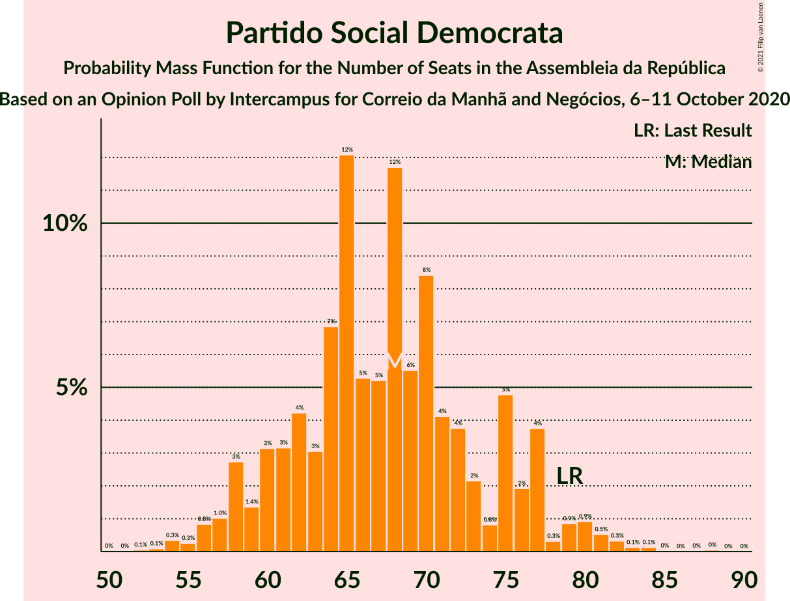
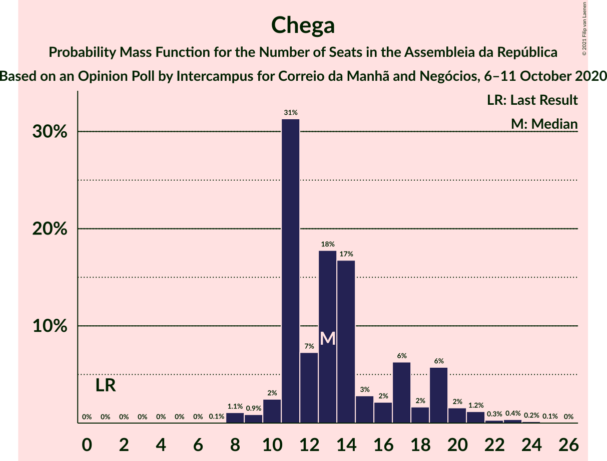
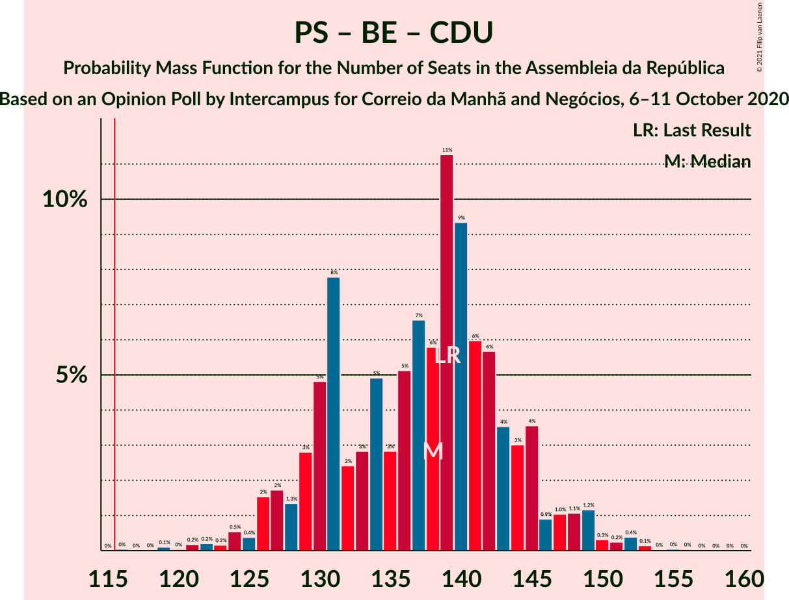
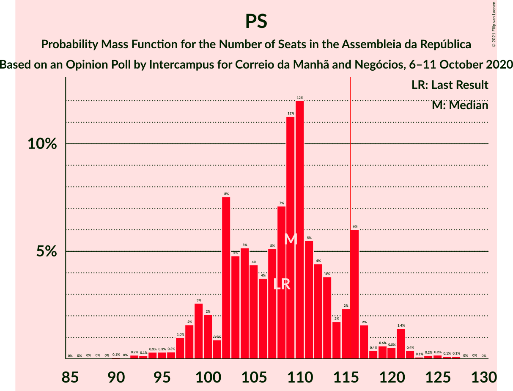

# Opinion Poll by Intercampus for Correio da Manhã and Negócios, 6–11 October 2020

<a href="#voting-intentions">Voting Intentions</a> | <a href="#seats">Seats</a> | <a href="#coalitions">Coalitions</a> | <a href="#technical-information">Technical Information</a>

## Voting Intentions

### Confidence Intervals

| Party | Last Result | Poll Result | 80% Confidence Interval | 90% Confidence Interval | 95% Confidence Interval | 99% Confidence Interval |
|:-----:|:-----------:|:-----------:|:-----------------------:|:-----------------------:|:-----------------------:|:-----------------------:|
| Partido Socialista | 36.4% | 37.5% | 35.1–40.1% |34.4–40.8% |33.8–41.4% |32.6–42.7% |
| Partido Social Democrata | 27.8% | 24.8% | 22.6–27.1% |22.0–27.7% |21.5–28.3% |20.5–29.5% |
| Bloco de Esquerda | 9.5% | 11.0% | 9.5–12.8% |9.1–13.3% |8.8–13.7% |8.1–14.6% |
| Chega | 1.3% | 7.8% | 6.5–9.3% |6.2–9.8% |5.9–10.2% |5.4–10.9% |
| Coligação Democrática Unitária | 6.3% | 4.4% | 3.5–5.6% |3.2–6.0% |3.0–6.3% |2.6–6.9% |
| CDS–Partido Popular | 4.2% | 4.0% | 3.2–5.3% |3.0–5.6% |2.8–5.9% |2.4–6.5% |
| Pessoas–Animais–Natureza | 3.3% | 4.0% | 3.2–5.3% |3.0–5.6% |2.8–5.9% |2.4–6.5% |
| Iniciativa Liberal | 1.3% | 2.4% | 1.8–3.4% |1.6–3.7% |1.5–4.0% |1.2–4.5% |
| LIVRE | 1.1% | 0.3% | 0.2–0.9% |0.1–1.0% |0.1–1.2% |0.0–1.5% |

*Note:* The poll result column reflects the actual value used in the calculations. Published results may vary slightly, and in addition be rounded to fewer digits.

## Seats

### Confidence Intervals

| Party | Last Result | Median | 80% Confidence Interval | 90% Confidence Interval | 95% Confidence Interval | 99% Confidence Interval |
|:-----:|:-----------:|:------:|:-----------------------:|:-----------------------:|:-----------------------:|:-----------------------:|
| <a href="#partido-socialista">Partido Socialista</a> | 108 | 109 | 102–116 |99–117 |98–120 |93–124 |
| <a href="#partido-social-democrata">Partido Social Democrata</a> | 79 | 68 | 61–75 |58–77 |57–79 |54–82 |
| <a href="#bloco-de-esquerda">Bloco de Esquerda</a> | 19 | 23 | 19–27 |18–28 |17–30 |16–33 |
| <a href="#chega">Chega</a> | 1 | 13 | 11–18 |11–19 |10–20 |8–23 |
| <a href="#coligação-democrática-unitária">Coligação Democrática Unitária</a> | 12 | 6 | 4–8 |4–10 |3–11 |2–14 |
| <a href="#cds–partido-popular">CDS–Partido Popular</a> | 5 | 4 | 2–5 |2–6 |1–8 |1–10 |
| <a href="#pessoas–animais–natureza">Pessoas–Animais–Natureza</a> | 4 | 4 | 3–6 |3–8 |2–9 |2–11 |
| <a href="#iniciativa-liberal">Iniciativa Liberal</a> | 1 | 3 | 2–4 |1–4 |1–5 |1–6 |
| <a href="#livre">LIVRE</a> | 1 | 0 | 0 |0 |0–1 |0–1 |

### Partido Socialista

*For a full overview of the results for this party, see the [Partido Socialista](party-partidosocialista.html) page.*

| Number of Seats | Probability | Accumulated | Special Marks |
|:---------------:|:-----------:|:-----------:|:-------------:|
| 88 | 0% | 100% |  |
| 89 | 0% | 99.9% |  |
| 90 | 0.1% | 99.9% |  |
| 91 | 0% | 99.8% |  |
| 92 | 0.2% | 99.8% |  |
| 93 | 0.1% | 99.6% |  |
| 94 | 0.3% | 99.5% |  |
| 95 | 0.3% | 99.2% |  |
| 96 | 0.3% | 98.9% |  |
| 97 | 1.0% | 98.5% |  |
| 98 | 2% | 98% |  |
| 99 | 3% | 96% |  |
| 100 | 2% | 93% |  |
| 101 | 0.9% | 91% |  |
| 102 | 8% | 90% |  |
| 103 | 5% | 83% |  |
| 104 | 5% | 78% |  |
| 105 | 4% | 73% |  |
| 106 | 4% | 69% |  |
| 107 | 5% | 65% |  |
| 108 | 7% | 60% | Last Result |
| 109 | 11% | 53% | Median |
| 110 | 12% | 41% |  |
| 111 | 5% | 29% |  |
| 112 | 4% | 24% |  |
| 113 | 4% | 19% |  |
| 114 | 2% | 16% |  |
| 115 | 2% | 14% |  |
| 116 | 6% | 12% | Majority |
| 117 | 2% | 6% |  |
| 118 | 0.4% | 4% |  |
| 119 | 0.6% | 4% |  |
| 120 | 0.5% | 3% |  |
| 121 | 1.4% | 2% |  |
| 122 | 0.4% | 1.1% |  |
| 123 | 0.1% | 0.7% |  |
| 124 | 0.2% | 0.6% |  |
| 125 | 0.2% | 0.4% |  |
| 126 | 0.1% | 0.3% |  |
| 127 | 0.1% | 0.2% |  |
| 128 | 0% | 0% |  |

### Partido Social Democrata

*For a full overview of the results for this party, see the [Partido Social Democrata](party-partidosocialdemocrata.html) page.*

| Number of Seats | Probability | Accumulated | Special Marks |
|:---------------:|:-----------:|:-----------:|:-------------:|
| 51 | 0% | 100% |  |
| 52 | 0.1% | 99.9% |  |
| 53 | 0.1% | 99.9% |  |
| 54 | 0.3% | 99.8% |  |
| 55 | 0.3% | 99.5% |  |
| 56 | 0.8% | 99.2% |  |
| 57 | 1.0% | 98% |  |
| 58 | 3% | 97% |  |
| 59 | 1.4% | 95% |  |
| 60 | 3% | 93% |  |
| 61 | 3% | 90% |  |
| 62 | 4% | 87% |  |
| 63 | 3% | 83% |  |
| 64 | 7% | 80% |  |
| 65 | 12% | 73% |  |
| 66 | 5% | 61% |  |
| 67 | 5% | 55% |  |
| 68 | 12% | 50% | Median |
| 69 | 6% | 39% |  |
| 70 | 8% | 33% |  |
| 71 | 4% | 25% |  |
| 72 | 4% | 20% |  |
| 73 | 2% | 17% |  |
| 74 | 0.8% | 15% |  |
| 75 | 5% | 14% |  |
| 76 | 2% | 9% |  |
| 77 | 4% | 7% |  |
| 78 | 0.3% | 3% |  |
| 79 | 0.9% | 3% | Last Result |
| 80 | 0.9% | 2% |  |
| 81 | 0.5% | 1.2% |  |
| 82 | 0.3% | 0.7% |  |
| 83 | 0.1% | 0.4% |  |
| 84 | 0.1% | 0.3% |  |
| 85 | 0% | 0.1% |  |
| 86 | 0% | 0.1% |  |
| 87 | 0% | 0.1% |  |
| 88 | 0% | 0.1% |  |
| 89 | 0% | 0% |  |

### Bloco de Esquerda

*For a full overview of the results for this party, see the [Bloco de Esquerda](party-blocodeesquerda.html) page.*

| Number of Seats | Probability | Accumulated | Special Marks |
|:---------------:|:-----------:|:-----------:|:-------------:|
| 14 | 0.1% | 100% |  |
| 15 | 0.3% | 99.9% |  |
| 16 | 0.9% | 99.6% |  |
| 17 | 2% | 98.7% |  |
| 18 | 4% | 97% |  |
| 19 | 8% | 93% | Last Result |
| 20 | 6% | 85% |  |
| 21 | 9% | 78% |  |
| 22 | 17% | 69% |  |
| 23 | 19% | 51% | Median |
| 24 | 8% | 32% |  |
| 25 | 9% | 25% |  |
| 26 | 4% | 16% |  |
| 27 | 7% | 12% |  |
| 28 | 2% | 5% |  |
| 29 | 0.7% | 3% |  |
| 30 | 0.8% | 3% |  |
| 31 | 0.7% | 2% |  |
| 32 | 0.3% | 1.1% |  |
| 33 | 0.3% | 0.8% |  |
| 34 | 0.2% | 0.5% |  |
| 35 | 0.1% | 0.3% |  |
| 36 | 0.1% | 0.2% |  |
| 37 | 0.1% | 0.1% |  |
| 38 | 0% | 0% |  |

### Chega

*For a full overview of the results for this party, see the [Chega](party-chega.html) page.*

| Number of Seats | Probability | Accumulated | Special Marks |
|:---------------:|:-----------:|:-----------:|:-------------:|
| 1 | 0% | 100% | Last Result |
| 2 | 0% | 100% |  |
| 3 | 0% | 100% |  |
| 4 | 0% | 100% |  |
| 5 | 0% | 100% |  |
| 6 | 0% | 100% |  |
| 7 | 0.1% | 100% |  |
| 8 | 1.1% | 99.9% |  |
| 9 | 0.9% | 98.8% |  |
| 10 | 2% | 98% |  |
| 11 | 31% | 95% |  |
| 12 | 7% | 64% |  |
| 13 | 18% | 57% | Median |
| 14 | 17% | 39% |  |
| 15 | 3% | 22% |  |
| 16 | 2% | 20% |  |
| 17 | 6% | 17% |  |
| 18 | 2% | 11% |  |
| 19 | 6% | 9% |  |
| 20 | 2% | 4% |  |
| 21 | 1.2% | 2% |  |
| 22 | 0.3% | 0.9% |  |
| 23 | 0.4% | 0.6% |  |
| 24 | 0.2% | 0.3% |  |
| 25 | 0.1% | 0.1% |  |
| 26 | 0% | 0% |  |

### Coligação Democrática Unitária

*For a full overview of the results for this party, see the [Coligação Democrática Unitária](party-coligaçãodemocráticaunitária.html) page.*

| Number of Seats | Probability | Accumulated | Special Marks |
|:---------------:|:-----------:|:-----------:|:-------------:|
| 2 | 1.0% | 100% |  |
| 3 | 3% | 99.0% |  |
| 4 | 7% | 96% |  |
| 5 | 22% | 89% |  |
| 6 | 32% | 67% | Median |
| 7 | 18% | 36% |  |
| 8 | 9% | 18% |  |
| 9 | 2% | 8% |  |
| 10 | 4% | 7% |  |
| 11 | 0.4% | 3% |  |
| 12 | 1.1% | 2% | Last Result |
| 13 | 0.3% | 1.1% |  |
| 14 | 0.7% | 0.7% |  |
| 15 | 0% | 0% |  |

### CDS–Partido Popular

*For a full overview of the results for this party, see the [CDS–Partido Popular](party-cds–partidopopular.html) page.*

| Number of Seats | Probability | Accumulated | Special Marks |
|:---------------:|:-----------:|:-----------:|:-------------:|
| 1 | 3% | 100% |  |
| 2 | 20% | 97% |  |
| 3 | 15% | 77% |  |
| 4 | 15% | 62% | Median |
| 5 | 41% | 48% | Last Result |
| 6 | 2% | 7% |  |
| 7 | 2% | 5% |  |
| 8 | 2% | 3% |  |
| 9 | 0.9% | 2% |  |
| 10 | 0.5% | 0.7% |  |
| 11 | 0.1% | 0.3% |  |
| 12 | 0.1% | 0.2% |  |
| 13 | 0.1% | 0.1% |  |
| 14 | 0% | 0% |  |

### Pessoas–Animais–Natureza

*For a full overview of the results for this party, see the [Pessoas–Animais–Natureza](party-pessoas–animais–natureza.html) page.*

| Number of Seats | Probability | Accumulated | Special Marks |
|:---------------:|:-----------:|:-----------:|:-------------:|
| 2 | 5% | 100% |  |
| 3 | 13% | 95% |  |
| 4 | 33% | 82% | Last Result, Median |
| 5 | 8% | 49% |  |
| 6 | 33% | 41% |  |
| 7 | 1.2% | 8% |  |
| 8 | 3% | 7% |  |
| 9 | 3% | 4% |  |
| 10 | 0.5% | 1.1% |  |
| 11 | 0.5% | 0.7% |  |
| 12 | 0.1% | 0.1% |  |
| 13 | 0% | 0% |  |

### Iniciativa Liberal

*For a full overview of the results for this party, see the [Iniciativa Liberal](party-iniciativaliberal.html) page.*

| Number of Seats | Probability | Accumulated | Special Marks |
|:---------------:|:-----------:|:-----------:|:-------------:|
| 0 | 0.1% | 100% |  |
| 1 | 8% | 99.9% | Last Result |
| 2 | 9% | 92% |  |
| 3 | 67% | 83% | Median |
| 4 | 11% | 16% |  |
| 5 | 4% | 5% |  |
| 6 | 0.9% | 0.9% |  |
| 7 | 0% | 0% |  |

### LIVRE

*For a full overview of the results for this party, see the [LIVRE](party-livre.html) page.*

| Number of Seats | Probability | Accumulated | Special Marks |
|:---------------:|:-----------:|:-----------:|:-------------:|
| 0 | 96% | 100% | Median |
| 1 | 4% | 4% | Last Result |
| 2 | 0% | 0% |  |

## Coalitions

### Confidence Intervals

| Coalition | Last Result | Median | Majority? | 80% Confidence Interval | 90% Confidence Interval | 95% Confidence Interval | 99% Confidence Interval |
|:---------:|:-----------:|:------:|:---------:|:-----------------------:|:-----------------------:|:-----------------------:|:-----------------------:|
| Partido Socialista – Bloco de Esquerda – Coligação Democrática Unitária | 139 | 138 | 100% | 130–144 | 128–146 | 126–148 | 122–152 |
| Partido Socialista – Bloco de Esquerda | 127 | 132 | 99.6% | 123–137 | 122–139 | 120–143 | 116–145 |
| Partido Socialista – Coligação Democrática Unitária | 120 | 115 | 43% | 107–121 | 105–124 | 103–126 | 99–131 |
| Partido Socialista | 108 | 109 | 12% | 102–116 | 99–117 | 98–120 | 93–124 |
| Partido Social Democrata – CDS–Partido Popular | 84 | 71 | 0% | 64–79 | 63–82 | 61–82 | 58–87 |

### Partido Socialista – Bloco de Esquerda – Coligação Democrática Unitária

| Number of Seats | Probability | Accumulated | Special Marks |
|:---------------:|:-----------:|:-----------:|:-------------:|
| 116 | 0% | 100% | Majority |
| 117 | 0% | 99.9% |  |
| 118 | 0% | 99.9% |  |
| 119 | 0.1% | 99.9% |  |
| 120 | 0% | 99.8% |  |
| 121 | 0.2% | 99.8% |  |
| 122 | 0.2% | 99.6% |  |
| 123 | 0.2% | 99.4% |  |
| 124 | 0.5% | 99.2% |  |
| 125 | 0.4% | 98.7% |  |
| 126 | 2% | 98% |  |
| 127 | 2% | 97% |  |
| 128 | 1.3% | 95% |  |
| 129 | 3% | 94% |  |
| 130 | 5% | 91% |  |
| 131 | 8% | 86% |  |
| 132 | 2% | 78% |  |
| 133 | 3% | 76% |  |
| 134 | 5% | 73% |  |
| 135 | 3% | 68% |  |
| 136 | 5% | 65% |  |
| 137 | 7% | 60% |  |
| 138 | 6% | 54% | Median |
| 139 | 11% | 48% | Last Result |
| 140 | 9% | 37% |  |
| 141 | 6% | 27% |  |
| 142 | 6% | 21% |  |
| 143 | 4% | 16% |  |
| 144 | 3% | 12% |  |
| 145 | 4% | 9% |  |
| 146 | 0.9% | 5% |  |
| 147 | 1.0% | 5% |  |
| 148 | 1.1% | 3% |  |
| 149 | 1.2% | 2% |  |
| 150 | 0.3% | 1.2% |  |
| 151 | 0.2% | 0.9% |  |
| 152 | 0.4% | 0.7% |  |
| 153 | 0.1% | 0.3% |  |
| 154 | 0% | 0.1% |  |
| 155 | 0% | 0.1% |  |
| 156 | 0% | 0.1% |  |
| 157 | 0% | 0% |  |

### Partido Socialista – Bloco de Esquerda

| Number of Seats | Probability | Accumulated | Special Marks |
|:---------------:|:-----------:|:-----------:|:-------------:|
| 110 | 0% | 100% |  |
| 111 | 0% | 99.9% |  |
| 112 | 0% | 99.9% |  |
| 113 | 0.1% | 99.9% |  |
| 114 | 0.1% | 99.8% |  |
| 115 | 0.1% | 99.7% |  |
| 116 | 0.3% | 99.6% | Majority |
| 117 | 0.5% | 99.4% |  |
| 118 | 0.3% | 98.8% |  |
| 119 | 0.4% | 98.5% |  |
| 120 | 0.9% | 98% |  |
| 121 | 1.1% | 97% |  |
| 122 | 3% | 96% |  |
| 123 | 5% | 93% |  |
| 124 | 2% | 88% |  |
| 125 | 3% | 87% |  |
| 126 | 9% | 83% |  |
| 127 | 6% | 74% | Last Result |
| 128 | 1.1% | 69% |  |
| 129 | 5% | 68% |  |
| 130 | 4% | 63% |  |
| 131 | 4% | 58% |  |
| 132 | 12% | 54% | Median |
| 133 | 9% | 42% |  |
| 134 | 10% | 33% |  |
| 135 | 2% | 23% |  |
| 136 | 3% | 20% |  |
| 137 | 9% | 17% |  |
| 138 | 1.2% | 8% |  |
| 139 | 2% | 7% |  |
| 140 | 0.8% | 5% |  |
| 141 | 0.9% | 4% |  |
| 142 | 0.4% | 3% |  |
| 143 | 2% | 3% |  |
| 144 | 0.3% | 1.0% |  |
| 145 | 0.2% | 0.7% |  |
| 146 | 0.2% | 0.5% |  |
| 147 | 0.1% | 0.3% |  |
| 148 | 0.1% | 0.2% |  |
| 149 | 0% | 0.1% |  |
| 150 | 0% | 0% |  |

### Partido Socialista – Coligação Democrática Unitária

| Number of Seats | Probability | Accumulated | Special Marks |
|:---------------:|:-----------:|:-----------:|:-------------:|
| 94 | 0% | 100% |  |
| 95 | 0% | 99.9% |  |
| 96 | 0% | 99.9% |  |
| 97 | 0.1% | 99.9% |  |
| 98 | 0.1% | 99.8% |  |
| 99 | 0.3% | 99.7% |  |
| 100 | 0.2% | 99.4% |  |
| 101 | 0.4% | 99.2% |  |
| 102 | 0.2% | 98.8% |  |
| 103 | 2% | 98.6% |  |
| 104 | 1.4% | 97% |  |
| 105 | 1.5% | 95% |  |
| 106 | 2% | 94% |  |
| 107 | 6% | 92% |  |
| 108 | 3% | 86% |  |
| 109 | 4% | 83% |  |
| 110 | 4% | 79% |  |
| 111 | 6% | 76% |  |
| 112 | 5% | 70% |  |
| 113 | 3% | 65% |  |
| 114 | 5% | 62% |  |
| 115 | 14% | 58% | Median |
| 116 | 9% | 43% | Majority |
| 117 | 6% | 34% |  |
| 118 | 6% | 28% |  |
| 119 | 5% | 22% |  |
| 120 | 2% | 17% | Last Result |
| 121 | 6% | 15% |  |
| 122 | 2% | 9% |  |
| 123 | 1.1% | 7% |  |
| 124 | 2% | 6% |  |
| 125 | 0.6% | 4% |  |
| 126 | 0.8% | 3% |  |
| 127 | 1.1% | 2% |  |
| 128 | 0.2% | 1.2% |  |
| 129 | 0.2% | 1.0% |  |
| 130 | 0.3% | 0.8% |  |
| 131 | 0.3% | 0.5% |  |
| 132 | 0.1% | 0.2% |  |
| 133 | 0.1% | 0.1% |  |
| 134 | 0% | 0.1% |  |
| 135 | 0% | 0% |  |

### Partido Socialista

| Number of Seats | Probability | Accumulated | Special Marks |
|:---------------:|:-----------:|:-----------:|:-------------:|
| 88 | 0% | 100% |  |
| 89 | 0% | 99.9% |  |
| 90 | 0.1% | 99.9% |  |
| 91 | 0% | 99.8% |  |
| 92 | 0.2% | 99.8% |  |
| 93 | 0.1% | 99.6% |  |
| 94 | 0.3% | 99.5% |  |
| 95 | 0.3% | 99.2% |  |
| 96 | 0.3% | 98.9% |  |
| 97 | 1.0% | 98.5% |  |
| 98 | 2% | 98% |  |
| 99 | 3% | 96% |  |
| 100 | 2% | 93% |  |
| 101 | 0.9% | 91% |  |
| 102 | 8% | 90% |  |
| 103 | 5% | 83% |  |
| 104 | 5% | 78% |  |
| 105 | 4% | 73% |  |
| 106 | 4% | 69% |  |
| 107 | 5% | 65% |  |
| 108 | 7% | 60% | Last Result |
| 109 | 11% | 53% | Median |
| 110 | 12% | 41% |  |
| 111 | 5% | 29% |  |
| 112 | 4% | 24% |  |
| 113 | 4% | 19% |  |
| 114 | 2% | 16% |  |
| 115 | 2% | 14% |  |
| 116 | 6% | 12% | Majority |
| 117 | 2% | 6% |  |
| 118 | 0.4% | 4% |  |
| 119 | 0.6% | 4% |  |
| 120 | 0.5% | 3% |  |
| 121 | 1.4% | 2% |  |
| 122 | 0.4% | 1.1% |  |
| 123 | 0.1% | 0.7% |  |
| 124 | 0.2% | 0.6% |  |
| 125 | 0.2% | 0.4% |  |
| 126 | 0.1% | 0.3% |  |
| 127 | 0.1% | 0.2% |  |
| 128 | 0% | 0% |  |

### Partido Social Democrata – CDS–Partido Popular

| Number of Seats | Probability | Accumulated | Special Marks |
|:---------------:|:-----------:|:-----------:|:-------------:|
| 55 | 0% | 100% |  |
| 56 | 0.1% | 99.9% |  |
| 57 | 0.1% | 99.8% |  |
| 58 | 0.3% | 99.7% |  |
| 59 | 0.5% | 99.4% |  |
| 60 | 0.6% | 98.9% |  |
| 61 | 1.3% | 98% |  |
| 62 | 2% | 97% |  |
| 63 | 2% | 95% |  |
| 64 | 4% | 94% |  |
| 65 | 2% | 89% |  |
| 66 | 2% | 87% |  |
| 67 | 10% | 85% |  |
| 68 | 5% | 74% |  |
| 69 | 5% | 69% |  |
| 70 | 11% | 64% |  |
| 71 | 5% | 53% |  |
| 72 | 6% | 49% | Median |
| 73 | 11% | 43% |  |
| 74 | 5% | 32% |  |
| 75 | 4% | 27% |  |
| 76 | 4% | 23% |  |
| 77 | 3% | 19% |  |
| 78 | 5% | 16% |  |
| 79 | 2% | 10% |  |
| 80 | 1.2% | 9% |  |
| 81 | 2% | 8% |  |
| 82 | 4% | 6% |  |
| 83 | 0.3% | 2% |  |
| 84 | 0.4% | 2% | Last Result |
| 85 | 0.6% | 1.5% |  |
| 86 | 0.3% | 0.9% |  |
| 87 | 0.4% | 0.6% |  |
| 88 | 0.1% | 0.3% |  |
| 89 | 0.1% | 0.2% |  |
| 90 | 0% | 0.1% |  |
| 91 | 0% | 0.1% |  |
| 92 | 0% | 0.1% |  |
| 93 | 0% | 0% |  |

## Technical Information

### Opinion Poll

+ **Polling firm:** Intercampus
+ **Commissioner(s):** Correio da Manhã and Negócios
+ **Fieldwork period:** 6–11 October 2020

### Calculations

+ **Sample size:** 618
+ **Simulations done:** 1,048,576
+ **Error estimate:** 1.51%

