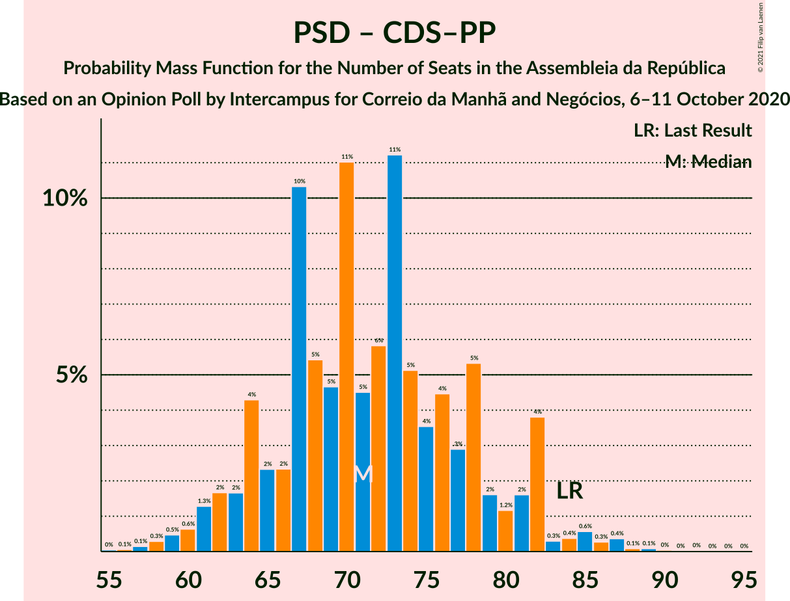

# Opinion Poll by Intercampus for Correio da Manhã and Negócios, 6–11 October 2020

<a href="#voting-intentions">Voting Intentions</a> | <a href="#seats">Seats</a> | <a href="#coalitions">Coalitions</a> | <a href="#technical-information">Technical Information</a>

## Voting Intentions

### Confidence Intervals

| Party | Last Result | Poll Result | 80% Confidence Interval | 90% Confidence Interval | 95% Confidence Interval | 99% Confidence Interval |
|:-----:|:-----------:|:-----------:|:-----------------------:|:-----------------------:|:-----------------------:|:-----------------------:|
| Partido Socialista | 36.4% | 37.5% | 35.1–40.1% |34.4–40.8% |33.8–41.4% |32.6–42.7% |
| Partido Social Democrata | 27.8% | 24.8% | 22.6–27.1% |22.0–27.7% |21.5–28.3% |20.5–29.5% |
| Bloco de Esquerda | 9.5% | 11.0% | 9.5–12.8% |9.1–13.3% |8.8–13.7% |8.1–14.6% |
| Chega | 1.3% | 7.8% | 6.5–9.3% |6.2–9.8% |5.9–10.2% |5.4–10.9% |
| Coligação Democrática Unitária | 6.3% | 4.4% | 3.5–5.6% |3.2–6.0% |3.0–6.3% |2.6–6.9% |
| CDS–Partido Popular | 4.2% | 4.0% | 3.2–5.3% |3.0–5.6% |2.8–5.9% |2.4–6.5% |
| Pessoas–Animais–Natureza | 3.3% | 4.0% | 3.2–5.3% |3.0–5.6% |2.8–5.9% |2.4–6.5% |
| Iniciativa Liberal | 1.3% | 2.4% | 1.8–3.4% |1.6–3.7% |1.5–4.0% |1.2–4.5% |
| LIVRE | 1.1% | 0.3% | 0.2–0.9% |0.1–1.0% |0.1–1.2% |0.0–1.5% |

*Note:* The poll result column reflects the actual value used in the calculations. Published results may vary slightly, and in addition be rounded to fewer digits.

## Seats

### Confidence Intervals

| Party | Last Result | Median | 80% Confidence Interval | 90% Confidence Interval | 95% Confidence Interval | 99% Confidence Interval |
|:-----:|:-----------:|:------:|:-----------------------:|:-----------------------:|:-----------------------:|:-----------------------:|
| <a href="#partido-socialista">Partido Socialista</a> | 108 | 109 | 100–115 |99–117 |97–120 |94–124 |
| <a href="#partido-social-democrata">Partido Social Democrata</a> | 79 | 68 | 60–75 |58–77 |57–79 |54–82 |
| <a href="#bloco-de-esquerda">Bloco de Esquerda</a> | 19 | 23 | 19–26 |18–28 |17–30 |15–34 |
| <a href="#chega">Chega</a> | 1 | 13 | 11–16 |11–19 |10–20 |8–23 |
| <a href="#coligação-democrática-unitária">Coligação Democrática Unitária</a> | 12 | 6 | 4–8 |3–10 |3–10 |2–13 |
| <a href="#cds–partido-popular">CDS–Partido Popular</a> | 5 | 4 | 2–5 |2–7 |1–8 |1–10 |
| <a href="#pessoas–animais–natureza">Pessoas–Animais–Natureza</a> | 4 | 5 | 3–7 |2–8 |2–9 |2–11 |
| <a href="#iniciativa-liberal">Iniciativa Liberal</a> | 1 | 3 | 1–4 |1–5 |1–5 |1–6 |
| <a href="#livre">LIVRE</a> | 1 | 0 | 0 |0 |0–1 |0–1 |

### Partido Socialista

*For a full overview of the results for this party, see the [Partido Socialista](party-partidosocialista.html) page.*

| Number of Seats | Probability | Accumulated | Special Marks |
|:---------------:|:-----------:|:-----------:|:-------------:|
| 87 | 0% | 100% |  |
| 88 | 0% | 99.9% |  |
| 89 | 0% | 99.9% |  |
| 90 | 0.1% | 99.9% |  |
| 91 | 0% | 99.8% |  |
| 92 | 0.2% | 99.8% |  |
| 93 | 0.1% | 99.6% |  |
| 94 | 0.3% | 99.5% |  |
| 95 | 0.3% | 99.3% |  |
| 96 | 0.5% | 99.0% |  |
| 97 | 1.4% | 98% |  |
| 98 | 1.4% | 97% |  |
| 99 | 4% | 96% |  |
| 100 | 2% | 92% |  |
| 101 | 0.7% | 90% |  |
| 102 | 3% | 89% |  |
| 103 | 1.3% | 86% |  |
| 104 | 5% | 84% |  |
| 105 | 6% | 80% |  |
| 106 | 5% | 74% |  |
| 107 | 8% | 69% |  |
| 108 | 4% | 61% | Last Result |
| 109 | 22% | 58% | Median |
| 110 | 7% | 35% |  |
| 111 | 4% | 28% |  |
| 112 | 5% | 24% |  |
| 113 | 4% | 19% |  |
| 114 | 3% | 15% |  |
| 115 | 3% | 12% |  |
| 116 | 5% | 10% | Majority |
| 117 | 1.1% | 5% |  |
| 118 | 0.3% | 4% |  |
| 119 | 0.9% | 4% |  |
| 120 | 0.6% | 3% |  |
| 121 | 0.9% | 2% |  |
| 122 | 0.7% | 1.4% |  |
| 123 | 0.1% | 0.7% |  |
| 124 | 0.2% | 0.6% |  |
| 125 | 0.2% | 0.4% |  |
| 126 | 0.1% | 0.2% |  |
| 127 | 0% | 0.1% |  |
| 128 | 0% | 0.1% |  |
| 129 | 0% | 0.1% |  |
| 130 | 0% | 0% |  |

### Partido Social Democrata

*For a full overview of the results for this party, see the [Partido Social Democrata](party-partidosocialdemocrata.html) page.*

| Number of Seats | Probability | Accumulated | Special Marks |
|:---------------:|:-----------:|:-----------:|:-------------:|
| 50 | 0% | 100% |  |
| 51 | 0% | 99.9% |  |
| 52 | 0% | 99.9% |  |
| 53 | 0.1% | 99.9% |  |
| 54 | 0.6% | 99.8% |  |
| 55 | 0.3% | 99.2% |  |
| 56 | 0.7% | 98.9% |  |
| 57 | 1.3% | 98% |  |
| 58 | 3% | 97% |  |
| 59 | 2% | 94% |  |
| 60 | 5% | 92% |  |
| 61 | 1.3% | 87% |  |
| 62 | 6% | 86% |  |
| 63 | 3% | 80% |  |
| 64 | 4% | 77% |  |
| 65 | 14% | 73% |  |
| 66 | 4% | 59% |  |
| 67 | 4% | 55% |  |
| 68 | 3% | 50% | Median |
| 69 | 5% | 48% |  |
| 70 | 17% | 43% |  |
| 71 | 5% | 26% |  |
| 72 | 6% | 21% |  |
| 73 | 1.1% | 15% |  |
| 74 | 0.9% | 14% |  |
| 75 | 3% | 13% |  |
| 76 | 3% | 10% |  |
| 77 | 4% | 7% |  |
| 78 | 0.4% | 3% |  |
| 79 | 0.7% | 3% | Last Result |
| 80 | 0.2% | 2% |  |
| 81 | 0.9% | 2% |  |
| 82 | 0.6% | 0.9% |  |
| 83 | 0.1% | 0.3% |  |
| 84 | 0.1% | 0.2% |  |
| 85 | 0% | 0.1% |  |
| 86 | 0% | 0.1% |  |
| 87 | 0% | 0.1% |  |
| 88 | 0% | 0% |  |

### Bloco de Esquerda

*For a full overview of the results for this party, see the [Bloco de Esquerda](party-blocodeesquerda.html) page.*

| Number of Seats | Probability | Accumulated | Special Marks |
|:---------------:|:-----------:|:-----------:|:-------------:|
| 14 | 0.1% | 100% |  |
| 15 | 0.5% | 99.9% |  |
| 16 | 1.1% | 99.4% |  |
| 17 | 2% | 98% |  |
| 18 | 3% | 96% |  |
| 19 | 7% | 94% | Last Result |
| 20 | 6% | 87% |  |
| 21 | 7% | 81% |  |
| 22 | 19% | 74% |  |
| 23 | 24% | 55% | Median |
| 24 | 4% | 32% |  |
| 25 | 13% | 27% |  |
| 26 | 4% | 14% |  |
| 27 | 4% | 10% |  |
| 28 | 2% | 6% |  |
| 29 | 0.8% | 4% |  |
| 30 | 1.2% | 3% |  |
| 31 | 1.1% | 2% |  |
| 32 | 0.4% | 1.1% |  |
| 33 | 0.2% | 0.7% |  |
| 34 | 0.2% | 0.5% |  |
| 35 | 0% | 0.3% |  |
| 36 | 0.1% | 0.2% |  |
| 37 | 0.1% | 0.1% |  |
| 38 | 0% | 0% |  |

### Chega

*For a full overview of the results for this party, see the [Chega](party-chega.html) page.*

| Number of Seats | Probability | Accumulated | Special Marks |
|:---------------:|:-----------:|:-----------:|:-------------:|
| 1 | 0% | 100% | Last Result |
| 2 | 0% | 100% |  |
| 3 | 0% | 100% |  |
| 4 | 0% | 100% |  |
| 5 | 0% | 100% |  |
| 6 | 0% | 100% |  |
| 7 | 0% | 100% |  |
| 8 | 1.4% | 99.9% |  |
| 9 | 0.9% | 98% |  |
| 10 | 2% | 98% |  |
| 11 | 34% | 96% |  |
| 12 | 5% | 62% |  |
| 13 | 22% | 57% | Median |
| 14 | 19% | 35% |  |
| 15 | 3% | 16% |  |
| 16 | 3% | 13% |  |
| 17 | 3% | 10% |  |
| 18 | 1.5% | 7% |  |
| 19 | 2% | 5% |  |
| 20 | 2% | 3% |  |
| 21 | 0.6% | 1.5% |  |
| 22 | 0.3% | 0.9% |  |
| 23 | 0.3% | 0.6% |  |
| 24 | 0.2% | 0.3% |  |
| 25 | 0.1% | 0.1% |  |
| 26 | 0% | 0.1% |  |
| 27 | 0% | 0% |  |

### Coligação Democrática Unitária

*For a full overview of the results for this party, see the [Coligação Democrática Unitária](party-coligaçãodemocráticaunitária.html) page.*

| Number of Seats | Probability | Accumulated | Special Marks |
|:---------------:|:-----------:|:-----------:|:-------------:|
| 2 | 1.3% | 100% |  |
| 3 | 4% | 98.7% |  |
| 4 | 9% | 95% |  |
| 5 | 10% | 86% |  |
| 6 | 38% | 76% | Median |
| 7 | 17% | 38% |  |
| 8 | 12% | 21% |  |
| 9 | 3% | 10% |  |
| 10 | 6% | 7% |  |
| 11 | 0.4% | 2% |  |
| 12 | 0.3% | 1.1% | Last Result |
| 13 | 0.4% | 0.8% |  |
| 14 | 0.4% | 0.5% |  |
| 15 | 0% | 0% |  |

### CDS–Partido Popular

*For a full overview of the results for this party, see the [CDS–Partido Popular](party-cds–partidopopular.html) page.*

| Number of Seats | Probability | Accumulated | Special Marks |
|:---------------:|:-----------:|:-----------:|:-------------:|
| 1 | 5% | 100% |  |
| 2 | 21% | 95% |  |
| 3 | 17% | 74% |  |
| 4 | 14% | 57% | Median |
| 5 | 33% | 43% | Last Result |
| 6 | 2% | 9% |  |
| 7 | 2% | 7% |  |
| 8 | 2% | 5% |  |
| 9 | 1.3% | 2% |  |
| 10 | 0.8% | 1.1% |  |
| 11 | 0.1% | 0.3% |  |
| 12 | 0.1% | 0.2% |  |
| 13 | 0% | 0.1% |  |
| 14 | 0% | 0.1% |  |
| 15 | 0% | 0% |  |

### Pessoas–Animais–Natureza

*For a full overview of the results for this party, see the [Pessoas–Animais–Natureza](party-pessoas–animais–natureza.html) page.*

| Number of Seats | Probability | Accumulated | Special Marks |
|:---------------:|:-----------:|:-----------:|:-------------:|
| 2 | 6% | 100% |  |
| 3 | 13% | 94% |  |
| 4 | 30% | 82% | Last Result |
| 5 | 10% | 52% | Median |
| 6 | 31% | 41% |  |
| 7 | 0.9% | 10% |  |
| 8 | 5% | 9% |  |
| 9 | 4% | 5% |  |
| 10 | 0.5% | 1.1% |  |
| 11 | 0.5% | 0.7% |  |
| 12 | 0.2% | 0.2% |  |
| 13 | 0% | 0% |  |

### Iniciativa Liberal

*For a full overview of the results for this party, see the [Iniciativa Liberal](party-iniciativaliberal.html) page.*

| Number of Seats | Probability | Accumulated | Special Marks |
|:---------------:|:-----------:|:-----------:|:-------------:|
| 1 | 12% | 100% | Last Result |
| 2 | 7% | 88% |  |
| 3 | 64% | 81% | Median |
| 4 | 11% | 17% |  |
| 5 | 5% | 6% |  |
| 6 | 1.2% | 1.3% |  |
| 7 | 0% | 0% |  |

### LIVRE

*For a full overview of the results for this party, see the [LIVRE](party-livre.html) page.*

| Number of Seats | Probability | Accumulated | Special Marks |
|:---------------:|:-----------:|:-----------:|:-------------:|
| 0 | 96% | 100% | Median |
| 1 | 4% | 4% | Last Result |
| 2 | 0% | 0% |  |

## Coalitions

### Confidence Intervals

| Coalition | Last Result | Median | Majority? | 80% Confidence Interval | 90% Confidence Interval | 95% Confidence Interval | 99% Confidence Interval |
|:---------:|:-----------:|:------:|:---------:|:-----------------------:|:-----------------------:|:-----------------------:|:-----------------------:|
| Partido Socialista – Bloco de Esquerda – Coligação Democrática Unitária | 139 | 139 | 100% | 129–145 | 127–146 | 126–148 | 123–152 |
| Partido Socialista – Bloco de Esquerda | 127 | 132 | 99.6% | 123–137 | 122–140 | 120–143 | 117–145 |
| Partido Socialista – Coligação Democrática Unitária | 120 | 115 | 46% | 107–121 | 103–124 | 103–126 | 99–131 |
| Partido Socialista | 108 | 109 | 10% | 100–115 | 99–117 | 97–120 | 94–124 |
| Partido Social Democrata – CDS–Partido Popular | 84 | 72 | 0% | 64–79 | 63–81 | 61–82 | 58–87 |

### Partido Socialista – Bloco de Esquerda – Coligação Democrática Unitária

| Number of Seats | Probability | Accumulated | Special Marks |
|:---------------:|:-----------:|:-----------:|:-------------:|
| 116 | 0% | 100% | Majority |
| 117 | 0% | 99.9% |  |
| 118 | 0% | 99.9% |  |
| 119 | 0.1% | 99.9% |  |
| 120 | 0% | 99.8% |  |
| 121 | 0.1% | 99.8% |  |
| 122 | 0.1% | 99.7% |  |
| 123 | 0.2% | 99.5% |  |
| 124 | 0.8% | 99.3% |  |
| 125 | 0.4% | 98.5% |  |
| 126 | 3% | 98% |  |
| 127 | 2% | 95% |  |
| 128 | 2% | 94% |  |
| 129 | 4% | 92% |  |
| 130 | 3% | 88% |  |
| 131 | 4% | 85% |  |
| 132 | 2% | 81% |  |
| 133 | 5% | 79% |  |
| 134 | 2% | 74% |  |
| 135 | 2% | 72% |  |
| 136 | 5% | 70% |  |
| 137 | 4% | 65% |  |
| 138 | 5% | 61% | Median |
| 139 | 12% | 56% | Last Result |
| 140 | 16% | 44% |  |
| 141 | 9% | 28% |  |
| 142 | 2% | 19% |  |
| 143 | 4% | 17% |  |
| 144 | 1.5% | 13% |  |
| 145 | 5% | 11% |  |
| 146 | 1.1% | 6% |  |
| 147 | 0.7% | 5% |  |
| 148 | 2% | 4% |  |
| 149 | 0.3% | 2% |  |
| 150 | 0.5% | 2% |  |
| 151 | 0.3% | 1.2% |  |
| 152 | 0.7% | 0.9% |  |
| 153 | 0.1% | 0.2% |  |
| 154 | 0% | 0.2% |  |
| 155 | 0.1% | 0.1% |  |
| 156 | 0% | 0.1% |  |
| 157 | 0% | 0% |  |

### Partido Socialista – Bloco de Esquerda

| Number of Seats | Probability | Accumulated | Special Marks |
|:---------------:|:-----------:|:-----------:|:-------------:|
| 110 | 0% | 100% |  |
| 111 | 0% | 99.9% |  |
| 112 | 0% | 99.9% |  |
| 113 | 0% | 99.9% |  |
| 114 | 0.1% | 99.9% |  |
| 115 | 0.1% | 99.8% |  |
| 116 | 0.1% | 99.6% | Majority |
| 117 | 0.7% | 99.5% |  |
| 118 | 0.3% | 98.8% |  |
| 119 | 0.4% | 98.5% |  |
| 120 | 0.7% | 98% |  |
| 121 | 2% | 97% |  |
| 122 | 5% | 96% |  |
| 123 | 2% | 91% |  |
| 124 | 2% | 89% |  |
| 125 | 4% | 87% |  |
| 126 | 7% | 83% |  |
| 127 | 5% | 76% | Last Result |
| 128 | 1.1% | 70% |  |
| 129 | 3% | 69% |  |
| 130 | 2% | 66% |  |
| 131 | 2% | 64% |  |
| 132 | 14% | 62% | Median |
| 133 | 12% | 48% |  |
| 134 | 15% | 36% |  |
| 135 | 2% | 22% |  |
| 136 | 2% | 19% |  |
| 137 | 9% | 18% |  |
| 138 | 1.0% | 8% |  |
| 139 | 2% | 7% |  |
| 140 | 0.8% | 5% |  |
| 141 | 1.1% | 5% |  |
| 142 | 0.5% | 3% |  |
| 143 | 2% | 3% |  |
| 144 | 0.2% | 1.0% |  |
| 145 | 0.3% | 0.8% |  |
| 146 | 0.2% | 0.5% |  |
| 147 | 0.2% | 0.3% |  |
| 148 | 0% | 0.1% |  |
| 149 | 0% | 0.1% |  |
| 150 | 0% | 0% |  |

### Partido Socialista – Coligação Democrática Unitária

| Number of Seats | Probability | Accumulated | Special Marks |
|:---------------:|:-----------:|:-----------:|:-------------:|
| 94 | 0% | 100% |  |
| 95 | 0.1% | 99.9% |  |
| 96 | 0% | 99.9% |  |
| 97 | 0% | 99.8% |  |
| 98 | 0.1% | 99.8% |  |
| 99 | 0.2% | 99.7% |  |
| 100 | 0.2% | 99.5% |  |
| 101 | 0.5% | 99.3% |  |
| 102 | 0.3% | 98.8% |  |
| 103 | 4% | 98.5% |  |
| 104 | 1.1% | 95% |  |
| 105 | 2% | 93% |  |
| 106 | 1.1% | 91% |  |
| 107 | 3% | 90% |  |
| 108 | 3% | 87% |  |
| 109 | 2% | 84% |  |
| 110 | 2% | 82% |  |
| 111 | 4% | 81% |  |
| 112 | 6% | 76% |  |
| 113 | 2% | 70% |  |
| 114 | 7% | 68% |  |
| 115 | 14% | 61% | Median |
| 116 | 11% | 46% | Majority |
| 117 | 5% | 36% |  |
| 118 | 12% | 30% |  |
| 119 | 3% | 18% |  |
| 120 | 2% | 15% | Last Result |
| 121 | 3% | 13% |  |
| 122 | 0.8% | 10% |  |
| 123 | 2% | 9% |  |
| 124 | 4% | 8% |  |
| 125 | 0.3% | 4% |  |
| 126 | 1.3% | 3% |  |
| 127 | 0.3% | 2% |  |
| 128 | 0.3% | 2% |  |
| 129 | 0.3% | 1.3% |  |
| 130 | 0.2% | 1.0% |  |
| 131 | 0.6% | 0.8% |  |
| 132 | 0.1% | 0.2% |  |
| 133 | 0.1% | 0.2% |  |
| 134 | 0.1% | 0.1% |  |
| 135 | 0% | 0% |  |

### Partido Socialista

| Number of Seats | Probability | Accumulated | Special Marks |
|:---------------:|:-----------:|:-----------:|:-------------:|
| 87 | 0% | 100% |  |
| 88 | 0% | 99.9% |  |
| 89 | 0% | 99.9% |  |
| 90 | 0.1% | 99.9% |  |
| 91 | 0% | 99.8% |  |
| 92 | 0.2% | 99.8% |  |
| 93 | 0.1% | 99.6% |  |
| 94 | 0.3% | 99.5% |  |
| 95 | 0.3% | 99.3% |  |
| 96 | 0.5% | 99.0% |  |
| 97 | 1.4% | 98% |  |
| 98 | 1.4% | 97% |  |
| 99 | 4% | 96% |  |
| 100 | 2% | 92% |  |
| 101 | 0.7% | 90% |  |
| 102 | 3% | 89% |  |
| 103 | 1.3% | 86% |  |
| 104 | 5% | 84% |  |
| 105 | 6% | 80% |  |
| 106 | 5% | 74% |  |
| 107 | 8% | 69% |  |
| 108 | 4% | 61% | Last Result |
| 109 | 22% | 58% | Median |
| 110 | 7% | 35% |  |
| 111 | 4% | 28% |  |
| 112 | 5% | 24% |  |
| 113 | 4% | 19% |  |
| 114 | 3% | 15% |  |
| 115 | 3% | 12% |  |
| 116 | 5% | 10% | Majority |
| 117 | 1.1% | 5% |  |
| 118 | 0.3% | 4% |  |
| 119 | 0.9% | 4% |  |
| 120 | 0.6% | 3% |  |
| 121 | 0.9% | 2% |  |
| 122 | 0.7% | 1.4% |  |
| 123 | 0.1% | 0.7% |  |
| 124 | 0.2% | 0.6% |  |
| 125 | 0.2% | 0.4% |  |
| 126 | 0.1% | 0.2% |  |
| 127 | 0% | 0.1% |  |
| 128 | 0% | 0.1% |  |
| 129 | 0% | 0.1% |  |
| 130 | 0% | 0% |  |

### Partido Social Democrata – CDS–Partido Popular

| Number of Seats | Probability | Accumulated | Special Marks |
|:---------------:|:-----------:|:-----------:|:-------------:|
| 54 | 0% | 100% |  |
| 55 | 0% | 99.9% |  |
| 56 | 0.1% | 99.9% |  |
| 57 | 0.1% | 99.8% |  |
| 58 | 0.5% | 99.7% |  |
| 59 | 0.5% | 99.2% |  |
| 60 | 0.4% | 98.7% |  |
| 61 | 2% | 98% |  |
| 62 | 1.3% | 96% |  |
| 63 | 2% | 95% |  |
| 64 | 5% | 93% |  |
| 65 | 2% | 88% |  |
| 66 | 1.3% | 86% |  |
| 67 | 18% | 85% |  |
| 68 | 2% | 67% |  |
| 69 | 6% | 65% |  |
| 70 | 4% | 59% |  |
| 71 | 2% | 55% |  |
| 72 | 8% | 52% | Median |
| 73 | 11% | 45% |  |
| 74 | 4% | 34% |  |
| 75 | 5% | 30% |  |
| 76 | 6% | 25% |  |
| 77 | 5% | 19% |  |
| 78 | 3% | 15% |  |
| 79 | 3% | 12% |  |
| 80 | 1.4% | 9% |  |
| 81 | 3% | 7% |  |
| 82 | 2% | 5% |  |
| 83 | 0.2% | 2% |  |
| 84 | 0.2% | 2% | Last Result |
| 85 | 0.7% | 2% |  |
| 86 | 0.3% | 1.2% |  |
| 87 | 0.7% | 0.9% |  |
| 88 | 0.1% | 0.2% |  |
| 89 | 0% | 0.1% |  |
| 90 | 0% | 0.1% |  |
| 91 | 0% | 0.1% |  |
| 92 | 0% | 0.1% |  |
| 93 | 0% | 0% |  |

## Technical Information

### Opinion Poll

+ **Polling firm:** Intercampus
+ **Commissioner(s):** Correio da Manhã and Negócios
+ **Fieldwork period:** 6–11 October 2020

### Calculations

+ **Sample size:** 618
+ **Simulations done:** 524,288
+ **Error estimate:** 1.81%

