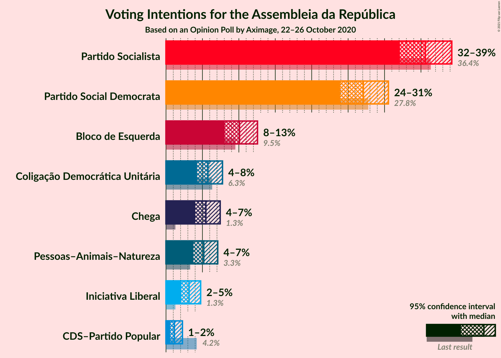
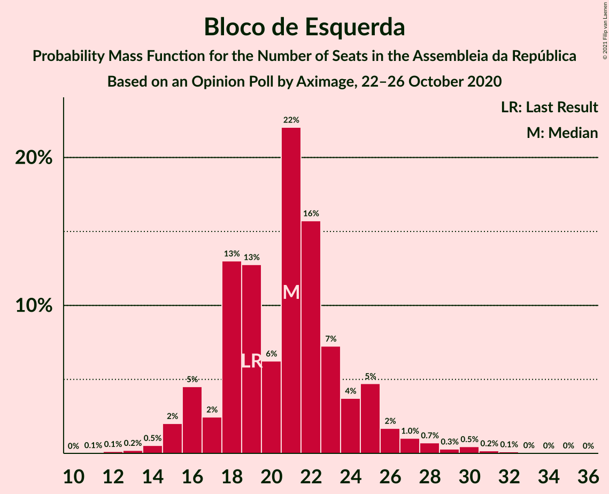
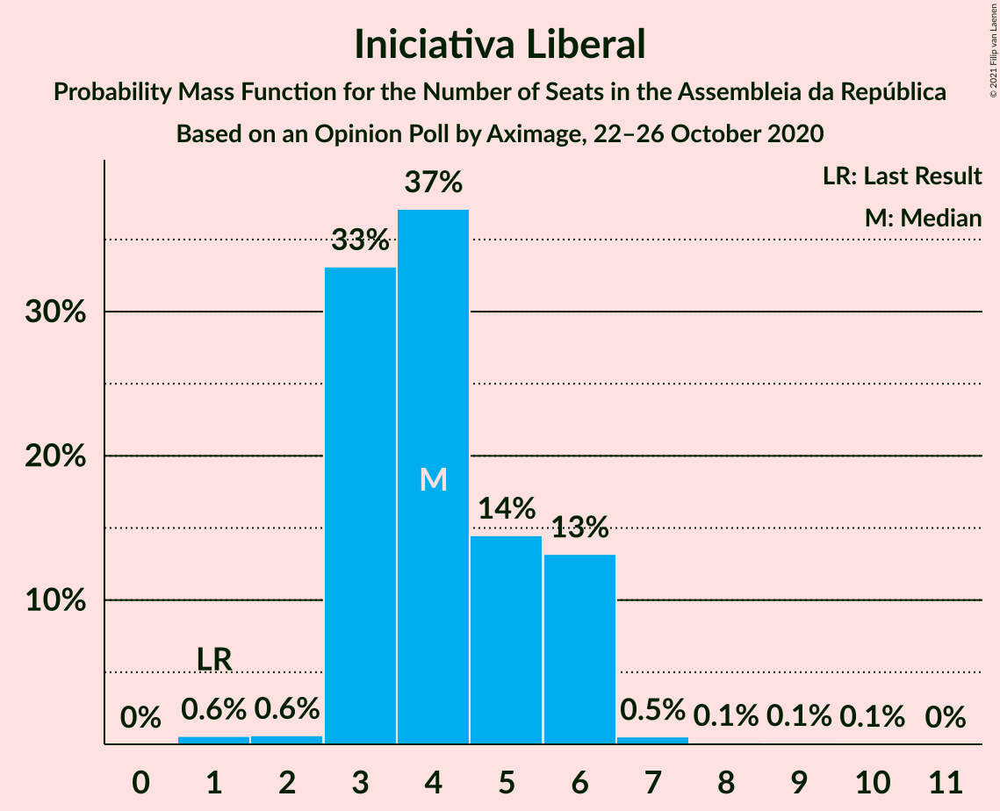

# Opinion Poll by Aximage, 22–26 October 2020

<a href="#voting-intentions">Voting Intentions</a> | <a href="#seats">Seats</a> | <a href="#coalitions">Coalitions</a> | <a href="#technical-information">Technical Information</a>

## Voting Intentions

### Confidence Intervals

| Party | Last Result | Poll Result | 80% Confidence Interval | 90% Confidence Interval | 95% Confidence Interval | 99% Confidence Interval |
|:-----:|:-----------:|:-----------:|:-----------------------:|:-----------------------:|:-----------------------:|:-----------------------:|
| Partido Socialista | 36.4% | 35.6% | 33.3–38.0% |32.7–38.7% |32.1–39.2% |31.0–40.4% |
| Partido Social Democrata | 27.8% | 27.1% | 25.0–29.3% |24.4–30.0% |23.9–30.5% |22.9–31.6% |
| Bloco de Esquerda | 9.5% | 10.1% | 8.7–11.7% |8.4–12.2% |8.1–12.6% |7.5–13.4% |
| Coligação Democrática Unitária | 6.3% | 5.8% | 4.8–7.1% |4.5–7.4% |4.3–7.8% |3.8–8.4% |
| Chega | 1.3% | 5.5% | 4.5–6.8% |4.2–7.1% |4.0–7.4% |3.6–8.1% |
| Pessoas–Animais–Natureza | 3.3% | 5.2% | 4.3–6.4% |4.0–6.8% |3.8–7.1% |3.4–7.7% |
| Iniciativa Liberal | 1.3% | 3.2% | 2.5–4.2% |2.3–4.5% |2.1–4.8% |1.8–5.3% |
| CDS–Partido Popular | 4.2% | 1.2% | 0.8–1.9% |0.7–2.1% |0.6–2.3% |0.4–2.7% |

*Note:* The poll result column reflects the actual value used in the calculations. Published results may vary slightly, and in addition be rounded to fewer digits.

## Seats

### Confidence Intervals

| Party | Last Result | Median | 80% Confidence Interval | 90% Confidence Interval | 95% Confidence Interval | 99% Confidence Interval |
|:-----:|:-----------:|:------:|:-----------------------:|:-----------------------:|:-----------------------:|:-----------------------:|
| <a href="#partido-socialista">Partido Socialista</a> | 108 | 103 | 94–110 |92–111 |91–113 |86–116 |
| <a href="#partido-social-democrata">Partido Social Democrata</a> | 79 | 77 | 68–84 |65–88 |65–88 |63–91 |
| <a href="#bloco-de-esquerda">Bloco de Esquerda</a> | 19 | 20 | 18–24 |17–25 |16–28 |13–30 |
| <a href="#coligação-democrática-unitária">Coligação Democrática Unitária</a> | 12 | 10 | 7–14 |6–15 |6–15 |5–18 |
| <a href="#chega">Chega</a> | 1 | 8 | 4–11 |4–11 |4–11 |3–13 |
| <a href="#pessoas–animais–natureza">Pessoas–Animais–Natureza</a> | 4 | 7 | 5–11 |4–12 |4–12 |4–13 |
| <a href="#iniciativa-liberal">Iniciativa Liberal</a> | 1 | 4 | 3–6 |3–6 |3–6 |2–7 |
| <a href="#cds–partido-popular">CDS–Partido Popular</a> | 5 | 0 | 0–1 |0–1 |0–1 |0–1 |

### Partido Socialista

*For a full overview of the results for this party, see the [Partido Socialista](party-partidosocialista.html) page.*

| Number of Seats | Probability | Accumulated | Special Marks |
|:---------------:|:-----------:|:-----------:|:-------------:|
| 82 | 0% | 100% |  |
| 83 | 0% | 99.9% |  |
| 84 | 0% | 99.9% |  |
| 85 | 0.2% | 99.9% |  |
| 86 | 0.4% | 99.7% |  |
| 87 | 0.3% | 99.3% |  |
| 88 | 0.4% | 99.0% |  |
| 89 | 0.5% | 98.7% |  |
| 90 | 0.1% | 98% |  |
| 91 | 2% | 98% |  |
| 92 | 1.4% | 96% |  |
| 93 | 4% | 95% |  |
| 94 | 1.4% | 91% |  |
| 95 | 0.7% | 90% |  |
| 96 | 8% | 89% |  |
| 97 | 3% | 81% |  |
| 98 | 2% | 78% |  |
| 99 | 11% | 76% |  |
| 100 | 4% | 66% |  |
| 101 | 4% | 62% |  |
| 102 | 4% | 58% |  |
| 103 | 11% | 55% | Median |
| 104 | 3% | 44% |  |
| 105 | 9% | 41% |  |
| 106 | 8% | 31% |  |
| 107 | 8% | 23% |  |
| 108 | 2% | 16% | Last Result |
| 109 | 3% | 14% |  |
| 110 | 5% | 11% |  |
| 111 | 2% | 7% |  |
| 112 | 1.4% | 5% |  |
| 113 | 1.4% | 3% |  |
| 114 | 0.5% | 2% |  |
| 115 | 0.5% | 1.3% |  |
| 116 | 0.4% | 0.8% | Majority |
| 117 | 0.1% | 0.4% |  |
| 118 | 0.1% | 0.2% |  |
| 119 | 0% | 0.1% |  |
| 120 | 0% | 0.1% |  |
| 121 | 0% | 0% |  |

### Partido Social Democrata

*For a full overview of the results for this party, see the [Partido Social Democrata](party-partidosocialdemocrata.html) page.*

| Number of Seats | Probability | Accumulated | Special Marks |
|:---------------:|:-----------:|:-----------:|:-------------:|
| 58 | 0% | 100% |  |
| 59 | 0.1% | 99.9% |  |
| 60 | 0% | 99.8% |  |
| 61 | 0% | 99.8% |  |
| 62 | 0.1% | 99.8% |  |
| 63 | 0.7% | 99.7% |  |
| 64 | 0.2% | 98.9% |  |
| 65 | 4% | 98.7% |  |
| 66 | 0.8% | 94% |  |
| 67 | 2% | 93% |  |
| 68 | 1.2% | 91% |  |
| 69 | 4% | 90% |  |
| 70 | 2% | 86% |  |
| 71 | 1.5% | 84% |  |
| 72 | 9% | 82% |  |
| 73 | 4% | 73% |  |
| 74 | 6% | 69% |  |
| 75 | 4% | 64% |  |
| 76 | 6% | 60% |  |
| 77 | 7% | 53% | Median |
| 78 | 6% | 46% |  |
| 79 | 12% | 40% | Last Result |
| 80 | 3% | 27% |  |
| 81 | 3% | 24% |  |
| 82 | 2% | 21% |  |
| 83 | 2% | 19% |  |
| 84 | 8% | 17% |  |
| 85 | 2% | 10% |  |
| 86 | 1.1% | 7% |  |
| 87 | 0.3% | 6% |  |
| 88 | 4% | 6% |  |
| 89 | 0.5% | 2% |  |
| 90 | 1.0% | 2% |  |
| 91 | 0.4% | 0.9% |  |
| 92 | 0.3% | 0.5% |  |
| 93 | 0.1% | 0.2% |  |
| 94 | 0.1% | 0.1% |  |
| 95 | 0% | 0% |  |

### Bloco de Esquerda

*For a full overview of the results for this party, see the [Bloco de Esquerda](party-blocodeesquerda.html) page.*

| Number of Seats | Probability | Accumulated | Special Marks |
|:---------------:|:-----------:|:-----------:|:-------------:|
| 11 | 0.1% | 100% |  |
| 12 | 0.1% | 99.9% |  |
| 13 | 0.4% | 99.8% |  |
| 14 | 0.4% | 99.4% |  |
| 15 | 1.4% | 99.1% |  |
| 16 | 2% | 98% |  |
| 17 | 3% | 96% |  |
| 18 | 14% | 92% |  |
| 19 | 18% | 78% | Last Result |
| 20 | 13% | 60% | Median |
| 21 | 20% | 47% |  |
| 22 | 10% | 27% |  |
| 23 | 5% | 17% |  |
| 24 | 6% | 12% |  |
| 25 | 3% | 7% |  |
| 26 | 0.9% | 4% |  |
| 27 | 0.5% | 3% |  |
| 28 | 1.2% | 3% |  |
| 29 | 0.2% | 1.4% |  |
| 30 | 0.8% | 1.2% |  |
| 31 | 0.1% | 0.4% |  |
| 32 | 0.2% | 0.3% |  |
| 33 | 0.1% | 0.2% |  |
| 34 | 0% | 0.1% |  |
| 35 | 0.1% | 0.1% |  |
| 36 | 0% | 0% |  |

### Coligação Democrática Unitária

*For a full overview of the results for this party, see the [Coligação Democrática Unitária](party-coligaçãodemocráticaunitária.html) page.*

| Number of Seats | Probability | Accumulated | Special Marks |
|:---------------:|:-----------:|:-----------:|:-------------:|
| 4 | 0.1% | 100% |  |
| 5 | 0.8% | 99.8% |  |
| 6 | 5% | 99.1% |  |
| 7 | 23% | 94% |  |
| 8 | 6% | 71% |  |
| 9 | 11% | 65% |  |
| 10 | 18% | 54% | Median |
| 11 | 4% | 36% |  |
| 12 | 17% | 32% | Last Result |
| 13 | 5% | 15% |  |
| 14 | 5% | 11% |  |
| 15 | 4% | 6% |  |
| 16 | 1.4% | 2% |  |
| 17 | 0.2% | 0.8% |  |
| 18 | 0.6% | 0.6% |  |
| 19 | 0% | 0% |  |

### Chega

*For a full overview of the results for this party, see the [Chega](party-chega.html) page.*

| Number of Seats | Probability | Accumulated | Special Marks |
|:---------------:|:-----------:|:-----------:|:-------------:|
| 1 | 0% | 100% | Last Result |
| 2 | 0% | 100% |  |
| 3 | 0.6% | 100% |  |
| 4 | 14% | 99.4% |  |
| 5 | 3% | 85% |  |
| 6 | 13% | 83% |  |
| 7 | 10% | 69% |  |
| 8 | 16% | 60% | Median |
| 9 | 10% | 44% |  |
| 10 | 3% | 33% |  |
| 11 | 28% | 30% |  |
| 12 | 0.7% | 2% |  |
| 13 | 0.9% | 1.2% |  |
| 14 | 0.3% | 0.4% |  |
| 15 | 0% | 0.1% |  |
| 16 | 0% | 0.1% |  |
| 17 | 0% | 0% |  |

### Pessoas–Animais–Natureza

*For a full overview of the results for this party, see the [Pessoas–Animais–Natureza](party-pessoas–animais–natureza.html) page.*

| Number of Seats | Probability | Accumulated | Special Marks |
|:---------------:|:-----------:|:-----------:|:-------------:|
| 3 | 0.4% | 100% |  |
| 4 | 8% | 99.5% | Last Result |
| 5 | 4% | 92% |  |
| 6 | 31% | 88% |  |
| 7 | 14% | 57% | Median |
| 8 | 11% | 43% |  |
| 9 | 13% | 32% |  |
| 10 | 6% | 19% |  |
| 11 | 8% | 13% |  |
| 12 | 4% | 6% |  |
| 13 | 1.2% | 2% |  |
| 14 | 0.3% | 0.4% |  |
| 15 | 0.1% | 0.1% |  |
| 16 | 0% | 0% |  |

### Iniciativa Liberal

*For a full overview of the results for this party, see the [Iniciativa Liberal](party-iniciativaliberal.html) page.*

| Number of Seats | Probability | Accumulated | Special Marks |
|:---------------:|:-----------:|:-----------:|:-------------:|
| 1 | 0.4% | 100% | Last Result |
| 2 | 1.2% | 99.6% |  |
| 3 | 37% | 98% |  |
| 4 | 36% | 61% | Median |
| 5 | 15% | 25% |  |
| 6 | 10% | 10% |  |
| 7 | 0.4% | 0.6% |  |
| 8 | 0.1% | 0.2% |  |
| 9 | 0.1% | 0.2% |  |
| 10 | 0.1% | 0.1% |  |
| 11 | 0% | 0% |  |

### CDS–Partido Popular

*For a full overview of the results for this party, see the [CDS–Partido Popular](party-cds–partidopopular.html) page.*

| Number of Seats | Probability | Accumulated | Special Marks |
|:---------------:|:-----------:|:-----------:|:-------------:|
| 0 | 85% | 100% | Median |
| 1 | 15% | 15% |  |
| 2 | 0.4% | 0.5% |  |
| 3 | 0% | 0% |  |
| 4 | 0% | 0% |  |
| 5 | 0% | 0% | Last Result |

## Coalitions

### Confidence Intervals

| Coalition | Last Result | Median | Majority? | 80% Confidence Interval | 90% Confidence Interval | 95% Confidence Interval | 99% Confidence Interval |
|:---------:|:-----------:|:------:|:---------:|:-----------------------:|:-----------------------:|:-----------------------:|:-----------------------:|
| Partido Socialista – Bloco de Esquerda – Coligação Democrática Unitária | 139 | 132 | 99.7% | 126–141 | 122–142 | 122–145 | 116–147 |
| Partido Socialista – Bloco de Esquerda | 127 | 123 | 90% | 116–130 | 112–132 | 112–133 | 107–137 |
| Partido Socialista – Coligação Democrática Unitária | 120 | 112 | 29% | 105–120 | 103–121 | 100–124 | 97–126 |
| Partido Socialista | 108 | 103 | 0.8% | 94–110 | 92–111 | 91–113 | 86–116 |
| Partido Social Democrata – CDS–Partido Popular | 84 | 77 | 0% | 68–84 | 66–88 | 65–88 | 63–92 |

### Partido Socialista – Bloco de Esquerda – Coligação Democrática Unitária

| Number of Seats | Probability | Accumulated | Special Marks |
|:---------------:|:-----------:|:-----------:|:-------------:|
| 113 | 0.1% | 100% |  |
| 114 | 0% | 99.9% |  |
| 115 | 0.2% | 99.9% |  |
| 116 | 0.3% | 99.7% | Majority |
| 117 | 0.2% | 99.4% |  |
| 118 | 0.3% | 99.2% |  |
| 119 | 0.2% | 98.9% |  |
| 120 | 0.3% | 98.7% |  |
| 121 | 0.3% | 98% |  |
| 122 | 4% | 98% |  |
| 123 | 0.9% | 94% |  |
| 124 | 0.8% | 93% |  |
| 125 | 2% | 92% |  |
| 126 | 2% | 90% |  |
| 127 | 3% | 88% |  |
| 128 | 11% | 85% |  |
| 129 | 12% | 75% |  |
| 130 | 3% | 62% |  |
| 131 | 9% | 59% |  |
| 132 | 2% | 51% |  |
| 133 | 6% | 48% | Median |
| 134 | 6% | 43% |  |
| 135 | 4% | 37% |  |
| 136 | 7% | 33% |  |
| 137 | 4% | 26% |  |
| 138 | 1.1% | 21% |  |
| 139 | 2% | 20% | Last Result |
| 140 | 3% | 18% |  |
| 141 | 9% | 15% |  |
| 142 | 2% | 7% |  |
| 143 | 1.0% | 5% |  |
| 144 | 0.9% | 4% |  |
| 145 | 1.2% | 3% |  |
| 146 | 0.3% | 1.5% |  |
| 147 | 0.7% | 1.2% |  |
| 148 | 0.2% | 0.4% |  |
| 149 | 0.2% | 0.3% |  |
| 150 | 0% | 0.1% |  |
| 151 | 0% | 0.1% |  |
| 152 | 0% | 0% |  |

### Partido Socialista – Bloco de Esquerda

| Number of Seats | Probability | Accumulated | Special Marks |
|:---------------:|:-----------:|:-----------:|:-------------:|
| 102 | 0% | 100% |  |
| 103 | 0% | 99.9% |  |
| 104 | 0.1% | 99.9% |  |
| 105 | 0.2% | 99.9% |  |
| 106 | 0% | 99.6% |  |
| 107 | 0.6% | 99.6% |  |
| 108 | 0.3% | 99.0% |  |
| 109 | 0.2% | 98.7% |  |
| 110 | 0.1% | 98.5% |  |
| 111 | 0.7% | 98% |  |
| 112 | 5% | 98% |  |
| 113 | 0.5% | 93% |  |
| 114 | 1.1% | 93% |  |
| 115 | 2% | 92% |  |
| 116 | 9% | 90% | Majority |
| 117 | 0.9% | 81% |  |
| 118 | 4% | 80% |  |
| 119 | 4% | 76% |  |
| 120 | 10% | 72% |  |
| 121 | 3% | 63% |  |
| 122 | 7% | 60% |  |
| 123 | 5% | 52% | Median |
| 124 | 9% | 47% |  |
| 125 | 6% | 39% |  |
| 126 | 4% | 33% |  |
| 127 | 2% | 28% | Last Result |
| 128 | 3% | 27% |  |
| 129 | 12% | 24% |  |
| 130 | 4% | 12% |  |
| 131 | 2% | 8% |  |
| 132 | 2% | 6% |  |
| 133 | 2% | 4% |  |
| 134 | 0.6% | 2% |  |
| 135 | 0.3% | 1.5% |  |
| 136 | 0.4% | 1.2% |  |
| 137 | 0.5% | 0.8% |  |
| 138 | 0.1% | 0.4% |  |
| 139 | 0.1% | 0.3% |  |
| 140 | 0.1% | 0.1% |  |
| 141 | 0% | 0.1% |  |
| 142 | 0% | 0% |  |

### Partido Socialista – Coligação Democrática Unitária

| Number of Seats | Probability | Accumulated | Special Marks |
|:---------------:|:-----------:|:-----------:|:-------------:|
| 92 | 0.1% | 100% |  |
| 93 | 0.1% | 99.9% |  |
| 94 | 0.1% | 99.8% |  |
| 95 | 0.1% | 99.8% |  |
| 96 | 0.1% | 99.7% |  |
| 97 | 0.2% | 99.6% |  |
| 98 | 0.1% | 99.4% |  |
| 99 | 1.0% | 99.2% |  |
| 100 | 0.7% | 98% |  |
| 101 | 1.1% | 97% |  |
| 102 | 0.7% | 96% |  |
| 103 | 4% | 96% |  |
| 104 | 0.9% | 91% |  |
| 105 | 1.0% | 91% |  |
| 106 | 2% | 90% |  |
| 107 | 2% | 87% |  |
| 108 | 18% | 85% |  |
| 109 | 2% | 67% |  |
| 110 | 7% | 65% |  |
| 111 | 3% | 57% |  |
| 112 | 8% | 55% |  |
| 113 | 12% | 46% | Median |
| 114 | 3% | 34% |  |
| 115 | 2% | 31% |  |
| 116 | 2% | 29% | Majority |
| 117 | 4% | 27% |  |
| 118 | 4% | 23% |  |
| 119 | 8% | 19% |  |
| 120 | 3% | 10% | Last Result |
| 121 | 3% | 7% |  |
| 122 | 1.4% | 5% |  |
| 123 | 0.4% | 3% |  |
| 124 | 1.1% | 3% |  |
| 125 | 1.0% | 2% |  |
| 126 | 0.4% | 0.9% |  |
| 127 | 0% | 0.5% |  |
| 128 | 0.3% | 0.4% |  |
| 129 | 0% | 0.1% |  |
| 130 | 0.1% | 0.1% |  |
| 131 | 0% | 0% |  |

### Partido Socialista

| Number of Seats | Probability | Accumulated | Special Marks |
|:---------------:|:-----------:|:-----------:|:-------------:|
| 82 | 0% | 100% |  |
| 83 | 0% | 99.9% |  |
| 84 | 0% | 99.9% |  |
| 85 | 0.2% | 99.9% |  |
| 86 | 0.4% | 99.7% |  |
| 87 | 0.3% | 99.3% |  |
| 88 | 0.4% | 99.0% |  |
| 89 | 0.5% | 98.7% |  |
| 90 | 0.1% | 98% |  |
| 91 | 2% | 98% |  |
| 92 | 1.4% | 96% |  |
| 93 | 4% | 95% |  |
| 94 | 1.4% | 91% |  |
| 95 | 0.7% | 90% |  |
| 96 | 8% | 89% |  |
| 97 | 3% | 81% |  |
| 98 | 2% | 78% |  |
| 99 | 11% | 76% |  |
| 100 | 4% | 66% |  |
| 101 | 4% | 62% |  |
| 102 | 4% | 58% |  |
| 103 | 11% | 55% | Median |
| 104 | 3% | 44% |  |
| 105 | 9% | 41% |  |
| 106 | 8% | 31% |  |
| 107 | 8% | 23% |  |
| 108 | 2% | 16% | Last Result |
| 109 | 3% | 14% |  |
| 110 | 5% | 11% |  |
| 111 | 2% | 7% |  |
| 112 | 1.4% | 5% |  |
| 113 | 1.4% | 3% |  |
| 114 | 0.5% | 2% |  |
| 115 | 0.5% | 1.3% |  |
| 116 | 0.4% | 0.8% | Majority |
| 117 | 0.1% | 0.4% |  |
| 118 | 0.1% | 0.2% |  |
| 119 | 0% | 0.1% |  |
| 120 | 0% | 0.1% |  |
| 121 | 0% | 0% |  |

### Partido Social Democrata – CDS–Partido Popular

| Number of Seats | Probability | Accumulated | Special Marks |
|:---------------:|:-----------:|:-----------:|:-------------:|
| 58 | 0% | 100% |  |
| 59 | 0.1% | 99.9% |  |
| 60 | 0% | 99.8% |  |
| 61 | 0% | 99.8% |  |
| 62 | 0.1% | 99.8% |  |
| 63 | 0.7% | 99.7% |  |
| 64 | 0.1% | 99.0% |  |
| 65 | 4% | 98.8% |  |
| 66 | 2% | 95% |  |
| 67 | 2% | 93% |  |
| 68 | 1.2% | 91% |  |
| 69 | 4% | 90% |  |
| 70 | 2% | 86% |  |
| 71 | 2% | 84% |  |
| 72 | 7% | 83% |  |
| 73 | 6% | 75% |  |
| 74 | 6% | 69% |  |
| 75 | 3% | 64% |  |
| 76 | 6% | 61% |  |
| 77 | 8% | 55% | Median |
| 78 | 7% | 47% |  |
| 79 | 12% | 41% |  |
| 80 | 4% | 29% |  |
| 81 | 3% | 25% |  |
| 82 | 3% | 22% |  |
| 83 | 2% | 19% |  |
| 84 | 8% | 17% | Last Result |
| 85 | 1.2% | 10% |  |
| 86 | 2% | 8% |  |
| 87 | 0.4% | 6% |  |
| 88 | 4% | 6% |  |
| 89 | 0.2% | 2% |  |
| 90 | 1.2% | 2% |  |
| 91 | 0.5% | 1.0% |  |
| 92 | 0.4% | 0.5% |  |
| 93 | 0.1% | 0.2% |  |
| 94 | 0.1% | 0.1% |  |
| 95 | 0% | 0% |  |

## Technical Information

### Opinion Poll

+ **Polling firm:** Aximage
+ **Commissioner(s):** —
+ **Fieldwork period:** 22–26 October 2020

### Calculations

+ **Sample size:** 694
+ **Simulations done:** 131,072
+ **Error estimate:** 1.69%

