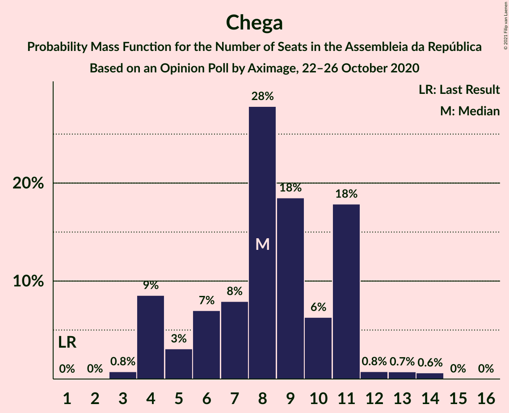

# Opinion Poll by Aximage, 22–26 October 2020

<a href="#voting-intentions">Voting Intentions</a> | <a href="#seats">Seats</a> | <a href="#coalitions">Coalitions</a> | <a href="#technical-information">Technical Information</a>

## Voting Intentions

### Confidence Intervals

| Party | Last Result | Poll Result | 80% Confidence Interval | 90% Confidence Interval | 95% Confidence Interval | 99% Confidence Interval |
|:-----:|:-----------:|:-----------:|:-----------------------:|:-----------------------:|:-----------------------:|:-----------------------:|
| Partido Socialista | 36.4% | 35.6% | 33.3–38.0% |32.7–38.7% |32.1–39.2% |31.0–40.4% |
| Partido Social Democrata | 27.8% | 27.1% | 25.0–29.3% |24.4–30.0% |23.9–30.5% |22.9–31.6% |
| Bloco de Esquerda | 9.5% | 10.1% | 8.7–11.7% |8.4–12.2% |8.1–12.6% |7.5–13.4% |
| Coligação Democrática Unitária | 6.3% | 5.8% | 4.8–7.1% |4.5–7.4% |4.3–7.8% |3.8–8.4% |
| Chega | 1.3% | 5.5% | 4.5–6.8% |4.2–7.1% |4.0–7.4% |3.6–8.1% |
| Pessoas–Animais–Natureza | 3.3% | 5.2% | 4.3–6.4% |4.0–6.8% |3.8–7.1% |3.4–7.7% |
| Iniciativa Liberal | 1.3% | 3.2% | 2.5–4.2% |2.3–4.5% |2.1–4.8% |1.8–5.3% |
| CDS–Partido Popular | 4.2% | 1.2% | 0.8–1.9% |0.7–2.1% |0.6–2.3% |0.4–2.7% |

*Note:* The poll result column reflects the actual value used in the calculations. Published results may vary slightly, and in addition be rounded to fewer digits.

## Seats

### Confidence Intervals

| Party | Last Result | Median | 80% Confidence Interval | 90% Confidence Interval | 95% Confidence Interval | 99% Confidence Interval |
|:-----:|:-----------:|:------:|:-----------------------:|:-----------------------:|:-----------------------:|:-----------------------:|
| <a href="#partido-socialista">Partido Socialista</a> | 108 | 102 | 96–110 |93–112 |91–114 |86–117 |
| <a href="#partido-social-democrata">Partido Social Democrata</a> | 79 | 76 | 68–83 |66–85 |65–88 |63–91 |
| <a href="#bloco-de-esquerda">Bloco de Esquerda</a> | 19 | 21 | 18–24 |16–25 |15–27 |14–30 |
| <a href="#coligação-democrática-unitária">Coligação Democrática Unitária</a> | 12 | 10 | 7–14 |6–14 |6–15 |5–17 |
| <a href="#chega">Chega</a> | 1 | 8 | 5–11 |4–11 |4–11 |3–14 |
| <a href="#pessoas–animais–natureza">Pessoas–Animais–Natureza</a> | 4 | 8 | 5–11 |4–12 |4–12 |4–13 |
| <a href="#iniciativa-liberal">Iniciativa Liberal</a> | 1 | 4 | 3–6 |3–6 |3–6 |1–7 |
| <a href="#cds–partido-popular">CDS–Partido Popular</a> | 5 | 0 | 0–1 |0–1 |0–1 |0–1 |

### Partido Socialista

*For a full overview of the results for this party, see the [Partido Socialista](party-partidosocialista.html) page.*

| Number of Seats | Probability | Accumulated | Special Marks |
|:---------------:|:-----------:|:-----------:|:-------------:|
| 82 | 0% | 100% |  |
| 83 | 0% | 99.9% |  |
| 84 | 0.1% | 99.9% |  |
| 85 | 0.1% | 99.8% |  |
| 86 | 0.2% | 99.7% |  |
| 87 | 0.4% | 99.5% |  |
| 88 | 0.5% | 99.1% |  |
| 89 | 0.4% | 98.6% |  |
| 90 | 0.5% | 98% |  |
| 91 | 0.7% | 98% |  |
| 92 | 0.7% | 97% |  |
| 93 | 1.5% | 96% |  |
| 94 | 3% | 95% |  |
| 95 | 2% | 92% |  |
| 96 | 4% | 90% |  |
| 97 | 4% | 86% |  |
| 98 | 6% | 83% |  |
| 99 | 6% | 77% |  |
| 100 | 8% | 71% |  |
| 101 | 4% | 63% |  |
| 102 | 11% | 59% | Median |
| 103 | 9% | 48% |  |
| 104 | 7% | 38% |  |
| 105 | 5% | 32% |  |
| 106 | 5% | 27% |  |
| 107 | 5% | 22% |  |
| 108 | 2% | 17% | Last Result |
| 109 | 4% | 15% |  |
| 110 | 4% | 12% |  |
| 111 | 2% | 8% |  |
| 112 | 2% | 6% |  |
| 113 | 0.7% | 4% |  |
| 114 | 1.1% | 3% |  |
| 115 | 1.2% | 2% |  |
| 116 | 0.4% | 0.9% | Majority |
| 117 | 0.2% | 0.5% |  |
| 118 | 0.2% | 0.3% |  |
| 119 | 0% | 0.1% |  |
| 120 | 0% | 0.1% |  |
| 121 | 0% | 0.1% |  |
| 122 | 0% | 0% |  |

### Partido Social Democrata

*For a full overview of the results for this party, see the [Partido Social Democrata](party-partidosocialdemocrata.html) page.*

| Number of Seats | Probability | Accumulated | Special Marks |
|:---------------:|:-----------:|:-----------:|:-------------:|
| 59 | 0.1% | 100% |  |
| 60 | 0.1% | 99.9% |  |
| 61 | 0% | 99.8% |  |
| 62 | 0.2% | 99.8% |  |
| 63 | 0.5% | 99.6% |  |
| 64 | 0.8% | 99.1% |  |
| 65 | 2% | 98% |  |
| 66 | 2% | 96% |  |
| 67 | 2% | 94% |  |
| 68 | 4% | 92% |  |
| 69 | 3% | 88% |  |
| 70 | 4% | 85% |  |
| 71 | 4% | 81% |  |
| 72 | 5% | 77% |  |
| 73 | 3% | 72% |  |
| 74 | 5% | 68% |  |
| 75 | 8% | 64% |  |
| 76 | 8% | 55% | Median |
| 77 | 6% | 48% |  |
| 78 | 9% | 41% |  |
| 79 | 10% | 32% | Last Result |
| 80 | 6% | 22% |  |
| 81 | 3% | 16% |  |
| 82 | 3% | 13% |  |
| 83 | 2% | 10% |  |
| 84 | 3% | 8% |  |
| 85 | 1.2% | 6% |  |
| 86 | 0.8% | 4% |  |
| 87 | 0.6% | 4% |  |
| 88 | 1.0% | 3% |  |
| 89 | 0.9% | 2% |  |
| 90 | 0.3% | 1.0% |  |
| 91 | 0.3% | 0.7% |  |
| 92 | 0.3% | 0.4% |  |
| 93 | 0% | 0.1% |  |
| 94 | 0% | 0.1% |  |
| 95 | 0% | 0% |  |

### Bloco de Esquerda

*For a full overview of the results for this party, see the [Bloco de Esquerda](party-blocodeesquerda.html) page.*

| Number of Seats | Probability | Accumulated | Special Marks |
|:---------------:|:-----------:|:-----------:|:-------------:|
| 11 | 0.1% | 100% |  |
| 12 | 0.1% | 99.9% |  |
| 13 | 0.2% | 99.8% |  |
| 14 | 0.5% | 99.6% |  |
| 15 | 2% | 99.1% |  |
| 16 | 5% | 97% |  |
| 17 | 2% | 93% |  |
| 18 | 13% | 90% |  |
| 19 | 13% | 77% | Last Result |
| 20 | 6% | 64% |  |
| 21 | 22% | 58% | Median |
| 22 | 16% | 36% |  |
| 23 | 7% | 20% |  |
| 24 | 4% | 13% |  |
| 25 | 5% | 9% |  |
| 26 | 2% | 5% |  |
| 27 | 1.0% | 3% |  |
| 28 | 0.7% | 2% |  |
| 29 | 0.3% | 1.2% |  |
| 30 | 0.5% | 0.9% |  |
| 31 | 0.2% | 0.4% |  |
| 32 | 0.1% | 0.2% |  |
| 33 | 0% | 0.1% |  |
| 34 | 0% | 0.1% |  |
| 35 | 0% | 0% |  |

### Coligação Democrática Unitária

*For a full overview of the results for this party, see the [Coligação Democrática Unitária](party-coligaçãodemocráticaunitária.html) page.*

| Number of Seats | Probability | Accumulated | Special Marks |
|:---------------:|:-----------:|:-----------:|:-------------:|
| 4 | 0.1% | 100% |  |
| 5 | 0.6% | 99.9% |  |
| 6 | 8% | 99.3% |  |
| 7 | 20% | 91% |  |
| 8 | 11% | 70% |  |
| 9 | 7% | 60% |  |
| 10 | 23% | 53% | Median |
| 11 | 4% | 30% |  |
| 12 | 9% | 26% | Last Result |
| 13 | 6% | 17% |  |
| 14 | 7% | 11% |  |
| 15 | 2% | 4% |  |
| 16 | 1.2% | 2% |  |
| 17 | 0.3% | 0.6% |  |
| 18 | 0.3% | 0.3% |  |
| 19 | 0% | 0.1% |  |
| 20 | 0% | 0% |  |

### Chega

*For a full overview of the results for this party, see the [Chega](party-chega.html) page.*

| Number of Seats | Probability | Accumulated | Special Marks |
|:---------------:|:-----------:|:-----------:|:-------------:|
| 1 | 0% | 100% | Last Result |
| 2 | 0% | 100% |  |
| 3 | 0.8% | 100% |  |
| 4 | 9% | 99.2% |  |
| 5 | 3% | 91% |  |
| 6 | 7% | 88% |  |
| 7 | 8% | 81% |  |
| 8 | 28% | 73% | Median |
| 9 | 18% | 45% |  |
| 10 | 6% | 26% |  |
| 11 | 18% | 20% |  |
| 12 | 0.8% | 2% |  |
| 13 | 0.7% | 1.4% |  |
| 14 | 0.6% | 0.7% |  |
| 15 | 0% | 0.1% |  |
| 16 | 0% | 0% |  |

### Pessoas–Animais–Natureza

*For a full overview of the results for this party, see the [Pessoas–Animais–Natureza](party-pessoas–animais–natureza.html) page.*

| Number of Seats | Probability | Accumulated | Special Marks |
|:---------------:|:-----------:|:-----------:|:-------------:|
| 3 | 0.4% | 100% |  |
| 4 | 7% | 99.6% | Last Result |
| 5 | 5% | 92% |  |
| 6 | 22% | 88% |  |
| 7 | 5% | 65% |  |
| 8 | 11% | 61% | Median |
| 9 | 22% | 49% |  |
| 10 | 14% | 27% |  |
| 11 | 7% | 13% |  |
| 12 | 5% | 6% |  |
| 13 | 0.9% | 1.3% |  |
| 14 | 0.4% | 0.5% |  |
| 15 | 0.1% | 0.1% |  |
| 16 | 0% | 0% |  |

### Iniciativa Liberal

*For a full overview of the results for this party, see the [Iniciativa Liberal](party-iniciativaliberal.html) page.*

| Number of Seats | Probability | Accumulated | Special Marks |
|:---------------:|:-----------:|:-----------:|:-------------:|
| 1 | 0.6% | 100% | Last Result |
| 2 | 0.6% | 99.4% |  |
| 3 | 33% | 98.8% |  |
| 4 | 37% | 66% | Median |
| 5 | 14% | 29% |  |
| 6 | 13% | 14% |  |
| 7 | 0.5% | 0.9% |  |
| 8 | 0.1% | 0.3% |  |
| 9 | 0.1% | 0.2% |  |
| 10 | 0.1% | 0.1% |  |
| 11 | 0% | 0% |  |

### CDS–Partido Popular

*For a full overview of the results for this party, see the [CDS–Partido Popular](party-cds–partidopopular.html) page.*

| Number of Seats | Probability | Accumulated | Special Marks |
|:---------------:|:-----------:|:-----------:|:-------------:|
| 0 | 89% | 100% | Median |
| 1 | 10% | 11% |  |
| 2 | 0.4% | 0.4% |  |
| 3 | 0% | 0% |  |
| 4 | 0% | 0% |  |
| 5 | 0% | 0% | Last Result |

## Coalitions

### Confidence Intervals

| Coalition | Last Result | Median | Majority? | 80% Confidence Interval | 90% Confidence Interval | 95% Confidence Interval | 99% Confidence Interval |
|:---------:|:-----------:|:------:|:---------:|:-----------------------:|:-----------------------:|:-----------------------:|:-----------------------:|
| Partido Socialista – Bloco de Esquerda – Coligação Democrática Unitária | 139 | 133 | 99.7% | 126–141 | 124–143 | 122–144 | 117–147 |
| Partido Socialista – Bloco de Esquerda | 127 | 123 | 93% | 116–131 | 114–133 | 112–134 | 107–138 |
| Partido Socialista – Coligação Democrática Unitária | 120 | 112 | 27% | 105–120 | 103–122 | 101–125 | 97–127 |
| Partido Socialista | 108 | 102 | 0.9% | 96–110 | 93–112 | 91–114 | 86–117 |
| Partido Social Democrata – CDS–Partido Popular | 84 | 76 | 0% | 68–83 | 66–85 | 65–88 | 63–91 |

### Partido Socialista – Bloco de Esquerda – Coligação Democrática Unitária

| Number of Seats | Probability | Accumulated | Special Marks |
|:---------------:|:-----------:|:-----------:|:-------------:|
| 113 | 0.1% | 100% |  |
| 114 | 0% | 99.9% |  |
| 115 | 0.2% | 99.9% |  |
| 116 | 0.1% | 99.7% | Majority |
| 117 | 0.1% | 99.6% |  |
| 118 | 0.5% | 99.4% |  |
| 119 | 0.4% | 99.0% |  |
| 120 | 0.4% | 98.5% |  |
| 121 | 0.5% | 98% |  |
| 122 | 1.1% | 98% |  |
| 123 | 1.5% | 97% |  |
| 124 | 3% | 95% |  |
| 125 | 2% | 92% |  |
| 126 | 4% | 90% |  |
| 127 | 5% | 86% |  |
| 128 | 4% | 81% |  |
| 129 | 8% | 77% |  |
| 130 | 5% | 68% |  |
| 131 | 6% | 63% |  |
| 132 | 6% | 57% |  |
| 133 | 8% | 51% | Median |
| 134 | 7% | 44% |  |
| 135 | 6% | 37% |  |
| 136 | 5% | 30% |  |
| 137 | 5% | 25% |  |
| 138 | 4% | 21% |  |
| 139 | 3% | 17% | Last Result |
| 140 | 2% | 13% |  |
| 141 | 3% | 11% |  |
| 142 | 1.4% | 8% |  |
| 143 | 3% | 7% |  |
| 144 | 1.4% | 4% |  |
| 145 | 0.7% | 2% |  |
| 146 | 0.6% | 2% |  |
| 147 | 0.5% | 1.0% |  |
| 148 | 0.2% | 0.5% |  |
| 149 | 0.1% | 0.3% |  |
| 150 | 0.1% | 0.2% |  |
| 151 | 0% | 0.1% |  |
| 152 | 0% | 0% |  |

### Partido Socialista – Bloco de Esquerda

| Number of Seats | Probability | Accumulated | Special Marks |
|:---------------:|:-----------:|:-----------:|:-------------:|
| 102 | 0% | 100% |  |
| 103 | 0.1% | 99.9% |  |
| 104 | 0.1% | 99.9% |  |
| 105 | 0.1% | 99.8% |  |
| 106 | 0.1% | 99.7% |  |
| 107 | 0.3% | 99.6% |  |
| 108 | 0.5% | 99.3% |  |
| 109 | 0.5% | 98.8% |  |
| 110 | 0.3% | 98% |  |
| 111 | 0.5% | 98% |  |
| 112 | 1.1% | 98% |  |
| 113 | 0.6% | 96% |  |
| 114 | 1.3% | 96% |  |
| 115 | 2% | 94% |  |
| 116 | 5% | 93% | Majority |
| 117 | 4% | 88% |  |
| 118 | 3% | 84% |  |
| 119 | 3% | 81% |  |
| 120 | 7% | 78% |  |
| 121 | 12% | 71% |  |
| 122 | 5% | 58% |  |
| 123 | 9% | 53% | Median |
| 124 | 7% | 44% |  |
| 125 | 8% | 38% |  |
| 126 | 5% | 30% |  |
| 127 | 4% | 25% | Last Result |
| 128 | 3% | 21% |  |
| 129 | 5% | 18% |  |
| 130 | 3% | 13% |  |
| 131 | 3% | 10% |  |
| 132 | 2% | 8% |  |
| 133 | 2% | 6% |  |
| 134 | 1.5% | 4% |  |
| 135 | 0.6% | 2% |  |
| 136 | 0.6% | 2% |  |
| 137 | 0.2% | 1.0% |  |
| 138 | 0.4% | 0.8% |  |
| 139 | 0.2% | 0.4% |  |
| 140 | 0.1% | 0.2% |  |
| 141 | 0.1% | 0.1% |  |
| 142 | 0% | 0% |  |

### Partido Socialista – Coligação Democrática Unitária

| Number of Seats | Probability | Accumulated | Special Marks |
|:---------------:|:-----------:|:-----------:|:-------------:|
| 92 | 0% | 100% |  |
| 93 | 0% | 99.9% |  |
| 94 | 0% | 99.9% |  |
| 95 | 0.1% | 99.9% |  |
| 96 | 0.1% | 99.7% |  |
| 97 | 0.3% | 99.6% |  |
| 98 | 0.5% | 99.4% |  |
| 99 | 0.6% | 98.9% |  |
| 100 | 0.8% | 98% |  |
| 101 | 0.7% | 98% |  |
| 102 | 1.2% | 97% |  |
| 103 | 3% | 96% |  |
| 104 | 3% | 93% |  |
| 105 | 3% | 90% |  |
| 106 | 4% | 87% |  |
| 107 | 3% | 83% |  |
| 108 | 8% | 80% |  |
| 109 | 8% | 72% |  |
| 110 | 6% | 64% |  |
| 111 | 4% | 58% |  |
| 112 | 9% | 54% | Median |
| 113 | 8% | 45% |  |
| 114 | 5% | 37% |  |
| 115 | 6% | 33% |  |
| 116 | 4% | 27% | Majority |
| 117 | 4% | 23% |  |
| 118 | 4% | 19% |  |
| 119 | 5% | 15% |  |
| 120 | 3% | 10% | Last Result |
| 121 | 2% | 7% |  |
| 122 | 1.0% | 5% |  |
| 123 | 0.8% | 4% |  |
| 124 | 0.8% | 4% |  |
| 125 | 1.3% | 3% |  |
| 126 | 0.5% | 1.4% |  |
| 127 | 0.4% | 0.8% |  |
| 128 | 0.1% | 0.4% |  |
| 129 | 0.2% | 0.3% |  |
| 130 | 0% | 0.1% |  |
| 131 | 0% | 0.1% |  |
| 132 | 0% | 0% |  |

### Partido Socialista

| Number of Seats | Probability | Accumulated | Special Marks |
|:---------------:|:-----------:|:-----------:|:-------------:|
| 82 | 0% | 100% |  |
| 83 | 0% | 99.9% |  |
| 84 | 0.1% | 99.9% |  |
| 85 | 0.1% | 99.8% |  |
| 86 | 0.2% | 99.7% |  |
| 87 | 0.4% | 99.5% |  |
| 88 | 0.5% | 99.1% |  |
| 89 | 0.4% | 98.6% |  |
| 90 | 0.5% | 98% |  |
| 91 | 0.7% | 98% |  |
| 92 | 0.7% | 97% |  |
| 93 | 1.5% | 96% |  |
| 94 | 3% | 95% |  |
| 95 | 2% | 92% |  |
| 96 | 4% | 90% |  |
| 97 | 4% | 86% |  |
| 98 | 6% | 83% |  |
| 99 | 6% | 77% |  |
| 100 | 8% | 71% |  |
| 101 | 4% | 63% |  |
| 102 | 11% | 59% | Median |
| 103 | 9% | 48% |  |
| 104 | 7% | 38% |  |
| 105 | 5% | 32% |  |
| 106 | 5% | 27% |  |
| 107 | 5% | 22% |  |
| 108 | 2% | 17% | Last Result |
| 109 | 4% | 15% |  |
| 110 | 4% | 12% |  |
| 111 | 2% | 8% |  |
| 112 | 2% | 6% |  |
| 113 | 0.7% | 4% |  |
| 114 | 1.1% | 3% |  |
| 115 | 1.2% | 2% |  |
| 116 | 0.4% | 0.9% | Majority |
| 117 | 0.2% | 0.5% |  |
| 118 | 0.2% | 0.3% |  |
| 119 | 0% | 0.1% |  |
| 120 | 0% | 0.1% |  |
| 121 | 0% | 0.1% |  |
| 122 | 0% | 0% |  |

### Partido Social Democrata – CDS–Partido Popular

| Number of Seats | Probability | Accumulated | Special Marks |
|:---------------:|:-----------:|:-----------:|:-------------:|
| 59 | 0% | 100% |  |
| 60 | 0.1% | 99.9% |  |
| 61 | 0% | 99.8% |  |
| 62 | 0.2% | 99.8% |  |
| 63 | 0.5% | 99.6% |  |
| 64 | 0.6% | 99.2% |  |
| 65 | 2% | 98.5% |  |
| 66 | 2% | 96% |  |
| 67 | 2% | 94% |  |
| 68 | 3% | 92% |  |
| 69 | 3% | 88% |  |
| 70 | 3% | 85% |  |
| 71 | 5% | 82% |  |
| 72 | 5% | 77% |  |
| 73 | 4% | 72% |  |
| 74 | 4% | 69% |  |
| 75 | 9% | 65% |  |
| 76 | 7% | 56% | Median |
| 77 | 7% | 49% |  |
| 78 | 9% | 42% |  |
| 79 | 10% | 33% |  |
| 80 | 7% | 24% |  |
| 81 | 3% | 17% |  |
| 82 | 3% | 13% |  |
| 83 | 2% | 11% |  |
| 84 | 3% | 8% | Last Result |
| 85 | 1.2% | 6% |  |
| 86 | 0.9% | 5% |  |
| 87 | 0.6% | 4% |  |
| 88 | 1.0% | 3% |  |
| 89 | 0.8% | 2% |  |
| 90 | 0.3% | 1.1% |  |
| 91 | 0.3% | 0.8% |  |
| 92 | 0.3% | 0.5% |  |
| 93 | 0.1% | 0.1% |  |
| 94 | 0% | 0.1% |  |
| 95 | 0% | 0% |  |

## Technical Information

### Opinion Poll

+ **Polling firm:** Aximage
+ **Commissioner(s):** —
+ **Fieldwork period:** 22–26 October 2020

### Calculations

+ **Sample size:** 694
+ **Simulations done:** 1,048,576
+ **Error estimate:** 1.71%

