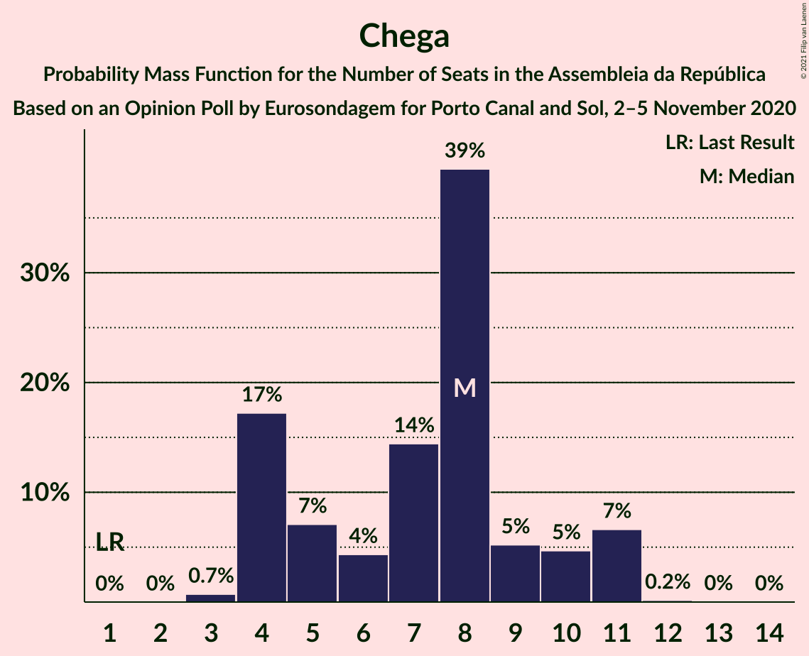
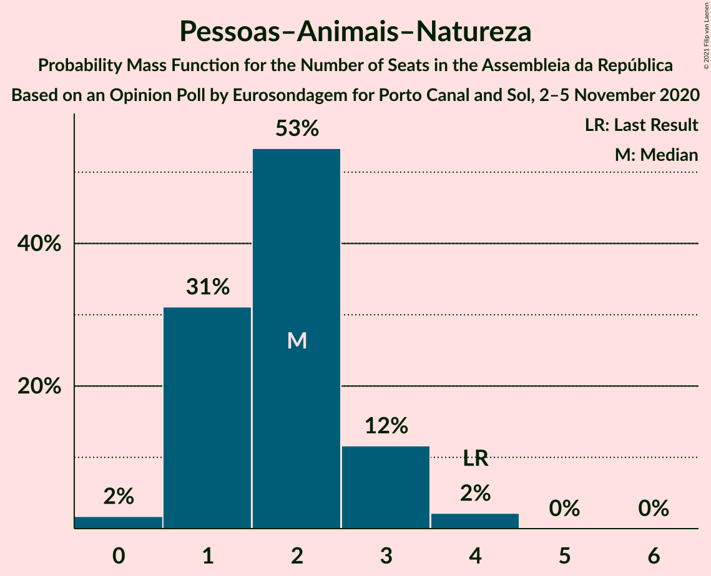

# Opinion Poll by Eurosondagem for Porto Canal and Sol, 2–5 November 2020

<a href="#voting-intentions">Voting Intentions</a> | <a href="#seats">Seats</a> | <a href="#coalitions">Coalitions</a> | <a href="#technical-information">Technical Information</a>

## Voting Intentions

### Confidence Intervals

| Party | Last Result | Poll Result | 80% Confidence Interval | 90% Confidence Interval | 95% Confidence Interval | 99% Confidence Interval |
|:-----:|:-----------:|:-----------:|:-----------------------:|:-----------------------:|:-----------------------:|:-----------------------:|
| Partido Socialista | 36.4% | 38.3% | 36.3–40.3% |35.8–40.8% |35.3–41.3% |34.4–42.3% |
| Partido Social Democrata | 27.8% | 29.7% | 27.9–31.6% |27.4–32.1% |26.9–32.6% |26.1–33.5% |
| Bloco de Esquerda | 9.5% | 8.3% | 7.3–9.5% |7.0–9.9% |6.8–10.2% |6.3–10.8% |
| Coligação Democrática Unitária | 6.3% | 5.8% | 5.0–6.9% |4.7–7.2% |4.5–7.5% |4.2–8.0% |
| Chega | 1.3% | 5.0% | 4.3–6.1% |4.0–6.3% |3.9–6.6% |3.5–7.1% |
| CDS–Partido Popular | 4.2% | 2.7% | 2.1–3.4% |2.0–3.7% |1.8–3.9% |1.6–4.3% |
| Pessoas–Animais–Natureza | 3.3% | 2.2% | 1.7–2.9% |1.6–3.1% |1.4–3.3% |1.2–3.7% |
| Iniciativa Liberal | 1.3% | 1.0% | 0.7–1.5% |0.6–1.7% |0.5–1.8% |0.4–2.1% |

*Note:* The poll result column reflects the actual value used in the calculations. Published results may vary slightly, and in addition be rounded to fewer digits.

## Seats

### Confidence Intervals

| Party | Last Result | Median | 80% Confidence Interval | 90% Confidence Interval | 95% Confidence Interval | 99% Confidence Interval |
|:-----:|:-----------:|:------:|:-----------------------:|:-----------------------:|:-----------------------:|:-----------------------:|
| <a href="#partido-socialista">Partido Socialista</a> | 108 | 109 | 105–116 |100–117 |99–118 |97–121 |
| <a href="#partido-social-democrata">Partido Social Democrata</a> | 79 | 82 | 76–87 |75–89 |73–91 |70–95 |
| <a href="#bloco-de-esquerda">Bloco de Esquerda</a> | 19 | 15 | 15–19 |14–20 |13–21 |10–21 |
| <a href="#coligação-democrática-unitária">Coligação Democrática Unitária</a> | 12 | 9 | 7–14 |6–15 |6–16 |5–16 |
| <a href="#chega">Chega</a> | 1 | 8 | 4–11 |4–11 |4–11 |3–11 |
| <a href="#cds–partido-popular">CDS–Partido Popular</a> | 5 | 2 | 1–2 |1–4 |1–4 |0–5 |
| <a href="#pessoas–animais–natureza">Pessoas–Animais–Natureza</a> | 4 | 2 | 1–3 |1–3 |1–3 |0–4 |
| <a href="#iniciativa-liberal">Iniciativa Liberal</a> | 1 | 1 | 0–1 |0–1 |0–1 |0–3 |

### Partido Socialista

*For a full overview of the results for this party, see the [Partido Socialista](party-partidosocialista.html) page.*

| Number of Seats | Probability | Accumulated | Special Marks |
|:---------------:|:-----------:|:-----------:|:-------------:|
| 95 | 0.3% | 100% |  |
| 96 | 0.1% | 99.6% |  |
| 97 | 0.8% | 99.5% |  |
| 98 | 0.8% | 98.8% |  |
| 99 | 2% | 98% |  |
| 100 | 2% | 96% |  |
| 101 | 1.4% | 94% |  |
| 102 | 1.1% | 92% |  |
| 103 | 0% | 91% |  |
| 104 | 0.3% | 91% |  |
| 105 | 2% | 91% |  |
| 106 | 13% | 89% |  |
| 107 | 11% | 76% |  |
| 108 | 13% | 65% | Last Result |
| 109 | 13% | 52% | Median |
| 110 | 15% | 40% |  |
| 111 | 4% | 25% |  |
| 112 | 0.4% | 21% |  |
| 113 | 3% | 21% |  |
| 114 | 1.5% | 18% |  |
| 115 | 6% | 16% |  |
| 116 | 2% | 10% | Majority |
| 117 | 3% | 8% |  |
| 118 | 4% | 5% |  |
| 119 | 0.3% | 1.0% |  |
| 120 | 0.1% | 0.7% |  |
| 121 | 0.5% | 0.7% |  |
| 122 | 0.1% | 0.2% |  |
| 123 | 0% | 0.1% |  |
| 124 | 0% | 0% |  |

### Partido Social Democrata

*For a full overview of the results for this party, see the [Partido Social Democrata](party-partidosocialdemocrata.html) page.*

| Number of Seats | Probability | Accumulated | Special Marks |
|:---------------:|:-----------:|:-----------:|:-------------:|
| 68 | 0.3% | 100% |  |
| 69 | 0.1% | 99.6% |  |
| 70 | 0.1% | 99.5% |  |
| 71 | 0.4% | 99.4% |  |
| 72 | 0.3% | 99.0% |  |
| 73 | 2% | 98.7% |  |
| 74 | 1.0% | 97% |  |
| 75 | 4% | 96% |  |
| 76 | 5% | 92% |  |
| 77 | 2% | 87% |  |
| 78 | 6% | 85% |  |
| 79 | 6% | 79% | Last Result |
| 80 | 9% | 73% |  |
| 81 | 7% | 64% |  |
| 82 | 7% | 57% | Median |
| 83 | 4% | 50% |  |
| 84 | 7% | 46% |  |
| 85 | 3% | 39% |  |
| 86 | 23% | 36% |  |
| 87 | 4% | 13% |  |
| 88 | 2% | 9% |  |
| 89 | 2% | 7% |  |
| 90 | 1.1% | 4% |  |
| 91 | 1.2% | 3% |  |
| 92 | 0.3% | 2% |  |
| 93 | 0.2% | 2% |  |
| 94 | 0.3% | 2% |  |
| 95 | 0.8% | 1.3% |  |
| 96 | 0.3% | 0.5% |  |
| 97 | 0.1% | 0.2% |  |
| 98 | 0% | 0.1% |  |
| 99 | 0% | 0% |  |

### Bloco de Esquerda

*For a full overview of the results for this party, see the [Bloco de Esquerda](party-blocodeesquerda.html) page.*

| Number of Seats | Probability | Accumulated | Special Marks |
|:---------------:|:-----------:|:-----------:|:-------------:|
| 8 | 0.4% | 100% |  |
| 9 | 0.1% | 99.6% |  |
| 10 | 0.2% | 99.6% |  |
| 11 | 0.6% | 99.3% |  |
| 12 | 0.3% | 98.7% |  |
| 13 | 0.9% | 98% |  |
| 14 | 3% | 97% |  |
| 15 | 49% | 94% | Median |
| 16 | 9% | 45% |  |
| 17 | 10% | 35% |  |
| 18 | 3% | 25% |  |
| 19 | 16% | 23% | Last Result |
| 20 | 4% | 7% |  |
| 21 | 3% | 3% |  |
| 22 | 0.2% | 0.4% |  |
| 23 | 0.2% | 0.2% |  |
| 24 | 0% | 0% |  |

### Coligação Democrática Unitária

*For a full overview of the results for this party, see the [Coligação Democrática Unitária](party-coligaçãodemocráticaunitária.html) page.*

| Number of Seats | Probability | Accumulated | Special Marks |
|:---------------:|:-----------:|:-----------:|:-------------:|
| 5 | 0.6% | 100% |  |
| 6 | 5% | 99.4% |  |
| 7 | 14% | 95% |  |
| 8 | 19% | 80% |  |
| 9 | 28% | 62% | Median |
| 10 | 2% | 33% |  |
| 11 | 6% | 32% |  |
| 12 | 9% | 26% | Last Result |
| 13 | 6% | 17% |  |
| 14 | 5% | 11% |  |
| 15 | 1.3% | 6% |  |
| 16 | 5% | 5% |  |
| 17 | 0.2% | 0.2% |  |
| 18 | 0% | 0% |  |

### Chega

*For a full overview of the results for this party, see the [Chega](party-chega.html) page.*

| Number of Seats | Probability | Accumulated | Special Marks |
|:---------------:|:-----------:|:-----------:|:-------------:|
| 1 | 0% | 100% | Last Result |
| 2 | 0% | 100% |  |
| 3 | 0.6% | 100% |  |
| 4 | 18% | 99.4% |  |
| 5 | 6% | 81% |  |
| 6 | 5% | 75% |  |
| 7 | 10% | 70% |  |
| 8 | 31% | 60% | Median |
| 9 | 9% | 29% |  |
| 10 | 9% | 20% |  |
| 11 | 11% | 11% |  |
| 12 | 0.1% | 0.2% |  |
| 13 | 0% | 0% |  |

### CDS–Partido Popular

*For a full overview of the results for this party, see the [CDS–Partido Popular](party-cds–partidopopular.html) page.*

| Number of Seats | Probability | Accumulated | Special Marks |
|:---------------:|:-----------:|:-----------:|:-------------:|
| 0 | 2% | 100% |  |
| 1 | 42% | 98% |  |
| 2 | 49% | 56% | Median |
| 3 | 0.9% | 7% |  |
| 4 | 5% | 6% |  |
| 5 | 0.5% | 0.5% | Last Result |
| 6 | 0% | 0% |  |

### Pessoas–Animais–Natureza

*For a full overview of the results for this party, see the [Pessoas–Animais–Natureza](party-pessoas–animais–natureza.html) page.*

| Number of Seats | Probability | Accumulated | Special Marks |
|:---------------:|:-----------:|:-----------:|:-------------:|
| 0 | 2% | 100% |  |
| 1 | 32% | 98% |  |
| 2 | 47% | 66% | Median |
| 3 | 18% | 19% |  |
| 4 | 2% | 2% | Last Result |
| 5 | 0% | 0.1% |  |
| 6 | 0% | 0% |  |

### Iniciativa Liberal

*For a full overview of the results for this party, see the [Iniciativa Liberal](party-iniciativaliberal.html) page.*

| Number of Seats | Probability | Accumulated | Special Marks |
|:---------------:|:-----------:|:-----------:|:-------------:|
| 0 | 36% | 100% |  |
| 1 | 61% | 64% | Last Result, Median |
| 2 | 2% | 2% |  |
| 3 | 0.8% | 0.8% |  |
| 4 | 0% | 0% |  |

## Coalitions

### Confidence Intervals

| Coalition | Last Result | Median | Majority? | 80% Confidence Interval | 90% Confidence Interval | 95% Confidence Interval | 99% Confidence Interval |
|:---------:|:-----------:|:------:|:---------:|:-----------------------:|:-----------------------:|:-----------------------:|:-----------------------:|
| Partido Socialista – Bloco de Esquerda – Coligação Democrática Unitária | 139 | 134 | 100% | 130–142 | 128–144 | 126–144 | 121–147 |
| Partido Socialista – Bloco de Esquerda | 127 | 125 | 96% | 121–133 | 117–134 | 114–134 | 113–137 |
| Partido Socialista – Coligação Democrática Unitária | 120 | 118 | 64% | 113–125 | 112–129 | 109–129 | 104–131 |
| Partido Socialista | 108 | 109 | 10% | 105–116 | 100–117 | 99–118 | 97–121 |
| Partido Social Democrata – CDS–Partido Popular | 84 | 84 | 0% | 78–89 | 77–91 | 75–93 | 71–97 |

### Partido Socialista – Bloco de Esquerda – Coligação Democrática Unitária

| Number of Seats | Probability | Accumulated | Special Marks |
|:---------------:|:-----------:|:-----------:|:-------------:|
| 119 | 0.2% | 100% |  |
| 120 | 0.3% | 99.8% |  |
| 121 | 0% | 99.5% |  |
| 122 | 0.1% | 99.5% |  |
| 123 | 0.3% | 99.4% |  |
| 124 | 0.5% | 99.2% |  |
| 125 | 0.4% | 98.6% |  |
| 126 | 0.9% | 98% |  |
| 127 | 2% | 97% |  |
| 128 | 1.4% | 96% |  |
| 129 | 2% | 94% |  |
| 130 | 21% | 92% |  |
| 131 | 1.2% | 71% |  |
| 132 | 5% | 70% |  |
| 133 | 11% | 65% | Median |
| 134 | 11% | 54% |  |
| 135 | 4% | 43% |  |
| 136 | 3% | 39% |  |
| 137 | 6% | 36% |  |
| 138 | 1.2% | 30% |  |
| 139 | 3% | 29% | Last Result |
| 140 | 4% | 26% |  |
| 141 | 7% | 22% |  |
| 142 | 7% | 14% |  |
| 143 | 1.0% | 8% |  |
| 144 | 5% | 7% |  |
| 145 | 1.5% | 2% |  |
| 146 | 0.2% | 0.8% |  |
| 147 | 0.2% | 0.7% |  |
| 148 | 0.3% | 0.4% |  |
| 149 | 0% | 0.1% |  |
| 150 | 0% | 0.1% |  |
| 151 | 0% | 0% |  |

### Partido Socialista – Bloco de Esquerda

| Number of Seats | Probability | Accumulated | Special Marks |
|:---------------:|:-----------:|:-----------:|:-------------:|
| 110 | 0.2% | 100% |  |
| 111 | 0% | 99.8% |  |
| 112 | 0.3% | 99.8% |  |
| 113 | 0.5% | 99.5% |  |
| 114 | 2% | 99.0% |  |
| 115 | 1.1% | 97% |  |
| 116 | 0.3% | 96% | Majority |
| 117 | 2% | 96% |  |
| 118 | 2% | 94% |  |
| 119 | 1.1% | 92% |  |
| 120 | 1.0% | 91% |  |
| 121 | 9% | 90% |  |
| 122 | 6% | 81% |  |
| 123 | 10% | 75% |  |
| 124 | 7% | 64% | Median |
| 125 | 16% | 57% |  |
| 126 | 11% | 42% |  |
| 127 | 8% | 30% | Last Result |
| 128 | 1.4% | 22% |  |
| 129 | 1.3% | 21% |  |
| 130 | 1.2% | 20% |  |
| 131 | 2% | 19% |  |
| 132 | 4% | 16% |  |
| 133 | 5% | 12% |  |
| 134 | 6% | 8% |  |
| 135 | 1.1% | 2% |  |
| 136 | 0.3% | 0.9% |  |
| 137 | 0.3% | 0.5% |  |
| 138 | 0.1% | 0.2% |  |
| 139 | 0% | 0.2% |  |
| 140 | 0.1% | 0.1% |  |
| 141 | 0% | 0.1% |  |
| 142 | 0% | 0% |  |

### Partido Socialista – Coligação Democrática Unitária

| Number of Seats | Probability | Accumulated | Special Marks |
|:---------------:|:-----------:|:-----------:|:-------------:|
| 103 | 0.1% | 100% |  |
| 104 | 0.4% | 99.9% |  |
| 105 | 0.1% | 99.4% |  |
| 106 | 0.5% | 99.3% |  |
| 107 | 0.1% | 98.7% |  |
| 108 | 0.6% | 98.6% |  |
| 109 | 0.5% | 98% |  |
| 110 | 0.3% | 97% |  |
| 111 | 1.2% | 97% |  |
| 112 | 4% | 96% |  |
| 113 | 3% | 92% |  |
| 114 | 5% | 89% |  |
| 115 | 20% | 84% |  |
| 116 | 5% | 64% | Majority |
| 117 | 3% | 59% |  |
| 118 | 8% | 56% | Median |
| 119 | 8% | 47% |  |
| 120 | 2% | 39% | Last Result |
| 121 | 2% | 37% |  |
| 122 | 11% | 35% |  |
| 123 | 10% | 24% |  |
| 124 | 2% | 14% |  |
| 125 | 3% | 12% |  |
| 126 | 0.9% | 8% |  |
| 127 | 0.3% | 7% |  |
| 128 | 2% | 7% |  |
| 129 | 3% | 5% |  |
| 130 | 1.2% | 2% |  |
| 131 | 0.1% | 0.6% |  |
| 132 | 0.4% | 0.5% |  |
| 133 | 0% | 0.1% |  |
| 134 | 0.1% | 0.1% |  |
| 135 | 0% | 0% |  |

### Partido Socialista

| Number of Seats | Probability | Accumulated | Special Marks |
|:---------------:|:-----------:|:-----------:|:-------------:|
| 95 | 0.3% | 100% |  |
| 96 | 0.1% | 99.6% |  |
| 97 | 0.8% | 99.5% |  |
| 98 | 0.8% | 98.8% |  |
| 99 | 2% | 98% |  |
| 100 | 2% | 96% |  |
| 101 | 1.4% | 94% |  |
| 102 | 1.1% | 92% |  |
| 103 | 0% | 91% |  |
| 104 | 0.3% | 91% |  |
| 105 | 2% | 91% |  |
| 106 | 13% | 89% |  |
| 107 | 11% | 76% |  |
| 108 | 13% | 65% | Last Result |
| 109 | 13% | 52% | Median |
| 110 | 15% | 40% |  |
| 111 | 4% | 25% |  |
| 112 | 0.4% | 21% |  |
| 113 | 3% | 21% |  |
| 114 | 1.5% | 18% |  |
| 115 | 6% | 16% |  |
| 116 | 2% | 10% | Majority |
| 117 | 3% | 8% |  |
| 118 | 4% | 5% |  |
| 119 | 0.3% | 1.0% |  |
| 120 | 0.1% | 0.7% |  |
| 121 | 0.5% | 0.7% |  |
| 122 | 0.1% | 0.2% |  |
| 123 | 0% | 0.1% |  |
| 124 | 0% | 0% |  |

### Partido Social Democrata – CDS–Partido Popular

| Number of Seats | Probability | Accumulated | Special Marks |
|:---------------:|:-----------:|:-----------:|:-------------:|
| 70 | 0.4% | 100% |  |
| 71 | 0.2% | 99.6% |  |
| 72 | 0.1% | 99.5% |  |
| 73 | 0.4% | 99.3% |  |
| 74 | 0.2% | 98.9% |  |
| 75 | 2% | 98.7% |  |
| 76 | 0.9% | 97% |  |
| 77 | 4% | 96% |  |
| 78 | 6% | 92% |  |
| 79 | 4% | 86% |  |
| 80 | 8% | 82% |  |
| 81 | 4% | 74% |  |
| 82 | 6% | 70% |  |
| 83 | 6% | 64% |  |
| 84 | 11% | 58% | Last Result, Median |
| 85 | 6% | 47% |  |
| 86 | 4% | 41% |  |
| 87 | 10% | 37% |  |
| 88 | 14% | 27% |  |
| 89 | 4% | 13% |  |
| 90 | 2% | 9% |  |
| 91 | 2% | 7% |  |
| 92 | 2% | 5% |  |
| 93 | 0.7% | 3% |  |
| 94 | 0.3% | 2% |  |
| 95 | 0.2% | 2% |  |
| 96 | 0.9% | 2% |  |
| 97 | 0.3% | 0.7% |  |
| 98 | 0.1% | 0.4% |  |
| 99 | 0.2% | 0.3% |  |
| 100 | 0.1% | 0.1% |  |
| 101 | 0% | 0% |  |

## Technical Information

### Opinion Poll

+ **Polling firm:** Eurosondagem
+ **Commissioner(s):** Porto Canal and Sol
+ **Fieldwork period:** 2–5 November 2020

### Calculations

+ **Sample size:** 1011
+ **Simulations done:** 131,072
+ **Error estimate:** 1.28%

