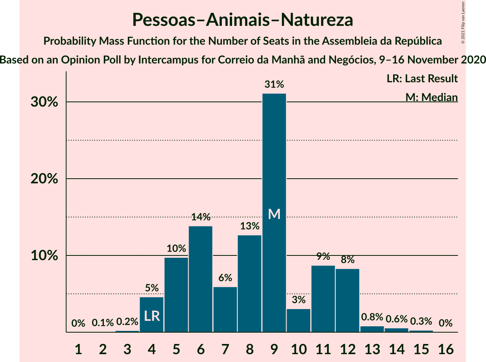

# Opinion Poll by Intercampus for Correio da Manhã and Negócios, 9–16 November 2020

<a href="#voting-intentions">Voting Intentions</a> | <a href="#seats">Seats</a> | <a href="#coalitions">Coalitions</a> | <a href="#technical-information">Technical Information</a>

## Voting Intentions

### Confidence Intervals

| Party | Last Result | Poll Result | 80% Confidence Interval | 90% Confidence Interval | 95% Confidence Interval | 99% Confidence Interval |
|:-----:|:-----------:|:-----------:|:-----------------------:|:-----------------------:|:-----------------------:|:-----------------------:|
| Partido Socialista | 36.4% | 37.1% | 34.7–39.7% |34.0–40.4% |33.4–41.0% |32.3–42.2% |
| Partido Social Democrata | 27.8% | 24.1% | 22.0–26.4% |21.4–27.1% |20.9–27.6% |19.9–28.8% |
| Bloco de Esquerda | 9.5% | 7.7% | 6.5–9.3% |6.2–9.7% |5.9–10.1% |5.3–10.9% |
| Chega | 1.3% | 7.2% | 6.1–8.7% |5.7–9.2% |5.4–9.6% |4.9–10.3% |
| Pessoas–Animais–Natureza | 3.3% | 5.3% | 4.3–6.6% |4.0–7.0% |3.8–7.4% |3.4–8.1% |
| Coligação Democrática Unitária | 6.3% | 4.8% | 3.9–6.1% |3.6–6.5% |3.4–6.8% |3.0–7.5% |
| CDS–Partido Popular | 4.2% | 4.0% | 3.2–5.2% |2.9–5.6% |2.7–5.9% |2.4–6.5% |
| Iniciativa Liberal | 1.3% | 3.4% | 2.6–4.5% |2.4–4.8% |2.2–5.1% |1.9–5.7% |
| LIVRE | 1.1% | 1.8% | 1.2–2.7% |1.1–2.9% |1.0–3.1% |0.8–3.6% |

*Note:* The poll result column reflects the actual value used in the calculations. Published results may vary slightly, and in addition be rounded to fewer digits.

## Seats

### Confidence Intervals

| Party | Last Result | Median | 80% Confidence Interval | 90% Confidence Interval | 95% Confidence Interval | 99% Confidence Interval |
|:-----:|:-----------:|:------:|:-----------------------:|:-----------------------:|:-----------------------:|:-----------------------:|
| <a href="#partido-socialista">Partido Socialista</a> | 108 | 109 | 102–116 |101–119 |99–123 |94–125 |
| <a href="#partido-social-democrata">Partido Social Democrata</a> | 79 | 66 | 60–75 |57–76 |57–78 |54–81 |
| <a href="#bloco-de-esquerda">Bloco de Esquerda</a> | 19 | 16 | 11–18 |11–19 |11–21 |7–23 |
| <a href="#chega">Chega</a> | 1 | 12 | 10–15 |9–19 |8–19 |7–21 |
| <a href="#pessoas–animais–natureza">Pessoas–Animais–Natureza</a> | 4 | 9 | 5–11 |4–12 |4–12 |4–14 |
| <a href="#coligação-democrática-unitária">Coligação Democrática Unitária</a> | 12 | 6 | 6–10 |5–13 |4–14 |2–15 |
| <a href="#cds–partido-popular">CDS–Partido Popular</a> | 5 | 3 | 3–5 |2–9 |1–10 |1–11 |
| <a href="#iniciativa-liberal">Iniciativa Liberal</a> | 1 | 5 | 3–6 |3–6 |2–6 |1–11 |
| <a href="#livre">LIVRE</a> | 1 | 2 | 1–3 |0–3 |0–4 |0–4 |

### Partido Socialista

*For a full overview of the results for this party, see the [Partido Socialista](party-partidosocialista.html) page.*

| Number of Seats | Probability | Accumulated | Special Marks |
|:---------------:|:-----------:|:-----------:|:-------------:|
| 89 | 0% | 100% |  |
| 90 | 0% | 99.9% |  |
| 91 | 0.1% | 99.9% |  |
| 92 | 0.1% | 99.9% |  |
| 93 | 0% | 99.8% |  |
| 94 | 0.3% | 99.8% |  |
| 95 | 0.4% | 99.5% |  |
| 96 | 0.2% | 99.1% |  |
| 97 | 0.2% | 98.9% |  |
| 98 | 0.5% | 98.8% |  |
| 99 | 1.4% | 98% |  |
| 100 | 0.5% | 97% |  |
| 101 | 2% | 96% |  |
| 102 | 9% | 94% |  |
| 103 | 3% | 86% |  |
| 104 | 5% | 82% |  |
| 105 | 0.8% | 77% |  |
| 106 | 5% | 76% |  |
| 107 | 6% | 71% |  |
| 108 | 4% | 65% | Last Result |
| 109 | 32% | 60% | Median |
| 110 | 3% | 29% |  |
| 111 | 0.9% | 26% |  |
| 112 | 3% | 25% |  |
| 113 | 2% | 22% |  |
| 114 | 2% | 20% |  |
| 115 | 2% | 18% |  |
| 116 | 7% | 16% | Majority |
| 117 | 2% | 10% |  |
| 118 | 3% | 8% |  |
| 119 | 0.2% | 5% |  |
| 120 | 0.3% | 5% |  |
| 121 | 2% | 5% |  |
| 122 | 0.3% | 3% |  |
| 123 | 1.1% | 3% |  |
| 124 | 0.5% | 1.5% |  |
| 125 | 0.7% | 1.0% |  |
| 126 | 0% | 0.3% |  |
| 127 | 0% | 0.2% |  |
| 128 | 0% | 0.2% |  |
| 129 | 0.1% | 0.2% |  |
| 130 | 0% | 0.1% |  |
| 131 | 0% | 0% |  |

### Partido Social Democrata

*For a full overview of the results for this party, see the [Partido Social Democrata](party-partidosocialdemocrata.html) page.*

| Number of Seats | Probability | Accumulated | Special Marks |
|:---------------:|:-----------:|:-----------:|:-------------:|
| 49 | 0% | 100% |  |
| 50 | 0% | 99.9% |  |
| 51 | 0% | 99.9% |  |
| 52 | 0.2% | 99.9% |  |
| 53 | 0.1% | 99.8% |  |
| 54 | 0.6% | 99.6% |  |
| 55 | 0.3% | 99.1% |  |
| 56 | 0.4% | 98.8% |  |
| 57 | 3% | 98% |  |
| 58 | 1.0% | 95% |  |
| 59 | 2% | 94% |  |
| 60 | 3% | 92% |  |
| 61 | 2% | 89% |  |
| 62 | 2% | 87% |  |
| 63 | 3% | 85% |  |
| 64 | 28% | 82% |  |
| 65 | 3% | 54% |  |
| 66 | 8% | 51% | Median |
| 67 | 2% | 43% |  |
| 68 | 7% | 41% |  |
| 69 | 3% | 34% |  |
| 70 | 2% | 31% |  |
| 71 | 9% | 29% |  |
| 72 | 5% | 21% |  |
| 73 | 1.4% | 16% |  |
| 74 | 4% | 15% |  |
| 75 | 1.2% | 10% |  |
| 76 | 5% | 9% |  |
| 77 | 0.8% | 4% |  |
| 78 | 2% | 3% |  |
| 79 | 0.7% | 1.5% | Last Result |
| 80 | 0.2% | 0.8% |  |
| 81 | 0.3% | 0.6% |  |
| 82 | 0.1% | 0.3% |  |
| 83 | 0.1% | 0.2% |  |
| 84 | 0% | 0.2% |  |
| 85 | 0% | 0.1% |  |
| 86 | 0.1% | 0.1% |  |
| 87 | 0% | 0% |  |

### Bloco de Esquerda

*For a full overview of the results for this party, see the [Bloco de Esquerda](party-blocodeesquerda.html) page.*

| Number of Seats | Probability | Accumulated | Special Marks |
|:---------------:|:-----------:|:-----------:|:-------------:|
| 7 | 1.1% | 100% |  |
| 8 | 0.3% | 98.9% |  |
| 9 | 0.6% | 98.6% |  |
| 10 | 0.4% | 98% |  |
| 11 | 13% | 98% |  |
| 12 | 7% | 84% |  |
| 13 | 4% | 77% |  |
| 14 | 15% | 74% |  |
| 15 | 3% | 59% |  |
| 16 | 8% | 56% | Median |
| 17 | 33% | 49% |  |
| 18 | 8% | 15% |  |
| 19 | 3% | 7% | Last Result |
| 20 | 2% | 4% |  |
| 21 | 0.2% | 3% |  |
| 22 | 1.0% | 2% |  |
| 23 | 1.1% | 1.4% |  |
| 24 | 0.1% | 0.2% |  |
| 25 | 0% | 0.1% |  |
| 26 | 0% | 0.1% |  |
| 27 | 0% | 0.1% |  |
| 28 | 0% | 0% |  |

### Chega

*For a full overview of the results for this party, see the [Chega](party-chega.html) page.*

| Number of Seats | Probability | Accumulated | Special Marks |
|:---------------:|:-----------:|:-----------:|:-------------:|
| 1 | 0% | 100% | Last Result |
| 2 | 0% | 100% |  |
| 3 | 0% | 100% |  |
| 4 | 0% | 100% |  |
| 5 | 0.1% | 100% |  |
| 6 | 0.4% | 99.9% |  |
| 7 | 1.0% | 99.5% |  |
| 8 | 2% | 98% |  |
| 9 | 6% | 96% |  |
| 10 | 7% | 90% |  |
| 11 | 26% | 83% |  |
| 12 | 8% | 58% | Median |
| 13 | 3% | 50% |  |
| 14 | 11% | 47% |  |
| 15 | 29% | 36% |  |
| 16 | 0.6% | 7% |  |
| 17 | 0.3% | 7% |  |
| 18 | 0.9% | 6% |  |
| 19 | 4% | 5% |  |
| 20 | 0.3% | 2% |  |
| 21 | 1.0% | 1.5% |  |
| 22 | 0.2% | 0.5% |  |
| 23 | 0% | 0.3% |  |
| 24 | 0.1% | 0.2% |  |
| 25 | 0.1% | 0.1% |  |
| 26 | 0% | 0.1% |  |
| 27 | 0% | 0% |  |

### Pessoas–Animais–Natureza

*For a full overview of the results for this party, see the [Pessoas–Animais–Natureza](party-pessoas–animais–natureza.html) page.*

| Number of Seats | Probability | Accumulated | Special Marks |
|:---------------:|:-----------:|:-----------:|:-------------:|
| 2 | 0.1% | 100% |  |
| 3 | 0.2% | 99.9% |  |
| 4 | 6% | 99.8% | Last Result |
| 5 | 12% | 94% |  |
| 6 | 11% | 81% |  |
| 7 | 6% | 70% |  |
| 8 | 8% | 64% |  |
| 9 | 35% | 56% | Median |
| 10 | 5% | 21% |  |
| 11 | 6% | 16% |  |
| 12 | 8% | 10% |  |
| 13 | 0.9% | 2% |  |
| 14 | 0.4% | 0.7% |  |
| 15 | 0.3% | 0.3% |  |
| 16 | 0% | 0% |  |

### Coligação Democrática Unitária

*For a full overview of the results for this party, see the [Coligação Democrática Unitária](party-coligaçãodemocráticaunitária.html) page.*

| Number of Seats | Probability | Accumulated | Special Marks |
|:---------------:|:-----------:|:-----------:|:-------------:|
| 2 | 0.6% | 100% |  |
| 3 | 1.0% | 99.4% |  |
| 4 | 2% | 98% |  |
| 5 | 6% | 97% |  |
| 6 | 47% | 90% | Median |
| 7 | 10% | 43% |  |
| 8 | 9% | 33% |  |
| 9 | 8% | 24% |  |
| 10 | 7% | 16% |  |
| 11 | 1.1% | 9% |  |
| 12 | 2% | 8% | Last Result |
| 13 | 4% | 6% |  |
| 14 | 0.8% | 3% |  |
| 15 | 2% | 2% |  |
| 16 | 0.1% | 0.2% |  |
| 17 | 0% | 0.1% |  |
| 18 | 0% | 0% |  |

### CDS–Partido Popular

*For a full overview of the results for this party, see the [CDS–Partido Popular](party-cds–partidopopular.html) page.*

| Number of Seats | Probability | Accumulated | Special Marks |
|:---------------:|:-----------:|:-----------:|:-------------:|
| 1 | 3% | 100% |  |
| 2 | 7% | 97% |  |
| 3 | 41% | 91% | Median |
| 4 | 7% | 50% |  |
| 5 | 33% | 42% | Last Result |
| 6 | 1.0% | 10% |  |
| 7 | 2% | 9% |  |
| 8 | 0.3% | 7% |  |
| 9 | 4% | 7% |  |
| 10 | 2% | 3% |  |
| 11 | 0.3% | 0.5% |  |
| 12 | 0.1% | 0.2% |  |
| 13 | 0.1% | 0.2% |  |
| 14 | 0% | 0.1% |  |
| 15 | 0% | 0% |  |

### Iniciativa Liberal

*For a full overview of the results for this party, see the [Iniciativa Liberal](party-iniciativaliberal.html) page.*

| Number of Seats | Probability | Accumulated | Special Marks |
|:---------------:|:-----------:|:-----------:|:-------------:|
| 1 | 1.0% | 100% | Last Result |
| 2 | 2% | 99.0% |  |
| 3 | 20% | 97% |  |
| 4 | 13% | 77% |  |
| 5 | 47% | 64% | Median |
| 6 | 15% | 17% |  |
| 7 | 0.1% | 2% |  |
| 8 | 0.4% | 2% |  |
| 9 | 0.7% | 2% |  |
| 10 | 0.4% | 1.0% |  |
| 11 | 0.5% | 0.6% |  |
| 12 | 0% | 0% |  |

### LIVRE

*For a full overview of the results for this party, see the [LIVRE](party-livre.html) page.*

| Number of Seats | Probability | Accumulated | Special Marks |
|:---------------:|:-----------:|:-----------:|:-------------:|
| 0 | 6% | 100% |  |
| 1 | 33% | 94% | Last Result |
| 2 | 36% | 61% | Median |
| 3 | 22% | 25% |  |
| 4 | 2% | 3% |  |
| 5 | 0.2% | 0.2% |  |
| 6 | 0.1% | 0.1% |  |
| 7 | 0% | 0% |  |

## Coalitions

### Confidence Intervals

| Coalition | Last Result | Median | Majority? | 80% Confidence Interval | 90% Confidence Interval | 95% Confidence Interval | 99% Confidence Interval |
|:---------:|:-----------:|:------:|:---------:|:-----------------------:|:-----------------------:|:-----------------------:|:-----------------------:|
| Partido Socialista – Bloco de Esquerda – Coligação Democrática Unitária | 139 | 132 | 99.7% | 124–140 | 121–143 | 121–145 | 118–148 |
| Partido Socialista – Bloco de Esquerda | 127 | 126 | 91% | 116–131 | 113–135 | 113–137 | 109–140 |
| Partido Socialista – Coligação Democrática Unitária | 120 | 115 | 36% | 110–124 | 109–128 | 107–130 | 102–133 |
| Partido Socialista | 108 | 109 | 16% | 102–116 | 101–119 | 99–123 | 94–125 |
| Partido Social Democrata – CDS–Partido Popular | 84 | 70 | 0% | 65–78 | 62–81 | 60–83 | 57–85 |

### Partido Socialista – Bloco de Esquerda – Coligação Democrática Unitária

| Number of Seats | Probability | Accumulated | Special Marks |
|:---------------:|:-----------:|:-----------:|:-------------:|
| 111 | 0% | 100% |  |
| 112 | 0% | 99.9% |  |
| 113 | 0.1% | 99.9% |  |
| 114 | 0% | 99.8% |  |
| 115 | 0% | 99.8% |  |
| 116 | 0.1% | 99.7% | Majority |
| 117 | 0.1% | 99.7% |  |
| 118 | 0.6% | 99.6% |  |
| 119 | 0.2% | 98.9% |  |
| 120 | 0.3% | 98.7% |  |
| 121 | 5% | 98% |  |
| 122 | 0.4% | 93% |  |
| 123 | 2% | 93% |  |
| 124 | 2% | 91% |  |
| 125 | 0.4% | 89% |  |
| 126 | 8% | 88% |  |
| 127 | 3% | 80% |  |
| 128 | 2% | 77% |  |
| 129 | 7% | 75% |  |
| 130 | 3% | 68% |  |
| 131 | 9% | 65% | Median |
| 132 | 25% | 56% |  |
| 133 | 5% | 30% |  |
| 134 | 2% | 25% |  |
| 135 | 2% | 22% |  |
| 136 | 5% | 20% |  |
| 137 | 2% | 15% |  |
| 138 | 2% | 13% |  |
| 139 | 1.2% | 11% | Last Result |
| 140 | 1.1% | 10% |  |
| 141 | 2% | 9% |  |
| 142 | 1.5% | 7% |  |
| 143 | 2% | 6% |  |
| 144 | 0.2% | 4% |  |
| 145 | 1.4% | 4% |  |
| 146 | 2% | 2% |  |
| 147 | 0.2% | 0.7% |  |
| 148 | 0.2% | 0.5% |  |
| 149 | 0.1% | 0.3% |  |
| 150 | 0.3% | 0.3% |  |
| 151 | 0% | 0% |  |

### Partido Socialista – Bloco de Esquerda

| Number of Seats | Probability | Accumulated | Special Marks |
|:---------------:|:-----------:|:-----------:|:-------------:|
| 103 | 0% | 100% |  |
| 104 | 0% | 99.9% |  |
| 105 | 0% | 99.9% |  |
| 106 | 0.1% | 99.9% |  |
| 107 | 0.1% | 99.8% |  |
| 108 | 0.2% | 99.7% |  |
| 109 | 0% | 99.5% |  |
| 110 | 0.1% | 99.5% |  |
| 111 | 0.3% | 99.3% |  |
| 112 | 0.4% | 99.1% |  |
| 113 | 7% | 98.7% |  |
| 114 | 0.7% | 92% |  |
| 115 | 0.6% | 91% |  |
| 116 | 0.9% | 91% | Majority |
| 117 | 1.5% | 90% |  |
| 118 | 3% | 88% |  |
| 119 | 6% | 85% |  |
| 120 | 5% | 79% |  |
| 121 | 3% | 74% |  |
| 122 | 5% | 71% |  |
| 123 | 6% | 66% |  |
| 124 | 4% | 60% |  |
| 125 | 4% | 56% | Median |
| 126 | 28% | 52% |  |
| 127 | 6% | 24% | Last Result |
| 128 | 1.1% | 18% |  |
| 129 | 0.6% | 17% |  |
| 130 | 4% | 16% |  |
| 131 | 3% | 13% |  |
| 132 | 0.7% | 9% |  |
| 133 | 2% | 9% |  |
| 134 | 0.8% | 7% |  |
| 135 | 2% | 6% |  |
| 136 | 2% | 4% |  |
| 137 | 1.4% | 3% |  |
| 138 | 0.6% | 1.3% |  |
| 139 | 0.1% | 0.6% |  |
| 140 | 0.2% | 0.6% |  |
| 141 | 0.3% | 0.4% |  |
| 142 | 0% | 0.1% |  |
| 143 | 0% | 0.1% |  |
| 144 | 0% | 0.1% |  |
| 145 | 0% | 0% |  |

### Partido Socialista – Coligação Democrática Unitária

| Number of Seats | Probability | Accumulated | Special Marks |
|:---------------:|:-----------:|:-----------:|:-------------:|
| 97 | 0% | 100% |  |
| 98 | 0% | 99.9% |  |
| 99 | 0% | 99.9% |  |
| 100 | 0.1% | 99.9% |  |
| 101 | 0% | 99.8% |  |
| 102 | 0.6% | 99.7% |  |
| 103 | 0.1% | 99.1% |  |
| 104 | 0.3% | 99.0% |  |
| 105 | 0.4% | 98.7% |  |
| 106 | 0.3% | 98% |  |
| 107 | 1.0% | 98% |  |
| 108 | 0.8% | 97% |  |
| 109 | 5% | 96% |  |
| 110 | 6% | 91% |  |
| 111 | 2% | 85% |  |
| 112 | 3% | 83% |  |
| 113 | 6% | 80% |  |
| 114 | 5% | 73% |  |
| 115 | 32% | 68% | Median |
| 116 | 3% | 36% | Majority |
| 117 | 4% | 33% |  |
| 118 | 2% | 29% |  |
| 119 | 1.2% | 26% |  |
| 120 | 4% | 25% | Last Result |
| 121 | 3% | 21% |  |
| 122 | 6% | 18% |  |
| 123 | 2% | 12% |  |
| 124 | 2% | 11% |  |
| 125 | 1.1% | 9% |  |
| 126 | 0.3% | 8% |  |
| 127 | 0.4% | 7% |  |
| 128 | 2% | 7% |  |
| 129 | 2% | 5% |  |
| 130 | 1.0% | 3% |  |
| 131 | 0.2% | 2% |  |
| 132 | 0.3% | 2% |  |
| 133 | 2% | 2% |  |
| 134 | 0.1% | 0.3% |  |
| 135 | 0.1% | 0.2% |  |
| 136 | 0% | 0.2% |  |
| 137 | 0.1% | 0.2% |  |
| 138 | 0% | 0.1% |  |
| 139 | 0% | 0% |  |

### Partido Socialista

| Number of Seats | Probability | Accumulated | Special Marks |
|:---------------:|:-----------:|:-----------:|:-------------:|
| 89 | 0% | 100% |  |
| 90 | 0% | 99.9% |  |
| 91 | 0.1% | 99.9% |  |
| 92 | 0.1% | 99.9% |  |
| 93 | 0% | 99.8% |  |
| 94 | 0.3% | 99.8% |  |
| 95 | 0.4% | 99.5% |  |
| 96 | 0.2% | 99.1% |  |
| 97 | 0.2% | 98.9% |  |
| 98 | 0.5% | 98.8% |  |
| 99 | 1.4% | 98% |  |
| 100 | 0.5% | 97% |  |
| 101 | 2% | 96% |  |
| 102 | 9% | 94% |  |
| 103 | 3% | 86% |  |
| 104 | 5% | 82% |  |
| 105 | 0.8% | 77% |  |
| 106 | 5% | 76% |  |
| 107 | 6% | 71% |  |
| 108 | 4% | 65% | Last Result |
| 109 | 32% | 60% | Median |
| 110 | 3% | 29% |  |
| 111 | 0.9% | 26% |  |
| 112 | 3% | 25% |  |
| 113 | 2% | 22% |  |
| 114 | 2% | 20% |  |
| 115 | 2% | 18% |  |
| 116 | 7% | 16% | Majority |
| 117 | 2% | 10% |  |
| 118 | 3% | 8% |  |
| 119 | 0.2% | 5% |  |
| 120 | 0.3% | 5% |  |
| 121 | 2% | 5% |  |
| 122 | 0.3% | 3% |  |
| 123 | 1.1% | 3% |  |
| 124 | 0.5% | 1.5% |  |
| 125 | 0.7% | 1.0% |  |
| 126 | 0% | 0.3% |  |
| 127 | 0% | 0.2% |  |
| 128 | 0% | 0.2% |  |
| 129 | 0.1% | 0.2% |  |
| 130 | 0% | 0.1% |  |
| 131 | 0% | 0% |  |

### Partido Social Democrata – CDS–Partido Popular

| Number of Seats | Probability | Accumulated | Special Marks |
|:---------------:|:-----------:|:-----------:|:-------------:|
| 54 | 0.1% | 100% |  |
| 55 | 0% | 99.9% |  |
| 56 | 0.1% | 99.9% |  |
| 57 | 0.4% | 99.8% |  |
| 58 | 0.3% | 99.4% |  |
| 59 | 0.2% | 99.1% |  |
| 60 | 2% | 98.8% |  |
| 61 | 0.5% | 97% |  |
| 62 | 3% | 97% |  |
| 63 | 1.0% | 94% |  |
| 64 | 2% | 93% |  |
| 65 | 3% | 92% |  |
| 66 | 2% | 88% |  |
| 67 | 26% | 87% |  |
| 68 | 4% | 61% |  |
| 69 | 3% | 57% | Median |
| 70 | 6% | 54% |  |
| 71 | 4% | 48% |  |
| 72 | 3% | 44% |  |
| 73 | 7% | 41% |  |
| 74 | 8% | 35% |  |
| 75 | 4% | 26% |  |
| 76 | 1.4% | 22% |  |
| 77 | 8% | 21% |  |
| 78 | 4% | 13% |  |
| 79 | 0.2% | 9% |  |
| 80 | 0.5% | 9% |  |
| 81 | 5% | 8% |  |
| 82 | 0.8% | 3% |  |
| 83 | 1.2% | 3% |  |
| 84 | 0.7% | 1.3% | Last Result |
| 85 | 0.2% | 0.6% |  |
| 86 | 0% | 0.4% |  |
| 87 | 0.1% | 0.4% |  |
| 88 | 0.1% | 0.3% |  |
| 89 | 0.1% | 0.2% |  |
| 90 | 0% | 0.1% |  |
| 91 | 0.1% | 0.1% |  |
| 92 | 0% | 0% |  |

## Technical Information

### Opinion Poll

+ **Polling firm:** Intercampus
+ **Commissioner(s):** Correio da Manhã and Negócios
+ **Fieldwork period:** 9–16 November 2020

### Calculations

+ **Sample size:** 622
+ **Simulations done:** 131,072
+ **Error estimate:** 3.89%

