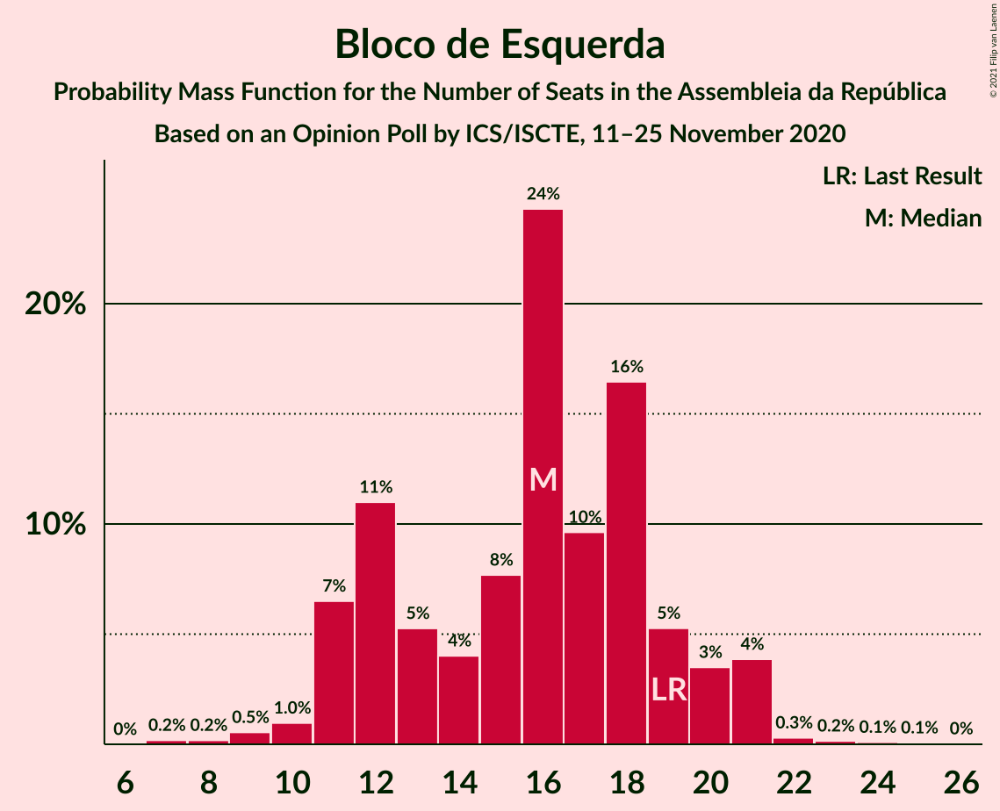
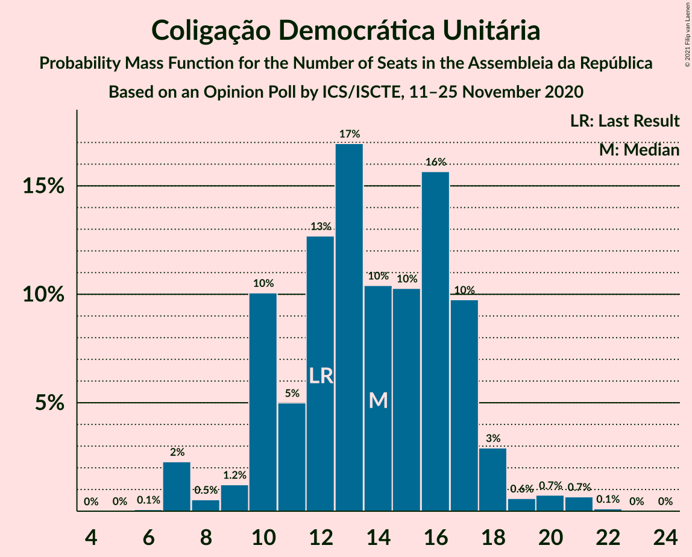
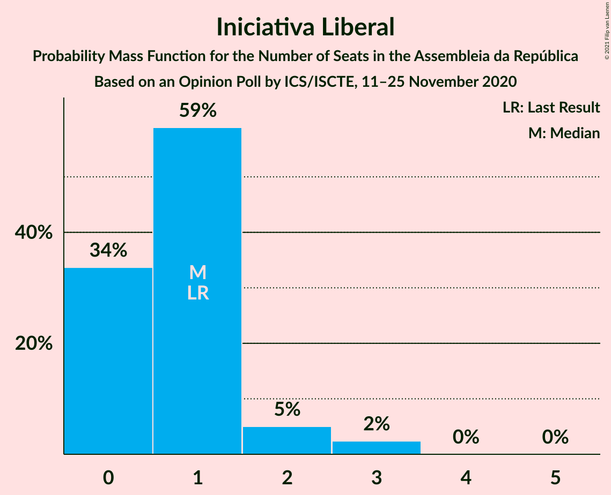

# Opinion Poll by ICS/ISCTE, 11–25 November 2020

<a href="#voting-intentions">Voting Intentions</a> | <a href="#seats">Seats</a> | <a href="#coalitions">Coalitions</a> | <a href="#technical-information">Technical Information</a>

## Voting Intentions

### Confidence Intervals

| Party | Last Result | Poll Result | 80% Confidence Interval | 90% Confidence Interval | 95% Confidence Interval | 99% Confidence Interval |
|:-----:|:-----------:|:-----------:|:-----------------------:|:-----------------------:|:-----------------------:|:-----------------------:|
| Partido Socialista | 36.4% | 39.0% | 36.9–41.3% |36.2–41.9% |35.7–42.5% |34.7–43.5% |
| Partido Social Democrata | 27.8% | 25.1% | 23.2–27.1% |22.6–27.7% |22.2–28.2% |21.3–29.2% |
| Bloco de Esquerda | 9.5% | 8.0% | 6.9–9.3% |6.6–9.7% |6.3–10.1% |5.8–10.8% |
| Coligação Democrática Unitária | 6.3% | 7.0% | 5.9–8.3% |5.7–8.6% |5.4–9.0% |5.0–9.6% |
| Chega | 1.3% | 7.0% | 5.9–8.3% |5.7–8.6% |5.4–9.0% |5.0–9.6% |
| CDS–Partido Popular | 4.2% | 2.0% | 1.5–2.8% |1.3–3.0% |1.2–3.2% |1.0–3.6% |
| Pessoas–Animais–Natureza | 3.3% | 2.0% | 1.5–2.8% |1.3–3.0% |1.2–3.2% |1.0–3.6% |
| Iniciativa Liberal | 1.3% | 1.0% | 0.7–1.6% |0.6–1.8% |0.5–2.0% |0.4–2.3% |

*Note:* The poll result column reflects the actual value used in the calculations. Published results may vary slightly, and in addition be rounded to fewer digits.

## Seats

### Confidence Intervals

| Party | Last Result | Median | 80% Confidence Interval | 90% Confidence Interval | 95% Confidence Interval | 99% Confidence Interval |
|:-----:|:-----------:|:------:|:-----------------------:|:-----------------------:|:-----------------------:|:-----------------------:|
| <a href="#partido-socialista">Partido Socialista</a> | 108 | 118 | 109–125 |106–126 |104–127 |103–128 |
| <a href="#partido-social-democrata">Partido Social Democrata</a> | 79 | 68 | 61–74 |61–76 |61–79 |58–83 |
| <a href="#bloco-de-esquerda">Bloco de Esquerda</a> | 19 | 16 | 13–19 |11–20 |10–20 |9–23 |
| <a href="#coligação-democrática-unitária">Coligação Democrática Unitária</a> | 12 | 13 | 10–17 |8–18 |7–19 |7–21 |
| <a href="#chega">Chega</a> | 1 | 11 | 9–14 |8–16 |8–17 |7–17 |
| <a href="#cds–partido-popular">CDS–Partido Popular</a> | 5 | 1 | 0–2 |0–2 |0–2 |0–4 |
| <a href="#pessoas–animais–natureza">Pessoas–Animais–Natureza</a> | 4 | 1 | 1–2 |1–3 |0–3 |0–4 |
| <a href="#iniciativa-liberal">Iniciativa Liberal</a> | 1 | 1 | 0–1 |0–2 |0–2 |0–3 |

### Partido Socialista

*For a full overview of the results for this party, see the [Partido Socialista](party-partidosocialista.html) page.*

| Number of Seats | Probability | Accumulated | Special Marks |
|:---------------:|:-----------:|:-----------:|:-------------:|
| 98 | 0% | 100% |  |
| 99 | 0.1% | 99.9% |  |
| 100 | 0% | 99.9% |  |
| 101 | 0.1% | 99.9% |  |
| 102 | 0.2% | 99.7% |  |
| 103 | 1.4% | 99.6% |  |
| 104 | 0.9% | 98% |  |
| 105 | 0.9% | 97% |  |
| 106 | 4% | 96% |  |
| 107 | 2% | 93% |  |
| 108 | 0.8% | 91% | Last Result |
| 109 | 4% | 90% |  |
| 110 | 3% | 87% |  |
| 111 | 8% | 83% |  |
| 112 | 3% | 76% |  |
| 113 | 4% | 73% |  |
| 114 | 2% | 69% |  |
| 115 | 9% | 67% |  |
| 116 | 3% | 58% | Majority |
| 117 | 5% | 55% |  |
| 118 | 6% | 50% | Median |
| 119 | 3% | 44% |  |
| 120 | 3% | 41% |  |
| 121 | 20% | 38% |  |
| 122 | 0.6% | 18% |  |
| 123 | 1.3% | 18% |  |
| 124 | 2% | 16% |  |
| 125 | 7% | 14% |  |
| 126 | 3% | 7% |  |
| 127 | 2% | 4% |  |
| 128 | 2% | 2% |  |
| 129 | 0.1% | 0.4% |  |
| 130 | 0.1% | 0.3% |  |
| 131 | 0.1% | 0.2% |  |
| 132 | 0% | 0.1% |  |
| 133 | 0% | 0.1% |  |
| 134 | 0% | 0% |  |

### Partido Social Democrata

*For a full overview of the results for this party, see the [Partido Social Democrata](party-partidosocialdemocrata.html) page.*

| Number of Seats | Probability | Accumulated | Special Marks |
|:---------------:|:-----------:|:-----------:|:-------------:|
| 55 | 0.1% | 100% |  |
| 56 | 0.1% | 99.8% |  |
| 57 | 0.2% | 99.7% |  |
| 58 | 0.3% | 99.5% |  |
| 59 | 0.5% | 99.2% |  |
| 60 | 0.6% | 98.7% |  |
| 61 | 10% | 98% |  |
| 62 | 0.5% | 88% |  |
| 63 | 5% | 87% |  |
| 64 | 0.9% | 83% |  |
| 65 | 3% | 82% |  |
| 66 | 3% | 79% |  |
| 67 | 22% | 76% |  |
| 68 | 11% | 54% | Median |
| 69 | 2% | 43% |  |
| 70 | 8% | 41% |  |
| 71 | 7% | 33% |  |
| 72 | 8% | 26% |  |
| 73 | 2% | 19% |  |
| 74 | 8% | 16% |  |
| 75 | 1.1% | 9% |  |
| 76 | 3% | 8% |  |
| 77 | 1.5% | 5% |  |
| 78 | 0.2% | 3% |  |
| 79 | 0.8% | 3% | Last Result |
| 80 | 1.4% | 2% |  |
| 81 | 0% | 0.7% |  |
| 82 | 0.1% | 0.6% |  |
| 83 | 0.3% | 0.5% |  |
| 84 | 0.1% | 0.3% |  |
| 85 | 0.1% | 0.2% |  |
| 86 | 0% | 0.1% |  |
| 87 | 0% | 0% |  |

### Bloco de Esquerda

*For a full overview of the results for this party, see the [Bloco de Esquerda](party-blocodeesquerda.html) page.*

| Number of Seats | Probability | Accumulated | Special Marks |
|:---------------:|:-----------:|:-----------:|:-------------:|
| 7 | 0.3% | 100% |  |
| 8 | 0.1% | 99.7% |  |
| 9 | 1.3% | 99.6% |  |
| 10 | 2% | 98% |  |
| 11 | 4% | 97% |  |
| 12 | 3% | 93% |  |
| 13 | 6% | 90% |  |
| 14 | 5% | 84% |  |
| 15 | 14% | 79% |  |
| 16 | 47% | 65% | Median |
| 17 | 2% | 17% |  |
| 18 | 5% | 15% |  |
| 19 | 4% | 11% | Last Result |
| 20 | 4% | 7% |  |
| 21 | 1.3% | 2% |  |
| 22 | 0.6% | 1.2% |  |
| 23 | 0.5% | 0.6% |  |
| 24 | 0% | 0.1% |  |
| 25 | 0.1% | 0.1% |  |
| 26 | 0% | 0% |  |

### Coligação Democrática Unitária

*For a full overview of the results for this party, see the [Coligação Democrática Unitária](party-coligaçãodemocráticaunitária.html) page.*

| Number of Seats | Probability | Accumulated | Special Marks |
|:---------------:|:-----------:|:-----------:|:-------------:|
| 6 | 0.1% | 100% |  |
| 7 | 5% | 99.9% |  |
| 8 | 0.6% | 95% |  |
| 9 | 0.9% | 95% |  |
| 10 | 7% | 94% |  |
| 11 | 4% | 87% |  |
| 12 | 31% | 83% | Last Result |
| 13 | 7% | 53% | Median |
| 14 | 6% | 46% |  |
| 15 | 15% | 40% |  |
| 16 | 7% | 25% |  |
| 17 | 11% | 18% |  |
| 18 | 2% | 6% |  |
| 19 | 2% | 4% |  |
| 20 | 0.8% | 2% |  |
| 21 | 0.8% | 1.0% |  |
| 22 | 0.1% | 0.2% |  |
| 23 | 0% | 0% |  |

### Chega

*For a full overview of the results for this party, see the [Chega](party-chega.html) page.*

| Number of Seats | Probability | Accumulated | Special Marks |
|:---------------:|:-----------:|:-----------:|:-------------:|
| 1 | 0% | 100% | Last Result |
| 2 | 0% | 100% |  |
| 3 | 0% | 100% |  |
| 4 | 0% | 100% |  |
| 5 | 0.1% | 100% |  |
| 6 | 0.1% | 99.9% |  |
| 7 | 0.7% | 99.8% |  |
| 8 | 8% | 99.1% |  |
| 9 | 3% | 91% |  |
| 10 | 0.8% | 88% |  |
| 11 | 55% | 87% | Median |
| 12 | 9% | 32% |  |
| 13 | 3% | 23% |  |
| 14 | 11% | 20% |  |
| 15 | 1.4% | 8% |  |
| 16 | 4% | 7% |  |
| 17 | 3% | 3% |  |
| 18 | 0.1% | 0.3% |  |
| 19 | 0% | 0.2% |  |
| 20 | 0.1% | 0.2% |  |
| 21 | 0% | 0.1% |  |
| 22 | 0% | 0.1% |  |
| 23 | 0% | 0% |  |

### CDS–Partido Popular

*For a full overview of the results for this party, see the [CDS–Partido Popular](party-cds–partidopopular.html) page.*

| Number of Seats | Probability | Accumulated | Special Marks |
|:---------------:|:-----------:|:-----------:|:-------------:|
| 0 | 47% | 100% |  |
| 1 | 37% | 53% | Median |
| 2 | 14% | 16% |  |
| 3 | 1.3% | 2% |  |
| 4 | 0.8% | 1.0% |  |
| 5 | 0.2% | 0.2% | Last Result |
| 6 | 0% | 0% |  |

### Pessoas–Animais–Natureza

*For a full overview of the results for this party, see the [Pessoas–Animais–Natureza](party-pessoas–animais–natureza.html) page.*

| Number of Seats | Probability | Accumulated | Special Marks |
|:---------------:|:-----------:|:-----------:|:-------------:|
| 0 | 5% | 100% |  |
| 1 | 53% | 95% | Median |
| 2 | 37% | 42% |  |
| 3 | 5% | 6% |  |
| 4 | 1.1% | 1.3% | Last Result |
| 5 | 0.2% | 0.2% |  |
| 6 | 0% | 0% |  |

### Iniciativa Liberal

*For a full overview of the results for this party, see the [Iniciativa Liberal](party-iniciativaliberal.html) page.*

| Number of Seats | Probability | Accumulated | Special Marks |
|:---------------:|:-----------:|:-----------:|:-------------:|
| 0 | 33% | 100% |  |
| 1 | 61% | 67% | Last Result, Median |
| 2 | 4% | 6% |  |
| 3 | 2% | 2% |  |
| 4 | 0% | 0% |  |

## Coalitions

### Confidence Intervals

| Coalition | Last Result | Median | Majority? | 80% Confidence Interval | 90% Confidence Interval | 95% Confidence Interval | 99% Confidence Interval |
|:---------:|:-----------:|:------:|:---------:|:-----------------------:|:-----------------------:|:-----------------------:|:-----------------------:|
| Partido Socialista – Bloco de Esquerda – Coligação Democrática Unitária | 139 | 145 | 100% | 138–154 | 137–155 | 135–155 | 132–156 |
| Partido Socialista – Bloco de Esquerda | 127 | 134 | 99.8% | 124–140 | 122–141 | 121–142 | 118–145 |
| Partido Socialista – Coligação Democrática Unitária | 120 | 130 | 99.1% | 122–140 | 121–140 | 119–140 | 115–142 |
| Partido Socialista | 108 | 118 | 58% | 109–125 | 106–126 | 104–127 | 103–128 |
| Partido Social Democrata – CDS–Partido Popular | 84 | 68 | 0% | 62–76 | 62–77 | 62–79 | 58–84 |

### Partido Socialista – Bloco de Esquerda – Coligação Democrática Unitária

| Number of Seats | Probability | Accumulated | Special Marks |
|:---------------:|:-----------:|:-----------:|:-------------:|
| 127 | 0% | 100% |  |
| 128 | 0% | 99.9% |  |
| 129 | 0% | 99.9% |  |
| 130 | 0.1% | 99.9% |  |
| 131 | 0.1% | 99.8% |  |
| 132 | 0.4% | 99.7% |  |
| 133 | 1.0% | 99.2% |  |
| 134 | 0.1% | 98% |  |
| 135 | 0.7% | 98% |  |
| 136 | 2% | 97% |  |
| 137 | 5% | 96% |  |
| 138 | 2% | 90% |  |
| 139 | 2% | 88% | Last Result |
| 140 | 3% | 86% |  |
| 141 | 3% | 83% |  |
| 142 | 2% | 80% |  |
| 143 | 6% | 78% |  |
| 144 | 12% | 72% |  |
| 145 | 10% | 60% |  |
| 146 | 2% | 50% |  |
| 147 | 4% | 48% | Median |
| 148 | 6% | 44% |  |
| 149 | 19% | 38% |  |
| 150 | 0.9% | 18% |  |
| 151 | 2% | 17% |  |
| 152 | 0.9% | 16% |  |
| 153 | 3% | 15% |  |
| 154 | 3% | 12% |  |
| 155 | 7% | 9% |  |
| 156 | 1.1% | 2% |  |
| 157 | 0% | 0.5% |  |
| 158 | 0.2% | 0.5% |  |
| 159 | 0.1% | 0.3% |  |
| 160 | 0.2% | 0.2% |  |
| 161 | 0% | 0% |  |

### Partido Socialista – Bloco de Esquerda

| Number of Seats | Probability | Accumulated | Special Marks |
|:---------------:|:-----------:|:-----------:|:-------------:|
| 112 | 0% | 100% |  |
| 113 | 0% | 99.9% |  |
| 114 | 0.1% | 99.9% |  |
| 115 | 0% | 99.8% |  |
| 116 | 0% | 99.8% | Majority |
| 117 | 0.3% | 99.8% |  |
| 118 | 0.1% | 99.5% |  |
| 119 | 0.4% | 99.5% |  |
| 120 | 0.7% | 99.0% |  |
| 121 | 3% | 98% |  |
| 122 | 3% | 95% |  |
| 123 | 0.9% | 92% |  |
| 124 | 1.1% | 91% |  |
| 125 | 3% | 90% |  |
| 126 | 3% | 87% |  |
| 127 | 8% | 84% | Last Result |
| 128 | 9% | 76% |  |
| 129 | 4% | 67% |  |
| 130 | 3% | 63% |  |
| 131 | 5% | 61% |  |
| 132 | 2% | 56% |  |
| 133 | 2% | 54% |  |
| 134 | 7% | 52% | Median |
| 135 | 2% | 45% |  |
| 136 | 6% | 44% |  |
| 137 | 22% | 38% |  |
| 138 | 0.8% | 16% |  |
| 139 | 2% | 15% |  |
| 140 | 7% | 13% |  |
| 141 | 3% | 6% |  |
| 142 | 3% | 4% |  |
| 143 | 0.1% | 0.8% |  |
| 144 | 0.1% | 0.7% |  |
| 145 | 0.2% | 0.6% |  |
| 146 | 0.1% | 0.4% |  |
| 147 | 0.1% | 0.3% |  |
| 148 | 0.1% | 0.2% |  |
| 149 | 0.1% | 0.1% |  |
| 150 | 0% | 0% |  |

### Partido Socialista – Coligação Democrática Unitária

| Number of Seats | Probability | Accumulated | Special Marks |
|:---------------:|:-----------:|:-----------:|:-------------:|
| 112 | 0% | 100% |  |
| 113 | 0% | 99.9% |  |
| 114 | 0% | 99.9% |  |
| 115 | 0.8% | 99.9% |  |
| 116 | 0.3% | 99.1% | Majority |
| 117 | 0.3% | 98.7% |  |
| 118 | 0.2% | 98% |  |
| 119 | 0.9% | 98% |  |
| 120 | 1.4% | 97% | Last Result |
| 121 | 4% | 96% |  |
| 122 | 2% | 92% |  |
| 123 | 3% | 89% |  |
| 124 | 2% | 86% |  |
| 125 | 4% | 85% |  |
| 126 | 3% | 81% |  |
| 127 | 5% | 78% |  |
| 128 | 14% | 73% |  |
| 129 | 8% | 59% |  |
| 130 | 2% | 52% |  |
| 131 | 2% | 49% | Median |
| 132 | 8% | 47% |  |
| 133 | 19% | 39% |  |
| 134 | 2% | 20% |  |
| 135 | 1.1% | 19% |  |
| 136 | 0.8% | 18% |  |
| 137 | 2% | 17% |  |
| 138 | 3% | 15% |  |
| 139 | 2% | 12% |  |
| 140 | 8% | 11% |  |
| 141 | 1.2% | 2% |  |
| 142 | 0.8% | 1.0% |  |
| 143 | 0.1% | 0.2% |  |
| 144 | 0.1% | 0.1% |  |
| 145 | 0% | 0.1% |  |
| 146 | 0% | 0.1% |  |
| 147 | 0% | 0.1% |  |
| 148 | 0% | 0% |  |

### Partido Socialista

| Number of Seats | Probability | Accumulated | Special Marks |
|:---------------:|:-----------:|:-----------:|:-------------:|
| 98 | 0% | 100% |  |
| 99 | 0.1% | 99.9% |  |
| 100 | 0% | 99.9% |  |
| 101 | 0.1% | 99.9% |  |
| 102 | 0.2% | 99.7% |  |
| 103 | 1.4% | 99.6% |  |
| 104 | 0.9% | 98% |  |
| 105 | 0.9% | 97% |  |
| 106 | 4% | 96% |  |
| 107 | 2% | 93% |  |
| 108 | 0.8% | 91% | Last Result |
| 109 | 4% | 90% |  |
| 110 | 3% | 87% |  |
| 111 | 8% | 83% |  |
| 112 | 3% | 76% |  |
| 113 | 4% | 73% |  |
| 114 | 2% | 69% |  |
| 115 | 9% | 67% |  |
| 116 | 3% | 58% | Majority |
| 117 | 5% | 55% |  |
| 118 | 6% | 50% | Median |
| 119 | 3% | 44% |  |
| 120 | 3% | 41% |  |
| 121 | 20% | 38% |  |
| 122 | 0.6% | 18% |  |
| 123 | 1.3% | 18% |  |
| 124 | 2% | 16% |  |
| 125 | 7% | 14% |  |
| 126 | 3% | 7% |  |
| 127 | 2% | 4% |  |
| 128 | 2% | 2% |  |
| 129 | 0.1% | 0.4% |  |
| 130 | 0.1% | 0.3% |  |
| 131 | 0.1% | 0.2% |  |
| 132 | 0% | 0.1% |  |
| 133 | 0% | 0.1% |  |
| 134 | 0% | 0% |  |

### Partido Social Democrata – CDS–Partido Popular

| Number of Seats | Probability | Accumulated | Special Marks |
|:---------------:|:-----------:|:-----------:|:-------------:|
| 56 | 0.2% | 100% |  |
| 57 | 0.1% | 99.8% |  |
| 58 | 0.3% | 99.7% |  |
| 59 | 0.1% | 99.4% |  |
| 60 | 0.2% | 99.3% |  |
| 61 | 1.4% | 99.1% |  |
| 62 | 9% | 98% |  |
| 63 | 0.7% | 88% |  |
| 64 | 5% | 88% |  |
| 65 | 1.4% | 83% |  |
| 66 | 1.2% | 81% |  |
| 67 | 23% | 80% |  |
| 68 | 10% | 57% |  |
| 69 | 2% | 47% | Median |
| 70 | 3% | 44% |  |
| 71 | 7% | 41% |  |
| 72 | 11% | 34% |  |
| 73 | 5% | 24% |  |
| 74 | 3% | 19% |  |
| 75 | 5% | 16% |  |
| 76 | 3% | 11% |  |
| 77 | 4% | 8% |  |
| 78 | 0.7% | 4% |  |
| 79 | 0.8% | 3% |  |
| 80 | 0.1% | 2% |  |
| 81 | 1.0% | 2% |  |
| 82 | 0.5% | 1.1% |  |
| 83 | 0.1% | 0.6% |  |
| 84 | 0.2% | 0.5% | Last Result |
| 85 | 0.2% | 0.3% |  |
| 86 | 0% | 0.1% |  |
| 87 | 0% | 0.1% |  |
| 88 | 0% | 0.1% |  |
| 89 | 0% | 0% |  |

## Technical Information

### Opinion Poll

+ **Polling firm:** ICS/ISCTE
+ **Commissioner(s):** —
+ **Fieldwork period:** 11–25 November 2020

### Calculations

+ **Sample size:** 802
+ **Simulations done:** 131,072
+ **Error estimate:** 2.00%

