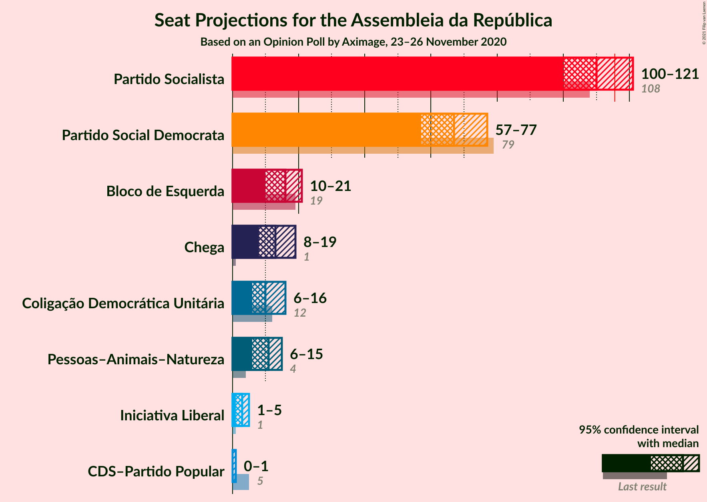
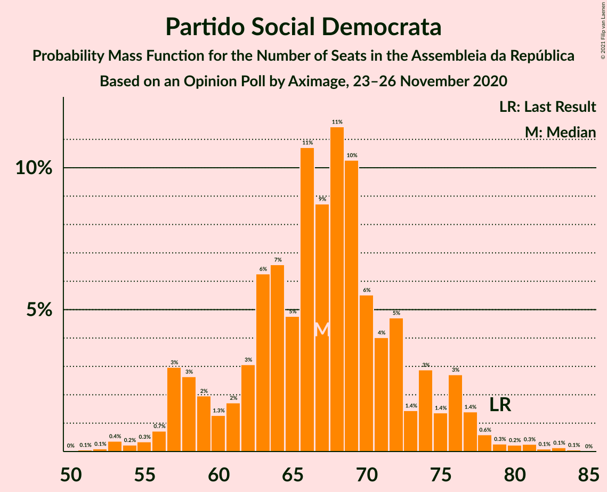

# Opinion Poll by Aximage, 23–26 November 2020

<a href="#voting-intentions">Voting Intentions</a> | <a href="#seats">Seats</a> | <a href="#coalitions">Coalitions</a> | <a href="#technical-information">Technical Information</a>

## Voting Intentions

### Confidence Intervals

| Party | Last Result | Poll Result | 80% Confidence Interval | 90% Confidence Interval | 95% Confidence Interval | 99% Confidence Interval |
|:-----:|:-----------:|:-----------:|:-----------------------:|:-----------------------:|:-----------------------:|:-----------------------:|
| Partido Socialista | 36.4% | 37.2% | 34.9–39.7% |34.2–40.4% |33.6–41.0% |32.5–42.2% |
| Partido Social Democrata | 27.8% | 24.0% | 21.9–26.2% |21.3–26.8% |20.8–27.4% |19.9–28.5% |
| Bloco de Esquerda | 9.5% | 7.9% | 6.7–9.4% |6.3–9.8% |6.1–10.2% |5.5–11.0% |
| Chega | 1.3% | 7.6% | 6.4–9.1% |6.1–9.5% |5.8–9.9% |5.3–10.6% |
| Pessoas–Animais–Natureza | 3.3% | 6.5% | 5.4–7.9% |5.1–8.3% |4.8–8.7% |4.4–9.4% |
| Coligação Democrática Unitária | 6.3% | 5.9% | 4.8–7.2% |4.5–7.6% |4.3–8.0% |3.9–8.7% |
| Iniciativa Liberal | 1.3% | 2.2% | 1.6–3.1% |1.4–3.4% |1.3–3.6% |1.1–4.1% |
| CDS–Partido Popular | 4.2% | 0.9% | 0.6–1.6% |0.5–1.8% |0.4–2.0% |0.3–2.4% |

*Note:* The poll result column reflects the actual value used in the calculations. Published results may vary slightly, and in addition be rounded to fewer digits.

## Seats

### Confidence Intervals

| Party | Last Result | Median | 80% Confidence Interval | 90% Confidence Interval | 95% Confidence Interval | 99% Confidence Interval |
|:-----:|:-----------:|:------:|:-----------------------:|:-----------------------:|:-----------------------:|:-----------------------:|
| <a href="#partido-socialista">Partido Socialista</a> | 108 | 110 | 103–117 |101–119 |100–121 |96–125 |
| <a href="#partido-social-democrata">Partido Social Democrata</a> | 79 | 67 | 60–74 |58–76 |57–77 |53–81 |
| <a href="#bloco-de-esquerda">Bloco de Esquerda</a> | 19 | 16 | 12–19 |11–20 |10–21 |7–22 |
| <a href="#chega">Chega</a> | 1 | 13 | 11–16 |10–18 |8–19 |8–23 |
| <a href="#pessoas–animais–natureza">Pessoas–Animais–Natureza</a> | 4 | 11 | 8–14 |7–15 |6–15 |6–17 |
| <a href="#coligação-democrática-unitária">Coligação Democrática Unitária</a> | 12 | 10 | 7–13 |6–14 |6–16 |5–18 |
| <a href="#iniciativa-liberal">Iniciativa Liberal</a> | 1 | 3 | 1–4 |1–4 |1–5 |1–5 |
| <a href="#cds–partido-popular">CDS–Partido Popular</a> | 5 | 0 | 0 |0 |0–1 |0–1 |

### Partido Socialista

*For a full overview of the results for this party, see the [Partido Socialista](party-partidosocialista.html) page.*

| Number of Seats | Probability | Accumulated | Special Marks |
|:---------------:|:-----------:|:-----------:|:-------------:|
| 91 | 0% | 100% |  |
| 92 | 0% | 99.9% |  |
| 93 | 0% | 99.9% |  |
| 94 | 0.1% | 99.9% |  |
| 95 | 0.1% | 99.7% |  |
| 96 | 0.2% | 99.6% |  |
| 97 | 0.4% | 99.4% |  |
| 98 | 0.3% | 99.0% |  |
| 99 | 0.8% | 98.7% |  |
| 100 | 0.9% | 98% |  |
| 101 | 2% | 97% |  |
| 102 | 4% | 95% |  |
| 103 | 2% | 91% |  |
| 104 | 4% | 89% |  |
| 105 | 6% | 85% |  |
| 106 | 6% | 79% |  |
| 107 | 8% | 73% |  |
| 108 | 5% | 65% | Last Result |
| 109 | 8% | 60% |  |
| 110 | 11% | 52% | Median |
| 111 | 9% | 42% |  |
| 112 | 7% | 32% |  |
| 113 | 5% | 26% |  |
| 114 | 3% | 20% |  |
| 115 | 3% | 17% |  |
| 116 | 3% | 14% | Majority |
| 117 | 2% | 11% |  |
| 118 | 2% | 9% |  |
| 119 | 2% | 7% |  |
| 120 | 2% | 5% |  |
| 121 | 1.1% | 3% |  |
| 122 | 0.4% | 2% |  |
| 123 | 0.3% | 2% |  |
| 124 | 0.6% | 2% |  |
| 125 | 0.4% | 0.9% |  |
| 126 | 0.1% | 0.5% |  |
| 127 | 0.2% | 0.4% |  |
| 128 | 0.1% | 0.2% |  |
| 129 | 0.1% | 0.1% |  |
| 130 | 0% | 0% |  |

### Partido Social Democrata

*For a full overview of the results for this party, see the [Partido Social Democrata](party-partidosocialdemocrata.html) page.*

| Number of Seats | Probability | Accumulated | Special Marks |
|:---------------:|:-----------:|:-----------:|:-------------:|
| 50 | 0% | 100% |  |
| 51 | 0.1% | 99.9% |  |
| 52 | 0.1% | 99.9% |  |
| 53 | 0.4% | 99.8% |  |
| 54 | 0.2% | 99.4% |  |
| 55 | 0.3% | 99.2% |  |
| 56 | 0.7% | 98.8% |  |
| 57 | 3% | 98% |  |
| 58 | 3% | 95% |  |
| 59 | 2% | 93% |  |
| 60 | 1.3% | 91% |  |
| 61 | 2% | 89% |  |
| 62 | 3% | 88% |  |
| 63 | 6% | 84% |  |
| 64 | 7% | 78% |  |
| 65 | 5% | 72% |  |
| 66 | 11% | 67% |  |
| 67 | 9% | 56% | Median |
| 68 | 11% | 47% |  |
| 69 | 10% | 36% |  |
| 70 | 6% | 26% |  |
| 71 | 4% | 20% |  |
| 72 | 5% | 16% |  |
| 73 | 1.4% | 11% |  |
| 74 | 3% | 10% |  |
| 75 | 1.4% | 7% |  |
| 76 | 3% | 6% |  |
| 77 | 1.4% | 3% |  |
| 78 | 0.6% | 2% |  |
| 79 | 0.3% | 1.1% | Last Result |
| 80 | 0.2% | 0.8% |  |
| 81 | 0.3% | 0.6% |  |
| 82 | 0.1% | 0.3% |  |
| 83 | 0.1% | 0.2% |  |
| 84 | 0.1% | 0.1% |  |
| 85 | 0% | 0% |  |

### Bloco de Esquerda

*For a full overview of the results for this party, see the [Bloco de Esquerda](party-blocodeesquerda.html) page.*

| Number of Seats | Probability | Accumulated | Special Marks |
|:---------------:|:-----------:|:-----------:|:-------------:|
| 7 | 1.1% | 100% |  |
| 8 | 0.6% | 98.9% |  |
| 9 | 0.5% | 98% |  |
| 10 | 0.9% | 98% |  |
| 11 | 7% | 97% |  |
| 12 | 8% | 90% |  |
| 13 | 9% | 82% |  |
| 14 | 8% | 74% |  |
| 15 | 9% | 65% |  |
| 16 | 23% | 57% | Median |
| 17 | 8% | 34% |  |
| 18 | 14% | 26% |  |
| 19 | 5% | 12% | Last Result |
| 20 | 3% | 7% |  |
| 21 | 2% | 4% |  |
| 22 | 1.3% | 2% |  |
| 23 | 0.2% | 0.4% |  |
| 24 | 0.1% | 0.2% |  |
| 25 | 0% | 0.1% |  |
| 26 | 0.1% | 0.1% |  |
| 27 | 0% | 0% |  |

### Chega

*For a full overview of the results for this party, see the [Chega](party-chega.html) page.*

| Number of Seats | Probability | Accumulated | Special Marks |
|:---------------:|:-----------:|:-----------:|:-------------:|
| 1 | 0% | 100% | Last Result |
| 2 | 0% | 100% |  |
| 3 | 0% | 100% |  |
| 4 | 0% | 100% |  |
| 5 | 0% | 100% |  |
| 6 | 0.1% | 99.9% |  |
| 7 | 0.1% | 99.9% |  |
| 8 | 3% | 99.8% |  |
| 9 | 2% | 97% |  |
| 10 | 3% | 95% |  |
| 11 | 30% | 92% |  |
| 12 | 7% | 62% |  |
| 13 | 11% | 54% | Median |
| 14 | 26% | 43% |  |
| 15 | 4% | 17% |  |
| 16 | 5% | 13% |  |
| 17 | 3% | 8% |  |
| 18 | 2% | 5% |  |
| 19 | 1.1% | 3% |  |
| 20 | 0.5% | 2% |  |
| 21 | 0.8% | 2% |  |
| 22 | 0.5% | 1.0% |  |
| 23 | 0.2% | 0.5% |  |
| 24 | 0.2% | 0.4% |  |
| 25 | 0.1% | 0.1% |  |
| 26 | 0% | 0% |  |

### Pessoas–Animais–Natureza

*For a full overview of the results for this party, see the [Pessoas–Animais–Natureza](party-pessoas–animais–natureza.html) page.*

| Number of Seats | Probability | Accumulated | Special Marks |
|:---------------:|:-----------:|:-----------:|:-------------:|
| 4 | 0.1% | 100% | Last Result |
| 5 | 0.4% | 99.9% |  |
| 6 | 3% | 99.5% |  |
| 7 | 2% | 96% |  |
| 8 | 5% | 95% |  |
| 9 | 12% | 90% |  |
| 10 | 5% | 78% |  |
| 11 | 39% | 73% | Median |
| 12 | 14% | 34% |  |
| 13 | 8% | 20% |  |
| 14 | 4% | 11% |  |
| 15 | 5% | 7% |  |
| 16 | 1.1% | 2% |  |
| 17 | 0.6% | 1.0% |  |
| 18 | 0.3% | 0.4% |  |
| 19 | 0% | 0.1% |  |
| 20 | 0% | 0.1% |  |
| 21 | 0% | 0.1% |  |
| 22 | 0% | 0% |  |

### Coligação Democrática Unitária

*For a full overview of the results for this party, see the [Coligação Democrática Unitária](party-coligaçãodemocráticaunitária.html) page.*

| Number of Seats | Probability | Accumulated | Special Marks |
|:---------------:|:-----------:|:-----------:|:-------------:|
| 4 | 0.1% | 100% |  |
| 5 | 0.9% | 99.8% |  |
| 6 | 5% | 98.9% |  |
| 7 | 14% | 94% |  |
| 8 | 8% | 80% |  |
| 9 | 7% | 71% |  |
| 10 | 29% | 65% | Median |
| 11 | 4% | 36% |  |
| 12 | 6% | 32% | Last Result |
| 13 | 18% | 26% |  |
| 14 | 4% | 8% |  |
| 15 | 1.1% | 4% |  |
| 16 | 1.1% | 3% |  |
| 17 | 0.6% | 2% |  |
| 18 | 1.0% | 1.1% |  |
| 19 | 0.1% | 0.1% |  |
| 20 | 0% | 0.1% |  |
| 21 | 0% | 0% |  |

### Iniciativa Liberal

*For a full overview of the results for this party, see the [Iniciativa Liberal](party-iniciativaliberal.html) page.*

| Number of Seats | Probability | Accumulated | Special Marks |
|:---------------:|:-----------:|:-----------:|:-------------:|
| 0 | 0.2% | 100% |  |
| 1 | 16% | 99.8% | Last Result |
| 2 | 18% | 83% |  |
| 3 | 55% | 65% | Median |
| 4 | 8% | 11% |  |
| 5 | 3% | 3% |  |
| 6 | 0.4% | 0.4% |  |
| 7 | 0% | 0% |  |

### CDS–Partido Popular

*For a full overview of the results for this party, see the [CDS–Partido Popular](party-cds–partidopopular.html) page.*

| Number of Seats | Probability | Accumulated | Special Marks |
|:---------------:|:-----------:|:-----------:|:-------------:|
| 0 | 96% | 100% | Median |
| 1 | 4% | 4% |  |
| 2 | 0.2% | 0.2% |  |
| 3 | 0% | 0% |  |
| 4 | 0% | 0% |  |
| 5 | 0% | 0% | Last Result |

## Coalitions

### Confidence Intervals

| Coalition | Last Result | Median | Majority? | 80% Confidence Interval | 90% Confidence Interval | 95% Confidence Interval | 99% Confidence Interval |
|:---------:|:-----------:|:------:|:---------:|:-----------------------:|:-----------------------:|:-----------------------:|:-----------------------:|
| Partido Socialista – Bloco de Esquerda – Coligação Democrática Unitária | 139 | 135 | 100% | 129–143 | 127–145 | 125–147 | 121–150 |
| Partido Socialista – Bloco de Esquerda | 127 | 125 | 96% | 119–133 | 116–135 | 115–137 | 111–141 |
| Partido Socialista – Coligação Democrática Unitária | 120 | 120 | 79% | 113–127 | 112–130 | 109–132 | 105–135 |
| Partido Socialista | 108 | 110 | 14% | 103–117 | 101–119 | 100–121 | 96–125 |
| Partido Social Democrata – CDS–Partido Popular | 84 | 67 | 0% | 60–74 | 58–76 | 57–77 | 53–81 |

### Partido Socialista – Bloco de Esquerda – Coligação Democrática Unitária

| Number of Seats | Probability | Accumulated | Special Marks |
|:---------------:|:-----------:|:-----------:|:-------------:|
| 116 | 0% | 100% | Majority |
| 117 | 0% | 99.9% |  |
| 118 | 0.1% | 99.9% |  |
| 119 | 0.1% | 99.8% |  |
| 120 | 0.1% | 99.7% |  |
| 121 | 0.2% | 99.6% |  |
| 122 | 0.4% | 99.3% |  |
| 123 | 0.5% | 98.9% |  |
| 124 | 0.6% | 98% |  |
| 125 | 0.9% | 98% |  |
| 126 | 1.4% | 97% |  |
| 127 | 2% | 95% |  |
| 128 | 3% | 93% |  |
| 129 | 3% | 90% |  |
| 130 | 3% | 87% |  |
| 131 | 5% | 84% |  |
| 132 | 10% | 79% |  |
| 133 | 10% | 69% |  |
| 134 | 5% | 59% |  |
| 135 | 5% | 54% |  |
| 136 | 7% | 49% | Median |
| 137 | 10% | 42% |  |
| 138 | 7% | 32% |  |
| 139 | 4% | 25% | Last Result |
| 140 | 4% | 21% |  |
| 141 | 5% | 17% |  |
| 142 | 2% | 13% |  |
| 143 | 3% | 11% |  |
| 144 | 2% | 8% |  |
| 145 | 0.9% | 6% |  |
| 146 | 2% | 5% |  |
| 147 | 1.3% | 3% |  |
| 148 | 0.8% | 2% |  |
| 149 | 0.5% | 1.2% |  |
| 150 | 0.3% | 0.8% |  |
| 151 | 0.2% | 0.4% |  |
| 152 | 0.1% | 0.2% |  |
| 153 | 0.1% | 0.1% |  |
| 154 | 0% | 0.1% |  |
| 155 | 0% | 0% |  |

### Partido Socialista – Bloco de Esquerda

| Number of Seats | Probability | Accumulated | Special Marks |
|:---------------:|:-----------:|:-----------:|:-------------:|
| 105 | 0% | 100% |  |
| 106 | 0% | 99.9% |  |
| 107 | 0% | 99.9% |  |
| 108 | 0% | 99.9% |  |
| 109 | 0.1% | 99.8% |  |
| 110 | 0.2% | 99.8% |  |
| 111 | 0.1% | 99.6% |  |
| 112 | 0.4% | 99.5% |  |
| 113 | 0.7% | 99.1% |  |
| 114 | 0.7% | 98% |  |
| 115 | 1.3% | 98% |  |
| 116 | 2% | 96% | Majority |
| 117 | 2% | 95% |  |
| 118 | 2% | 93% |  |
| 119 | 3% | 91% |  |
| 120 | 4% | 88% |  |
| 121 | 5% | 83% |  |
| 122 | 9% | 78% |  |
| 123 | 10% | 69% |  |
| 124 | 7% | 59% |  |
| 125 | 8% | 52% |  |
| 126 | 6% | 45% | Median |
| 127 | 9% | 39% | Last Result |
| 128 | 7% | 30% |  |
| 129 | 2% | 23% |  |
| 130 | 5% | 21% |  |
| 131 | 3% | 15% |  |
| 132 | 2% | 12% |  |
| 133 | 3% | 10% |  |
| 134 | 2% | 7% |  |
| 135 | 2% | 6% |  |
| 136 | 1.0% | 4% |  |
| 137 | 1.0% | 3% |  |
| 138 | 0.7% | 2% |  |
| 139 | 0.7% | 1.5% |  |
| 140 | 0.3% | 0.8% |  |
| 141 | 0.2% | 0.5% |  |
| 142 | 0.1% | 0.3% |  |
| 143 | 0.1% | 0.2% |  |
| 144 | 0.1% | 0.2% |  |
| 145 | 0.1% | 0.1% |  |
| 146 | 0% | 0% |  |

### Partido Socialista – Coligação Democrática Unitária

| Number of Seats | Probability | Accumulated | Special Marks |
|:---------------:|:-----------:|:-----------:|:-------------:|
| 100 | 0% | 100% |  |
| 101 | 0% | 99.9% |  |
| 102 | 0% | 99.9% |  |
| 103 | 0.1% | 99.9% |  |
| 104 | 0.1% | 99.8% |  |
| 105 | 0.2% | 99.7% |  |
| 106 | 0.2% | 99.5% |  |
| 107 | 0.5% | 99.3% |  |
| 108 | 0.6% | 98.7% |  |
| 109 | 0.7% | 98% |  |
| 110 | 0.8% | 97% |  |
| 111 | 2% | 97% |  |
| 112 | 4% | 95% |  |
| 113 | 2% | 92% |  |
| 114 | 4% | 90% |  |
| 115 | 6% | 85% |  |
| 116 | 5% | 79% | Majority |
| 117 | 9% | 73% |  |
| 118 | 5% | 65% |  |
| 119 | 9% | 59% |  |
| 120 | 4% | 50% | Last Result, Median |
| 121 | 10% | 46% |  |
| 122 | 8% | 36% |  |
| 123 | 4% | 28% |  |
| 124 | 2% | 23% |  |
| 125 | 4% | 21% |  |
| 126 | 4% | 16% |  |
| 127 | 3% | 12% |  |
| 128 | 2% | 9% |  |
| 129 | 2% | 8% |  |
| 130 | 2% | 5% |  |
| 131 | 1.0% | 4% |  |
| 132 | 0.7% | 3% |  |
| 133 | 0.6% | 2% |  |
| 134 | 0.5% | 1.4% |  |
| 135 | 0.4% | 0.9% |  |
| 136 | 0.1% | 0.4% |  |
| 137 | 0.1% | 0.3% |  |
| 138 | 0.2% | 0.2% |  |
| 139 | 0% | 0.1% |  |
| 140 | 0% | 0% |  |

### Partido Socialista

| Number of Seats | Probability | Accumulated | Special Marks |
|:---------------:|:-----------:|:-----------:|:-------------:|
| 91 | 0% | 100% |  |
| 92 | 0% | 99.9% |  |
| 93 | 0% | 99.9% |  |
| 94 | 0.1% | 99.9% |  |
| 95 | 0.1% | 99.7% |  |
| 96 | 0.2% | 99.6% |  |
| 97 | 0.4% | 99.4% |  |
| 98 | 0.3% | 99.0% |  |
| 99 | 0.8% | 98.7% |  |
| 100 | 0.9% | 98% |  |
| 101 | 2% | 97% |  |
| 102 | 4% | 95% |  |
| 103 | 2% | 91% |  |
| 104 | 4% | 89% |  |
| 105 | 6% | 85% |  |
| 106 | 6% | 79% |  |
| 107 | 8% | 73% |  |
| 108 | 5% | 65% | Last Result |
| 109 | 8% | 60% |  |
| 110 | 11% | 52% | Median |
| 111 | 9% | 42% |  |
| 112 | 7% | 32% |  |
| 113 | 5% | 26% |  |
| 114 | 3% | 20% |  |
| 115 | 3% | 17% |  |
| 116 | 3% | 14% | Majority |
| 117 | 2% | 11% |  |
| 118 | 2% | 9% |  |
| 119 | 2% | 7% |  |
| 120 | 2% | 5% |  |
| 121 | 1.1% | 3% |  |
| 122 | 0.4% | 2% |  |
| 123 | 0.3% | 2% |  |
| 124 | 0.6% | 2% |  |
| 125 | 0.4% | 0.9% |  |
| 126 | 0.1% | 0.5% |  |
| 127 | 0.2% | 0.4% |  |
| 128 | 0.1% | 0.2% |  |
| 129 | 0.1% | 0.1% |  |
| 130 | 0% | 0% |  |

### Partido Social Democrata – CDS–Partido Popular

| Number of Seats | Probability | Accumulated | Special Marks |
|:---------------:|:-----------:|:-----------:|:-------------:|
| 50 | 0% | 100% |  |
| 51 | 0.1% | 99.9% |  |
| 52 | 0.1% | 99.9% |  |
| 53 | 0.4% | 99.8% |  |
| 54 | 0.2% | 99.4% |  |
| 55 | 0.3% | 99.2% |  |
| 56 | 0.7% | 98.9% |  |
| 57 | 3% | 98% |  |
| 58 | 3% | 95% |  |
| 59 | 2% | 93% |  |
| 60 | 1.3% | 91% |  |
| 61 | 2% | 89% |  |
| 62 | 3% | 88% |  |
| 63 | 6% | 85% |  |
| 64 | 6% | 78% |  |
| 65 | 5% | 72% |  |
| 66 | 11% | 67% |  |
| 67 | 9% | 57% | Median |
| 68 | 12% | 48% |  |
| 69 | 10% | 36% |  |
| 70 | 6% | 26% |  |
| 71 | 4% | 21% |  |
| 72 | 5% | 16% |  |
| 73 | 1.4% | 12% |  |
| 74 | 3% | 10% |  |
| 75 | 1.4% | 7% |  |
| 76 | 3% | 6% |  |
| 77 | 1.4% | 3% |  |
| 78 | 0.6% | 2% |  |
| 79 | 0.3% | 1.1% |  |
| 80 | 0.2% | 0.8% |  |
| 81 | 0.3% | 0.6% |  |
| 82 | 0.1% | 0.3% |  |
| 83 | 0.1% | 0.2% |  |
| 84 | 0.1% | 0.1% | Last Result |
| 85 | 0% | 0.1% |  |
| 86 | 0% | 0% |  |

## Technical Information

### Opinion Poll

+ **Polling firm:** Aximage
+ **Commissioner(s):** —
+ **Fieldwork period:** 23–26 November 2020

### Calculations

+ **Sample size:** 647
+ **Simulations done:** 1,048,576
+ **Error estimate:** 2.80%

