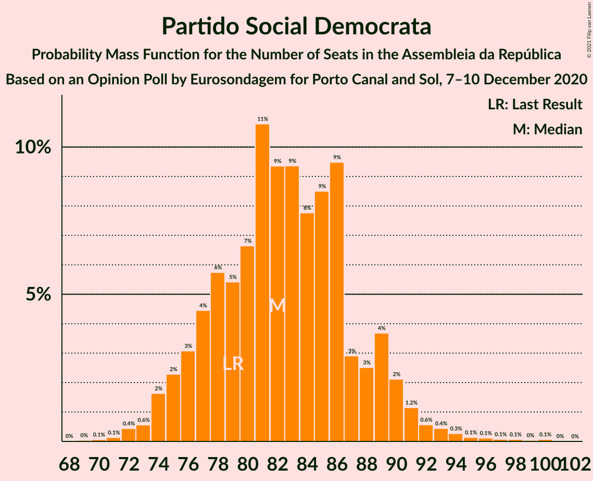
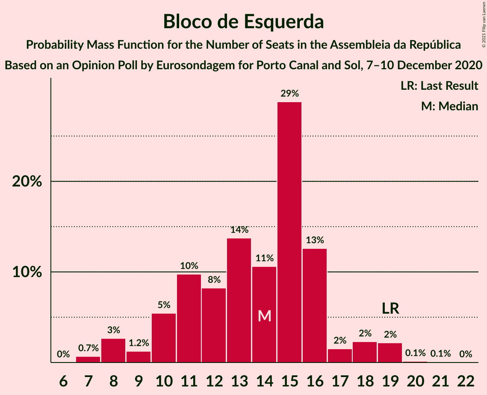
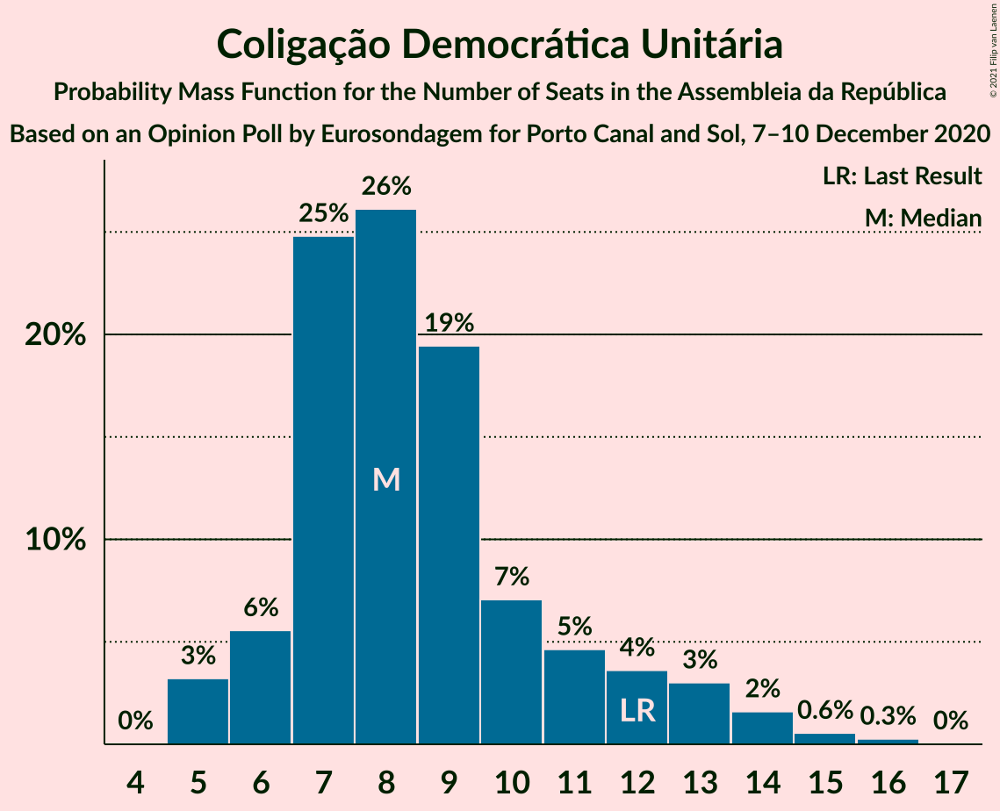
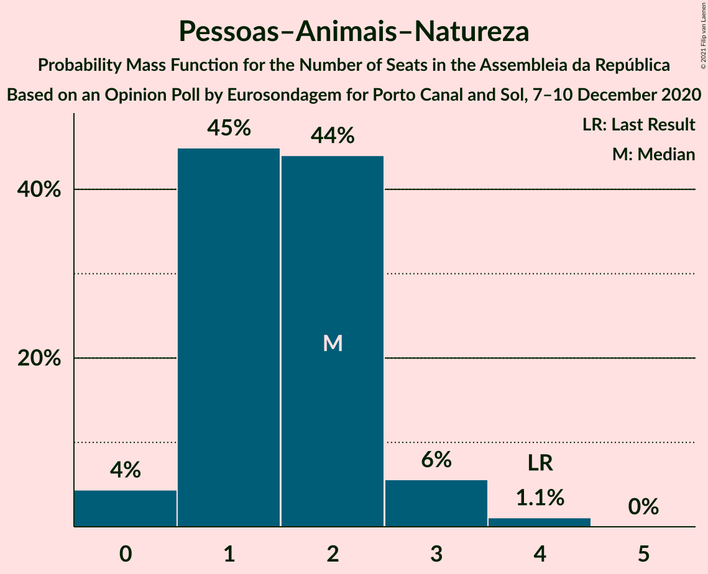
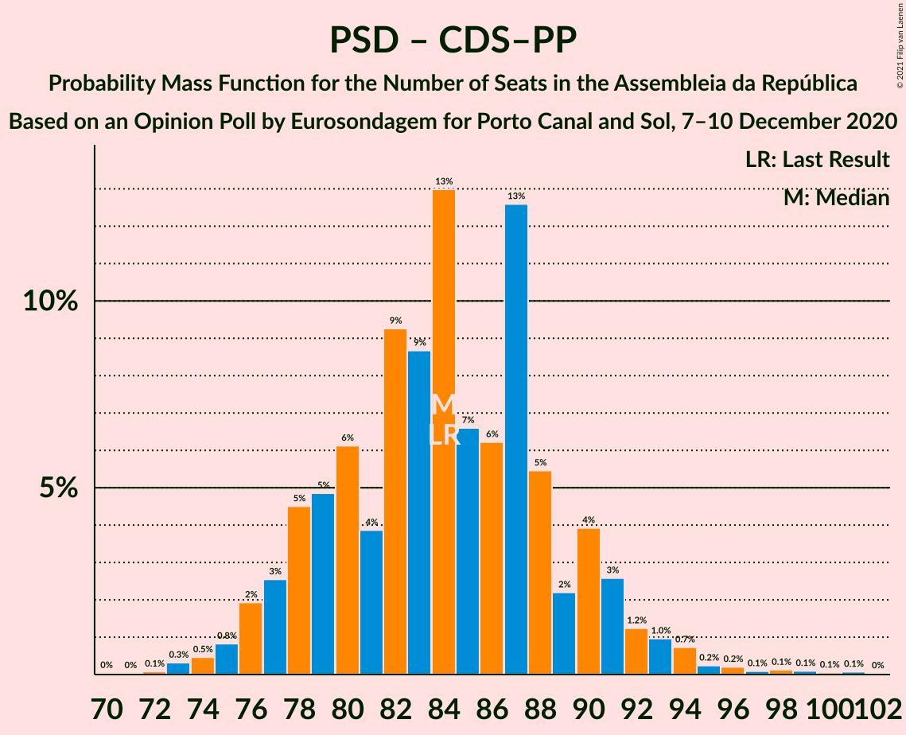

# Opinion Poll by Eurosondagem for Porto Canal and Sol, 7–10 December 2020

<a href="#voting-intentions">Voting Intentions</a> | <a href="#seats">Seats</a> | <a href="#coalitions">Coalitions</a> | <a href="#technical-information">Technical Information</a>

## Voting Intentions

### Confidence Intervals

| Party | Last Result | Poll Result | 80% Confidence Interval | 90% Confidence Interval | 95% Confidence Interval | 99% Confidence Interval |
|:-----:|:-----------:|:-----------:|:-----------------------:|:-----------------------:|:-----------------------:|:-----------------------:|
| Partido Socialista | 36.4% | 38.8% | 36.9–40.8% |36.4–41.4% |35.9–41.9% |35.0–42.8% |
| Partido Social Democrata | 27.8% | 29.4% | 27.6–31.3% |27.1–31.8% |26.7–32.3% |25.8–33.2% |
| Bloco de Esquerda | 9.5% | 7.2% | 6.2–8.3% |5.9–8.6% |5.7–8.9% |5.3–9.5% |
| Coligação Democrática Unitária | 6.3% | 5.3% | 4.5–6.3% |4.3–6.6% |4.1–6.9% |3.7–7.4% |
| Chega | 1.3% | 5.2% | 4.4–6.2% |4.2–6.5% |4.0–6.7% |3.6–7.3% |
| CDS–Partido Popular | 4.2% | 2.5% | 2.0–3.3% |1.9–3.5% |1.7–3.7% |1.5–4.1% |
| Pessoas–Animais–Natureza | 3.3% | 2.0% | 1.5–2.7% |1.4–2.8% |1.3–3.0% |1.1–3.4% |
| Iniciativa Liberal | 1.3% | 1.1% | 0.8–1.6% |0.7–1.8% |0.6–1.9% |0.5–2.2% |

*Note:* The poll result column reflects the actual value used in the calculations. Published results may vary slightly, and in addition be rounded to fewer digits.

## Seats

### Confidence Intervals

| Party | Last Result | Median | 80% Confidence Interval | 90% Confidence Interval | 95% Confidence Interval | 99% Confidence Interval |
|:-----:|:-----------:|:------:|:-----------------------:|:-----------------------:|:-----------------------:|:-----------------------:|
| <a href="#partido-socialista">Partido Socialista</a> | 108 | 110 | 105–120 |105–120 |104–122 |98–125 |
| <a href="#partido-social-democrata">Partido Social Democrata</a> | 79 | 84 | 78–89 |75–90 |74–92 |72–95 |
| <a href="#bloco-de-esquerda">Bloco de Esquerda</a> | 19 | 15 | 10–16 |10–17 |9–18 |8–19 |
| <a href="#coligação-democrática-unitária">Coligação Democrática Unitária</a> | 12 | 8 | 7–10 |6–12 |5–14 |5–15 |
| <a href="#chega">Chega</a> | 1 | 8 | 4–11 |4–11 |4–11 |4–12 |
| <a href="#cds–partido-popular">CDS–Partido Popular</a> | 5 | 1 | 1–2 |0–4 |0–4 |0–5 |
| <a href="#pessoas–animais–natureza">Pessoas–Animais–Natureza</a> | 4 | 2 | 1–2 |1–3 |0–3 |0–4 |
| <a href="#iniciativa-liberal">Iniciativa Liberal</a> | 1 | 1 | 0–1 |0–1 |0–3 |0–3 |

### Partido Socialista

*For a full overview of the results for this party, see the [Partido Socialista](party-partidosocialista.html) page.*

| Number of Seats | Probability | Accumulated | Special Marks |
|:---------------:|:-----------:|:-----------:|:-------------:|
| 96 | 0% | 100% |  |
| 97 | 0.3% | 99.9% |  |
| 98 | 0.2% | 99.6% |  |
| 99 | 0.1% | 99.4% |  |
| 100 | 0.2% | 99.4% |  |
| 101 | 0.1% | 99.2% |  |
| 102 | 0.8% | 99.1% |  |
| 103 | 0.3% | 98% |  |
| 104 | 2% | 98% |  |
| 105 | 12% | 96% |  |
| 106 | 2% | 84% |  |
| 107 | 8% | 82% |  |
| 108 | 7% | 74% | Last Result |
| 109 | 10% | 67% |  |
| 110 | 10% | 57% | Median |
| 111 | 5% | 47% |  |
| 112 | 6% | 42% |  |
| 113 | 2% | 36% |  |
| 114 | 5% | 34% |  |
| 115 | 3% | 29% |  |
| 116 | 10% | 26% | Majority |
| 117 | 0.8% | 16% |  |
| 118 | 2% | 15% |  |
| 119 | 2% | 14% |  |
| 120 | 7% | 11% |  |
| 121 | 1.2% | 4% |  |
| 122 | 0.8% | 3% |  |
| 123 | 0.1% | 2% |  |
| 124 | 1.3% | 2% |  |
| 125 | 0.6% | 0.9% |  |
| 126 | 0.1% | 0.2% |  |
| 127 | 0.1% | 0.1% |  |
| 128 | 0% | 0% |  |

### Partido Social Democrata

*For a full overview of the results for this party, see the [Partido Social Democrata](party-partidosocialdemocrata.html) page.*

| Number of Seats | Probability | Accumulated | Special Marks |
|:---------------:|:-----------:|:-----------:|:-------------:|
| 68 | 0% | 100% |  |
| 69 | 0% | 99.9% |  |
| 70 | 0% | 99.9% |  |
| 71 | 0.1% | 99.9% |  |
| 72 | 0.9% | 99.8% |  |
| 73 | 1.0% | 98.9% |  |
| 74 | 3% | 98% |  |
| 75 | 2% | 95% |  |
| 76 | 1.0% | 94% |  |
| 77 | 2% | 93% |  |
| 78 | 2% | 90% |  |
| 79 | 6% | 88% | Last Result |
| 80 | 2% | 82% |  |
| 81 | 7% | 80% |  |
| 82 | 15% | 73% |  |
| 83 | 7% | 57% |  |
| 84 | 3% | 50% | Median |
| 85 | 3% | 48% |  |
| 86 | 14% | 44% |  |
| 87 | 9% | 31% |  |
| 88 | 4% | 22% |  |
| 89 | 13% | 18% |  |
| 90 | 1.3% | 5% |  |
| 91 | 1.2% | 4% |  |
| 92 | 0.4% | 3% |  |
| 93 | 1.4% | 2% |  |
| 94 | 0.3% | 0.8% |  |
| 95 | 0.2% | 0.6% |  |
| 96 | 0.1% | 0.4% |  |
| 97 | 0.1% | 0.3% |  |
| 98 | 0% | 0.2% |  |
| 99 | 0.1% | 0.2% |  |
| 100 | 0% | 0.1% |  |
| 101 | 0% | 0% |  |

### Bloco de Esquerda

*For a full overview of the results for this party, see the [Bloco de Esquerda](party-blocodeesquerda.html) page.*

| Number of Seats | Probability | Accumulated | Special Marks |
|:---------------:|:-----------:|:-----------:|:-------------:|
| 7 | 0.3% | 100% |  |
| 8 | 2% | 99.7% |  |
| 9 | 2% | 98% |  |
| 10 | 12% | 96% |  |
| 11 | 15% | 84% |  |
| 12 | 3% | 69% |  |
| 13 | 8% | 66% |  |
| 14 | 2% | 58% |  |
| 15 | 35% | 56% | Median |
| 16 | 14% | 21% |  |
| 17 | 2% | 7% |  |
| 18 | 3% | 5% |  |
| 19 | 2% | 2% | Last Result |
| 20 | 0.4% | 0.5% |  |
| 21 | 0% | 0.1% |  |
| 22 | 0% | 0% |  |

### Coligação Democrática Unitária

*For a full overview of the results for this party, see the [Coligação Democrática Unitária](party-coligaçãodemocráticaunitária.html) page.*

| Number of Seats | Probability | Accumulated | Special Marks |
|:---------------:|:-----------:|:-----------:|:-------------:|
| 5 | 5% | 100% |  |
| 6 | 4% | 95% |  |
| 7 | 9% | 91% |  |
| 8 | 38% | 82% | Median |
| 9 | 26% | 44% |  |
| 10 | 10% | 19% |  |
| 11 | 4% | 9% |  |
| 12 | 0.7% | 5% | Last Result |
| 13 | 2% | 4% |  |
| 14 | 1.4% | 3% |  |
| 15 | 1.3% | 1.4% |  |
| 16 | 0.1% | 0.2% |  |
| 17 | 0% | 0% |  |

### Chega

*For a full overview of the results for this party, see the [Chega](party-chega.html) page.*

| Number of Seats | Probability | Accumulated | Special Marks |
|:---------------:|:-----------:|:-----------:|:-------------:|
| 1 | 0% | 100% | Last Result |
| 2 | 0% | 100% |  |
| 3 | 0.2% | 100% |  |
| 4 | 12% | 99.8% |  |
| 5 | 6% | 88% |  |
| 6 | 2% | 81% |  |
| 7 | 3% | 79% |  |
| 8 | 48% | 76% | Median |
| 9 | 8% | 29% |  |
| 10 | 3% | 20% |  |
| 11 | 16% | 17% |  |
| 12 | 0.8% | 1.1% |  |
| 13 | 0.2% | 0.3% |  |
| 14 | 0.1% | 0.1% |  |
| 15 | 0% | 0% |  |

### CDS–Partido Popular

*For a full overview of the results for this party, see the [CDS–Partido Popular](party-cds–partidopopular.html) page.*

| Number of Seats | Probability | Accumulated | Special Marks |
|:---------------:|:-----------:|:-----------:|:-------------:|
| 0 | 5% | 100% |  |
| 1 | 64% | 95% | Median |
| 2 | 23% | 31% |  |
| 3 | 2% | 8% |  |
| 4 | 5% | 6% |  |
| 5 | 1.1% | 1.1% | Last Result |
| 6 | 0% | 0% |  |

### Pessoas–Animais–Natureza

*For a full overview of the results for this party, see the [Pessoas–Animais–Natureza](party-pessoas–animais–natureza.html) page.*

| Number of Seats | Probability | Accumulated | Special Marks |
|:---------------:|:-----------:|:-----------:|:-------------:|
| 0 | 5% | 100% |  |
| 1 | 45% | 95% |  |
| 2 | 42% | 51% | Median |
| 3 | 8% | 9% |  |
| 4 | 1.0% | 1.1% | Last Result |
| 5 | 0% | 0% |  |

### Iniciativa Liberal

*For a full overview of the results for this party, see the [Iniciativa Liberal](party-iniciativaliberal.html) page.*

| Number of Seats | Probability | Accumulated | Special Marks |
|:---------------:|:-----------:|:-----------:|:-------------:|
| 0 | 26% | 100% |  |
| 1 | 69% | 74% | Last Result, Median |
| 2 | 2% | 5% |  |
| 3 | 3% | 3% |  |
| 4 | 0% | 0% |  |

## Coalitions

### Confidence Intervals

| Coalition | Last Result | Median | Majority? | 80% Confidence Interval | 90% Confidence Interval | 95% Confidence Interval | 99% Confidence Interval |
|:---------:|:-----------:|:------:|:---------:|:-----------------------:|:-----------------------:|:-----------------------:|:-----------------------:|
| Partido Socialista – Bloco de Esquerda – Coligação Democrática Unitária | 139 | 133 | 100% | 127–139 | 127–142 | 125–143 | 121–146 |
| Partido Socialista – Bloco de Esquerda | 127 | 125 | 98.6% | 119–131 | 119–133 | 117–135 | 111–137 |
| Partido Socialista – Coligação Democrática Unitária | 120 | 118 | 78% | 114–128 | 113–129 | 112–131 | 107–133 |
| Partido Socialista | 108 | 110 | 26% | 105–120 | 105–120 | 104–122 | 98–125 |
| Partido Social Democrata – CDS–Partido Popular | 84 | 85 | 0% | 79–90 | 77–91 | 76–94 | 73–96 |

### Partido Socialista – Bloco de Esquerda – Coligação Democrática Unitária

| Number of Seats | Probability | Accumulated | Special Marks |
|:---------------:|:-----------:|:-----------:|:-------------:|
| 117 | 0.1% | 100% |  |
| 118 | 0.1% | 99.9% |  |
| 119 | 0% | 99.8% |  |
| 120 | 0.1% | 99.7% |  |
| 121 | 0.3% | 99.6% |  |
| 122 | 0.1% | 99.3% |  |
| 123 | 0.1% | 99.2% |  |
| 124 | 0.3% | 99.1% |  |
| 125 | 3% | 98.8% |  |
| 126 | 0.6% | 96% |  |
| 127 | 7% | 96% |  |
| 128 | 2% | 88% |  |
| 129 | 12% | 86% |  |
| 130 | 5% | 75% |  |
| 131 | 3% | 69% |  |
| 132 | 10% | 66% |  |
| 133 | 11% | 56% | Median |
| 134 | 2% | 46% |  |
| 135 | 13% | 43% |  |
| 136 | 2% | 30% |  |
| 137 | 6% | 29% |  |
| 138 | 3% | 23% |  |
| 139 | 10% | 20% | Last Result |
| 140 | 2% | 10% |  |
| 141 | 2% | 8% |  |
| 142 | 3% | 6% |  |
| 143 | 1.4% | 3% |  |
| 144 | 1.1% | 2% |  |
| 145 | 0.3% | 0.9% |  |
| 146 | 0.4% | 0.7% |  |
| 147 | 0.1% | 0.2% |  |
| 148 | 0.1% | 0.1% |  |
| 149 | 0% | 0.1% |  |
| 150 | 0% | 0.1% |  |
| 151 | 0% | 0.1% |  |
| 152 | 0% | 0% |  |

### Partido Socialista – Bloco de Esquerda

| Number of Seats | Probability | Accumulated | Special Marks |
|:---------------:|:-----------:|:-----------:|:-------------:|
| 108 | 0.1% | 100% |  |
| 109 | 0.1% | 99.9% |  |
| 110 | 0% | 99.8% |  |
| 111 | 0.3% | 99.8% |  |
| 112 | 0.2% | 99.4% |  |
| 113 | 0.2% | 99.2% |  |
| 114 | 0.3% | 99.0% |  |
| 115 | 0.1% | 98.7% |  |
| 116 | 0.7% | 98.6% | Majority |
| 117 | 2% | 98% |  |
| 118 | 0.6% | 96% |  |
| 119 | 7% | 96% |  |
| 120 | 13% | 89% |  |
| 121 | 2% | 75% |  |
| 122 | 4% | 73% |  |
| 123 | 14% | 69% |  |
| 124 | 4% | 55% |  |
| 125 | 9% | 51% | Median |
| 126 | 2% | 42% |  |
| 127 | 11% | 40% | Last Result |
| 128 | 3% | 29% |  |
| 129 | 4% | 25% |  |
| 130 | 6% | 22% |  |
| 131 | 7% | 16% |  |
| 132 | 2% | 9% |  |
| 133 | 2% | 7% |  |
| 134 | 2% | 5% |  |
| 135 | 1.4% | 3% |  |
| 136 | 0.5% | 2% |  |
| 137 | 0.7% | 1.1% |  |
| 138 | 0.1% | 0.4% |  |
| 139 | 0.1% | 0.3% |  |
| 140 | 0.1% | 0.1% |  |
| 141 | 0% | 0% |  |

### Partido Socialista – Coligação Democrática Unitária

| Number of Seats | Probability | Accumulated | Special Marks |
|:---------------:|:-----------:|:-----------:|:-------------:|
| 104 | 0% | 100% |  |
| 105 | 0.1% | 99.9% |  |
| 106 | 0.1% | 99.8% |  |
| 107 | 0.3% | 99.7% |  |
| 108 | 0.1% | 99.4% |  |
| 109 | 0.1% | 99.3% |  |
| 110 | 1.3% | 99.3% |  |
| 111 | 0.2% | 98% |  |
| 112 | 2% | 98% |  |
| 113 | 0.9% | 96% |  |
| 114 | 13% | 95% |  |
| 115 | 4% | 82% |  |
| 116 | 1.3% | 78% | Majority |
| 117 | 20% | 77% |  |
| 118 | 8% | 57% | Median |
| 119 | 4% | 49% |  |
| 120 | 2% | 45% | Last Result |
| 121 | 6% | 43% |  |
| 122 | 7% | 38% |  |
| 123 | 3% | 31% |  |
| 124 | 9% | 27% |  |
| 125 | 2% | 18% |  |
| 126 | 2% | 16% |  |
| 127 | 2% | 14% |  |
| 128 | 7% | 13% |  |
| 129 | 2% | 6% |  |
| 130 | 1.4% | 4% |  |
| 131 | 0.3% | 3% |  |
| 132 | 2% | 2% |  |
| 133 | 0.3% | 0.8% |  |
| 134 | 0.3% | 0.4% |  |
| 135 | 0% | 0.1% |  |
| 136 | 0.1% | 0.1% |  |
| 137 | 0% | 0.1% |  |
| 138 | 0% | 0.1% |  |
| 139 | 0% | 0% |  |

### Partido Socialista

| Number of Seats | Probability | Accumulated | Special Marks |
|:---------------:|:-----------:|:-----------:|:-------------:|
| 96 | 0% | 100% |  |
| 97 | 0.3% | 99.9% |  |
| 98 | 0.2% | 99.6% |  |
| 99 | 0.1% | 99.4% |  |
| 100 | 0.2% | 99.4% |  |
| 101 | 0.1% | 99.2% |  |
| 102 | 0.8% | 99.1% |  |
| 103 | 0.3% | 98% |  |
| 104 | 2% | 98% |  |
| 105 | 12% | 96% |  |
| 106 | 2% | 84% |  |
| 107 | 8% | 82% |  |
| 108 | 7% | 74% | Last Result |
| 109 | 10% | 67% |  |
| 110 | 10% | 57% | Median |
| 111 | 5% | 47% |  |
| 112 | 6% | 42% |  |
| 113 | 2% | 36% |  |
| 114 | 5% | 34% |  |
| 115 | 3% | 29% |  |
| 116 | 10% | 26% | Majority |
| 117 | 0.8% | 16% |  |
| 118 | 2% | 15% |  |
| 119 | 2% | 14% |  |
| 120 | 7% | 11% |  |
| 121 | 1.2% | 4% |  |
| 122 | 0.8% | 3% |  |
| 123 | 0.1% | 2% |  |
| 124 | 1.3% | 2% |  |
| 125 | 0.6% | 0.9% |  |
| 126 | 0.1% | 0.2% |  |
| 127 | 0.1% | 0.1% |  |
| 128 | 0% | 0% |  |

### Partido Social Democrata – CDS–Partido Popular

| Number of Seats | Probability | Accumulated | Special Marks |
|:---------------:|:-----------:|:-----------:|:-------------:|
| 70 | 0.1% | 100% |  |
| 71 | 0% | 99.9% |  |
| 72 | 0% | 99.9% |  |
| 73 | 0.4% | 99.8% |  |
| 74 | 0.6% | 99.4% |  |
| 75 | 0.9% | 98.8% |  |
| 76 | 2% | 98% |  |
| 77 | 2% | 96% |  |
| 78 | 2% | 95% |  |
| 79 | 3% | 92% |  |
| 80 | 4% | 90% |  |
| 81 | 4% | 86% |  |
| 82 | 5% | 82% |  |
| 83 | 15% | 77% |  |
| 84 | 10% | 62% | Last Result |
| 85 | 3% | 52% | Median |
| 86 | 3% | 49% |  |
| 87 | 13% | 46% |  |
| 88 | 9% | 33% |  |
| 89 | 5% | 24% |  |
| 90 | 12% | 19% |  |
| 91 | 3% | 7% |  |
| 92 | 0.8% | 5% |  |
| 93 | 1.2% | 4% |  |
| 94 | 2% | 3% |  |
| 95 | 0.1% | 0.9% |  |
| 96 | 0.4% | 0.9% |  |
| 97 | 0.1% | 0.4% |  |
| 98 | 0.1% | 0.4% |  |
| 99 | 0.1% | 0.3% |  |
| 100 | 0% | 0.2% |  |
| 101 | 0.1% | 0.2% |  |
| 102 | 0% | 0% |  |

## Technical Information

### Opinion Poll

+ **Polling firm:** Eurosondagem
+ **Commissioner(s):** Porto Canal and Sol
+ **Fieldwork period:** 7–10 December 2020

### Calculations

+ **Sample size:** 1020
+ **Simulations done:** 131,072
+ **Error estimate:** 3.14%

