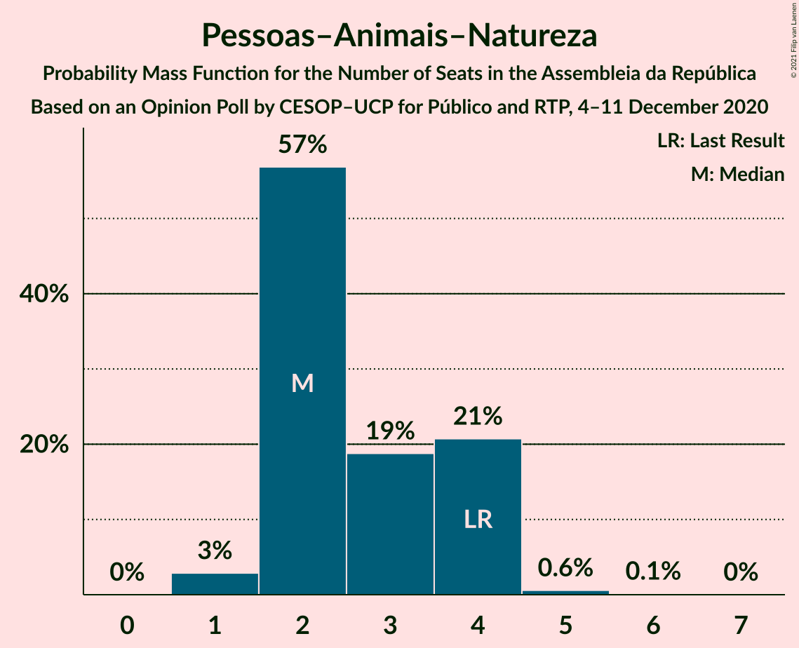
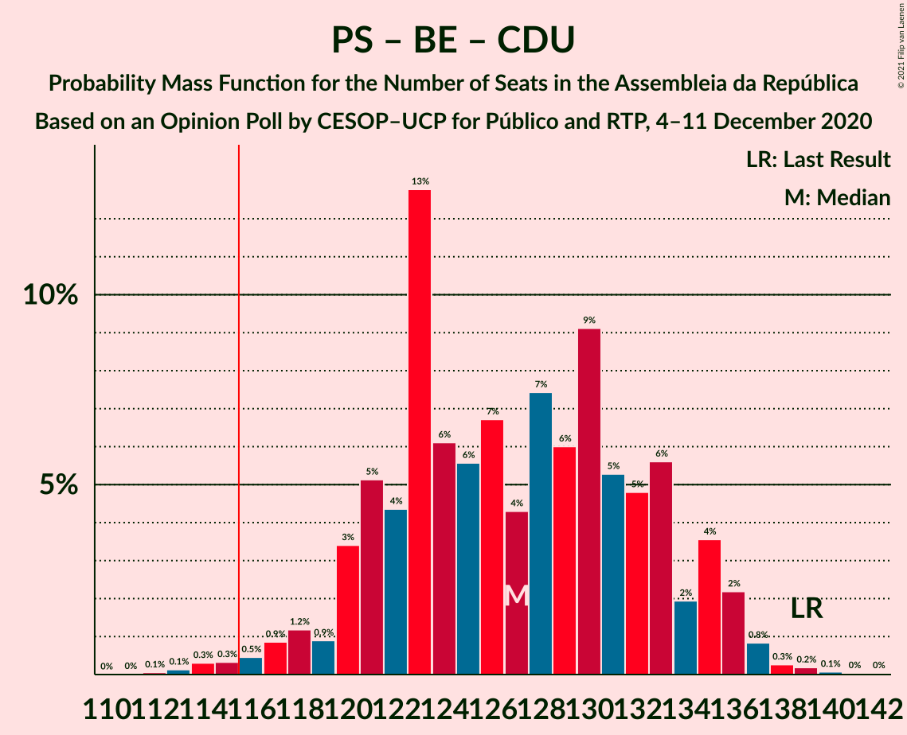
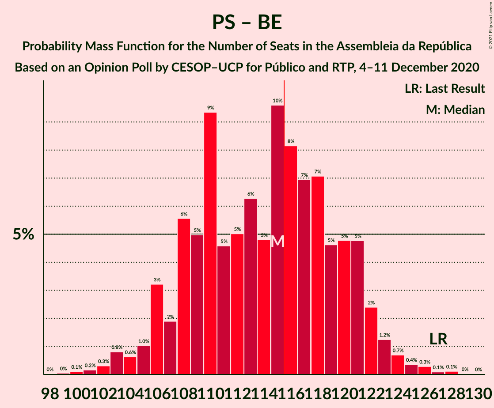

# Opinion Poll by CESOP–UCP for Público and RTP, 4–11 December 2020

<a href="#voting-intentions">Voting Intentions</a> | <a href="#seats">Seats</a> | <a href="#coalitions">Coalitions</a> | <a href="#technical-information">Technical Information</a>

## Voting Intentions

### Confidence Intervals

| Party | Last Result | Poll Result | 80% Confidence Interval | 90% Confidence Interval | 95% Confidence Interval | 99% Confidence Interval |
|:-----:|:-----------:|:-----------:|:-----------------------:|:-----------------------:|:-----------------------:|:-----------------------:|
| Partido Socialista | 36.4% | 37.0% | 35.3–38.8% |34.9–39.3% |34.5–39.7% |33.7–40.5% |
| Partido Social Democrata | 27.8% | 30.0% | 28.5–31.7% |28.0–32.2% |27.6–32.6% |26.9–33.4% |
| Bloco de Esquerda | 9.5% | 7.0% | 6.2–8.0% |5.9–8.3% |5.7–8.5% |5.4–9.0% |
| Coligação Democrática Unitária | 6.3% | 7.0% | 6.2–8.0% |5.9–8.3% |5.7–8.5% |5.4–9.0% |
| Chega | 1.3% | 6.0% | 5.2–6.9% |5.0–7.2% |4.8–7.4% |4.5–7.9% |
| Iniciativa Liberal | 1.3% | 5.0% | 4.3–5.9% |4.1–6.1% |4.0–6.3% |3.6–6.8% |
| CDS–Partido Popular | 4.2% | 3.0% | 2.4–3.7% |2.3–3.9% |2.2–4.0% |2.0–4.4% |
| Pessoas–Animais–Natureza | 3.3% | 3.0% | 2.4–3.7% |2.3–3.9% |2.2–4.0% |2.0–4.4% |

*Note:* The poll result column reflects the actual value used in the calculations. Published results may vary slightly, and in addition be rounded to fewer digits.

## Seats

### Confidence Intervals

| Party | Last Result | Median | 80% Confidence Interval | 90% Confidence Interval | 95% Confidence Interval | 99% Confidence Interval |
|:-----:|:-----------:|:------:|:-----------------------:|:-----------------------:|:-----------------------:|:-----------------------:|
| <a href="#partido-socialista">Partido Socialista</a> | 108 | 99 | 97–107 |96–109 |94–109 |91–112 |
| <a href="#partido-social-democrata">Partido Social Democrata</a> | 79 | 85 | 78–86 |77–87 |76–88 |72–92 |
| <a href="#bloco-de-esquerda">Bloco de Esquerda</a> | 19 | 11 | 8–13 |7–14 |7–15 |7–18 |
| <a href="#coligação-democrática-unitária">Coligação Democrática Unitária</a> | 12 | 13 | 11–15 |10–15 |8–16 |8–19 |
| <a href="#chega">Chega</a> | 1 | 10 | 7–11 |7–11 |6–11 |4–13 |
| <a href="#iniciativa-liberal">Iniciativa Liberal</a> | 1 | 6 | 6–8 |6–10 |5–10 |4–12 |
| <a href="#cds–partido-popular">CDS–Partido Popular</a> | 5 | 1 | 1–3 |1–3 |1–3 |1–5 |
| <a href="#pessoas–animais–natureza">Pessoas–Animais–Natureza</a> | 4 | 2 | 2–4 |1–4 |1–4 |1–4 |

### Partido Socialista

*For a full overview of the results for this party, see the [Partido Socialista](party-partidosocialista.html) page.*

| Number of Seats | Probability | Accumulated | Special Marks |
|:---------------:|:-----------:|:-----------:|:-------------:|
| 87 | 0% | 100% |  |
| 88 | 0% | 99.9% |  |
| 89 | 0% | 99.9% |  |
| 90 | 0.1% | 99.9% |  |
| 91 | 0.4% | 99.8% |  |
| 92 | 0.3% | 99.4% |  |
| 93 | 1.4% | 99.1% |  |
| 94 | 0.4% | 98% |  |
| 95 | 0.8% | 97% |  |
| 96 | 4% | 96% |  |
| 97 | 9% | 92% |  |
| 98 | 10% | 83% |  |
| 99 | 29% | 73% | Median |
| 100 | 0.9% | 44% |  |
| 101 | 2% | 43% |  |
| 102 | 8% | 41% |  |
| 103 | 9% | 34% |  |
| 104 | 4% | 24% |  |
| 105 | 7% | 20% |  |
| 106 | 2% | 13% |  |
| 107 | 3% | 11% |  |
| 108 | 2% | 8% | Last Result |
| 109 | 4% | 6% |  |
| 110 | 0.5% | 2% |  |
| 111 | 0.8% | 2% |  |
| 112 | 0.4% | 0.8% |  |
| 113 | 0.1% | 0.4% |  |
| 114 | 0% | 0.3% |  |
| 115 | 0.1% | 0.2% |  |
| 116 | 0.1% | 0.1% | Majority |
| 117 | 0% | 0% |  |

### Partido Social Democrata

*For a full overview of the results for this party, see the [Partido Social Democrata](party-partidosocialdemocrata.html) page.*

| Number of Seats | Probability | Accumulated | Special Marks |
|:---------------:|:-----------:|:-----------:|:-------------:|
| 68 | 0% | 100% |  |
| 69 | 0.1% | 99.9% |  |
| 70 | 0.1% | 99.8% |  |
| 71 | 0.1% | 99.7% |  |
| 72 | 0.5% | 99.6% |  |
| 73 | 0.5% | 99.1% |  |
| 74 | 0.6% | 98.6% |  |
| 75 | 0.4% | 98% |  |
| 76 | 0.6% | 98% |  |
| 77 | 7% | 97% |  |
| 78 | 5% | 90% |  |
| 79 | 3% | 85% | Last Result |
| 80 | 9% | 82% |  |
| 81 | 2% | 73% |  |
| 82 | 1.5% | 72% |  |
| 83 | 5% | 70% |  |
| 84 | 10% | 65% |  |
| 85 | 38% | 55% | Median |
| 86 | 11% | 17% |  |
| 87 | 1.4% | 6% |  |
| 88 | 2% | 5% |  |
| 89 | 0.3% | 2% |  |
| 90 | 0.5% | 2% |  |
| 91 | 0.6% | 2% |  |
| 92 | 0.6% | 1.1% |  |
| 93 | 0.1% | 0.5% |  |
| 94 | 0.2% | 0.4% |  |
| 95 | 0.2% | 0.2% |  |
| 96 | 0% | 0% |  |

### Bloco de Esquerda

*For a full overview of the results for this party, see the [Bloco de Esquerda](party-blocodeesquerda.html) page.*

| Number of Seats | Probability | Accumulated | Special Marks |
|:---------------:|:-----------:|:-----------:|:-------------:|
| 7 | 6% | 100% |  |
| 8 | 6% | 94% |  |
| 9 | 9% | 88% |  |
| 10 | 3% | 79% |  |
| 11 | 49% | 76% | Median |
| 12 | 11% | 26% |  |
| 13 | 8% | 16% |  |
| 14 | 4% | 8% |  |
| 15 | 2% | 4% |  |
| 16 | 0.7% | 2% |  |
| 17 | 0.3% | 1.0% |  |
| 18 | 0.7% | 0.7% |  |
| 19 | 0% | 0% | Last Result |

### Coligação Democrática Unitária

*For a full overview of the results for this party, see the [Coligação Democrática Unitária](party-coligaçãodemocráticaunitária.html) page.*

| Number of Seats | Probability | Accumulated | Special Marks |
|:---------------:|:-----------:|:-----------:|:-------------:|
| 7 | 0.3% | 100% |  |
| 8 | 3% | 99.6% |  |
| 9 | 1.4% | 97% |  |
| 10 | 3% | 95% |  |
| 11 | 5% | 92% |  |
| 12 | 2% | 88% | Last Result |
| 13 | 52% | 86% | Median |
| 14 | 17% | 33% |  |
| 15 | 12% | 16% |  |
| 16 | 3% | 4% |  |
| 17 | 0.4% | 1.5% |  |
| 18 | 0.6% | 1.1% |  |
| 19 | 0.3% | 0.5% |  |
| 20 | 0.2% | 0.2% |  |
| 21 | 0% | 0% |  |

### Chega

*For a full overview of the results for this party, see the [Chega](party-chega.html) page.*

| Number of Seats | Probability | Accumulated | Special Marks |
|:---------------:|:-----------:|:-----------:|:-------------:|
| 1 | 0% | 100% | Last Result |
| 2 | 0% | 100% |  |
| 3 | 0% | 100% |  |
| 4 | 1.3% | 100% |  |
| 5 | 0.7% | 98.7% |  |
| 6 | 1.3% | 98% |  |
| 7 | 10% | 97% |  |
| 8 | 7% | 87% |  |
| 9 | 8% | 79% |  |
| 10 | 55% | 72% | Median |
| 11 | 15% | 17% |  |
| 12 | 1.0% | 2% |  |
| 13 | 0.4% | 0.5% |  |
| 14 | 0.2% | 0.2% |  |
| 15 | 0% | 0% |  |

### Iniciativa Liberal

*For a full overview of the results for this party, see the [Iniciativa Liberal](party-iniciativaliberal.html) page.*

| Number of Seats | Probability | Accumulated | Special Marks |
|:---------------:|:-----------:|:-----------:|:-------------:|
| 1 | 0% | 100% | Last Result |
| 2 | 0% | 100% |  |
| 3 | 0% | 100% |  |
| 4 | 1.1% | 100% |  |
| 5 | 3% | 98.9% |  |
| 6 | 48% | 96% | Median |
| 7 | 9% | 48% |  |
| 8 | 29% | 38% |  |
| 9 | 2% | 9% |  |
| 10 | 5% | 7% |  |
| 11 | 1.1% | 2% |  |
| 12 | 1.0% | 1.0% |  |
| 13 | 0% | 0% |  |

### CDS–Partido Popular

*For a full overview of the results for this party, see the [CDS–Partido Popular](party-cds–partidopopular.html) page.*

| Number of Seats | Probability | Accumulated | Special Marks |
|:---------------:|:-----------:|:-----------:|:-------------:|
| 0 | 0.1% | 100% |  |
| 1 | 53% | 99.9% | Median |
| 2 | 26% | 47% |  |
| 3 | 19% | 21% |  |
| 4 | 1.0% | 2% |  |
| 5 | 0.5% | 0.6% | Last Result |
| 6 | 0% | 0% |  |

### Pessoas–Animais–Natureza

*For a full overview of the results for this party, see the [Pessoas–Animais–Natureza](party-pessoas–animais–natureza.html) page.*

| Number of Seats | Probability | Accumulated | Special Marks |
|:---------------:|:-----------:|:-----------:|:-------------:|
| 1 | 5% | 100% |  |
| 2 | 52% | 95% | Median |
| 3 | 13% | 42% |  |
| 4 | 29% | 29% | Last Result |
| 5 | 0.2% | 0.2% |  |
| 6 | 0.1% | 0.1% |  |
| 7 | 0% | 0% |  |

## Coalitions

### Confidence Intervals

| Coalition | Last Result | Median | Majority? | 80% Confidence Interval | 90% Confidence Interval | 95% Confidence Interval | 99% Confidence Interval |
|:---------:|:-----------:|:------:|:---------:|:-----------------------:|:-----------------------:|:-----------------------:|:-----------------------:|
| Partido Socialista – Bloco de Esquerda – Coligação Democrática Unitária | 139 | 123 | 99.6% | 121–132 | 121–133 | 120–134 | 117–137 |
| Partido Socialista – Coligação Democrática Unitária | 120 | 112 | 31% | 110–121 | 109–122 | 107–122 | 103–126 |
| Partido Socialista – Bloco de Esquerda | 127 | 110 | 18% | 108–118 | 108–119 | 106–121 | 103–124 |
| Partido Socialista | 108 | 99 | 0.1% | 97–107 | 96–109 | 94–109 | 91–112 |
| Partido Social Democrata – CDS–Partido Popular | 84 | 86 | 0% | 80–88 | 78–89 | 78–91 | 74–95 |

### Partido Socialista – Bloco de Esquerda – Coligação Democrática Unitária

| Number of Seats | Probability | Accumulated | Special Marks |
|:---------------:|:-----------:|:-----------:|:-------------:|
| 112 | 0.1% | 100% |  |
| 113 | 0.2% | 99.9% |  |
| 114 | 0% | 99.8% |  |
| 115 | 0.1% | 99.7% |  |
| 116 | 0.1% | 99.6% | Majority |
| 117 | 0.9% | 99.5% |  |
| 118 | 0.4% | 98.6% |  |
| 119 | 0.5% | 98% |  |
| 120 | 2% | 98% |  |
| 121 | 10% | 96% |  |
| 122 | 3% | 87% |  |
| 123 | 40% | 84% | Median |
| 124 | 4% | 44% |  |
| 125 | 1.5% | 40% |  |
| 126 | 11% | 38% |  |
| 127 | 3% | 27% |  |
| 128 | 5% | 24% |  |
| 129 | 6% | 19% |  |
| 130 | 2% | 12% |  |
| 131 | 0.7% | 11% |  |
| 132 | 5% | 10% |  |
| 133 | 3% | 6% |  |
| 134 | 1.1% | 3% |  |
| 135 | 0.3% | 2% |  |
| 136 | 0.8% | 1.3% |  |
| 137 | 0.2% | 0.6% |  |
| 138 | 0.1% | 0.3% |  |
| 139 | 0.1% | 0.3% | Last Result |
| 140 | 0.1% | 0.1% |  |
| 141 | 0.1% | 0.1% |  |
| 142 | 0% | 0% |  |

### Partido Socialista – Coligação Democrática Unitária

| Number of Seats | Probability | Accumulated | Special Marks |
|:---------------:|:-----------:|:-----------:|:-------------:|
| 100 | 0% | 100% |  |
| 101 | 0.1% | 99.9% |  |
| 102 | 0.1% | 99.9% |  |
| 103 | 0.5% | 99.8% |  |
| 104 | 0.4% | 99.2% |  |
| 105 | 0.4% | 98.8% |  |
| 106 | 0.7% | 98% |  |
| 107 | 1.4% | 98% |  |
| 108 | 0.7% | 96% |  |
| 109 | 2% | 95% |  |
| 110 | 8% | 93% |  |
| 111 | 9% | 85% |  |
| 112 | 32% | 75% | Median |
| 113 | 3% | 43% |  |
| 114 | 1.1% | 41% |  |
| 115 | 9% | 39% |  |
| 116 | 2% | 31% | Majority |
| 117 | 7% | 28% |  |
| 118 | 2% | 21% |  |
| 119 | 3% | 19% |  |
| 120 | 5% | 16% | Last Result |
| 121 | 4% | 11% |  |
| 122 | 5% | 8% |  |
| 123 | 0.6% | 2% |  |
| 124 | 0.4% | 2% |  |
| 125 | 0.2% | 1.3% |  |
| 126 | 0.9% | 1.1% |  |
| 127 | 0.1% | 0.2% |  |
| 128 | 0% | 0.1% |  |
| 129 | 0% | 0.1% |  |
| 130 | 0% | 0% |  |

### Partido Socialista – Bloco de Esquerda

| Number of Seats | Probability | Accumulated | Special Marks |
|:---------------:|:-----------:|:-----------:|:-------------:|
| 100 | 0% | 100% |  |
| 101 | 0.1% | 99.9% |  |
| 102 | 0.1% | 99.8% |  |
| 103 | 0.3% | 99.8% |  |
| 104 | 0.7% | 99.5% |  |
| 105 | 0.7% | 98.8% |  |
| 106 | 1.1% | 98% |  |
| 107 | 2% | 97% |  |
| 108 | 10% | 95% |  |
| 109 | 4% | 86% |  |
| 110 | 37% | 81% | Median |
| 111 | 2% | 45% |  |
| 112 | 8% | 43% |  |
| 113 | 11% | 35% |  |
| 114 | 2% | 23% |  |
| 115 | 3% | 22% |  |
| 116 | 5% | 18% | Majority |
| 117 | 1.2% | 13% |  |
| 118 | 6% | 12% |  |
| 119 | 3% | 6% |  |
| 120 | 0.8% | 3% |  |
| 121 | 1.2% | 3% |  |
| 122 | 0.3% | 1.4% |  |
| 123 | 0.4% | 1.1% |  |
| 124 | 0.3% | 0.8% |  |
| 125 | 0.1% | 0.5% |  |
| 126 | 0.2% | 0.4% |  |
| 127 | 0.1% | 0.2% | Last Result |
| 128 | 0% | 0.1% |  |
| 129 | 0% | 0.1% |  |
| 130 | 0% | 0% |  |

### Partido Socialista

| Number of Seats | Probability | Accumulated | Special Marks |
|:---------------:|:-----------:|:-----------:|:-------------:|
| 87 | 0% | 100% |  |
| 88 | 0% | 99.9% |  |
| 89 | 0% | 99.9% |  |
| 90 | 0.1% | 99.9% |  |
| 91 | 0.4% | 99.8% |  |
| 92 | 0.3% | 99.4% |  |
| 93 | 1.4% | 99.1% |  |
| 94 | 0.4% | 98% |  |
| 95 | 0.8% | 97% |  |
| 96 | 4% | 96% |  |
| 97 | 9% | 92% |  |
| 98 | 10% | 83% |  |
| 99 | 29% | 73% | Median |
| 100 | 0.9% | 44% |  |
| 101 | 2% | 43% |  |
| 102 | 8% | 41% |  |
| 103 | 9% | 34% |  |
| 104 | 4% | 24% |  |
| 105 | 7% | 20% |  |
| 106 | 2% | 13% |  |
| 107 | 3% | 11% |  |
| 108 | 2% | 8% | Last Result |
| 109 | 4% | 6% |  |
| 110 | 0.5% | 2% |  |
| 111 | 0.8% | 2% |  |
| 112 | 0.4% | 0.8% |  |
| 113 | 0.1% | 0.4% |  |
| 114 | 0% | 0.3% |  |
| 115 | 0.1% | 0.2% |  |
| 116 | 0.1% | 0.1% | Majority |
| 117 | 0% | 0% |  |

### Partido Social Democrata – CDS–Partido Popular

| Number of Seats | Probability | Accumulated | Special Marks |
|:---------------:|:-----------:|:-----------:|:-------------:|
| 70 | 0.1% | 100% |  |
| 71 | 0% | 99.8% |  |
| 72 | 0.1% | 99.8% |  |
| 73 | 0.1% | 99.7% |  |
| 74 | 0.5% | 99.6% |  |
| 75 | 0.3% | 99.1% |  |
| 76 | 0.5% | 98.8% |  |
| 77 | 0.8% | 98% |  |
| 78 | 3% | 98% |  |
| 79 | 2% | 95% |  |
| 80 | 8% | 93% |  |
| 81 | 6% | 84% |  |
| 82 | 2% | 79% |  |
| 83 | 5% | 77% |  |
| 84 | 2% | 72% | Last Result |
| 85 | 5% | 70% |  |
| 86 | 37% | 65% | Median |
| 87 | 13% | 28% |  |
| 88 | 9% | 15% |  |
| 89 | 3% | 6% |  |
| 90 | 0.6% | 3% |  |
| 91 | 1.0% | 3% |  |
| 92 | 0.6% | 2% |  |
| 93 | 0.5% | 1.2% |  |
| 94 | 0.1% | 0.7% |  |
| 95 | 0.3% | 0.6% |  |
| 96 | 0.1% | 0.3% |  |
| 97 | 0.2% | 0.2% |  |
| 98 | 0% | 0% |  |

## Technical Information

### Opinion Poll

+ **Polling firm:** CESOP–UCP
+ **Commissioner(s):** Público and RTP
+ **Fieldwork period:** 4–11 December 2020

### Calculations

+ **Sample size:** 1315
+ **Simulations done:** 131,072
+ **Error estimate:** 0.78%

