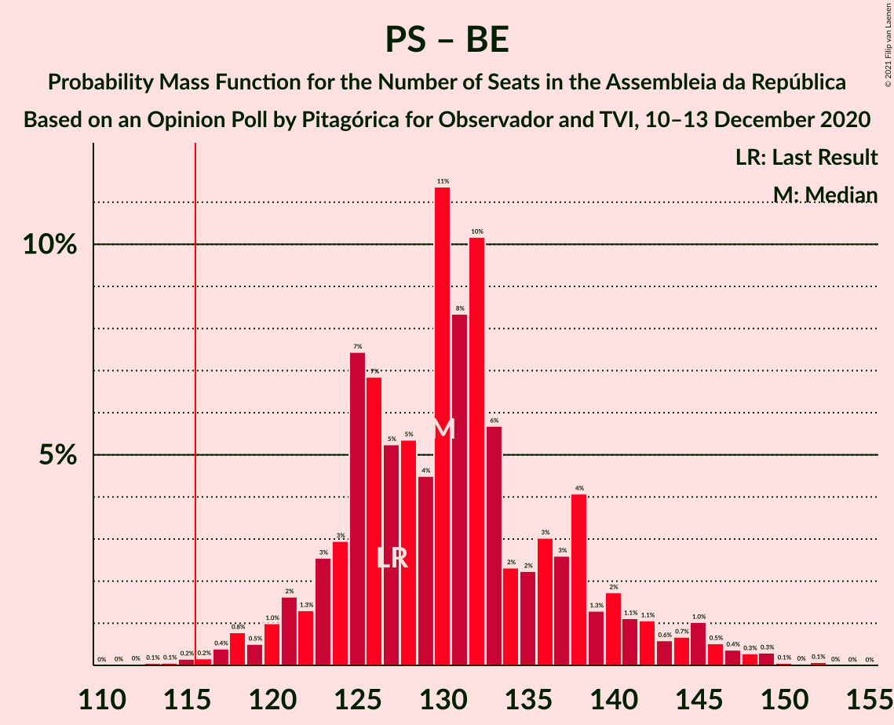

# Opinion Poll by Pitagórica for Observador and TVI, 10–13 December 2020

<a href="#voting-intentions">Voting Intentions</a> | <a href="#seats">Seats</a> | <a href="#coalitions">Coalitions</a> | <a href="#technical-information">Technical Information</a>

## Voting Intentions

### Confidence Intervals

| Party | Last Result | Poll Result | 80% Confidence Interval | 90% Confidence Interval | 95% Confidence Interval | 99% Confidence Interval |
|:-----:|:-----------:|:-----------:|:-----------------------:|:-----------------------:|:-----------------------:|:-----------------------:|
| Partido Socialista | 36.4% | 42.0% | 39.5–44.5% |38.8–45.3% |38.2–45.9% |37.0–47.1% |
| Partido Social Democrata | 27.8% | 26.1% | 23.9–28.4% |23.3–29.1% |22.8–29.6% |21.8–30.8% |
| Chega | 1.3% | 8.3% | 7.0–9.8% |6.7–10.3% |6.4–10.7% |5.8–11.5% |
| Bloco de Esquerda | 9.5% | 6.7% | 5.5–8.1% |5.2–8.6% |5.0–8.9% |4.5–9.7% |
| Coligação Democrática Unitária | 6.3% | 5.4% | 4.4–6.8% |4.1–7.1% |3.9–7.5% |3.5–8.2% |
| Pessoas–Animais–Natureza | 3.3% | 2.2% | 1.6–3.2% |1.5–3.5% |1.3–3.7% |1.1–4.2% |
| CDS–Partido Popular | 4.2% | 1.9% | 1.4–2.8% |1.2–3.1% |1.1–3.3% |0.9–3.8% |
| Iniciativa Liberal | 1.3% | 1.4% | 1.0–2.3% |0.9–2.5% |0.8–2.7% |0.6–3.2% |

*Note:* The poll result column reflects the actual value used in the calculations. Published results may vary slightly, and in addition be rounded to fewer digits.

## Seats

### Confidence Intervals

| Party | Last Result | Median | 80% Confidence Interval | 90% Confidence Interval | 95% Confidence Interval | 99% Confidence Interval |
|:-----:|:-----------:|:------:|:-----------------------:|:-----------------------:|:-----------------------:|:-----------------------:|
| <a href="#partido-socialista">Partido Socialista</a> | 108 | 119 | 111–127 |110–130 |108–133 |105–136 |
| <a href="#partido-social-democrata">Partido Social Democrata</a> | 79 | 71 | 63–78 |61–80 |59–81 |56–85 |
| <a href="#chega">Chega</a> | 1 | 14 | 11–18 |11–20 |11–22 |8–24 |
| <a href="#bloco-de-esquerda">Bloco de Esquerda</a> | 19 | 11 | 7–16 |7–16 |7–17 |7–19 |
| <a href="#coligação-democrática-unitária">Coligação Democrática Unitária</a> | 12 | 9 | 6–13 |5–14 |5–15 |4–16 |
| <a href="#pessoas–animais–natureza">Pessoas–Animais–Natureza</a> | 4 | 2 | 1–3 |1–4 |0–4 |0–5 |
| <a href="#cds–partido-popular">CDS–Partido Popular</a> | 5 | 1 | 0–2 |0–2 |0–2 |0–4 |
| <a href="#iniciativa-liberal">Iniciativa Liberal</a> | 1 | 1 | 1–3 |0–3 |0–3 |0–4 |

### Partido Socialista

*For a full overview of the results for this party, see the [Partido Socialista](party-partidosocialista.html) page.*

| Number of Seats | Probability | Accumulated | Special Marks |
|:---------------:|:-----------:|:-----------:|:-------------:|
| 102 | 0% | 100% |  |
| 103 | 0.1% | 99.9% |  |
| 104 | 0.2% | 99.8% |  |
| 105 | 0.3% | 99.7% |  |
| 106 | 0.5% | 99.4% |  |
| 107 | 0.6% | 98.8% |  |
| 108 | 1.2% | 98% | Last Result |
| 109 | 2% | 97% |  |
| 110 | 3% | 95% |  |
| 111 | 3% | 93% |  |
| 112 | 2% | 89% |  |
| 113 | 2% | 87% |  |
| 114 | 7% | 85% |  |
| 115 | 4% | 78% |  |
| 116 | 6% | 73% | Majority |
| 117 | 9% | 68% |  |
| 118 | 7% | 58% |  |
| 119 | 7% | 51% | Median |
| 120 | 10% | 45% |  |
| 121 | 6% | 34% |  |
| 122 | 5% | 29% |  |
| 123 | 3% | 23% |  |
| 124 | 4% | 21% |  |
| 125 | 3% | 17% |  |
| 126 | 2% | 14% |  |
| 127 | 2% | 12% |  |
| 128 | 3% | 10% |  |
| 129 | 0.7% | 7% |  |
| 130 | 2% | 6% |  |
| 131 | 0.7% | 4% |  |
| 132 | 0.8% | 4% |  |
| 133 | 0.8% | 3% |  |
| 134 | 0.6% | 2% |  |
| 135 | 0.5% | 2% |  |
| 136 | 0.6% | 1.0% |  |
| 137 | 0.2% | 0.4% |  |
| 138 | 0.1% | 0.3% |  |
| 139 | 0% | 0.2% |  |
| 140 | 0% | 0.1% |  |
| 141 | 0% | 0.1% |  |
| 142 | 0% | 0% |  |

### Partido Social Democrata

*For a full overview of the results for this party, see the [Partido Social Democrata](party-partidosocialdemocrata.html) page.*

| Number of Seats | Probability | Accumulated | Special Marks |
|:---------------:|:-----------:|:-----------:|:-------------:|
| 54 | 0.1% | 100% |  |
| 55 | 0.3% | 99.9% |  |
| 56 | 0.5% | 99.6% |  |
| 57 | 0.4% | 99.1% |  |
| 58 | 0.7% | 98.7% |  |
| 59 | 0.7% | 98% |  |
| 60 | 0.5% | 97% |  |
| 61 | 2% | 97% |  |
| 62 | 2% | 95% |  |
| 63 | 4% | 93% |  |
| 64 | 3% | 89% |  |
| 65 | 4% | 86% |  |
| 66 | 3% | 81% |  |
| 67 | 2% | 78% |  |
| 68 | 11% | 76% |  |
| 69 | 5% | 66% |  |
| 70 | 6% | 60% |  |
| 71 | 7% | 55% | Median |
| 72 | 8% | 48% |  |
| 73 | 5% | 40% |  |
| 74 | 5% | 35% |  |
| 75 | 7% | 30% |  |
| 76 | 5% | 23% |  |
| 77 | 6% | 18% |  |
| 78 | 3% | 12% |  |
| 79 | 3% | 9% | Last Result |
| 80 | 2% | 5% |  |
| 81 | 1.5% | 4% |  |
| 82 | 0.9% | 2% |  |
| 83 | 0.4% | 1.3% |  |
| 84 | 0.3% | 0.9% |  |
| 85 | 0.3% | 0.6% |  |
| 86 | 0.2% | 0.3% |  |
| 87 | 0% | 0.2% |  |
| 88 | 0.1% | 0.1% |  |
| 89 | 0% | 0.1% |  |
| 90 | 0% | 0% |  |

### Chega

*For a full overview of the results for this party, see the [Chega](party-chega.html) page.*

| Number of Seats | Probability | Accumulated | Special Marks |
|:---------------:|:-----------:|:-----------:|:-------------:|
| 1 | 0% | 100% | Last Result |
| 2 | 0% | 100% |  |
| 3 | 0% | 100% |  |
| 4 | 0% | 100% |  |
| 5 | 0% | 100% |  |
| 6 | 0% | 100% |  |
| 7 | 0% | 100% |  |
| 8 | 0.8% | 100% |  |
| 9 | 0.4% | 99.2% |  |
| 10 | 0.6% | 98.8% |  |
| 11 | 16% | 98% |  |
| 12 | 8% | 82% |  |
| 13 | 12% | 75% |  |
| 14 | 27% | 62% | Median |
| 15 | 5% | 35% |  |
| 16 | 5% | 30% |  |
| 17 | 10% | 25% |  |
| 18 | 6% | 14% |  |
| 19 | 2% | 9% |  |
| 20 | 2% | 6% |  |
| 21 | 2% | 4% |  |
| 22 | 1.3% | 3% |  |
| 23 | 0.7% | 1.3% |  |
| 24 | 0.2% | 0.6% |  |
| 25 | 0.2% | 0.4% |  |
| 26 | 0.1% | 0.2% |  |
| 27 | 0.1% | 0.1% |  |
| 28 | 0% | 0% |  |

### Bloco de Esquerda

*For a full overview of the results for this party, see the [Bloco de Esquerda](party-blocodeesquerda.html) page.*

| Number of Seats | Probability | Accumulated | Special Marks |
|:---------------:|:-----------:|:-----------:|:-------------:|
| 4 | 0% | 100% |  |
| 5 | 0.2% | 99.9% |  |
| 6 | 0.2% | 99.7% |  |
| 7 | 12% | 99.6% |  |
| 8 | 4% | 87% |  |
| 9 | 5% | 83% |  |
| 10 | 15% | 78% |  |
| 11 | 24% | 64% | Median |
| 12 | 7% | 39% |  |
| 13 | 6% | 33% |  |
| 14 | 5% | 26% |  |
| 15 | 8% | 21% |  |
| 16 | 10% | 13% |  |
| 17 | 1.4% | 4% |  |
| 18 | 2% | 2% |  |
| 19 | 0.4% | 0.7% | Last Result |
| 20 | 0.2% | 0.3% |  |
| 21 | 0.1% | 0.1% |  |
| 22 | 0% | 0% |  |

### Coligação Democrática Unitária

*For a full overview of the results for this party, see the [Coligação Democrática Unitária](party-coligaçãodemocráticaunitária.html) page.*

| Number of Seats | Probability | Accumulated | Special Marks |
|:---------------:|:-----------:|:-----------:|:-------------:|
| 3 | 0.1% | 100% |  |
| 4 | 0.5% | 99.9% |  |
| 5 | 9% | 99.4% |  |
| 6 | 7% | 91% |  |
| 7 | 27% | 84% |  |
| 8 | 3% | 57% |  |
| 9 | 12% | 53% | Median |
| 10 | 21% | 42% |  |
| 11 | 5% | 21% |  |
| 12 | 4% | 16% | Last Result |
| 13 | 6% | 12% |  |
| 14 | 3% | 6% |  |
| 15 | 2% | 3% |  |
| 16 | 0.8% | 1.3% |  |
| 17 | 0.2% | 0.5% |  |
| 18 | 0.2% | 0.2% |  |
| 19 | 0% | 0% |  |

### Pessoas–Animais–Natureza

*For a full overview of the results for this party, see the [Pessoas–Animais–Natureza](party-pessoas–animais–natureza.html) page.*

| Number of Seats | Probability | Accumulated | Special Marks |
|:---------------:|:-----------:|:-----------:|:-------------:|
| 0 | 5% | 100% |  |
| 1 | 28% | 95% |  |
| 2 | 52% | 67% | Median |
| 3 | 10% | 15% |  |
| 4 | 4% | 5% | Last Result |
| 5 | 0.6% | 0.9% |  |
| 6 | 0.3% | 0.3% |  |
| 7 | 0% | 0% |  |

### CDS–Partido Popular

*For a full overview of the results for this party, see the [CDS–Partido Popular](party-cds–partidopopular.html) page.*

| Number of Seats | Probability | Accumulated | Special Marks |
|:---------------:|:-----------:|:-----------:|:-------------:|
| 0 | 45% | 100% |  |
| 1 | 41% | 55% | Median |
| 2 | 13% | 14% |  |
| 3 | 1.2% | 2% |  |
| 4 | 0.5% | 0.6% |  |
| 5 | 0.1% | 0.1% | Last Result |
| 6 | 0% | 0% |  |

### Iniciativa Liberal

*For a full overview of the results for this party, see the [Iniciativa Liberal](party-iniciativaliberal.html) page.*

| Number of Seats | Probability | Accumulated | Special Marks |
|:---------------:|:-----------:|:-----------:|:-------------:|
| 0 | 10% | 100% |  |
| 1 | 42% | 90% | Last Result, Median |
| 2 | 25% | 48% |  |
| 3 | 23% | 24% |  |
| 4 | 0.5% | 0.7% |  |
| 5 | 0.1% | 0.1% |  |
| 6 | 0% | 0% |  |

## Coalitions

### Confidence Intervals

| Coalition | Last Result | Median | Majority? | 80% Confidence Interval | 90% Confidence Interval | 95% Confidence Interval | 99% Confidence Interval |
|:---------:|:-----------:|:------:|:---------:|:-----------------------:|:-----------------------:|:-----------------------:|:-----------------------:|
| Partido Socialista – Bloco de Esquerda – Coligação Democrática Unitária | 139 | 139 | 100% | 132–147 | 130–150 | 128–152 | 125–155 |
| Partido Socialista – Bloco de Esquerda | 127 | 130 | 99.7% | 124–138 | 122–142 | 120–145 | 116–148 |
| Partido Socialista – Coligação Democrática Unitária | 120 | 128 | 98% | 120–137 | 118–139 | 117–141 | 113–144 |
| Partido Socialista | 108 | 119 | 73% | 111–127 | 110–130 | 108–133 | 105–136 |
| Partido Social Democrata – CDS–Partido Popular | 84 | 72 | 0% | 64–79 | 62–80 | 60–82 | 56–86 |

### Partido Socialista – Bloco de Esquerda – Coligação Democrática Unitária

| Number of Seats | Probability | Accumulated | Special Marks |
|:---------------:|:-----------:|:-----------:|:-------------:|
| 120 | 0% | 100% |  |
| 121 | 0% | 99.9% |  |
| 122 | 0% | 99.9% |  |
| 123 | 0.1% | 99.9% |  |
| 124 | 0.1% | 99.8% |  |
| 125 | 0.3% | 99.7% |  |
| 126 | 0.5% | 99.4% |  |
| 127 | 1.1% | 98.8% |  |
| 128 | 1.5% | 98% |  |
| 129 | 0.6% | 96% |  |
| 130 | 0.7% | 96% |  |
| 131 | 2% | 95% |  |
| 132 | 4% | 93% |  |
| 133 | 3% | 89% |  |
| 134 | 5% | 86% |  |
| 135 | 7% | 81% |  |
| 136 | 6% | 74% |  |
| 137 | 8% | 68% |  |
| 138 | 6% | 61% |  |
| 139 | 9% | 54% | Last Result, Median |
| 140 | 8% | 46% |  |
| 141 | 5% | 38% |  |
| 142 | 4% | 33% |  |
| 143 | 7% | 29% |  |
| 144 | 4% | 22% |  |
| 145 | 3% | 18% |  |
| 146 | 2% | 15% |  |
| 147 | 3% | 13% |  |
| 148 | 2% | 10% |  |
| 149 | 1.0% | 8% |  |
| 150 | 3% | 7% |  |
| 151 | 1.0% | 4% |  |
| 152 | 1.2% | 3% |  |
| 153 | 0.8% | 2% |  |
| 154 | 0.6% | 1.4% |  |
| 155 | 0.3% | 0.8% |  |
| 156 | 0.2% | 0.5% |  |
| 157 | 0.1% | 0.3% |  |
| 158 | 0.1% | 0.1% |  |
| 159 | 0.1% | 0.1% |  |
| 160 | 0% | 0% |  |

### Partido Socialista – Bloco de Esquerda

| Number of Seats | Probability | Accumulated | Special Marks |
|:---------------:|:-----------:|:-----------:|:-------------:|
| 112 | 0% | 100% |  |
| 113 | 0.1% | 99.9% |  |
| 114 | 0.1% | 99.9% |  |
| 115 | 0.2% | 99.8% |  |
| 116 | 0.2% | 99.7% | Majority |
| 117 | 0.4% | 99.5% |  |
| 118 | 0.8% | 99.1% |  |
| 119 | 0.5% | 98% |  |
| 120 | 1.0% | 98% |  |
| 121 | 2% | 97% |  |
| 122 | 1.3% | 95% |  |
| 123 | 3% | 94% |  |
| 124 | 3% | 91% |  |
| 125 | 7% | 88% |  |
| 126 | 7% | 81% |  |
| 127 | 5% | 74% | Last Result |
| 128 | 5% | 69% |  |
| 129 | 4% | 63% |  |
| 130 | 11% | 59% | Median |
| 131 | 8% | 48% |  |
| 132 | 10% | 39% |  |
| 133 | 6% | 29% |  |
| 134 | 2% | 23% |  |
| 135 | 2% | 21% |  |
| 136 | 3% | 19% |  |
| 137 | 3% | 16% |  |
| 138 | 4% | 13% |  |
| 139 | 1.3% | 9% |  |
| 140 | 2% | 8% |  |
| 141 | 1.1% | 6% |  |
| 142 | 1.1% | 5% |  |
| 143 | 0.6% | 4% |  |
| 144 | 0.7% | 3% |  |
| 145 | 1.0% | 3% |  |
| 146 | 0.5% | 2% |  |
| 147 | 0.4% | 1.1% |  |
| 148 | 0.3% | 0.8% |  |
| 149 | 0.3% | 0.5% |  |
| 150 | 0.1% | 0.2% |  |
| 151 | 0% | 0.1% |  |
| 152 | 0.1% | 0.1% |  |
| 153 | 0% | 0% |  |

### Partido Socialista – Coligação Democrática Unitária

| Number of Seats | Probability | Accumulated | Special Marks |
|:---------------:|:-----------:|:-----------:|:-------------:|
| 109 | 0% | 100% |  |
| 110 | 0.1% | 99.9% |  |
| 111 | 0.1% | 99.9% |  |
| 112 | 0.2% | 99.8% |  |
| 113 | 0.2% | 99.6% |  |
| 114 | 0.3% | 99.3% |  |
| 115 | 0.6% | 99.0% |  |
| 116 | 0.9% | 98% | Majority |
| 117 | 1.2% | 98% |  |
| 118 | 2% | 96% |  |
| 119 | 3% | 94% |  |
| 120 | 2% | 91% | Last Result |
| 121 | 5% | 89% |  |
| 122 | 3% | 85% |  |
| 123 | 4% | 82% |  |
| 124 | 7% | 78% |  |
| 125 | 5% | 70% |  |
| 126 | 6% | 65% |  |
| 127 | 8% | 59% |  |
| 128 | 9% | 51% | Median |
| 129 | 7% | 43% |  |
| 130 | 7% | 36% |  |
| 131 | 3% | 29% |  |
| 132 | 3% | 26% |  |
| 133 | 4% | 23% |  |
| 134 | 5% | 19% |  |
| 135 | 2% | 14% |  |
| 136 | 2% | 12% |  |
| 137 | 3% | 10% |  |
| 138 | 2% | 7% |  |
| 139 | 1.2% | 5% |  |
| 140 | 1.2% | 4% |  |
| 141 | 0.8% | 3% |  |
| 142 | 0.7% | 2% |  |
| 143 | 0.9% | 1.4% |  |
| 144 | 0.2% | 0.6% |  |
| 145 | 0.1% | 0.3% |  |
| 146 | 0.1% | 0.2% |  |
| 147 | 0% | 0.1% |  |
| 148 | 0% | 0.1% |  |
| 149 | 0% | 0.1% |  |
| 150 | 0% | 0% |  |

### Partido Socialista

| Number of Seats | Probability | Accumulated | Special Marks |
|:---------------:|:-----------:|:-----------:|:-------------:|
| 102 | 0% | 100% |  |
| 103 | 0.1% | 99.9% |  |
| 104 | 0.2% | 99.8% |  |
| 105 | 0.3% | 99.7% |  |
| 106 | 0.5% | 99.4% |  |
| 107 | 0.6% | 98.8% |  |
| 108 | 1.2% | 98% | Last Result |
| 109 | 2% | 97% |  |
| 110 | 3% | 95% |  |
| 111 | 3% | 93% |  |
| 112 | 2% | 89% |  |
| 113 | 2% | 87% |  |
| 114 | 7% | 85% |  |
| 115 | 4% | 78% |  |
| 116 | 6% | 73% | Majority |
| 117 | 9% | 68% |  |
| 118 | 7% | 58% |  |
| 119 | 7% | 51% | Median |
| 120 | 10% | 45% |  |
| 121 | 6% | 34% |  |
| 122 | 5% | 29% |  |
| 123 | 3% | 23% |  |
| 124 | 4% | 21% |  |
| 125 | 3% | 17% |  |
| 126 | 2% | 14% |  |
| 127 | 2% | 12% |  |
| 128 | 3% | 10% |  |
| 129 | 0.7% | 7% |  |
| 130 | 2% | 6% |  |
| 131 | 0.7% | 4% |  |
| 132 | 0.8% | 4% |  |
| 133 | 0.8% | 3% |  |
| 134 | 0.6% | 2% |  |
| 135 | 0.5% | 2% |  |
| 136 | 0.6% | 1.0% |  |
| 137 | 0.2% | 0.4% |  |
| 138 | 0.1% | 0.3% |  |
| 139 | 0% | 0.2% |  |
| 140 | 0% | 0.1% |  |
| 141 | 0% | 0.1% |  |
| 142 | 0% | 0% |  |

### Partido Social Democrata – CDS–Partido Popular

| Number of Seats | Probability | Accumulated | Special Marks |
|:---------------:|:-----------:|:-----------:|:-------------:|
| 55 | 0.1% | 100% |  |
| 56 | 0.4% | 99.9% |  |
| 57 | 0.3% | 99.4% |  |
| 58 | 0.9% | 99.2% |  |
| 59 | 0.4% | 98% |  |
| 60 | 0.6% | 98% |  |
| 61 | 1.5% | 97% |  |
| 62 | 2% | 96% |  |
| 63 | 2% | 94% |  |
| 64 | 3% | 92% |  |
| 65 | 3% | 88% |  |
| 66 | 5% | 85% |  |
| 67 | 3% | 81% |  |
| 68 | 5% | 78% |  |
| 69 | 6% | 72% |  |
| 70 | 6% | 66% |  |
| 71 | 9% | 59% |  |
| 72 | 7% | 51% | Median |
| 73 | 5% | 44% |  |
| 74 | 6% | 39% |  |
| 75 | 4% | 33% |  |
| 76 | 9% | 29% |  |
| 77 | 4% | 21% |  |
| 78 | 6% | 17% |  |
| 79 | 3% | 11% |  |
| 80 | 3% | 8% |  |
| 81 | 1.5% | 4% |  |
| 82 | 1.1% | 3% |  |
| 83 | 0.6% | 2% |  |
| 84 | 0.5% | 1.3% | Last Result |
| 85 | 0.3% | 0.8% |  |
| 86 | 0.2% | 0.5% |  |
| 87 | 0.1% | 0.3% |  |
| 88 | 0.1% | 0.2% |  |
| 89 | 0.1% | 0.1% |  |
| 90 | 0% | 0.1% |  |
| 91 | 0% | 0% |  |

## Technical Information

### Opinion Poll

+ **Polling firm:** Pitagórica
+ **Commissioner(s):** Observador and TVI
+ **Fieldwork period:** 10–13 December 2020

### Calculations

+ **Sample size:** 629
+ **Simulations done:** 1,048,576
+ **Error estimate:** 0.91%

