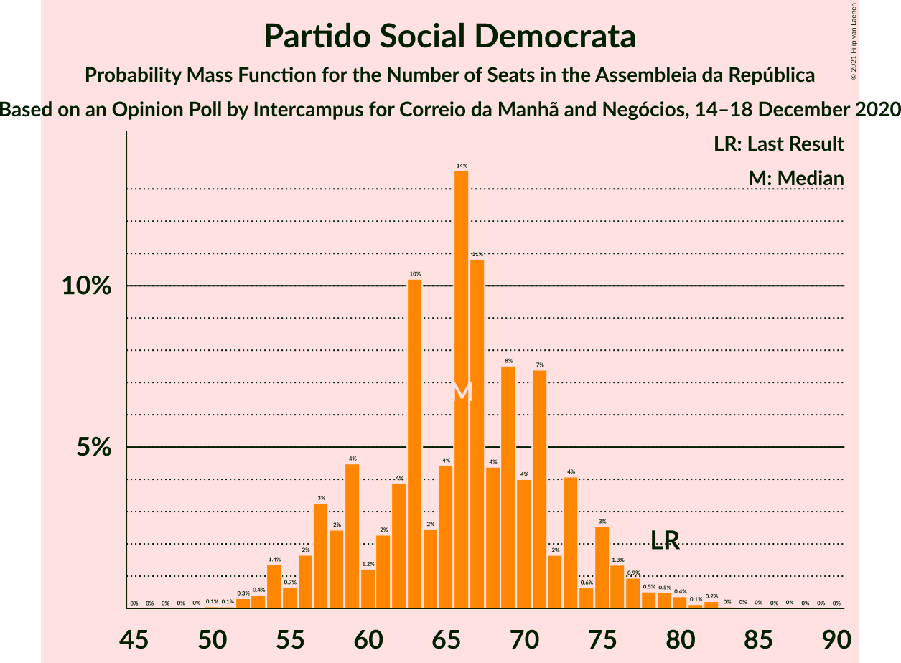
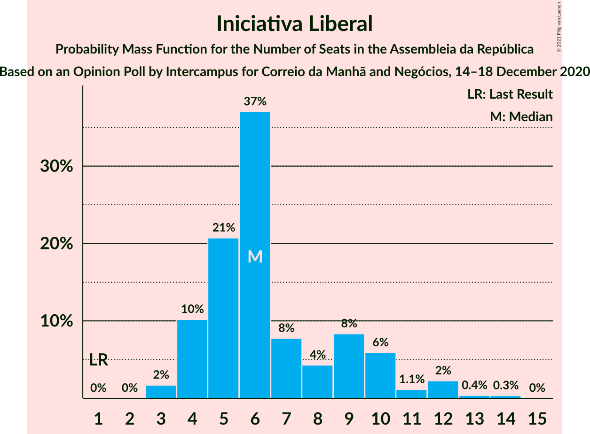
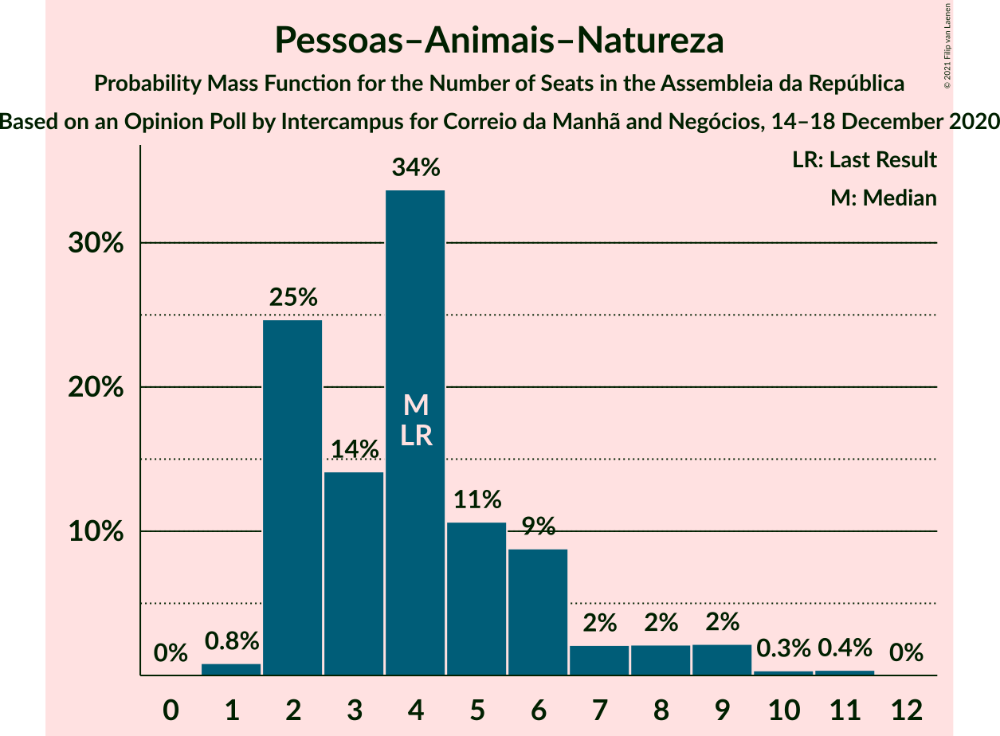

# Opinion Poll by Intercampus for Correio da Manhã and Negócios, 14–18 December 2020

<a href="#voting-intentions">Voting Intentions</a> | <a href="#seats">Seats</a> | <a href="#coalitions">Coalitions</a> | <a href="#technical-information">Technical Information</a>

## Voting Intentions

### Confidence Intervals

| Party | Last Result | Poll Result | 80% Confidence Interval | 90% Confidence Interval | 95% Confidence Interval | 99% Confidence Interval |
|:-----:|:-----------:|:-----------:|:-----------------------:|:-----------------------:|:-----------------------:|:-----------------------:|
| Partido Socialista | 36.4% | 38.0% | 35.5–40.6% |34.8–41.3% |34.2–41.9% |33.0–43.2% |
| Partido Social Democrata | 27.8% | 23.5% | 21.4–25.9% |20.8–26.5% |20.3–27.1% |19.4–28.2% |
| Chega | 1.3% | 7.6% | 6.4–9.2% |6.1–9.6% |5.8–10.0% |5.2–10.8% |
| Bloco de Esquerda | 9.5% | 7.3% | 6.1–8.8% |5.8–9.3% |5.5–9.7% |5.0–10.5% |
| Coligação Democrática Unitária | 6.3% | 5.5% | 4.5–6.9% |4.2–7.2% |3.9–7.6% |3.5–8.3% |
| Iniciativa Liberal | 1.3% | 4.5% | 3.6–5.8% |3.3–6.1% |3.1–6.4% |2.7–7.1% |
| Pessoas–Animais–Natureza | 3.3% | 3.5% | 2.7–4.6% |2.5–5.0% |2.3–5.3% |2.0–5.9% |
| CDS–Partido Popular | 4.2% | 3.2% | 2.4–4.3% |2.2–4.6% |2.0–4.9% |1.7–5.5% |
| LIVRE | 1.1% | 0.8% | 0.5–1.5% |0.4–1.7% |0.4–1.9% |0.2–2.3% |

*Note:* The poll result column reflects the actual value used in the calculations. Published results may vary slightly, and in addition be rounded to fewer digits.

## Seats

### Confidence Intervals

| Party | Last Result | Median | 80% Confidence Interval | 90% Confidence Interval | 95% Confidence Interval | 99% Confidence Interval |
|:-----:|:-----------:|:------:|:-----------------------:|:-----------------------:|:-----------------------:|:-----------------------:|
| <a href="#partido-socialista">Partido Socialista</a> | 108 | 112 | 105–121 |103–123 |102–125 |98–130 |
| <a href="#partido-social-democrata">Partido Social Democrata</a> | 79 | 66 | 58–73 |57–75 |55–77 |53–81 |
| <a href="#chega">Chega</a> | 1 | 14 | 11–18 |10–20 |9–21 |8–24 |
| <a href="#bloco-de-esquerda">Bloco de Esquerda</a> | 19 | 14 | 11–18 |8–19 |7–20 |7–22 |
| <a href="#coligação-democrática-unitária">Coligação Democrática Unitária</a> | 12 | 10 | 6–14 |6–14 |5–15 |5–18 |
| <a href="#iniciativa-liberal">Iniciativa Liberal</a> | 1 | 6 | 4–9 |4–10 |4–12 |3–13 |
| <a href="#pessoas–animais–natureza">Pessoas–Animais–Natureza</a> | 4 | 4 | 2–6 |2–8 |2–9 |1–10 |
| <a href="#cds–partido-popular">CDS–Partido Popular</a> | 5 | 2 | 1–5 |1–5 |1–5 |0–8 |
| <a href="#livre">LIVRE</a> | 1 | 0 | 0–1 |0–1 |0–1 |0–3 |

### Partido Socialista

*For a full overview of the results for this party, see the [Partido Socialista](party-partidosocialista.html) page.*

| Number of Seats | Probability | Accumulated | Special Marks |
|:---------------:|:-----------:|:-----------:|:-------------:|
| 94 | 0% | 100% |  |
| 95 | 0.1% | 99.9% |  |
| 96 | 0.1% | 99.8% |  |
| 97 | 0.1% | 99.8% |  |
| 98 | 0.2% | 99.6% |  |
| 99 | 0.2% | 99.4% |  |
| 100 | 0.3% | 99.2% |  |
| 101 | 0.9% | 98.9% |  |
| 102 | 2% | 98% |  |
| 103 | 1.4% | 96% |  |
| 104 | 4% | 95% |  |
| 105 | 3% | 91% |  |
| 106 | 3% | 88% |  |
| 107 | 5% | 85% |  |
| 108 | 7% | 80% | Last Result |
| 109 | 6% | 73% |  |
| 110 | 5% | 67% |  |
| 111 | 7% | 62% |  |
| 112 | 7% | 55% | Median |
| 113 | 3% | 48% |  |
| 114 | 4% | 44% |  |
| 115 | 7% | 40% |  |
| 116 | 3% | 33% | Majority |
| 117 | 5% | 29% |  |
| 118 | 9% | 24% |  |
| 119 | 2% | 15% |  |
| 120 | 2% | 12% |  |
| 121 | 3% | 10% |  |
| 122 | 2% | 7% |  |
| 123 | 0.8% | 5% |  |
| 124 | 1.2% | 4% |  |
| 125 | 0.8% | 3% |  |
| 126 | 0.6% | 2% |  |
| 127 | 0.4% | 2% |  |
| 128 | 0.2% | 2% |  |
| 129 | 0.8% | 1.4% |  |
| 130 | 0.2% | 0.5% |  |
| 131 | 0.2% | 0.3% |  |
| 132 | 0% | 0.1% |  |
| 133 | 0% | 0.1% |  |
| 134 | 0% | 0% |  |

### Partido Social Democrata

*For a full overview of the results for this party, see the [Partido Social Democrata](party-partidosocialdemocrata.html) page.*

| Number of Seats | Probability | Accumulated | Special Marks |
|:---------------:|:-----------:|:-----------:|:-------------:|
| 50 | 0.1% | 100% |  |
| 51 | 0.1% | 99.9% |  |
| 52 | 0.3% | 99.9% |  |
| 53 | 0.4% | 99.5% |  |
| 54 | 1.4% | 99.1% |  |
| 55 | 0.7% | 98% |  |
| 56 | 2% | 97% |  |
| 57 | 3% | 95% |  |
| 58 | 2% | 92% |  |
| 59 | 4% | 90% |  |
| 60 | 1.2% | 85% |  |
| 61 | 2% | 84% |  |
| 62 | 4% | 82% |  |
| 63 | 10% | 78% |  |
| 64 | 2% | 68% |  |
| 65 | 4% | 65% |  |
| 66 | 14% | 61% | Median |
| 67 | 11% | 47% |  |
| 68 | 4% | 36% |  |
| 69 | 8% | 32% |  |
| 70 | 4% | 25% |  |
| 71 | 7% | 21% |  |
| 72 | 2% | 13% |  |
| 73 | 4% | 11% |  |
| 74 | 0.6% | 7% |  |
| 75 | 3% | 7% |  |
| 76 | 1.3% | 4% |  |
| 77 | 0.9% | 3% |  |
| 78 | 0.5% | 2% |  |
| 79 | 0.5% | 1.4% | Last Result |
| 80 | 0.4% | 0.9% |  |
| 81 | 0.1% | 0.5% |  |
| 82 | 0.2% | 0.4% |  |
| 83 | 0% | 0.2% |  |
| 84 | 0% | 0.1% |  |
| 85 | 0% | 0.1% |  |
| 86 | 0% | 0.1% |  |
| 87 | 0% | 0% |  |

### Chega

*For a full overview of the results for this party, see the [Chega](party-chega.html) page.*

| Number of Seats | Probability | Accumulated | Special Marks |
|:---------------:|:-----------:|:-----------:|:-------------:|
| 1 | 0% | 100% | Last Result |
| 2 | 0% | 100% |  |
| 3 | 0% | 100% |  |
| 4 | 0% | 100% |  |
| 5 | 0% | 100% |  |
| 6 | 0.1% | 100% |  |
| 7 | 0.1% | 99.8% |  |
| 8 | 2% | 99.7% |  |
| 9 | 3% | 98% |  |
| 10 | 5% | 95% |  |
| 11 | 19% | 90% |  |
| 12 | 5% | 71% |  |
| 13 | 12% | 66% |  |
| 14 | 24% | 54% | Median |
| 15 | 9% | 30% |  |
| 16 | 4% | 22% |  |
| 17 | 4% | 18% |  |
| 18 | 5% | 14% |  |
| 19 | 3% | 9% |  |
| 20 | 3% | 6% |  |
| 21 | 2% | 4% |  |
| 22 | 0.3% | 1.5% |  |
| 23 | 0.6% | 1.2% |  |
| 24 | 0.3% | 0.6% |  |
| 25 | 0.2% | 0.3% |  |
| 26 | 0% | 0.1% |  |
| 27 | 0% | 0% |  |

### Bloco de Esquerda

*For a full overview of the results for this party, see the [Bloco de Esquerda](party-blocodeesquerda.html) page.*

| Number of Seats | Probability | Accumulated | Special Marks |
|:---------------:|:-----------:|:-----------:|:-------------:|
| 7 | 4% | 100% |  |
| 8 | 1.3% | 96% |  |
| 9 | 0.9% | 95% |  |
| 10 | 1.5% | 94% |  |
| 11 | 13% | 93% |  |
| 12 | 12% | 80% |  |
| 13 | 12% | 68% |  |
| 14 | 18% | 56% | Median |
| 15 | 5% | 38% |  |
| 16 | 12% | 33% |  |
| 17 | 6% | 21% |  |
| 18 | 11% | 16% |  |
| 19 | 3% | 5% | Last Result |
| 20 | 1.0% | 3% |  |
| 21 | 0.7% | 2% |  |
| 22 | 0.5% | 0.8% |  |
| 23 | 0.2% | 0.3% |  |
| 24 | 0% | 0.1% |  |
| 25 | 0% | 0.1% |  |
| 26 | 0% | 0% |  |

### Coligação Democrática Unitária

*For a full overview of the results for this party, see the [Coligação Democrática Unitária](party-coligaçãodemocráticaunitária.html) page.*

| Number of Seats | Probability | Accumulated | Special Marks |
|:---------------:|:-----------:|:-----------:|:-------------:|
| 3 | 0.1% | 100% |  |
| 4 | 0.3% | 99.9% |  |
| 5 | 4% | 99.5% |  |
| 6 | 12% | 95% |  |
| 7 | 12% | 84% |  |
| 8 | 7% | 72% |  |
| 9 | 10% | 65% |  |
| 10 | 16% | 55% | Median |
| 11 | 11% | 39% |  |
| 12 | 3% | 28% | Last Result |
| 13 | 9% | 25% |  |
| 14 | 11% | 15% |  |
| 15 | 3% | 5% |  |
| 16 | 0.5% | 2% |  |
| 17 | 0.6% | 1.1% |  |
| 18 | 0.4% | 0.5% |  |
| 19 | 0.1% | 0.1% |  |
| 20 | 0% | 0% |  |

### Iniciativa Liberal

*For a full overview of the results for this party, see the [Iniciativa Liberal](party-iniciativaliberal.html) page.*

| Number of Seats | Probability | Accumulated | Special Marks |
|:---------------:|:-----------:|:-----------:|:-------------:|
| 1 | 0% | 100% | Last Result |
| 2 | 0% | 100% |  |
| 3 | 2% | 100% |  |
| 4 | 10% | 98% |  |
| 5 | 21% | 88% |  |
| 6 | 37% | 67% | Median |
| 7 | 8% | 30% |  |
| 8 | 4% | 23% |  |
| 9 | 8% | 18% |  |
| 10 | 6% | 10% |  |
| 11 | 1.1% | 4% |  |
| 12 | 2% | 3% |  |
| 13 | 0.4% | 0.7% |  |
| 14 | 0.3% | 0.3% |  |
| 15 | 0% | 0% |  |

### Pessoas–Animais–Natureza

*For a full overview of the results for this party, see the [Pessoas–Animais–Natureza](party-pessoas–animais–natureza.html) page.*

| Number of Seats | Probability | Accumulated | Special Marks |
|:---------------:|:-----------:|:-----------:|:-------------:|
| 1 | 0.8% | 100% |  |
| 2 | 25% | 99.1% |  |
| 3 | 14% | 74% |  |
| 4 | 34% | 60% | Last Result, Median |
| 5 | 11% | 27% |  |
| 6 | 9% | 16% |  |
| 7 | 2% | 7% |  |
| 8 | 2% | 5% |  |
| 9 | 2% | 3% |  |
| 10 | 0.3% | 0.8% |  |
| 11 | 0.4% | 0.4% |  |
| 12 | 0% | 0% |  |

### CDS–Partido Popular

*For a full overview of the results for this party, see the [CDS–Partido Popular](party-cds–partidopopular.html) page.*

| Number of Seats | Probability | Accumulated | Special Marks |
|:---------------:|:-----------:|:-----------:|:-------------:|
| 0 | 1.5% | 100% |  |
| 1 | 13% | 98.5% |  |
| 2 | 41% | 85% | Median |
| 3 | 17% | 45% |  |
| 4 | 6% | 27% |  |
| 5 | 20% | 21% | Last Result |
| 6 | 0.4% | 1.3% |  |
| 7 | 0.3% | 0.8% |  |
| 8 | 0.3% | 0.6% |  |
| 9 | 0.3% | 0.3% |  |
| 10 | 0% | 0% |  |

### LIVRE

*For a full overview of the results for this party, see the [LIVRE](party-livre.html) page.*

| Number of Seats | Probability | Accumulated | Special Marks |
|:---------------:|:-----------:|:-----------:|:-------------:|
| 0 | 60% | 100% | Median |
| 1 | 38% | 40% | Last Result |
| 2 | 1.0% | 2% |  |
| 3 | 0.5% | 0.5% |  |
| 4 | 0% | 0% |  |

## Coalitions

### Confidence Intervals

| Coalition | Last Result | Median | Majority? | 80% Confidence Interval | 90% Confidence Interval | 95% Confidence Interval | 99% Confidence Interval |
|:---------:|:-----------:|:------:|:---------:|:-----------------------:|:-----------------------:|:-----------------------:|:-----------------------:|
| Partido Socialista – Bloco de Esquerda – Coligação Democrática Unitária | 139 | 137 | 99.9% | 129–145 | 126–147 | 125–149 | 121–152 |
| Partido Socialista – Bloco de Esquerda | 127 | 127 | 98% | 119–135 | 117–138 | 116–140 | 112–145 |
| Partido Socialista – Coligação Democrática Unitária | 120 | 122 | 85% | 114–130 | 113–133 | 111–135 | 107–138 |
| Partido Socialista | 108 | 112 | 33% | 105–121 | 103–123 | 102–125 | 98–130 |
| Partido Social Democrata – CDS–Partido Popular | 84 | 69 | 0% | 61–75 | 59–78 | 58–80 | 55–85 |

### Partido Socialista – Bloco de Esquerda – Coligação Democrática Unitária

| Number of Seats | Probability | Accumulated | Special Marks |
|:---------------:|:-----------:|:-----------:|:-------------:|
| 115 | 0% | 100% |  |
| 116 | 0% | 99.9% | Majority |
| 117 | 0% | 99.9% |  |
| 118 | 0.1% | 99.9% |  |
| 119 | 0.1% | 99.8% |  |
| 120 | 0.1% | 99.7% |  |
| 121 | 0.3% | 99.6% |  |
| 122 | 0.4% | 99.3% |  |
| 123 | 0.2% | 98.9% |  |
| 124 | 0.8% | 98.7% |  |
| 125 | 0.9% | 98% |  |
| 126 | 3% | 97% |  |
| 127 | 1.2% | 94% |  |
| 128 | 2% | 93% |  |
| 129 | 4% | 90% |  |
| 130 | 3% | 87% |  |
| 131 | 6% | 84% |  |
| 132 | 4% | 78% |  |
| 133 | 3% | 74% |  |
| 134 | 9% | 71% |  |
| 135 | 6% | 62% |  |
| 136 | 6% | 56% | Median |
| 137 | 5% | 51% |  |
| 138 | 7% | 46% |  |
| 139 | 3% | 38% | Last Result |
| 140 | 10% | 35% |  |
| 141 | 6% | 25% |  |
| 142 | 3% | 19% |  |
| 143 | 2% | 15% |  |
| 144 | 3% | 13% |  |
| 145 | 3% | 10% |  |
| 146 | 2% | 8% |  |
| 147 | 1.4% | 5% |  |
| 148 | 1.2% | 4% |  |
| 149 | 0.9% | 3% |  |
| 150 | 0.6% | 2% |  |
| 151 | 0.4% | 1.3% |  |
| 152 | 0.5% | 0.8% |  |
| 153 | 0.2% | 0.3% |  |
| 154 | 0% | 0.1% |  |
| 155 | 0% | 0.1% |  |
| 156 | 0% | 0% |  |

### Partido Socialista – Bloco de Esquerda

| Number of Seats | Probability | Accumulated | Special Marks |
|:---------------:|:-----------:|:-----------:|:-------------:|
| 106 | 0% | 100% |  |
| 107 | 0% | 99.9% |  |
| 108 | 0% | 99.9% |  |
| 109 | 0.1% | 99.9% |  |
| 110 | 0.1% | 99.8% |  |
| 111 | 0.1% | 99.7% |  |
| 112 | 0.4% | 99.6% |  |
| 113 | 0.3% | 99.2% |  |
| 114 | 0.5% | 98.9% |  |
| 115 | 0.9% | 98% |  |
| 116 | 1.1% | 98% | Majority |
| 117 | 2% | 96% |  |
| 118 | 1.1% | 94% |  |
| 119 | 4% | 93% |  |
| 120 | 5% | 89% |  |
| 121 | 8% | 83% |  |
| 122 | 3% | 76% |  |
| 123 | 3% | 72% |  |
| 124 | 6% | 69% |  |
| 125 | 7% | 63% |  |
| 126 | 5% | 56% | Median |
| 127 | 6% | 51% | Last Result |
| 128 | 8% | 45% |  |
| 129 | 5% | 37% |  |
| 130 | 9% | 32% |  |
| 131 | 3% | 23% |  |
| 132 | 3% | 20% |  |
| 133 | 3% | 17% |  |
| 134 | 3% | 14% |  |
| 135 | 3% | 11% |  |
| 136 | 2% | 8% |  |
| 137 | 1.2% | 7% |  |
| 138 | 0.8% | 5% |  |
| 139 | 1.5% | 5% |  |
| 140 | 1.0% | 3% |  |
| 141 | 0.3% | 2% |  |
| 142 | 0.6% | 2% |  |
| 143 | 0.6% | 1.3% |  |
| 144 | 0.2% | 0.7% |  |
| 145 | 0.2% | 0.6% |  |
| 146 | 0.3% | 0.4% |  |
| 147 | 0% | 0.1% |  |
| 148 | 0% | 0% |  |

### Partido Socialista – Coligação Democrática Unitária

| Number of Seats | Probability | Accumulated | Special Marks |
|:---------------:|:-----------:|:-----------:|:-------------:|
| 102 | 0% | 100% |  |
| 103 | 0% | 99.9% |  |
| 104 | 0.1% | 99.9% |  |
| 105 | 0.1% | 99.8% |  |
| 106 | 0.1% | 99.8% |  |
| 107 | 0.3% | 99.6% |  |
| 108 | 0.3% | 99.3% |  |
| 109 | 0.5% | 99.0% |  |
| 110 | 0.7% | 98.5% |  |
| 111 | 0.9% | 98% |  |
| 112 | 2% | 97% |  |
| 113 | 2% | 95% |  |
| 114 | 3% | 93% |  |
| 115 | 5% | 90% |  |
| 116 | 3% | 85% | Majority |
| 117 | 3% | 82% |  |
| 118 | 5% | 79% |  |
| 119 | 5% | 74% |  |
| 120 | 4% | 69% | Last Result |
| 121 | 8% | 65% |  |
| 122 | 10% | 58% | Median |
| 123 | 6% | 48% |  |
| 124 | 6% | 42% |  |
| 125 | 3% | 36% |  |
| 126 | 5% | 33% |  |
| 127 | 3% | 28% |  |
| 128 | 7% | 25% |  |
| 129 | 5% | 18% |  |
| 130 | 4% | 12% |  |
| 131 | 2% | 9% |  |
| 132 | 1.0% | 7% |  |
| 133 | 2% | 6% |  |
| 134 | 0.8% | 4% |  |
| 135 | 1.3% | 3% |  |
| 136 | 0.7% | 2% |  |
| 137 | 0.5% | 1.2% |  |
| 138 | 0.2% | 0.6% |  |
| 139 | 0.2% | 0.4% |  |
| 140 | 0.1% | 0.2% |  |
| 141 | 0% | 0.1% |  |
| 142 | 0% | 0% |  |

### Partido Socialista

| Number of Seats | Probability | Accumulated | Special Marks |
|:---------------:|:-----------:|:-----------:|:-------------:|
| 94 | 0% | 100% |  |
| 95 | 0.1% | 99.9% |  |
| 96 | 0.1% | 99.8% |  |
| 97 | 0.1% | 99.8% |  |
| 98 | 0.2% | 99.6% |  |
| 99 | 0.2% | 99.4% |  |
| 100 | 0.3% | 99.2% |  |
| 101 | 0.9% | 98.9% |  |
| 102 | 2% | 98% |  |
| 103 | 1.4% | 96% |  |
| 104 | 4% | 95% |  |
| 105 | 3% | 91% |  |
| 106 | 3% | 88% |  |
| 107 | 5% | 85% |  |
| 108 | 7% | 80% | Last Result |
| 109 | 6% | 73% |  |
| 110 | 5% | 67% |  |
| 111 | 7% | 62% |  |
| 112 | 7% | 55% | Median |
| 113 | 3% | 48% |  |
| 114 | 4% | 44% |  |
| 115 | 7% | 40% |  |
| 116 | 3% | 33% | Majority |
| 117 | 5% | 29% |  |
| 118 | 9% | 24% |  |
| 119 | 2% | 15% |  |
| 120 | 2% | 12% |  |
| 121 | 3% | 10% |  |
| 122 | 2% | 7% |  |
| 123 | 0.8% | 5% |  |
| 124 | 1.2% | 4% |  |
| 125 | 0.8% | 3% |  |
| 126 | 0.6% | 2% |  |
| 127 | 0.4% | 2% |  |
| 128 | 0.2% | 2% |  |
| 129 | 0.8% | 1.4% |  |
| 130 | 0.2% | 0.5% |  |
| 131 | 0.2% | 0.3% |  |
| 132 | 0% | 0.1% |  |
| 133 | 0% | 0.1% |  |
| 134 | 0% | 0% |  |

### Partido Social Democrata – CDS–Partido Popular

| Number of Seats | Probability | Accumulated | Special Marks |
|:---------------:|:-----------:|:-----------:|:-------------:|
| 53 | 0.1% | 100% |  |
| 54 | 0.3% | 99.9% |  |
| 55 | 0.3% | 99.6% |  |
| 56 | 0.9% | 99.3% |  |
| 57 | 0.8% | 98% |  |
| 58 | 0.9% | 98% |  |
| 59 | 2% | 97% |  |
| 60 | 3% | 95% |  |
| 61 | 2% | 92% |  |
| 62 | 2% | 90% |  |
| 63 | 3% | 87% |  |
| 64 | 5% | 85% |  |
| 65 | 8% | 79% |  |
| 66 | 3% | 71% |  |
| 67 | 6% | 68% |  |
| 68 | 9% | 63% | Median |
| 69 | 9% | 53% |  |
| 70 | 7% | 44% |  |
| 71 | 4% | 37% |  |
| 72 | 7% | 33% |  |
| 73 | 5% | 26% |  |
| 74 | 6% | 21% |  |
| 75 | 5% | 14% |  |
| 76 | 1.3% | 10% |  |
| 77 | 3% | 8% |  |
| 78 | 2% | 6% |  |
| 79 | 1.2% | 4% |  |
| 80 | 0.5% | 3% |  |
| 81 | 1.0% | 2% |  |
| 82 | 0.1% | 1.0% |  |
| 83 | 0.2% | 0.9% |  |
| 84 | 0.2% | 0.7% | Last Result |
| 85 | 0.3% | 0.5% |  |
| 86 | 0.1% | 0.2% |  |
| 87 | 0.1% | 0.1% |  |
| 88 | 0% | 0.1% |  |
| 89 | 0% | 0.1% |  |
| 90 | 0% | 0% |  |

## Technical Information

### Opinion Poll

+ **Polling firm:** Intercampus
+ **Commissioner(s):** Correio da Manhã and Negócios
+ **Fieldwork period:** 14–18 December 2020

### Calculations

+ **Sample size:** 603
+ **Simulations done:** 1,048,576
+ **Error estimate:** 2.06%

