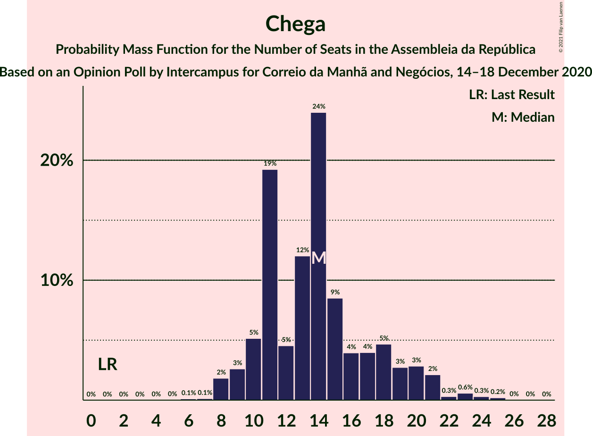
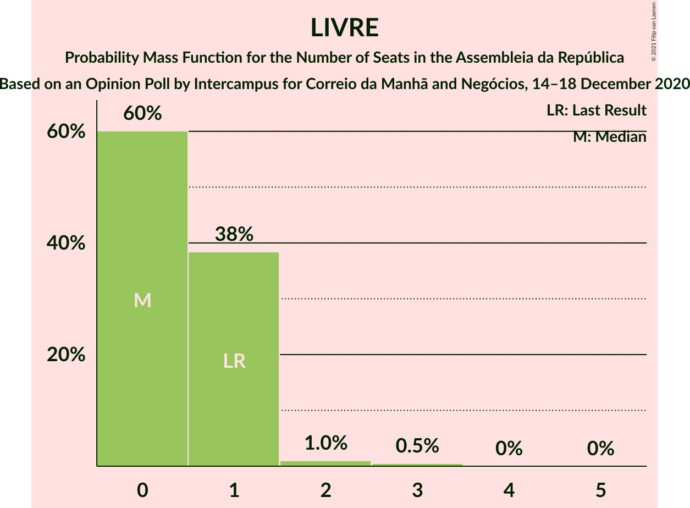
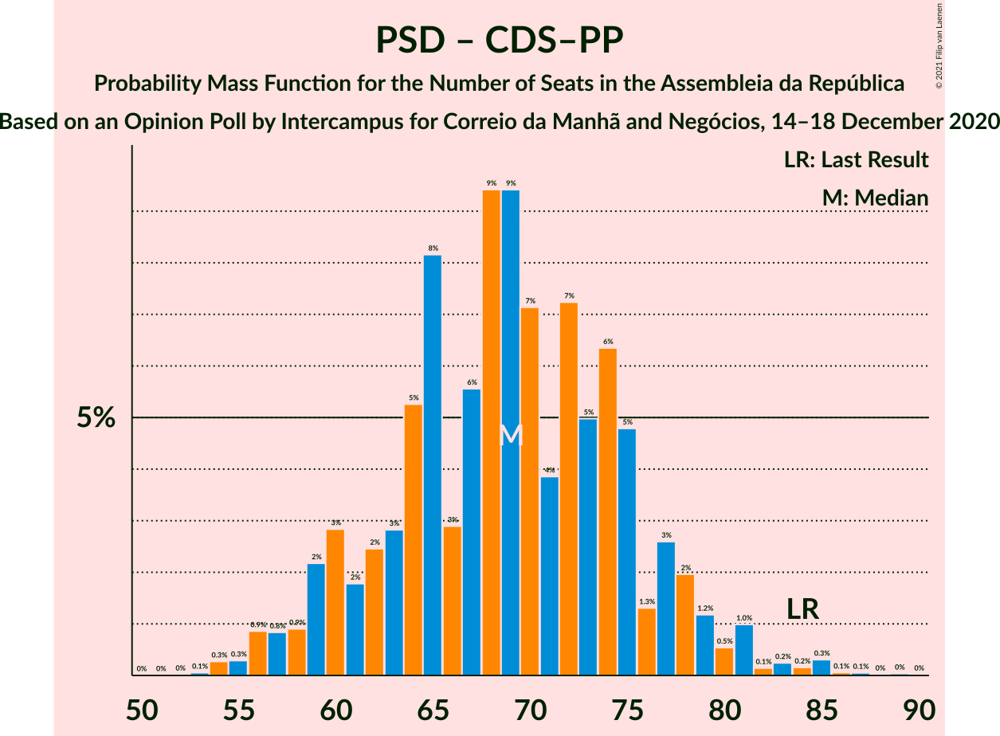

# Opinion Poll by Intercampus for Correio da Manhã and Negócios, 14–18 December 2020

<a href="#voting-intentions">Voting Intentions</a> | <a href="#seats">Seats</a> | <a href="#coalitions">Coalitions</a> | <a href="#technical-information">Technical Information</a>

## Voting Intentions

### Confidence Intervals

| Party | Last Result | Poll Result | 80% Confidence Interval | 90% Confidence Interval | 95% Confidence Interval | 99% Confidence Interval |
|:-----:|:-----------:|:-----------:|:-----------------------:|:-----------------------:|:-----------------------:|:-----------------------:|
| Partido Socialista | 36.4% | 38.0% | 35.5–40.6% |34.8–41.3% |34.2–41.9% |33.0–43.2% |
| Partido Social Democrata | 27.8% | 23.5% | 21.4–25.9% |20.8–26.5% |20.3–27.1% |19.4–28.2% |
| Chega | 1.3% | 7.6% | 6.4–9.2% |6.1–9.6% |5.8–10.0% |5.2–10.8% |
| Bloco de Esquerda | 9.5% | 7.3% | 6.1–8.8% |5.8–9.3% |5.5–9.7% |5.0–10.5% |
| Coligação Democrática Unitária | 6.3% | 5.5% | 4.5–6.9% |4.2–7.2% |3.9–7.6% |3.5–8.3% |
| Iniciativa Liberal | 1.3% | 4.5% | 3.6–5.8% |3.3–6.1% |3.1–6.4% |2.7–7.1% |
| Pessoas–Animais–Natureza | 3.3% | 3.5% | 2.7–4.6% |2.5–5.0% |2.3–5.3% |2.0–5.9% |
| CDS–Partido Popular | 4.2% | 3.2% | 2.4–4.3% |2.2–4.6% |2.0–4.9% |1.7–5.5% |
| LIVRE | 1.1% | 0.8% | 0.5–1.5% |0.4–1.7% |0.4–1.9% |0.2–2.3% |

*Note:* The poll result column reflects the actual value used in the calculations. Published results may vary slightly, and in addition be rounded to fewer digits.

## Seats

### Confidence Intervals

| Party | Last Result | Median | 80% Confidence Interval | 90% Confidence Interval | 95% Confidence Interval | 99% Confidence Interval |
|:-----:|:-----------:|:------:|:-----------------------:|:-----------------------:|:-----------------------:|:-----------------------:|
| <a href="#partido-socialista">Partido Socialista</a> | 108 | 115 | 106–121 |104–123 |102–125 |96–131 |
| <a href="#partido-social-democrata">Partido Social Democrata</a> | 79 | 66 | 58–71 |56–74 |54–77 |52–81 |
| <a href="#chega">Chega</a> | 1 | 11 | 11–17 |10–19 |9–21 |8–24 |
| <a href="#bloco-de-esquerda">Bloco de Esquerda</a> | 19 | 14 | 11–18 |8–19 |8–20 |7–23 |
| <a href="#coligação-democrática-unitária">Coligação Democrática Unitária</a> | 12 | 8 | 6–13 |5–14 |5–15 |4–16 |
| <a href="#iniciativa-liberal">Iniciativa Liberal</a> | 1 | 5 | 4–9 |4–10 |3–11 |3–12 |
| <a href="#pessoas–animais–natureza">Pessoas–Animais–Natureza</a> | 4 | 4 | 2–6 |2–7 |2–10 |1–10 |
| <a href="#cds–partido-popular">CDS–Partido Popular</a> | 5 | 2 | 2–5 |1–5 |1–5 |0–8 |
| <a href="#livre">LIVRE</a> | 1 | 1 | 0–1 |0–1 |0–1 |0–3 |

### Partido Socialista

*For a full overview of the results for this party, see the [Partido Socialista](party-partidosocialista.html) page.*

| Number of Seats | Probability | Accumulated | Special Marks |
|:---------------:|:-----------:|:-----------:|:-------------:|
| 95 | 0.1% | 100% |  |
| 96 | 0.4% | 99.8% |  |
| 97 | 0.1% | 99.5% |  |
| 98 | 0.1% | 99.4% |  |
| 99 | 0% | 99.3% |  |
| 100 | 0.8% | 99.3% |  |
| 101 | 0.2% | 98% |  |
| 102 | 2% | 98% |  |
| 103 | 0.9% | 96% |  |
| 104 | 2% | 96% |  |
| 105 | 1.4% | 94% |  |
| 106 | 3% | 93% |  |
| 107 | 1.0% | 90% |  |
| 108 | 7% | 89% | Last Result |
| 109 | 5% | 82% |  |
| 110 | 2% | 77% |  |
| 111 | 1.3% | 75% |  |
| 112 | 0.4% | 73% |  |
| 113 | 3% | 73% |  |
| 114 | 2% | 70% |  |
| 115 | 35% | 68% | Median |
| 116 | 5% | 33% | Majority |
| 117 | 2% | 29% |  |
| 118 | 5% | 27% |  |
| 119 | 4% | 22% |  |
| 120 | 0.5% | 18% |  |
| 121 | 8% | 17% |  |
| 122 | 2% | 9% |  |
| 123 | 2% | 7% |  |
| 124 | 2% | 5% |  |
| 125 | 0.2% | 3% |  |
| 126 | 0.6% | 2% |  |
| 127 | 0.1% | 2% |  |
| 128 | 0.2% | 2% |  |
| 129 | 0.1% | 1.5% |  |
| 130 | 0.1% | 1.4% |  |
| 131 | 1.2% | 1.3% |  |
| 132 | 0% | 0.1% |  |
| 133 | 0% | 0% |  |

### Partido Social Democrata

*For a full overview of the results for this party, see the [Partido Social Democrata](party-partidosocialdemocrata.html) page.*

| Number of Seats | Probability | Accumulated | Special Marks |
|:---------------:|:-----------:|:-----------:|:-------------:|
| 51 | 0.1% | 100% |  |
| 52 | 0.6% | 99.9% |  |
| 53 | 0.8% | 99.3% |  |
| 54 | 2% | 98% |  |
| 55 | 0.4% | 97% |  |
| 56 | 2% | 96% |  |
| 57 | 4% | 95% |  |
| 58 | 3% | 91% |  |
| 59 | 2% | 88% |  |
| 60 | 0.9% | 86% |  |
| 61 | 3% | 85% |  |
| 62 | 18% | 82% |  |
| 63 | 2% | 64% |  |
| 64 | 5% | 63% |  |
| 65 | 4% | 58% |  |
| 66 | 8% | 54% | Median |
| 67 | 9% | 46% |  |
| 68 | 3% | 37% |  |
| 69 | 0.7% | 34% |  |
| 70 | 5% | 33% |  |
| 71 | 20% | 28% |  |
| 72 | 2% | 8% |  |
| 73 | 1.2% | 6% |  |
| 74 | 0.3% | 5% |  |
| 75 | 0.5% | 5% |  |
| 76 | 0.4% | 4% |  |
| 77 | 2% | 4% |  |
| 78 | 1.4% | 2% |  |
| 79 | 0.1% | 0.8% | Last Result |
| 80 | 0.1% | 0.7% |  |
| 81 | 0.4% | 0.6% |  |
| 82 | 0% | 0.2% |  |
| 83 | 0.1% | 0.2% |  |
| 84 | 0% | 0.1% |  |
| 85 | 0% | 0% |  |

### Chega

*For a full overview of the results for this party, see the [Chega](party-chega.html) page.*

| Number of Seats | Probability | Accumulated | Special Marks |
|:---------------:|:-----------:|:-----------:|:-------------:|
| 1 | 0% | 100% | Last Result |
| 2 | 0% | 100% |  |
| 3 | 0% | 100% |  |
| 4 | 0% | 100% |  |
| 5 | 0.1% | 100% |  |
| 6 | 0% | 99.9% |  |
| 7 | 0.1% | 99.9% |  |
| 8 | 2% | 99.8% |  |
| 9 | 0.7% | 98% |  |
| 10 | 4% | 97% |  |
| 11 | 50% | 93% | Median |
| 12 | 8% | 43% |  |
| 13 | 10% | 36% |  |
| 14 | 10% | 26% |  |
| 15 | 3% | 16% |  |
| 16 | 0.6% | 13% |  |
| 17 | 4% | 12% |  |
| 18 | 2% | 9% |  |
| 19 | 3% | 7% |  |
| 20 | 0.8% | 4% |  |
| 21 | 2% | 3% |  |
| 22 | 0.3% | 1.4% |  |
| 23 | 0.5% | 1.2% |  |
| 24 | 0.3% | 0.6% |  |
| 25 | 0.3% | 0.3% |  |
| 26 | 0% | 0.1% |  |
| 27 | 0% | 0% |  |

### Bloco de Esquerda

*For a full overview of the results for this party, see the [Bloco de Esquerda](party-blocodeesquerda.html) page.*

| Number of Seats | Probability | Accumulated | Special Marks |
|:---------------:|:-----------:|:-----------:|:-------------:|
| 7 | 2% | 100% |  |
| 8 | 5% | 98% |  |
| 9 | 0.7% | 93% |  |
| 10 | 2% | 93% |  |
| 11 | 5% | 91% |  |
| 12 | 4% | 86% |  |
| 13 | 23% | 82% |  |
| 14 | 22% | 59% | Median |
| 15 | 5% | 37% |  |
| 16 | 6% | 32% |  |
| 17 | 4% | 26% |  |
| 18 | 16% | 22% |  |
| 19 | 2% | 6% | Last Result |
| 20 | 2% | 4% |  |
| 21 | 1.2% | 2% |  |
| 22 | 0.4% | 1.1% |  |
| 23 | 0.5% | 0.6% |  |
| 24 | 0% | 0.1% |  |
| 25 | 0% | 0.1% |  |
| 26 | 0% | 0.1% |  |
| 27 | 0% | 0.1% |  |
| 28 | 0% | 0% |  |

### Coligação Democrática Unitária

*For a full overview of the results for this party, see the [Coligação Democrática Unitária](party-coligaçãodemocráticaunitária.html) page.*

| Number of Seats | Probability | Accumulated | Special Marks |
|:---------------:|:-----------:|:-----------:|:-------------:|
| 3 | 0.1% | 100% |  |
| 4 | 1.0% | 99.9% |  |
| 5 | 8% | 98.9% |  |
| 6 | 12% | 90% |  |
| 7 | 26% | 79% |  |
| 8 | 6% | 53% | Median |
| 9 | 4% | 47% |  |
| 10 | 10% | 42% |  |
| 11 | 19% | 32% |  |
| 12 | 2% | 13% | Last Result |
| 13 | 2% | 10% |  |
| 14 | 6% | 9% |  |
| 15 | 2% | 3% |  |
| 16 | 0.3% | 0.8% |  |
| 17 | 0.2% | 0.4% |  |
| 18 | 0.2% | 0.3% |  |
| 19 | 0% | 0.1% |  |
| 20 | 0% | 0% |  |

### Iniciativa Liberal

*For a full overview of the results for this party, see the [Iniciativa Liberal](party-iniciativaliberal.html) page.*

| Number of Seats | Probability | Accumulated | Special Marks |
|:---------------:|:-----------:|:-----------:|:-------------:|
| 1 | 0% | 100% | Last Result |
| 2 | 0% | 100% |  |
| 3 | 3% | 100% |  |
| 4 | 14% | 97% |  |
| 5 | 33% | 83% | Median |
| 6 | 13% | 50% |  |
| 7 | 6% | 36% |  |
| 8 | 5% | 30% |  |
| 9 | 20% | 25% |  |
| 10 | 2% | 5% |  |
| 11 | 1.0% | 3% |  |
| 12 | 2% | 2% |  |
| 13 | 0.2% | 0.4% |  |
| 14 | 0.2% | 0.2% |  |
| 15 | 0% | 0% |  |

### Pessoas–Animais–Natureza

*For a full overview of the results for this party, see the [Pessoas–Animais–Natureza](party-pessoas–animais–natureza.html) page.*

| Number of Seats | Probability | Accumulated | Special Marks |
|:---------------:|:-----------:|:-----------:|:-------------:|
| 1 | 1.0% | 100% |  |
| 2 | 12% | 99.0% |  |
| 3 | 4% | 87% |  |
| 4 | 44% | 83% | Last Result, Median |
| 5 | 23% | 39% |  |
| 6 | 11% | 17% |  |
| 7 | 1.0% | 5% |  |
| 8 | 0.7% | 4% |  |
| 9 | 1.1% | 4% |  |
| 10 | 2% | 3% |  |
| 11 | 0.4% | 0.4% |  |
| 12 | 0% | 0% |  |

### CDS–Partido Popular

*For a full overview of the results for this party, see the [CDS–Partido Popular](party-cds–partidopopular.html) page.*

| Number of Seats | Probability | Accumulated | Special Marks |
|:---------------:|:-----------:|:-----------:|:-------------:|
| 0 | 2% | 100% |  |
| 1 | 6% | 98% |  |
| 2 | 45% | 91% | Median |
| 3 | 27% | 47% |  |
| 4 | 2% | 20% |  |
| 5 | 17% | 18% | Last Result |
| 6 | 0.2% | 1.1% |  |
| 7 | 0.3% | 1.0% |  |
| 8 | 0.4% | 0.7% |  |
| 9 | 0.2% | 0.2% |  |
| 10 | 0% | 0% |  |

### LIVRE

*For a full overview of the results for this party, see the [LIVRE](party-livre.html) page.*

| Number of Seats | Probability | Accumulated | Special Marks |
|:---------------:|:-----------:|:-----------:|:-------------:|
| 0 | 39% | 100% |  |
| 1 | 59% | 61% | Last Result, Median |
| 2 | 0.9% | 1.5% |  |
| 3 | 0.6% | 0.6% |  |
| 4 | 0% | 0% |  |

## Coalitions

### Confidence Intervals

| Coalition | Last Result | Median | Majority? | 80% Confidence Interval | 90% Confidence Interval | 95% Confidence Interval | 99% Confidence Interval |
|:---------:|:-----------:|:------:|:---------:|:-----------------------:|:-----------------------:|:-----------------------:|:-----------------------:|
| Partido Socialista – Bloco de Esquerda – Coligação Democrática Unitária | 139 | 137 | 99.9% | 130–145 | 127–146 | 124–148 | 121–151 |
| Partido Socialista – Bloco de Esquerda | 127 | 129 | 97% | 121–136 | 117–139 | 115–140 | 112–143 |
| Partido Socialista – Coligação Democrática Unitária | 120 | 122 | 92% | 116–130 | 113–133 | 110–134 | 107–137 |
| Partido Socialista | 108 | 115 | 33% | 106–121 | 104–123 | 102–125 | 96–131 |
| Partido Social Democrata – CDS–Partido Popular | 84 | 69 | 0% | 62–74 | 58–77 | 57–80 | 54–84 |

### Partido Socialista – Bloco de Esquerda – Coligação Democrática Unitária

| Number of Seats | Probability | Accumulated | Special Marks |
|:---------------:|:-----------:|:-----------:|:-------------:|
| 115 | 0% | 100% |  |
| 116 | 0.1% | 99.9% | Majority |
| 117 | 0% | 99.8% |  |
| 118 | 0.1% | 99.8% |  |
| 119 | 0.1% | 99.7% |  |
| 120 | 0.1% | 99.7% |  |
| 121 | 1.0% | 99.6% |  |
| 122 | 0.4% | 98.5% |  |
| 123 | 0.4% | 98% |  |
| 124 | 0.8% | 98% |  |
| 125 | 1.2% | 97% |  |
| 126 | 0.2% | 96% |  |
| 127 | 0.7% | 95% |  |
| 128 | 1.2% | 95% |  |
| 129 | 2% | 94% |  |
| 130 | 3% | 92% |  |
| 131 | 2% | 89% |  |
| 132 | 2% | 87% |  |
| 133 | 2% | 85% |  |
| 134 | 2% | 83% |  |
| 135 | 19% | 81% |  |
| 136 | 7% | 62% |  |
| 137 | 5% | 55% | Median |
| 138 | 3% | 50% |  |
| 139 | 5% | 47% | Last Result |
| 140 | 15% | 43% |  |
| 141 | 6% | 28% |  |
| 142 | 5% | 22% |  |
| 143 | 2% | 18% |  |
| 144 | 3% | 16% |  |
| 145 | 6% | 13% |  |
| 146 | 2% | 7% |  |
| 147 | 0.8% | 5% |  |
| 148 | 2% | 4% |  |
| 149 | 1.3% | 2% |  |
| 150 | 0.1% | 0.7% |  |
| 151 | 0.2% | 0.6% |  |
| 152 | 0.3% | 0.4% |  |
| 153 | 0% | 0.1% |  |
| 154 | 0% | 0.1% |  |
| 155 | 0.1% | 0.1% |  |
| 156 | 0% | 0% |  |

### Partido Socialista – Bloco de Esquerda

| Number of Seats | Probability | Accumulated | Special Marks |
|:---------------:|:-----------:|:-----------:|:-------------:|
| 107 | 0.1% | 100% |  |
| 108 | 0% | 99.9% |  |
| 109 | 0.1% | 99.8% |  |
| 110 | 0.1% | 99.7% |  |
| 111 | 0.1% | 99.7% |  |
| 112 | 0.1% | 99.6% |  |
| 113 | 1.1% | 99.5% |  |
| 114 | 0.6% | 98% |  |
| 115 | 0.8% | 98% |  |
| 116 | 1.2% | 97% | Majority |
| 117 | 2% | 96% |  |
| 118 | 1.2% | 94% |  |
| 119 | 1.2% | 93% |  |
| 120 | 1.3% | 92% |  |
| 121 | 0.5% | 91% |  |
| 122 | 3% | 90% |  |
| 123 | 3% | 87% |  |
| 124 | 3% | 84% |  |
| 125 | 2% | 82% |  |
| 126 | 6% | 80% |  |
| 127 | 3% | 74% | Last Result |
| 128 | 19% | 71% |  |
| 129 | 18% | 52% | Median |
| 130 | 1.4% | 34% |  |
| 131 | 3% | 33% |  |
| 132 | 6% | 30% |  |
| 133 | 2% | 23% |  |
| 134 | 6% | 21% |  |
| 135 | 2% | 16% |  |
| 136 | 5% | 14% |  |
| 137 | 0.7% | 9% |  |
| 138 | 0.7% | 8% |  |
| 139 | 5% | 8% |  |
| 140 | 0.5% | 3% |  |
| 141 | 0.6% | 2% |  |
| 142 | 0.1% | 1.5% |  |
| 143 | 1.1% | 1.4% |  |
| 144 | 0.1% | 0.3% |  |
| 145 | 0% | 0.1% |  |
| 146 | 0% | 0.1% |  |
| 147 | 0% | 0.1% |  |
| 148 | 0.1% | 0.1% |  |
| 149 | 0% | 0% |  |

### Partido Socialista – Coligação Democrática Unitária

| Number of Seats | Probability | Accumulated | Special Marks |
|:---------------:|:-----------:|:-----------:|:-------------:|
| 102 | 0.1% | 100% |  |
| 103 | 0% | 99.9% |  |
| 104 | 0% | 99.8% |  |
| 105 | 0.1% | 99.8% |  |
| 106 | 0% | 99.7% |  |
| 107 | 0.5% | 99.6% |  |
| 108 | 0.5% | 99.2% |  |
| 109 | 0.2% | 98.7% |  |
| 110 | 1.4% | 98% |  |
| 111 | 0.5% | 97% |  |
| 112 | 0.6% | 97% |  |
| 113 | 3% | 96% |  |
| 114 | 0.5% | 93% |  |
| 115 | 0.5% | 93% |  |
| 116 | 5% | 92% | Majority |
| 117 | 0.9% | 87% |  |
| 118 | 5% | 86% |  |
| 119 | 3% | 81% |  |
| 120 | 0.8% | 78% | Last Result |
| 121 | 6% | 77% |  |
| 122 | 24% | 72% |  |
| 123 | 2% | 48% | Median |
| 124 | 6% | 45% |  |
| 125 | 0.2% | 40% |  |
| 126 | 16% | 39% |  |
| 127 | 4% | 24% |  |
| 128 | 0.4% | 20% |  |
| 129 | 4% | 19% |  |
| 130 | 6% | 15% |  |
| 131 | 2% | 9% |  |
| 132 | 0.3% | 7% |  |
| 133 | 3% | 6% |  |
| 134 | 1.1% | 4% |  |
| 135 | 0.3% | 2% |  |
| 136 | 0.5% | 2% |  |
| 137 | 1.3% | 2% |  |
| 138 | 0.1% | 0.4% |  |
| 139 | 0.2% | 0.3% |  |
| 140 | 0.1% | 0.2% |  |
| 141 | 0% | 0.1% |  |
| 142 | 0% | 0% |  |

### Partido Socialista

| Number of Seats | Probability | Accumulated | Special Marks |
|:---------------:|:-----------:|:-----------:|:-------------:|
| 95 | 0.1% | 100% |  |
| 96 | 0.4% | 99.8% |  |
| 97 | 0.1% | 99.5% |  |
| 98 | 0.1% | 99.4% |  |
| 99 | 0% | 99.3% |  |
| 100 | 0.8% | 99.3% |  |
| 101 | 0.2% | 98% |  |
| 102 | 2% | 98% |  |
| 103 | 0.9% | 96% |  |
| 104 | 2% | 96% |  |
| 105 | 1.4% | 94% |  |
| 106 | 3% | 93% |  |
| 107 | 1.0% | 90% |  |
| 108 | 7% | 89% | Last Result |
| 109 | 5% | 82% |  |
| 110 | 2% | 77% |  |
| 111 | 1.3% | 75% |  |
| 112 | 0.4% | 73% |  |
| 113 | 3% | 73% |  |
| 114 | 2% | 70% |  |
| 115 | 35% | 68% | Median |
| 116 | 5% | 33% | Majority |
| 117 | 2% | 29% |  |
| 118 | 5% | 27% |  |
| 119 | 4% | 22% |  |
| 120 | 0.5% | 18% |  |
| 121 | 8% | 17% |  |
| 122 | 2% | 9% |  |
| 123 | 2% | 7% |  |
| 124 | 2% | 5% |  |
| 125 | 0.2% | 3% |  |
| 126 | 0.6% | 2% |  |
| 127 | 0.1% | 2% |  |
| 128 | 0.2% | 2% |  |
| 129 | 0.1% | 1.5% |  |
| 130 | 0.1% | 1.4% |  |
| 131 | 1.2% | 1.3% |  |
| 132 | 0% | 0.1% |  |
| 133 | 0% | 0% |  |

### Partido Social Democrata – CDS–Partido Popular

| Number of Seats | Probability | Accumulated | Special Marks |
|:---------------:|:-----------:|:-----------:|:-------------:|
| 52 | 0.1% | 100% |  |
| 53 | 0% | 99.9% |  |
| 54 | 0.6% | 99.9% |  |
| 55 | 0.4% | 99.3% |  |
| 56 | 1.2% | 98.9% |  |
| 57 | 0.5% | 98% |  |
| 58 | 2% | 97% |  |
| 59 | 0.4% | 95% |  |
| 60 | 1.0% | 94% |  |
| 61 | 0.6% | 93% |  |
| 62 | 3% | 93% |  |
| 63 | 6% | 90% |  |
| 64 | 20% | 84% |  |
| 65 | 0.6% | 64% |  |
| 66 | 3% | 64% |  |
| 67 | 5% | 61% |  |
| 68 | 2% | 56% | Median |
| 69 | 11% | 54% |  |
| 70 | 4% | 43% |  |
| 71 | 1.5% | 38% |  |
| 72 | 9% | 37% |  |
| 73 | 2% | 28% |  |
| 74 | 19% | 26% |  |
| 75 | 0.9% | 7% |  |
| 76 | 0.9% | 6% |  |
| 77 | 0.8% | 5% |  |
| 78 | 0.2% | 4% |  |
| 79 | 2% | 4% |  |
| 80 | 1.5% | 3% |  |
| 81 | 0.2% | 1.0% |  |
| 82 | 0.1% | 0.8% |  |
| 83 | 0% | 0.7% |  |
| 84 | 0.4% | 0.6% | Last Result |
| 85 | 0.1% | 0.3% |  |
| 86 | 0.1% | 0.1% |  |
| 87 | 0% | 0.1% |  |
| 88 | 0% | 0.1% |  |
| 89 | 0% | 0% |  |

## Technical Information

### Opinion Poll

+ **Polling firm:** Intercampus
+ **Commissioner(s):** Correio da Manhã and Negócios
+ **Fieldwork period:** 14–18 December 2020

### Calculations

+ **Sample size:** 603
+ **Simulations done:** 131,072
+ **Error estimate:** 2.64%

