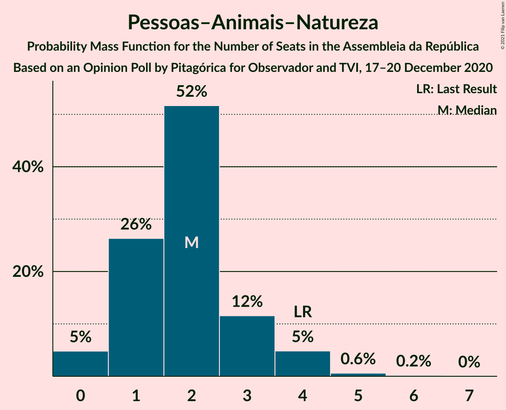
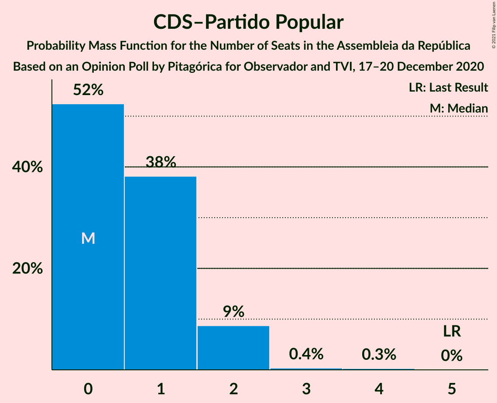
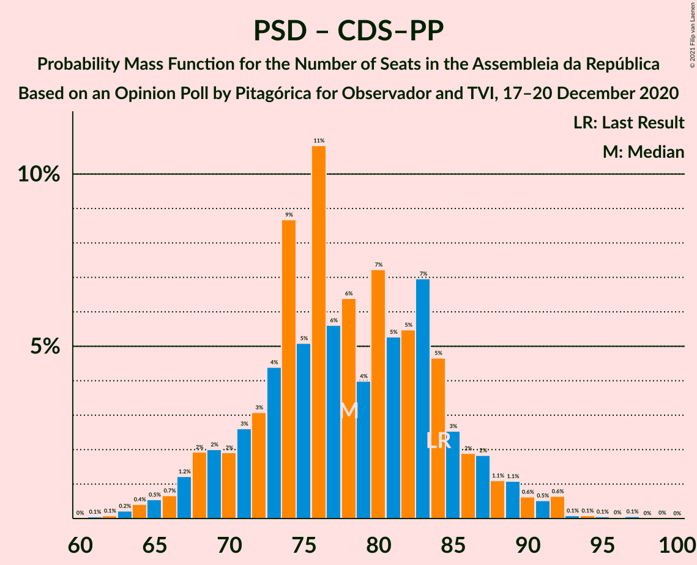

# Opinion Poll by Pitagórica for Observador and TVI, 17–20 December 2020

<a href="#voting-intentions">Voting Intentions</a> | <a href="#seats">Seats</a> | <a href="#coalitions">Coalitions</a> | <a href="#technical-information">Technical Information</a>

## Voting Intentions

### Confidence Intervals

| Party | Last Result | Poll Result | 80% Confidence Interval | 90% Confidence Interval | 95% Confidence Interval | 99% Confidence Interval |
|:-----:|:-----------:|:-----------:|:-----------------------:|:-----------------------:|:-----------------------:|:-----------------------:|
| Partido Socialista | 36.4% | 40.4% | 37.9–42.9% |37.2–43.7% |36.6–44.3% |35.4–45.5% |
| Partido Social Democrata | 27.8% | 28.5% | 26.2–30.8% |25.6–31.5% |25.1–32.1% |24.0–33.3% |
| Chega | 1.3% | 8.4% | 7.1–10.0% |6.8–10.5% |6.5–10.9% |5.9–11.7% |
| Bloco de Esquerda | 9.5% | 5.6% | 4.5–6.9% |4.3–7.3% |4.0–7.7% |3.6–8.4% |
| Coligação Democrática Unitária | 6.3% | 5.2% | 4.3–6.6% |4.0–7.0% |3.8–7.3% |3.3–8.0% |
| Iniciativa Liberal | 1.3% | 2.4% | 1.8–3.4% |1.6–3.6% |1.4–3.9% |1.2–4.4% |
| Pessoas–Animais–Natureza | 3.3% | 2.2% | 1.6–3.2% |1.5–3.5% |1.3–3.7% |1.1–4.2% |
| CDS–Partido Popular | 4.2% | 1.7% | 1.2–2.6% |1.1–2.9% |1.0–3.1% |0.8–3.6% |

*Note:* The poll result column reflects the actual value used in the calculations. Published results may vary slightly, and in addition be rounded to fewer digits.

## Seats

### Confidence Intervals

| Party | Last Result | Median | 80% Confidence Interval | 90% Confidence Interval | 95% Confidence Interval | 99% Confidence Interval |
|:-----:|:-----------:|:------:|:-----------------------:|:-----------------------:|:-----------------------:|:-----------------------:|
| <a href="#partido-socialista">Partido Socialista</a> | 108 | 116 | 107–123 |105–124 |103–126 |100–128 |
| <a href="#partido-social-democrata">Partido Social Democrata</a> | 79 | 76 | 71–85 |68–86 |68–88 |65–91 |
| <a href="#chega">Chega</a> | 1 | 14 | 11–19 |11–20 |11–22 |9–25 |
| <a href="#bloco-de-esquerda">Bloco de Esquerda</a> | 19 | 7 | 7–12 |7–14 |4–14 |3–16 |
| <a href="#coligação-democrática-unitária">Coligação Democrática Unitária</a> | 12 | 8 | 5–13 |5–13 |5–14 |4–15 |
| <a href="#iniciativa-liberal">Iniciativa Liberal</a> | 1 | 3 | 2–4 |1–5 |1–5 |1–6 |
| <a href="#pessoas–animais–natureza">Pessoas–Animais–Natureza</a> | 4 | 2 | 1–3 |0–4 |0–4 |0–5 |
| <a href="#cds–partido-popular">CDS–Partido Popular</a> | 5 | 0 | 0–2 |0–2 |0–2 |0–3 |

### Partido Socialista

*For a full overview of the results for this party, see the [Partido Socialista](party-partidosocialista.html) page.*

| Number of Seats | Probability | Accumulated | Special Marks |
|:---------------:|:-----------:|:-----------:|:-------------:|
| 94 | 0% | 100% |  |
| 95 | 0% | 99.9% |  |
| 96 | 0% | 99.9% |  |
| 97 | 0% | 99.9% |  |
| 98 | 0.1% | 99.8% |  |
| 99 | 0.1% | 99.7% |  |
| 100 | 0.2% | 99.6% |  |
| 101 | 0.5% | 99.4% |  |
| 102 | 0.3% | 99.0% |  |
| 103 | 3% | 98.6% |  |
| 104 | 0.3% | 96% |  |
| 105 | 1.4% | 96% |  |
| 106 | 3% | 94% |  |
| 107 | 1.2% | 91% |  |
| 108 | 5% | 90% | Last Result |
| 109 | 11% | 85% |  |
| 110 | 4% | 74% |  |
| 111 | 2% | 70% |  |
| 112 | 5% | 68% |  |
| 113 | 5% | 64% |  |
| 114 | 2% | 59% |  |
| 115 | 6% | 57% |  |
| 116 | 2% | 51% | Median, Majority |
| 117 | 6% | 50% |  |
| 118 | 7% | 44% |  |
| 119 | 13% | 37% |  |
| 120 | 5% | 24% |  |
| 121 | 2% | 18% |  |
| 122 | 5% | 16% |  |
| 123 | 6% | 11% |  |
| 124 | 0.7% | 6% |  |
| 125 | 0.8% | 5% |  |
| 126 | 3% | 4% |  |
| 127 | 0.3% | 1.2% |  |
| 128 | 0.5% | 0.9% |  |
| 129 | 0.2% | 0.4% |  |
| 130 | 0% | 0.2% |  |
| 131 | 0% | 0.2% |  |
| 132 | 0.1% | 0.1% |  |
| 133 | 0.1% | 0.1% |  |
| 134 | 0% | 0% |  |

### Partido Social Democrata

*For a full overview of the results for this party, see the [Partido Social Democrata](party-partidosocialdemocrata.html) page.*

| Number of Seats | Probability | Accumulated | Special Marks |
|:---------------:|:-----------:|:-----------:|:-------------:|
| 61 | 0% | 100% |  |
| 62 | 0.1% | 99.9% |  |
| 63 | 0.2% | 99.8% |  |
| 64 | 0.1% | 99.6% |  |
| 65 | 0.6% | 99.6% |  |
| 66 | 0.8% | 99.0% |  |
| 67 | 0.6% | 98% |  |
| 68 | 5% | 98% |  |
| 69 | 1.1% | 92% |  |
| 70 | 0.3% | 91% |  |
| 71 | 3% | 91% |  |
| 72 | 10% | 87% |  |
| 73 | 2% | 77% |  |
| 74 | 16% | 75% |  |
| 75 | 6% | 59% |  |
| 76 | 4% | 53% | Median |
| 77 | 2% | 49% |  |
| 78 | 4% | 47% |  |
| 79 | 4% | 43% | Last Result |
| 80 | 12% | 38% |  |
| 81 | 2% | 26% |  |
| 82 | 7% | 24% |  |
| 83 | 1.0% | 17% |  |
| 84 | 6% | 16% |  |
| 85 | 4% | 10% |  |
| 86 | 2% | 7% |  |
| 87 | 0.8% | 5% |  |
| 88 | 2% | 4% |  |
| 89 | 0.4% | 2% |  |
| 90 | 0.9% | 2% |  |
| 91 | 0.5% | 0.7% |  |
| 92 | 0% | 0.2% |  |
| 93 | 0.1% | 0.2% |  |
| 94 | 0% | 0.2% |  |
| 95 | 0% | 0.1% |  |
| 96 | 0% | 0.1% |  |
| 97 | 0% | 0.1% |  |
| 98 | 0% | 0% |  |

### Chega

*For a full overview of the results for this party, see the [Chega](party-chega.html) page.*

| Number of Seats | Probability | Accumulated | Special Marks |
|:---------------:|:-----------:|:-----------:|:-------------:|
| 1 | 0% | 100% | Last Result |
| 2 | 0% | 100% |  |
| 3 | 0% | 100% |  |
| 4 | 0% | 100% |  |
| 5 | 0% | 100% |  |
| 6 | 0% | 100% |  |
| 7 | 0% | 100% |  |
| 8 | 0.3% | 100% |  |
| 9 | 0.5% | 99.6% |  |
| 10 | 0.6% | 99.1% |  |
| 11 | 19% | 98.6% |  |
| 12 | 7% | 79% |  |
| 13 | 15% | 72% |  |
| 14 | 16% | 57% | Median |
| 15 | 4% | 41% |  |
| 16 | 11% | 37% |  |
| 17 | 9% | 26% |  |
| 18 | 7% | 17% |  |
| 19 | 6% | 11% |  |
| 20 | 0.4% | 5% |  |
| 21 | 0.5% | 5% |  |
| 22 | 2% | 4% |  |
| 23 | 1.1% | 2% |  |
| 24 | 0.2% | 1.2% |  |
| 25 | 0.7% | 1.0% |  |
| 26 | 0.2% | 0.3% |  |
| 27 | 0% | 0.1% |  |
| 28 | 0.1% | 0.1% |  |
| 29 | 0% | 0% |  |

### Bloco de Esquerda

*For a full overview of the results for this party, see the [Bloco de Esquerda](party-blocodeesquerda.html) page.*

| Number of Seats | Probability | Accumulated | Special Marks |
|:---------------:|:-----------:|:-----------:|:-------------:|
| 2 | 0.3% | 100% |  |
| 3 | 2% | 99.7% |  |
| 4 | 0.7% | 98% |  |
| 5 | 1.4% | 97% |  |
| 6 | 0.2% | 96% |  |
| 7 | 52% | 96% | Median |
| 8 | 8% | 44% |  |
| 9 | 6% | 35% |  |
| 10 | 9% | 30% |  |
| 11 | 10% | 21% |  |
| 12 | 3% | 10% |  |
| 13 | 2% | 8% |  |
| 14 | 3% | 6% |  |
| 15 | 2% | 2% |  |
| 16 | 0.7% | 1.0% |  |
| 17 | 0.2% | 0.3% |  |
| 18 | 0.1% | 0.1% |  |
| 19 | 0% | 0% | Last Result |

### Coligação Democrática Unitária

*For a full overview of the results for this party, see the [Coligação Democrática Unitária](party-coligaçãodemocráticaunitária.html) page.*

| Number of Seats | Probability | Accumulated | Special Marks |
|:---------------:|:-----------:|:-----------:|:-------------:|
| 3 | 0.2% | 100% |  |
| 4 | 1.3% | 99.8% |  |
| 5 | 12% | 98% |  |
| 6 | 14% | 86% |  |
| 7 | 18% | 72% |  |
| 8 | 10% | 54% | Median |
| 9 | 11% | 44% |  |
| 10 | 19% | 33% |  |
| 11 | 2% | 14% |  |
| 12 | 2% | 12% | Last Result |
| 13 | 5% | 10% |  |
| 14 | 4% | 5% |  |
| 15 | 0.6% | 1.1% |  |
| 16 | 0.2% | 0.5% |  |
| 17 | 0.2% | 0.3% |  |
| 18 | 0.1% | 0.1% |  |
| 19 | 0% | 0% |  |

### Iniciativa Liberal

*For a full overview of the results for this party, see the [Iniciativa Liberal](party-iniciativaliberal.html) page.*

| Number of Seats | Probability | Accumulated | Special Marks |
|:---------------:|:-----------:|:-----------:|:-------------:|
| 0 | 0.1% | 100% |  |
| 1 | 10% | 99.9% | Last Result |
| 2 | 9% | 90% |  |
| 3 | 57% | 81% | Median |
| 4 | 17% | 24% |  |
| 5 | 5% | 6% |  |
| 6 | 0.7% | 0.8% |  |
| 7 | 0% | 0% |  |

### Pessoas–Animais–Natureza

*For a full overview of the results for this party, see the [Pessoas–Animais–Natureza](party-pessoas–animais–natureza.html) page.*

| Number of Seats | Probability | Accumulated | Special Marks |
|:---------------:|:-----------:|:-----------:|:-------------:|
| 0 | 7% | 100% |  |
| 1 | 25% | 93% |  |
| 2 | 50% | 68% | Median |
| 3 | 11% | 18% |  |
| 4 | 6% | 7% | Last Result |
| 5 | 0.7% | 0.9% |  |
| 6 | 0.2% | 0.2% |  |
| 7 | 0% | 0% |  |

### CDS–Partido Popular

*For a full overview of the results for this party, see the [CDS–Partido Popular](party-cds–partidopopular.html) page.*

| Number of Seats | Probability | Accumulated | Special Marks |
|:---------------:|:-----------:|:-----------:|:-------------:|
| 0 | 56% | 100% | Median |
| 1 | 33% | 44% |  |
| 2 | 11% | 11% |  |
| 3 | 0.3% | 0.7% |  |
| 4 | 0.3% | 0.3% |  |
| 5 | 0% | 0% | Last Result |

## Coalitions

### Confidence Intervals

| Coalition | Last Result | Median | Majority? | 80% Confidence Interval | 90% Confidence Interval | 95% Confidence Interval | 99% Confidence Interval |
|:---------:|:-----------:|:------:|:---------:|:-----------------------:|:-----------------------:|:-----------------------:|:-----------------------:|
| Partido Socialista – Bloco de Esquerda – Coligação Democrática Unitária | 139 | 132 | 99.6% | 123–139 | 122–141 | 120–144 | 117–145 |
| Partido Socialista – Coligação Democrática Unitária | 120 | 125 | 85% | 114–131 | 113–133 | 111–136 | 108–136 |
| Partido Socialista – Bloco de Esquerda | 127 | 124 | 90% | 116–130 | 114–133 | 113–134 | 108–138 |
| Partido Socialista | 108 | 116 | 51% | 107–123 | 105–124 | 103–126 | 100–128 |
| Partido Social Democrata – CDS–Partido Popular | 84 | 78 | 0% | 72–85 | 68–87 | 68–88 | 65–91 |

### Partido Socialista – Bloco de Esquerda – Coligação Democrática Unitária

| Number of Seats | Probability | Accumulated | Special Marks |
|:---------------:|:-----------:|:-----------:|:-------------:|
| 111 | 0% | 100% |  |
| 112 | 0% | 99.9% |  |
| 113 | 0.1% | 99.9% |  |
| 114 | 0.1% | 99.9% |  |
| 115 | 0.2% | 99.7% |  |
| 116 | 0% | 99.6% | Majority |
| 117 | 0.4% | 99.5% |  |
| 118 | 0.2% | 99.1% |  |
| 119 | 0.7% | 98.9% |  |
| 120 | 1.5% | 98% |  |
| 121 | 0.8% | 97% |  |
| 122 | 5% | 96% |  |
| 123 | 2% | 91% |  |
| 124 | 2% | 89% |  |
| 125 | 5% | 87% |  |
| 126 | 2% | 82% |  |
| 127 | 3% | 79% |  |
| 128 | 8% | 76% |  |
| 129 | 5% | 68% |  |
| 130 | 6% | 63% |  |
| 131 | 3% | 58% | Median |
| 132 | 8% | 55% |  |
| 133 | 3% | 47% |  |
| 134 | 6% | 45% |  |
| 135 | 2% | 38% |  |
| 136 | 12% | 37% |  |
| 137 | 7% | 25% |  |
| 138 | 6% | 18% |  |
| 139 | 3% | 12% | Last Result |
| 140 | 4% | 9% |  |
| 141 | 1.1% | 6% |  |
| 142 | 0.8% | 4% |  |
| 143 | 0.8% | 4% |  |
| 144 | 2% | 3% |  |
| 145 | 0.4% | 0.8% |  |
| 146 | 0.1% | 0.4% |  |
| 147 | 0.1% | 0.3% |  |
| 148 | 0.1% | 0.2% |  |
| 149 | 0.1% | 0.1% |  |
| 150 | 0% | 0.1% |  |
| 151 | 0% | 0% |  |

### Partido Socialista – Coligação Democrática Unitária

| Number of Seats | Probability | Accumulated | Special Marks |
|:---------------:|:-----------:|:-----------:|:-------------:|
| 101 | 0% | 100% |  |
| 102 | 0% | 99.9% |  |
| 103 | 0% | 99.9% |  |
| 104 | 0% | 99.9% |  |
| 105 | 0% | 99.9% |  |
| 106 | 0.1% | 99.9% |  |
| 107 | 0.1% | 99.8% |  |
| 108 | 0.2% | 99.6% |  |
| 109 | 0.1% | 99.5% |  |
| 110 | 0.9% | 99.4% |  |
| 111 | 2% | 98% |  |
| 112 | 0.4% | 96% |  |
| 113 | 3% | 96% |  |
| 114 | 3% | 93% |  |
| 115 | 4% | 89% |  |
| 116 | 2% | 85% | Majority |
| 117 | 3% | 83% |  |
| 118 | 8% | 79% |  |
| 119 | 7% | 72% |  |
| 120 | 5% | 65% | Last Result |
| 121 | 3% | 60% |  |
| 122 | 2% | 57% |  |
| 123 | 1.2% | 54% |  |
| 124 | 3% | 53% | Median |
| 125 | 6% | 50% |  |
| 126 | 1.3% | 45% |  |
| 127 | 10% | 43% |  |
| 128 | 1.5% | 33% |  |
| 129 | 12% | 32% |  |
| 130 | 6% | 20% |  |
| 131 | 6% | 14% |  |
| 132 | 1.2% | 8% |  |
| 133 | 3% | 7% |  |
| 134 | 0.6% | 3% |  |
| 135 | 0.3% | 3% |  |
| 136 | 2% | 3% |  |
| 137 | 0.2% | 0.4% |  |
| 138 | 0% | 0.2% |  |
| 139 | 0% | 0.2% |  |
| 140 | 0% | 0.1% |  |
| 141 | 0% | 0.1% |  |
| 142 | 0% | 0.1% |  |
| 143 | 0% | 0% |  |

### Partido Socialista – Bloco de Esquerda

| Number of Seats | Probability | Accumulated | Special Marks |
|:---------------:|:-----------:|:-----------:|:-------------:|
| 103 | 0% | 100% |  |
| 104 | 0% | 99.9% |  |
| 105 | 0.1% | 99.9% |  |
| 106 | 0.1% | 99.8% |  |
| 107 | 0.1% | 99.7% |  |
| 108 | 0.3% | 99.6% |  |
| 109 | 0.2% | 99.2% |  |
| 110 | 0.4% | 99.0% |  |
| 111 | 0.2% | 98.6% |  |
| 112 | 0.6% | 98% |  |
| 113 | 2% | 98% |  |
| 114 | 4% | 96% |  |
| 115 | 2% | 92% |  |
| 116 | 5% | 90% | Majority |
| 117 | 4% | 86% |  |
| 118 | 2% | 82% |  |
| 119 | 6% | 80% |  |
| 120 | 5% | 74% |  |
| 121 | 5% | 69% |  |
| 122 | 4% | 65% |  |
| 123 | 5% | 61% | Median |
| 124 | 9% | 56% |  |
| 125 | 6% | 47% |  |
| 126 | 15% | 41% |  |
| 127 | 1.5% | 27% | Last Result |
| 128 | 2% | 25% |  |
| 129 | 6% | 23% |  |
| 130 | 9% | 17% |  |
| 131 | 1.2% | 8% |  |
| 132 | 1.2% | 6% |  |
| 133 | 1.3% | 5% |  |
| 134 | 2% | 4% |  |
| 135 | 0.2% | 2% |  |
| 136 | 0.2% | 1.5% |  |
| 137 | 0.5% | 1.3% |  |
| 138 | 0.4% | 0.7% |  |
| 139 | 0.1% | 0.3% |  |
| 140 | 0% | 0.2% |  |
| 141 | 0% | 0.2% |  |
| 142 | 0.1% | 0.1% |  |
| 143 | 0% | 0.1% |  |
| 144 | 0% | 0% |  |

### Partido Socialista

| Number of Seats | Probability | Accumulated | Special Marks |
|:---------------:|:-----------:|:-----------:|:-------------:|
| 94 | 0% | 100% |  |
| 95 | 0% | 99.9% |  |
| 96 | 0% | 99.9% |  |
| 97 | 0% | 99.9% |  |
| 98 | 0.1% | 99.8% |  |
| 99 | 0.1% | 99.7% |  |
| 100 | 0.2% | 99.6% |  |
| 101 | 0.5% | 99.4% |  |
| 102 | 0.3% | 99.0% |  |
| 103 | 3% | 98.6% |  |
| 104 | 0.3% | 96% |  |
| 105 | 1.4% | 96% |  |
| 106 | 3% | 94% |  |
| 107 | 1.2% | 91% |  |
| 108 | 5% | 90% | Last Result |
| 109 | 11% | 85% |  |
| 110 | 4% | 74% |  |
| 111 | 2% | 70% |  |
| 112 | 5% | 68% |  |
| 113 | 5% | 64% |  |
| 114 | 2% | 59% |  |
| 115 | 6% | 57% |  |
| 116 | 2% | 51% | Median, Majority |
| 117 | 6% | 50% |  |
| 118 | 7% | 44% |  |
| 119 | 13% | 37% |  |
| 120 | 5% | 24% |  |
| 121 | 2% | 18% |  |
| 122 | 5% | 16% |  |
| 123 | 6% | 11% |  |
| 124 | 0.7% | 6% |  |
| 125 | 0.8% | 5% |  |
| 126 | 3% | 4% |  |
| 127 | 0.3% | 1.2% |  |
| 128 | 0.5% | 0.9% |  |
| 129 | 0.2% | 0.4% |  |
| 130 | 0% | 0.2% |  |
| 131 | 0% | 0.2% |  |
| 132 | 0.1% | 0.1% |  |
| 133 | 0.1% | 0.1% |  |
| 134 | 0% | 0% |  |

### Partido Social Democrata – CDS–Partido Popular

| Number of Seats | Probability | Accumulated | Special Marks |
|:---------------:|:-----------:|:-----------:|:-------------:|
| 61 | 0% | 100% |  |
| 62 | 0% | 99.9% |  |
| 63 | 0.2% | 99.9% |  |
| 64 | 0.1% | 99.7% |  |
| 65 | 0.4% | 99.6% |  |
| 66 | 0.9% | 99.2% |  |
| 67 | 0.2% | 98% |  |
| 68 | 4% | 98% |  |
| 69 | 2% | 94% |  |
| 70 | 0.5% | 91% |  |
| 71 | 0.8% | 91% |  |
| 72 | 8% | 90% |  |
| 73 | 6% | 82% |  |
| 74 | 11% | 77% |  |
| 75 | 7% | 66% |  |
| 76 | 6% | 59% | Median |
| 77 | 3% | 53% |  |
| 78 | 4% | 50% |  |
| 79 | 6% | 47% |  |
| 80 | 11% | 41% |  |
| 81 | 2% | 30% |  |
| 82 | 8% | 28% |  |
| 83 | 3% | 20% |  |
| 84 | 4% | 17% | Last Result |
| 85 | 3% | 12% |  |
| 86 | 3% | 9% |  |
| 87 | 2% | 6% |  |
| 88 | 1.4% | 4% |  |
| 89 | 0.5% | 2% |  |
| 90 | 0.4% | 2% |  |
| 91 | 1.1% | 2% |  |
| 92 | 0.2% | 0.5% |  |
| 93 | 0.1% | 0.3% |  |
| 94 | 0.1% | 0.2% |  |
| 95 | 0% | 0.2% |  |
| 96 | 0.1% | 0.1% |  |
| 97 | 0% | 0.1% |  |
| 98 | 0% | 0% |  |

## Technical Information

### Opinion Poll

+ **Polling firm:** Pitagórica
+ **Commissioner(s):** Observador and TVI
+ **Fieldwork period:** 17–20 December 2020

### Calculations

+ **Sample size:** 629
+ **Simulations done:** 131,072
+ **Error estimate:** 3.37%

