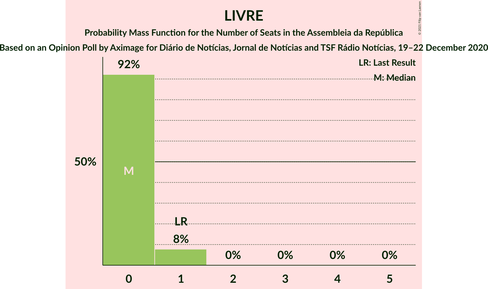

# Opinion Poll by Aximage for Diário de Notícias, Jornal de Notícias and TSF Rádio Notícias, 19–22 December 2020

<a href="#voting-intentions">Voting Intentions</a> | <a href="#seats">Seats</a> | <a href="#coalitions">Coalitions</a> | <a href="#technical-information">Technical Information</a>

## Voting Intentions

### Confidence Intervals

| Party | Last Result | Poll Result | 80% Confidence Interval | 90% Confidence Interval | 95% Confidence Interval | 99% Confidence Interval |
|:-----:|:-----------:|:-----------:|:-----------------------:|:-----------------------:|:-----------------------:|:-----------------------:|
| Partido Socialista | 36.4% | 38.5% | 36.4–40.8% |35.8–41.4% |35.3–41.9% |34.2–43.0% |
| Partido Social Democrata | 27.8% | 25.4% | 23.5–27.4% |23.0–28.0% |22.5–28.5% |21.6–29.5% |
| Bloco de Esquerda | 9.5% | 8.5% | 7.4–9.9% |7.0–10.3% |6.8–10.6% |6.2–11.3% |
| Chega | 1.3% | 7.8% | 6.7–9.1% |6.4–9.5% |6.1–9.8% |5.6–10.5% |
| Coligação Democrática Unitária | 6.3% | 5.7% | 4.7–6.8% |4.5–7.2% |4.3–7.5% |3.9–8.1% |
| Pessoas–Animais–Natureza | 3.3% | 4.7% | 3.9–5.8% |3.6–6.1% |3.4–6.4% |3.1–6.9% |
| Iniciativa Liberal | 1.3% | 3.4% | 2.7–4.4% |2.6–4.7% |2.4–5.0% |2.1–5.5% |
| LIVRE | 1.1% | 0.5% | 0.3–1.0% |0.2–1.1% |0.2–1.3% |0.1–1.6% |
| CDS–Partido Popular | 4.2% | 0.2% | 0.1–0.7% |0.1–0.8% |0.1–0.9% |0.0–1.1% |

*Note:* The poll result column reflects the actual value used in the calculations. Published results may vary slightly, and in addition be rounded to fewer digits.

## Seats

### Confidence Intervals

| Party | Last Result | Median | 80% Confidence Interval | 90% Confidence Interval | 95% Confidence Interval | 99% Confidence Interval |
|:-----:|:-----------:|:------:|:-----------------------:|:-----------------------:|:-----------------------:|:-----------------------:|
| <a href="#partido-socialista">Partido Socialista</a> | 108 | 113 | 105–118 |104–119 |102–121 |100–123 |
| <a href="#partido-social-democrata">Partido Social Democrata</a> | 79 | 68 | 63–76 |62–77 |59–79 |57–81 |
| <a href="#bloco-de-esquerda">Bloco de Esquerda</a> | 19 | 16 | 13–19 |12–20 |11–21 |11–23 |
| <a href="#chega">Chega</a> | 1 | 14 | 11–16 |11–18 |9–18 |8–22 |
| <a href="#coligação-democrática-unitária">Coligação Democrática Unitária</a> | 12 | 9 | 7–13 |6–14 |6–14 |5–16 |
| <a href="#pessoas–animais–natureza">Pessoas–Animais–Natureza</a> | 4 | 6 | 4–9 |4–10 |3–11 |3–11 |
| <a href="#iniciativa-liberal">Iniciativa Liberal</a> | 1 | 4 | 3–6 |3–6 |3–6 |3–8 |
| <a href="#livre">LIVRE</a> | 1 | 0 | 0 |0–1 |0–1 |0–1 |
| <a href="#cds–partido-popular">CDS–Partido Popular</a> | 5 | 0 | 0 |0 |0 |0 |

### Partido Socialista

*For a full overview of the results for this party, see the [Partido Socialista](party-partidosocialista.html) page.*

| Number of Seats | Probability | Accumulated | Special Marks |
|:---------------:|:-----------:|:-----------:|:-------------:|
| 94 | 0% | 100% |  |
| 95 | 0% | 99.9% |  |
| 96 | 0% | 99.9% |  |
| 97 | 0% | 99.9% |  |
| 98 | 0.1% | 99.8% |  |
| 99 | 0.2% | 99.8% |  |
| 100 | 0.5% | 99.6% |  |
| 101 | 0.9% | 99.1% |  |
| 102 | 1.3% | 98% |  |
| 103 | 1.3% | 97% |  |
| 104 | 5% | 96% |  |
| 105 | 6% | 91% |  |
| 106 | 4% | 85% |  |
| 107 | 7% | 81% |  |
| 108 | 4% | 75% | Last Result |
| 109 | 7% | 71% |  |
| 110 | 4% | 64% |  |
| 111 | 2% | 60% |  |
| 112 | 6% | 59% |  |
| 113 | 4% | 52% | Median |
| 114 | 9% | 48% |  |
| 115 | 9% | 39% |  |
| 116 | 15% | 30% | Majority |
| 117 | 3% | 15% |  |
| 118 | 5% | 12% |  |
| 119 | 4% | 7% |  |
| 120 | 0.5% | 3% |  |
| 121 | 1.3% | 3% |  |
| 122 | 0.6% | 1.3% |  |
| 123 | 0.3% | 0.7% |  |
| 124 | 0.1% | 0.4% |  |
| 125 | 0.1% | 0.3% |  |
| 126 | 0.1% | 0.2% |  |
| 127 | 0.1% | 0.2% |  |
| 128 | 0.1% | 0.1% |  |
| 129 | 0% | 0.1% |  |
| 130 | 0% | 0% |  |

### Partido Social Democrata

*For a full overview of the results for this party, see the [Partido Social Democrata](party-partidosocialdemocrata.html) page.*

| Number of Seats | Probability | Accumulated | Special Marks |
|:---------------:|:-----------:|:-----------:|:-------------:|
| 54 | 0% | 100% |  |
| 55 | 0% | 99.9% |  |
| 56 | 0.1% | 99.9% |  |
| 57 | 1.0% | 99.8% |  |
| 58 | 1.0% | 98.8% |  |
| 59 | 0.5% | 98% |  |
| 60 | 0.5% | 97% |  |
| 61 | 0.6% | 97% |  |
| 62 | 5% | 96% |  |
| 63 | 4% | 92% |  |
| 64 | 2% | 87% |  |
| 65 | 4% | 85% |  |
| 66 | 15% | 81% |  |
| 67 | 10% | 66% |  |
| 68 | 10% | 57% | Median |
| 69 | 11% | 46% |  |
| 70 | 10% | 36% |  |
| 71 | 2% | 26% |  |
| 72 | 3% | 24% |  |
| 73 | 4% | 21% |  |
| 74 | 3% | 17% |  |
| 75 | 4% | 15% |  |
| 76 | 4% | 10% |  |
| 77 | 2% | 6% |  |
| 78 | 2% | 4% |  |
| 79 | 2% | 3% | Last Result |
| 80 | 0.7% | 1.2% |  |
| 81 | 0.1% | 0.5% |  |
| 82 | 0.2% | 0.4% |  |
| 83 | 0.1% | 0.2% |  |
| 84 | 0.1% | 0.1% |  |
| 85 | 0% | 0.1% |  |
| 86 | 0% | 0% |  |

### Bloco de Esquerda

*For a full overview of the results for this party, see the [Bloco de Esquerda](party-blocodeesquerda.html) page.*

| Number of Seats | Probability | Accumulated | Special Marks |
|:---------------:|:-----------:|:-----------:|:-------------:|
| 8 | 0.1% | 100% |  |
| 9 | 0.1% | 99.9% |  |
| 10 | 0.1% | 99.8% |  |
| 11 | 4% | 99.7% |  |
| 12 | 2% | 96% |  |
| 13 | 4% | 94% |  |
| 14 | 17% | 90% |  |
| 15 | 10% | 72% |  |
| 16 | 22% | 62% | Median |
| 17 | 4% | 40% |  |
| 18 | 23% | 37% |  |
| 19 | 6% | 14% | Last Result |
| 20 | 4% | 8% |  |
| 21 | 3% | 5% |  |
| 22 | 0.8% | 1.5% |  |
| 23 | 0.3% | 0.7% |  |
| 24 | 0.1% | 0.3% |  |
| 25 | 0.2% | 0.2% |  |
| 26 | 0% | 0.1% |  |
| 27 | 0% | 0% |  |

### Chega

*For a full overview of the results for this party, see the [Chega](party-chega.html) page.*

| Number of Seats | Probability | Accumulated | Special Marks |
|:---------------:|:-----------:|:-----------:|:-------------:|
| 1 | 0% | 100% | Last Result |
| 2 | 0% | 100% |  |
| 3 | 0% | 100% |  |
| 4 | 0% | 100% |  |
| 5 | 0% | 100% |  |
| 6 | 0% | 100% |  |
| 7 | 0% | 100% |  |
| 8 | 0.9% | 100% |  |
| 9 | 3% | 99.0% |  |
| 10 | 0.9% | 96% |  |
| 11 | 26% | 96% |  |
| 12 | 4% | 70% |  |
| 13 | 15% | 66% |  |
| 14 | 36% | 51% | Median |
| 15 | 4% | 15% |  |
| 16 | 1.3% | 11% |  |
| 17 | 3% | 10% |  |
| 18 | 4% | 6% |  |
| 19 | 0.9% | 2% |  |
| 20 | 0.2% | 1.2% |  |
| 21 | 0.4% | 1.0% |  |
| 22 | 0.5% | 0.6% |  |
| 23 | 0.1% | 0.2% |  |
| 24 | 0.1% | 0.1% |  |
| 25 | 0% | 0% |  |

### Coligação Democrática Unitária

*For a full overview of the results for this party, see the [Coligação Democrática Unitária](party-coligaçãodemocráticaunitária.html) page.*

| Number of Seats | Probability | Accumulated | Special Marks |
|:---------------:|:-----------:|:-----------:|:-------------:|
| 4 | 0.1% | 100% |  |
| 5 | 1.3% | 99.9% |  |
| 6 | 6% | 98.6% |  |
| 7 | 28% | 93% |  |
| 8 | 13% | 65% |  |
| 9 | 12% | 52% | Median |
| 10 | 21% | 40% |  |
| 11 | 2% | 19% |  |
| 12 | 5% | 17% | Last Result |
| 13 | 5% | 12% |  |
| 14 | 6% | 7% |  |
| 15 | 0.5% | 1.2% |  |
| 16 | 0.6% | 0.7% |  |
| 17 | 0.1% | 0.2% |  |
| 18 | 0.1% | 0.1% |  |
| 19 | 0% | 0% |  |

### Pessoas–Animais–Natureza

*For a full overview of the results for this party, see the [Pessoas–Animais–Natureza](party-pessoas–animais–natureza.html) page.*

| Number of Seats | Probability | Accumulated | Special Marks |
|:---------------:|:-----------:|:-----------:|:-------------:|
| 2 | 0.3% | 100% |  |
| 3 | 3% | 99.7% |  |
| 4 | 12% | 97% | Last Result |
| 5 | 8% | 85% |  |
| 6 | 41% | 77% | Median |
| 7 | 7% | 36% |  |
| 8 | 11% | 29% |  |
| 9 | 10% | 18% |  |
| 10 | 4% | 7% |  |
| 11 | 3% | 3% |  |
| 12 | 0.3% | 0.4% |  |
| 13 | 0.1% | 0.1% |  |
| 14 | 0% | 0% |  |

### Iniciativa Liberal

*For a full overview of the results for this party, see the [Iniciativa Liberal](party-iniciativaliberal.html) page.*

| Number of Seats | Probability | Accumulated | Special Marks |
|:---------------:|:-----------:|:-----------:|:-------------:|
| 1 | 0% | 100% | Last Result |
| 2 | 0.3% | 100% |  |
| 3 | 25% | 99.7% |  |
| 4 | 34% | 75% | Median |
| 5 | 23% | 41% |  |
| 6 | 17% | 18% |  |
| 7 | 0.7% | 1.2% |  |
| 8 | 0.3% | 0.5% |  |
| 9 | 0.1% | 0.2% |  |
| 10 | 0.1% | 0.1% |  |
| 11 | 0% | 0% |  |

### LIVRE

*For a full overview of the results for this party, see the [LIVRE](party-livre.html) page.*

| Number of Seats | Probability | Accumulated | Special Marks |
|:---------------:|:-----------:|:-----------:|:-------------:|
| 0 | 92% | 100% | Median |
| 1 | 8% | 8% | Last Result |
| 2 | 0% | 0% |  |

### CDS–Partido Popular

*For a full overview of the results for this party, see the [CDS–Partido Popular](party-cds–partidopopular.html) page.*

| Number of Seats | Probability | Accumulated | Special Marks |
|:---------------:|:-----------:|:-----------:|:-------------:|
| 0 | 100% | 100% | Median |
| 1 | 0% | 0% |  |
| 2 | 0% | 0% |  |
| 3 | 0% | 0% |  |
| 4 | 0% | 0% |  |
| 5 | 0% | 0% | Last Result |

## Coalitions

### Confidence Intervals

| Coalition | Last Result | Median | Majority? | 80% Confidence Interval | 90% Confidence Interval | 95% Confidence Interval | 99% Confidence Interval |
|:---------:|:-----------:|:------:|:---------:|:-----------------------:|:-----------------------:|:-----------------------:|:-----------------------:|
| Partido Socialista – Bloco de Esquerda – Coligação Democrática Unitária | 139 | 137 | 100% | 130–143 | 129–145 | 127–147 | 124–150 |
| Partido Socialista – Bloco de Esquerda | 127 | 128 | 99.4% | 121–134 | 120–136 | 118–137 | 115–140 |
| Partido Socialista – Coligação Democrática Unitária | 120 | 123 | 80% | 114–127 | 112–129 | 111–130 | 108–133 |
| Partido Socialista | 108 | 113 | 30% | 105–118 | 104–119 | 102–121 | 100–123 |
| Partido Social Democrata – CDS–Partido Popular | 84 | 68 | 0% | 63–76 | 62–77 | 59–79 | 57–81 |

### Partido Socialista – Bloco de Esquerda – Coligação Democrática Unitária

| Number of Seats | Probability | Accumulated | Special Marks |
|:---------------:|:-----------:|:-----------:|:-------------:|
| 119 | 0% | 100% |  |
| 120 | 0% | 99.9% |  |
| 121 | 0% | 99.9% |  |
| 122 | 0.1% | 99.9% |  |
| 123 | 0.2% | 99.8% |  |
| 124 | 0.3% | 99.7% |  |
| 125 | 0.5% | 99.4% |  |
| 126 | 0.9% | 98.9% |  |
| 127 | 1.1% | 98% |  |
| 128 | 1.0% | 97% |  |
| 129 | 3% | 96% |  |
| 130 | 4% | 93% |  |
| 131 | 2% | 89% |  |
| 132 | 4% | 87% |  |
| 133 | 3% | 83% |  |
| 134 | 6% | 79% |  |
| 135 | 4% | 73% |  |
| 136 | 5% | 70% |  |
| 137 | 21% | 64% |  |
| 138 | 5% | 43% | Median |
| 139 | 14% | 38% | Last Result |
| 140 | 2% | 23% |  |
| 141 | 3% | 21% |  |
| 142 | 4% | 19% |  |
| 143 | 7% | 15% |  |
| 144 | 2% | 8% |  |
| 145 | 1.4% | 6% |  |
| 146 | 1.3% | 4% |  |
| 147 | 1.0% | 3% |  |
| 148 | 0.9% | 2% |  |
| 149 | 0.5% | 1.2% |  |
| 150 | 0.3% | 0.7% |  |
| 151 | 0.2% | 0.4% |  |
| 152 | 0.1% | 0.1% |  |
| 153 | 0% | 0.1% |  |
| 154 | 0% | 0.1% |  |
| 155 | 0% | 0% |  |

### Partido Socialista – Bloco de Esquerda

| Number of Seats | Probability | Accumulated | Special Marks |
|:---------------:|:-----------:|:-----------:|:-------------:|
| 111 | 0% | 100% |  |
| 112 | 0% | 99.9% |  |
| 113 | 0.1% | 99.9% |  |
| 114 | 0.1% | 99.8% |  |
| 115 | 0.3% | 99.7% |  |
| 116 | 0.8% | 99.4% | Majority |
| 117 | 0.5% | 98.6% |  |
| 118 | 1.0% | 98% |  |
| 119 | 1.1% | 97% |  |
| 120 | 5% | 96% |  |
| 121 | 2% | 91% |  |
| 122 | 5% | 89% |  |
| 123 | 3% | 85% |  |
| 124 | 4% | 81% |  |
| 125 | 4% | 77% |  |
| 126 | 4% | 74% |  |
| 127 | 10% | 69% | Last Result |
| 128 | 12% | 59% |  |
| 129 | 5% | 47% | Median |
| 130 | 14% | 43% |  |
| 131 | 10% | 29% |  |
| 132 | 4% | 20% |  |
| 133 | 2% | 15% |  |
| 134 | 4% | 13% |  |
| 135 | 2% | 9% |  |
| 136 | 4% | 7% |  |
| 137 | 1.3% | 3% |  |
| 138 | 0.5% | 2% |  |
| 139 | 0.5% | 2% |  |
| 140 | 0.6% | 1.0% |  |
| 141 | 0.1% | 0.4% |  |
| 142 | 0.1% | 0.3% |  |
| 143 | 0.1% | 0.2% |  |
| 144 | 0.1% | 0.1% |  |
| 145 | 0% | 0.1% |  |
| 146 | 0% | 0% |  |

### Partido Socialista – Coligação Democrática Unitária

| Number of Seats | Probability | Accumulated | Special Marks |
|:---------------:|:-----------:|:-----------:|:-------------:|
| 103 | 0% | 100% |  |
| 104 | 0.1% | 99.9% |  |
| 105 | 0% | 99.9% |  |
| 106 | 0.1% | 99.9% |  |
| 107 | 0.1% | 99.8% |  |
| 108 | 0.3% | 99.7% |  |
| 109 | 0.6% | 99.4% |  |
| 110 | 1.0% | 98.8% |  |
| 111 | 1.0% | 98% |  |
| 112 | 2% | 97% |  |
| 113 | 2% | 95% |  |
| 114 | 8% | 92% |  |
| 115 | 4% | 84% |  |
| 116 | 2% | 80% | Majority |
| 117 | 3% | 78% |  |
| 118 | 6% | 75% |  |
| 119 | 7% | 70% |  |
| 120 | 3% | 63% | Last Result |
| 121 | 3% | 60% |  |
| 122 | 5% | 56% | Median |
| 123 | 28% | 52% |  |
| 124 | 3% | 23% |  |
| 125 | 4% | 20% |  |
| 126 | 4% | 16% |  |
| 127 | 2% | 11% |  |
| 128 | 3% | 9% |  |
| 129 | 2% | 6% |  |
| 130 | 2% | 4% |  |
| 131 | 0.5% | 2% |  |
| 132 | 0.7% | 1.3% |  |
| 133 | 0.3% | 0.6% |  |
| 134 | 0.1% | 0.3% |  |
| 135 | 0.1% | 0.2% |  |
| 136 | 0.1% | 0.2% |  |
| 137 | 0% | 0.1% |  |
| 138 | 0% | 0.1% |  |
| 139 | 0% | 0% |  |

### Partido Socialista

| Number of Seats | Probability | Accumulated | Special Marks |
|:---------------:|:-----------:|:-----------:|:-------------:|
| 94 | 0% | 100% |  |
| 95 | 0% | 99.9% |  |
| 96 | 0% | 99.9% |  |
| 97 | 0% | 99.9% |  |
| 98 | 0.1% | 99.8% |  |
| 99 | 0.2% | 99.8% |  |
| 100 | 0.5% | 99.6% |  |
| 101 | 0.9% | 99.1% |  |
| 102 | 1.3% | 98% |  |
| 103 | 1.3% | 97% |  |
| 104 | 5% | 96% |  |
| 105 | 6% | 91% |  |
| 106 | 4% | 85% |  |
| 107 | 7% | 81% |  |
| 108 | 4% | 75% | Last Result |
| 109 | 7% | 71% |  |
| 110 | 4% | 64% |  |
| 111 | 2% | 60% |  |
| 112 | 6% | 59% |  |
| 113 | 4% | 52% | Median |
| 114 | 9% | 48% |  |
| 115 | 9% | 39% |  |
| 116 | 15% | 30% | Majority |
| 117 | 3% | 15% |  |
| 118 | 5% | 12% |  |
| 119 | 4% | 7% |  |
| 120 | 0.5% | 3% |  |
| 121 | 1.3% | 3% |  |
| 122 | 0.6% | 1.3% |  |
| 123 | 0.3% | 0.7% |  |
| 124 | 0.1% | 0.4% |  |
| 125 | 0.1% | 0.3% |  |
| 126 | 0.1% | 0.2% |  |
| 127 | 0.1% | 0.2% |  |
| 128 | 0.1% | 0.1% |  |
| 129 | 0% | 0.1% |  |
| 130 | 0% | 0% |  |

### Partido Social Democrata – CDS–Partido Popular

| Number of Seats | Probability | Accumulated | Special Marks |
|:---------------:|:-----------:|:-----------:|:-------------:|
| 54 | 0% | 100% |  |
| 55 | 0% | 99.9% |  |
| 56 | 0.1% | 99.9% |  |
| 57 | 1.0% | 99.8% |  |
| 58 | 1.0% | 98.8% |  |
| 59 | 0.5% | 98% |  |
| 60 | 0.5% | 97% |  |
| 61 | 0.6% | 97% |  |
| 62 | 5% | 96% |  |
| 63 | 4% | 92% |  |
| 64 | 2% | 87% |  |
| 65 | 4% | 85% |  |
| 66 | 15% | 81% |  |
| 67 | 10% | 66% |  |
| 68 | 10% | 57% | Median |
| 69 | 11% | 46% |  |
| 70 | 10% | 36% |  |
| 71 | 2% | 26% |  |
| 72 | 3% | 24% |  |
| 73 | 4% | 21% |  |
| 74 | 3% | 17% |  |
| 75 | 4% | 15% |  |
| 76 | 4% | 10% |  |
| 77 | 2% | 6% |  |
| 78 | 2% | 4% |  |
| 79 | 2% | 3% |  |
| 80 | 0.7% | 1.2% |  |
| 81 | 0.1% | 0.5% |  |
| 82 | 0.2% | 0.4% |  |
| 83 | 0.1% | 0.2% |  |
| 84 | 0.1% | 0.1% | Last Result |
| 85 | 0% | 0.1% |  |
| 86 | 0% | 0% |  |

## Technical Information

### Opinion Poll

+ **Polling firm:** Aximage
+ **Commissioner(s):** Diário de Notícias, Jornal de Notícias and TSF Rádio Notícias
+ **Fieldwork period:** 19–22 December 2020

### Calculations

+ **Sample size:** 812
+ **Simulations done:** 1,048,576
+ **Error estimate:** 2.12%

