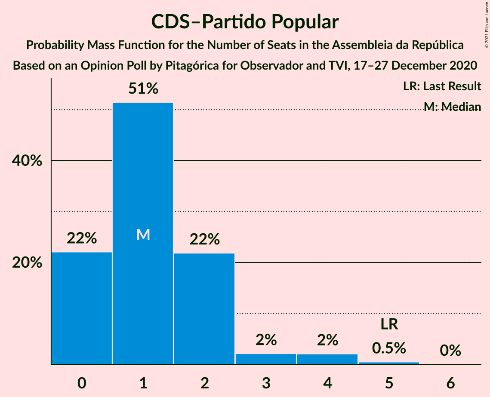
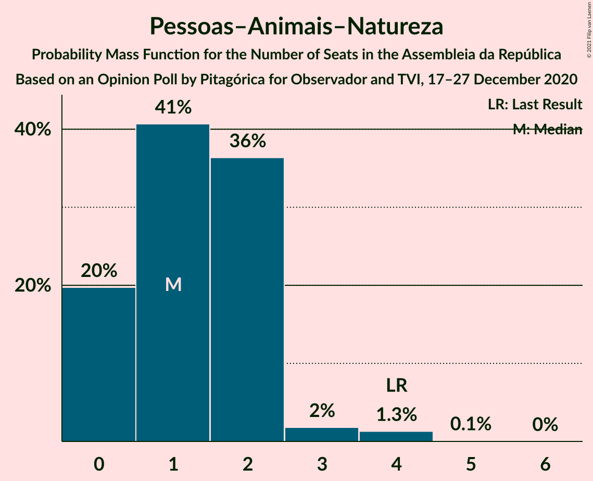
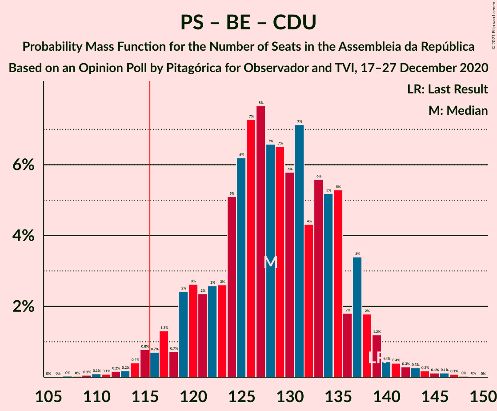

# Opinion Poll by Pitagórica for Observador and TVI, 17–27 December 2020

<a href="#voting-intentions">Voting Intentions</a> | <a href="#seats">Seats</a> | <a href="#coalitions">Coalitions</a> | <a href="#technical-information">Technical Information</a>

## Voting Intentions

### Confidence Intervals

| Party | Last Result | Poll Result | 80% Confidence Interval | 90% Confidence Interval | 95% Confidence Interval | 99% Confidence Interval |
|:-----:|:-----------:|:-----------:|:-----------------------:|:-----------------------:|:-----------------------:|:-----------------------:|
| Partido Socialista | 36.4% | 39.7% | 37.3–42.3% |36.6–43.0% |36.0–43.6% |34.8–44.9% |
| Partido Social Democrata | 27.8% | 28.0% | 25.8–30.4% |25.1–31.0% |24.6–31.6% |23.6–32.8% |
| Chega | 1.3% | 9.1% | 7.7–10.7% |7.4–11.2% |7.1–11.6% |6.5–12.4% |
| Bloco de Esquerda | 9.5% | 5.6% | 4.5–6.9% |4.3–7.3% |4.0–7.7% |3.6–8.4% |
| Coligação Democrática Unitária | 6.3% | 4.1% | 3.3–5.3% |3.0–5.7% |2.8–6.0% |2.5–6.6% |
| Iniciativa Liberal | 1.3% | 3.3% | 2.6–4.5% |2.4–4.8% |2.2–5.1% |1.9–5.6% |
| CDS–Partido Popular | 4.2% | 2.2% | 1.6–3.2% |1.5–3.5% |1.3–3.7% |1.1–4.2% |
| Pessoas–Animais–Natureza | 3.3% | 1.7% | 1.2–2.6% |1.1–2.9% |1.0–3.1% |0.8–3.6% |

*Note:* The poll result column reflects the actual value used in the calculations. Published results may vary slightly, and in addition be rounded to fewer digits.

## Seats

### Confidence Intervals

| Party | Last Result | Median | 80% Confidence Interval | 90% Confidence Interval | 95% Confidence Interval | 99% Confidence Interval |
|:-----:|:-----------:|:------:|:-----------------------:|:-----------------------:|:-----------------------:|:-----------------------:|
| <a href="#partido-socialista">Partido Socialista</a> | 108 | 114 | 107–122 |104–123 |103–125 |99–130 |
| <a href="#partido-social-democrata">Partido Social Democrata</a> | 79 | 77 | 70–83 |68–86 |66–88 |63–92 |
| <a href="#chega">Chega</a> | 1 | 17 | 13–22 |12–23 |11–25 |11–28 |
| <a href="#bloco-de-esquerda">Bloco de Esquerda</a> | 19 | 7 | 7–12 |5–13 |5–14 |3–16 |
| <a href="#coligação-democrática-unitária">Coligação Democrática Unitária</a> | 12 | 5 | 4–8 |3–9 |3–10 |2–12 |
| <a href="#iniciativa-liberal">Iniciativa Liberal</a> | 1 | 4 | 3–6 |3–6 |3–6 |2–9 |
| <a href="#cds–partido-popular">CDS–Partido Popular</a> | 5 | 1 | 0–2 |0–2 |0–4 |0–4 |
| <a href="#pessoas–animais–natureza">Pessoas–Animais–Natureza</a> | 4 | 1 | 0–2 |0–2 |0–3 |0–4 |

### Partido Socialista

*For a full overview of the results for this party, see the [Partido Socialista](party-partidosocialista.html) page.*

| Number of Seats | Probability | Accumulated | Special Marks |
|:---------------:|:-----------:|:-----------:|:-------------:|
| 93 | 0% | 100% |  |
| 94 | 0% | 99.9% |  |
| 95 | 0.1% | 99.9% |  |
| 96 | 0.1% | 99.8% |  |
| 97 | 0.1% | 99.8% |  |
| 98 | 0.2% | 99.7% |  |
| 99 | 0.2% | 99.5% |  |
| 100 | 0.3% | 99.3% |  |
| 101 | 0.8% | 99.0% |  |
| 102 | 0.7% | 98% |  |
| 103 | 1.4% | 98% |  |
| 104 | 2% | 96% |  |
| 105 | 2% | 95% |  |
| 106 | 2% | 92% |  |
| 107 | 2% | 90% |  |
| 108 | 6% | 88% | Last Result |
| 109 | 3% | 83% |  |
| 110 | 4% | 80% |  |
| 111 | 11% | 75% |  |
| 112 | 6% | 65% |  |
| 113 | 6% | 59% |  |
| 114 | 7% | 53% | Median |
| 115 | 4% | 46% |  |
| 116 | 5% | 42% | Majority |
| 117 | 5% | 37% |  |
| 118 | 5% | 31% |  |
| 119 | 6% | 27% |  |
| 120 | 6% | 21% |  |
| 121 | 4% | 15% |  |
| 122 | 4% | 11% |  |
| 123 | 2% | 6% |  |
| 124 | 1.2% | 4% |  |
| 125 | 1.0% | 3% |  |
| 126 | 0.6% | 2% |  |
| 127 | 0.4% | 1.4% |  |
| 128 | 0.2% | 1.0% |  |
| 129 | 0.2% | 0.8% |  |
| 130 | 0.2% | 0.6% |  |
| 131 | 0.2% | 0.4% |  |
| 132 | 0.1% | 0.2% |  |
| 133 | 0% | 0.1% |  |
| 134 | 0% | 0.1% |  |
| 135 | 0% | 0% |  |

### Partido Social Democrata

*For a full overview of the results for this party, see the [Partido Social Democrata](party-partidosocialdemocrata.html) page.*

| Number of Seats | Probability | Accumulated | Special Marks |
|:---------------:|:-----------:|:-----------:|:-------------:|
| 59 | 0% | 100% |  |
| 60 | 0% | 99.9% |  |
| 61 | 0.1% | 99.9% |  |
| 62 | 0.2% | 99.8% |  |
| 63 | 0.8% | 99.6% |  |
| 64 | 0.7% | 98.8% |  |
| 65 | 0.5% | 98% |  |
| 66 | 0.9% | 98% |  |
| 67 | 0.7% | 97% |  |
| 68 | 2% | 96% |  |
| 69 | 3% | 94% |  |
| 70 | 2% | 91% |  |
| 71 | 4% | 89% |  |
| 72 | 3% | 85% |  |
| 73 | 7% | 82% |  |
| 74 | 6% | 75% |  |
| 75 | 7% | 69% |  |
| 76 | 8% | 62% |  |
| 77 | 10% | 54% | Median |
| 78 | 8% | 44% |  |
| 79 | 7% | 36% | Last Result |
| 80 | 8% | 29% |  |
| 81 | 4% | 21% |  |
| 82 | 4% | 17% |  |
| 83 | 4% | 13% |  |
| 84 | 2% | 9% |  |
| 85 | 2% | 7% |  |
| 86 | 1.3% | 5% |  |
| 87 | 1.1% | 4% |  |
| 88 | 0.9% | 3% |  |
| 89 | 0.5% | 2% |  |
| 90 | 0.6% | 2% |  |
| 91 | 0.3% | 0.9% |  |
| 92 | 0.2% | 0.6% |  |
| 93 | 0.1% | 0.4% |  |
| 94 | 0.1% | 0.3% |  |
| 95 | 0% | 0.2% |  |
| 96 | 0% | 0.1% |  |
| 97 | 0.1% | 0.1% |  |
| 98 | 0% | 0% |  |

### Chega

*For a full overview of the results for this party, see the [Chega](party-chega.html) page.*

| Number of Seats | Probability | Accumulated | Special Marks |
|:---------------:|:-----------:|:-----------:|:-------------:|
| 1 | 0% | 100% | Last Result |
| 2 | 0% | 100% |  |
| 3 | 0% | 100% |  |
| 4 | 0% | 100% |  |
| 5 | 0% | 100% |  |
| 6 | 0% | 100% |  |
| 7 | 0% | 100% |  |
| 8 | 0% | 100% |  |
| 9 | 0.1% | 100% |  |
| 10 | 0.1% | 99.9% |  |
| 11 | 5% | 99.8% |  |
| 12 | 4% | 95% |  |
| 13 | 9% | 91% |  |
| 14 | 11% | 82% |  |
| 15 | 8% | 71% |  |
| 16 | 8% | 63% |  |
| 17 | 10% | 55% | Median |
| 18 | 15% | 46% |  |
| 19 | 9% | 31% |  |
| 20 | 4% | 22% |  |
| 21 | 4% | 18% |  |
| 22 | 5% | 14% |  |
| 23 | 4% | 9% |  |
| 24 | 2% | 4% |  |
| 25 | 0.6% | 3% |  |
| 26 | 0.8% | 2% |  |
| 27 | 0.5% | 1.2% |  |
| 28 | 0.6% | 0.8% |  |
| 29 | 0.1% | 0.2% |  |
| 30 | 0.1% | 0.1% |  |
| 31 | 0% | 0% |  |

### Bloco de Esquerda

*For a full overview of the results for this party, see the [Bloco de Esquerda](party-blocodeesquerda.html) page.*

| Number of Seats | Probability | Accumulated | Special Marks |
|:---------------:|:-----------:|:-----------:|:-------------:|
| 2 | 0.2% | 100% |  |
| 3 | 1.1% | 99.8% |  |
| 4 | 1.0% | 98.7% |  |
| 5 | 5% | 98% |  |
| 6 | 2% | 93% |  |
| 7 | 44% | 91% | Median |
| 8 | 7% | 48% |  |
| 9 | 5% | 41% |  |
| 10 | 7% | 36% |  |
| 11 | 16% | 29% |  |
| 12 | 6% | 13% |  |
| 13 | 3% | 7% |  |
| 14 | 2% | 4% |  |
| 15 | 0.8% | 2% |  |
| 16 | 1.1% | 1.3% |  |
| 17 | 0.1% | 0.2% |  |
| 18 | 0.1% | 0.1% |  |
| 19 | 0% | 0% | Last Result |

### Coligação Democrática Unitária

*For a full overview of the results for this party, see the [Coligação Democrática Unitária](party-coligaçãodemocráticaunitária.html) page.*

| Number of Seats | Probability | Accumulated | Special Marks |
|:---------------:|:-----------:|:-----------:|:-------------:|
| 2 | 2% | 100% |  |
| 3 | 7% | 98% |  |
| 4 | 6% | 91% |  |
| 5 | 41% | 86% | Median |
| 6 | 19% | 45% |  |
| 7 | 15% | 26% |  |
| 8 | 4% | 11% |  |
| 9 | 4% | 8% |  |
| 10 | 2% | 3% |  |
| 11 | 0.4% | 1.2% |  |
| 12 | 0.4% | 0.8% | Last Result |
| 13 | 0.2% | 0.5% |  |
| 14 | 0.1% | 0.2% |  |
| 15 | 0.1% | 0.1% |  |
| 16 | 0% | 0% |  |

### Iniciativa Liberal

*For a full overview of the results for this party, see the [Iniciativa Liberal](party-iniciativaliberal.html) page.*

| Number of Seats | Probability | Accumulated | Special Marks |
|:---------------:|:-----------:|:-----------:|:-------------:|
| 1 | 0.3% | 100% | Last Result |
| 2 | 0.7% | 99.7% |  |
| 3 | 37% | 99.0% |  |
| 4 | 23% | 62% | Median |
| 5 | 19% | 39% |  |
| 6 | 18% | 19% |  |
| 7 | 0.5% | 2% |  |
| 8 | 0.4% | 1.2% |  |
| 9 | 0.6% | 0.9% |  |
| 10 | 0.2% | 0.3% |  |
| 11 | 0% | 0.1% |  |
| 12 | 0% | 0% |  |

### CDS–Partido Popular

*For a full overview of the results for this party, see the [CDS–Partido Popular](party-cds–partidopopular.html) page.*

| Number of Seats | Probability | Accumulated | Special Marks |
|:---------------:|:-----------:|:-----------:|:-------------:|
| 0 | 22% | 100% |  |
| 1 | 51% | 78% | Median |
| 2 | 22% | 26% |  |
| 3 | 2% | 5% |  |
| 4 | 2% | 3% |  |
| 5 | 0.5% | 0.5% | Last Result |
| 6 | 0% | 0% |  |

### Pessoas–Animais–Natureza

*For a full overview of the results for this party, see the [Pessoas–Animais–Natureza](party-pessoas–animais–natureza.html) page.*

| Number of Seats | Probability | Accumulated | Special Marks |
|:---------------:|:-----------:|:-----------:|:-------------:|
| 0 | 20% | 100% |  |
| 1 | 41% | 80% | Median |
| 2 | 36% | 40% |  |
| 3 | 2% | 3% |  |
| 4 | 1.3% | 1.4% | Last Result |
| 5 | 0.1% | 0.1% |  |
| 6 | 0% | 0% |  |

## Coalitions

### Confidence Intervals

| Coalition | Last Result | Median | Majority? | 80% Confidence Interval | 90% Confidence Interval | 95% Confidence Interval | 99% Confidence Interval |
|:---------:|:-----------:|:------:|:---------:|:-----------------------:|:-----------------------:|:-----------------------:|:-----------------------:|
| Partido Socialista – Bloco de Esquerda – Coligação Democrática Unitária | 139 | 128 | 98% | 121–136 | 119–137 | 116–139 | 112–144 |
| Partido Socialista – Bloco de Esquerda | 127 | 123 | 89% | 115–130 | 113–132 | 111–133 | 107–138 |
| Partido Socialista – Coligação Democrática Unitária | 120 | 120 | 80% | 112–127 | 110–129 | 108–131 | 104–136 |
| Partido Socialista | 108 | 114 | 42% | 107–122 | 104–123 | 103–125 | 99–130 |
| Partido Social Democrata – CDS–Partido Popular | 84 | 78 | 0% | 71–84 | 69–87 | 67–89 | 64–93 |

### Partido Socialista – Bloco de Esquerda – Coligação Democrática Unitária

| Number of Seats | Probability | Accumulated | Special Marks |
|:---------------:|:-----------:|:-----------:|:-------------:|
| 107 | 0% | 100% |  |
| 108 | 0% | 99.9% |  |
| 109 | 0.1% | 99.9% |  |
| 110 | 0.1% | 99.8% |  |
| 111 | 0.1% | 99.7% |  |
| 112 | 0.2% | 99.7% |  |
| 113 | 0.2% | 99.5% |  |
| 114 | 0.4% | 99.3% |  |
| 115 | 0.8% | 98.9% |  |
| 116 | 0.7% | 98% | Majority |
| 117 | 1.3% | 97% |  |
| 118 | 0.7% | 96% |  |
| 119 | 2% | 95% |  |
| 120 | 3% | 93% |  |
| 121 | 2% | 90% |  |
| 122 | 3% | 88% |  |
| 123 | 3% | 85% |  |
| 124 | 5% | 83% |  |
| 125 | 6% | 78% |  |
| 126 | 7% | 71% | Median |
| 127 | 8% | 64% |  |
| 128 | 7% | 57% |  |
| 129 | 7% | 50% |  |
| 130 | 6% | 43% |  |
| 131 | 7% | 38% |  |
| 132 | 4% | 31% |  |
| 133 | 6% | 26% |  |
| 134 | 5% | 21% |  |
| 135 | 5% | 15% |  |
| 136 | 2% | 10% |  |
| 137 | 3% | 8% |  |
| 138 | 2% | 5% |  |
| 139 | 1.2% | 3% | Last Result |
| 140 | 0.4% | 2% |  |
| 141 | 0.4% | 2% |  |
| 142 | 0.3% | 1.1% |  |
| 143 | 0.3% | 0.8% |  |
| 144 | 0.2% | 0.6% |  |
| 145 | 0.1% | 0.4% |  |
| 146 | 0.1% | 0.3% |  |
| 147 | 0.1% | 0.2% |  |
| 148 | 0% | 0.1% |  |
| 149 | 0% | 0.1% |  |
| 150 | 0% | 0% |  |

### Partido Socialista – Bloco de Esquerda

| Number of Seats | Probability | Accumulated | Special Marks |
|:---------------:|:-----------:|:-----------:|:-------------:|
| 101 | 0% | 100% |  |
| 102 | 0% | 99.9% |  |
| 103 | 0% | 99.9% |  |
| 104 | 0.1% | 99.9% |  |
| 105 | 0.1% | 99.8% |  |
| 106 | 0.1% | 99.7% |  |
| 107 | 0.2% | 99.6% |  |
| 108 | 0.3% | 99.4% |  |
| 109 | 0.5% | 99.0% |  |
| 110 | 0.7% | 98.5% |  |
| 111 | 1.1% | 98% |  |
| 112 | 2% | 97% |  |
| 113 | 2% | 95% |  |
| 114 | 2% | 94% |  |
| 115 | 3% | 92% |  |
| 116 | 3% | 89% | Majority |
| 117 | 4% | 86% |  |
| 118 | 4% | 83% |  |
| 119 | 7% | 79% |  |
| 120 | 4% | 71% |  |
| 121 | 8% | 67% | Median |
| 122 | 7% | 59% |  |
| 123 | 5% | 52% |  |
| 124 | 10% | 47% |  |
| 125 | 4% | 37% |  |
| 126 | 5% | 33% |  |
| 127 | 5% | 28% | Last Result |
| 128 | 7% | 23% |  |
| 129 | 4% | 16% |  |
| 130 | 3% | 11% |  |
| 131 | 2% | 8% |  |
| 132 | 1.3% | 6% |  |
| 133 | 2% | 5% |  |
| 134 | 0.7% | 2% |  |
| 135 | 0.5% | 2% |  |
| 136 | 0.4% | 1.3% |  |
| 137 | 0.3% | 0.9% |  |
| 138 | 0.2% | 0.6% |  |
| 139 | 0.2% | 0.4% |  |
| 140 | 0.1% | 0.2% |  |
| 141 | 0.1% | 0.2% |  |
| 142 | 0% | 0.1% |  |
| 143 | 0% | 0.1% |  |
| 144 | 0% | 0% |  |

### Partido Socialista – Coligação Democrática Unitária

| Number of Seats | Probability | Accumulated | Special Marks |
|:---------------:|:-----------:|:-----------:|:-------------:|
| 99 | 0% | 100% |  |
| 100 | 0.1% | 99.9% |  |
| 101 | 0.1% | 99.9% |  |
| 102 | 0.1% | 99.8% |  |
| 103 | 0.1% | 99.7% |  |
| 104 | 0.1% | 99.6% |  |
| 105 | 0.3% | 99.4% |  |
| 106 | 0.5% | 99.2% |  |
| 107 | 0.5% | 98.7% |  |
| 108 | 1.2% | 98% |  |
| 109 | 2% | 97% |  |
| 110 | 2% | 95% |  |
| 111 | 1.3% | 93% |  |
| 112 | 2% | 92% |  |
| 113 | 4% | 90% |  |
| 114 | 4% | 86% |  |
| 115 | 3% | 82% |  |
| 116 | 9% | 80% | Majority |
| 117 | 6% | 71% |  |
| 118 | 7% | 65% |  |
| 119 | 8% | 58% | Median |
| 120 | 4% | 50% | Last Result |
| 121 | 7% | 46% |  |
| 122 | 4% | 39% |  |
| 123 | 4% | 35% |  |
| 124 | 7% | 31% |  |
| 125 | 7% | 24% |  |
| 126 | 4% | 18% |  |
| 127 | 6% | 14% |  |
| 128 | 3% | 8% |  |
| 129 | 1.1% | 5% |  |
| 130 | 1.1% | 4% |  |
| 131 | 1.0% | 3% |  |
| 132 | 0.5% | 2% |  |
| 133 | 0.3% | 1.3% |  |
| 134 | 0.2% | 1.0% |  |
| 135 | 0.2% | 0.8% |  |
| 136 | 0.2% | 0.6% |  |
| 137 | 0.2% | 0.3% |  |
| 138 | 0% | 0.2% |  |
| 139 | 0.1% | 0.1% |  |
| 140 | 0.1% | 0.1% |  |
| 141 | 0% | 0% |  |

### Partido Socialista

| Number of Seats | Probability | Accumulated | Special Marks |
|:---------------:|:-----------:|:-----------:|:-------------:|
| 93 | 0% | 100% |  |
| 94 | 0% | 99.9% |  |
| 95 | 0.1% | 99.9% |  |
| 96 | 0.1% | 99.8% |  |
| 97 | 0.1% | 99.8% |  |
| 98 | 0.2% | 99.7% |  |
| 99 | 0.2% | 99.5% |  |
| 100 | 0.3% | 99.3% |  |
| 101 | 0.8% | 99.0% |  |
| 102 | 0.7% | 98% |  |
| 103 | 1.4% | 98% |  |
| 104 | 2% | 96% |  |
| 105 | 2% | 95% |  |
| 106 | 2% | 92% |  |
| 107 | 2% | 90% |  |
| 108 | 6% | 88% | Last Result |
| 109 | 3% | 83% |  |
| 110 | 4% | 80% |  |
| 111 | 11% | 75% |  |
| 112 | 6% | 65% |  |
| 113 | 6% | 59% |  |
| 114 | 7% | 53% | Median |
| 115 | 4% | 46% |  |
| 116 | 5% | 42% | Majority |
| 117 | 5% | 37% |  |
| 118 | 5% | 31% |  |
| 119 | 6% | 27% |  |
| 120 | 6% | 21% |  |
| 121 | 4% | 15% |  |
| 122 | 4% | 11% |  |
| 123 | 2% | 6% |  |
| 124 | 1.2% | 4% |  |
| 125 | 1.0% | 3% |  |
| 126 | 0.6% | 2% |  |
| 127 | 0.4% | 1.4% |  |
| 128 | 0.2% | 1.0% |  |
| 129 | 0.2% | 0.8% |  |
| 130 | 0.2% | 0.6% |  |
| 131 | 0.2% | 0.4% |  |
| 132 | 0.1% | 0.2% |  |
| 133 | 0% | 0.1% |  |
| 134 | 0% | 0.1% |  |
| 135 | 0% | 0% |  |

### Partido Social Democrata – CDS–Partido Popular

| Number of Seats | Probability | Accumulated | Special Marks |
|:---------------:|:-----------:|:-----------:|:-------------:|
| 60 | 0% | 100% |  |
| 61 | 0% | 99.9% |  |
| 62 | 0.1% | 99.9% |  |
| 63 | 0.2% | 99.8% |  |
| 64 | 0.6% | 99.6% |  |
| 65 | 1.0% | 99.0% |  |
| 66 | 0.5% | 98% |  |
| 67 | 0.6% | 98% |  |
| 68 | 1.0% | 97% |  |
| 69 | 2% | 96% |  |
| 70 | 2% | 94% |  |
| 71 | 3% | 92% |  |
| 72 | 3% | 89% |  |
| 73 | 6% | 86% |  |
| 74 | 5% | 80% |  |
| 75 | 6% | 75% |  |
| 76 | 8% | 69% |  |
| 77 | 7% | 61% |  |
| 78 | 9% | 54% | Median |
| 79 | 7% | 45% |  |
| 80 | 8% | 38% |  |
| 81 | 7% | 30% |  |
| 82 | 4% | 23% |  |
| 83 | 5% | 19% |  |
| 84 | 4% | 14% | Last Result |
| 85 | 2% | 10% |  |
| 86 | 3% | 8% |  |
| 87 | 1.0% | 5% |  |
| 88 | 1.3% | 4% |  |
| 89 | 0.9% | 3% |  |
| 90 | 0.7% | 2% |  |
| 91 | 0.4% | 1.4% |  |
| 92 | 0.4% | 1.1% |  |
| 93 | 0.3% | 0.7% |  |
| 94 | 0.1% | 0.4% |  |
| 95 | 0.1% | 0.3% |  |
| 96 | 0.1% | 0.2% |  |
| 97 | 0% | 0.1% |  |
| 98 | 0% | 0.1% |  |
| 99 | 0% | 0% |  |

## Technical Information

### Opinion Poll

+ **Polling firm:** Pitagórica
+ **Commissioner(s):** Observador and TVI
+ **Fieldwork period:** 17–27 December 2020

### Calculations

+ **Sample size:** 629
+ **Simulations done:** 1,048,576
+ **Error estimate:** 2.48%

