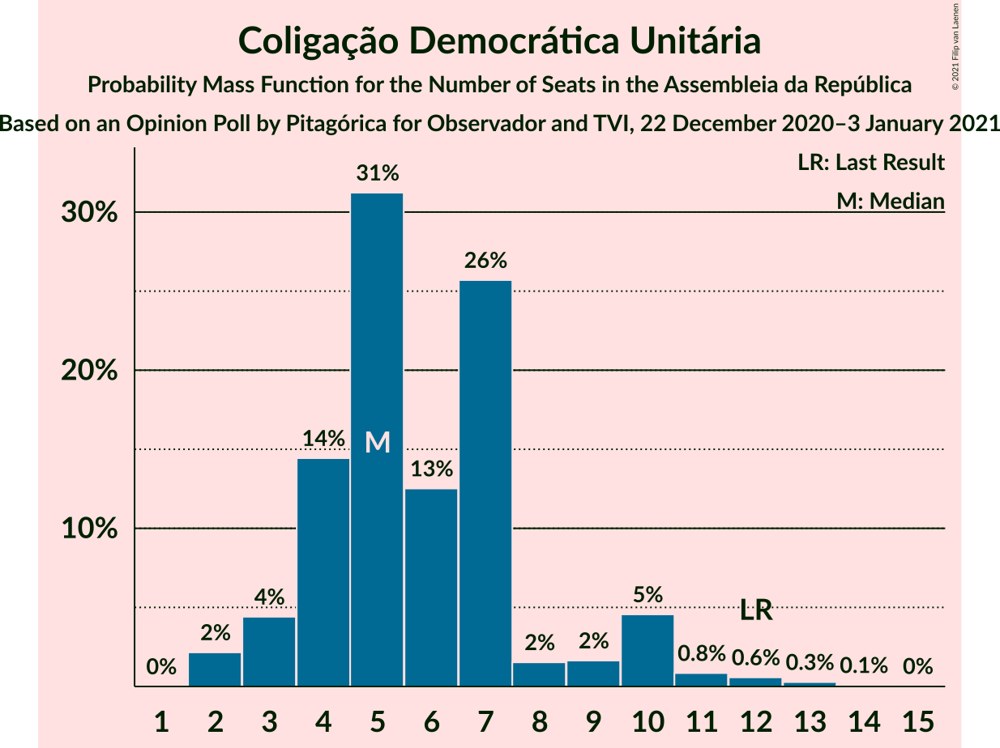

# Opinion Poll by Pitagórica for Observador and TVI, 22 December 2020–3 January 2021

<a href="#voting-intentions">Voting Intentions</a> | <a href="#seats">Seats</a> | <a href="#coalitions">Coalitions</a> | <a href="#technical-information">Technical Information</a>

## Voting Intentions

### Confidence Intervals

| Party | Last Result | Poll Result | 80% Confidence Interval | 90% Confidence Interval | 95% Confidence Interval | 99% Confidence Interval |
|:-----:|:-----------:|:-----------:|:-----------------------:|:-----------------------:|:-----------------------:|:-----------------------:|
| Partido Socialista | 36.4% | 40.9% | 38.4–43.4% |37.7–44.1% |37.1–44.7% |35.9–46.0% |
| Partido Social Democrata | 27.8% | 26.2% | 24.1–28.6% |23.5–29.2% |22.9–29.8% |21.9–31.0% |
| Chega | 1.3% | 8.4% | 7.1–10.0% |6.8–10.5% |6.5–10.9% |5.9–11.7% |
| Bloco de Esquerda | 9.5% | 7.3% | 6.1–8.8% |5.8–9.3% |5.5–9.6% |5.0–10.4% |
| Coligação Democrática Unitária | 6.3% | 4.1% | 3.3–5.3% |3.0–5.7% |2.8–6.0% |2.5–6.6% |
| Iniciativa Liberal | 1.3% | 2.9% | 2.2–3.9% |2.0–4.2% |1.8–4.5% |1.5–5.0% |
| Pessoas–Animais–Natureza | 3.3% | 1.7% | 1.2–2.6% |1.1–2.9% |1.0–3.1% |0.8–3.6% |
| CDS–Partido Popular | 4.2% | 1.4% | 1.0–2.3% |0.9–2.5% |0.8–2.7% |0.6–3.2% |
| LIVRE | 1.1% | 0.2% | 0.1–0.6% |0.0–0.8% |0.0–0.9% |0.0–1.2% |

*Note:* The poll result column reflects the actual value used in the calculations. Published results may vary slightly, and in addition be rounded to fewer digits.

## Seats

### Confidence Intervals

| Party | Last Result | Median | 80% Confidence Interval | 90% Confidence Interval | 95% Confidence Interval | 99% Confidence Interval |
|:-----:|:-----------:|:------:|:-----------------------:|:-----------------------:|:-----------------------:|:-----------------------:|
| <a href="#partido-socialista">Partido Socialista</a> | 108 | 119 | 114–130 |113–130 |110–134 |104–134 |
| <a href="#partido-social-democrata">Partido Social Democrata</a> | 79 | 69 | 63–71 |58–75 |55–78 |55–82 |
| <a href="#chega">Chega</a> | 1 | 13 | 11–22 |11–22 |11–22 |11–23 |
| <a href="#bloco-de-esquerda">Bloco de Esquerda</a> | 19 | 14 | 11–16 |9–18 |7–20 |7–20 |
| <a href="#coligação-democrática-unitária">Coligação Democrática Unitária</a> | 12 | 5 | 5–10 |4–10 |4–10 |2–10 |
| <a href="#iniciativa-liberal">Iniciativa Liberal</a> | 1 | 4 | 3–6 |1–6 |1–6 |1–6 |
| <a href="#pessoas–animais–natureza">Pessoas–Animais–Natureza</a> | 4 | 2 | 0–2 |0–2 |0–2 |0–4 |
| <a href="#cds–partido-popular">CDS–Partido Popular</a> | 5 | 0 | 0 |0–1 |0–2 |0–3 |
| <a href="#livre">LIVRE</a> | 1 | 0 | 0 |0 |0 |0–1 |

### Partido Socialista

*For a full overview of the results for this party, see the [Partido Socialista](party-partidosocialista.html) page.*

| Number of Seats | Probability | Accumulated | Special Marks |
|:---------------:|:-----------:|:-----------:|:-------------:|
| 101 | 0% | 100% |  |
| 102 | 0.1% | 99.9% |  |
| 103 | 0.2% | 99.8% |  |
| 104 | 0.1% | 99.6% |  |
| 105 | 0.3% | 99.5% |  |
| 106 | 0.1% | 99.2% |  |
| 107 | 0.2% | 99.1% |  |
| 108 | 0.1% | 98.9% | Last Result |
| 109 | 1.0% | 98.8% |  |
| 110 | 0.4% | 98% |  |
| 111 | 0.3% | 97% |  |
| 112 | 1.2% | 97% |  |
| 113 | 1.1% | 96% |  |
| 114 | 8% | 95% |  |
| 115 | 8% | 87% |  |
| 116 | 0.8% | 79% | Majority |
| 117 | 2% | 78% |  |
| 118 | 1.0% | 76% |  |
| 119 | 45% | 75% | Median |
| 120 | 0.3% | 30% |  |
| 121 | 0.3% | 30% |  |
| 122 | 2% | 30% |  |
| 123 | 7% | 28% |  |
| 124 | 1.1% | 21% |  |
| 125 | 1.0% | 20% |  |
| 126 | 0% | 19% |  |
| 127 | 0.2% | 19% |  |
| 128 | 3% | 19% |  |
| 129 | 0.1% | 16% |  |
| 130 | 12% | 16% |  |
| 131 | 0.2% | 4% |  |
| 132 | 0% | 4% |  |
| 133 | 0.1% | 4% |  |
| 134 | 3% | 3% |  |
| 135 | 0% | 0.3% |  |
| 136 | 0% | 0.3% |  |
| 137 | 0% | 0.3% |  |
| 138 | 0% | 0.2% |  |
| 139 | 0% | 0.2% |  |
| 140 | 0% | 0.2% |  |
| 141 | 0% | 0.2% |  |
| 142 | 0.2% | 0.2% |  |
| 143 | 0% | 0% |  |

### Partido Social Democrata

*For a full overview of the results for this party, see the [Partido Social Democrata](party-partidosocialdemocrata.html) page.*

| Number of Seats | Probability | Accumulated | Special Marks |
|:---------------:|:-----------:|:-----------:|:-------------:|
| 55 | 3% | 100% |  |
| 56 | 0.4% | 97% |  |
| 57 | 0.1% | 97% |  |
| 58 | 4% | 97% |  |
| 59 | 0% | 93% |  |
| 60 | 0.1% | 93% |  |
| 61 | 0.2% | 93% |  |
| 62 | 1.0% | 93% |  |
| 63 | 12% | 92% |  |
| 64 | 0.3% | 80% |  |
| 65 | 6% | 79% |  |
| 66 | 3% | 73% |  |
| 67 | 8% | 70% |  |
| 68 | 0.3% | 62% |  |
| 69 | 17% | 62% | Median |
| 70 | 34% | 45% |  |
| 71 | 2% | 11% |  |
| 72 | 0.1% | 9% |  |
| 73 | 3% | 9% |  |
| 74 | 0.9% | 6% |  |
| 75 | 0.7% | 5% |  |
| 76 | 0.1% | 5% |  |
| 77 | 0.8% | 5% |  |
| 78 | 2% | 4% |  |
| 79 | 0.3% | 2% | Last Result |
| 80 | 0.1% | 1.4% |  |
| 81 | 0.2% | 1.3% |  |
| 82 | 0.7% | 1.1% |  |
| 83 | 0% | 0.4% |  |
| 84 | 0.1% | 0.4% |  |
| 85 | 0% | 0.3% |  |
| 86 | 0% | 0.3% |  |
| 87 | 0.2% | 0.2% |  |
| 88 | 0% | 0.1% |  |
| 89 | 0% | 0% |  |

### Chega

*For a full overview of the results for this party, see the [Chega](party-chega.html) page.*

| Number of Seats | Probability | Accumulated | Special Marks |
|:---------------:|:-----------:|:-----------:|:-------------:|
| 1 | 0% | 100% | Last Result |
| 2 | 0% | 100% |  |
| 3 | 0% | 100% |  |
| 4 | 0% | 100% |  |
| 5 | 0% | 100% |  |
| 6 | 0% | 100% |  |
| 7 | 0% | 100% |  |
| 8 | 0% | 100% |  |
| 9 | 0% | 99.9% |  |
| 10 | 0.1% | 99.9% |  |
| 11 | 33% | 99.8% |  |
| 12 | 4% | 66% |  |
| 13 | 13% | 62% | Median |
| 14 | 1.3% | 49% |  |
| 15 | 0.5% | 48% |  |
| 16 | 0.6% | 47% |  |
| 17 | 0.5% | 46% |  |
| 18 | 10% | 46% |  |
| 19 | 2% | 36% |  |
| 20 | 11% | 33% |  |
| 21 | 1.4% | 23% |  |
| 22 | 20% | 21% |  |
| 23 | 0.5% | 1.0% |  |
| 24 | 0.2% | 0.5% |  |
| 25 | 0% | 0.3% |  |
| 26 | 0% | 0.2% |  |
| 27 | 0.1% | 0.2% |  |
| 28 | 0% | 0.1% |  |
| 29 | 0.1% | 0.1% |  |
| 30 | 0% | 0% |  |

### Bloco de Esquerda

*For a full overview of the results for this party, see the [Bloco de Esquerda](party-blocodeesquerda.html) page.*

| Number of Seats | Probability | Accumulated | Special Marks |
|:---------------:|:-----------:|:-----------:|:-------------:|
| 7 | 4% | 100% |  |
| 8 | 0.4% | 96% |  |
| 9 | 1.2% | 96% |  |
| 10 | 2% | 95% |  |
| 11 | 6% | 93% |  |
| 12 | 16% | 87% |  |
| 13 | 14% | 71% |  |
| 14 | 29% | 57% | Median |
| 15 | 0.5% | 28% |  |
| 16 | 21% | 28% |  |
| 17 | 0.9% | 7% |  |
| 18 | 1.3% | 6% |  |
| 19 | 0.3% | 4% | Last Result |
| 20 | 4% | 4% |  |
| 21 | 0.1% | 0.3% |  |
| 22 | 0.2% | 0.2% |  |
| 23 | 0% | 0.1% |  |
| 24 | 0% | 0.1% |  |
| 25 | 0% | 0% |  |

### Coligação Democrática Unitária

*For a full overview of the results for this party, see the [Coligação Democrática Unitária](party-coligaçãodemocráticaunitária.html) page.*

| Number of Seats | Probability | Accumulated | Special Marks |
|:---------------:|:-----------:|:-----------:|:-------------:|
| 2 | 0.5% | 100% |  |
| 3 | 1.2% | 99.5% |  |
| 4 | 5% | 98% |  |
| 5 | 46% | 93% | Median |
| 6 | 4% | 48% |  |
| 7 | 11% | 44% |  |
| 8 | 0.7% | 32% |  |
| 9 | 0.9% | 31% |  |
| 10 | 30% | 31% |  |
| 11 | 0.1% | 0.5% |  |
| 12 | 0.1% | 0.4% | Last Result |
| 13 | 0.1% | 0.3% |  |
| 14 | 0.1% | 0.2% |  |
| 15 | 0.1% | 0.1% |  |
| 16 | 0% | 0% |  |

### Iniciativa Liberal

*For a full overview of the results for this party, see the [Iniciativa Liberal](party-iniciativaliberal.html) page.*

| Number of Seats | Probability | Accumulated | Special Marks |
|:---------------:|:-----------:|:-----------:|:-------------:|
| 1 | 7% | 100% | Last Result |
| 2 | 0.7% | 93% |  |
| 3 | 19% | 92% |  |
| 4 | 37% | 73% | Median |
| 5 | 24% | 36% |  |
| 6 | 11% | 12% |  |
| 7 | 0.1% | 0.3% |  |
| 8 | 0.2% | 0.3% |  |
| 9 | 0% | 0% |  |

### Pessoas–Animais–Natureza

*For a full overview of the results for this party, see the [Pessoas–Animais–Natureza](party-pessoas–animais–natureza.html) page.*

| Number of Seats | Probability | Accumulated | Special Marks |
|:---------------:|:-----------:|:-----------:|:-------------:|
| 0 | 32% | 100% |  |
| 1 | 16% | 68% |  |
| 2 | 51% | 52% | Median |
| 3 | 0.1% | 1.4% |  |
| 4 | 1.1% | 1.3% | Last Result |
| 5 | 0.1% | 0.1% |  |
| 6 | 0.1% | 0.1% |  |
| 7 | 0% | 0% |  |

### CDS–Partido Popular

*For a full overview of the results for this party, see the [CDS–Partido Popular](party-cds–partidopopular.html) page.*

| Number of Seats | Probability | Accumulated | Special Marks |
|:---------------:|:-----------:|:-----------:|:-------------:|
| 0 | 92% | 100% | Median |
| 1 | 5% | 8% |  |
| 2 | 1.1% | 3% |  |
| 3 | 1.4% | 1.5% |  |
| 4 | 0% | 0% |  |
| 5 | 0% | 0% | Last Result |

### LIVRE

*For a full overview of the results for this party, see the [LIVRE](party-livre.html) page.*

| Number of Seats | Probability | Accumulated | Special Marks |
|:---------------:|:-----------:|:-----------:|:-------------:|
| 0 | 98.8% | 100% | Median |
| 1 | 1.2% | 1.2% | Last Result |
| 2 | 0% | 0% |  |

## Coalitions

### Confidence Intervals

| Coalition | Last Result | Median | Majority? | 80% Confidence Interval | 90% Confidence Interval | 95% Confidence Interval | 99% Confidence Interval |
|:---------:|:-----------:|:------:|:---------:|:-----------------------:|:-----------------------:|:-----------------------:|:-----------------------:|
| Partido Socialista – Bloco de Esquerda – Coligação Democrática Unitária | 139 | 143 | 100% | 134–148 | 130–151 | 129–154 | 126–154 |
| Partido Socialista – Bloco de Esquerda | 127 | 133 | 99.8% | 127–143 | 125–144 | 124–150 | 118–150 |
| Partido Socialista – Coligação Democrática Unitária | 120 | 129 | 98% | 119–135 | 119–135 | 116–138 | 111–138 |
| Partido Socialista | 108 | 119 | 79% | 114–130 | 113–130 | 110–134 | 104–134 |
| Partido Social Democrata – CDS–Partido Popular | 84 | 69 | 0% | 63–71 | 58–76 | 56–78 | 56–84 |

### Partido Socialista – Bloco de Esquerda – Coligação Democrática Unitária

| Number of Seats | Probability | Accumulated | Special Marks |
|:---------------:|:-----------:|:-----------:|:-------------:|
| 120 | 0.1% | 100% |  |
| 121 | 0% | 99.8% |  |
| 122 | 0.1% | 99.8% |  |
| 123 | 0.2% | 99.8% |  |
| 124 | 0% | 99.6% |  |
| 125 | 0% | 99.6% |  |
| 126 | 0.3% | 99.5% |  |
| 127 | 0.2% | 99.2% |  |
| 128 | 0.7% | 99.0% |  |
| 129 | 1.3% | 98% |  |
| 130 | 5% | 97% |  |
| 131 | 0.1% | 92% |  |
| 132 | 1.1% | 92% |  |
| 133 | 0.4% | 91% |  |
| 134 | 0.6% | 90% |  |
| 135 | 0.1% | 90% |  |
| 136 | 23% | 90% |  |
| 137 | 3% | 67% |  |
| 138 | 4% | 64% | Median |
| 139 | 0.2% | 60% | Last Result |
| 140 | 4% | 60% |  |
| 141 | 0.2% | 56% |  |
| 142 | 1.1% | 56% |  |
| 143 | 29% | 55% |  |
| 144 | 6% | 26% |  |
| 145 | 0% | 19% |  |
| 146 | 0.2% | 19% |  |
| 147 | 0.1% | 19% |  |
| 148 | 12% | 19% |  |
| 149 | 0% | 7% |  |
| 150 | 0.1% | 7% |  |
| 151 | 3% | 7% |  |
| 152 | 0% | 4% |  |
| 153 | 0.4% | 4% |  |
| 154 | 3% | 4% |  |
| 155 | 0.1% | 0.1% |  |
| 156 | 0% | 0.1% |  |
| 157 | 0% | 0% |  |

### Partido Socialista – Bloco de Esquerda

| Number of Seats | Probability | Accumulated | Special Marks |
|:---------------:|:-----------:|:-----------:|:-------------:|
| 115 | 0.1% | 100% |  |
| 116 | 0% | 99.8% | Majority |
| 117 | 0.2% | 99.8% |  |
| 118 | 0.1% | 99.6% |  |
| 119 | 0% | 99.5% |  |
| 120 | 0.2% | 99.4% |  |
| 121 | 0.2% | 99.2% |  |
| 122 | 0.7% | 99.1% |  |
| 123 | 0.6% | 98% |  |
| 124 | 0.5% | 98% |  |
| 125 | 5% | 97% |  |
| 126 | 2% | 92% |  |
| 127 | 1.4% | 91% | Last Result |
| 128 | 0.1% | 89% |  |
| 129 | 2% | 89% |  |
| 130 | 2% | 87% |  |
| 131 | 23% | 85% |  |
| 132 | 1.2% | 62% |  |
| 133 | 30% | 61% | Median |
| 134 | 3% | 31% |  |
| 135 | 2% | 28% |  |
| 136 | 0.2% | 26% |  |
| 137 | 0.2% | 26% |  |
| 138 | 0.1% | 26% |  |
| 139 | 6% | 25% |  |
| 140 | 0.1% | 19% |  |
| 141 | 0.1% | 19% |  |
| 142 | 0.1% | 19% |  |
| 143 | 13% | 19% |  |
| 144 | 3% | 6% |  |
| 145 | 0.1% | 4% |  |
| 146 | 0% | 4% |  |
| 147 | 0.1% | 4% |  |
| 148 | 0.1% | 4% |  |
| 149 | 0.4% | 4% |  |
| 150 | 3% | 3% |  |
| 151 | 0% | 0% |  |

### Partido Socialista – Coligação Democrática Unitária

| Number of Seats | Probability | Accumulated | Special Marks |
|:---------------:|:-----------:|:-----------:|:-------------:|
| 107 | 0.2% | 100% |  |
| 108 | 0% | 99.8% |  |
| 109 | 0% | 99.7% |  |
| 110 | 0.1% | 99.7% |  |
| 111 | 0.1% | 99.6% |  |
| 112 | 0.3% | 99.5% |  |
| 113 | 0.5% | 99.2% |  |
| 114 | 0.5% | 98.6% |  |
| 115 | 0.4% | 98% |  |
| 116 | 1.1% | 98% | Majority |
| 117 | 0.3% | 97% |  |
| 118 | 0.1% | 96% |  |
| 119 | 6% | 96% |  |
| 120 | 7% | 90% | Last Result |
| 121 | 0.1% | 83% |  |
| 122 | 5% | 83% |  |
| 123 | 0.4% | 78% |  |
| 124 | 18% | 78% | Median |
| 125 | 0.1% | 60% |  |
| 126 | 0.2% | 60% |  |
| 127 | 0.9% | 60% |  |
| 128 | 7% | 59% |  |
| 129 | 30% | 52% |  |
| 130 | 0.4% | 21% |  |
| 131 | 1.2% | 21% |  |
| 132 | 0.5% | 20% |  |
| 133 | 0.1% | 19% |  |
| 134 | 0.1% | 19% |  |
| 135 | 15% | 19% |  |
| 136 | 0.2% | 4% |  |
| 137 | 0.1% | 4% |  |
| 138 | 3% | 4% |  |
| 139 | 0.1% | 0.4% |  |
| 140 | 0% | 0.3% |  |
| 141 | 0% | 0.3% |  |
| 142 | 0% | 0.3% |  |
| 143 | 0% | 0.3% |  |
| 144 | 0% | 0.3% |  |
| 145 | 0% | 0.2% |  |
| 146 | 0% | 0.2% |  |
| 147 | 0.2% | 0.2% |  |
| 148 | 0% | 0% |  |

### Partido Socialista

| Number of Seats | Probability | Accumulated | Special Marks |
|:---------------:|:-----------:|:-----------:|:-------------:|
| 101 | 0% | 100% |  |
| 102 | 0.1% | 99.9% |  |
| 103 | 0.2% | 99.8% |  |
| 104 | 0.1% | 99.6% |  |
| 105 | 0.3% | 99.5% |  |
| 106 | 0.1% | 99.2% |  |
| 107 | 0.2% | 99.1% |  |
| 108 | 0.1% | 98.9% | Last Result |
| 109 | 1.0% | 98.8% |  |
| 110 | 0.4% | 98% |  |
| 111 | 0.3% | 97% |  |
| 112 | 1.2% | 97% |  |
| 113 | 1.1% | 96% |  |
| 114 | 8% | 95% |  |
| 115 | 8% | 87% |  |
| 116 | 0.8% | 79% | Majority |
| 117 | 2% | 78% |  |
| 118 | 1.0% | 76% |  |
| 119 | 45% | 75% | Median |
| 120 | 0.3% | 30% |  |
| 121 | 0.3% | 30% |  |
| 122 | 2% | 30% |  |
| 123 | 7% | 28% |  |
| 124 | 1.1% | 21% |  |
| 125 | 1.0% | 20% |  |
| 126 | 0% | 19% |  |
| 127 | 0.2% | 19% |  |
| 128 | 3% | 19% |  |
| 129 | 0.1% | 16% |  |
| 130 | 12% | 16% |  |
| 131 | 0.2% | 4% |  |
| 132 | 0% | 4% |  |
| 133 | 0.1% | 4% |  |
| 134 | 3% | 3% |  |
| 135 | 0% | 0.3% |  |
| 136 | 0% | 0.3% |  |
| 137 | 0% | 0.3% |  |
| 138 | 0% | 0.2% |  |
| 139 | 0% | 0.2% |  |
| 140 | 0% | 0.2% |  |
| 141 | 0% | 0.2% |  |
| 142 | 0.2% | 0.2% |  |
| 143 | 0% | 0% |  |

### Partido Social Democrata – CDS–Partido Popular

| Number of Seats | Probability | Accumulated | Special Marks |
|:---------------:|:-----------:|:-----------:|:-------------:|
| 56 | 3% | 100% |  |
| 57 | 0.2% | 97% |  |
| 58 | 4% | 97% |  |
| 59 | 0% | 93% |  |
| 60 | 0% | 93% |  |
| 61 | 0.3% | 93% |  |
| 62 | 0% | 93% |  |
| 63 | 13% | 93% |  |
| 64 | 0.3% | 80% |  |
| 65 | 6% | 79% |  |
| 66 | 3% | 73% |  |
| 67 | 8% | 70% |  |
| 68 | 0.5% | 62% |  |
| 69 | 17% | 62% | Median |
| 70 | 33% | 45% |  |
| 71 | 2% | 12% |  |
| 72 | 0.2% | 10% |  |
| 73 | 2% | 10% |  |
| 74 | 0.9% | 8% |  |
| 75 | 0.4% | 7% |  |
| 76 | 2% | 6% |  |
| 77 | 0.7% | 5% |  |
| 78 | 2% | 4% |  |
| 79 | 0.3% | 2% |  |
| 80 | 0.4% | 2% |  |
| 81 | 0.2% | 1.4% |  |
| 82 | 0.1% | 1.2% |  |
| 83 | 0.2% | 1.1% |  |
| 84 | 0.6% | 0.9% | Last Result |
| 85 | 0% | 0.3% |  |
| 86 | 0% | 0.3% |  |
| 87 | 0% | 0.3% |  |
| 88 | 0.2% | 0.2% |  |
| 89 | 0% | 0.1% |  |
| 90 | 0% | 0% |  |

## Technical Information

### Opinion Poll

+ **Polling firm:** Pitagórica
+ **Commissioner(s):** Observador and TVI
+ **Fieldwork period:** 22 December 2020–3 January 2021

### Calculations

+ **Sample size:** 629
+ **Simulations done:** 32,768
+ **Error estimate:** 3.38%

