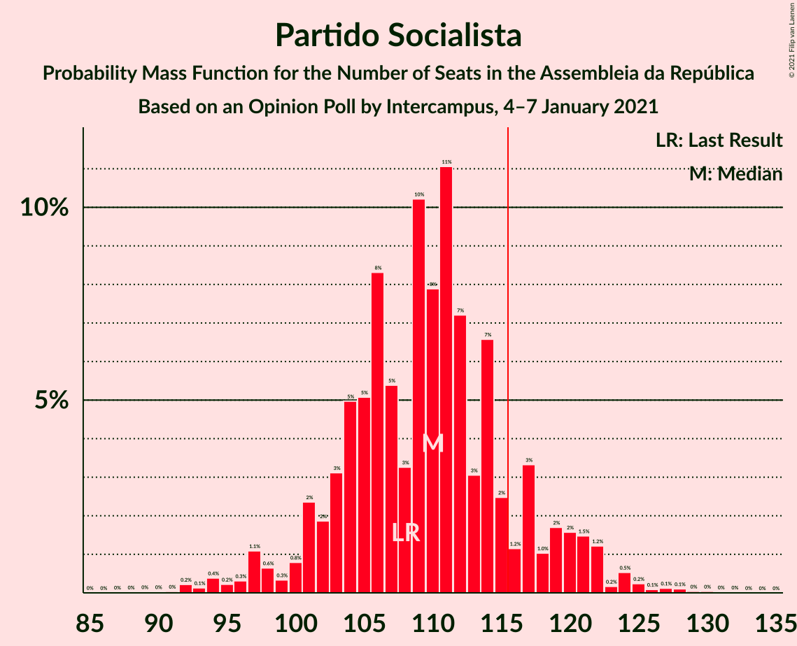

# Opinion Poll by Intercampus, 4–7 January 2021

<a href="#voting-intentions">Voting Intentions</a> | <a href="#seats">Seats</a> | <a href="#coalitions">Coalitions</a> | <a href="#technical-information">Technical Information</a>

## Voting Intentions

### Confidence Intervals

| Party | Last Result | Poll Result | 80% Confidence Interval | 90% Confidence Interval | 95% Confidence Interval | 99% Confidence Interval |
|:-----:|:-----------:|:-----------:|:-----------------------:|:-----------------------:|:-----------------------:|:-----------------------:|
| Partido Socialista | 36.4% | 38.0% | 35.5–40.6% |34.8–41.3% |34.2–41.9% |33.0–43.2% |
| Partido Social Democrata | 27.8% | 24.0% | 21.9–26.4% |21.3–27.1% |20.8–27.6% |19.8–28.8% |
| Bloco de Esquerda | 9.5% | 9.1% | 7.8–10.8% |7.4–11.3% |7.1–11.7% |6.5–12.5% |
| Chega | 1.3% | 9.1% | 7.8–10.8% |7.4–11.3% |7.1–11.7% |6.5–12.5% |
| Coligação Democrática Unitária | 6.3% | 5.6% | 4.6–7.0% |4.3–7.4% |4.1–7.8% |3.6–8.5% |
| Iniciativa Liberal | 1.3% | 3.8% | 3.0–5.0% |2.7–5.4% |2.6–5.7% |2.2–6.3% |
| Pessoas–Animais–Natureza | 3.3% | 3.6% | 2.8–4.8% |2.6–5.2% |2.4–5.5% |2.1–6.1% |
| CDS–Partido Popular | 4.2% | 2.3% | 1.7–3.3% |1.5–3.6% |1.4–3.9% |1.1–4.4% |
| LIVRE | 1.1% | 0.2% | 0.1–0.7% |0.0–0.8% |0.0–0.9% |0.0–1.2% |

*Note:* The poll result column reflects the actual value used in the calculations. Published results may vary slightly, and in addition be rounded to fewer digits.

## Seats

### Confidence Intervals

| Party | Last Result | Median | 80% Confidence Interval | 90% Confidence Interval | 95% Confidence Interval | 99% Confidence Interval |
|:-----:|:-----------:|:------:|:-----------------------:|:-----------------------:|:-----------------------:|:-----------------------:|
| <a href="#partido-socialista">Partido Socialista</a> | 108 | 111 | 106–116 |103–119 |101–120 |92–125 |
| <a href="#partido-social-democrata">Partido Social Democrata</a> | 79 | 66 | 60–70 |58–74 |57–76 |53–79 |
| <a href="#bloco-de-esquerda">Bloco de Esquerda</a> | 19 | 16 | 14–20 |13–22 |13–24 |11–27 |
| <a href="#chega">Chega</a> | 1 | 16 | 14–21 |12–23 |11–24 |11–27 |
| <a href="#coligação-democrática-unitária">Coligação Democrática Unitária</a> | 12 | 14 | 6–14 |6–14 |5–15 |5–16 |
| <a href="#iniciativa-liberal">Iniciativa Liberal</a> | 1 | 5 | 3–6 |3–6 |3–9 |3–12 |
| <a href="#pessoas–animais–natureza">Pessoas–Animais–Natureza</a> | 4 | 4 | 2–5 |2–6 |2–7 |1–9 |
| <a href="#cds–partido-popular">CDS–Partido Popular</a> | 5 | 1 | 0–2 |0–2 |0–3 |0–5 |
| <a href="#livre">LIVRE</a> | 1 | 0 | 0 |0 |0 |0–1 |

### Partido Socialista

*For a full overview of the results for this party, see the [Partido Socialista](party-partidosocialista.html) page.*

| Number of Seats | Probability | Accumulated | Special Marks |
|:---------------:|:-----------:|:-----------:|:-------------:|
| 89 | 0% | 100% |  |
| 90 | 0% | 99.9% |  |
| 91 | 0% | 99.9% |  |
| 92 | 0.5% | 99.9% |  |
| 93 | 0.1% | 99.4% |  |
| 94 | 0% | 99.3% |  |
| 95 | 0.1% | 99.2% |  |
| 96 | 0.1% | 99.1% |  |
| 97 | 0.5% | 99.0% |  |
| 98 | 0.3% | 98.5% |  |
| 99 | 0.2% | 98% |  |
| 100 | 0.2% | 98% |  |
| 101 | 2% | 98% |  |
| 102 | 0.3% | 96% |  |
| 103 | 1.2% | 96% |  |
| 104 | 2% | 95% |  |
| 105 | 3% | 93% |  |
| 106 | 4% | 90% |  |
| 107 | 3% | 86% |  |
| 108 | 4% | 83% | Last Result |
| 109 | 22% | 79% |  |
| 110 | 2% | 57% |  |
| 111 | 30% | 55% | Median |
| 112 | 7% | 25% |  |
| 113 | 1.4% | 18% |  |
| 114 | 5% | 17% |  |
| 115 | 2% | 12% |  |
| 116 | 0.7% | 10% | Majority |
| 117 | 1.0% | 10% |  |
| 118 | 0.7% | 9% |  |
| 119 | 4% | 8% |  |
| 120 | 2% | 4% |  |
| 121 | 0.5% | 2% |  |
| 122 | 0.3% | 1.4% |  |
| 123 | 0% | 1.0% |  |
| 124 | 0.4% | 1.0% |  |
| 125 | 0.4% | 0.6% |  |
| 126 | 0% | 0.2% |  |
| 127 | 0.1% | 0.1% |  |
| 128 | 0% | 0.1% |  |
| 129 | 0% | 0% |  |

### Partido Social Democrata

*For a full overview of the results for this party, see the [Partido Social Democrata](party-partidosocialdemocrata.html) page.*

| Number of Seats | Probability | Accumulated | Special Marks |
|:---------------:|:-----------:|:-----------:|:-------------:|
| 51 | 0% | 100% |  |
| 52 | 0.2% | 99.9% |  |
| 53 | 0.5% | 99.8% |  |
| 54 | 0.2% | 99.2% |  |
| 55 | 0.4% | 99.1% |  |
| 56 | 0.3% | 98.7% |  |
| 57 | 2% | 98% |  |
| 58 | 4% | 96% |  |
| 59 | 1.3% | 92% |  |
| 60 | 1.3% | 91% |  |
| 61 | 0.6% | 89% |  |
| 62 | 10% | 89% |  |
| 63 | 2% | 79% |  |
| 64 | 3% | 77% |  |
| 65 | 22% | 74% |  |
| 66 | 29% | 52% | Median |
| 67 | 3% | 23% |  |
| 68 | 1.3% | 20% |  |
| 69 | 5% | 19% |  |
| 70 | 6% | 14% |  |
| 71 | 0.4% | 8% |  |
| 72 | 2% | 8% |  |
| 73 | 0.7% | 6% |  |
| 74 | 0.4% | 5% |  |
| 75 | 2% | 5% |  |
| 76 | 1.1% | 3% |  |
| 77 | 0.9% | 2% |  |
| 78 | 0.1% | 0.6% |  |
| 79 | 0.1% | 0.6% | Last Result |
| 80 | 0.2% | 0.5% |  |
| 81 | 0.1% | 0.2% |  |
| 82 | 0% | 0.1% |  |
| 83 | 0% | 0.1% |  |
| 84 | 0% | 0.1% |  |
| 85 | 0% | 0.1% |  |
| 86 | 0% | 0% |  |

### Bloco de Esquerda

*For a full overview of the results for this party, see the [Bloco de Esquerda](party-blocodeesquerda.html) page.*

| Number of Seats | Probability | Accumulated | Special Marks |
|:---------------:|:-----------:|:-----------:|:-------------:|
| 10 | 0% | 100% |  |
| 11 | 1.4% | 99.9% |  |
| 12 | 0.7% | 98% |  |
| 13 | 5% | 98% |  |
| 14 | 12% | 93% |  |
| 15 | 26% | 81% |  |
| 16 | 29% | 55% | Median |
| 17 | 5% | 25% |  |
| 18 | 6% | 21% |  |
| 19 | 0.4% | 15% | Last Result |
| 20 | 8% | 15% |  |
| 21 | 0.6% | 6% |  |
| 22 | 2% | 6% |  |
| 23 | 1.1% | 4% |  |
| 24 | 0.4% | 3% |  |
| 25 | 0.6% | 2% |  |
| 26 | 0.7% | 2% |  |
| 27 | 0.7% | 1.1% |  |
| 28 | 0% | 0.4% |  |
| 29 | 0.3% | 0.3% |  |
| 30 | 0% | 0.1% |  |
| 31 | 0% | 0.1% |  |
| 32 | 0% | 0% |  |

### Chega

*For a full overview of the results for this party, see the [Chega](party-chega.html) page.*

| Number of Seats | Probability | Accumulated | Special Marks |
|:---------------:|:-----------:|:-----------:|:-------------:|
| 1 | 0% | 100% | Last Result |
| 2 | 0% | 100% |  |
| 3 | 0% | 100% |  |
| 4 | 0% | 100% |  |
| 5 | 0% | 100% |  |
| 6 | 0% | 100% |  |
| 7 | 0% | 100% |  |
| 8 | 0% | 100% |  |
| 9 | 0.4% | 100% |  |
| 10 | 0.1% | 99.6% |  |
| 11 | 3% | 99.5% |  |
| 12 | 1.4% | 96% |  |
| 13 | 2% | 95% |  |
| 14 | 38% | 92% |  |
| 15 | 2% | 55% |  |
| 16 | 22% | 52% | Median |
| 17 | 0.8% | 31% |  |
| 18 | 14% | 30% |  |
| 19 | 3% | 15% |  |
| 20 | 0.6% | 13% |  |
| 21 | 5% | 12% |  |
| 22 | 2% | 7% |  |
| 23 | 2% | 5% |  |
| 24 | 2% | 3% |  |
| 25 | 0.3% | 1.4% |  |
| 26 | 0.6% | 1.1% |  |
| 27 | 0.3% | 0.5% |  |
| 28 | 0.1% | 0.3% |  |
| 29 | 0% | 0.2% |  |
| 30 | 0% | 0.1% |  |
| 31 | 0.1% | 0.1% |  |
| 32 | 0% | 0% |  |

### Coligação Democrática Unitária

*For a full overview of the results for this party, see the [Coligação Democrática Unitária](party-coligaçãodemocráticaunitária.html) page.*

| Number of Seats | Probability | Accumulated | Special Marks |
|:---------------:|:-----------:|:-----------:|:-------------:|
| 4 | 0.2% | 100% |  |
| 5 | 3% | 99.7% |  |
| 6 | 10% | 97% |  |
| 7 | 8% | 87% |  |
| 8 | 5% | 80% |  |
| 9 | 0.8% | 75% |  |
| 10 | 6% | 74% |  |
| 11 | 0.8% | 68% |  |
| 12 | 3% | 67% | Last Result |
| 13 | 11% | 64% |  |
| 14 | 48% | 53% | Median |
| 15 | 4% | 5% |  |
| 16 | 0.8% | 1.1% |  |
| 17 | 0.2% | 0.3% |  |
| 18 | 0.1% | 0.1% |  |
| 19 | 0% | 0% |  |

### Iniciativa Liberal

*For a full overview of the results for this party, see the [Iniciativa Liberal](party-iniciativaliberal.html) page.*

| Number of Seats | Probability | Accumulated | Special Marks |
|:---------------:|:-----------:|:-----------:|:-------------:|
| 1 | 0% | 100% | Last Result |
| 2 | 0.1% | 100% |  |
| 3 | 15% | 99.9% |  |
| 4 | 25% | 85% |  |
| 5 | 36% | 60% | Median |
| 6 | 20% | 24% |  |
| 7 | 0.7% | 4% |  |
| 8 | 0.6% | 3% |  |
| 9 | 0.3% | 3% |  |
| 10 | 0.1% | 2% |  |
| 11 | 1.5% | 2% |  |
| 12 | 0.8% | 0.8% |  |
| 13 | 0% | 0% |  |

### Pessoas–Animais–Natureza

*For a full overview of the results for this party, see the [Pessoas–Animais–Natureza](party-pessoas–animais–natureza.html) page.*

| Number of Seats | Probability | Accumulated | Special Marks |
|:---------------:|:-----------:|:-----------:|:-------------:|
| 1 | 0.6% | 100% |  |
| 2 | 10% | 99.3% |  |
| 3 | 20% | 89% |  |
| 4 | 49% | 69% | Last Result, Median |
| 5 | 11% | 20% |  |
| 6 | 5% | 10% |  |
| 7 | 2% | 4% |  |
| 8 | 2% | 2% |  |
| 9 | 0.4% | 0.8% |  |
| 10 | 0.2% | 0.4% |  |
| 11 | 0.2% | 0.2% |  |
| 12 | 0% | 0% |  |

### CDS–Partido Popular

*For a full overview of the results for this party, see the [CDS–Partido Popular](party-cds–partidopopular.html) page.*

| Number of Seats | Probability | Accumulated | Special Marks |
|:---------------:|:-----------:|:-----------:|:-------------:|
| 0 | 19% | 100% |  |
| 1 | 45% | 81% | Median |
| 2 | 31% | 36% |  |
| 3 | 3% | 4% |  |
| 4 | 0.4% | 1.2% |  |
| 5 | 0.8% | 0.8% | Last Result |
| 6 | 0% | 0% |  |

### LIVRE

*For a full overview of the results for this party, see the [LIVRE](party-livre.html) page.*

| Number of Seats | Probability | Accumulated | Special Marks |
|:---------------:|:-----------:|:-----------:|:-------------:|
| 0 | 98% | 100% | Median |
| 1 | 2% | 2% | Last Result |
| 2 | 0% | 0% |  |

## Coalitions

### Confidence Intervals

| Coalition | Last Result | Median | Majority? | 80% Confidence Interval | 90% Confidence Interval | 95% Confidence Interval | 99% Confidence Interval |
|:---------:|:-----------:|:------:|:---------:|:-----------------------:|:-----------------------:|:-----------------------:|:-----------------------:|
| Partido Socialista – Bloco de Esquerda – Coligação Democrática Unitária | 139 | 138 | 100% | 132–144 | 127–144 | 126–147 | 122–152 |
| Partido Socialista – Bloco de Esquerda | 127 | 127 | 98% | 122–132 | 120–134 | 118–138 | 110–142 |
| Partido Socialista – Coligação Democrática Unitária | 120 | 123 | 88% | 115–126 | 112–129 | 108–131 | 103–134 |
| Partido Socialista | 108 | 111 | 10% | 106–116 | 103–119 | 101–120 | 92–125 |
| Partido Social Democrata – CDS–Partido Popular | 84 | 67 | 0% | 62–71 | 59–75 | 58–77 | 54–81 |

### Partido Socialista – Bloco de Esquerda – Coligação Democrática Unitária

| Number of Seats | Probability | Accumulated | Special Marks |
|:---------------:|:-----------:|:-----------:|:-------------:|
| 116 | 0.2% | 100% | Majority |
| 117 | 0% | 99.8% |  |
| 118 | 0% | 99.8% |  |
| 119 | 0.1% | 99.8% |  |
| 120 | 0% | 99.7% |  |
| 121 | 0.2% | 99.7% |  |
| 122 | 0.7% | 99.5% |  |
| 123 | 0.1% | 98.9% |  |
| 124 | 0.5% | 98.8% |  |
| 125 | 0.8% | 98% |  |
| 126 | 0.6% | 98% |  |
| 127 | 2% | 97% |  |
| 128 | 2% | 95% |  |
| 129 | 1.3% | 93% |  |
| 130 | 0.2% | 92% |  |
| 131 | 0.4% | 92% |  |
| 132 | 5% | 91% |  |
| 133 | 2% | 86% |  |
| 134 | 0.9% | 84% |  |
| 135 | 3% | 83% |  |
| 136 | 6% | 80% |  |
| 137 | 2% | 74% |  |
| 138 | 25% | 72% |  |
| 139 | 1.0% | 47% | Last Result |
| 140 | 2% | 46% |  |
| 141 | 23% | 43% | Median |
| 142 | 3% | 20% |  |
| 143 | 1.3% | 16% |  |
| 144 | 11% | 15% |  |
| 145 | 0.3% | 4% |  |
| 146 | 0.4% | 4% |  |
| 147 | 0.9% | 3% |  |
| 148 | 0.5% | 2% |  |
| 149 | 0.3% | 2% |  |
| 150 | 0.9% | 2% |  |
| 151 | 0.2% | 0.8% |  |
| 152 | 0.5% | 0.6% |  |
| 153 | 0% | 0.1% |  |
| 154 | 0% | 0% |  |

### Partido Socialista – Bloco de Esquerda

| Number of Seats | Probability | Accumulated | Special Marks |
|:---------------:|:-----------:|:-----------:|:-------------:|
| 107 | 0% | 100% |  |
| 108 | 0% | 99.9% |  |
| 109 | 0% | 99.9% |  |
| 110 | 0.5% | 99.9% |  |
| 111 | 0.2% | 99.4% |  |
| 112 | 0.1% | 99.2% |  |
| 113 | 0.1% | 99.1% |  |
| 114 | 0.5% | 99.0% |  |
| 115 | 0.1% | 98.5% |  |
| 116 | 0.1% | 98% | Majority |
| 117 | 0.7% | 98% |  |
| 118 | 0.6% | 98% |  |
| 119 | 2% | 97% |  |
| 120 | 1.4% | 96% |  |
| 121 | 4% | 94% |  |
| 122 | 3% | 90% |  |
| 123 | 3% | 87% |  |
| 124 | 23% | 84% |  |
| 125 | 0.8% | 61% |  |
| 126 | 7% | 60% |  |
| 127 | 22% | 53% | Last Result, Median |
| 128 | 3% | 31% |  |
| 129 | 4% | 27% |  |
| 130 | 3% | 24% |  |
| 131 | 9% | 21% |  |
| 132 | 3% | 12% |  |
| 133 | 2% | 9% |  |
| 134 | 2% | 7% |  |
| 135 | 1.0% | 5% |  |
| 136 | 0.4% | 4% |  |
| 137 | 0.6% | 3% |  |
| 138 | 0.3% | 3% |  |
| 139 | 0.6% | 2% |  |
| 140 | 0.1% | 2% |  |
| 141 | 0.1% | 2% |  |
| 142 | 1.3% | 2% |  |
| 143 | 0% | 0.2% |  |
| 144 | 0.2% | 0.2% |  |
| 145 | 0% | 0% |  |

### Partido Socialista – Coligação Democrática Unitária

| Number of Seats | Probability | Accumulated | Special Marks |
|:---------------:|:-----------:|:-----------:|:-------------:|
| 98 | 0.1% | 100% |  |
| 99 | 0% | 99.9% |  |
| 100 | 0% | 99.9% |  |
| 101 | 0.1% | 99.9% |  |
| 102 | 0.1% | 99.8% |  |
| 103 | 0.2% | 99.7% |  |
| 104 | 0.5% | 99.5% |  |
| 105 | 0.1% | 99.0% |  |
| 106 | 0.1% | 98.9% |  |
| 107 | 0.5% | 98.8% |  |
| 108 | 0.9% | 98% |  |
| 109 | 0.2% | 97% |  |
| 110 | 2% | 97% |  |
| 111 | 0.6% | 96% |  |
| 112 | 1.4% | 95% |  |
| 113 | 2% | 94% |  |
| 114 | 1.5% | 92% |  |
| 115 | 2% | 91% |  |
| 116 | 0.9% | 88% | Majority |
| 117 | 0.6% | 87% |  |
| 118 | 5% | 87% |  |
| 119 | 2% | 82% |  |
| 120 | 3% | 80% | Last Result |
| 121 | 8% | 78% |  |
| 122 | 4% | 69% |  |
| 123 | 22% | 65% |  |
| 124 | 10% | 44% |  |
| 125 | 23% | 33% | Median |
| 126 | 4% | 10% |  |
| 127 | 0.4% | 7% |  |
| 128 | 0.8% | 6% |  |
| 129 | 2% | 6% |  |
| 130 | 0.4% | 4% |  |
| 131 | 2% | 3% |  |
| 132 | 0.1% | 1.4% |  |
| 133 | 0.6% | 1.3% |  |
| 134 | 0.5% | 0.8% |  |
| 135 | 0.1% | 0.2% |  |
| 136 | 0.1% | 0.2% |  |
| 137 | 0% | 0.1% |  |
| 138 | 0% | 0% |  |

### Partido Socialista

| Number of Seats | Probability | Accumulated | Special Marks |
|:---------------:|:-----------:|:-----------:|:-------------:|
| 89 | 0% | 100% |  |
| 90 | 0% | 99.9% |  |
| 91 | 0% | 99.9% |  |
| 92 | 0.5% | 99.9% |  |
| 93 | 0.1% | 99.4% |  |
| 94 | 0% | 99.3% |  |
| 95 | 0.1% | 99.2% |  |
| 96 | 0.1% | 99.1% |  |
| 97 | 0.5% | 99.0% |  |
| 98 | 0.3% | 98.5% |  |
| 99 | 0.2% | 98% |  |
| 100 | 0.2% | 98% |  |
| 101 | 2% | 98% |  |
| 102 | 0.3% | 96% |  |
| 103 | 1.2% | 96% |  |
| 104 | 2% | 95% |  |
| 105 | 3% | 93% |  |
| 106 | 4% | 90% |  |
| 107 | 3% | 86% |  |
| 108 | 4% | 83% | Last Result |
| 109 | 22% | 79% |  |
| 110 | 2% | 57% |  |
| 111 | 30% | 55% | Median |
| 112 | 7% | 25% |  |
| 113 | 1.4% | 18% |  |
| 114 | 5% | 17% |  |
| 115 | 2% | 12% |  |
| 116 | 0.7% | 10% | Majority |
| 117 | 1.0% | 10% |  |
| 118 | 0.7% | 9% |  |
| 119 | 4% | 8% |  |
| 120 | 2% | 4% |  |
| 121 | 0.5% | 2% |  |
| 122 | 0.3% | 1.4% |  |
| 123 | 0% | 1.0% |  |
| 124 | 0.4% | 1.0% |  |
| 125 | 0.4% | 0.6% |  |
| 126 | 0% | 0.2% |  |
| 127 | 0.1% | 0.1% |  |
| 128 | 0% | 0.1% |  |
| 129 | 0% | 0% |  |

### Partido Social Democrata – CDS–Partido Popular

| Number of Seats | Probability | Accumulated | Special Marks |
|:---------------:|:-----------:|:-----------:|:-------------:|
| 52 | 0% | 100% |  |
| 53 | 0.4% | 99.9% |  |
| 54 | 0.2% | 99.6% |  |
| 55 | 0.2% | 99.4% |  |
| 56 | 0.2% | 99.2% |  |
| 57 | 0.5% | 99.0% |  |
| 58 | 2% | 98.5% |  |
| 59 | 4% | 96% |  |
| 60 | 0.7% | 92% |  |
| 61 | 0.3% | 92% |  |
| 62 | 10% | 91% |  |
| 63 | 2% | 82% |  |
| 64 | 2% | 80% |  |
| 65 | 3% | 78% |  |
| 66 | 24% | 75% |  |
| 67 | 3% | 51% | Median |
| 68 | 27% | 48% |  |
| 69 | 2% | 21% |  |
| 70 | 7% | 19% |  |
| 71 | 3% | 12% |  |
| 72 | 1.4% | 10% |  |
| 73 | 2% | 8% |  |
| 74 | 0.9% | 6% |  |
| 75 | 0.9% | 5% |  |
| 76 | 0.1% | 4% |  |
| 77 | 4% | 4% |  |
| 78 | 0% | 0.7% |  |
| 79 | 0.1% | 0.7% |  |
| 80 | 0.1% | 0.6% |  |
| 81 | 0.3% | 0.5% |  |
| 82 | 0.1% | 0.3% |  |
| 83 | 0% | 0.1% |  |
| 84 | 0% | 0.1% | Last Result |
| 85 | 0% | 0.1% |  |
| 86 | 0% | 0.1% |  |
| 87 | 0% | 0% |  |

## Technical Information

### Opinion Poll

+ **Polling firm:** Intercampus
+ **Commissioner(s):** —
+ **Fieldwork period:** 4–7 January 2021

### Calculations

+ **Sample size:** 603
+ **Simulations done:** 131,072
+ **Error estimate:** 1.51%

