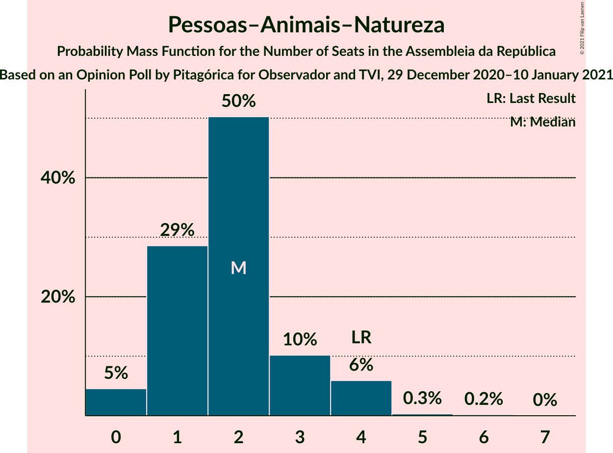
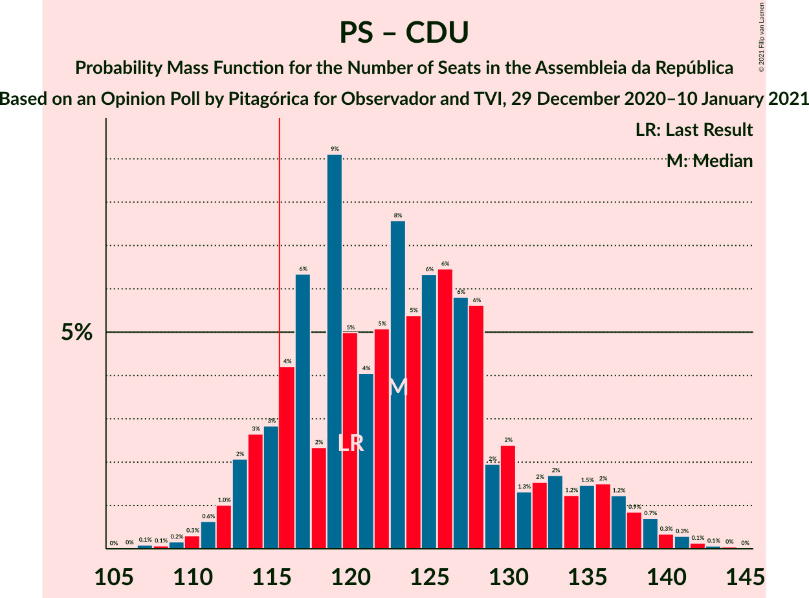

# Opinion Poll by Pitagórica for Observador and TVI, 29 December 2020–10 January 2021

<a href="#voting-intentions">Voting Intentions</a> | <a href="#seats">Seats</a> | <a href="#coalitions">Coalitions</a> | <a href="#technical-information">Technical Information</a>

## Voting Intentions

### Confidence Intervals

| Party | Last Result | Poll Result | 80% Confidence Interval | 90% Confidence Interval | 95% Confidence Interval | 99% Confidence Interval |
|:-----:|:-----------:|:-----------:|:-----------------------:|:-----------------------:|:-----------------------:|:-----------------------:|
| Partido Socialista | 36.4% | 41.3% | 38.9–43.9% |38.1–44.6% |37.5–45.2% |36.4–46.5% |
| Partido Social Democrata | 27.8% | 28.0% | 25.8–30.4% |25.1–31.0% |24.6–31.6% |23.6–32.8% |
| Bloco de Esquerda | 9.5% | 7.2% | 6.0–8.6% |5.7–9.1% |5.4–9.4% |4.9–10.2% |
| Chega | 1.3% | 5.9% | 4.8–7.3% |4.5–7.7% |4.3–8.0% |3.8–8.7% |
| Coligação Democrática Unitária | 6.3% | 5.1% | 4.1–6.4% |3.9–6.8% |3.6–7.1% |3.2–7.8% |
| Iniciativa Liberal | 1.3% | 4.1% | 3.3–5.3% |3.0–5.7% |2.8–6.0% |2.5–6.6% |
| Pessoas–Animais–Natureza | 3.3% | 2.2% | 1.6–3.2% |1.5–3.5% |1.3–3.7% |1.1–4.2% |
| CDS–Partido Popular | 4.2% | 1.3% | 0.9–2.1% |0.7–2.3% |0.6–2.5% |0.5–2.9% |

*Note:* The poll result column reflects the actual value used in the calculations. Published results may vary slightly, and in addition be rounded to fewer digits.

## Seats

### Confidence Intervals

| Party | Last Result | Median | 80% Confidence Interval | 90% Confidence Interval | 95% Confidence Interval | 99% Confidence Interval |
|:-----:|:-----------:|:------:|:-----------------------:|:-----------------------:|:-----------------------:|:-----------------------:|
| <a href="#partido-socialista">Partido Socialista</a> | 108 | 115 | 110–119 |109–121 |108–129 |106–133 |
| <a href="#partido-social-democrata">Partido Social Democrata</a> | 79 | 76 | 72–81 |69–83 |65–84 |61–87 |
| <a href="#bloco-de-esquerda">Bloco de Esquerda</a> | 19 | 13 | 8–16 |7–18 |7–18 |7–20 |
| <a href="#chega">Chega</a> | 1 | 8 | 6–11 |4–11 |4–12 |3–14 |
| <a href="#coligação-democrática-unitária">Coligação Democrática Unitária</a> | 12 | 7 | 6–10 |5–13 |5–13 |4–15 |
| <a href="#iniciativa-liberal">Iniciativa Liberal</a> | 1 | 6 | 4–8 |4–9 |3–9 |3–12 |
| <a href="#pessoas–animais–natureza">Pessoas–Animais–Natureza</a> | 4 | 2 | 1–3 |1–4 |0–4 |0–5 |
| <a href="#cds–partido-popular">CDS–Partido Popular</a> | 5 | 0 | 0–1 |0–1 |0–1 |0–2 |

### Partido Socialista

*For a full overview of the results for this party, see the [Partido Socialista](party-partidosocialista.html) page.*

| Number of Seats | Probability | Accumulated | Special Marks |
|:---------------:|:-----------:|:-----------:|:-------------:|
| 95 | 0% | 100% |  |
| 96 | 0% | 99.9% |  |
| 97 | 0% | 99.9% |  |
| 98 | 0% | 99.9% |  |
| 99 | 0.1% | 99.9% |  |
| 100 | 0% | 99.9% |  |
| 101 | 0% | 99.8% |  |
| 102 | 0% | 99.8% |  |
| 103 | 0% | 99.8% |  |
| 104 | 0% | 99.7% |  |
| 105 | 0.1% | 99.7% |  |
| 106 | 0.5% | 99.6% |  |
| 107 | 1.1% | 99.1% |  |
| 108 | 2% | 98% | Last Result |
| 109 | 3% | 96% |  |
| 110 | 4% | 93% |  |
| 111 | 3% | 90% |  |
| 112 | 7% | 86% |  |
| 113 | 16% | 79% |  |
| 114 | 2% | 64% |  |
| 115 | 14% | 62% | Median |
| 116 | 19% | 48% | Majority |
| 117 | 5% | 28% |  |
| 118 | 8% | 23% |  |
| 119 | 9% | 16% |  |
| 120 | 2% | 7% |  |
| 121 | 1.2% | 5% |  |
| 122 | 0.3% | 4% |  |
| 123 | 0.2% | 4% |  |
| 124 | 0.1% | 3% |  |
| 125 | 0.1% | 3% |  |
| 126 | 0.1% | 3% |  |
| 127 | 0.2% | 3% |  |
| 128 | 0.2% | 3% |  |
| 129 | 0.7% | 3% |  |
| 130 | 0.1% | 2% |  |
| 131 | 0.2% | 2% |  |
| 132 | 0.1% | 2% |  |
| 133 | 1.0% | 2% |  |
| 134 | 0.2% | 0.5% |  |
| 135 | 0.1% | 0.3% |  |
| 136 | 0.1% | 0.2% |  |
| 137 | 0.1% | 0.1% |  |
| 138 | 0% | 0% |  |

### Partido Social Democrata

*For a full overview of the results for this party, see the [Partido Social Democrata](party-partidosocialdemocrata.html) page.*

| Number of Seats | Probability | Accumulated | Special Marks |
|:---------------:|:-----------:|:-----------:|:-------------:|
| 57 | 0% | 100% |  |
| 58 | 0% | 99.9% |  |
| 59 | 0.1% | 99.9% |  |
| 60 | 0.1% | 99.8% |  |
| 61 | 0.3% | 99.7% |  |
| 62 | 0.5% | 99.5% |  |
| 63 | 0.4% | 98.9% |  |
| 64 | 0.3% | 98.5% |  |
| 65 | 1.1% | 98% |  |
| 66 | 0.3% | 97% |  |
| 67 | 0.6% | 97% |  |
| 68 | 0.6% | 96% |  |
| 69 | 1.0% | 96% |  |
| 70 | 3% | 95% |  |
| 71 | 1.4% | 91% |  |
| 72 | 6% | 90% |  |
| 73 | 2% | 84% |  |
| 74 | 1.5% | 82% |  |
| 75 | 10% | 81% |  |
| 76 | 28% | 71% | Median |
| 77 | 4% | 43% |  |
| 78 | 9% | 39% |  |
| 79 | 4% | 30% | Last Result |
| 80 | 15% | 26% |  |
| 81 | 3% | 11% |  |
| 82 | 2% | 8% |  |
| 83 | 2% | 6% |  |
| 84 | 2% | 4% |  |
| 85 | 0.9% | 2% |  |
| 86 | 0.7% | 1.4% |  |
| 87 | 0.4% | 0.7% |  |
| 88 | 0.1% | 0.3% |  |
| 89 | 0% | 0.2% |  |
| 90 | 0% | 0.2% |  |
| 91 | 0% | 0.1% |  |
| 92 | 0% | 0.1% |  |
| 93 | 0% | 0.1% |  |
| 94 | 0% | 0% |  |

### Bloco de Esquerda

*For a full overview of the results for this party, see the [Bloco de Esquerda](party-blocodeesquerda.html) page.*

| Number of Seats | Probability | Accumulated | Special Marks |
|:---------------:|:-----------:|:-----------:|:-------------:|
| 6 | 0.1% | 100% |  |
| 7 | 6% | 99.9% |  |
| 8 | 5% | 94% |  |
| 9 | 5% | 89% |  |
| 10 | 4% | 84% |  |
| 11 | 8% | 80% |  |
| 12 | 6% | 73% |  |
| 13 | 25% | 67% | Median |
| 14 | 5% | 41% |  |
| 15 | 23% | 36% |  |
| 16 | 6% | 13% |  |
| 17 | 1.2% | 7% |  |
| 18 | 4% | 6% |  |
| 19 | 1.0% | 2% | Last Result |
| 20 | 0.3% | 0.6% |  |
| 21 | 0.2% | 0.3% |  |
| 22 | 0.1% | 0.1% |  |
| 23 | 0% | 0% |  |

### Chega

*For a full overview of the results for this party, see the [Chega](party-chega.html) page.*

| Number of Seats | Probability | Accumulated | Special Marks |
|:---------------:|:-----------:|:-----------:|:-------------:|
| 1 | 0% | 100% | Last Result |
| 2 | 0% | 100% |  |
| 3 | 0.5% | 100% |  |
| 4 | 4% | 99.4% |  |
| 5 | 2% | 95% |  |
| 6 | 4% | 93% |  |
| 7 | 2% | 89% |  |
| 8 | 41% | 87% | Median |
| 9 | 4% | 46% |  |
| 10 | 6% | 43% |  |
| 11 | 33% | 36% |  |
| 12 | 0.5% | 3% |  |
| 13 | 0.4% | 2% |  |
| 14 | 2% | 2% |  |
| 15 | 0.1% | 0.2% |  |
| 16 | 0% | 0.1% |  |
| 17 | 0% | 0.1% |  |
| 18 | 0% | 0.1% |  |
| 19 | 0% | 0% |  |

### Coligação Democrática Unitária

*For a full overview of the results for this party, see the [Coligação Democrática Unitária](party-coligaçãodemocráticaunitária.html) page.*

| Number of Seats | Probability | Accumulated | Special Marks |
|:---------------:|:-----------:|:-----------:|:-------------:|
| 2 | 0.1% | 100% |  |
| 3 | 0.4% | 99.9% |  |
| 4 | 0.4% | 99.6% |  |
| 5 | 9% | 99.2% |  |
| 6 | 20% | 91% |  |
| 7 | 24% | 71% | Median |
| 8 | 23% | 46% |  |
| 9 | 4% | 24% |  |
| 10 | 10% | 20% |  |
| 11 | 1.1% | 9% |  |
| 12 | 3% | 8% | Last Result |
| 13 | 3% | 5% |  |
| 14 | 1.3% | 2% |  |
| 15 | 1.0% | 1.2% |  |
| 16 | 0.1% | 0.2% |  |
| 17 | 0% | 0% |  |

### Iniciativa Liberal

*For a full overview of the results for this party, see the [Iniciativa Liberal](party-iniciativaliberal.html) page.*

| Number of Seats | Probability | Accumulated | Special Marks |
|:---------------:|:-----------:|:-----------:|:-------------:|
| 1 | 0% | 100% | Last Result |
| 2 | 0% | 100% |  |
| 3 | 3% | 100% |  |
| 4 | 24% | 97% |  |
| 5 | 10% | 73% |  |
| 6 | 47% | 63% | Median |
| 7 | 3% | 15% |  |
| 8 | 6% | 12% |  |
| 9 | 4% | 6% |  |
| 10 | 0.9% | 2% |  |
| 11 | 0.1% | 1.2% |  |
| 12 | 1.0% | 1.1% |  |
| 13 | 0% | 0% |  |

### Pessoas–Animais–Natureza

*For a full overview of the results for this party, see the [Pessoas–Animais–Natureza](party-pessoas–animais–natureza.html) page.*

| Number of Seats | Probability | Accumulated | Special Marks |
|:---------------:|:-----------:|:-----------:|:-------------:|
| 0 | 4% | 100% |  |
| 1 | 32% | 96% |  |
| 2 | 52% | 65% | Median |
| 3 | 7% | 13% |  |
| 4 | 5% | 5% | Last Result |
| 5 | 0.5% | 0.7% |  |
| 6 | 0.2% | 0.2% |  |
| 7 | 0% | 0% |  |

### CDS–Partido Popular

*For a full overview of the results for this party, see the [CDS–Partido Popular](party-cds–partidopopular.html) page.*

| Number of Seats | Probability | Accumulated | Special Marks |
|:---------------:|:-----------:|:-----------:|:-------------:|
| 0 | 83% | 100% | Median |
| 1 | 16% | 17% |  |
| 2 | 0.9% | 1.0% |  |
| 3 | 0% | 0.1% |  |
| 4 | 0% | 0% |  |
| 5 | 0% | 0% | Last Result |

## Coalitions

### Confidence Intervals

| Coalition | Last Result | Median | Majority? | 80% Confidence Interval | 90% Confidence Interval | 95% Confidence Interval | 99% Confidence Interval |
|:---------:|:-----------:|:------:|:---------:|:-----------------------:|:-----------------------:|:-----------------------:|:-----------------------:|
| Partido Socialista – Bloco de Esquerda – Coligação Democrática Unitária | 139 | 136 | 100% | 131–141 | 128–144 | 127–147 | 125–152 |
| Partido Socialista – Bloco de Esquerda | 127 | 128 | 99.8% | 123–133 | 121–134 | 120–141 | 118–146 |
| Partido Socialista – Coligação Democrática Unitária | 120 | 123 | 96% | 118–128 | 116–130 | 113–135 | 112–140 |
| Partido Socialista | 108 | 115 | 48% | 110–119 | 109–121 | 108–129 | 106–133 |
| Partido Social Democrata – CDS–Partido Popular | 84 | 77 | 0% | 72–81 | 69–83 | 65–85 | 62–87 |

### Partido Socialista – Bloco de Esquerda – Coligação Democrática Unitária

| Number of Seats | Probability | Accumulated | Special Marks |
|:---------------:|:-----------:|:-----------:|:-------------:|
| 119 | 0% | 100% |  |
| 120 | 0% | 99.9% |  |
| 121 | 0.1% | 99.9% |  |
| 122 | 0% | 99.9% |  |
| 123 | 0.1% | 99.8% |  |
| 124 | 0.2% | 99.7% |  |
| 125 | 0.5% | 99.5% |  |
| 126 | 0.2% | 99.0% |  |
| 127 | 2% | 98.7% |  |
| 128 | 2% | 97% |  |
| 129 | 3% | 94% |  |
| 130 | 0.3% | 92% |  |
| 131 | 4% | 91% |  |
| 132 | 1.1% | 87% |  |
| 133 | 7% | 86% |  |
| 134 | 17% | 78% |  |
| 135 | 8% | 61% | Median |
| 136 | 22% | 53% |  |
| 137 | 3% | 31% |  |
| 138 | 3% | 28% |  |
| 139 | 7% | 25% | Last Result |
| 140 | 4% | 18% |  |
| 141 | 6% | 15% |  |
| 142 | 0.9% | 9% |  |
| 143 | 3% | 8% |  |
| 144 | 2% | 5% |  |
| 145 | 0.4% | 4% |  |
| 146 | 0.2% | 3% |  |
| 147 | 0.9% | 3% |  |
| 148 | 0.3% | 2% |  |
| 149 | 0.7% | 2% |  |
| 150 | 0.5% | 1.2% |  |
| 151 | 0.1% | 0.7% |  |
| 152 | 0.3% | 0.6% |  |
| 153 | 0.1% | 0.3% |  |
| 154 | 0.1% | 0.2% |  |
| 155 | 0% | 0.1% |  |
| 156 | 0% | 0.1% |  |
| 157 | 0% | 0% |  |

### Partido Socialista – Bloco de Esquerda

| Number of Seats | Probability | Accumulated | Special Marks |
|:---------------:|:-----------:|:-----------:|:-------------:|
| 109 | 0% | 100% |  |
| 110 | 0% | 99.9% |  |
| 111 | 0% | 99.9% |  |
| 112 | 0% | 99.9% |  |
| 113 | 0% | 99.9% |  |
| 114 | 0% | 99.8% |  |
| 115 | 0% | 99.8% |  |
| 116 | 0.1% | 99.8% | Majority |
| 117 | 0.1% | 99.7% |  |
| 118 | 0.2% | 99.6% |  |
| 119 | 0.4% | 99.3% |  |
| 120 | 3% | 98.9% |  |
| 121 | 1.5% | 96% |  |
| 122 | 3% | 95% |  |
| 123 | 2% | 92% |  |
| 124 | 5% | 90% |  |
| 125 | 3% | 85% |  |
| 126 | 6% | 82% |  |
| 127 | 10% | 75% | Last Result |
| 128 | 30% | 65% | Median |
| 129 | 11% | 35% |  |
| 130 | 2% | 25% |  |
| 131 | 11% | 23% |  |
| 132 | 2% | 12% |  |
| 133 | 5% | 10% |  |
| 134 | 1.2% | 5% |  |
| 135 | 0.7% | 4% |  |
| 136 | 0.1% | 3% |  |
| 137 | 0.2% | 3% |  |
| 138 | 0.1% | 3% |  |
| 139 | 0.2% | 3% |  |
| 140 | 0.1% | 3% |  |
| 141 | 0.5% | 3% |  |
| 142 | 0.8% | 2% |  |
| 143 | 0.4% | 1.4% |  |
| 144 | 0.3% | 1.1% |  |
| 145 | 0.3% | 0.8% |  |
| 146 | 0.1% | 0.5% |  |
| 147 | 0.3% | 0.4% |  |
| 148 | 0.1% | 0.1% |  |
| 149 | 0% | 0.1% |  |
| 150 | 0% | 0% |  |

### Partido Socialista – Coligação Democrática Unitária

| Number of Seats | Probability | Accumulated | Special Marks |
|:---------------:|:-----------:|:-----------:|:-------------:|
| 106 | 0% | 100% |  |
| 107 | 0% | 99.9% |  |
| 108 | 0% | 99.9% |  |
| 109 | 0% | 99.9% |  |
| 110 | 0.1% | 99.8% |  |
| 111 | 0.1% | 99.8% |  |
| 112 | 0.8% | 99.7% |  |
| 113 | 2% | 99.0% |  |
| 114 | 0.4% | 97% |  |
| 115 | 0.9% | 97% |  |
| 116 | 3% | 96% | Majority |
| 117 | 2% | 92% |  |
| 118 | 2% | 90% |  |
| 119 | 15% | 88% |  |
| 120 | 3% | 73% | Last Result |
| 121 | 7% | 70% |  |
| 122 | 2% | 63% | Median |
| 123 | 19% | 61% |  |
| 124 | 6% | 42% |  |
| 125 | 7% | 36% |  |
| 126 | 14% | 29% |  |
| 127 | 1.1% | 14% |  |
| 128 | 5% | 13% |  |
| 129 | 3% | 9% |  |
| 130 | 1.3% | 6% |  |
| 131 | 0.4% | 5% |  |
| 132 | 0.4% | 4% |  |
| 133 | 0.4% | 4% |  |
| 134 | 0.8% | 3% |  |
| 135 | 0.1% | 3% |  |
| 136 | 0.6% | 2% |  |
| 137 | 0.1% | 2% |  |
| 138 | 1.0% | 2% |  |
| 139 | 0.2% | 0.7% |  |
| 140 | 0.1% | 0.6% |  |
| 141 | 0.3% | 0.4% |  |
| 142 | 0.1% | 0.2% |  |
| 143 | 0% | 0% |  |

### Partido Socialista

| Number of Seats | Probability | Accumulated | Special Marks |
|:---------------:|:-----------:|:-----------:|:-------------:|
| 95 | 0% | 100% |  |
| 96 | 0% | 99.9% |  |
| 97 | 0% | 99.9% |  |
| 98 | 0% | 99.9% |  |
| 99 | 0.1% | 99.9% |  |
| 100 | 0% | 99.9% |  |
| 101 | 0% | 99.8% |  |
| 102 | 0% | 99.8% |  |
| 103 | 0% | 99.8% |  |
| 104 | 0% | 99.7% |  |
| 105 | 0.1% | 99.7% |  |
| 106 | 0.5% | 99.6% |  |
| 107 | 1.1% | 99.1% |  |
| 108 | 2% | 98% | Last Result |
| 109 | 3% | 96% |  |
| 110 | 4% | 93% |  |
| 111 | 3% | 90% |  |
| 112 | 7% | 86% |  |
| 113 | 16% | 79% |  |
| 114 | 2% | 64% |  |
| 115 | 14% | 62% | Median |
| 116 | 19% | 48% | Majority |
| 117 | 5% | 28% |  |
| 118 | 8% | 23% |  |
| 119 | 9% | 16% |  |
| 120 | 2% | 7% |  |
| 121 | 1.2% | 5% |  |
| 122 | 0.3% | 4% |  |
| 123 | 0.2% | 4% |  |
| 124 | 0.1% | 3% |  |
| 125 | 0.1% | 3% |  |
| 126 | 0.1% | 3% |  |
| 127 | 0.2% | 3% |  |
| 128 | 0.2% | 3% |  |
| 129 | 0.7% | 3% |  |
| 130 | 0.1% | 2% |  |
| 131 | 0.2% | 2% |  |
| 132 | 0.1% | 2% |  |
| 133 | 1.0% | 2% |  |
| 134 | 0.2% | 0.5% |  |
| 135 | 0.1% | 0.3% |  |
| 136 | 0.1% | 0.2% |  |
| 137 | 0.1% | 0.1% |  |
| 138 | 0% | 0% |  |

### Partido Social Democrata – CDS–Partido Popular

| Number of Seats | Probability | Accumulated | Special Marks |
|:---------------:|:-----------:|:-----------:|:-------------:|
| 57 | 0% | 100% |  |
| 58 | 0% | 99.9% |  |
| 59 | 0.1% | 99.9% |  |
| 60 | 0.1% | 99.8% |  |
| 61 | 0.2% | 99.8% |  |
| 62 | 0.4% | 99.6% |  |
| 63 | 0.5% | 99.1% |  |
| 64 | 0.4% | 98.6% |  |
| 65 | 1.0% | 98% |  |
| 66 | 0.3% | 97% |  |
| 67 | 0.5% | 97% |  |
| 68 | 0.6% | 96% |  |
| 69 | 1.1% | 96% |  |
| 70 | 3% | 95% |  |
| 71 | 1.4% | 92% |  |
| 72 | 6% | 90% |  |
| 73 | 2% | 85% |  |
| 74 | 1.4% | 83% |  |
| 75 | 10% | 81% |  |
| 76 | 21% | 71% | Median |
| 77 | 11% | 51% |  |
| 78 | 10% | 40% |  |
| 79 | 3% | 30% |  |
| 80 | 15% | 26% |  |
| 81 | 4% | 12% |  |
| 82 | 1.4% | 8% |  |
| 83 | 1.4% | 6% |  |
| 84 | 2% | 5% | Last Result |
| 85 | 0.8% | 3% |  |
| 86 | 1.2% | 2% |  |
| 87 | 0.5% | 0.8% |  |
| 88 | 0.1% | 0.3% |  |
| 89 | 0.1% | 0.2% |  |
| 90 | 0% | 0.2% |  |
| 91 | 0.1% | 0.1% |  |
| 92 | 0% | 0.1% |  |
| 93 | 0% | 0.1% |  |
| 94 | 0% | 0% |  |

## Technical Information

### Opinion Poll

+ **Polling firm:** Pitagórica
+ **Commissioner(s):** Observador and TVI
+ **Fieldwork period:** 29 December 2020–10 January 2021

### Calculations

+ **Sample size:** 629
+ **Simulations done:** 131,072
+ **Error estimate:** 2.15%

