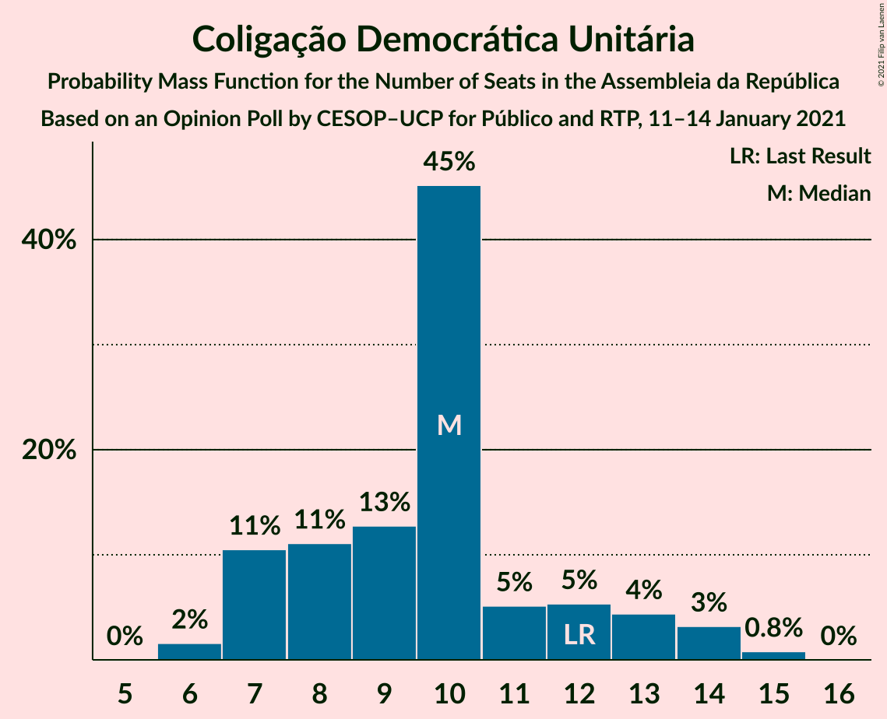
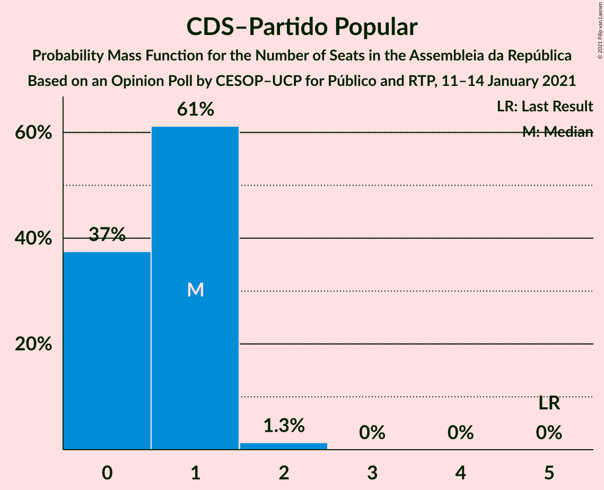
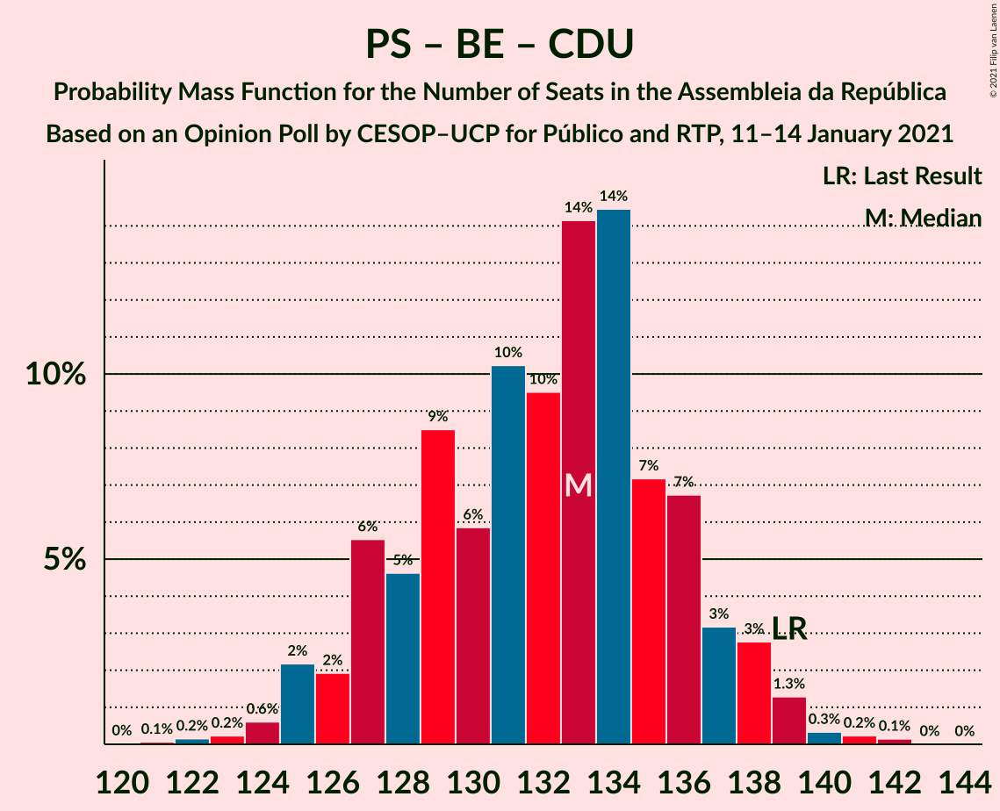

# Opinion Poll by CESOP–UCP for Público and RTP, 11–14 January 2021

<a href="#voting-intentions">Voting Intentions</a> | <a href="#seats">Seats</a> | <a href="#coalitions">Coalitions</a> | <a href="#technical-information">Technical Information</a>

## Voting Intentions

### Confidence Intervals

| Party | Last Result | Poll Result | 80% Confidence Interval | 90% Confidence Interval | 95% Confidence Interval | 99% Confidence Interval |
|:-----:|:-----------:|:-----------:|:-----------------------:|:-----------------------:|:-----------------------:|:-----------------------:|
| Partido Socialista | 36.4% | 39.0% | 37.6–40.4% |37.2–40.8% |36.9–41.1% |36.2–41.8% |
| Partido Social Democrata | 27.8% | 28.0% | 26.7–29.3% |26.4–29.7% |26.1–30.0% |25.5–30.6% |
| Chega | 1.3% | 8.0% | 7.3–8.8% |7.1–9.1% |6.9–9.3% |6.5–9.7% |
| Bloco de Esquerda | 9.5% | 7.0% | 6.3–7.8% |6.1–8.0% |6.0–8.2% |5.6–8.6% |
| Coligação Democrática Unitária | 6.3% | 6.0% | 5.4–6.7% |5.2–7.0% |5.0–7.1% |4.7–7.5% |
| Iniciativa Liberal | 1.3% | 5.0% | 4.4–5.7% |4.3–5.9% |4.1–6.1% |3.9–6.4% |
| CDS–Partido Popular | 4.2% | 2.0% | 1.6–2.5% |1.6–2.6% |1.5–2.7% |1.3–3.0% |
| Pessoas–Animais–Natureza | 3.3% | 2.0% | 1.6–2.5% |1.6–2.6% |1.5–2.7% |1.3–3.0% |

*Note:* The poll result column reflects the actual value used in the calculations. Published results may vary slightly, and in addition be rounded to fewer digits.

## Seats

### Confidence Intervals

| Party | Last Result | Median | 80% Confidence Interval | 90% Confidence Interval | 95% Confidence Interval | 99% Confidence Interval |
|:-----:|:-----------:|:------:|:-----------------------:|:-----------------------:|:-----------------------:|:-----------------------:|
| <a href="#partido-socialista">Partido Socialista</a> | 108 | 111 | 106–114 |105–115 |104–116 |102–118 |
| <a href="#partido-social-democrata">Partido Social Democrata</a> | 79 | 75 | 72–80 |70–81 |69–82 |68–84 |
| <a href="#chega">Chega</a> | 1 | 13 | 11–14 |11–15 |11–16 |11–18 |
| <a href="#bloco-de-esquerda">Bloco de Esquerda</a> | 19 | 12 | 11–14 |10–14 |9–15 |7–17 |
| <a href="#coligação-democrática-unitária">Coligação Democrática Unitária</a> | 12 | 10 | 7–12 |7–13 |7–14 |6–15 |
| <a href="#iniciativa-liberal">Iniciativa Liberal</a> | 1 | 6 | 6–9 |6–9 |5–10 |5–10 |
| <a href="#cds–partido-popular">CDS–Partido Popular</a> | 5 | 1 | 0–1 |0–1 |0–1 |0–2 |
| <a href="#pessoas–animais–natureza">Pessoas–Animais–Natureza</a> | 4 | 1 | 1–2 |1–2 |0–2 |0–2 |

### Partido Socialista

*For a full overview of the results for this party, see the [Partido Socialista](party-partidosocialista.html) page.*

| Number of Seats | Probability | Accumulated | Special Marks |
|:---------------:|:-----------:|:-----------:|:-------------:|
| 99 | 0% | 100% |  |
| 100 | 0.1% | 99.9% |  |
| 101 | 0.2% | 99.9% |  |
| 102 | 0.6% | 99.7% |  |
| 103 | 1.5% | 99.0% |  |
| 104 | 2% | 98% |  |
| 105 | 3% | 95% |  |
| 106 | 5% | 92% |  |
| 107 | 11% | 87% |  |
| 108 | 6% | 77% | Last Result |
| 109 | 9% | 71% |  |
| 110 | 10% | 62% |  |
| 111 | 11% | 52% | Median |
| 112 | 15% | 41% |  |
| 113 | 9% | 25% |  |
| 114 | 7% | 16% |  |
| 115 | 4% | 9% |  |
| 116 | 3% | 5% | Majority |
| 117 | 1.0% | 2% |  |
| 118 | 0.3% | 0.6% |  |
| 119 | 0.2% | 0.3% |  |
| 120 | 0% | 0.1% |  |
| 121 | 0% | 0% |  |

### Partido Social Democrata

*For a full overview of the results for this party, see the [Partido Social Democrata](party-partidosocialdemocrata.html) page.*

| Number of Seats | Probability | Accumulated | Special Marks |
|:---------------:|:-----------:|:-----------:|:-------------:|
| 66 | 0.1% | 100% |  |
| 67 | 0.3% | 99.9% |  |
| 68 | 1.3% | 99.6% |  |
| 69 | 2% | 98% |  |
| 70 | 3% | 96% |  |
| 71 | 3% | 93% |  |
| 72 | 4% | 90% |  |
| 73 | 6% | 86% |  |
| 74 | 13% | 80% |  |
| 75 | 20% | 67% | Median |
| 76 | 15% | 47% |  |
| 77 | 9% | 32% |  |
| 78 | 5% | 23% |  |
| 79 | 6% | 17% | Last Result |
| 80 | 6% | 11% |  |
| 81 | 2% | 5% |  |
| 82 | 1.3% | 3% |  |
| 83 | 0.9% | 2% |  |
| 84 | 0.7% | 1.0% |  |
| 85 | 0.1% | 0.3% |  |
| 86 | 0.1% | 0.1% |  |
| 87 | 0% | 0.1% |  |
| 88 | 0% | 0% |  |

### Chega

*For a full overview of the results for this party, see the [Chega](party-chega.html) page.*

| Number of Seats | Probability | Accumulated | Special Marks |
|:---------------:|:-----------:|:-----------:|:-------------:|
| 1 | 0% | 100% | Last Result |
| 2 | 0% | 100% |  |
| 3 | 0% | 100% |  |
| 4 | 0% | 100% |  |
| 5 | 0% | 100% |  |
| 6 | 0% | 100% |  |
| 7 | 0% | 100% |  |
| 8 | 0% | 100% |  |
| 9 | 0% | 100% |  |
| 10 | 0.4% | 100% |  |
| 11 | 22% | 99.6% |  |
| 12 | 21% | 77% |  |
| 13 | 11% | 56% | Median |
| 14 | 40% | 45% |  |
| 15 | 2% | 5% |  |
| 16 | 1.3% | 3% |  |
| 17 | 0.8% | 2% |  |
| 18 | 0.8% | 1.0% |  |
| 19 | 0.2% | 0.2% |  |
| 20 | 0% | 0% |  |

### Bloco de Esquerda

*For a full overview of the results for this party, see the [Bloco de Esquerda](party-blocodeesquerda.html) page.*

| Number of Seats | Probability | Accumulated | Special Marks |
|:---------------:|:-----------:|:-----------:|:-------------:|
| 7 | 2% | 100% |  |
| 8 | 0.8% | 98% |  |
| 9 | 1.3% | 98% |  |
| 10 | 2% | 96% |  |
| 11 | 42% | 94% |  |
| 12 | 18% | 52% | Median |
| 13 | 10% | 34% |  |
| 14 | 20% | 25% |  |
| 15 | 2% | 5% |  |
| 16 | 2% | 2% |  |
| 17 | 0.4% | 0.5% |  |
| 18 | 0.2% | 0.2% |  |
| 19 | 0% | 0% | Last Result |

### Coligação Democrática Unitária

*For a full overview of the results for this party, see the [Coligação Democrática Unitária](party-coligaçãodemocráticaunitária.html) page.*

| Number of Seats | Probability | Accumulated | Special Marks |
|:---------------:|:-----------:|:-----------:|:-------------:|
| 6 | 2% | 100% |  |
| 7 | 11% | 98% |  |
| 8 | 11% | 88% |  |
| 9 | 13% | 77% |  |
| 10 | 45% | 64% | Median |
| 11 | 5% | 19% |  |
| 12 | 5% | 14% | Last Result |
| 13 | 4% | 8% |  |
| 14 | 3% | 4% |  |
| 15 | 0.8% | 0.8% |  |
| 16 | 0% | 0% |  |

### Iniciativa Liberal

*For a full overview of the results for this party, see the [Iniciativa Liberal](party-iniciativaliberal.html) page.*

| Number of Seats | Probability | Accumulated | Special Marks |
|:---------------:|:-----------:|:-----------:|:-------------:|
| 1 | 0% | 100% | Last Result |
| 2 | 0% | 100% |  |
| 3 | 0% | 100% |  |
| 4 | 0.1% | 100% |  |
| 5 | 4% | 99.9% |  |
| 6 | 73% | 96% | Median |
| 7 | 8% | 23% |  |
| 8 | 5% | 15% |  |
| 9 | 6% | 11% |  |
| 10 | 5% | 5% |  |
| 11 | 0.2% | 0.4% |  |
| 12 | 0.2% | 0.2% |  |
| 13 | 0% | 0% |  |

### CDS–Partido Popular

*For a full overview of the results for this party, see the [CDS–Partido Popular](party-cds–partidopopular.html) page.*

| Number of Seats | Probability | Accumulated | Special Marks |
|:---------------:|:-----------:|:-----------:|:-------------:|
| 0 | 37% | 100% |  |
| 1 | 61% | 63% | Median |
| 2 | 1.3% | 1.4% |  |
| 3 | 0% | 0% |  |
| 4 | 0% | 0% |  |
| 5 | 0% | 0% | Last Result |

### Pessoas–Animais–Natureza

*For a full overview of the results for this party, see the [Pessoas–Animais–Natureza](party-pessoas–animais–natureza.html) page.*

| Number of Seats | Probability | Accumulated | Special Marks |
|:---------------:|:-----------:|:-----------:|:-------------:|
| 0 | 5% | 100% |  |
| 1 | 55% | 95% | Median |
| 2 | 40% | 40% |  |
| 3 | 0.2% | 0.2% |  |
| 4 | 0% | 0% | Last Result |

## Coalitions

### Confidence Intervals

| Coalition | Last Result | Median | Majority? | 80% Confidence Interval | 90% Confidence Interval | 95% Confidence Interval | 99% Confidence Interval |
|:---------:|:-----------:|:------:|:---------:|:-----------------------:|:-----------------------:|:-----------------------:|:-----------------------:|
| Partido Socialista – Bloco de Esquerda – Coligação Democrática Unitária | 139 | 133 | 100% | 127–136 | 126–137 | 125–138 | 123–140 |
| Partido Socialista – Bloco de Esquerda | 127 | 123 | 98% | 118–126 | 117–128 | 116–128 | 113–130 |
| Partido Socialista – Coligação Democrática Unitária | 120 | 120 | 91% | 116–124 | 114–125 | 113–126 | 111–128 |
| Partido Socialista | 108 | 111 | 5% | 106–114 | 105–115 | 104–116 | 102–118 |
| Partido Social Democrata – CDS–Partido Popular | 84 | 76 | 0% | 72–80 | 71–81 | 69–82 | 68–85 |

### Partido Socialista – Bloco de Esquerda – Coligação Democrática Unitária

| Number of Seats | Probability | Accumulated | Special Marks |
|:---------------:|:-----------:|:-----------:|:-------------:|
| 120 | 0% | 100% |  |
| 121 | 0.1% | 99.9% |  |
| 122 | 0.2% | 99.9% |  |
| 123 | 0.2% | 99.7% |  |
| 124 | 0.6% | 99.5% |  |
| 125 | 2% | 98.9% |  |
| 126 | 2% | 97% |  |
| 127 | 6% | 95% |  |
| 128 | 5% | 89% |  |
| 129 | 9% | 85% |  |
| 130 | 6% | 76% |  |
| 131 | 10% | 70% |  |
| 132 | 10% | 60% |  |
| 133 | 14% | 51% | Median |
| 134 | 14% | 36% |  |
| 135 | 7% | 22% |  |
| 136 | 7% | 15% |  |
| 137 | 3% | 8% |  |
| 138 | 3% | 5% |  |
| 139 | 1.3% | 2% | Last Result |
| 140 | 0.3% | 0.7% |  |
| 141 | 0.2% | 0.4% |  |
| 142 | 0.1% | 0.2% |  |
| 143 | 0% | 0% |  |

### Partido Socialista – Bloco de Esquerda

| Number of Seats | Probability | Accumulated | Special Marks |
|:---------------:|:-----------:|:-----------:|:-------------:|
| 110 | 0% | 100% |  |
| 111 | 0.1% | 99.9% |  |
| 112 | 0.1% | 99.9% |  |
| 113 | 0.5% | 99.8% |  |
| 114 | 0.6% | 99.3% |  |
| 115 | 1.0% | 98.8% |  |
| 116 | 2% | 98% | Majority |
| 117 | 4% | 96% |  |
| 118 | 7% | 92% |  |
| 119 | 4% | 85% |  |
| 120 | 6% | 81% |  |
| 121 | 11% | 75% |  |
| 122 | 8% | 64% |  |
| 123 | 19% | 56% | Median |
| 124 | 14% | 37% |  |
| 125 | 7% | 23% |  |
| 126 | 7% | 15% |  |
| 127 | 4% | 9% | Last Result |
| 128 | 3% | 5% |  |
| 129 | 1.4% | 2% |  |
| 130 | 0.7% | 0.9% |  |
| 131 | 0.2% | 0.2% |  |
| 132 | 0% | 0% |  |

### Partido Socialista – Coligação Democrática Unitária

| Number of Seats | Probability | Accumulated | Special Marks |
|:---------------:|:-----------:|:-----------:|:-------------:|
| 109 | 0.1% | 100% |  |
| 110 | 0.2% | 99.9% |  |
| 111 | 0.3% | 99.7% |  |
| 112 | 1.0% | 99.4% |  |
| 113 | 2% | 98% |  |
| 114 | 3% | 97% |  |
| 115 | 3% | 94% |  |
| 116 | 8% | 91% | Majority |
| 117 | 7% | 83% |  |
| 118 | 11% | 75% |  |
| 119 | 6% | 64% |  |
| 120 | 9% | 58% | Last Result |
| 121 | 11% | 49% | Median |
| 122 | 13% | 38% |  |
| 123 | 10% | 25% |  |
| 124 | 6% | 15% |  |
| 125 | 4% | 9% |  |
| 126 | 3% | 5% |  |
| 127 | 1.1% | 2% |  |
| 128 | 0.6% | 0.9% |  |
| 129 | 0.2% | 0.3% |  |
| 130 | 0.1% | 0.1% |  |
| 131 | 0% | 0.1% |  |
| 132 | 0% | 0% |  |

### Partido Socialista

| Number of Seats | Probability | Accumulated | Special Marks |
|:---------------:|:-----------:|:-----------:|:-------------:|
| 99 | 0% | 100% |  |
| 100 | 0.1% | 99.9% |  |
| 101 | 0.2% | 99.9% |  |
| 102 | 0.6% | 99.7% |  |
| 103 | 1.5% | 99.0% |  |
| 104 | 2% | 98% |  |
| 105 | 3% | 95% |  |
| 106 | 5% | 92% |  |
| 107 | 11% | 87% |  |
| 108 | 6% | 77% | Last Result |
| 109 | 9% | 71% |  |
| 110 | 10% | 62% |  |
| 111 | 11% | 52% | Median |
| 112 | 15% | 41% |  |
| 113 | 9% | 25% |  |
| 114 | 7% | 16% |  |
| 115 | 4% | 9% |  |
| 116 | 3% | 5% | Majority |
| 117 | 1.0% | 2% |  |
| 118 | 0.3% | 0.6% |  |
| 119 | 0.2% | 0.3% |  |
| 120 | 0% | 0.1% |  |
| 121 | 0% | 0% |  |

### Partido Social Democrata – CDS–Partido Popular

| Number of Seats | Probability | Accumulated | Special Marks |
|:---------------:|:-----------:|:-----------:|:-------------:|
| 66 | 0% | 100% |  |
| 67 | 0.1% | 99.9% |  |
| 68 | 0.6% | 99.9% |  |
| 69 | 2% | 99.2% |  |
| 70 | 2% | 97% |  |
| 71 | 3% | 95% |  |
| 72 | 4% | 92% |  |
| 73 | 5% | 88% |  |
| 74 | 7% | 83% |  |
| 75 | 15% | 76% |  |
| 76 | 18% | 61% | Median |
| 77 | 16% | 43% |  |
| 78 | 8% | 28% |  |
| 79 | 4% | 20% |  |
| 80 | 7% | 15% |  |
| 81 | 5% | 9% |  |
| 82 | 2% | 4% |  |
| 83 | 0.7% | 2% |  |
| 84 | 0.7% | 2% | Last Result |
| 85 | 0.7% | 0.9% |  |
| 86 | 0.1% | 0.2% |  |
| 87 | 0% | 0.1% |  |
| 88 | 0% | 0% |  |

## Technical Information

### Opinion Poll

+ **Polling firm:** CESOP–UCP
+ **Commissioner(s):** Público and RTP
+ **Fieldwork period:** 11–14 January 2021

### Calculations

+ **Sample size:** 2001
+ **Simulations done:** 1,048,576
+ **Error estimate:** 0.85%

