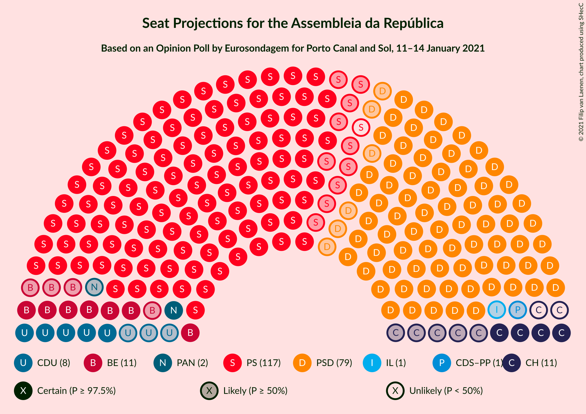
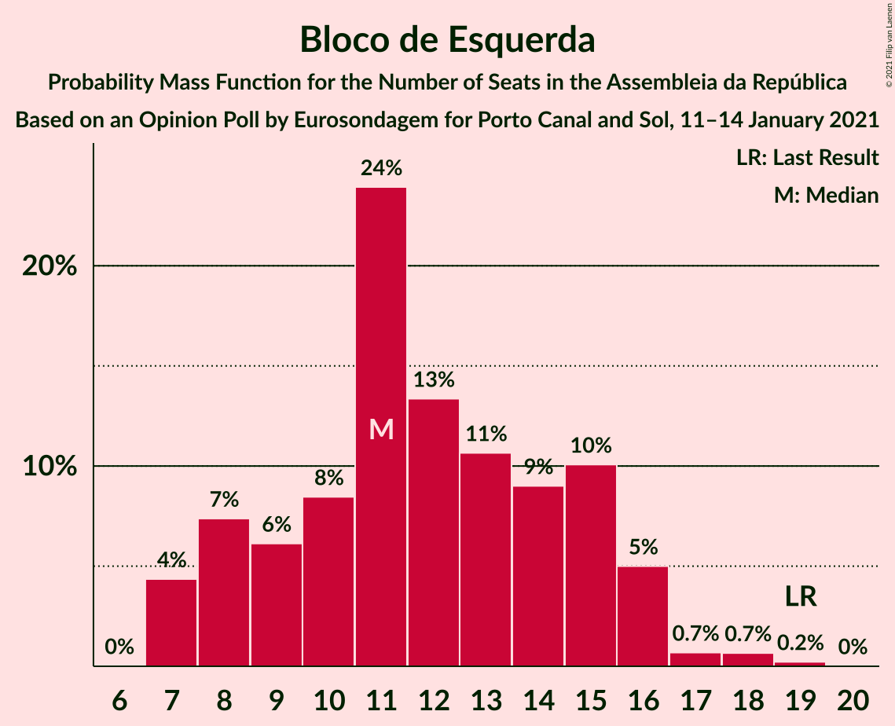
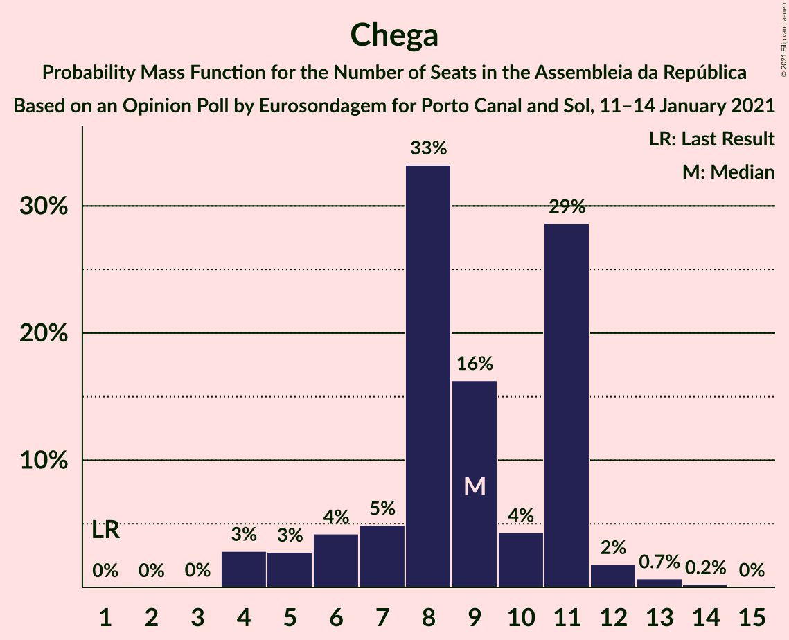
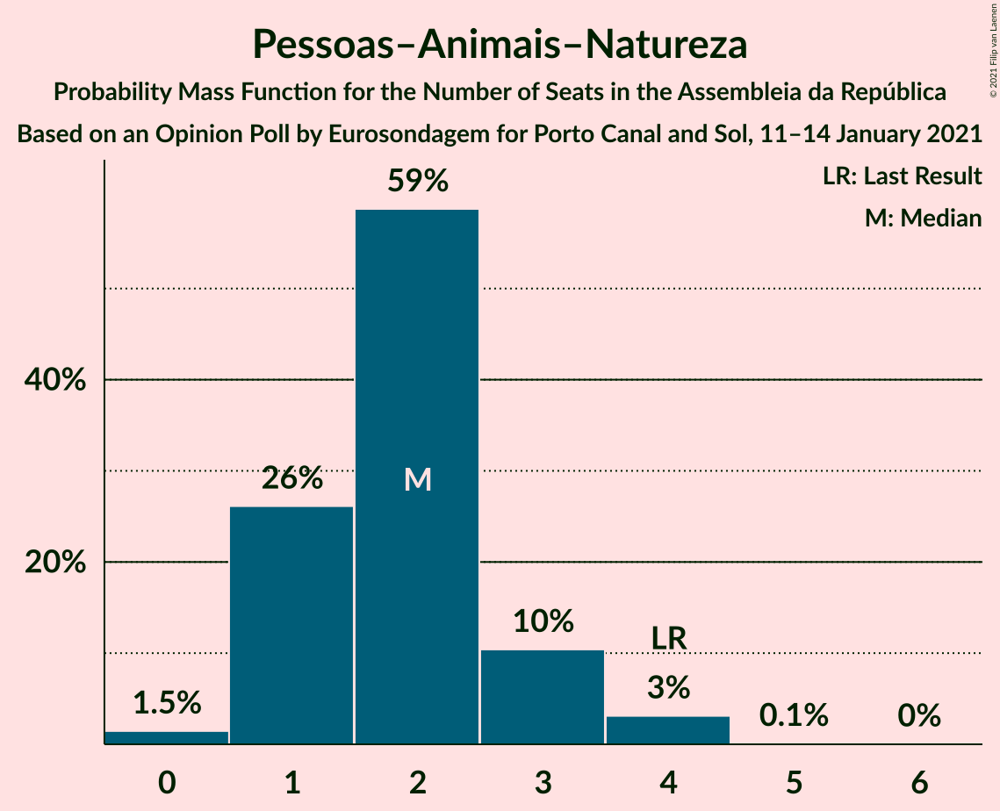

# Opinion Poll by Eurosondagem for Porto Canal and Sol, 11–14 January 2021

<a href="#voting-intentions">Voting Intentions</a> | <a href="#seats">Seats</a> | <a href="#coalitions">Coalitions</a> | <a href="#technical-information">Technical Information</a>

## Voting Intentions

### Confidence Intervals

| Party | Last Result | Poll Result | 80% Confidence Interval | 90% Confidence Interval | 95% Confidence Interval | 99% Confidence Interval |
|:-----:|:-----------:|:-----------:|:-----------------------:|:-----------------------:|:-----------------------:|:-----------------------:|
| Partido Socialista | 36.4% | 39.0% | 37.1–41.0% |36.5–41.5% |36.0–42.0% |35.1–43.0% |
| Partido Social Democrata | 27.8% | 28.0% | 26.3–29.9% |25.8–30.4% |25.3–30.8% |24.5–31.7% |
| Bloco de Esquerda | 9.5% | 6.5% | 5.6–7.6% |5.3–7.9% |5.1–8.2% |4.7–8.7% |
| Chega | 1.3% | 5.5% | 4.7–6.5% |4.4–6.8% |4.2–7.1% |3.9–7.6% |
| Coligação Democrática Unitária | 6.3% | 5.3% | 4.5–6.3% |4.3–6.6% |4.1–6.8% |3.7–7.4% |
| Pessoas–Animais–Natureza | 3.3% | 2.2% | 1.7–2.9% |1.5–3.1% |1.4–3.2% |1.2–3.6% |
| CDS–Partido Popular | 4.2% | 2.1% | 1.6–2.8% |1.4–3.0% |1.3–3.1% |1.2–3.5% |
| Iniciativa Liberal | 1.3% | 1.3% | 0.9–1.9% |0.8–2.0% |0.7–2.2% |0.6–2.5% |

*Note:* The poll result column reflects the actual value used in the calculations. Published results may vary slightly, and in addition be rounded to fewer digits.

## Seats

### Confidence Intervals

| Party | Last Result | Median | 80% Confidence Interval | 90% Confidence Interval | 95% Confidence Interval | 99% Confidence Interval |
|:-----:|:-----------:|:------:|:-----------------------:|:-----------------------:|:-----------------------:|:-----------------------:|
| <a href="#partido-socialista">Partido Socialista</a> | 108 | 115 | 111–121 |110–121 |108–122 |103–125 |
| <a href="#partido-social-democrata">Partido Social Democrata</a> | 79 | 80 | 74–85 |73–86 |73–88 |72–89 |
| <a href="#bloco-de-esquerda">Bloco de Esquerda</a> | 19 | 12 | 8–15 |8–16 |7–16 |7–18 |
| <a href="#chega">Chega</a> | 1 | 9 | 8–11 |7–11 |5–11 |4–12 |
| <a href="#coligação-democrática-unitária">Coligação Democrática Unitária</a> | 12 | 8 | 7–11 |6–12 |5–13 |5–14 |
| <a href="#pessoas–animais–natureza">Pessoas–Animais–Natureza</a> | 4 | 2 | 1–3 |1–3 |1–3 |0–4 |
| <a href="#cds–partido-popular">CDS–Partido Popular</a> | 5 | 1 | 0–1 |0–2 |0–2 |0–4 |
| <a href="#iniciativa-liberal">Iniciativa Liberal</a> | 1 | 1 | 1–2 |0–2 |0–2 |0–3 |

### Partido Socialista

*For a full overview of the results for this party, see the [Partido Socialista](party-partidosocialista.html) page.*

| Number of Seats | Probability | Accumulated | Special Marks |
|:---------------:|:-----------:|:-----------:|:-------------:|
| 100 | 0.1% | 100% |  |
| 101 | 0% | 99.9% |  |
| 102 | 0% | 99.9% |  |
| 103 | 0.4% | 99.9% |  |
| 104 | 0% | 99.5% |  |
| 105 | 0.2% | 99.5% |  |
| 106 | 0.5% | 99.2% |  |
| 107 | 0.5% | 98.8% |  |
| 108 | 1.5% | 98% | Last Result |
| 109 | 1.4% | 97% |  |
| 110 | 0.9% | 95% |  |
| 111 | 13% | 95% |  |
| 112 | 7% | 81% |  |
| 113 | 18% | 75% |  |
| 114 | 5% | 56% |  |
| 115 | 10% | 51% | Median |
| 116 | 3% | 41% | Majority |
| 117 | 11% | 38% |  |
| 118 | 7% | 27% |  |
| 119 | 3% | 20% |  |
| 120 | 1.3% | 17% |  |
| 121 | 12% | 16% |  |
| 122 | 3% | 4% |  |
| 123 | 0.6% | 1.2% |  |
| 124 | 0% | 0.6% |  |
| 125 | 0.2% | 0.6% |  |
| 126 | 0.2% | 0.4% |  |
| 127 | 0% | 0.2% |  |
| 128 | 0% | 0.2% |  |
| 129 | 0.1% | 0.1% |  |
| 130 | 0% | 0% |  |

### Partido Social Democrata

*For a full overview of the results for this party, see the [Partido Social Democrata](party-partidosocialdemocrata.html) page.*

| Number of Seats | Probability | Accumulated | Special Marks |
|:---------------:|:-----------:|:-----------:|:-------------:|
| 65 | 0% | 100% |  |
| 66 | 0% | 99.9% |  |
| 67 | 0% | 99.9% |  |
| 68 | 0.1% | 99.9% |  |
| 69 | 0% | 99.8% |  |
| 70 | 0.1% | 99.8% |  |
| 71 | 0.1% | 99.8% |  |
| 72 | 0.3% | 99.7% |  |
| 73 | 6% | 99.4% |  |
| 74 | 4% | 94% |  |
| 75 | 2% | 90% |  |
| 76 | 4% | 88% |  |
| 77 | 3% | 84% |  |
| 78 | 13% | 81% |  |
| 79 | 10% | 67% | Last Result |
| 80 | 9% | 58% | Median |
| 81 | 9% | 48% |  |
| 82 | 4% | 39% |  |
| 83 | 7% | 36% |  |
| 84 | 17% | 28% |  |
| 85 | 6% | 11% |  |
| 86 | 1.4% | 5% |  |
| 87 | 0.6% | 4% |  |
| 88 | 2% | 3% |  |
| 89 | 0.8% | 1.3% |  |
| 90 | 0.2% | 0.5% |  |
| 91 | 0.1% | 0.2% |  |
| 92 | 0.1% | 0.2% |  |
| 93 | 0.1% | 0.1% |  |
| 94 | 0% | 0.1% |  |
| 95 | 0% | 0% |  |

### Bloco de Esquerda

*For a full overview of the results for this party, see the [Bloco de Esquerda](party-blocodeesquerda.html) page.*

| Number of Seats | Probability | Accumulated | Special Marks |
|:---------------:|:-----------:|:-----------:|:-------------:|
| 7 | 3% | 100% |  |
| 8 | 9% | 97% |  |
| 9 | 4% | 88% |  |
| 10 | 11% | 84% |  |
| 11 | 19% | 73% |  |
| 12 | 19% | 54% | Median |
| 13 | 3% | 36% |  |
| 14 | 14% | 32% |  |
| 15 | 13% | 18% |  |
| 16 | 4% | 5% |  |
| 17 | 0.7% | 2% |  |
| 18 | 0.7% | 0.9% |  |
| 19 | 0.2% | 0.3% | Last Result |
| 20 | 0% | 0% |  |

### Chega

*For a full overview of the results for this party, see the [Chega](party-chega.html) page.*

| Number of Seats | Probability | Accumulated | Special Marks |
|:---------------:|:-----------:|:-----------:|:-------------:|
| 1 | 0% | 100% | Last Result |
| 2 | 0% | 100% |  |
| 3 | 0% | 100% |  |
| 4 | 2% | 100% |  |
| 5 | 1.0% | 98% |  |
| 6 | 0.6% | 97% |  |
| 7 | 5% | 96% |  |
| 8 | 34% | 92% |  |
| 9 | 23% | 58% | Median |
| 10 | 3% | 35% |  |
| 11 | 30% | 32% |  |
| 12 | 2% | 2% |  |
| 13 | 0.3% | 0.5% |  |
| 14 | 0.1% | 0.1% |  |
| 15 | 0% | 0% |  |

### Coligação Democrática Unitária

*For a full overview of the results for this party, see the [Coligação Democrática Unitária](party-coligaçãodemocráticaunitária.html) page.*

| Number of Seats | Probability | Accumulated | Special Marks |
|:---------------:|:-----------:|:-----------:|:-------------:|
| 5 | 4% | 100% |  |
| 6 | 4% | 96% |  |
| 7 | 30% | 93% |  |
| 8 | 17% | 63% | Median |
| 9 | 22% | 45% |  |
| 10 | 10% | 23% |  |
| 11 | 4% | 13% |  |
| 12 | 5% | 8% | Last Result |
| 13 | 2% | 3% |  |
| 14 | 1.0% | 1.4% |  |
| 15 | 0.3% | 0.4% |  |
| 16 | 0.1% | 0.1% |  |
| 17 | 0% | 0% |  |

### Pessoas–Animais–Natureza

*For a full overview of the results for this party, see the [Pessoas–Animais–Natureza](party-pessoas–animais–natureza.html) page.*

| Number of Seats | Probability | Accumulated | Special Marks |
|:---------------:|:-----------:|:-----------:|:-------------:|
| 0 | 1.3% | 100% |  |
| 1 | 15% | 98.7% |  |
| 2 | 68% | 83% | Median |
| 3 | 13% | 15% |  |
| 4 | 2% | 2% | Last Result |
| 5 | 0.2% | 0.3% |  |
| 6 | 0% | 0% |  |

### CDS–Partido Popular

*For a full overview of the results for this party, see the [CDS–Partido Popular](party-cds–partidopopular.html) page.*

| Number of Seats | Probability | Accumulated | Special Marks |
|:---------------:|:-----------:|:-----------:|:-------------:|
| 0 | 13% | 100% |  |
| 1 | 77% | 87% | Median |
| 2 | 9% | 10% |  |
| 3 | 0.1% | 0.6% |  |
| 4 | 0.5% | 0.5% |  |
| 5 | 0% | 0% | Last Result |

### Iniciativa Liberal

*For a full overview of the results for this party, see the [Iniciativa Liberal](party-iniciativaliberal.html) page.*

| Number of Seats | Probability | Accumulated | Special Marks |
|:---------------:|:-----------:|:-----------:|:-------------:|
| 0 | 7% | 100% |  |
| 1 | 81% | 93% | Last Result, Median |
| 2 | 10% | 12% |  |
| 3 | 2% | 2% |  |
| 4 | 0% | 0% |  |

## Coalitions

### Confidence Intervals

| Coalition | Last Result | Median | Majority? | 80% Confidence Interval | 90% Confidence Interval | 95% Confidence Interval | 99% Confidence Interval |
|:---------:|:-----------:|:------:|:---------:|:-----------------------:|:-----------------------:|:-----------------------:|:-----------------------:|
| Partido Socialista – Bloco de Esquerda – Coligação Democrática Unitária | 139 | 135 | 100% | 132–140 | 130–141 | 129–141 | 126–142 |
| Partido Socialista – Bloco de Esquerda | 127 | 126 | 99.7% | 123–131 | 120–133 | 119–134 | 116–136 |
| Partido Socialista – Coligação Democrática Unitária | 120 | 124 | 98.9% | 119–128 | 118–128 | 118–129 | 114–132 |
| Partido Socialista | 108 | 115 | 41% | 111–121 | 110–121 | 108–122 | 103–125 |
| Partido Social Democrata – CDS–Partido Popular | 84 | 81 | 0% | 75–86 | 74–87 | 74–89 | 74–90 |

### Partido Socialista – Bloco de Esquerda – Coligação Democrática Unitária

| Number of Seats | Probability | Accumulated | Special Marks |
|:---------------:|:-----------:|:-----------:|:-------------:|
| 123 | 0.1% | 100% |  |
| 124 | 0.1% | 99.9% |  |
| 125 | 0.1% | 99.8% |  |
| 126 | 0.3% | 99.7% |  |
| 127 | 1.1% | 99.4% |  |
| 128 | 0.6% | 98% |  |
| 129 | 2% | 98% |  |
| 130 | 1.1% | 95% |  |
| 131 | 4% | 94% |  |
| 132 | 6% | 90% |  |
| 133 | 18% | 84% |  |
| 134 | 10% | 66% |  |
| 135 | 12% | 56% | Median |
| 136 | 3% | 43% |  |
| 137 | 3% | 40% |  |
| 138 | 20% | 38% |  |
| 139 | 2% | 18% | Last Result |
| 140 | 8% | 16% |  |
| 141 | 7% | 8% |  |
| 142 | 1.0% | 1.5% |  |
| 143 | 0.1% | 0.5% |  |
| 144 | 0% | 0.4% |  |
| 145 | 0% | 0.3% |  |
| 146 | 0.1% | 0.3% |  |
| 147 | 0% | 0.2% |  |
| 148 | 0% | 0.2% |  |
| 149 | 0.1% | 0.2% |  |
| 150 | 0% | 0.1% |  |
| 151 | 0% | 0.1% |  |
| 152 | 0% | 0.1% |  |
| 153 | 0% | 0% |  |

### Partido Socialista – Bloco de Esquerda

| Number of Seats | Probability | Accumulated | Special Marks |
|:---------------:|:-----------:|:-----------:|:-------------:|
| 111 | 0.1% | 100% |  |
| 112 | 0% | 99.9% |  |
| 113 | 0% | 99.9% |  |
| 114 | 0.1% | 99.9% |  |
| 115 | 0.1% | 99.8% |  |
| 116 | 0.2% | 99.7% | Majority |
| 117 | 0.5% | 99.4% |  |
| 118 | 1.0% | 99.0% |  |
| 119 | 1.4% | 98% |  |
| 120 | 2% | 97% |  |
| 121 | 2% | 95% |  |
| 122 | 3% | 93% |  |
| 123 | 5% | 90% |  |
| 124 | 6% | 85% |  |
| 125 | 15% | 79% |  |
| 126 | 17% | 64% |  |
| 127 | 9% | 47% | Last Result, Median |
| 128 | 2% | 37% |  |
| 129 | 2% | 36% |  |
| 130 | 4% | 33% |  |
| 131 | 20% | 29% |  |
| 132 | 2% | 9% |  |
| 133 | 4% | 7% |  |
| 134 | 2% | 3% |  |
| 135 | 0.8% | 1.3% |  |
| 136 | 0.2% | 0.5% |  |
| 137 | 0.1% | 0.3% |  |
| 138 | 0% | 0.2% |  |
| 139 | 0.1% | 0.2% |  |
| 140 | 0% | 0.1% |  |
| 141 | 0% | 0.1% |  |
| 142 | 0% | 0.1% |  |
| 143 | 0% | 0% |  |

### Partido Socialista – Coligação Democrática Unitária

| Number of Seats | Probability | Accumulated | Special Marks |
|:---------------:|:-----------:|:-----------:|:-------------:|
| 111 | 0% | 100% |  |
| 112 | 0% | 99.9% |  |
| 113 | 0.4% | 99.9% |  |
| 114 | 0.2% | 99.5% |  |
| 115 | 0.3% | 99.3% |  |
| 116 | 0.5% | 98.9% | Majority |
| 117 | 0.5% | 98% |  |
| 118 | 5% | 98% |  |
| 119 | 5% | 93% |  |
| 120 | 10% | 88% | Last Result |
| 121 | 15% | 78% |  |
| 122 | 4% | 63% |  |
| 123 | 6% | 59% | Median |
| 124 | 14% | 54% |  |
| 125 | 5% | 40% |  |
| 126 | 7% | 34% |  |
| 127 | 9% | 27% |  |
| 128 | 13% | 18% |  |
| 129 | 4% | 5% |  |
| 130 | 0.3% | 1.0% |  |
| 131 | 0.1% | 0.8% |  |
| 132 | 0.2% | 0.6% |  |
| 133 | 0.1% | 0.4% |  |
| 134 | 0.1% | 0.3% |  |
| 135 | 0% | 0.3% |  |
| 136 | 0% | 0.2% |  |
| 137 | 0.1% | 0.2% |  |
| 138 | 0% | 0.1% |  |
| 139 | 0.1% | 0.1% |  |
| 140 | 0% | 0% |  |

### Partido Socialista

| Number of Seats | Probability | Accumulated | Special Marks |
|:---------------:|:-----------:|:-----------:|:-------------:|
| 100 | 0.1% | 100% |  |
| 101 | 0% | 99.9% |  |
| 102 | 0% | 99.9% |  |
| 103 | 0.4% | 99.9% |  |
| 104 | 0% | 99.5% |  |
| 105 | 0.2% | 99.5% |  |
| 106 | 0.5% | 99.2% |  |
| 107 | 0.5% | 98.8% |  |
| 108 | 1.5% | 98% | Last Result |
| 109 | 1.4% | 97% |  |
| 110 | 0.9% | 95% |  |
| 111 | 13% | 95% |  |
| 112 | 7% | 81% |  |
| 113 | 18% | 75% |  |
| 114 | 5% | 56% |  |
| 115 | 10% | 51% | Median |
| 116 | 3% | 41% | Majority |
| 117 | 11% | 38% |  |
| 118 | 7% | 27% |  |
| 119 | 3% | 20% |  |
| 120 | 1.3% | 17% |  |
| 121 | 12% | 16% |  |
| 122 | 3% | 4% |  |
| 123 | 0.6% | 1.2% |  |
| 124 | 0% | 0.6% |  |
| 125 | 0.2% | 0.6% |  |
| 126 | 0.2% | 0.4% |  |
| 127 | 0% | 0.2% |  |
| 128 | 0% | 0.2% |  |
| 129 | 0.1% | 0.1% |  |
| 130 | 0% | 0% |  |

### Partido Social Democrata – CDS–Partido Popular

| Number of Seats | Probability | Accumulated | Special Marks |
|:---------------:|:-----------:|:-----------:|:-------------:|
| 66 | 0% | 100% |  |
| 67 | 0% | 99.9% |  |
| 68 | 0% | 99.9% |  |
| 69 | 0.1% | 99.9% |  |
| 70 | 0% | 99.8% |  |
| 71 | 0.1% | 99.8% |  |
| 72 | 0.1% | 99.7% |  |
| 73 | 0.2% | 99.7% |  |
| 74 | 6% | 99.5% |  |
| 75 | 4% | 93% |  |
| 76 | 0.8% | 90% |  |
| 77 | 5% | 89% |  |
| 78 | 3% | 84% |  |
| 79 | 13% | 81% |  |
| 80 | 12% | 68% |  |
| 81 | 7% | 56% | Median |
| 82 | 8% | 48% |  |
| 83 | 4% | 40% |  |
| 84 | 10% | 36% | Last Result |
| 85 | 14% | 26% |  |
| 86 | 5% | 12% |  |
| 87 | 3% | 7% |  |
| 88 | 1.4% | 4% |  |
| 89 | 1.5% | 3% |  |
| 90 | 0.6% | 1.1% |  |
| 91 | 0.2% | 0.5% |  |
| 92 | 0.1% | 0.3% |  |
| 93 | 0% | 0.2% |  |
| 94 | 0.1% | 0.1% |  |
| 95 | 0% | 0.1% |  |
| 96 | 0% | 0% |  |

## Technical Information

### Opinion Poll

+ **Polling firm:** Eurosondagem
+ **Commissioner(s):** Porto Canal and Sol
+ **Fieldwork period:** 11–14 January 2021

### Calculations

+ **Sample size:** 1021
+ **Simulations done:** 131,072
+ **Error estimate:** 2.33%

