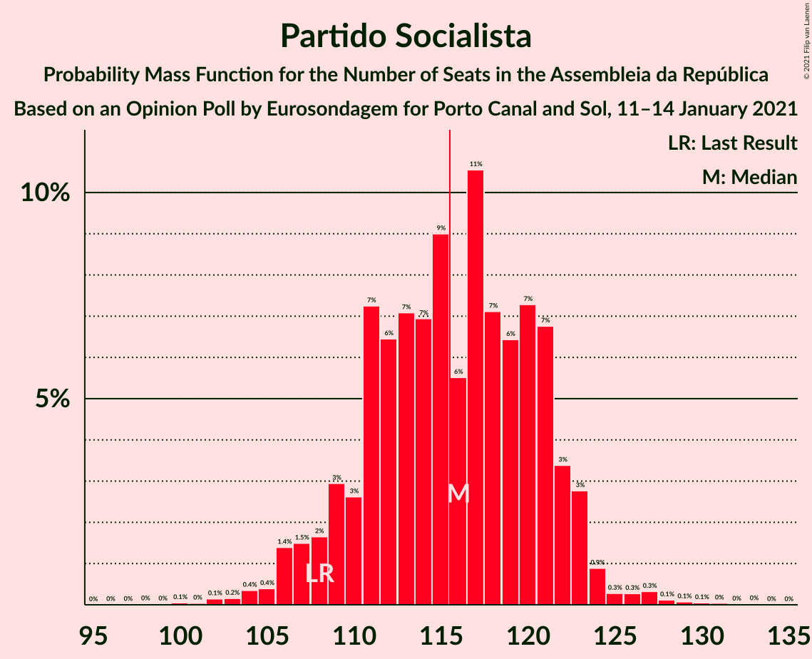
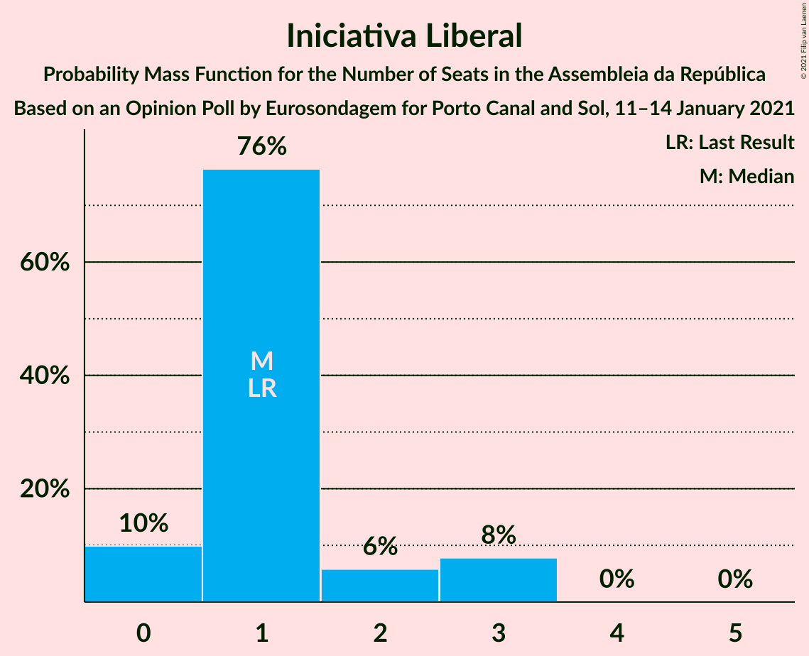

# Opinion Poll by Eurosondagem for Porto Canal and Sol, 11–14 January 2021

<a href="#voting-intentions">Voting Intentions</a> | <a href="#seats">Seats</a> | <a href="#coalitions">Coalitions</a> | <a href="#technical-information">Technical Information</a>

## Voting Intentions

### Confidence Intervals

| Party | Last Result | Poll Result | 80% Confidence Interval | 90% Confidence Interval | 95% Confidence Interval | 99% Confidence Interval |
|:-----:|:-----------:|:-----------:|:-----------------------:|:-----------------------:|:-----------------------:|:-----------------------:|
| Partido Socialista | 36.4% | 39.0% | 37.1–41.0% |36.5–41.5% |36.0–42.0% |35.1–43.0% |
| Partido Social Democrata | 27.8% | 28.0% | 26.3–29.9% |25.8–30.4% |25.3–30.8% |24.5–31.7% |
| Bloco de Esquerda | 9.5% | 6.5% | 5.6–7.6% |5.3–7.9% |5.1–8.2% |4.7–8.7% |
| Chega | 1.3% | 5.5% | 4.7–6.5% |4.4–6.8% |4.2–7.1% |3.9–7.6% |
| Coligação Democrática Unitária | 6.3% | 5.3% | 4.5–6.3% |4.3–6.6% |4.1–6.8% |3.7–7.4% |
| Pessoas–Animais–Natureza | 3.3% | 2.2% | 1.7–2.9% |1.5–3.1% |1.4–3.2% |1.2–3.6% |
| CDS–Partido Popular | 4.2% | 2.1% | 1.6–2.8% |1.4–3.0% |1.3–3.1% |1.2–3.5% |
| Iniciativa Liberal | 1.3% | 1.3% | 0.9–1.9% |0.8–2.0% |0.7–2.2% |0.6–2.5% |

*Note:* The poll result column reflects the actual value used in the calculations. Published results may vary slightly, and in addition be rounded to fewer digits.

## Seats

### Confidence Intervals

| Party | Last Result | Median | 80% Confidence Interval | 90% Confidence Interval | 95% Confidence Interval | 99% Confidence Interval |
|:-----:|:-----------:|:------:|:-----------------------:|:-----------------------:|:-----------------------:|:-----------------------:|
| <a href="#partido-socialista">Partido Socialista</a> | 108 | 116 | 110–121 |108–122 |106–123 |104–127 |
| <a href="#partido-social-democrata">Partido Social Democrata</a> | 79 | 79 | 75–85 |74–87 |73–88 |69–91 |
| <a href="#bloco-de-esquerda">Bloco de Esquerda</a> | 19 | 11 | 8–15 |8–16 |7–16 |7–18 |
| <a href="#chega">Chega</a> | 1 | 9 | 7–11 |5–11 |4–12 |4–13 |
| <a href="#coligação-democrática-unitária">Coligação Democrática Unitária</a> | 12 | 8 | 7–12 |6–13 |5–14 |5–15 |
| <a href="#pessoas–animais–natureza">Pessoas–Animais–Natureza</a> | 4 | 2 | 1–3 |1–3 |1–4 |0–4 |
| <a href="#cds–partido-popular">CDS–Partido Popular</a> | 5 | 1 | 0–2 |0–2 |0–2 |0–4 |
| <a href="#iniciativa-liberal">Iniciativa Liberal</a> | 1 | 1 | 1–2 |0–3 |0–3 |0–3 |

### Partido Socialista

*For a full overview of the results for this party, see the [Partido Socialista](party-partidosocialista.html) page.*

| Number of Seats | Probability | Accumulated | Special Marks |
|:---------------:|:-----------:|:-----------:|:-------------:|
| 99 | 0% | 100% |  |
| 100 | 0.1% | 99.9% |  |
| 101 | 0% | 99.9% |  |
| 102 | 0.1% | 99.8% |  |
| 103 | 0.2% | 99.7% |  |
| 104 | 0.4% | 99.5% |  |
| 105 | 0.4% | 99.2% |  |
| 106 | 1.4% | 98.8% |  |
| 107 | 1.5% | 97% |  |
| 108 | 2% | 96% | Last Result |
| 109 | 3% | 94% |  |
| 110 | 3% | 91% |  |
| 111 | 7% | 89% |  |
| 112 | 6% | 81% |  |
| 113 | 7% | 75% |  |
| 114 | 7% | 68% |  |
| 115 | 9% | 61% |  |
| 116 | 6% | 52% | Median, Majority |
| 117 | 11% | 46% |  |
| 118 | 7% | 36% |  |
| 119 | 6% | 29% |  |
| 120 | 7% | 22% |  |
| 121 | 7% | 15% |  |
| 122 | 3% | 8% |  |
| 123 | 3% | 5% |  |
| 124 | 0.9% | 2% |  |
| 125 | 0.3% | 1.2% |  |
| 126 | 0.3% | 0.9% |  |
| 127 | 0.3% | 0.7% |  |
| 128 | 0.1% | 0.3% |  |
| 129 | 0.1% | 0.2% |  |
| 130 | 0.1% | 0.2% |  |
| 131 | 0% | 0.1% |  |
| 132 | 0% | 0.1% |  |
| 133 | 0% | 0% |  |

### Partido Social Democrata

*For a full overview of the results for this party, see the [Partido Social Democrata](party-partidosocialdemocrata.html) page.*

| Number of Seats | Probability | Accumulated | Special Marks |
|:---------------:|:-----------:|:-----------:|:-------------:|
| 64 | 0% | 100% |  |
| 65 | 0.1% | 99.9% |  |
| 66 | 0.1% | 99.8% |  |
| 67 | 0.1% | 99.8% |  |
| 68 | 0.1% | 99.7% |  |
| 69 | 0.2% | 99.5% |  |
| 70 | 0.3% | 99.3% |  |
| 71 | 0.5% | 99.0% |  |
| 72 | 0.8% | 98.5% |  |
| 73 | 2% | 98% |  |
| 74 | 5% | 95% |  |
| 75 | 7% | 91% |  |
| 76 | 5% | 84% |  |
| 77 | 5% | 79% |  |
| 78 | 12% | 73% |  |
| 79 | 12% | 62% | Last Result, Median |
| 80 | 6% | 49% |  |
| 81 | 7% | 44% |  |
| 82 | 7% | 37% |  |
| 83 | 9% | 30% |  |
| 84 | 6% | 21% |  |
| 85 | 6% | 15% |  |
| 86 | 3% | 9% |  |
| 87 | 2% | 5% |  |
| 88 | 1.4% | 4% |  |
| 89 | 0.5% | 2% |  |
| 90 | 1.0% | 2% |  |
| 91 | 0.3% | 0.7% |  |
| 92 | 0.1% | 0.4% |  |
| 93 | 0.1% | 0.3% |  |
| 94 | 0.1% | 0.2% |  |
| 95 | 0% | 0.1% |  |
| 96 | 0% | 0.1% |  |
| 97 | 0% | 0% |  |

### Bloco de Esquerda

*For a full overview of the results for this party, see the [Bloco de Esquerda](party-blocodeesquerda.html) page.*

| Number of Seats | Probability | Accumulated | Special Marks |
|:---------------:|:-----------:|:-----------:|:-------------:|
| 7 | 4% | 100% |  |
| 8 | 7% | 96% |  |
| 9 | 6% | 88% |  |
| 10 | 8% | 82% |  |
| 11 | 24% | 74% | Median |
| 12 | 13% | 50% |  |
| 13 | 11% | 36% |  |
| 14 | 9% | 26% |  |
| 15 | 10% | 17% |  |
| 16 | 5% | 7% |  |
| 17 | 0.7% | 2% |  |
| 18 | 0.7% | 0.9% |  |
| 19 | 0.2% | 0.2% | Last Result |
| 20 | 0% | 0% |  |

### Chega

*For a full overview of the results for this party, see the [Chega](party-chega.html) page.*

| Number of Seats | Probability | Accumulated | Special Marks |
|:---------------:|:-----------:|:-----------:|:-------------:|
| 1 | 0% | 100% | Last Result |
| 2 | 0% | 100% |  |
| 3 | 0% | 100% |  |
| 4 | 3% | 100% |  |
| 5 | 3% | 97% |  |
| 6 | 4% | 94% |  |
| 7 | 5% | 90% |  |
| 8 | 33% | 85% |  |
| 9 | 16% | 52% | Median |
| 10 | 4% | 36% |  |
| 11 | 29% | 31% |  |
| 12 | 2% | 3% |  |
| 13 | 0.7% | 1.0% |  |
| 14 | 0.2% | 0.3% |  |
| 15 | 0% | 0% |  |

### Coligação Democrática Unitária

*For a full overview of the results for this party, see the [Coligação Democrática Unitária](party-coligaçãodemocráticaunitária.html) page.*

| Number of Seats | Probability | Accumulated | Special Marks |
|:---------------:|:-----------:|:-----------:|:-------------:|
| 5 | 3% | 100% |  |
| 6 | 5% | 97% |  |
| 7 | 27% | 92% |  |
| 8 | 17% | 65% | Median |
| 9 | 20% | 47% |  |
| 10 | 8% | 28% |  |
| 11 | 8% | 19% |  |
| 12 | 4% | 11% | Last Result |
| 13 | 4% | 7% |  |
| 14 | 2% | 3% |  |
| 15 | 0.8% | 1.2% |  |
| 16 | 0.4% | 0.4% |  |
| 17 | 0% | 0% |  |

### Pessoas–Animais–Natureza

*For a full overview of the results for this party, see the [Pessoas–Animais–Natureza](party-pessoas–animais–natureza.html) page.*

| Number of Seats | Probability | Accumulated | Special Marks |
|:---------------:|:-----------:|:-----------:|:-------------:|
| 0 | 1.5% | 100% |  |
| 1 | 26% | 98.5% |  |
| 2 | 59% | 72% | Median |
| 3 | 10% | 14% |  |
| 4 | 3% | 3% | Last Result |
| 5 | 0.1% | 0.1% |  |
| 6 | 0% | 0% |  |

### CDS–Partido Popular

*For a full overview of the results for this party, see the [CDS–Partido Popular](party-cds–partidopopular.html) page.*

| Number of Seats | Probability | Accumulated | Special Marks |
|:---------------:|:-----------:|:-----------:|:-------------:|
| 0 | 18% | 100% |  |
| 1 | 67% | 82% | Median |
| 2 | 14% | 15% |  |
| 3 | 0.5% | 1.0% |  |
| 4 | 0.5% | 0.5% |  |
| 5 | 0% | 0% | Last Result |

### Iniciativa Liberal

*For a full overview of the results for this party, see the [Iniciativa Liberal](party-iniciativaliberal.html) page.*

| Number of Seats | Probability | Accumulated | Special Marks |
|:---------------:|:-----------:|:-----------:|:-------------:|
| 0 | 10% | 100% |  |
| 1 | 76% | 90% | Last Result, Median |
| 2 | 6% | 14% |  |
| 3 | 8% | 8% |  |
| 4 | 0% | 0% |  |

## Coalitions

### Confidence Intervals

| Coalition | Last Result | Median | Majority? | 80% Confidence Interval | 90% Confidence Interval | 95% Confidence Interval | 99% Confidence Interval |
|:---------:|:-----------:|:------:|:---------:|:-----------------------:|:-----------------------:|:-----------------------:|:-----------------------:|
| Partido Socialista – Bloco de Esquerda – Coligação Democrática Unitária | 139 | 136 | 100% | 131–142 | 129–143 | 127–144 | 124–148 |
| Partido Socialista – Bloco de Esquerda | 127 | 128 | 99.4% | 122–133 | 120–134 | 118–135 | 115–139 |
| Partido Socialista – Coligação Democrática Unitária | 120 | 124 | 97% | 118–130 | 117–131 | 115–133 | 112–136 |
| Partido Socialista | 108 | 116 | 52% | 110–121 | 108–122 | 106–123 | 104–127 |
| Partido Social Democrata – CDS–Partido Popular | 84 | 81 | 0% | 76–86 | 75–88 | 74–89 | 70–93 |

### Partido Socialista – Bloco de Esquerda – Coligação Democrática Unitária

| Number of Seats | Probability | Accumulated | Special Marks |
|:---------------:|:-----------:|:-----------:|:-------------:|
| 120 | 0% | 100% |  |
| 121 | 0% | 99.9% |  |
| 122 | 0.1% | 99.9% |  |
| 123 | 0.1% | 99.8% |  |
| 124 | 0.3% | 99.7% |  |
| 125 | 0.5% | 99.5% |  |
| 126 | 0.7% | 99.0% |  |
| 127 | 1.3% | 98% |  |
| 128 | 2% | 97% |  |
| 129 | 2% | 95% |  |
| 130 | 2% | 93% |  |
| 131 | 6% | 91% |  |
| 132 | 6% | 85% |  |
| 133 | 8% | 79% |  |
| 134 | 7% | 71% |  |
| 135 | 7% | 64% | Median |
| 136 | 8% | 57% |  |
| 137 | 6% | 49% |  |
| 138 | 12% | 43% |  |
| 139 | 6% | 30% | Last Result |
| 140 | 7% | 24% |  |
| 141 | 6% | 18% |  |
| 142 | 5% | 11% |  |
| 143 | 3% | 7% |  |
| 144 | 0.9% | 3% |  |
| 145 | 1.0% | 2% |  |
| 146 | 0.3% | 1.1% |  |
| 147 | 0.2% | 0.9% |  |
| 148 | 0.2% | 0.6% |  |
| 149 | 0.2% | 0.4% |  |
| 150 | 0% | 0.2% |  |
| 151 | 0.1% | 0.2% |  |
| 152 | 0% | 0.1% |  |
| 153 | 0% | 0.1% |  |
| 154 | 0% | 0% |  |

### Partido Socialista – Bloco de Esquerda

| Number of Seats | Probability | Accumulated | Special Marks |
|:---------------:|:-----------:|:-----------:|:-------------:|
| 110 | 0% | 100% |  |
| 111 | 0% | 99.9% |  |
| 112 | 0.1% | 99.9% |  |
| 113 | 0.1% | 99.9% |  |
| 114 | 0.1% | 99.8% |  |
| 115 | 0.3% | 99.7% |  |
| 116 | 0.3% | 99.4% | Majority |
| 117 | 0.6% | 99.1% |  |
| 118 | 1.1% | 98% |  |
| 119 | 2% | 97% |  |
| 120 | 2% | 96% |  |
| 121 | 2% | 94% |  |
| 122 | 5% | 92% |  |
| 123 | 7% | 86% |  |
| 124 | 7% | 80% |  |
| 125 | 6% | 73% |  |
| 126 | 6% | 68% |  |
| 127 | 8% | 61% | Last Result, Median |
| 128 | 9% | 54% |  |
| 129 | 10% | 45% |  |
| 130 | 9% | 35% |  |
| 131 | 10% | 26% |  |
| 132 | 5% | 16% |  |
| 133 | 5% | 11% |  |
| 134 | 2% | 6% |  |
| 135 | 2% | 4% |  |
| 136 | 0.9% | 2% |  |
| 137 | 0.5% | 1.3% |  |
| 138 | 0.3% | 0.8% |  |
| 139 | 0.2% | 0.5% |  |
| 140 | 0.1% | 0.3% |  |
| 141 | 0.1% | 0.2% |  |
| 142 | 0% | 0.1% |  |
| 143 | 0% | 0.1% |  |
| 144 | 0% | 0% |  |

### Partido Socialista – Coligação Democrática Unitária

| Number of Seats | Probability | Accumulated | Special Marks |
|:---------------:|:-----------:|:-----------:|:-------------:|
| 108 | 0% | 100% |  |
| 109 | 0% | 99.9% |  |
| 110 | 0.1% | 99.9% |  |
| 111 | 0.1% | 99.9% |  |
| 112 | 0.3% | 99.8% |  |
| 113 | 0.3% | 99.5% |  |
| 114 | 1.2% | 99.2% |  |
| 115 | 1.0% | 98% |  |
| 116 | 2% | 97% | Majority |
| 117 | 2% | 95% |  |
| 118 | 6% | 93% |  |
| 119 | 3% | 87% |  |
| 120 | 3% | 85% | Last Result |
| 121 | 8% | 81% |  |
| 122 | 8% | 73% |  |
| 123 | 9% | 66% |  |
| 124 | 7% | 57% | Median |
| 125 | 7% | 50% |  |
| 126 | 8% | 43% |  |
| 127 | 7% | 35% |  |
| 128 | 8% | 28% |  |
| 129 | 6% | 20% |  |
| 130 | 6% | 14% |  |
| 131 | 3% | 8% |  |
| 132 | 2% | 5% |  |
| 133 | 1.2% | 3% |  |
| 134 | 0.6% | 2% |  |
| 135 | 0.3% | 1.0% |  |
| 136 | 0.2% | 0.7% |  |
| 137 | 0.2% | 0.5% |  |
| 138 | 0.1% | 0.3% |  |
| 139 | 0.1% | 0.2% |  |
| 140 | 0.1% | 0.1% |  |
| 141 | 0% | 0.1% |  |
| 142 | 0% | 0% |  |

### Partido Socialista

| Number of Seats | Probability | Accumulated | Special Marks |
|:---------------:|:-----------:|:-----------:|:-------------:|
| 99 | 0% | 100% |  |
| 100 | 0.1% | 99.9% |  |
| 101 | 0% | 99.9% |  |
| 102 | 0.1% | 99.8% |  |
| 103 | 0.2% | 99.7% |  |
| 104 | 0.4% | 99.5% |  |
| 105 | 0.4% | 99.2% |  |
| 106 | 1.4% | 98.8% |  |
| 107 | 1.5% | 97% |  |
| 108 | 2% | 96% | Last Result |
| 109 | 3% | 94% |  |
| 110 | 3% | 91% |  |
| 111 | 7% | 89% |  |
| 112 | 6% | 81% |  |
| 113 | 7% | 75% |  |
| 114 | 7% | 68% |  |
| 115 | 9% | 61% |  |
| 116 | 6% | 52% | Median, Majority |
| 117 | 11% | 46% |  |
| 118 | 7% | 36% |  |
| 119 | 6% | 29% |  |
| 120 | 7% | 22% |  |
| 121 | 7% | 15% |  |
| 122 | 3% | 8% |  |
| 123 | 3% | 5% |  |
| 124 | 0.9% | 2% |  |
| 125 | 0.3% | 1.2% |  |
| 126 | 0.3% | 0.9% |  |
| 127 | 0.3% | 0.7% |  |
| 128 | 0.1% | 0.3% |  |
| 129 | 0.1% | 0.2% |  |
| 130 | 0.1% | 0.2% |  |
| 131 | 0% | 0.1% |  |
| 132 | 0% | 0.1% |  |
| 133 | 0% | 0% |  |

### Partido Social Democrata – CDS–Partido Popular

| Number of Seats | Probability | Accumulated | Special Marks |
|:---------------:|:-----------:|:-----------:|:-------------:|
| 65 | 0.1% | 100% |  |
| 66 | 0.1% | 99.9% |  |
| 67 | 0.1% | 99.8% |  |
| 68 | 0.1% | 99.8% |  |
| 69 | 0.2% | 99.7% |  |
| 70 | 0.2% | 99.5% |  |
| 71 | 0.4% | 99.3% |  |
| 72 | 0.5% | 99.0% |  |
| 73 | 0.7% | 98% |  |
| 74 | 2% | 98% |  |
| 75 | 5% | 95% |  |
| 76 | 7% | 91% |  |
| 77 | 6% | 84% |  |
| 78 | 9% | 78% |  |
| 79 | 8% | 70% |  |
| 80 | 11% | 62% | Median |
| 81 | 8% | 51% |  |
| 82 | 5% | 43% |  |
| 83 | 7% | 38% |  |
| 84 | 11% | 31% | Last Result |
| 85 | 4% | 20% |  |
| 86 | 7% | 15% |  |
| 87 | 4% | 9% |  |
| 88 | 2% | 5% |  |
| 89 | 1.0% | 3% |  |
| 90 | 0.6% | 2% |  |
| 91 | 1.0% | 2% |  |
| 92 | 0.2% | 0.8% |  |
| 93 | 0.1% | 0.5% |  |
| 94 | 0.2% | 0.4% |  |
| 95 | 0.1% | 0.2% |  |
| 96 | 0% | 0.1% |  |
| 97 | 0% | 0.1% |  |
| 98 | 0% | 0% |  |

## Technical Information

### Opinion Poll

+ **Polling firm:** Eurosondagem
+ **Commissioner(s):** Porto Canal and Sol
+ **Fieldwork period:** 11–14 January 2021

### Calculations

+ **Sample size:** 1021
+ **Simulations done:** 1,048,576
+ **Error estimate:** 0.58%

