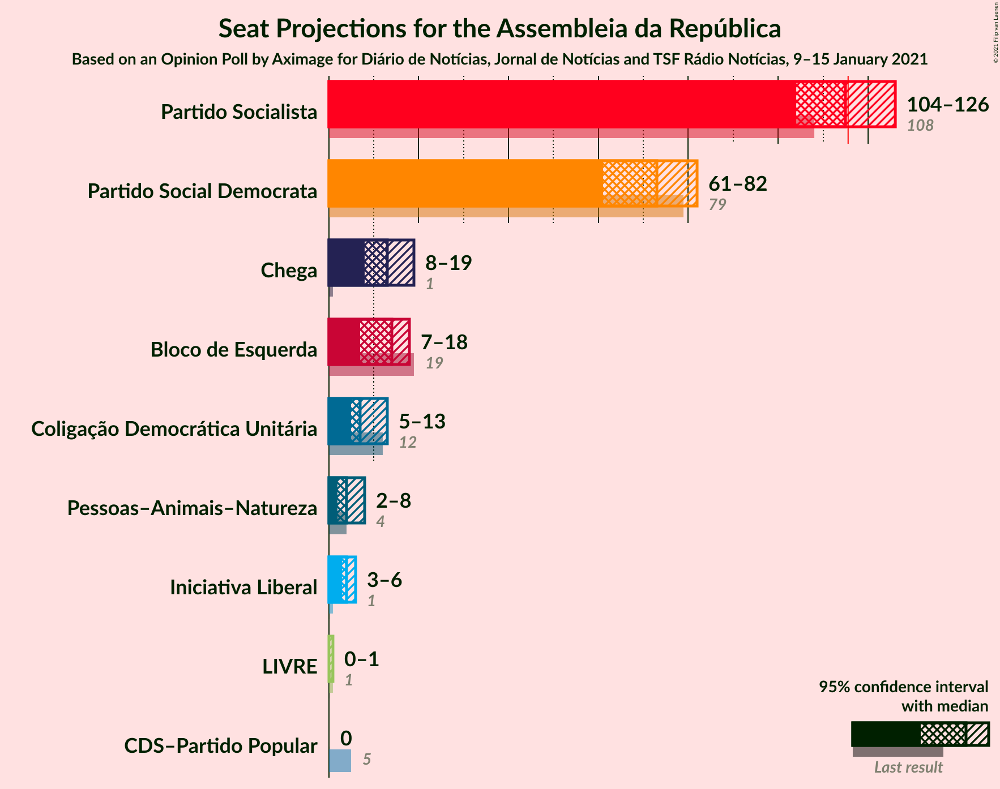
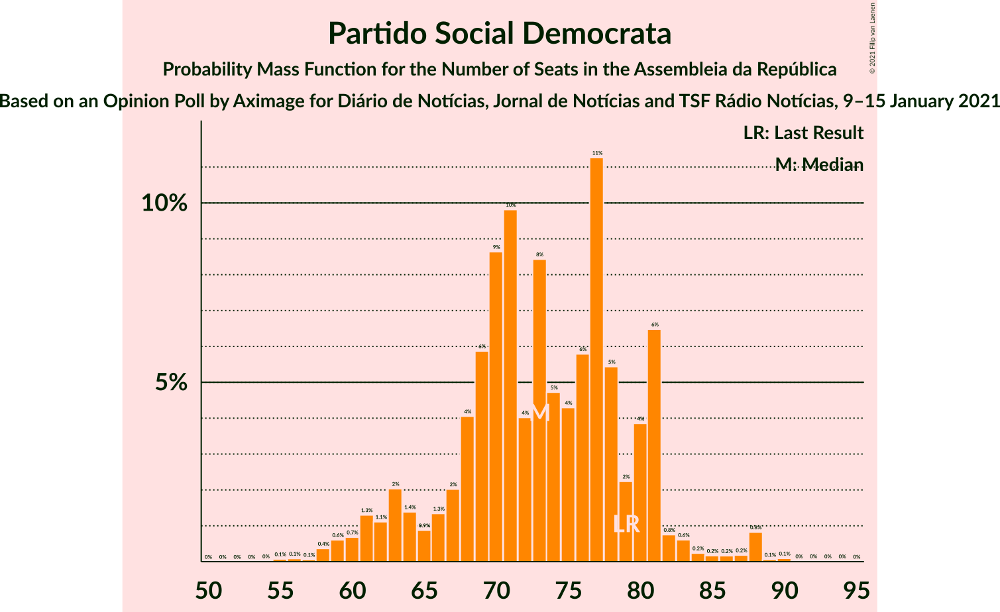
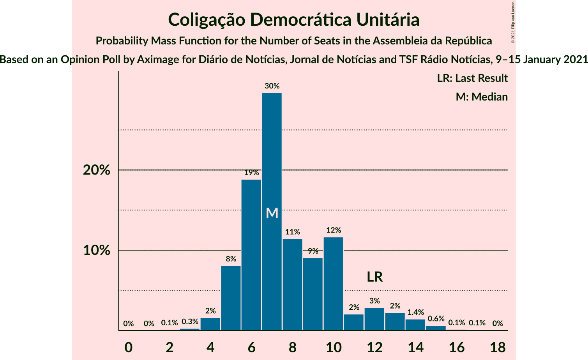

# Opinion Poll by Aximage for Diário de Notícias, Jornal de Notícias and TSF Rádio Notícias, 9–15 January 2021

<a href="#voting-intentions">Voting Intentions</a> | <a href="#seats">Seats</a> | <a href="#coalitions">Coalitions</a> | <a href="#technical-information">Technical Information</a>

## Voting Intentions

### Confidence Intervals

| Party | Last Result | Poll Result | 80% Confidence Interval | 90% Confidence Interval | 95% Confidence Interval | 99% Confidence Interval |
|:-----:|:-----------:|:-----------:|:-----------------------:|:-----------------------:|:-----------------------:|:-----------------------:|
| Partido Socialista | 36.4% | 39.8% | 37.4–42.4% |36.7–43.1% |36.1–43.7% |34.9–44.9% |
| Partido Social Democrata | 27.8% | 26.6% | 24.4–29.0% |23.8–29.6% |23.3–30.2% |22.3–31.3% |
| Chega | 1.3% | 7.6% | 6.4–9.1% |6.0–9.5% |5.7–9.9% |5.2–10.7% |
| Bloco de Esquerda | 9.5% | 7.2% | 6.1–8.7% |5.7–9.2% |5.5–9.5% |5.0–10.3% |
| Coligação Democrática Unitária | 6.3% | 5.0% | 4.1–6.3% |3.8–6.7% |3.6–7.0% |3.2–7.7% |
| Pessoas–Animais–Natureza | 3.3% | 3.5% | 2.7–4.6% |2.5–4.9% |2.3–5.2% |2.0–5.8% |
| Iniciativa Liberal | 1.3% | 3.5% | 2.7–4.6% |2.5–4.9% |2.3–5.2% |2.0–5.8% |
| CDS–Partido Popular | 4.2% | 0.8% | 0.5–1.5% |0.4–1.6% |0.3–1.8% |0.2–2.2% |
| LIVRE | 1.1% | 0.6% | 0.4–1.3% |0.3–1.4% |0.2–1.6% |0.2–2.0% |

*Note:* The poll result column reflects the actual value used in the calculations. Published results may vary slightly, and in addition be rounded to fewer digits.

## Seats

### Confidence Intervals

| Party | Last Result | Median | 80% Confidence Interval | 90% Confidence Interval | 95% Confidence Interval | 99% Confidence Interval |
|:-----:|:-----------:|:------:|:-----------------------:|:-----------------------:|:-----------------------:|:-----------------------:|
| <a href="#partido-socialista">Partido Socialista</a> | 108 | 114 | 107–121 |106–126 |106–128 |101–130 |
| <a href="#partido-social-democrata">Partido Social Democrata</a> | 79 | 74 | 65–81 |61–81 |61–83 |58–88 |
| <a href="#chega">Chega</a> | 1 | 13 | 11–18 |10–19 |8–19 |7–23 |
| <a href="#bloco-de-esquerda">Bloco de Esquerda</a> | 19 | 12 | 11–18 |7–18 |7–18 |7–19 |
| <a href="#coligação-democrática-unitária">Coligação Democrática Unitária</a> | 12 | 7 | 6–10 |5–11 |4–13 |4–15 |
| <a href="#pessoas–animais–natureza">Pessoas–Animais–Natureza</a> | 4 | 4 | 3–6 |2–8 |2–8 |1–9 |
| <a href="#iniciativa-liberal">Iniciativa Liberal</a> | 1 | 5 | 3–6 |3–6 |3–7 |3–9 |
| <a href="#cds–partido-popular">CDS–Partido Popular</a> | 5 | 0 | 0 |0 |0 |0–1 |
| <a href="#livre">LIVRE</a> | 1 | 0 | 0–1 |0–1 |0–1 |0–1 |

### Partido Socialista

*For a full overview of the results for this party, see the [Partido Socialista](party-partidosocialista.html) page.*

| Number of Seats | Probability | Accumulated | Special Marks |
|:---------------:|:-----------:|:-----------:|:-------------:|
| 95 | 0% | 100% |  |
| 96 | 0% | 99.9% |  |
| 97 | 0% | 99.9% |  |
| 98 | 0.1% | 99.9% |  |
| 99 | 0.1% | 99.8% |  |
| 100 | 0.1% | 99.7% |  |
| 101 | 0.1% | 99.6% |  |
| 102 | 0.9% | 99.5% |  |
| 103 | 0.4% | 98.6% |  |
| 104 | 0.2% | 98% |  |
| 105 | 0.4% | 98% |  |
| 106 | 5% | 98% |  |
| 107 | 6% | 93% |  |
| 108 | 2% | 87% | Last Result |
| 109 | 17% | 85% |  |
| 110 | 2% | 68% |  |
| 111 | 6% | 66% |  |
| 112 | 2% | 60% |  |
| 113 | 0.8% | 58% |  |
| 114 | 8% | 58% | Median |
| 115 | 21% | 49% |  |
| 116 | 3% | 28% | Majority |
| 117 | 0.8% | 25% |  |
| 118 | 8% | 24% |  |
| 119 | 3% | 16% |  |
| 120 | 2% | 13% |  |
| 121 | 1.3% | 11% |  |
| 122 | 0.4% | 10% |  |
| 123 | 4% | 10% |  |
| 124 | 0.5% | 6% |  |
| 125 | 0.5% | 6% |  |
| 126 | 0.5% | 5% |  |
| 127 | 1.5% | 5% |  |
| 128 | 0.8% | 3% |  |
| 129 | 2% | 2% |  |
| 130 | 0.6% | 0.8% |  |
| 131 | 0% | 0.2% |  |
| 132 | 0% | 0.1% |  |
| 133 | 0.1% | 0.1% |  |
| 134 | 0% | 0% |  |

### Partido Social Democrata

*For a full overview of the results for this party, see the [Partido Social Democrata](party-partidosocialdemocrata.html) page.*

| Number of Seats | Probability | Accumulated | Special Marks |
|:---------------:|:-----------:|:-----------:|:-------------:|
| 55 | 0.1% | 100% |  |
| 56 | 0.1% | 99.9% |  |
| 57 | 0.1% | 99.8% |  |
| 58 | 1.4% | 99.8% |  |
| 59 | 0.3% | 98% |  |
| 60 | 0.1% | 98% |  |
| 61 | 4% | 98% |  |
| 62 | 2% | 94% |  |
| 63 | 2% | 92% |  |
| 64 | 0.3% | 91% |  |
| 65 | 1.0% | 90% |  |
| 66 | 1.5% | 89% |  |
| 67 | 4% | 88% |  |
| 68 | 2% | 84% |  |
| 69 | 1.0% | 82% |  |
| 70 | 3% | 81% |  |
| 71 | 1.1% | 78% |  |
| 72 | 19% | 76% |  |
| 73 | 5% | 57% |  |
| 74 | 10% | 52% | Median |
| 75 | 2% | 42% |  |
| 76 | 9% | 40% |  |
| 77 | 2% | 30% |  |
| 78 | 2% | 28% |  |
| 79 | 5% | 26% | Last Result |
| 80 | 0.6% | 21% |  |
| 81 | 17% | 20% |  |
| 82 | 0.7% | 3% |  |
| 83 | 0.8% | 3% |  |
| 84 | 0.2% | 2% |  |
| 85 | 0.1% | 2% |  |
| 86 | 0.6% | 2% |  |
| 87 | 0.1% | 1.0% |  |
| 88 | 0.8% | 1.0% |  |
| 89 | 0.1% | 0.1% |  |
| 90 | 0% | 0.1% |  |
| 91 | 0% | 0.1% |  |
| 92 | 0% | 0% |  |

### Chega

*For a full overview of the results for this party, see the [Chega](party-chega.html) page.*

| Number of Seats | Probability | Accumulated | Special Marks |
|:---------------:|:-----------:|:-----------:|:-------------:|
| 1 | 0% | 100% | Last Result |
| 2 | 0% | 100% |  |
| 3 | 0% | 100% |  |
| 4 | 0% | 100% |  |
| 5 | 0.1% | 100% |  |
| 6 | 0.1% | 99.9% |  |
| 7 | 0.7% | 99.8% |  |
| 8 | 2% | 99.1% |  |
| 9 | 1.1% | 97% |  |
| 10 | 2% | 96% |  |
| 11 | 33% | 94% |  |
| 12 | 3% | 62% |  |
| 13 | 23% | 59% | Median |
| 14 | 21% | 36% |  |
| 15 | 0.7% | 16% |  |
| 16 | 1.0% | 15% |  |
| 17 | 3% | 14% |  |
| 18 | 5% | 11% |  |
| 19 | 4% | 6% |  |
| 20 | 0.2% | 2% |  |
| 21 | 0.3% | 2% |  |
| 22 | 0.2% | 2% |  |
| 23 | 1.2% | 1.4% |  |
| 24 | 0% | 0.1% |  |
| 25 | 0.1% | 0.1% |  |
| 26 | 0% | 0% |  |

### Bloco de Esquerda

*For a full overview of the results for this party, see the [Bloco de Esquerda](party-blocodeesquerda.html) page.*

| Number of Seats | Probability | Accumulated | Special Marks |
|:---------------:|:-----------:|:-----------:|:-------------:|
| 7 | 6% | 100% |  |
| 8 | 1.5% | 94% |  |
| 9 | 0.2% | 93% |  |
| 10 | 2% | 92% |  |
| 11 | 32% | 90% |  |
| 12 | 13% | 59% | Median |
| 13 | 0.5% | 45% |  |
| 14 | 22% | 45% |  |
| 15 | 4% | 23% |  |
| 16 | 4% | 19% |  |
| 17 | 2% | 15% |  |
| 18 | 13% | 14% |  |
| 19 | 0.8% | 1.2% | Last Result |
| 20 | 0.1% | 0.5% |  |
| 21 | 0.3% | 0.4% |  |
| 22 | 0% | 0.1% |  |
| 23 | 0.1% | 0.1% |  |
| 24 | 0% | 0% |  |

### Coligação Democrática Unitária

*For a full overview of the results for this party, see the [Coligação Democrática Unitária](party-coligaçãodemocráticaunitária.html) page.*

| Number of Seats | Probability | Accumulated | Special Marks |
|:---------------:|:-----------:|:-----------:|:-------------:|
| 3 | 0.2% | 100% |  |
| 4 | 3% | 99.7% |  |
| 5 | 6% | 97% |  |
| 6 | 29% | 92% |  |
| 7 | 29% | 62% | Median |
| 8 | 10% | 33% |  |
| 9 | 6% | 23% |  |
| 10 | 8% | 16% |  |
| 11 | 4% | 8% |  |
| 12 | 0.6% | 4% | Last Result |
| 13 | 1.0% | 3% |  |
| 14 | 1.2% | 2% |  |
| 15 | 0.5% | 0.7% |  |
| 16 | 0.1% | 0.2% |  |
| 17 | 0.1% | 0.1% |  |
| 18 | 0% | 0% |  |

### Pessoas–Animais–Natureza

*For a full overview of the results for this party, see the [Pessoas–Animais–Natureza](party-pessoas–animais–natureza.html) page.*

| Number of Seats | Probability | Accumulated | Special Marks |
|:---------------:|:-----------:|:-----------:|:-------------:|
| 1 | 1.1% | 100% |  |
| 2 | 7% | 98.9% |  |
| 3 | 33% | 92% |  |
| 4 | 37% | 59% | Last Result, Median |
| 5 | 6% | 22% |  |
| 6 | 9% | 16% |  |
| 7 | 0.9% | 8% |  |
| 8 | 6% | 7% |  |
| 9 | 0.7% | 0.8% |  |
| 10 | 0.1% | 0.2% |  |
| 11 | 0% | 0.1% |  |
| 12 | 0.1% | 0.1% |  |
| 13 | 0% | 0% |  |

### Iniciativa Liberal

*For a full overview of the results for this party, see the [Iniciativa Liberal](party-iniciativaliberal.html) page.*

| Number of Seats | Probability | Accumulated | Special Marks |
|:---------------:|:-----------:|:-----------:|:-------------:|
| 1 | 0.1% | 100% | Last Result |
| 2 | 0.1% | 99.9% |  |
| 3 | 15% | 99.8% |  |
| 4 | 23% | 85% |  |
| 5 | 46% | 62% | Median |
| 6 | 14% | 16% |  |
| 7 | 1.1% | 3% |  |
| 8 | 1.0% | 2% |  |
| 9 | 0.5% | 0.8% |  |
| 10 | 0.2% | 0.3% |  |
| 11 | 0% | 0.1% |  |
| 12 | 0% | 0% |  |

### CDS–Partido Popular

*For a full overview of the results for this party, see the [CDS–Partido Popular](party-cds–partidopopular.html) page.*

| Number of Seats | Probability | Accumulated | Special Marks |
|:---------------:|:-----------:|:-----------:|:-------------:|
| 0 | 98% | 100% | Median |
| 1 | 2% | 2% |  |
| 2 | 0.1% | 0.1% |  |
| 3 | 0% | 0% |  |
| 4 | 0% | 0% |  |
| 5 | 0% | 0% | Last Result |

### LIVRE

*For a full overview of the results for this party, see the [LIVRE](party-livre.html) page.*

| Number of Seats | Probability | Accumulated | Special Marks |
|:---------------:|:-----------:|:-----------:|:-------------:|
| 0 | 66% | 100% | Median |
| 1 | 33% | 34% | Last Result |
| 2 | 0.2% | 0.2% |  |
| 3 | 0% | 0% |  |

## Coalitions

### Confidence Intervals

| Coalition | Last Result | Median | Majority? | 80% Confidence Interval | 90% Confidence Interval | 95% Confidence Interval | 99% Confidence Interval |
|:---------:|:-----------:|:------:|:---------:|:-----------------------:|:-----------------------:|:-----------------------:|:-----------------------:|
| Partido Socialista – Bloco de Esquerda – Coligação Democrática Unitária | 139 | 135 | 100% | 126–143 | 126–150 | 125–151 | 123–151 |
| Partido Socialista – Bloco de Esquerda | 127 | 126 | 99.4% | 120–136 | 120–141 | 118–141 | 115–145 |
| Partido Socialista – Coligação Democrática Unitária | 120 | 122 | 73% | 115–130 | 113–133 | 113–135 | 109–138 |
| Partido Socialista | 108 | 114 | 28% | 107–121 | 106–126 | 106–128 | 101–130 |
| Partido Social Democrata – CDS–Partido Popular | 84 | 74 | 0% | 65–81 | 61–81 | 61–83 | 58–88 |

### Partido Socialista – Bloco de Esquerda – Coligação Democrática Unitária

| Number of Seats | Probability | Accumulated | Special Marks |
|:---------------:|:-----------:|:-----------:|:-------------:|
| 116 | 0.1% | 100% | Majority |
| 117 | 0% | 99.9% |  |
| 118 | 0% | 99.9% |  |
| 119 | 0% | 99.8% |  |
| 120 | 0.1% | 99.8% |  |
| 121 | 0.1% | 99.7% |  |
| 122 | 0.1% | 99.6% |  |
| 123 | 0.2% | 99.5% |  |
| 124 | 0.3% | 99.3% |  |
| 125 | 2% | 99.0% |  |
| 126 | 17% | 97% |  |
| 127 | 1.0% | 80% |  |
| 128 | 0.8% | 79% |  |
| 129 | 0.7% | 78% |  |
| 130 | 2% | 78% |  |
| 131 | 13% | 76% |  |
| 132 | 4% | 62% |  |
| 133 | 2% | 58% | Median |
| 134 | 2% | 56% |  |
| 135 | 13% | 55% |  |
| 136 | 23% | 42% |  |
| 137 | 2% | 18% |  |
| 138 | 2% | 17% |  |
| 139 | 0.6% | 15% | Last Result |
| 140 | 0.7% | 14% |  |
| 141 | 1.1% | 14% |  |
| 142 | 0.7% | 12% |  |
| 143 | 2% | 12% |  |
| 144 | 2% | 10% |  |
| 145 | 0.5% | 7% |  |
| 146 | 0.1% | 7% |  |
| 147 | 0% | 7% |  |
| 148 | 0.5% | 7% |  |
| 149 | 0.5% | 6% |  |
| 150 | 2% | 6% |  |
| 151 | 3% | 3% |  |
| 152 | 0% | 0.1% |  |
| 153 | 0.1% | 0.1% |  |
| 154 | 0% | 0.1% |  |
| 155 | 0% | 0% |  |

### Partido Socialista – Bloco de Esquerda

| Number of Seats | Probability | Accumulated | Special Marks |
|:---------------:|:-----------:|:-----------:|:-------------:|
| 107 | 0% | 100% |  |
| 108 | 0% | 99.9% |  |
| 109 | 0.1% | 99.9% |  |
| 110 | 0% | 99.9% |  |
| 111 | 0.1% | 99.8% |  |
| 112 | 0% | 99.8% |  |
| 113 | 0% | 99.7% |  |
| 114 | 0.1% | 99.7% |  |
| 115 | 0.1% | 99.6% |  |
| 116 | 1.0% | 99.4% | Majority |
| 117 | 0.5% | 98% |  |
| 118 | 0.6% | 98% |  |
| 119 | 0.3% | 97% |  |
| 120 | 19% | 97% |  |
| 121 | 0.6% | 78% |  |
| 122 | 2% | 77% |  |
| 123 | 8% | 75% |  |
| 124 | 6% | 67% |  |
| 125 | 7% | 61% |  |
| 126 | 7% | 53% | Median |
| 127 | 2% | 47% | Last Result |
| 128 | 1.2% | 44% |  |
| 129 | 26% | 43% |  |
| 130 | 1.3% | 17% |  |
| 131 | 1.4% | 16% |  |
| 132 | 1.2% | 15% |  |
| 133 | 0.8% | 13% |  |
| 134 | 0.5% | 13% |  |
| 135 | 0.9% | 12% |  |
| 136 | 1.3% | 11% |  |
| 137 | 0.9% | 10% |  |
| 138 | 2% | 9% |  |
| 139 | 0.9% | 7% |  |
| 140 | 0.5% | 6% |  |
| 141 | 4% | 6% |  |
| 142 | 0.4% | 1.3% |  |
| 143 | 0.1% | 0.8% |  |
| 144 | 0.1% | 0.8% |  |
| 145 | 0.6% | 0.6% |  |
| 146 | 0% | 0.1% |  |
| 147 | 0% | 0.1% |  |
| 148 | 0% | 0% |  |

### Partido Socialista – Coligação Democrática Unitária

| Number of Seats | Probability | Accumulated | Special Marks |
|:---------------:|:-----------:|:-----------:|:-------------:|
| 103 | 0% | 100% |  |
| 104 | 0% | 99.9% |  |
| 105 | 0.2% | 99.9% |  |
| 106 | 0% | 99.7% |  |
| 107 | 0.1% | 99.7% |  |
| 108 | 0.1% | 99.6% |  |
| 109 | 0.2% | 99.5% |  |
| 110 | 0.3% | 99.3% |  |
| 111 | 0.9% | 99.0% |  |
| 112 | 0.2% | 98% |  |
| 113 | 5% | 98% |  |
| 114 | 0.8% | 93% |  |
| 115 | 19% | 92% |  |
| 116 | 2% | 73% | Majority |
| 117 | 3% | 71% |  |
| 118 | 0.7% | 68% |  |
| 119 | 7% | 67% |  |
| 120 | 5% | 61% | Last Result |
| 121 | 2% | 55% | Median |
| 122 | 21% | 53% |  |
| 123 | 2% | 32% |  |
| 124 | 8% | 30% |  |
| 125 | 4% | 22% |  |
| 126 | 1.0% | 18% |  |
| 127 | 1.5% | 17% |  |
| 128 | 4% | 15% |  |
| 129 | 1.1% | 12% |  |
| 130 | 0.9% | 11% |  |
| 131 | 0.3% | 10% |  |
| 132 | 1.4% | 9% |  |
| 133 | 4% | 8% |  |
| 134 | 0.9% | 4% |  |
| 135 | 1.0% | 3% |  |
| 136 | 0% | 2% |  |
| 137 | 0.1% | 2% |  |
| 138 | 1.4% | 2% |  |
| 139 | 0.2% | 0.3% |  |
| 140 | 0.1% | 0.2% |  |
| 141 | 0% | 0.1% |  |
| 142 | 0.1% | 0.1% |  |
| 143 | 0% | 0% |  |

### Partido Socialista

| Number of Seats | Probability | Accumulated | Special Marks |
|:---------------:|:-----------:|:-----------:|:-------------:|
| 95 | 0% | 100% |  |
| 96 | 0% | 99.9% |  |
| 97 | 0% | 99.9% |  |
| 98 | 0.1% | 99.9% |  |
| 99 | 0.1% | 99.8% |  |
| 100 | 0.1% | 99.7% |  |
| 101 | 0.1% | 99.6% |  |
| 102 | 0.9% | 99.5% |  |
| 103 | 0.4% | 98.6% |  |
| 104 | 0.2% | 98% |  |
| 105 | 0.4% | 98% |  |
| 106 | 5% | 98% |  |
| 107 | 6% | 93% |  |
| 108 | 2% | 87% | Last Result |
| 109 | 17% | 85% |  |
| 110 | 2% | 68% |  |
| 111 | 6% | 66% |  |
| 112 | 2% | 60% |  |
| 113 | 0.8% | 58% |  |
| 114 | 8% | 58% | Median |
| 115 | 21% | 49% |  |
| 116 | 3% | 28% | Majority |
| 117 | 0.8% | 25% |  |
| 118 | 8% | 24% |  |
| 119 | 3% | 16% |  |
| 120 | 2% | 13% |  |
| 121 | 1.3% | 11% |  |
| 122 | 0.4% | 10% |  |
| 123 | 4% | 10% |  |
| 124 | 0.5% | 6% |  |
| 125 | 0.5% | 6% |  |
| 126 | 0.5% | 5% |  |
| 127 | 1.5% | 5% |  |
| 128 | 0.8% | 3% |  |
| 129 | 2% | 2% |  |
| 130 | 0.6% | 0.8% |  |
| 131 | 0% | 0.2% |  |
| 132 | 0% | 0.1% |  |
| 133 | 0.1% | 0.1% |  |
| 134 | 0% | 0% |  |

### Partido Social Democrata – CDS–Partido Popular

| Number of Seats | Probability | Accumulated | Special Marks |
|:---------------:|:-----------:|:-----------:|:-------------:|
| 55 | 0.1% | 100% |  |
| 56 | 0.1% | 99.9% |  |
| 57 | 0.1% | 99.8% |  |
| 58 | 1.4% | 99.8% |  |
| 59 | 0.3% | 98% |  |
| 60 | 0.1% | 98% |  |
| 61 | 4% | 98% |  |
| 62 | 2% | 94% |  |
| 63 | 2% | 92% |  |
| 64 | 0.3% | 91% |  |
| 65 | 1.0% | 90% |  |
| 66 | 1.5% | 89% |  |
| 67 | 4% | 88% |  |
| 68 | 2% | 84% |  |
| 69 | 0.9% | 82% |  |
| 70 | 3% | 81% |  |
| 71 | 1.4% | 78% |  |
| 72 | 19% | 76% |  |
| 73 | 5% | 57% |  |
| 74 | 10% | 52% | Median |
| 75 | 1.4% | 42% |  |
| 76 | 10% | 40% |  |
| 77 | 2% | 30% |  |
| 78 | 2% | 28% |  |
| 79 | 5% | 26% |  |
| 80 | 0.6% | 21% |  |
| 81 | 17% | 20% |  |
| 82 | 0.7% | 3% |  |
| 83 | 0.8% | 3% |  |
| 84 | 0.2% | 2% | Last Result |
| 85 | 0.1% | 2% |  |
| 86 | 0.6% | 2% |  |
| 87 | 0.1% | 1.0% |  |
| 88 | 0.8% | 1.0% |  |
| 89 | 0.1% | 0.2% |  |
| 90 | 0% | 0.1% |  |
| 91 | 0% | 0.1% |  |
| 92 | 0% | 0% |  |

## Technical Information

### Opinion Poll

+ **Polling firm:** Aximage
+ **Commissioner(s):** Diário de Notícias, Jornal de Notícias and TSF Rádio Notícias
+ **Fieldwork period:** 9–15 January 2021

### Calculations

+ **Sample size:** 635
+ **Simulations done:** 131,072
+ **Error estimate:** 1.07%

