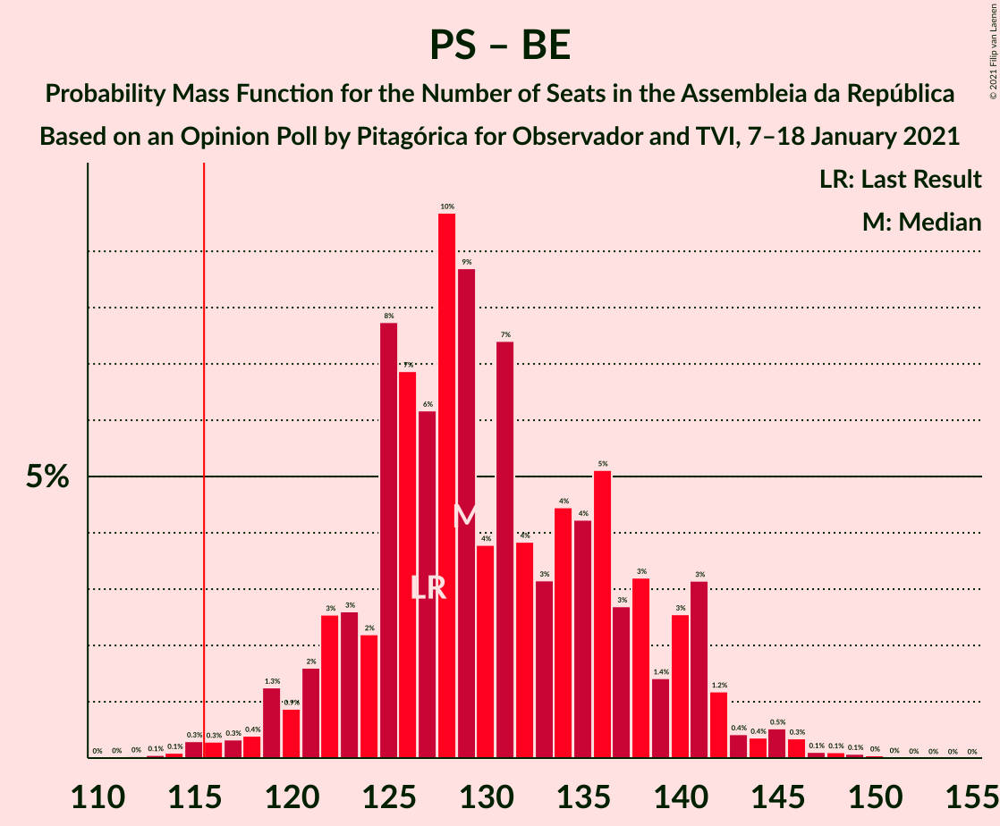

# Opinion Poll by Pitagórica for Observador and TVI, 7–18 January 2021

<a href="#voting-intentions">Voting Intentions</a> | <a href="#seats">Seats</a> | <a href="#coalitions">Coalitions</a> | <a href="#technical-information">Technical Information</a>

## Voting Intentions

### Confidence Intervals

| Party | Last Result | Poll Result | 80% Confidence Interval | 90% Confidence Interval | 95% Confidence Interval | 99% Confidence Interval |
|:-----:|:-----------:|:-----------:|:-----------------------:|:-----------------------:|:-----------------------:|:-----------------------:|
| Partido Socialista | 36.4% | 42.4% | 39.9–45.0% |39.2–45.7% |38.6–46.3% |37.4–47.6% |
| Partido Social Democrata | 27.8% | 25.6% | 23.5–27.9% |22.8–28.6% |22.3–29.2% |21.3–30.3% |
| Chega | 1.3% | 6.8% | 5.7–8.3% |5.4–8.7% |5.1–9.1% |4.6–9.8% |
| Bloco de Esquerda | 9.5% | 5.4% | 4.4–6.8% |4.1–7.1% |3.9–7.5% |3.5–8.2% |
| Coligação Democrática Unitária | 6.3% | 5.4% | 4.4–6.8% |4.1–7.1% |3.9–7.5% |3.5–8.2% |
| Iniciativa Liberal | 1.3% | 4.9% | 4.0–6.2% |3.7–6.6% |3.5–6.9% |3.1–7.6% |
| Pessoas–Animais–Natureza | 3.3% | 2.2% | 1.6–3.2% |1.5–3.5% |1.3–3.7% |1.1–4.2% |
| CDS–Partido Popular | 4.2% | 1.6% | 1.1–2.4% |1.0–2.7% |0.9–2.9% |0.7–3.4% |

*Note:* The poll result column reflects the actual value used in the calculations. Published results may vary slightly, and in addition be rounded to fewer digits.

## Seats

### Confidence Intervals

| Party | Last Result | Median | 80% Confidence Interval | 90% Confidence Interval | 95% Confidence Interval | 99% Confidence Interval |
|:-----:|:-----------:|:------:|:-----------------------:|:-----------------------:|:-----------------------:|:-----------------------:|
| <a href="#partido-socialista">Partido Socialista</a> | 108 | 121 | 114–130 |111–132 |108–134 |108–137 |
| <a href="#partido-social-democrata">Partido Social Democrata</a> | 79 | 70 | 62–76 |59–77 |59–79 |56–83 |
| <a href="#chega">Chega</a> | 1 | 11 | 9–14 |8–14 |7–15 |6–19 |
| <a href="#bloco-de-esquerda">Bloco de Esquerda</a> | 19 | 7 | 5–11 |5–13 |4–14 |2–16 |
| <a href="#coligação-democrática-unitária">Coligação Democrática Unitária</a> | 12 | 9 | 5–14 |5–14 |5–15 |4–16 |
| <a href="#iniciativa-liberal">Iniciativa Liberal</a> | 1 | 6 | 5–10 |4–12 |4–12 |3–14 |
| <a href="#pessoas–animais–natureza">Pessoas–Animais–Natureza</a> | 4 | 2 | 1–2 |0–3 |0–4 |0–5 |
| <a href="#cds–partido-popular">CDS–Partido Popular</a> | 5 | 0 | 0–1 |0–2 |0–2 |0–3 |

### Partido Socialista

*For a full overview of the results for this party, see the [Partido Socialista](party-partidosocialista.html) page.*

| Number of Seats | Probability | Accumulated | Special Marks |
|:---------------:|:-----------:|:-----------:|:-------------:|
| 103 | 0% | 100% |  |
| 104 | 0% | 99.9% |  |
| 105 | 0% | 99.9% |  |
| 106 | 0.1% | 99.9% |  |
| 107 | 0.2% | 99.8% |  |
| 108 | 2% | 99.5% | Last Result |
| 109 | 0.6% | 97% |  |
| 110 | 2% | 97% |  |
| 111 | 0.3% | 95% |  |
| 112 | 0.8% | 95% |  |
| 113 | 3% | 94% |  |
| 114 | 2% | 91% |  |
| 115 | 6% | 89% |  |
| 116 | 8% | 83% | Majority |
| 117 | 2% | 75% |  |
| 118 | 4% | 73% |  |
| 119 | 2% | 69% |  |
| 120 | 13% | 66% |  |
| 121 | 6% | 53% | Median |
| 122 | 3% | 47% |  |
| 123 | 8% | 44% |  |
| 124 | 3% | 36% |  |
| 125 | 5% | 32% |  |
| 126 | 4% | 27% |  |
| 127 | 1.4% | 23% |  |
| 128 | 2% | 22% |  |
| 129 | 8% | 20% |  |
| 130 | 2% | 11% |  |
| 131 | 2% | 10% |  |
| 132 | 3% | 7% |  |
| 133 | 0.9% | 4% |  |
| 134 | 2% | 4% |  |
| 135 | 0.3% | 1.3% |  |
| 136 | 0.4% | 1.0% |  |
| 137 | 0.4% | 0.7% |  |
| 138 | 0.1% | 0.3% |  |
| 139 | 0% | 0.2% |  |
| 140 | 0.1% | 0.1% |  |
| 141 | 0% | 0.1% |  |
| 142 | 0% | 0% |  |

### Partido Social Democrata

*For a full overview of the results for this party, see the [Partido Social Democrata](party-partidosocialdemocrata.html) page.*

| Number of Seats | Probability | Accumulated | Special Marks |
|:---------------:|:-----------:|:-----------:|:-------------:|
| 53 | 0.1% | 100% |  |
| 54 | 0.2% | 99.9% |  |
| 55 | 0.1% | 99.7% |  |
| 56 | 0.2% | 99.6% |  |
| 57 | 0.6% | 99.4% |  |
| 58 | 1.1% | 98.8% |  |
| 59 | 3% | 98% |  |
| 60 | 2% | 94% |  |
| 61 | 2% | 93% |  |
| 62 | 2% | 91% |  |
| 63 | 9% | 90% |  |
| 64 | 1.0% | 80% |  |
| 65 | 4% | 79% |  |
| 66 | 6% | 76% |  |
| 67 | 4% | 70% |  |
| 68 | 4% | 66% |  |
| 69 | 9% | 61% |  |
| 70 | 14% | 52% | Median |
| 71 | 15% | 38% |  |
| 72 | 1.5% | 23% |  |
| 73 | 0.7% | 22% |  |
| 74 | 0.9% | 21% |  |
| 75 | 2% | 20% |  |
| 76 | 9% | 18% |  |
| 77 | 4% | 9% |  |
| 78 | 1.4% | 5% |  |
| 79 | 1.2% | 3% | Last Result |
| 80 | 1.0% | 2% |  |
| 81 | 0.3% | 0.9% |  |
| 82 | 0.1% | 0.6% |  |
| 83 | 0.2% | 0.5% |  |
| 84 | 0.2% | 0.3% |  |
| 85 | 0.1% | 0.2% |  |
| 86 | 0.1% | 0.1% |  |
| 87 | 0% | 0% |  |

### Chega

*For a full overview of the results for this party, see the [Chega](party-chega.html) page.*

| Number of Seats | Probability | Accumulated | Special Marks |
|:---------------:|:-----------:|:-----------:|:-------------:|
| 1 | 0% | 100% | Last Result |
| 2 | 0% | 100% |  |
| 3 | 0% | 100% |  |
| 4 | 0.3% | 100% |  |
| 5 | 0.1% | 99.7% |  |
| 6 | 0.3% | 99.6% |  |
| 7 | 2% | 99.3% |  |
| 8 | 5% | 97% |  |
| 9 | 6% | 92% |  |
| 10 | 15% | 86% |  |
| 11 | 36% | 71% | Median |
| 12 | 9% | 34% |  |
| 13 | 2% | 25% |  |
| 14 | 20% | 23% |  |
| 15 | 2% | 4% |  |
| 16 | 0.5% | 2% |  |
| 17 | 0.5% | 2% |  |
| 18 | 0.5% | 1.0% |  |
| 19 | 0.1% | 0.5% |  |
| 20 | 0.2% | 0.4% |  |
| 21 | 0.1% | 0.1% |  |
| 22 | 0% | 0.1% |  |
| 23 | 0% | 0% |  |

### Bloco de Esquerda

*For a full overview of the results for this party, see the [Bloco de Esquerda](party-blocodeesquerda.html) page.*

| Number of Seats | Probability | Accumulated | Special Marks |
|:---------------:|:-----------:|:-----------:|:-------------:|
| 2 | 0.7% | 100% |  |
| 3 | 1.4% | 99.3% |  |
| 4 | 3% | 98% |  |
| 5 | 6% | 95% |  |
| 6 | 0.6% | 90% |  |
| 7 | 47% | 89% | Median |
| 8 | 3% | 43% |  |
| 9 | 5% | 40% |  |
| 10 | 8% | 35% |  |
| 11 | 18% | 26% |  |
| 12 | 3% | 9% |  |
| 13 | 2% | 6% |  |
| 14 | 3% | 4% |  |
| 15 | 1.0% | 2% |  |
| 16 | 0.3% | 0.5% |  |
| 17 | 0.1% | 0.3% |  |
| 18 | 0.2% | 0.2% |  |
| 19 | 0% | 0% | Last Result |

### Coligação Democrática Unitária

*For a full overview of the results for this party, see the [Coligação Democrática Unitária](party-coligaçãodemocráticaunitária.html) page.*

| Number of Seats | Probability | Accumulated | Special Marks |
|:---------------:|:-----------:|:-----------:|:-------------:|
| 3 | 0.3% | 100% |  |
| 4 | 0.5% | 99.7% |  |
| 5 | 23% | 99.3% |  |
| 6 | 8% | 76% |  |
| 7 | 5% | 68% |  |
| 8 | 5% | 63% |  |
| 9 | 11% | 58% | Median |
| 10 | 19% | 47% |  |
| 11 | 3% | 28% |  |
| 12 | 6% | 25% | Last Result |
| 13 | 4% | 19% |  |
| 14 | 9% | 14% |  |
| 15 | 4% | 5% |  |
| 16 | 0.3% | 0.6% |  |
| 17 | 0.2% | 0.3% |  |
| 18 | 0.1% | 0.1% |  |
| 19 | 0% | 0% |  |

### Iniciativa Liberal

*For a full overview of the results for this party, see the [Iniciativa Liberal](party-iniciativaliberal.html) page.*

| Number of Seats | Probability | Accumulated | Special Marks |
|:---------------:|:-----------:|:-----------:|:-------------:|
| 1 | 0% | 100% | Last Result |
| 2 | 0% | 100% |  |
| 3 | 1.4% | 100% |  |
| 4 | 5% | 98.6% |  |
| 5 | 8% | 94% |  |
| 6 | 43% | 86% | Median |
| 7 | 13% | 43% |  |
| 8 | 5% | 30% |  |
| 9 | 5% | 25% |  |
| 10 | 12% | 20% |  |
| 11 | 1.2% | 8% |  |
| 12 | 6% | 7% |  |
| 13 | 0.2% | 1.0% |  |
| 14 | 0.7% | 0.8% |  |
| 15 | 0.1% | 0.1% |  |
| 16 | 0% | 0% |  |

### Pessoas–Animais–Natureza

*For a full overview of the results for this party, see the [Pessoas–Animais–Natureza](party-pessoas–animais–natureza.html) page.*

| Number of Seats | Probability | Accumulated | Special Marks |
|:---------------:|:-----------:|:-----------:|:-------------:|
| 0 | 6% | 100% |  |
| 1 | 24% | 94% |  |
| 2 | 61% | 69% | Median |
| 3 | 4% | 9% |  |
| 4 | 4% | 5% | Last Result |
| 5 | 0.4% | 0.5% |  |
| 6 | 0.1% | 0.1% |  |
| 7 | 0% | 0% |  |

### CDS–Partido Popular

*For a full overview of the results for this party, see the [CDS–Partido Popular](party-cds–partidopopular.html) page.*

| Number of Seats | Probability | Accumulated | Special Marks |
|:---------------:|:-----------:|:-----------:|:-------------:|
| 0 | 53% | 100% | Median |
| 1 | 41% | 47% |  |
| 2 | 4% | 5% |  |
| 3 | 0.8% | 0.9% |  |
| 4 | 0.1% | 0.1% |  |
| 5 | 0% | 0% | Last Result |

## Coalitions

### Confidence Intervals

| Coalition | Last Result | Median | Majority? | 80% Confidence Interval | 90% Confidence Interval | 95% Confidence Interval | 99% Confidence Interval |
|:---------:|:-----------:|:------:|:---------:|:-----------------------:|:-----------------------:|:-----------------------:|:-----------------------:|
| Partido Socialista – Bloco de Esquerda – Coligação Democrática Unitária | 139 | 138 | 100% | 133–147 | 130–148 | 128–151 | 125–154 |
| Partido Socialista – Bloco de Esquerda | 127 | 130 | 99.5% | 122–137 | 120–141 | 119–142 | 116–145 |
| Partido Socialista – Coligação Democrática Unitária | 120 | 129 | 99.5% | 124–139 | 120–141 | 119–141 | 116–147 |
| Partido Socialista | 108 | 121 | 83% | 114–130 | 111–132 | 108–134 | 108–137 |
| Partido Social Democrata – CDS–Partido Popular | 84 | 70 | 0% | 63–77 | 60–78 | 59–80 | 56–83 |

### Partido Socialista – Bloco de Esquerda – Coligação Democrática Unitária

| Number of Seats | Probability | Accumulated | Special Marks |
|:---------------:|:-----------:|:-----------:|:-------------:|
| 120 | 0% | 100% |  |
| 121 | 0% | 99.9% |  |
| 122 | 0.2% | 99.9% |  |
| 123 | 0% | 99.7% |  |
| 124 | 0.1% | 99.6% |  |
| 125 | 0.1% | 99.5% |  |
| 126 | 0.2% | 99.5% |  |
| 127 | 0.6% | 99.2% |  |
| 128 | 1.3% | 98.6% |  |
| 129 | 1.3% | 97% |  |
| 130 | 1.3% | 96% |  |
| 131 | 2% | 95% |  |
| 132 | 3% | 93% |  |
| 133 | 7% | 90% |  |
| 134 | 4% | 83% |  |
| 135 | 11% | 79% |  |
| 136 | 6% | 68% |  |
| 137 | 5% | 62% | Median |
| 138 | 7% | 57% |  |
| 139 | 6% | 50% | Last Result |
| 140 | 11% | 44% |  |
| 141 | 3% | 33% |  |
| 142 | 3% | 30% |  |
| 143 | 2% | 27% |  |
| 144 | 2% | 25% |  |
| 145 | 2% | 24% |  |
| 146 | 10% | 22% |  |
| 147 | 3% | 12% |  |
| 148 | 4% | 9% |  |
| 149 | 1.3% | 5% |  |
| 150 | 0.6% | 3% |  |
| 151 | 0.6% | 3% |  |
| 152 | 1.1% | 2% |  |
| 153 | 0.1% | 1.0% |  |
| 154 | 0.4% | 0.9% |  |
| 155 | 0.2% | 0.4% |  |
| 156 | 0.1% | 0.2% |  |
| 157 | 0.1% | 0.1% |  |
| 158 | 0% | 0% |  |

### Partido Socialista – Bloco de Esquerda

| Number of Seats | Probability | Accumulated | Special Marks |
|:---------------:|:-----------:|:-----------:|:-------------:|
| 110 | 0% | 100% |  |
| 111 | 0% | 99.9% |  |
| 112 | 0% | 99.9% |  |
| 113 | 0% | 99.9% |  |
| 114 | 0.1% | 99.8% |  |
| 115 | 0.2% | 99.7% |  |
| 116 | 0.2% | 99.5% | Majority |
| 117 | 0.1% | 99.3% |  |
| 118 | 0.2% | 99.2% |  |
| 119 | 2% | 99.1% |  |
| 120 | 3% | 97% |  |
| 121 | 2% | 94% |  |
| 122 | 5% | 93% |  |
| 123 | 2% | 88% |  |
| 124 | 2% | 86% |  |
| 125 | 4% | 84% |  |
| 126 | 10% | 80% |  |
| 127 | 9% | 70% | Last Result |
| 128 | 3% | 62% | Median |
| 129 | 3% | 58% |  |
| 130 | 8% | 55% |  |
| 131 | 9% | 46% |  |
| 132 | 6% | 37% |  |
| 133 | 2% | 31% |  |
| 134 | 5% | 29% |  |
| 135 | 2% | 24% |  |
| 136 | 10% | 22% |  |
| 137 | 2% | 12% |  |
| 138 | 2% | 10% |  |
| 139 | 1.0% | 8% |  |
| 140 | 2% | 7% |  |
| 141 | 3% | 6% |  |
| 142 | 0.7% | 3% |  |
| 143 | 0.9% | 2% |  |
| 144 | 0.5% | 1.1% |  |
| 145 | 0.3% | 0.7% |  |
| 146 | 0% | 0.3% |  |
| 147 | 0.1% | 0.3% |  |
| 148 | 0.1% | 0.2% |  |
| 149 | 0.1% | 0.1% |  |
| 150 | 0% | 0% |  |

### Partido Socialista – Coligação Democrática Unitária

| Number of Seats | Probability | Accumulated | Special Marks |
|:---------------:|:-----------:|:-----------:|:-------------:|
| 112 | 0% | 100% |  |
| 113 | 0.1% | 99.9% |  |
| 114 | 0.1% | 99.9% |  |
| 115 | 0.3% | 99.8% |  |
| 116 | 0.1% | 99.5% | Majority |
| 117 | 1.0% | 99.4% |  |
| 118 | 0.6% | 98% |  |
| 119 | 1.1% | 98% |  |
| 120 | 2% | 97% | Last Result |
| 121 | 0.4% | 95% |  |
| 122 | 1.5% | 94% |  |
| 123 | 1.1% | 93% |  |
| 124 | 2% | 92% |  |
| 125 | 4% | 89% |  |
| 126 | 10% | 85% |  |
| 127 | 3% | 75% |  |
| 128 | 16% | 72% |  |
| 129 | 12% | 56% |  |
| 130 | 4% | 44% | Median |
| 131 | 2% | 41% |  |
| 132 | 2% | 39% |  |
| 133 | 3% | 37% |  |
| 134 | 4% | 34% |  |
| 135 | 3% | 30% |  |
| 136 | 5% | 27% |  |
| 137 | 5% | 22% |  |
| 138 | 2% | 18% |  |
| 139 | 8% | 15% |  |
| 140 | 3% | 8% |  |
| 141 | 3% | 5% |  |
| 142 | 0.6% | 2% |  |
| 143 | 0.3% | 2% |  |
| 144 | 0.3% | 1.2% |  |
| 145 | 0.2% | 0.9% |  |
| 146 | 0.1% | 0.6% |  |
| 147 | 0.4% | 0.5% |  |
| 148 | 0% | 0.2% |  |
| 149 | 0% | 0.2% |  |
| 150 | 0.1% | 0.1% |  |
| 151 | 0% | 0% |  |

### Partido Socialista

| Number of Seats | Probability | Accumulated | Special Marks |
|:---------------:|:-----------:|:-----------:|:-------------:|
| 103 | 0% | 100% |  |
| 104 | 0% | 99.9% |  |
| 105 | 0% | 99.9% |  |
| 106 | 0.1% | 99.9% |  |
| 107 | 0.2% | 99.8% |  |
| 108 | 2% | 99.5% | Last Result |
| 109 | 0.6% | 97% |  |
| 110 | 2% | 97% |  |
| 111 | 0.3% | 95% |  |
| 112 | 0.8% | 95% |  |
| 113 | 3% | 94% |  |
| 114 | 2% | 91% |  |
| 115 | 6% | 89% |  |
| 116 | 8% | 83% | Majority |
| 117 | 2% | 75% |  |
| 118 | 4% | 73% |  |
| 119 | 2% | 69% |  |
| 120 | 13% | 66% |  |
| 121 | 6% | 53% | Median |
| 122 | 3% | 47% |  |
| 123 | 8% | 44% |  |
| 124 | 3% | 36% |  |
| 125 | 5% | 32% |  |
| 126 | 4% | 27% |  |
| 127 | 1.4% | 23% |  |
| 128 | 2% | 22% |  |
| 129 | 8% | 20% |  |
| 130 | 2% | 11% |  |
| 131 | 2% | 10% |  |
| 132 | 3% | 7% |  |
| 133 | 0.9% | 4% |  |
| 134 | 2% | 4% |  |
| 135 | 0.3% | 1.3% |  |
| 136 | 0.4% | 1.0% |  |
| 137 | 0.4% | 0.7% |  |
| 138 | 0.1% | 0.3% |  |
| 139 | 0% | 0.2% |  |
| 140 | 0.1% | 0.1% |  |
| 141 | 0% | 0.1% |  |
| 142 | 0% | 0% |  |

### Partido Social Democrata – CDS–Partido Popular

| Number of Seats | Probability | Accumulated | Special Marks |
|:---------------:|:-----------:|:-----------:|:-------------:|
| 54 | 0.1% | 100% |  |
| 55 | 0.2% | 99.8% |  |
| 56 | 0.2% | 99.7% |  |
| 57 | 0.6% | 99.4% |  |
| 58 | 0.6% | 98.9% |  |
| 59 | 3% | 98% |  |
| 60 | 2% | 96% |  |
| 61 | 0.6% | 93% |  |
| 62 | 3% | 93% |  |
| 63 | 5% | 90% |  |
| 64 | 6% | 86% |  |
| 65 | 4% | 80% |  |
| 66 | 4% | 76% |  |
| 67 | 6% | 72% |  |
| 68 | 4% | 66% |  |
| 69 | 4% | 62% |  |
| 70 | 9% | 58% | Median |
| 71 | 20% | 50% |  |
| 72 | 6% | 30% |  |
| 73 | 2% | 24% |  |
| 74 | 2% | 22% |  |
| 75 | 2% | 21% |  |
| 76 | 5% | 19% |  |
| 77 | 7% | 14% |  |
| 78 | 3% | 7% |  |
| 79 | 1.4% | 4% |  |
| 80 | 2% | 3% |  |
| 81 | 0.4% | 1.0% |  |
| 82 | 0.1% | 0.7% |  |
| 83 | 0.2% | 0.6% |  |
| 84 | 0.2% | 0.4% | Last Result |
| 85 | 0.1% | 0.2% |  |
| 86 | 0.1% | 0.1% |  |
| 87 | 0% | 0% |  |

## Technical Information

### Opinion Poll

+ **Polling firm:** Pitagórica
+ **Commissioner(s):** Observador and TVI
+ **Fieldwork period:** 7–18 January 2021

### Calculations

+ **Sample size:** 629
+ **Simulations done:** 131,072
+ **Error estimate:** 1.49%

