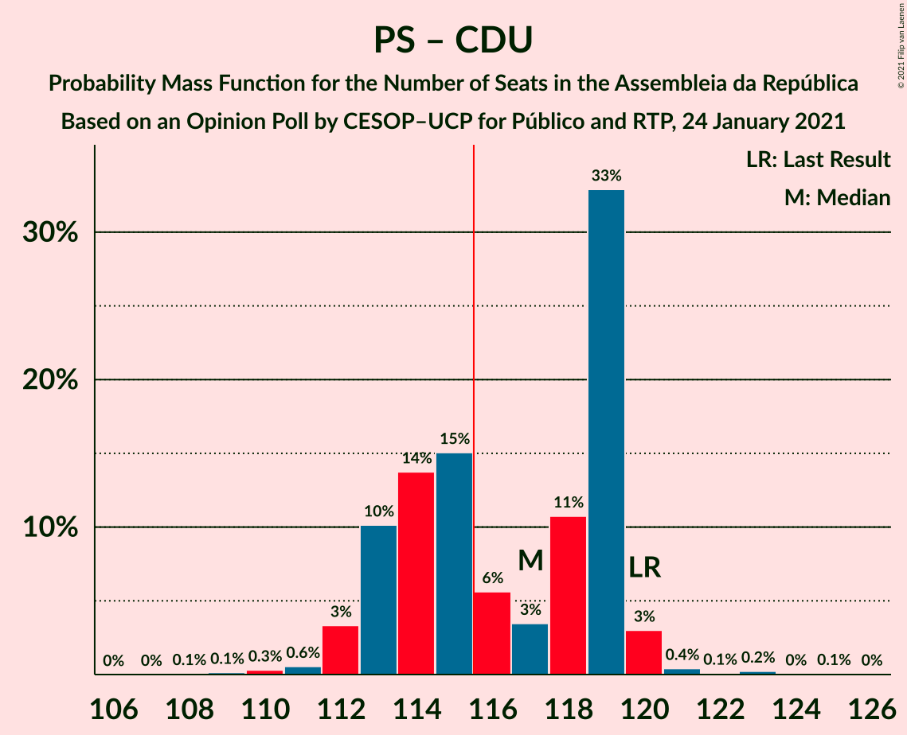

# Opinion Poll by CESOP–UCP for Público and RTP, 24 January 2021

<a href="#voting-intentions">Voting Intentions</a> | <a href="#seats">Seats</a> | <a href="#coalitions">Coalitions</a> | <a href="#technical-information">Technical Information</a>

## Voting Intentions

### Confidence Intervals

| Party | Last Result | Poll Result | 80% Confidence Interval | 90% Confidence Interval | 95% Confidence Interval | 99% Confidence Interval |
|:-----:|:-----------:|:-----------:|:-----------------------:|:-----------------------:|:-----------------------:|:-----------------------:|
| Partido Socialista | 36.4% | 35.0% | 34.1–35.9% |33.9–36.2% |33.6–36.4% |33.2–36.8% |
| Partido Social Democrata | 27.8% | 23.0% | 22.2–23.8% |22.0–24.1% |21.8–24.2% |21.4–24.6% |
| Chega | 1.3% | 9.0% | 8.5–9.6% |8.3–9.7% |8.2–9.9% |8.0–10.1% |
| Bloco de Esquerda | 9.5% | 8.0% | 7.5–8.5% |7.4–8.7% |7.3–8.8% |7.0–9.1% |
| Iniciativa Liberal | 1.3% | 7.0% | 6.5–7.5% |6.4–7.7% |6.3–7.8% |6.1–8.0% |
| Coligação Democrática Unitária | 6.3% | 6.0% | 5.6–6.5% |5.4–6.6% |5.3–6.7% |5.1–7.0% |
| CDS–Partido Popular | 4.2% | 2.0% | 1.8–2.3% |1.7–2.4% |1.6–2.5% |1.5–2.6% |
| Pessoas–Animais–Natureza | 3.3% | 2.0% | 1.8–2.3% |1.7–2.4% |1.6–2.5% |1.5–2.6% |
| LIVRE | 1.1% | 1.0% | 0.8–1.2% |0.8–1.3% |0.7–1.3% |0.7–1.4% |

*Note:* The poll result column reflects the actual value used in the calculations. Published results may vary slightly, and in addition be rounded to fewer digits.

## Seats

### Confidence Intervals

| Party | Last Result | Median | 80% Confidence Interval | 90% Confidence Interval | 95% Confidence Interval | 99% Confidence Interval |
|:-----:|:-----------:|:------:|:-----------------------:|:-----------------------:|:-----------------------:|:-----------------------:|
| <a href="#partido-socialista">Partido Socialista</a> | 108 | 106 | 103–109 |102–109 |102–109 |101–111 |
| <a href="#partido-social-democrata">Partido Social Democrata</a> | 79 | 66 | 65–67 |64–68 |62–69 |61–70 |
| <a href="#chega">Chega</a> | 1 | 17 | 14–19 |14–19 |14–20 |14–21 |
| <a href="#bloco-de-esquerda">Bloco de Esquerda</a> | 19 | 16 | 14–17 |14–18 |14–18 |13–19 |
| <a href="#iniciativa-liberal">Iniciativa Liberal</a> | 1 | 12 | 12–14 |12–14 |12–14 |10–14 |
| <a href="#coligação-democrática-unitária">Coligação Democrática Unitária</a> | 12 | 10 | 10–13 |9–14 |8–14 |7–14 |
| <a href="#cds–partido-popular">CDS–Partido Popular</a> | 5 | 1 | 0–1 |0–1 |0–1 |0–1 |
| <a href="#pessoas–animais–natureza">Pessoas–Animais–Natureza</a> | 4 | 2 | 1–2 |1–2 |1–2 |1–2 |
| <a href="#livre">LIVRE</a> | 1 | 0 | 0–1 |0–1 |0–1 |0–1 |

### Partido Socialista

*For a full overview of the results for this party, see the [Partido Socialista](party-partidosocialista.html) page.*

| Number of Seats | Probability | Accumulated | Special Marks |
|:---------------:|:-----------:|:-----------:|:-------------:|
| 98 | 0% | 100% |  |
| 99 | 0.1% | 99.9% |  |
| 100 | 0.3% | 99.8% |  |
| 101 | 1.5% | 99.5% |  |
| 102 | 6% | 98% |  |
| 103 | 14% | 92% |  |
| 104 | 12% | 78% |  |
| 105 | 14% | 66% |  |
| 106 | 9% | 52% | Median |
| 107 | 12% | 43% |  |
| 108 | 14% | 31% | Last Result |
| 109 | 17% | 17% |  |
| 110 | 0.2% | 0.8% |  |
| 111 | 0.3% | 0.5% |  |
| 112 | 0.1% | 0.3% |  |
| 113 | 0.1% | 0.2% |  |
| 114 | 0.1% | 0.1% |  |
| 115 | 0% | 0% |  |

### Partido Social Democrata

*For a full overview of the results for this party, see the [Partido Social Democrata](party-partidosocialdemocrata.html) page.*

| Number of Seats | Probability | Accumulated | Special Marks |
|:---------------:|:-----------:|:-----------:|:-------------:|
| 59 | 0.3% | 100% |  |
| 60 | 0.1% | 99.7% |  |
| 61 | 1.2% | 99.6% |  |
| 62 | 0.9% | 98% |  |
| 63 | 2% | 97% |  |
| 64 | 4% | 95% |  |
| 65 | 8% | 91% |  |
| 66 | 64% | 83% | Median |
| 67 | 9% | 19% |  |
| 68 | 6% | 10% |  |
| 69 | 2% | 4% |  |
| 70 | 2% | 2% |  |
| 71 | 0.2% | 0.3% |  |
| 72 | 0.1% | 0.1% |  |
| 73 | 0% | 0% |  |
| 74 | 0% | 0% |  |
| 75 | 0% | 0% |  |
| 76 | 0% | 0% |  |
| 77 | 0% | 0% |  |
| 78 | 0% | 0% |  |
| 79 | 0% | 0% | Last Result |

### Chega

*For a full overview of the results for this party, see the [Chega](party-chega.html) page.*

| Number of Seats | Probability | Accumulated | Special Marks |
|:---------------:|:-----------:|:-----------:|:-------------:|
| 1 | 0% | 100% | Last Result |
| 2 | 0% | 100% |  |
| 3 | 0% | 100% |  |
| 4 | 0% | 100% |  |
| 5 | 0% | 100% |  |
| 6 | 0% | 100% |  |
| 7 | 0% | 100% |  |
| 8 | 0% | 100% |  |
| 9 | 0% | 100% |  |
| 10 | 0% | 100% |  |
| 11 | 0% | 100% |  |
| 12 | 0% | 100% |  |
| 13 | 0.2% | 100% |  |
| 14 | 33% | 99.8% |  |
| 15 | 11% | 67% |  |
| 16 | 3% | 56% |  |
| 17 | 6% | 53% | Median |
| 18 | 16% | 46% |  |
| 19 | 26% | 30% |  |
| 20 | 3% | 4% |  |
| 21 | 0.8% | 1.0% |  |
| 22 | 0.1% | 0.2% |  |
| 23 | 0% | 0.1% |  |
| 24 | 0% | 0% |  |

### Bloco de Esquerda

*For a full overview of the results for this party, see the [Bloco de Esquerda](party-blocodeesquerda.html) page.*

| Number of Seats | Probability | Accumulated | Special Marks |
|:---------------:|:-----------:|:-----------:|:-------------:|
| 12 | 0.2% | 100% |  |
| 13 | 0.8% | 99.8% |  |
| 14 | 25% | 99.1% |  |
| 15 | 7% | 74% |  |
| 16 | 50% | 67% | Median |
| 17 | 12% | 17% |  |
| 18 | 3% | 5% |  |
| 19 | 2% | 2% | Last Result |
| 20 | 0% | 0% |  |

### Iniciativa Liberal

*For a full overview of the results for this party, see the [Iniciativa Liberal](party-iniciativaliberal.html) page.*

| Number of Seats | Probability | Accumulated | Special Marks |
|:---------------:|:-----------:|:-----------:|:-------------:|
| 1 | 0% | 100% | Last Result |
| 2 | 0% | 100% |  |
| 3 | 0% | 100% |  |
| 4 | 0% | 100% |  |
| 5 | 0% | 100% |  |
| 6 | 0% | 100% |  |
| 7 | 0% | 100% |  |
| 8 | 0% | 100% |  |
| 9 | 0% | 100% |  |
| 10 | 0.5% | 100% |  |
| 11 | 0.9% | 99.4% |  |
| 12 | 57% | 98.6% | Median |
| 13 | 14% | 42% |  |
| 14 | 27% | 27% |  |
| 15 | 0.1% | 0.1% |  |
| 16 | 0% | 0% |  |

### Coligação Democrática Unitária

*For a full overview of the results for this party, see the [Coligação Democrática Unitária](party-coligaçãodemocráticaunitária.html) page.*

| Number of Seats | Probability | Accumulated | Special Marks |
|:---------------:|:-----------:|:-----------:|:-------------:|
| 7 | 1.2% | 100% |  |
| 8 | 3% | 98.8% |  |
| 9 | 2% | 96% |  |
| 10 | 54% | 94% | Median |
| 11 | 16% | 40% |  |
| 12 | 13% | 24% | Last Result |
| 13 | 4% | 11% |  |
| 14 | 6% | 6% |  |
| 15 | 0% | 0% |  |

### CDS–Partido Popular

*For a full overview of the results for this party, see the [CDS–Partido Popular](party-cds–partidopopular.html) page.*

| Number of Seats | Probability | Accumulated | Special Marks |
|:---------------:|:-----------:|:-----------:|:-------------:|
| 0 | 27% | 100% |  |
| 1 | 73% | 73% | Median |
| 2 | 0.4% | 0.4% |  |
| 3 | 0% | 0% |  |
| 4 | 0% | 0% |  |
| 5 | 0% | 0% | Last Result |

### Pessoas–Animais–Natureza

*For a full overview of the results for this party, see the [Pessoas–Animais–Natureza](party-pessoas–animais–natureza.html) page.*

| Number of Seats | Probability | Accumulated | Special Marks |
|:---------------:|:-----------:|:-----------:|:-------------:|
| 0 | 0.2% | 100% |  |
| 1 | 39% | 99.8% |  |
| 2 | 61% | 61% | Median |
| 3 | 0% | 0% |  |
| 4 | 0% | 0% | Last Result |

### LIVRE

*For a full overview of the results for this party, see the [LIVRE](party-livre.html) page.*

| Number of Seats | Probability | Accumulated | Special Marks |
|:---------------:|:-----------:|:-----------:|:-------------:|
| 0 | 70% | 100% | Median |
| 1 | 30% | 30% | Last Result |
| 2 | 0% | 0% |  |

## Coalitions

### Confidence Intervals

| Coalition | Last Result | Median | Majority? | 80% Confidence Interval | 90% Confidence Interval | 95% Confidence Interval | 99% Confidence Interval |
|:---------:|:-----------:|:------:|:---------:|:-----------------------:|:-----------------------:|:-----------------------:|:-----------------------:|
| Partido Socialista – Bloco de Esquerda – Coligação Democrática Unitária | 139 | 132 | 100% | 129–135 | 129–135 | 128–136 | 126–138 |
| Partido Socialista – Bloco de Esquerda | 127 | 121 | 99.7% | 119–125 | 118–125 | 117–125 | 116–128 |
| Partido Socialista – Coligação Democrática Unitária | 120 | 117 | 57% | 113–119 | 113–119 | 112–120 | 110–121 |
| Partido Socialista | 108 | 106 | 0% | 103–109 | 102–109 | 102–109 | 101–111 |
| Partido Social Democrata – CDS–Partido Popular | 84 | 67 | 0% | 65–68 | 64–69 | 63–70 | 61–71 |

### Partido Socialista – Bloco de Esquerda – Coligação Democrática Unitária

| Number of Seats | Probability | Accumulated | Special Marks |
|:---------------:|:-----------:|:-----------:|:-------------:|
| 124 | 0.1% | 100% |  |
| 125 | 0.2% | 99.9% |  |
| 126 | 0.3% | 99.8% |  |
| 127 | 0.6% | 99.4% |  |
| 128 | 4% | 98.8% |  |
| 129 | 14% | 95% |  |
| 130 | 17% | 81% |  |
| 131 | 9% | 64% |  |
| 132 | 7% | 55% | Median |
| 133 | 11% | 48% |  |
| 134 | 10% | 37% |  |
| 135 | 24% | 27% |  |
| 136 | 1.1% | 3% |  |
| 137 | 1.2% | 2% |  |
| 138 | 0.8% | 1.2% |  |
| 139 | 0.3% | 0.4% | Last Result |
| 140 | 0.1% | 0.2% |  |
| 141 | 0.1% | 0.1% |  |
| 142 | 0% | 0% |  |

### Partido Socialista – Bloco de Esquerda

| Number of Seats | Probability | Accumulated | Special Marks |
|:---------------:|:-----------:|:-----------:|:-------------:|
| 114 | 0% | 100% |  |
| 115 | 0.3% | 99.9% |  |
| 116 | 1.5% | 99.7% | Majority |
| 117 | 2% | 98% |  |
| 118 | 5% | 96% |  |
| 119 | 17% | 92% |  |
| 120 | 20% | 75% |  |
| 121 | 9% | 55% |  |
| 122 | 12% | 47% | Median |
| 123 | 12% | 35% |  |
| 124 | 7% | 23% |  |
| 125 | 14% | 16% |  |
| 126 | 0.4% | 2% |  |
| 127 | 1.0% | 2% | Last Result |
| 128 | 0.6% | 0.9% |  |
| 129 | 0.1% | 0.2% |  |
| 130 | 0.1% | 0.1% |  |
| 131 | 0% | 0% |  |

### Partido Socialista – Coligação Democrática Unitária

| Number of Seats | Probability | Accumulated | Special Marks |
|:---------------:|:-----------:|:-----------:|:-------------:|
| 108 | 0.1% | 100% |  |
| 109 | 0.1% | 99.9% |  |
| 110 | 0.3% | 99.8% |  |
| 111 | 0.6% | 99.5% |  |
| 112 | 3% | 98.9% |  |
| 113 | 10% | 96% |  |
| 114 | 14% | 85% |  |
| 115 | 15% | 72% |  |
| 116 | 6% | 57% | Median, Majority |
| 117 | 3% | 51% |  |
| 118 | 11% | 48% |  |
| 119 | 33% | 37% |  |
| 120 | 3% | 4% | Last Result |
| 121 | 0.4% | 0.9% |  |
| 122 | 0.1% | 0.5% |  |
| 123 | 0.2% | 0.4% |  |
| 124 | 0% | 0.1% |  |
| 125 | 0.1% | 0.1% |  |
| 126 | 0% | 0% |  |

### Partido Socialista

| Number of Seats | Probability | Accumulated | Special Marks |
|:---------------:|:-----------:|:-----------:|:-------------:|
| 98 | 0% | 100% |  |
| 99 | 0.1% | 99.9% |  |
| 100 | 0.3% | 99.8% |  |
| 101 | 1.5% | 99.5% |  |
| 102 | 6% | 98% |  |
| 103 | 14% | 92% |  |
| 104 | 12% | 78% |  |
| 105 | 14% | 66% |  |
| 106 | 9% | 52% | Median |
| 107 | 12% | 43% |  |
| 108 | 14% | 31% | Last Result |
| 109 | 17% | 17% |  |
| 110 | 0.2% | 0.8% |  |
| 111 | 0.3% | 0.5% |  |
| 112 | 0.1% | 0.3% |  |
| 113 | 0.1% | 0.2% |  |
| 114 | 0.1% | 0.1% |  |
| 115 | 0% | 0% |  |

### Partido Social Democrata – CDS–Partido Popular

| Number of Seats | Probability | Accumulated | Special Marks |
|:---------------:|:-----------:|:-----------:|:-------------:|
| 59 | 0.1% | 100% |  |
| 60 | 0.2% | 99.9% |  |
| 61 | 0.3% | 99.7% |  |
| 62 | 1.2% | 99.4% |  |
| 63 | 2% | 98% |  |
| 64 | 3% | 97% |  |
| 65 | 6% | 94% |  |
| 66 | 20% | 87% |  |
| 67 | 50% | 67% | Median |
| 68 | 8% | 17% |  |
| 69 | 5% | 8% |  |
| 70 | 3% | 4% |  |
| 71 | 0.7% | 1.0% |  |
| 72 | 0.2% | 0.3% |  |
| 73 | 0.1% | 0.1% |  |
| 74 | 0% | 0% |  |
| 75 | 0% | 0% |  |
| 76 | 0% | 0% |  |
| 77 | 0% | 0% |  |
| 78 | 0% | 0% |  |
| 79 | 0% | 0% |  |
| 80 | 0% | 0% |  |
| 81 | 0% | 0% |  |
| 82 | 0% | 0% |  |
| 83 | 0% | 0% |  |
| 84 | 0% | 0% | Last Result |

## Technical Information

### Opinion Poll

+ **Polling firm:** CESOP–UCP
+ **Commissioner(s):** Público and RTP
+ **Fieldwork period:** 24 January 2021

### Calculations

+ **Sample size:** 4637
+ **Simulations done:** 1,048,576
+ **Error estimate:** 1.01%

