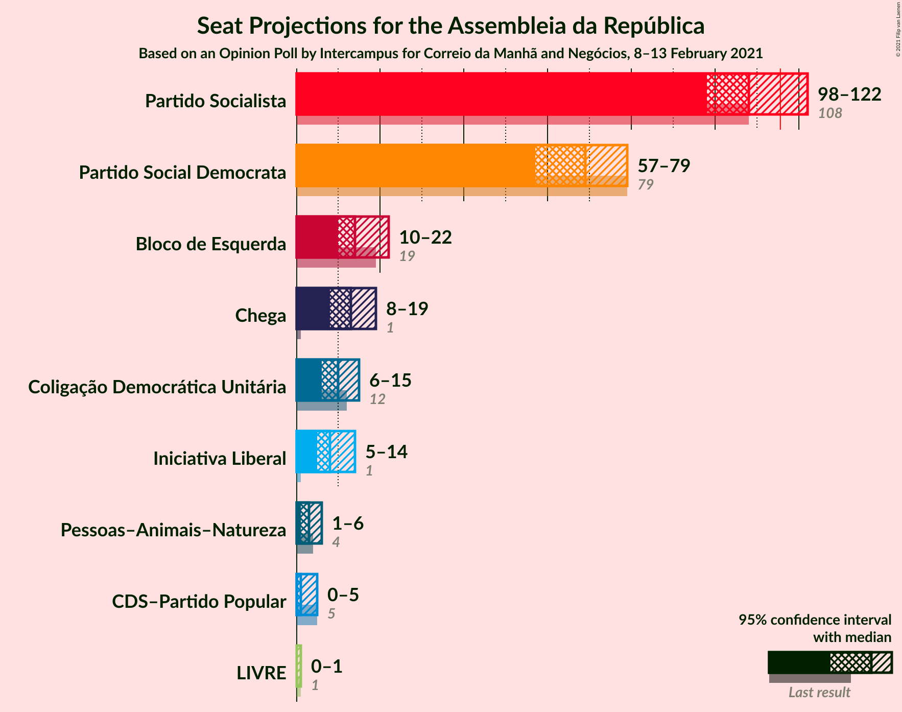
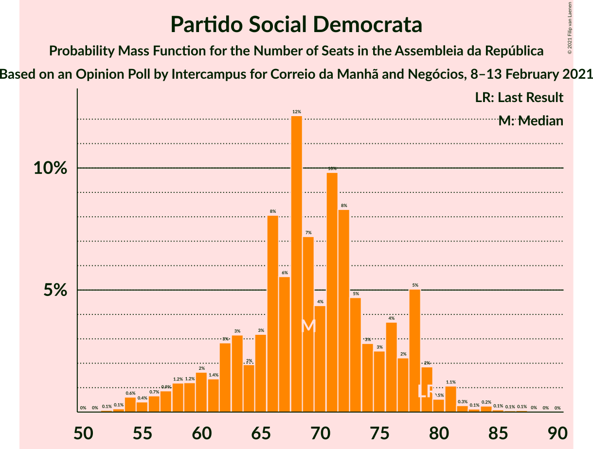
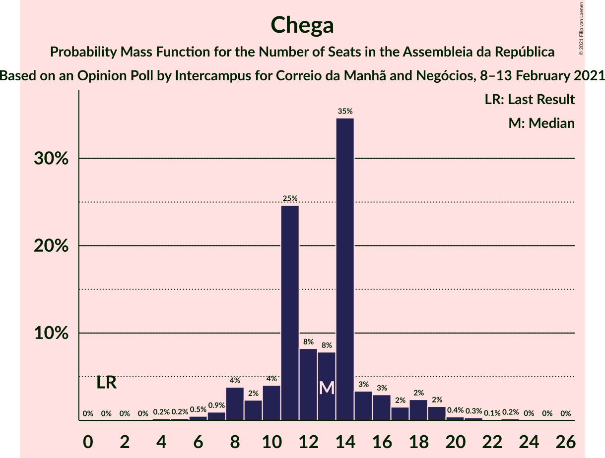

# Opinion Poll by Intercampus for Correio da Manhã and Negócios, 8–13 February 2021

<a href="#voting-intentions">Voting Intentions</a> | <a href="#seats">Seats</a> | <a href="#coalitions">Coalitions</a> | <a href="#technical-information">Technical Information</a>

## Voting Intentions

### Confidence Intervals

| Party | Last Result | Poll Result | 80% Confidence Interval | 90% Confidence Interval | 95% Confidence Interval | 99% Confidence Interval |
|:-----:|:-----------:|:-----------:|:-----------------------:|:-----------------------:|:-----------------------:|:-----------------------:|
| Partido Socialista | 36.4% | 37.6% | 35.1–40.2% |34.4–40.9% |33.8–41.5% |32.7–42.8% |
| Partido Social Democrata | 27.8% | 24.6% | 22.5–27.0% |21.9–27.6% |21.4–28.2% |20.4–29.4% |
| Bloco de Esquerda | 9.5% | 8.2% | 6.9–9.8% |6.6–10.3% |6.3–10.7% |5.7–11.5% |
| Chega | 1.3% | 7.2% | 6.0–8.7% |5.7–9.2% |5.4–9.6% |4.9–10.3% |
| Coligação Democrática Unitária | 6.3% | 5.7% | 4.7–7.1% |4.4–7.5% |4.2–7.9% |3.7–8.6% |
| Iniciativa Liberal | 1.3% | 5.6% | 4.6–7.0% |4.3–7.4% |4.0–7.7% |3.6–8.4% |
| Pessoas–Animais–Natureza | 3.3% | 3.1% | 2.4–4.2% |2.2–4.5% |2.0–4.8% |1.7–5.4% |
| CDS–Partido Popular | 4.2% | 2.6% | 2.0–3.7% |1.8–4.0% |1.6–4.2% |1.4–4.8% |
| LIVRE | 1.1% | 0.7% | 0.4–1.3% |0.3–1.5% |0.3–1.7% |0.2–2.1% |

*Note:* The poll result column reflects the actual value used in the calculations. Published results may vary slightly, and in addition be rounded to fewer digits.

## Seats

### Confidence Intervals

| Party | Last Result | Median | 80% Confidence Interval | 90% Confidence Interval | 95% Confidence Interval | 99% Confidence Interval |
|:-----:|:-----------:|:------:|:-----------------------:|:-----------------------:|:-----------------------:|:-----------------------:|
| <a href="#partido-socialista">Partido Socialista</a> | 108 | 106 | 103–115 |101–119 |99–121 |95–128 |
| <a href="#partido-social-democrata">Partido Social Democrata</a> | 79 | 72 | 64–75 |58–77 |57–80 |54–84 |
| <a href="#bloco-de-esquerda">Bloco de Esquerda</a> | 19 | 14 | 12–18 |11–20 |11–22 |9–26 |
| <a href="#chega">Chega</a> | 1 | 13 | 10–14 |8–17 |8–17 |7–20 |
| <a href="#coligação-democrática-unitária">Coligação Democrática Unitária</a> | 12 | 14 | 6–14 |6–15 |6–15 |4–18 |
| <a href="#iniciativa-liberal">Iniciativa Liberal</a> | 1 | 9 | 6–12 |6–12 |5–12 |5–14 |
| <a href="#pessoas–animais–natureza">Pessoas–Animais–Natureza</a> | 4 | 4 | 2–5 |2–6 |2–6 |1–9 |
| <a href="#cds–partido-popular">CDS–Partido Popular</a> | 5 | 1 | 1–3 |1–3 |0–5 |0–5 |
| <a href="#livre">LIVRE</a> | 1 | 0 | 0–1 |0–1 |0–1 |0–1 |

### Partido Socialista

*For a full overview of the results for this party, see the [Partido Socialista](party-partidosocialista.html) page.*

| Number of Seats | Probability | Accumulated | Special Marks |
|:---------------:|:-----------:|:-----------:|:-------------:|
| 89 | 0% | 100% |  |
| 90 | 0.1% | 99.9% |  |
| 91 | 0% | 99.9% |  |
| 92 | 0% | 99.8% |  |
| 93 | 0.1% | 99.8% |  |
| 94 | 0% | 99.8% |  |
| 95 | 0.4% | 99.7% |  |
| 96 | 1.0% | 99.4% |  |
| 97 | 0.3% | 98% |  |
| 98 | 0.4% | 98% |  |
| 99 | 0.3% | 98% |  |
| 100 | 1.2% | 97% |  |
| 101 | 2% | 96% |  |
| 102 | 2% | 94% |  |
| 103 | 21% | 92% |  |
| 104 | 1.2% | 71% |  |
| 105 | 18% | 70% |  |
| 106 | 9% | 51% | Median |
| 107 | 1.5% | 42% |  |
| 108 | 2% | 41% | Last Result |
| 109 | 11% | 39% |  |
| 110 | 8% | 27% |  |
| 111 | 3% | 20% |  |
| 112 | 3% | 17% |  |
| 113 | 3% | 14% |  |
| 114 | 0.2% | 12% |  |
| 115 | 3% | 11% |  |
| 116 | 1.0% | 9% | Majority |
| 117 | 0.6% | 8% |  |
| 118 | 2% | 7% |  |
| 119 | 0.8% | 6% |  |
| 120 | 0.7% | 5% |  |
| 121 | 2% | 4% |  |
| 122 | 0.3% | 2% |  |
| 123 | 0.4% | 2% |  |
| 124 | 0.1% | 1.1% |  |
| 125 | 0.4% | 1.1% |  |
| 126 | 0% | 0.6% |  |
| 127 | 0.1% | 0.6% |  |
| 128 | 0.3% | 0.5% |  |
| 129 | 0% | 0.2% |  |
| 130 | 0% | 0.2% |  |
| 131 | 0% | 0.2% |  |
| 132 | 0.2% | 0.2% |  |
| 133 | 0% | 0% |  |

### Partido Social Democrata

*For a full overview of the results for this party, see the [Partido Social Democrata](party-partidosocialdemocrata.html) page.*

| Number of Seats | Probability | Accumulated | Special Marks |
|:---------------:|:-----------:|:-----------:|:-------------:|
| 52 | 0% | 100% |  |
| 53 | 0% | 99.9% |  |
| 54 | 0.4% | 99.9% |  |
| 55 | 0.7% | 99.5% |  |
| 56 | 1.1% | 98.8% |  |
| 57 | 0.8% | 98% |  |
| 58 | 2% | 97% |  |
| 59 | 0.6% | 95% |  |
| 60 | 0.6% | 94% |  |
| 61 | 0.8% | 93% |  |
| 62 | 1.2% | 93% |  |
| 63 | 1.2% | 91% |  |
| 64 | 2% | 90% |  |
| 65 | 3% | 88% |  |
| 66 | 22% | 85% |  |
| 67 | 5% | 62% |  |
| 68 | 0.9% | 57% |  |
| 69 | 4% | 56% |  |
| 70 | 0.8% | 52% |  |
| 71 | 1.0% | 51% |  |
| 72 | 17% | 50% | Median |
| 73 | 20% | 33% |  |
| 74 | 3% | 14% |  |
| 75 | 2% | 11% |  |
| 76 | 3% | 9% |  |
| 77 | 2% | 6% |  |
| 78 | 0.5% | 4% |  |
| 79 | 0.3% | 3% | Last Result |
| 80 | 0.5% | 3% |  |
| 81 | 0.4% | 2% |  |
| 82 | 0.1% | 2% |  |
| 83 | 0.1% | 2% |  |
| 84 | 1.5% | 2% |  |
| 85 | 0% | 0.1% |  |
| 86 | 0% | 0.1% |  |
| 87 | 0% | 0% |  |

### Bloco de Esquerda

*For a full overview of the results for this party, see the [Bloco de Esquerda](party-blocodeesquerda.html) page.*

| Number of Seats | Probability | Accumulated | Special Marks |
|:---------------:|:-----------:|:-----------:|:-------------:|
| 7 | 0.2% | 100% |  |
| 8 | 0.1% | 99.8% |  |
| 9 | 0.3% | 99.8% |  |
| 10 | 1.2% | 99.4% |  |
| 11 | 7% | 98% |  |
| 12 | 11% | 92% |  |
| 13 | 24% | 80% |  |
| 14 | 27% | 57% | Median |
| 15 | 1.3% | 30% |  |
| 16 | 11% | 29% |  |
| 17 | 3% | 17% |  |
| 18 | 5% | 14% |  |
| 19 | 2% | 9% | Last Result |
| 20 | 3% | 7% |  |
| 21 | 2% | 5% |  |
| 22 | 1.2% | 3% |  |
| 23 | 0.3% | 2% |  |
| 24 | 0.7% | 1.5% |  |
| 25 | 0.2% | 0.7% |  |
| 26 | 0.3% | 0.5% |  |
| 27 | 0% | 0.2% |  |
| 28 | 0.1% | 0.2% |  |
| 29 | 0% | 0% |  |

### Chega

*For a full overview of the results for this party, see the [Chega](party-chega.html) page.*

| Number of Seats | Probability | Accumulated | Special Marks |
|:---------------:|:-----------:|:-----------:|:-------------:|
| 1 | 0% | 100% | Last Result |
| 2 | 0% | 100% |  |
| 3 | 0% | 100% |  |
| 4 | 0.1% | 100% |  |
| 5 | 0.2% | 99.9% |  |
| 6 | 0.1% | 99.7% |  |
| 7 | 1.5% | 99.6% |  |
| 8 | 4% | 98% |  |
| 9 | 3% | 95% |  |
| 10 | 3% | 91% |  |
| 11 | 26% | 89% |  |
| 12 | 6% | 62% |  |
| 13 | 20% | 57% | Median |
| 14 | 28% | 37% |  |
| 15 | 2% | 9% |  |
| 16 | 1.0% | 6% |  |
| 17 | 3% | 5% |  |
| 18 | 0.2% | 2% |  |
| 19 | 0.6% | 2% |  |
| 20 | 1.1% | 1.4% |  |
| 21 | 0.1% | 0.3% |  |
| 22 | 0.1% | 0.2% |  |
| 23 | 0.1% | 0.1% |  |
| 24 | 0% | 0% |  |

### Coligação Democrática Unitária

*For a full overview of the results for this party, see the [Coligação Democrática Unitária](party-coligaçãodemocráticaunitária.html) page.*

| Number of Seats | Probability | Accumulated | Special Marks |
|:---------------:|:-----------:|:-----------:|:-------------:|
| 4 | 0.5% | 100% |  |
| 5 | 1.5% | 99.5% |  |
| 6 | 8% | 98% |  |
| 7 | 7% | 90% |  |
| 8 | 4% | 83% |  |
| 9 | 2% | 79% |  |
| 10 | 5% | 77% |  |
| 11 | 5% | 72% |  |
| 12 | 3% | 66% | Last Result |
| 13 | 3% | 63% |  |
| 14 | 50% | 60% | Median |
| 15 | 8% | 10% |  |
| 16 | 0.3% | 1.5% |  |
| 17 | 0.4% | 1.2% |  |
| 18 | 0.8% | 0.8% |  |
| 19 | 0% | 0% |  |

### Iniciativa Liberal

*For a full overview of the results for this party, see the [Iniciativa Liberal](party-iniciativaliberal.html) page.*

| Number of Seats | Probability | Accumulated | Special Marks |
|:---------------:|:-----------:|:-----------:|:-------------:|
| 1 | 0% | 100% | Last Result |
| 2 | 0% | 100% |  |
| 3 | 0.1% | 100% |  |
| 4 | 0.2% | 99.9% |  |
| 5 | 2% | 99.7% |  |
| 6 | 20% | 97% |  |
| 7 | 5% | 77% |  |
| 8 | 5% | 72% |  |
| 9 | 19% | 67% | Median |
| 10 | 25% | 48% |  |
| 11 | 3% | 23% |  |
| 12 | 17% | 20% |  |
| 13 | 0.2% | 2% |  |
| 14 | 2% | 2% |  |
| 15 | 0.2% | 0.4% |  |
| 16 | 0% | 0.1% |  |
| 17 | 0.1% | 0.1% |  |
| 18 | 0% | 0% |  |

### Pessoas–Animais–Natureza

*For a full overview of the results for this party, see the [Pessoas–Animais–Natureza](party-pessoas–animais–natureza.html) page.*

| Number of Seats | Probability | Accumulated | Special Marks |
|:---------------:|:-----------:|:-----------:|:-------------:|
| 0 | 0.1% | 100% |  |
| 1 | 2% | 99.9% |  |
| 2 | 35% | 98% |  |
| 3 | 9% | 63% |  |
| 4 | 38% | 53% | Last Result, Median |
| 5 | 7% | 15% |  |
| 6 | 6% | 8% |  |
| 7 | 1.0% | 2% |  |
| 8 | 0.2% | 1.5% |  |
| 9 | 1.2% | 1.3% |  |
| 10 | 0% | 0% |  |

### CDS–Partido Popular

*For a full overview of the results for this party, see the [CDS–Partido Popular](party-cds–partidopopular.html) page.*

| Number of Seats | Probability | Accumulated | Special Marks |
|:---------------:|:-----------:|:-----------:|:-------------:|
| 0 | 4% | 100% |  |
| 1 | 51% | 96% | Median |
| 2 | 33% | 45% |  |
| 3 | 8% | 12% |  |
| 4 | 0.8% | 4% |  |
| 5 | 3% | 3% | Last Result |
| 6 | 0% | 0.1% |  |
| 7 | 0% | 0% |  |

### LIVRE

*For a full overview of the results for this party, see the [LIVRE](party-livre.html) page.*

| Number of Seats | Probability | Accumulated | Special Marks |
|:---------------:|:-----------:|:-----------:|:-------------:|
| 0 | 85% | 100% | Median |
| 1 | 15% | 15% | Last Result |
| 2 | 0% | 0.2% |  |
| 3 | 0.1% | 0.1% |  |
| 4 | 0% | 0% |  |

## Coalitions

### Confidence Intervals

| Coalition | Last Result | Median | Majority? | 80% Confidence Interval | 90% Confidence Interval | 95% Confidence Interval | 99% Confidence Interval |
|:---------:|:-----------:|:------:|:---------:|:-----------------------:|:-----------------------:|:-----------------------:|:-----------------------:|
| Partido Socialista – Bloco de Esquerda – Coligação Democrática Unitária | 139 | 133 | 100% | 129–141 | 124–144 | 124–147 | 119–151 |
| Partido Socialista – Bloco de Esquerda | 127 | 119 | 94% | 116–132 | 115–135 | 113–138 | 109–143 |
| Partido Socialista – Coligação Democrática Unitária | 120 | 119 | 86% | 113–125 | 111–128 | 108–130 | 104–136 |
| Partido Socialista | 108 | 106 | 9% | 103–115 | 101–119 | 99–121 | 95–128 |
| Partido Social Democrata – CDS–Partido Popular | 84 | 73 | 0% | 65–77 | 61–78 | 59–81 | 55–85 |

### Partido Socialista – Bloco de Esquerda – Coligação Democrática Unitária

| Number of Seats | Probability | Accumulated | Special Marks |
|:---------------:|:-----------:|:-----------:|:-------------:|
| 117 | 0.1% | 100% |  |
| 118 | 0% | 99.9% |  |
| 119 | 0.9% | 99.9% |  |
| 120 | 0.3% | 99.0% |  |
| 121 | 0.1% | 98.7% |  |
| 122 | 0.5% | 98.6% |  |
| 123 | 0.3% | 98% |  |
| 124 | 3% | 98% |  |
| 125 | 1.0% | 95% |  |
| 126 | 0.9% | 94% |  |
| 127 | 0.8% | 93% |  |
| 128 | 2% | 92% |  |
| 129 | 3% | 90% |  |
| 130 | 21% | 87% |  |
| 131 | 1.0% | 67% |  |
| 132 | 7% | 66% |  |
| 133 | 22% | 59% |  |
| 134 | 4% | 37% | Median |
| 135 | 3% | 34% |  |
| 136 | 2% | 31% |  |
| 137 | 1.1% | 29% |  |
| 138 | 3% | 28% |  |
| 139 | 13% | 25% | Last Result |
| 140 | 0.9% | 12% |  |
| 141 | 3% | 11% |  |
| 142 | 1.3% | 8% |  |
| 143 | 0.6% | 7% |  |
| 144 | 1.2% | 6% |  |
| 145 | 0.7% | 5% |  |
| 146 | 0.5% | 4% |  |
| 147 | 2% | 4% |  |
| 148 | 0.7% | 2% |  |
| 149 | 0.6% | 1.4% |  |
| 150 | 0.1% | 0.8% |  |
| 151 | 0.3% | 0.7% |  |
| 152 | 0.1% | 0.4% |  |
| 153 | 0% | 0.3% |  |
| 154 | 0.2% | 0.3% |  |
| 155 | 0% | 0.1% |  |
| 156 | 0% | 0% |  |

### Partido Socialista – Bloco de Esquerda

| Number of Seats | Probability | Accumulated | Special Marks |
|:---------------:|:-----------:|:-----------:|:-------------:|
| 103 | 0.1% | 100% |  |
| 104 | 0% | 99.9% |  |
| 105 | 0% | 99.9% |  |
| 106 | 0% | 99.9% |  |
| 107 | 0% | 99.9% |  |
| 108 | 0% | 99.8% |  |
| 109 | 1.1% | 99.8% |  |
| 110 | 0.1% | 98.7% |  |
| 111 | 0.4% | 98.6% |  |
| 112 | 0.5% | 98% |  |
| 113 | 0.6% | 98% |  |
| 114 | 0.2% | 97% |  |
| 115 | 3% | 97% |  |
| 116 | 19% | 94% | Majority |
| 117 | 4% | 75% |  |
| 118 | 7% | 71% |  |
| 119 | 17% | 64% |  |
| 120 | 2% | 47% | Median |
| 121 | 1.2% | 45% |  |
| 122 | 5% | 44% |  |
| 123 | 3% | 39% |  |
| 124 | 8% | 35% |  |
| 125 | 8% | 27% |  |
| 126 | 1.0% | 19% |  |
| 127 | 1.0% | 18% | Last Result |
| 128 | 2% | 17% |  |
| 129 | 0.7% | 15% |  |
| 130 | 2% | 14% |  |
| 131 | 1.3% | 12% |  |
| 132 | 0.6% | 11% |  |
| 133 | 2% | 10% |  |
| 134 | 2% | 8% |  |
| 135 | 2% | 6% |  |
| 136 | 1.1% | 4% |  |
| 137 | 0.2% | 3% |  |
| 138 | 0.4% | 3% |  |
| 139 | 0.8% | 2% |  |
| 140 | 0.3% | 2% |  |
| 141 | 0.5% | 1.4% |  |
| 142 | 0.3% | 0.9% |  |
| 143 | 0.1% | 0.6% |  |
| 144 | 0% | 0.5% |  |
| 145 | 0.2% | 0.5% |  |
| 146 | 0.3% | 0.3% |  |
| 147 | 0% | 0% |  |

### Partido Socialista – Coligação Democrática Unitária

| Number of Seats | Probability | Accumulated | Special Marks |
|:---------------:|:-----------:|:-----------:|:-------------:|
| 100 | 0% | 100% |  |
| 101 | 0% | 99.9% |  |
| 102 | 0% | 99.9% |  |
| 103 | 0.1% | 99.9% |  |
| 104 | 0.3% | 99.8% |  |
| 105 | 0.1% | 99.5% |  |
| 106 | 1.0% | 99.4% |  |
| 107 | 0.4% | 98% |  |
| 108 | 2% | 98% |  |
| 109 | 0.5% | 96% |  |
| 110 | 0.4% | 96% |  |
| 111 | 0.8% | 95% |  |
| 112 | 0.9% | 94% |  |
| 113 | 5% | 93% |  |
| 114 | 1.1% | 89% |  |
| 115 | 2% | 88% |  |
| 116 | 2% | 86% | Majority |
| 117 | 23% | 84% |  |
| 118 | 3% | 61% |  |
| 119 | 19% | 58% |  |
| 120 | 8% | 39% | Last Result, Median |
| 121 | 3% | 32% |  |
| 122 | 2% | 29% |  |
| 123 | 9% | 26% |  |
| 124 | 3% | 18% |  |
| 125 | 5% | 14% |  |
| 126 | 1.1% | 10% |  |
| 127 | 1.3% | 9% |  |
| 128 | 3% | 7% |  |
| 129 | 0.8% | 4% |  |
| 130 | 1.1% | 3% |  |
| 131 | 1.0% | 2% |  |
| 132 | 0.4% | 1.3% |  |
| 133 | 0.2% | 0.9% |  |
| 134 | 0.2% | 0.7% |  |
| 135 | 0% | 0.5% |  |
| 136 | 0.3% | 0.5% |  |
| 137 | 0% | 0.2% |  |
| 138 | 0.1% | 0.2% |  |
| 139 | 0% | 0.1% |  |
| 140 | 0% | 0% |  |

### Partido Socialista

| Number of Seats | Probability | Accumulated | Special Marks |
|:---------------:|:-----------:|:-----------:|:-------------:|
| 89 | 0% | 100% |  |
| 90 | 0.1% | 99.9% |  |
| 91 | 0% | 99.9% |  |
| 92 | 0% | 99.8% |  |
| 93 | 0.1% | 99.8% |  |
| 94 | 0% | 99.8% |  |
| 95 | 0.4% | 99.7% |  |
| 96 | 1.0% | 99.4% |  |
| 97 | 0.3% | 98% |  |
| 98 | 0.4% | 98% |  |
| 99 | 0.3% | 98% |  |
| 100 | 1.2% | 97% |  |
| 101 | 2% | 96% |  |
| 102 | 2% | 94% |  |
| 103 | 21% | 92% |  |
| 104 | 1.2% | 71% |  |
| 105 | 18% | 70% |  |
| 106 | 9% | 51% | Median |
| 107 | 1.5% | 42% |  |
| 108 | 2% | 41% | Last Result |
| 109 | 11% | 39% |  |
| 110 | 8% | 27% |  |
| 111 | 3% | 20% |  |
| 112 | 3% | 17% |  |
| 113 | 3% | 14% |  |
| 114 | 0.2% | 12% |  |
| 115 | 3% | 11% |  |
| 116 | 1.0% | 9% | Majority |
| 117 | 0.6% | 8% |  |
| 118 | 2% | 7% |  |
| 119 | 0.8% | 6% |  |
| 120 | 0.7% | 5% |  |
| 121 | 2% | 4% |  |
| 122 | 0.3% | 2% |  |
| 123 | 0.4% | 2% |  |
| 124 | 0.1% | 1.1% |  |
| 125 | 0.4% | 1.1% |  |
| 126 | 0% | 0.6% |  |
| 127 | 0.1% | 0.6% |  |
| 128 | 0.3% | 0.5% |  |
| 129 | 0% | 0.2% |  |
| 130 | 0% | 0.2% |  |
| 131 | 0% | 0.2% |  |
| 132 | 0.2% | 0.2% |  |
| 133 | 0% | 0% |  |

### Partido Social Democrata – CDS–Partido Popular

| Number of Seats | Probability | Accumulated | Special Marks |
|:---------------:|:-----------:|:-----------:|:-------------:|
| 54 | 0.2% | 100% |  |
| 55 | 0.3% | 99.8% |  |
| 56 | 0.6% | 99.5% |  |
| 57 | 0.2% | 98.9% |  |
| 58 | 1.0% | 98.7% |  |
| 59 | 1.0% | 98% |  |
| 60 | 1.2% | 97% |  |
| 61 | 0.9% | 95% |  |
| 62 | 1.0% | 95% |  |
| 63 | 2% | 94% |  |
| 64 | 1.3% | 92% |  |
| 65 | 2% | 91% |  |
| 66 | 2% | 89% |  |
| 67 | 21% | 87% |  |
| 68 | 4% | 67% |  |
| 69 | 2% | 62% |  |
| 70 | 4% | 60% |  |
| 71 | 2% | 56% |  |
| 72 | 3% | 54% |  |
| 73 | 17% | 51% | Median |
| 74 | 2% | 34% |  |
| 75 | 20% | 33% |  |
| 76 | 3% | 13% |  |
| 77 | 2% | 10% |  |
| 78 | 4% | 8% |  |
| 79 | 0.7% | 4% |  |
| 80 | 0.5% | 3% |  |
| 81 | 0.5% | 3% |  |
| 82 | 0.1% | 2% |  |
| 83 | 0.2% | 2% |  |
| 84 | 0.4% | 2% | Last Result |
| 85 | 1.4% | 2% |  |
| 86 | 0.1% | 0.2% |  |
| 87 | 0% | 0.1% |  |
| 88 | 0% | 0.1% |  |
| 89 | 0% | 0% |  |

## Technical Information

### Opinion Poll

+ **Polling firm:** Intercampus
+ **Commissioner(s):** Correio da Manhã and Negócios
+ **Fieldwork period:** 8–13 February 2021

### Calculations

+ **Sample size:** 609
+ **Simulations done:** 131,072
+ **Error estimate:** 0.94%

