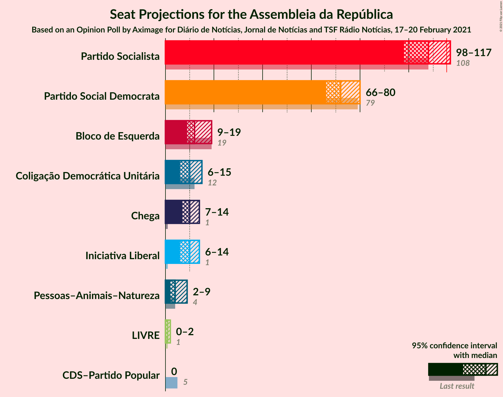
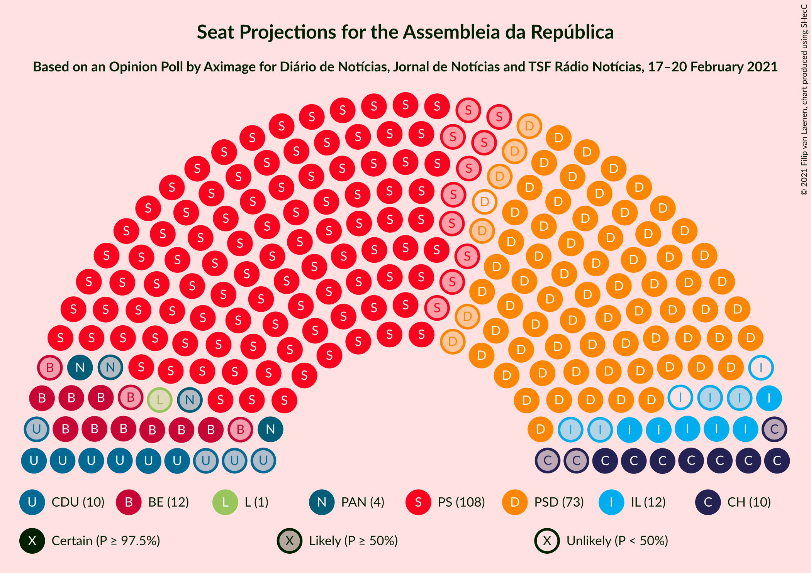
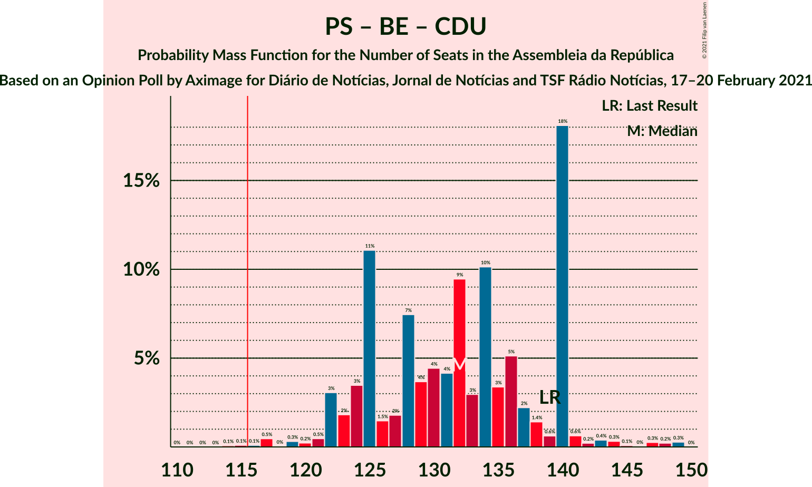
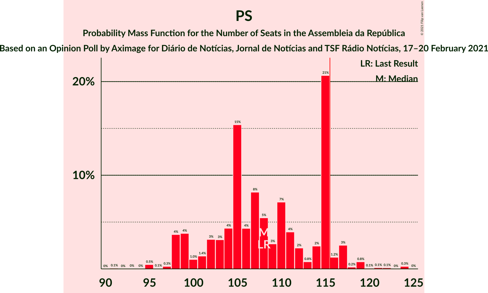

# Opinion Poll by Aximage for Diário de Notícias, Jornal de Notícias and TSF Rádio Notícias, 17–20 February 2021

<a href="#voting-intentions">Voting Intentions</a> | <a href="#seats">Seats</a> | <a href="#coalitions">Coalitions</a> | <a href="#technical-information">Technical Information</a>

## Voting Intentions

### Confidence Intervals

| Party | Last Result | Poll Result | 80% Confidence Interval | 90% Confidence Interval | 95% Confidence Interval | 99% Confidence Interval |
|:-----:|:-----------:|:-----------:|:-----------------------:|:-----------------------:|:-----------------------:|:-----------------------:|
| Partido Socialista | 36.4% | 37.6% | 35.5–39.8% |34.9–40.4% |34.3–41.0% |33.3–42.0% |
| Partido Social Democrata | 27.8% | 26.5% | 24.6–28.6% |24.1–29.1% |23.6–29.6% |22.7–30.7% |
| Bloco de Esquerda | 9.5% | 7.7% | 6.6–9.0% |6.3–9.4% |6.0–9.7% |5.5–10.4% |
| Chega | 1.3% | 6.4% | 5.5–7.7% |5.2–8.0% |5.0–8.4% |4.5–9.0% |
| Coligação Democrática Unitária | 6.3% | 5.8% | 4.9–7.0% |4.6–7.4% |4.4–7.7% |4.0–8.3% |
| Iniciativa Liberal | 1.3% | 5.7% | 4.8–6.9% |4.5–7.2% |4.3–7.5% |3.9–8.1% |
| Pessoas–Animais–Natureza | 3.3% | 4.0% | 3.3–5.0% |3.0–5.3% |2.9–5.6% |2.5–6.1% |
| LIVRE | 1.1% | 1.3% | 0.9–2.0% |0.8–2.2% |0.7–2.4% |0.6–2.8% |
| CDS–Partido Popular | 4.2% | 0.9% | 0.6–1.4% |0.5–1.6% |0.4–1.8% |0.3–2.1% |

*Note:* The poll result column reflects the actual value used in the calculations. Published results may vary slightly, and in addition be rounded to fewer digits.

## Seats

### Confidence Intervals

| Party | Last Result | Median | 80% Confidence Interval | 90% Confidence Interval | 95% Confidence Interval | 99% Confidence Interval |
|:-----:|:-----------:|:------:|:-----------------------:|:-----------------------:|:-----------------------:|:-----------------------:|
| <a href="#partido-socialista">Partido Socialista</a> | 108 | 108 | 101–115 |99–116 |98–117 |95–121 |
| <a href="#partido-social-democrata">Partido Social Democrata</a> | 79 | 72 | 67–78 |66–79 |66–80 |62–86 |
| <a href="#bloco-de-esquerda">Bloco de Esquerda</a> | 19 | 12 | 11–18 |9–18 |9–19 |7–21 |
| <a href="#chega">Chega</a> | 1 | 10 | 8–13 |8–14 |7–14 |5–16 |
| <a href="#coligação-democrática-unitária">Coligação Democrática Unitária</a> | 12 | 10 | 7–14 |6–15 |6–15 |5–16 |
| <a href="#iniciativa-liberal">Iniciativa Liberal</a> | 1 | 10 | 6–12 |6–13 |6–14 |6–14 |
| <a href="#pessoas–animais–natureza">Pessoas–Animais–Natureza</a> | 4 | 4 | 4–7 |2–9 |2–9 |2–10 |
| <a href="#livre">LIVRE</a> | 1 | 1 | 0–1 |0–1 |0–2 |0–3 |
| <a href="#cds–partido-popular">CDS–Partido Popular</a> | 5 | 0 | 0 |0 |0 |0–1 |

### Partido Socialista

*For a full overview of the results for this party, see the [Partido Socialista](party-partidosocialista.html) page.*

| Number of Seats | Probability | Accumulated | Special Marks |
|:---------------:|:-----------:|:-----------:|:-------------:|
| 90 | 0% | 100% |  |
| 91 | 0.1% | 99.9% |  |
| 92 | 0% | 99.9% |  |
| 93 | 0% | 99.9% |  |
| 94 | 0% | 99.8% |  |
| 95 | 0.5% | 99.8% |  |
| 96 | 0.1% | 99.3% |  |
| 97 | 0.3% | 99.3% |  |
| 98 | 4% | 99.0% |  |
| 99 | 4% | 95% |  |
| 100 | 1.0% | 92% |  |
| 101 | 1.4% | 91% |  |
| 102 | 3% | 89% |  |
| 103 | 3% | 86% |  |
| 104 | 4% | 83% |  |
| 105 | 15% | 79% |  |
| 106 | 4% | 63% |  |
| 107 | 8% | 59% |  |
| 108 | 5% | 51% | Last Result, Median |
| 109 | 3% | 45% |  |
| 110 | 7% | 43% |  |
| 111 | 4% | 35% |  |
| 112 | 2% | 31% |  |
| 113 | 0.8% | 29% |  |
| 114 | 2% | 28% |  |
| 115 | 21% | 26% |  |
| 116 | 1.2% | 5% | Majority |
| 117 | 3% | 4% |  |
| 118 | 0.2% | 2% |  |
| 119 | 0.8% | 1.4% |  |
| 120 | 0.1% | 0.6% |  |
| 121 | 0.1% | 0.6% |  |
| 122 | 0.1% | 0.4% |  |
| 123 | 0% | 0.3% |  |
| 124 | 0.3% | 0.3% |  |
| 125 | 0% | 0% |  |

### Partido Social Democrata

*For a full overview of the results for this party, see the [Partido Social Democrata](party-partidosocialdemocrata.html) page.*

| Number of Seats | Probability | Accumulated | Special Marks |
|:---------------:|:-----------:|:-----------:|:-------------:|
| 58 | 0% | 100% |  |
| 59 | 0.1% | 99.9% |  |
| 60 | 0.1% | 99.8% |  |
| 61 | 0.1% | 99.8% |  |
| 62 | 0.5% | 99.7% |  |
| 63 | 0.8% | 99.1% |  |
| 64 | 0.3% | 98% |  |
| 65 | 0.2% | 98% |  |
| 66 | 4% | 98% |  |
| 67 | 4% | 94% |  |
| 68 | 21% | 90% |  |
| 69 | 0.6% | 69% |  |
| 70 | 6% | 69% |  |
| 71 | 12% | 63% |  |
| 72 | 2% | 51% | Median |
| 73 | 9% | 49% |  |
| 74 | 4% | 40% |  |
| 75 | 5% | 36% |  |
| 76 | 10% | 32% |  |
| 77 | 5% | 22% |  |
| 78 | 10% | 17% |  |
| 79 | 4% | 7% | Last Result |
| 80 | 0.8% | 3% |  |
| 81 | 0.5% | 2% |  |
| 82 | 0.1% | 2% |  |
| 83 | 0.6% | 1.4% |  |
| 84 | 0.2% | 0.9% |  |
| 85 | 0.2% | 0.7% |  |
| 86 | 0.2% | 0.6% |  |
| 87 | 0.2% | 0.4% |  |
| 88 | 0% | 0.2% |  |
| 89 | 0.1% | 0.2% |  |
| 90 | 0.1% | 0.1% |  |
| 91 | 0% | 0% |  |

### Bloco de Esquerda

*For a full overview of the results for this party, see the [Bloco de Esquerda](party-blocodeesquerda.html) page.*

| Number of Seats | Probability | Accumulated | Special Marks |
|:---------------:|:-----------:|:-----------:|:-------------:|
| 7 | 0.6% | 100% |  |
| 8 | 0.7% | 99.4% |  |
| 9 | 4% | 98.7% |  |
| 10 | 0.8% | 95% |  |
| 11 | 23% | 94% |  |
| 12 | 25% | 71% | Median |
| 13 | 16% | 46% |  |
| 14 | 9% | 30% |  |
| 15 | 7% | 21% |  |
| 16 | 2% | 14% |  |
| 17 | 1.4% | 12% |  |
| 18 | 7% | 11% |  |
| 19 | 1.5% | 4% | Last Result |
| 20 | 0.9% | 2% |  |
| 21 | 1.3% | 1.4% |  |
| 22 | 0.1% | 0.1% |  |
| 23 | 0% | 0% |  |

### Chega

*For a full overview of the results for this party, see the [Chega](party-chega.html) page.*

| Number of Seats | Probability | Accumulated | Special Marks |
|:---------------:|:-----------:|:-----------:|:-------------:|
| 1 | 0% | 100% | Last Result |
| 2 | 0% | 100% |  |
| 3 | 0% | 100% |  |
| 4 | 0.2% | 100% |  |
| 5 | 0.4% | 99.8% |  |
| 6 | 2% | 99.4% |  |
| 7 | 0.5% | 98% |  |
| 8 | 22% | 97% |  |
| 9 | 17% | 75% |  |
| 10 | 19% | 58% | Median |
| 11 | 19% | 40% |  |
| 12 | 7% | 21% |  |
| 13 | 7% | 14% |  |
| 14 | 6% | 7% |  |
| 15 | 0.1% | 0.8% |  |
| 16 | 0.4% | 0.7% |  |
| 17 | 0% | 0.2% |  |
| 18 | 0.1% | 0.2% |  |
| 19 | 0% | 0.1% |  |
| 20 | 0% | 0.1% |  |
| 21 | 0% | 0% |  |

### Coligação Democrática Unitária

*For a full overview of the results for this party, see the [Coligação Democrática Unitária](party-coligaçãodemocráticaunitária.html) page.*

| Number of Seats | Probability | Accumulated | Special Marks |
|:---------------:|:-----------:|:-----------:|:-------------:|
| 5 | 0.8% | 100% |  |
| 6 | 6% | 99.2% |  |
| 7 | 20% | 93% |  |
| 8 | 4% | 73% |  |
| 9 | 2% | 69% |  |
| 10 | 18% | 68% | Median |
| 11 | 4% | 50% |  |
| 12 | 3% | 46% | Last Result |
| 13 | 26% | 43% |  |
| 14 | 8% | 17% |  |
| 15 | 9% | 9% |  |
| 16 | 0.2% | 0.7% |  |
| 17 | 0.2% | 0.5% |  |
| 18 | 0.3% | 0.3% |  |
| 19 | 0% | 0% |  |

### Iniciativa Liberal

*For a full overview of the results for this party, see the [Iniciativa Liberal](party-iniciativaliberal.html) page.*

| Number of Seats | Probability | Accumulated | Special Marks |
|:---------------:|:-----------:|:-----------:|:-------------:|
| 1 | 0% | 100% | Last Result |
| 2 | 0% | 100% |  |
| 3 | 0% | 100% |  |
| 4 | 0.1% | 100% |  |
| 5 | 0.4% | 99.9% |  |
| 6 | 14% | 99.5% |  |
| 7 | 9% | 85% |  |
| 8 | 7% | 77% |  |
| 9 | 9% | 69% |  |
| 10 | 22% | 60% | Median |
| 11 | 3% | 39% |  |
| 12 | 29% | 36% |  |
| 13 | 2% | 7% |  |
| 14 | 5% | 5% |  |
| 15 | 0.1% | 0.1% |  |
| 16 | 0% | 0% |  |

### Pessoas–Animais–Natureza

*For a full overview of the results for this party, see the [Pessoas–Animais–Natureza](party-pessoas–animais–natureza.html) page.*

| Number of Seats | Probability | Accumulated | Special Marks |
|:---------------:|:-----------:|:-----------:|:-------------:|
| 2 | 5% | 100% |  |
| 3 | 4% | 95% |  |
| 4 | 42% | 90% | Last Result, Median |
| 5 | 16% | 48% |  |
| 6 | 22% | 32% |  |
| 7 | 0.8% | 11% |  |
| 8 | 4% | 10% |  |
| 9 | 5% | 6% |  |
| 10 | 0.7% | 0.9% |  |
| 11 | 0.2% | 0.2% |  |
| 12 | 0% | 0% |  |

### LIVRE

*For a full overview of the results for this party, see the [LIVRE](party-livre.html) page.*

| Number of Seats | Probability | Accumulated | Special Marks |
|:---------------:|:-----------:|:-----------:|:-------------:|
| 0 | 33% | 100% |  |
| 1 | 63% | 67% | Last Result, Median |
| 2 | 2% | 3% |  |
| 3 | 1.0% | 1.0% |  |
| 4 | 0.1% | 0.1% |  |
| 5 | 0% | 0% |  |

### CDS–Partido Popular

*For a full overview of the results for this party, see the [CDS–Partido Popular](party-cds–partidopopular.html) page.*

| Number of Seats | Probability | Accumulated | Special Marks |
|:---------------:|:-----------:|:-----------:|:-------------:|
| 0 | 98.7% | 100% | Median |
| 1 | 1.3% | 1.3% |  |
| 2 | 0% | 0% |  |
| 3 | 0% | 0% |  |
| 4 | 0% | 0% |  |
| 5 | 0% | 0% | Last Result |

## Coalitions

### Confidence Intervals

| Coalition | Last Result | Median | Majority? | 80% Confidence Interval | 90% Confidence Interval | 95% Confidence Interval | 99% Confidence Interval |
|:---------:|:-----------:|:------:|:---------:|:-----------------------:|:-----------------------:|:-----------------------:|:-----------------------:|
| Partido Socialista – Bloco de Esquerda – Coligação Democrática Unitária | 139 | 132 | 99.8% | 124–140 | 123–140 | 122–140 | 117–148 |
| Partido Socialista – Bloco de Esquerda | 127 | 121 | 86% | 115–127 | 112–128 | 111–131 | 109–137 |
| Partido Socialista – Coligação Democrática Unitária | 120 | 118 | 67% | 112–128 | 109–128 | 108–128 | 102–132 |
| Partido Socialista | 108 | 108 | 5% | 101–115 | 99–116 | 98–117 | 95–121 |
| Partido Social Democrata – CDS–Partido Popular | 84 | 72 | 0% | 67–78 | 66–79 | 66–80 | 62–86 |

### Partido Socialista – Bloco de Esquerda – Coligação Democrática Unitária

| Number of Seats | Probability | Accumulated | Special Marks |
|:---------------:|:-----------:|:-----------:|:-------------:|
| 114 | 0.1% | 100% |  |
| 115 | 0.1% | 99.9% |  |
| 116 | 0.1% | 99.8% | Majority |
| 117 | 0.5% | 99.7% |  |
| 118 | 0% | 99.2% |  |
| 119 | 0.3% | 99.2% |  |
| 120 | 0.2% | 98.9% |  |
| 121 | 0.5% | 98.7% |  |
| 122 | 3% | 98% |  |
| 123 | 2% | 95% |  |
| 124 | 3% | 93% |  |
| 125 | 11% | 90% |  |
| 126 | 1.5% | 79% |  |
| 127 | 2% | 77% |  |
| 128 | 7% | 76% |  |
| 129 | 4% | 68% |  |
| 130 | 4% | 64% | Median |
| 131 | 4% | 60% |  |
| 132 | 9% | 56% |  |
| 133 | 3% | 46% |  |
| 134 | 10% | 43% |  |
| 135 | 3% | 33% |  |
| 136 | 5% | 30% |  |
| 137 | 2% | 25% |  |
| 138 | 1.4% | 23% |  |
| 139 | 0.6% | 21% | Last Result |
| 140 | 18% | 21% |  |
| 141 | 0.6% | 2% |  |
| 142 | 0.2% | 2% |  |
| 143 | 0.4% | 2% |  |
| 144 | 0.3% | 1.2% |  |
| 145 | 0.1% | 0.9% |  |
| 146 | 0% | 0.8% |  |
| 147 | 0.3% | 0.8% |  |
| 148 | 0.2% | 0.5% |  |
| 149 | 0.3% | 0.3% |  |
| 150 | 0% | 0% |  |

### Partido Socialista – Bloco de Esquerda

| Number of Seats | Probability | Accumulated | Special Marks |
|:---------------:|:-----------:|:-----------:|:-------------:|
| 104 | 0.1% | 100% |  |
| 105 | 0% | 99.9% |  |
| 106 | 0% | 99.9% |  |
| 107 | 0.1% | 99.8% |  |
| 108 | 0.1% | 99.7% |  |
| 109 | 0.2% | 99.7% |  |
| 110 | 0.4% | 99.4% |  |
| 111 | 3% | 99.0% |  |
| 112 | 2% | 96% |  |
| 113 | 2% | 93% |  |
| 114 | 0.6% | 92% |  |
| 115 | 6% | 91% |  |
| 116 | 4% | 86% | Majority |
| 117 | 2% | 82% |  |
| 118 | 15% | 80% |  |
| 119 | 10% | 65% |  |
| 120 | 2% | 55% | Median |
| 121 | 10% | 53% |  |
| 122 | 4% | 43% |  |
| 123 | 2% | 39% |  |
| 124 | 1.0% | 38% |  |
| 125 | 4% | 37% |  |
| 126 | 7% | 33% |  |
| 127 | 18% | 26% | Last Result |
| 128 | 3% | 8% |  |
| 129 | 0.2% | 5% |  |
| 130 | 0.2% | 4% |  |
| 131 | 2% | 4% |  |
| 132 | 0.1% | 2% |  |
| 133 | 0.4% | 2% |  |
| 134 | 0.5% | 1.4% |  |
| 135 | 0.1% | 0.9% |  |
| 136 | 0.2% | 0.8% |  |
| 137 | 0.2% | 0.6% |  |
| 138 | 0% | 0.3% |  |
| 139 | 0% | 0.3% |  |
| 140 | 0% | 0.3% |  |
| 141 | 0% | 0.3% |  |
| 142 | 0.2% | 0.2% |  |
| 143 | 0% | 0% |  |

### Partido Socialista – Coligação Democrática Unitária

| Number of Seats | Probability | Accumulated | Special Marks |
|:---------------:|:-----------:|:-----------:|:-------------:|
| 101 | 0.1% | 100% |  |
| 102 | 0.4% | 99.9% |  |
| 103 | 0.1% | 99.5% |  |
| 104 | 0.1% | 99.4% |  |
| 105 | 0.1% | 99.3% |  |
| 106 | 0.2% | 99.2% |  |
| 107 | 0.4% | 99.0% |  |
| 108 | 1.4% | 98.6% |  |
| 109 | 2% | 97% |  |
| 110 | 2% | 95% |  |
| 111 | 2% | 93% |  |
| 112 | 11% | 91% |  |
| 113 | 1.5% | 80% |  |
| 114 | 7% | 78% |  |
| 115 | 5% | 72% |  |
| 116 | 4% | 67% | Majority |
| 117 | 7% | 62% |  |
| 118 | 7% | 55% | Median |
| 119 | 2% | 49% |  |
| 120 | 6% | 46% | Last Result |
| 121 | 6% | 40% |  |
| 122 | 3% | 34% |  |
| 123 | 5% | 31% |  |
| 124 | 0.5% | 26% |  |
| 125 | 3% | 25% |  |
| 126 | 0.5% | 22% |  |
| 127 | 2% | 22% |  |
| 128 | 17% | 19% |  |
| 129 | 2% | 2% |  |
| 130 | 0.1% | 1.0% |  |
| 131 | 0.3% | 0.9% |  |
| 132 | 0.3% | 0.5% |  |
| 133 | 0.1% | 0.2% |  |
| 134 | 0% | 0.1% |  |
| 135 | 0% | 0.1% |  |
| 136 | 0% | 0% |  |

### Partido Socialista

| Number of Seats | Probability | Accumulated | Special Marks |
|:---------------:|:-----------:|:-----------:|:-------------:|
| 90 | 0% | 100% |  |
| 91 | 0.1% | 99.9% |  |
| 92 | 0% | 99.9% |  |
| 93 | 0% | 99.9% |  |
| 94 | 0% | 99.8% |  |
| 95 | 0.5% | 99.8% |  |
| 96 | 0.1% | 99.3% |  |
| 97 | 0.3% | 99.3% |  |
| 98 | 4% | 99.0% |  |
| 99 | 4% | 95% |  |
| 100 | 1.0% | 92% |  |
| 101 | 1.4% | 91% |  |
| 102 | 3% | 89% |  |
| 103 | 3% | 86% |  |
| 104 | 4% | 83% |  |
| 105 | 15% | 79% |  |
| 106 | 4% | 63% |  |
| 107 | 8% | 59% |  |
| 108 | 5% | 51% | Last Result, Median |
| 109 | 3% | 45% |  |
| 110 | 7% | 43% |  |
| 111 | 4% | 35% |  |
| 112 | 2% | 31% |  |
| 113 | 0.8% | 29% |  |
| 114 | 2% | 28% |  |
| 115 | 21% | 26% |  |
| 116 | 1.2% | 5% | Majority |
| 117 | 3% | 4% |  |
| 118 | 0.2% | 2% |  |
| 119 | 0.8% | 1.4% |  |
| 120 | 0.1% | 0.6% |  |
| 121 | 0.1% | 0.6% |  |
| 122 | 0.1% | 0.4% |  |
| 123 | 0% | 0.3% |  |
| 124 | 0.3% | 0.3% |  |
| 125 | 0% | 0% |  |

### Partido Social Democrata – CDS–Partido Popular

| Number of Seats | Probability | Accumulated | Special Marks |
|:---------------:|:-----------:|:-----------:|:-------------:|
| 58 | 0% | 100% |  |
| 59 | 0.1% | 99.9% |  |
| 60 | 0% | 99.8% |  |
| 61 | 0.1% | 99.8% |  |
| 62 | 0.5% | 99.7% |  |
| 63 | 0.8% | 99.1% |  |
| 64 | 0.3% | 98% |  |
| 65 | 0.2% | 98% |  |
| 66 | 4% | 98% |  |
| 67 | 4% | 94% |  |
| 68 | 20% | 90% |  |
| 69 | 0.7% | 69% |  |
| 70 | 6% | 69% |  |
| 71 | 12% | 63% |  |
| 72 | 1.4% | 51% | Median |
| 73 | 9% | 49% |  |
| 74 | 4% | 41% |  |
| 75 | 5% | 37% |  |
| 76 | 10% | 32% |  |
| 77 | 4% | 22% |  |
| 78 | 10% | 18% |  |
| 79 | 4% | 7% |  |
| 80 | 0.9% | 3% |  |
| 81 | 0.5% | 2% |  |
| 82 | 0.1% | 2% |  |
| 83 | 0.6% | 1.4% |  |
| 84 | 0.2% | 0.9% | Last Result |
| 85 | 0.1% | 0.7% |  |
| 86 | 0.2% | 0.6% |  |
| 87 | 0.2% | 0.4% |  |
| 88 | 0% | 0.2% |  |
| 89 | 0.1% | 0.2% |  |
| 90 | 0.1% | 0.1% |  |
| 91 | 0% | 0% |  |

## Technical Information

### Opinion Poll

+ **Polling firm:** Aximage
+ **Commissioner(s):** Diário de Notícias, Jornal de Notícias and TSF Rádio Notícias
+ **Fieldwork period:** 17–20 February 2021

### Calculations

+ **Sample size:** 822
+ **Simulations done:** 131,072
+ **Error estimate:** 2.38%

