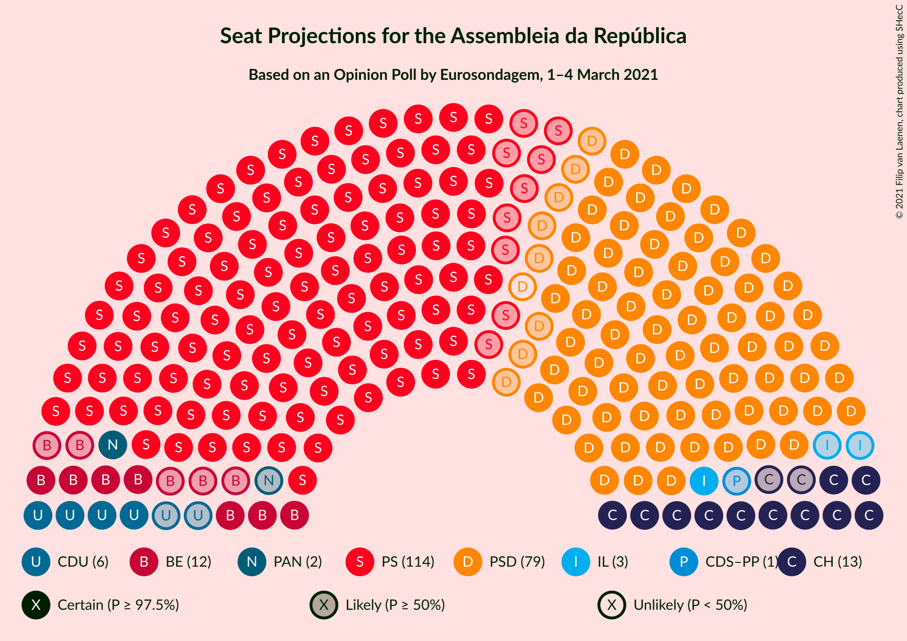
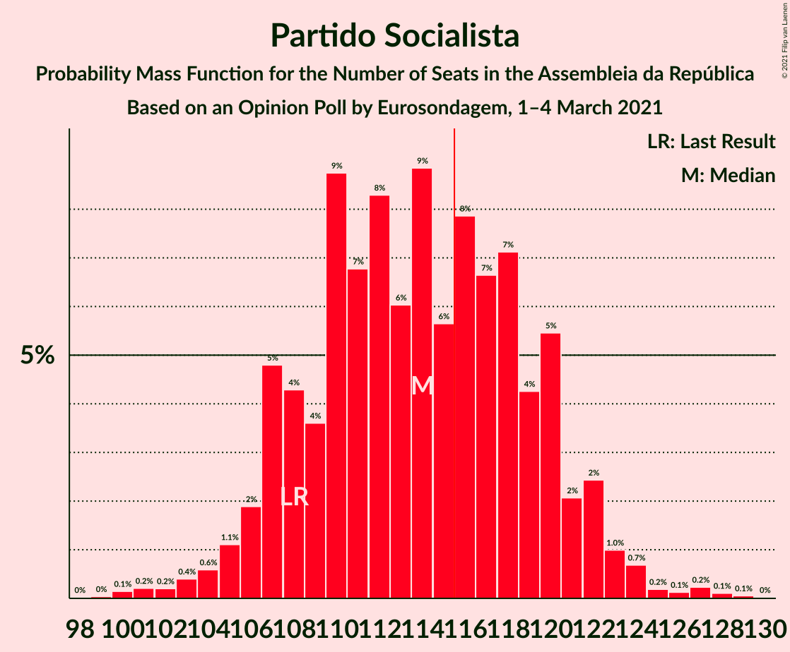
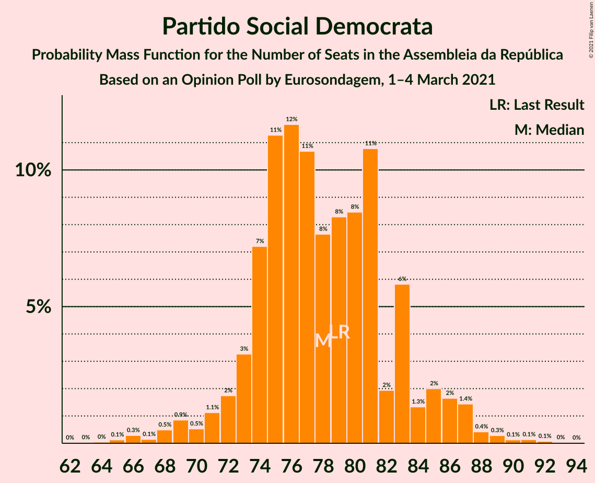
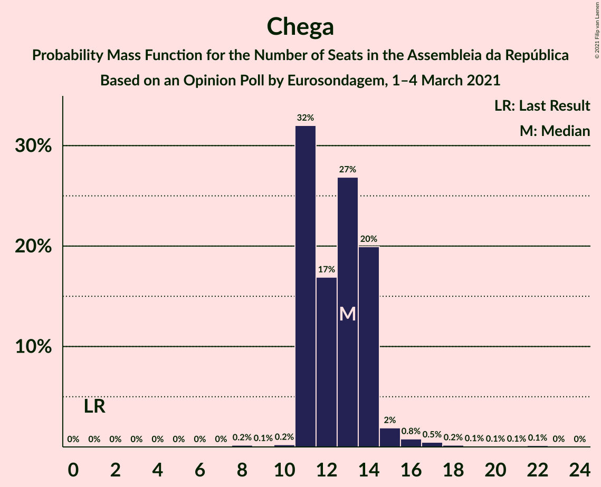
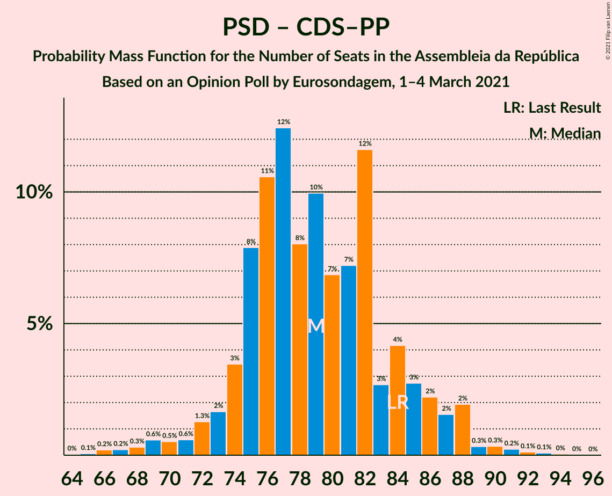

# Opinion Poll by Eurosondagem, 1–4 March 2021

<a href="#voting-intentions">Voting Intentions</a> | <a href="#seats">Seats</a> | <a href="#coalitions">Coalitions</a> | <a href="#technical-information">Technical Information</a>

## Voting Intentions

### Confidence Intervals

| Party | Last Result | Poll Result | 80% Confidence Interval | 90% Confidence Interval | 95% Confidence Interval | 99% Confidence Interval |
|:-----:|:-----------:|:-----------:|:-----------------------:|:-----------------------:|:-----------------------:|:-----------------------:|
| Partido Socialista | 36.4% | 39.5% | 37.6–41.5% |37.0–42.1% |36.5–42.6% |35.6–43.5% |
| Partido Social Democrata | 27.8% | 28.2% | 26.4–30.1% |26.0–30.6% |25.5–31.1% |24.7–32.0% |
| Chega | 1.3% | 7.5% | 6.6–8.7% |6.3–9.0% |6.1–9.3% |5.6–9.9% |
| Bloco de Esquerda | 9.5% | 7.0% | 6.1–8.2% |5.8–8.5% |5.6–8.8% |5.2–9.4% |
| Coligação Democrática Unitária | 6.3% | 4.5% | 3.7–5.4% |3.5–5.7% |3.3–5.9% |3.0–6.4% |
| Pessoas–Animais–Natureza | 3.3% | 2.5% | 2.0–3.2% |1.8–3.4% |1.7–3.6% |1.5–4.0% |
| CDS–Partido Popular | 4.2% | 2.2% | 1.7–2.9% |1.6–3.1% |1.4–3.3% |1.2–3.7% |
| Iniciativa Liberal | 1.3% | 2.1% | 1.6–2.8% |1.5–3.0% |1.4–3.2% |1.2–3.5% |

*Note:* The poll result column reflects the actual value used in the calculations. Published results may vary slightly, and in addition be rounded to fewer digits.

## Seats

### Confidence Intervals

| Party | Last Result | Median | 80% Confidence Interval | 90% Confidence Interval | 95% Confidence Interval | 99% Confidence Interval |
|:-----:|:-----------:|:------:|:-----------------------:|:-----------------------:|:-----------------------:|:-----------------------:|
| <a href="#partido-socialista">Partido Socialista</a> | 108 | 114 | 108–120 |107–121 |105–122 |102–126 |
| <a href="#partido-social-democrata">Partido Social Democrata</a> | 79 | 78 | 74–83 |72–85 |70–87 |66–89 |
| <a href="#chega">Chega</a> | 1 | 13 | 11–14 |11–14 |11–15 |10–18 |
| <a href="#bloco-de-esquerda">Bloco de Esquerda</a> | 19 | 12 | 10–16 |8–16 |7–17 |7–18 |
| <a href="#coligação-democrática-unitária">Coligação Democrática Unitária</a> | 12 | 6 | 5–8 |5–9 |4–10 |3–10 |
| <a href="#pessoas–animais–natureza">Pessoas–Animais–Natureza</a> | 4 | 2 | 1–3 |1–4 |1–4 |1–5 |
| <a href="#cds–partido-popular">CDS–Partido Popular</a> | 5 | 1 | 0–2 |0–2 |0–2 |0–3 |
| <a href="#iniciativa-liberal">Iniciativa Liberal</a> | 1 | 3 | 1–3 |1–3 |1–4 |1–4 |

### Partido Socialista

*For a full overview of the results for this party, see the [Partido Socialista](party-partidosocialista.html) page.*

| Number of Seats | Probability | Accumulated | Special Marks |
|:---------------:|:-----------:|:-----------:|:-------------:|
| 98 | 0% | 100% |  |
| 99 | 0% | 99.9% |  |
| 100 | 0.1% | 99.9% |  |
| 101 | 0.2% | 99.7% |  |
| 102 | 0.2% | 99.5% |  |
| 103 | 0.4% | 99.3% |  |
| 104 | 0.6% | 98.9% |  |
| 105 | 1.1% | 98% |  |
| 106 | 2% | 97% |  |
| 107 | 5% | 95% |  |
| 108 | 4% | 91% | Last Result |
| 109 | 4% | 86% |  |
| 110 | 9% | 83% |  |
| 111 | 7% | 74% |  |
| 112 | 8% | 67% |  |
| 113 | 6% | 59% |  |
| 114 | 9% | 53% | Median |
| 115 | 6% | 44% |  |
| 116 | 8% | 38% | Majority |
| 117 | 7% | 30% |  |
| 118 | 7% | 24% |  |
| 119 | 4% | 17% |  |
| 120 | 5% | 12% |  |
| 121 | 2% | 7% |  |
| 122 | 2% | 5% |  |
| 123 | 1.0% | 2% |  |
| 124 | 0.7% | 1.4% |  |
| 125 | 0.2% | 0.8% |  |
| 126 | 0.1% | 0.6% |  |
| 127 | 0.2% | 0.4% |  |
| 128 | 0.1% | 0.2% |  |
| 129 | 0.1% | 0.1% |  |
| 130 | 0% | 0% |  |

### Partido Social Democrata

*For a full overview of the results for this party, see the [Partido Social Democrata](party-partidosocialdemocrata.html) page.*

| Number of Seats | Probability | Accumulated | Special Marks |
|:---------------:|:-----------:|:-----------:|:-------------:|
| 63 | 0% | 100% |  |
| 64 | 0% | 99.9% |  |
| 65 | 0.1% | 99.9% |  |
| 66 | 0.3% | 99.8% |  |
| 67 | 0.1% | 99.5% |  |
| 68 | 0.5% | 99.3% |  |
| 69 | 0.9% | 98.8% |  |
| 70 | 0.5% | 98% |  |
| 71 | 1.1% | 97% |  |
| 72 | 2% | 96% |  |
| 73 | 3% | 95% |  |
| 74 | 7% | 91% |  |
| 75 | 11% | 84% |  |
| 76 | 12% | 73% |  |
| 77 | 11% | 61% |  |
| 78 | 8% | 50% | Median |
| 79 | 8% | 43% | Last Result |
| 80 | 8% | 35% |  |
| 81 | 11% | 26% |  |
| 82 | 2% | 15% |  |
| 83 | 6% | 13% |  |
| 84 | 1.3% | 8% |  |
| 85 | 2% | 6% |  |
| 86 | 2% | 4% |  |
| 87 | 1.4% | 3% |  |
| 88 | 0.4% | 1.1% |  |
| 89 | 0.3% | 0.7% |  |
| 90 | 0.1% | 0.4% |  |
| 91 | 0.1% | 0.3% |  |
| 92 | 0.1% | 0.1% |  |
| 93 | 0% | 0.1% |  |
| 94 | 0% | 0% |  |

### Chega

*For a full overview of the results for this party, see the [Chega](party-chega.html) page.*

| Number of Seats | Probability | Accumulated | Special Marks |
|:---------------:|:-----------:|:-----------:|:-------------:|
| 1 | 0% | 100% | Last Result |
| 2 | 0% | 100% |  |
| 3 | 0% | 100% |  |
| 4 | 0% | 100% |  |
| 5 | 0% | 100% |  |
| 6 | 0% | 100% |  |
| 7 | 0% | 100% |  |
| 8 | 0.2% | 100% |  |
| 9 | 0.1% | 99.8% |  |
| 10 | 0.2% | 99.7% |  |
| 11 | 32% | 99.5% |  |
| 12 | 17% | 67% |  |
| 13 | 27% | 51% | Median |
| 14 | 20% | 24% |  |
| 15 | 2% | 4% |  |
| 16 | 0.8% | 2% |  |
| 17 | 0.5% | 1.0% |  |
| 18 | 0.2% | 0.6% |  |
| 19 | 0.1% | 0.4% |  |
| 20 | 0.1% | 0.3% |  |
| 21 | 0.1% | 0.2% |  |
| 22 | 0.1% | 0.2% |  |
| 23 | 0% | 0% |  |

### Bloco de Esquerda

*For a full overview of the results for this party, see the [Bloco de Esquerda](party-blocodeesquerda.html) page.*

| Number of Seats | Probability | Accumulated | Special Marks |
|:---------------:|:-----------:|:-----------:|:-------------:|
| 7 | 3% | 100% |  |
| 8 | 4% | 97% |  |
| 9 | 2% | 93% |  |
| 10 | 4% | 91% |  |
| 11 | 18% | 87% |  |
| 12 | 25% | 69% | Median |
| 13 | 12% | 45% |  |
| 14 | 6% | 33% |  |
| 15 | 12% | 27% |  |
| 16 | 13% | 16% |  |
| 17 | 1.1% | 3% |  |
| 18 | 1.3% | 2% |  |
| 19 | 0.2% | 0.3% | Last Result |
| 20 | 0% | 0.1% |  |
| 21 | 0% | 0% |  |

### Coligação Democrática Unitária

*For a full overview of the results for this party, see the [Coligação Democrática Unitária](party-coligaçãodemocráticaunitária.html) page.*

| Number of Seats | Probability | Accumulated | Special Marks |
|:---------------:|:-----------:|:-----------:|:-------------:|
| 2 | 0.1% | 100% |  |
| 3 | 0.5% | 99.9% |  |
| 4 | 3% | 99.4% |  |
| 5 | 24% | 97% |  |
| 6 | 31% | 72% | Median |
| 7 | 29% | 41% |  |
| 8 | 7% | 12% |  |
| 9 | 2% | 5% |  |
| 10 | 3% | 3% |  |
| 11 | 0.2% | 0.5% |  |
| 12 | 0.1% | 0.3% | Last Result |
| 13 | 0.1% | 0.1% |  |
| 14 | 0% | 0% |  |

### Pessoas–Animais–Natureza

*For a full overview of the results for this party, see the [Pessoas–Animais–Natureza](party-pessoas–animais–natureza.html) page.*

| Number of Seats | Probability | Accumulated | Special Marks |
|:---------------:|:-----------:|:-----------:|:-------------:|
| 0 | 0.5% | 100% |  |
| 1 | 11% | 99.5% |  |
| 2 | 62% | 88% | Median |
| 3 | 17% | 26% |  |
| 4 | 9% | 9% | Last Result |
| 5 | 0.4% | 0.5% |  |
| 6 | 0.1% | 0.1% |  |
| 7 | 0% | 0% |  |

### CDS–Partido Popular

*For a full overview of the results for this party, see the [CDS–Partido Popular](party-cds–partidopopular.html) page.*

| Number of Seats | Probability | Accumulated | Special Marks |
|:---------------:|:-----------:|:-----------:|:-------------:|
| 0 | 23% | 100% |  |
| 1 | 48% | 77% | Median |
| 2 | 28% | 29% |  |
| 3 | 0.3% | 0.6% |  |
| 4 | 0.2% | 0.3% |  |
| 5 | 0.1% | 0.1% | Last Result |
| 6 | 0% | 0% |  |

### Iniciativa Liberal

*For a full overview of the results for this party, see the [Iniciativa Liberal](party-iniciativaliberal.html) page.*

| Number of Seats | Probability | Accumulated | Special Marks |
|:---------------:|:-----------:|:-----------:|:-------------:|
| 0 | 0.1% | 100% |  |
| 1 | 21% | 99.9% | Last Result |
| 2 | 20% | 79% |  |
| 3 | 55% | 59% | Median |
| 4 | 4% | 5% |  |
| 5 | 0.4% | 0.4% |  |
| 6 | 0% | 0% |  |

## Coalitions

### Confidence Intervals

| Coalition | Last Result | Median | Majority? | 80% Confidence Interval | 90% Confidence Interval | 95% Confidence Interval | 99% Confidence Interval |
|:---------:|:-----------:|:------:|:---------:|:-----------------------:|:-----------------------:|:-----------------------:|:-----------------------:|
| Partido Socialista – Bloco de Esquerda – Coligação Democrática Unitária | 139 | 133 | 100% | 127–138 | 125–139 | 124–140 | 121–145 |
| Partido Socialista – Bloco de Esquerda | 127 | 126 | 99.1% | 120–132 | 119–133 | 118–134 | 114–138 |
| Partido Socialista – Coligação Democrática Unitária | 120 | 120 | 86% | 114–126 | 112–127 | 111–128 | 108–132 |
| Partido Socialista | 108 | 114 | 38% | 108–120 | 107–121 | 105–122 | 102–126 |
| Partido Social Democrata – CDS–Partido Popular | 84 | 79 | 0% | 75–84 | 73–86 | 71–88 | 67–91 |

### Partido Socialista – Bloco de Esquerda – Coligação Democrática Unitária

| Number of Seats | Probability | Accumulated | Special Marks |
|:---------------:|:-----------:|:-----------:|:-------------:|
| 117 | 0% | 100% |  |
| 118 | 0.1% | 99.9% |  |
| 119 | 0.2% | 99.9% |  |
| 120 | 0.2% | 99.7% |  |
| 121 | 0.4% | 99.5% |  |
| 122 | 0.5% | 99.2% |  |
| 123 | 0.5% | 98.7% |  |
| 124 | 1.3% | 98% |  |
| 125 | 2% | 97% |  |
| 126 | 2% | 94% |  |
| 127 | 3% | 93% |  |
| 128 | 6% | 90% |  |
| 129 | 9% | 84% |  |
| 130 | 7% | 75% |  |
| 131 | 6% | 68% |  |
| 132 | 8% | 61% | Median |
| 133 | 8% | 53% |  |
| 134 | 6% | 46% |  |
| 135 | 8% | 40% |  |
| 136 | 9% | 31% |  |
| 137 | 10% | 22% |  |
| 138 | 6% | 13% |  |
| 139 | 3% | 7% | Last Result |
| 140 | 2% | 4% |  |
| 141 | 0.6% | 2% |  |
| 142 | 0.4% | 2% |  |
| 143 | 0.2% | 1.1% |  |
| 144 | 0.2% | 0.9% |  |
| 145 | 0.3% | 0.7% |  |
| 146 | 0.1% | 0.3% |  |
| 147 | 0.1% | 0.2% |  |
| 148 | 0% | 0.1% |  |
| 149 | 0% | 0.1% |  |
| 150 | 0% | 0% |  |

### Partido Socialista – Bloco de Esquerda

| Number of Seats | Probability | Accumulated | Special Marks |
|:---------------:|:-----------:|:-----------:|:-------------:|
| 110 | 0% | 100% |  |
| 111 | 0% | 99.9% |  |
| 112 | 0.1% | 99.9% |  |
| 113 | 0.1% | 99.9% |  |
| 114 | 0.4% | 99.7% |  |
| 115 | 0.3% | 99.3% |  |
| 116 | 0.5% | 99.1% | Majority |
| 117 | 0.6% | 98.6% |  |
| 118 | 1.1% | 98% |  |
| 119 | 2% | 97% |  |
| 120 | 5% | 95% |  |
| 121 | 3% | 90% |  |
| 122 | 8% | 86% |  |
| 123 | 8% | 78% |  |
| 124 | 7% | 70% |  |
| 125 | 6% | 64% |  |
| 126 | 8% | 58% | Median |
| 127 | 5% | 50% | Last Result |
| 128 | 7% | 45% |  |
| 129 | 7% | 38% |  |
| 130 | 10% | 31% |  |
| 131 | 9% | 22% |  |
| 132 | 6% | 13% |  |
| 133 | 2% | 6% |  |
| 134 | 2% | 4% |  |
| 135 | 0.7% | 2% |  |
| 136 | 0.3% | 1.5% |  |
| 137 | 0.4% | 1.2% |  |
| 138 | 0.3% | 0.8% |  |
| 139 | 0.1% | 0.5% |  |
| 140 | 0.2% | 0.3% |  |
| 141 | 0.1% | 0.2% |  |
| 142 | 0% | 0.1% |  |
| 143 | 0% | 0.1% |  |
| 144 | 0% | 0% |  |

### Partido Socialista – Coligação Democrática Unitária

| Number of Seats | Probability | Accumulated | Special Marks |
|:---------------:|:-----------:|:-----------:|:-------------:|
| 104 | 0% | 100% |  |
| 105 | 0.1% | 99.9% |  |
| 106 | 0.1% | 99.9% |  |
| 107 | 0.1% | 99.8% |  |
| 108 | 0.3% | 99.7% |  |
| 109 | 0.4% | 99.4% |  |
| 110 | 0.5% | 99.0% |  |
| 111 | 1.0% | 98% |  |
| 112 | 3% | 97% |  |
| 113 | 3% | 95% |  |
| 114 | 3% | 92% |  |
| 115 | 3% | 89% |  |
| 116 | 6% | 86% | Majority |
| 117 | 9% | 80% |  |
| 118 | 8% | 71% |  |
| 119 | 8% | 63% |  |
| 120 | 9% | 55% | Last Result, Median |
| 121 | 5% | 46% |  |
| 122 | 10% | 41% |  |
| 123 | 7% | 31% |  |
| 124 | 5% | 24% |  |
| 125 | 6% | 18% |  |
| 126 | 4% | 12% |  |
| 127 | 4% | 8% |  |
| 128 | 2% | 5% |  |
| 129 | 1.3% | 2% |  |
| 130 | 0.2% | 1.1% |  |
| 131 | 0.2% | 0.9% |  |
| 132 | 0.2% | 0.6% |  |
| 133 | 0.1% | 0.5% |  |
| 134 | 0.2% | 0.3% |  |
| 135 | 0% | 0.1% |  |
| 136 | 0% | 0.1% |  |
| 137 | 0% | 0.1% |  |
| 138 | 0% | 0% |  |

### Partido Socialista

| Number of Seats | Probability | Accumulated | Special Marks |
|:---------------:|:-----------:|:-----------:|:-------------:|
| 98 | 0% | 100% |  |
| 99 | 0% | 99.9% |  |
| 100 | 0.1% | 99.9% |  |
| 101 | 0.2% | 99.7% |  |
| 102 | 0.2% | 99.5% |  |
| 103 | 0.4% | 99.3% |  |
| 104 | 0.6% | 98.9% |  |
| 105 | 1.1% | 98% |  |
| 106 | 2% | 97% |  |
| 107 | 5% | 95% |  |
| 108 | 4% | 91% | Last Result |
| 109 | 4% | 86% |  |
| 110 | 9% | 83% |  |
| 111 | 7% | 74% |  |
| 112 | 8% | 67% |  |
| 113 | 6% | 59% |  |
| 114 | 9% | 53% | Median |
| 115 | 6% | 44% |  |
| 116 | 8% | 38% | Majority |
| 117 | 7% | 30% |  |
| 118 | 7% | 24% |  |
| 119 | 4% | 17% |  |
| 120 | 5% | 12% |  |
| 121 | 2% | 7% |  |
| 122 | 2% | 5% |  |
| 123 | 1.0% | 2% |  |
| 124 | 0.7% | 1.4% |  |
| 125 | 0.2% | 0.8% |  |
| 126 | 0.1% | 0.6% |  |
| 127 | 0.2% | 0.4% |  |
| 128 | 0.1% | 0.2% |  |
| 129 | 0.1% | 0.1% |  |
| 130 | 0% | 0% |  |

### Partido Social Democrata – CDS–Partido Popular

| Number of Seats | Probability | Accumulated | Special Marks |
|:---------------:|:-----------:|:-----------:|:-------------:|
| 64 | 0% | 100% |  |
| 65 | 0.1% | 99.9% |  |
| 66 | 0.2% | 99.9% |  |
| 67 | 0.2% | 99.7% |  |
| 68 | 0.3% | 99.5% |  |
| 69 | 0.6% | 99.2% |  |
| 70 | 0.5% | 98.6% |  |
| 71 | 0.6% | 98% |  |
| 72 | 1.3% | 97% |  |
| 73 | 2% | 96% |  |
| 74 | 3% | 95% |  |
| 75 | 8% | 91% |  |
| 76 | 11% | 83% |  |
| 77 | 12% | 73% |  |
| 78 | 8% | 60% |  |
| 79 | 10% | 52% | Median |
| 80 | 7% | 42% |  |
| 81 | 7% | 35% |  |
| 82 | 12% | 28% |  |
| 83 | 3% | 16% |  |
| 84 | 4% | 14% | Last Result |
| 85 | 3% | 10% |  |
| 86 | 2% | 7% |  |
| 87 | 2% | 5% |  |
| 88 | 2% | 3% |  |
| 89 | 0.3% | 1.2% |  |
| 90 | 0.3% | 0.9% |  |
| 91 | 0.2% | 0.5% |  |
| 92 | 0.1% | 0.3% |  |
| 93 | 0.1% | 0.2% |  |
| 94 | 0% | 0.1% |  |
| 95 | 0% | 0% |  |

## Technical Information

### Opinion Poll

+ **Polling firm:** Eurosondagem
+ **Commissioner(s):** —
+ **Fieldwork period:** 1–4 March 2021

### Calculations

+ **Sample size:** 1010
+ **Simulations done:** 1,048,576
+ **Error estimate:** 2.44%

