# Opinion Poll by Intercampus for Correio da Manhã and Negócios, 4–10 March 2021

<a href="#voting-intentions">Voting Intentions</a> | <a href="#seats">Seats</a> | <a href="#coalitions">Coalitions</a> | <a href="#technical-information">Technical Information</a>

## Voting Intentions

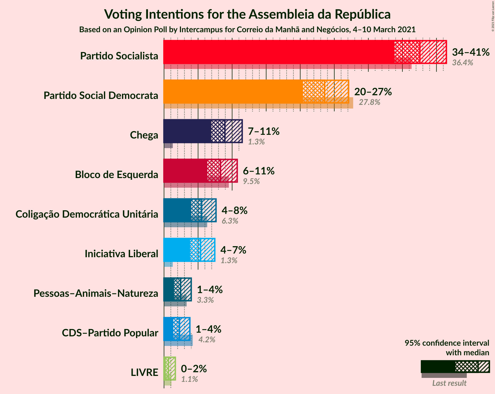

### Confidence Intervals

| Party | Last Result | Poll Result | 80% Confidence Interval | 90% Confidence Interval | 95% Confidence Interval | 99% Confidence Interval |
|:-----:|:-----------:|:-----------:|:-----------------------:|:-----------------------:|:-----------------------:|:-----------------------:|
| Partido Socialista | 36.4% | 37.6% | 35.1–40.1% |34.4–40.8% |33.8–41.5% |32.7–42.7% |
| Partido Social Democrata | 27.8% | 23.6% | 21.5–25.9% |20.9–26.5% |20.4–27.1% |19.4–28.2% |
| Chega | 1.3% | 8.9% | 7.6–10.6% |7.2–11.1% |6.9–11.5% |6.3–12.3% |
| Bloco de Esquerda | 9.5% | 8.3% | 7.0–9.9% |6.7–10.3% |6.4–10.7% |5.8–11.6% |
| Coligação Democrática Unitária | 6.3% | 5.5% | 4.5–6.9% |4.2–7.3% |4.0–7.6% |3.5–8.3% |
| Iniciativa Liberal | 1.3% | 5.4% | 4.4–6.7% |4.1–7.1% |3.8–7.5% |3.4–8.2% |
| Pessoas–Animais–Natureza | 3.3% | 2.4% | 1.8–3.4% |1.6–3.7% |1.5–4.0% |1.2–4.5% |
| CDS–Partido Popular | 4.2% | 2.3% | 1.7–3.3% |1.5–3.5% |1.4–3.8% |1.1–4.3% |
| LIVRE | 1.1% | 0.7% | 0.4–1.3% |0.3–1.5% |0.3–1.7% |0.2–2.0% |

*Note:* The poll result column reflects the actual value used in the calculations. Published results may vary slightly, and in addition be rounded to fewer digits.

## Seats

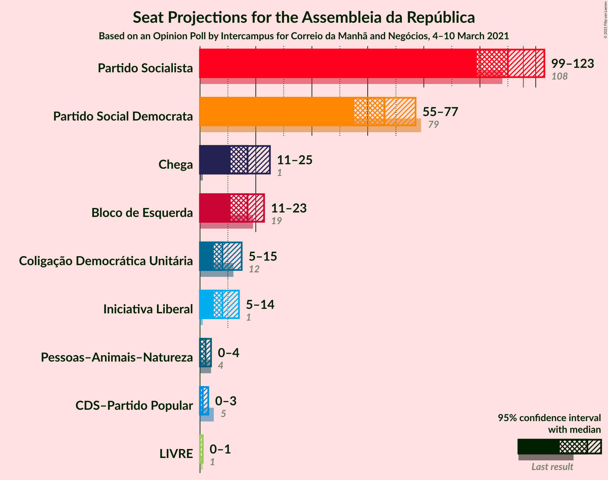

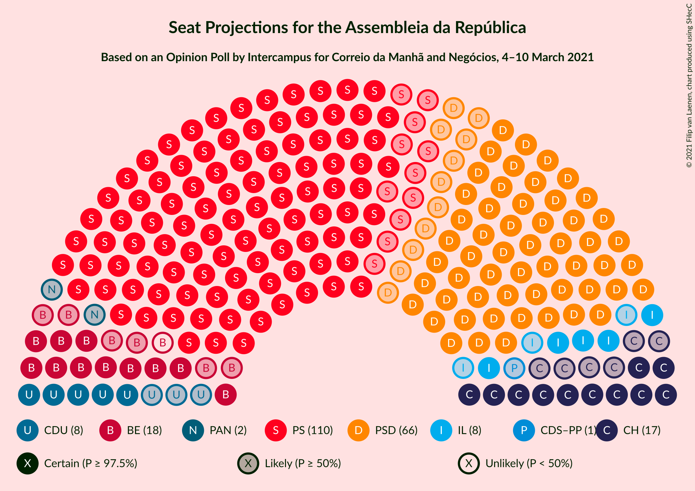

### Confidence Intervals

| Party | Last Result | Median | 80% Confidence Interval | 90% Confidence Interval | 95% Confidence Interval | 99% Confidence Interval |
|:-----:|:-----------:|:------:|:-----------------------:|:-----------------------:|:-----------------------:|:-----------------------:|
| <a href="#partido-socialista">Partido Socialista</a> | 108 | 110 | 104–119 |101–121 |99–123 |95–127 |
| <a href="#partido-social-democrata">Partido Social Democrata</a> | 79 | 66 | 58–72 |57–75 |55–77 |53–80 |
| <a href="#chega">Chega</a> | 1 | 17 | 13–23 |11–24 |11–25 |10–27 |
| <a href="#bloco-de-esquerda">Bloco de Esquerda</a> | 19 | 17 | 12–19 |11–21 |11–23 |7–24 |
| <a href="#coligação-democrática-unitária">Coligação Democrática Unitária</a> | 12 | 8 | 6–13 |5–14 |5–15 |4–17 |
| <a href="#iniciativa-liberal">Iniciativa Liberal</a> | 1 | 8 | 6–12 |5–12 |5–14 |4–14 |
| <a href="#pessoas–animais–natureza">Pessoas–Animais–Natureza</a> | 4 | 2 | 1–3 |1–4 |0–4 |0–6 |
| <a href="#cds–partido-popular">CDS–Partido Popular</a> | 5 | 1 | 0–2 |0–3 |0–3 |0–5 |
| <a href="#livre">LIVRE</a> | 1 | 0 | 0–1 |0–1 |0–1 |0–1 |

### Partido Socialista

*For a full overview of the results for this party, see the [Partido Socialista](party-partidosocialista.html) page.*

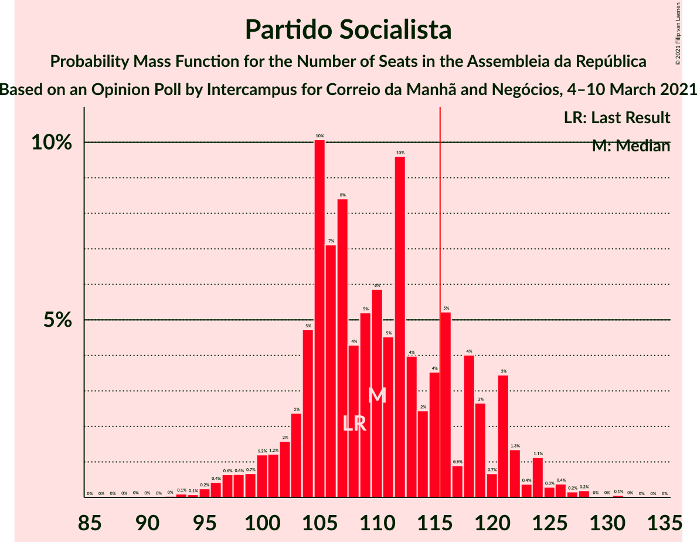

| Number of Seats | Probability | Accumulated | Special Marks |
|:---------------:|:-----------:|:-----------:|:-------------:|
| 89 | 0% | 100% |  |
| 90 | 0% | 99.9% |  |
| 91 | 0% | 99.9% |  |
| 92 | 0% | 99.9% |  |
| 93 | 0.1% | 99.9% |  |
| 94 | 0.1% | 99.8% |  |
| 95 | 0.2% | 99.7% |  |
| 96 | 0.4% | 99.5% |  |
| 97 | 0.6% | 99.0% |  |
| 98 | 0.6% | 98% |  |
| 99 | 0.7% | 98% |  |
| 100 | 1.2% | 97% |  |
| 101 | 1.2% | 96% |  |
| 102 | 2% | 95% |  |
| 103 | 2% | 93% |  |
| 104 | 5% | 91% |  |
| 105 | 10% | 86% |  |
| 106 | 7% | 76% |  |
| 107 | 8% | 69% |  |
| 108 | 4% | 60% | Last Result |
| 109 | 5% | 56% |  |
| 110 | 6% | 51% | Median |
| 111 | 5% | 45% |  |
| 112 | 10% | 40% |  |
| 113 | 4% | 31% |  |
| 114 | 2% | 27% |  |
| 115 | 4% | 24% |  |
| 116 | 5% | 21% | Majority |
| 117 | 0.9% | 16% |  |
| 118 | 4% | 15% |  |
| 119 | 3% | 11% |  |
| 120 | 0.7% | 8% |  |
| 121 | 3% | 7% |  |
| 122 | 1.3% | 4% |  |
| 123 | 0.4% | 3% |  |
| 124 | 1.1% | 2% |  |
| 125 | 0.3% | 1.2% |  |
| 126 | 0.4% | 0.9% |  |
| 127 | 0.2% | 0.5% |  |
| 128 | 0.2% | 0.3% |  |
| 129 | 0% | 0.2% |  |
| 130 | 0% | 0.1% |  |
| 131 | 0.1% | 0.1% |  |
| 132 | 0% | 0% |  |

### Partido Social Democrata

*For a full overview of the results for this party, see the [Partido Social Democrata](party-partidosocialdemocrata.html) page.*

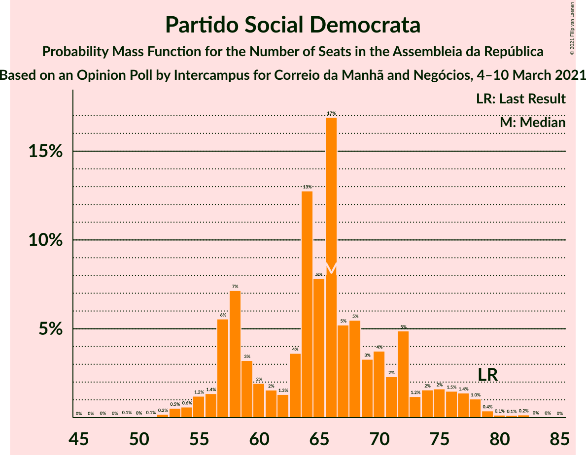

| Number of Seats | Probability | Accumulated | Special Marks |
|:---------------:|:-----------:|:-----------:|:-------------:|
| 49 | 0.1% | 100% |  |
| 50 | 0% | 99.9% |  |
| 51 | 0.1% | 99.9% |  |
| 52 | 0.2% | 99.8% |  |
| 53 | 0.5% | 99.6% |  |
| 54 | 0.6% | 99.1% |  |
| 55 | 1.2% | 98.5% |  |
| 56 | 1.4% | 97% |  |
| 57 | 6% | 96% |  |
| 58 | 7% | 90% |  |
| 59 | 3% | 83% |  |
| 60 | 2% | 80% |  |
| 61 | 2% | 78% |  |
| 62 | 1.3% | 77% |  |
| 63 | 4% | 75% |  |
| 64 | 13% | 72% |  |
| 65 | 8% | 59% |  |
| 66 | 17% | 51% | Median |
| 67 | 5% | 34% |  |
| 68 | 5% | 29% |  |
| 69 | 3% | 23% |  |
| 70 | 4% | 20% |  |
| 71 | 2% | 16% |  |
| 72 | 5% | 14% |  |
| 73 | 1.2% | 9% |  |
| 74 | 2% | 8% |  |
| 75 | 2% | 6% |  |
| 76 | 1.5% | 5% |  |
| 77 | 1.4% | 3% |  |
| 78 | 1.0% | 2% |  |
| 79 | 0.4% | 0.9% | Last Result |
| 80 | 0.1% | 0.5% |  |
| 81 | 0.1% | 0.4% |  |
| 82 | 0.2% | 0.3% |  |
| 83 | 0% | 0.1% |  |
| 84 | 0% | 0.1% |  |
| 85 | 0% | 0% |  |

### Chega

*For a full overview of the results for this party, see the [Chega](party-chega.html) page.*

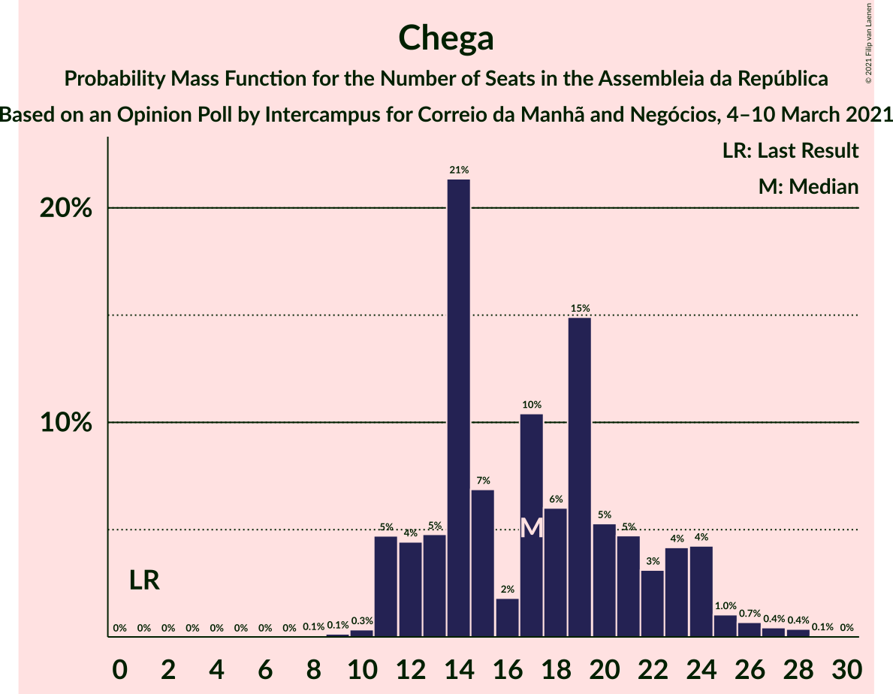

| Number of Seats | Probability | Accumulated | Special Marks |
|:---------------:|:-----------:|:-----------:|:-------------:|
| 1 | 0% | 100% | Last Result |
| 2 | 0% | 100% |  |
| 3 | 0% | 100% |  |
| 4 | 0% | 100% |  |
| 5 | 0% | 100% |  |
| 6 | 0% | 100% |  |
| 7 | 0% | 100% |  |
| 8 | 0.1% | 100% |  |
| 9 | 0.1% | 99.9% |  |
| 10 | 0.3% | 99.8% |  |
| 11 | 5% | 99.5% |  |
| 12 | 4% | 95% |  |
| 13 | 5% | 90% |  |
| 14 | 21% | 86% |  |
| 15 | 7% | 64% |  |
| 16 | 2% | 57% |  |
| 17 | 10% | 55% | Median |
| 18 | 6% | 45% |  |
| 19 | 15% | 39% |  |
| 20 | 5% | 24% |  |
| 21 | 5% | 19% |  |
| 22 | 3% | 14% |  |
| 23 | 4% | 11% |  |
| 24 | 4% | 7% |  |
| 25 | 1.0% | 3% |  |
| 26 | 0.7% | 2% |  |
| 27 | 0.4% | 0.9% |  |
| 28 | 0.4% | 0.5% |  |
| 29 | 0.1% | 0.1% |  |
| 30 | 0% | 0% |  |

### Bloco de Esquerda

*For a full overview of the results for this party, see the [Bloco de Esquerda](party-blocodeesquerda.html) page.*

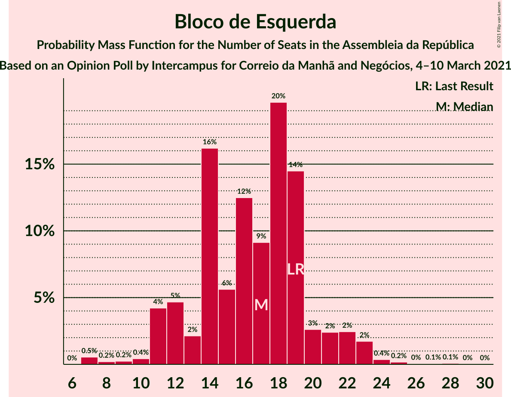

| Number of Seats | Probability | Accumulated | Special Marks |
|:---------------:|:-----------:|:-----------:|:-------------:|
| 7 | 0.5% | 100% |  |
| 8 | 0.2% | 99.5% |  |
| 9 | 0.2% | 99.2% |  |
| 10 | 0.4% | 99.0% |  |
| 11 | 4% | 98.6% |  |
| 12 | 5% | 94% |  |
| 13 | 2% | 90% |  |
| 14 | 16% | 88% |  |
| 15 | 6% | 71% |  |
| 16 | 12% | 66% |  |
| 17 | 9% | 53% | Median |
| 18 | 20% | 44% |  |
| 19 | 14% | 24% | Last Result |
| 20 | 3% | 10% |  |
| 21 | 2% | 7% |  |
| 22 | 2% | 5% |  |
| 23 | 2% | 3% |  |
| 24 | 0.4% | 0.8% |  |
| 25 | 0.2% | 0.4% |  |
| 26 | 0% | 0.2% |  |
| 27 | 0.1% | 0.2% |  |
| 28 | 0.1% | 0.1% |  |
| 29 | 0% | 0.1% |  |
| 30 | 0% | 0% |  |

### Coligação Democrática Unitária

*For a full overview of the results for this party, see the [Coligação Democrática Unitária](party-coligaçãodemocráticaunitária.html) page.*

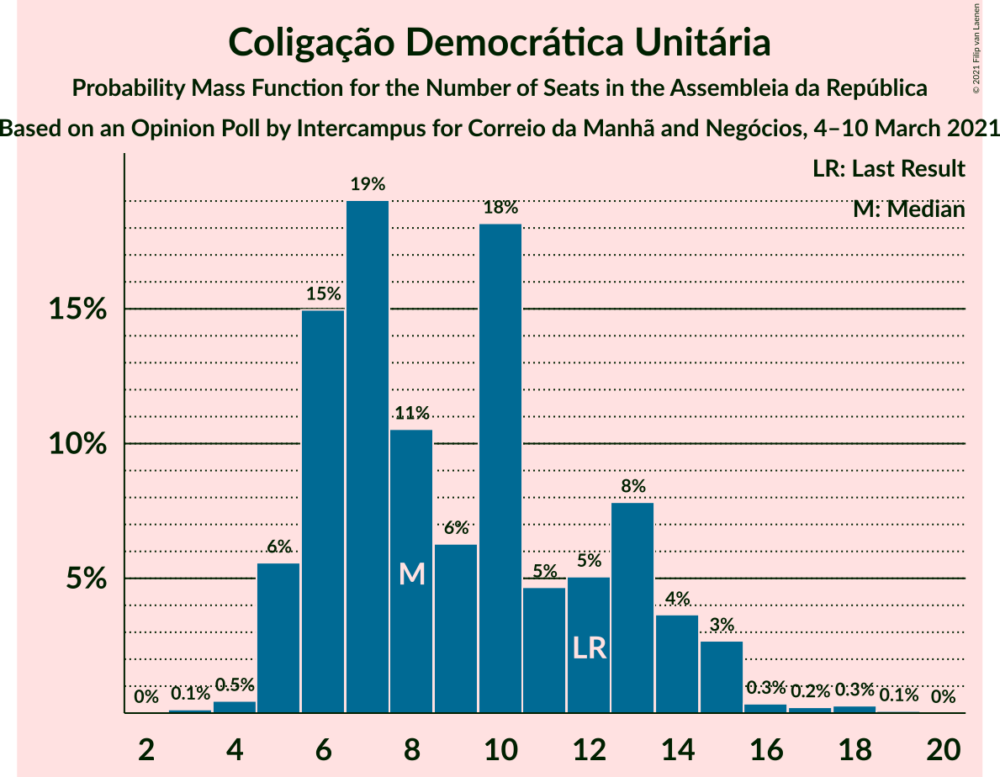

| Number of Seats | Probability | Accumulated | Special Marks |
|:---------------:|:-----------:|:-----------:|:-------------:|
| 3 | 0.1% | 100% |  |
| 4 | 0.5% | 99.9% |  |
| 5 | 6% | 99.4% |  |
| 6 | 15% | 94% |  |
| 7 | 19% | 79% |  |
| 8 | 11% | 60% | Median |
| 9 | 6% | 49% |  |
| 10 | 18% | 43% |  |
| 11 | 5% | 25% |  |
| 12 | 5% | 20% | Last Result |
| 13 | 8% | 15% |  |
| 14 | 4% | 7% |  |
| 15 | 3% | 4% |  |
| 16 | 0.3% | 0.9% |  |
| 17 | 0.2% | 0.6% |  |
| 18 | 0.3% | 0.4% |  |
| 19 | 0.1% | 0.1% |  |
| 20 | 0% | 0% |  |

### Iniciativa Liberal

*For a full overview of the results for this party, see the [Iniciativa Liberal](party-iniciativaliberal.html) page.*

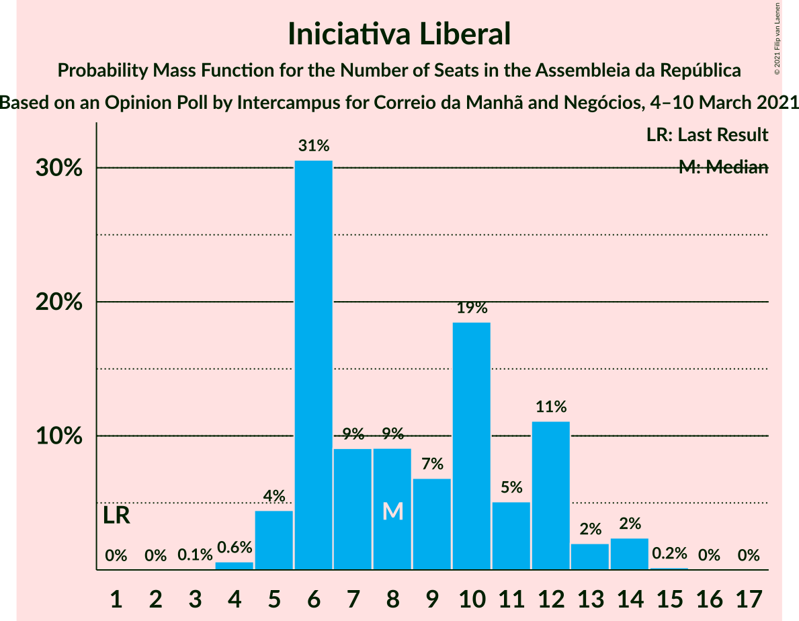

| Number of Seats | Probability | Accumulated | Special Marks |
|:---------------:|:-----------:|:-----------:|:-------------:|
| 1 | 0% | 100% | Last Result |
| 2 | 0% | 100% |  |
| 3 | 0.1% | 100% |  |
| 4 | 0.6% | 99.9% |  |
| 5 | 4% | 99.3% |  |
| 6 | 31% | 95% |  |
| 7 | 9% | 64% |  |
| 8 | 9% | 55% | Median |
| 9 | 7% | 46% |  |
| 10 | 19% | 39% |  |
| 11 | 5% | 21% |  |
| 12 | 11% | 16% |  |
| 13 | 2% | 5% |  |
| 14 | 2% | 3% |  |
| 15 | 0.2% | 0.2% |  |
| 16 | 0% | 0.1% |  |
| 17 | 0% | 0% |  |

### Pessoas–Animais–Natureza

*For a full overview of the results for this party, see the [Pessoas–Animais–Natureza](party-pessoas–animais–natureza.html) page.*

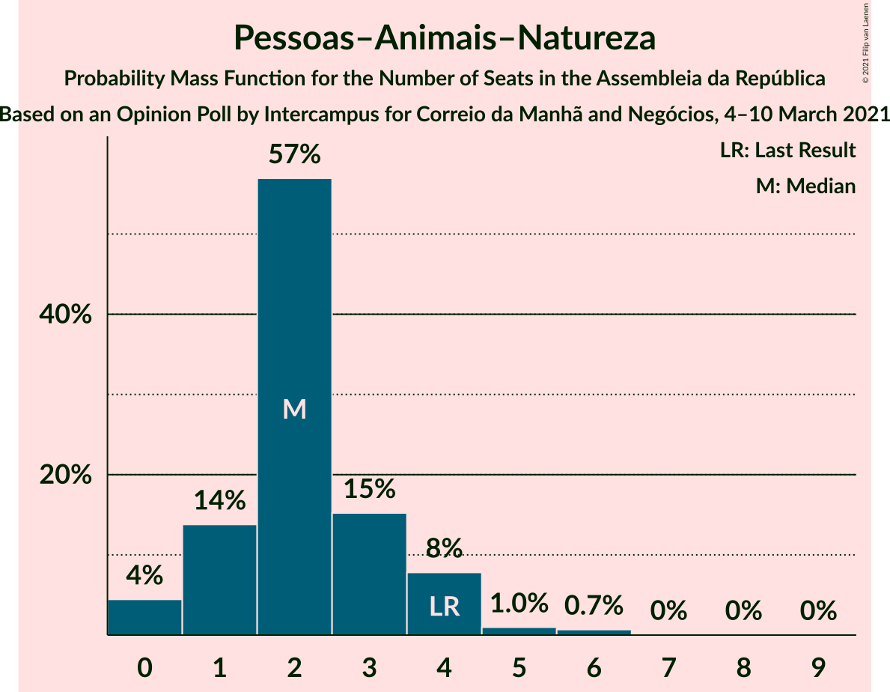

| Number of Seats | Probability | Accumulated | Special Marks |
|:---------------:|:-----------:|:-----------:|:-------------:|
| 0 | 4% | 100% |  |
| 1 | 14% | 96% |  |
| 2 | 57% | 82% | Median |
| 3 | 15% | 25% |  |
| 4 | 8% | 10% | Last Result |
| 5 | 1.0% | 2% |  |
| 6 | 0.7% | 0.8% |  |
| 7 | 0% | 0.1% |  |
| 8 | 0% | 0.1% |  |
| 9 | 0% | 0% |  |

### CDS–Partido Popular

*For a full overview of the results for this party, see the [CDS–Partido Popular](party-cds–partidopopular.html) page.*

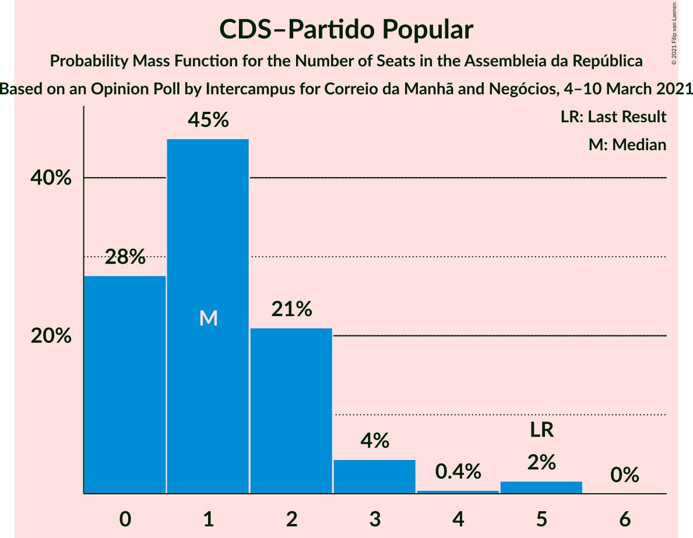

| Number of Seats | Probability | Accumulated | Special Marks |
|:---------------:|:-----------:|:-----------:|:-------------:|
| 0 | 28% | 100% |  |
| 1 | 45% | 72% | Median |
| 2 | 21% | 27% |  |
| 3 | 4% | 6% |  |
| 4 | 0.4% | 2% |  |
| 5 | 2% | 2% | Last Result |
| 6 | 0% | 0% |  |

### LIVRE

*For a full overview of the results for this party, see the [LIVRE](party-livre.html) page.*

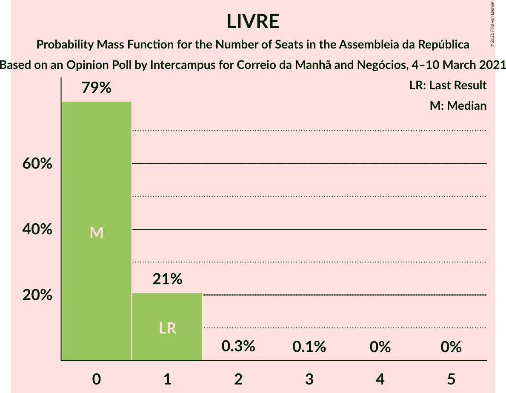

| Number of Seats | Probability | Accumulated | Special Marks |
|:---------------:|:-----------:|:-----------:|:-------------:|
| 0 | 79% | 100% | Median |
| 1 | 21% | 21% | Last Result |
| 2 | 0.3% | 0.3% |  |
| 3 | 0.1% | 0.1% |  |
| 4 | 0% | 0% |  |

## Coalitions

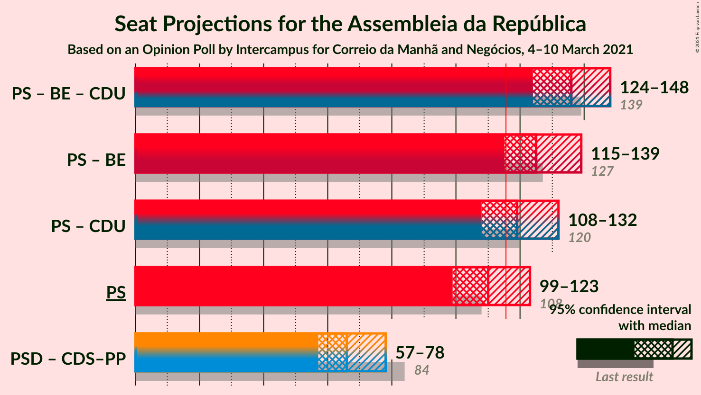

### Confidence Intervals

| Coalition | Last Result | Median | Majority? | 80% Confidence Interval | 90% Confidence Interval | 95% Confidence Interval | 99% Confidence Interval |
|:---------:|:-----------:|:------:|:---------:|:-----------------------:|:-----------------------:|:-----------------------:|:-----------------------:|
| Partido Socialista – Bloco de Esquerda – Coligação Democrática Unitária | 139 | 136 | 99.9% | 128–144 | 127–146 | 124–148 | 119–152 |
| Partido Socialista – Bloco de Esquerda | 127 | 125 | 97% | 120–136 | 117–137 | 115–139 | 111–143 |
| Partido Socialista – Coligação Democrática Unitária | 120 | 119 | 68% | 111–127 | 110–130 | 108–132 | 104–136 |
| Partido Socialista | 108 | 110 | 21% | 104–119 | 101–121 | 99–123 | 95–127 |
| Partido Social Democrata – CDS–Partido Popular | 84 | 66 | 0% | 59–74 | 58–76 | 57–78 | 54–81 |

### Partido Socialista – Bloco de Esquerda – Coligação Democrática Unitária

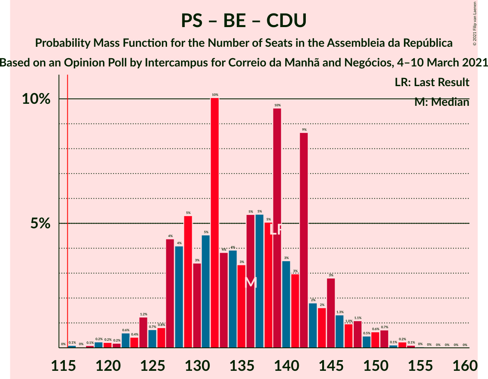

| Number of Seats | Probability | Accumulated | Special Marks |
|:---------------:|:-----------:|:-----------:|:-------------:|
| 115 | 0% | 100% |  |
| 116 | 0.1% | 99.9% | Majority |
| 117 | 0% | 99.8% |  |
| 118 | 0.1% | 99.8% |  |
| 119 | 0.2% | 99.7% |  |
| 120 | 0.2% | 99.5% |  |
| 121 | 0.2% | 99.3% |  |
| 122 | 0.6% | 99.1% |  |
| 123 | 0.4% | 98% |  |
| 124 | 1.2% | 98% |  |
| 125 | 0.7% | 97% |  |
| 126 | 0.8% | 96% |  |
| 127 | 4% | 95% |  |
| 128 | 4% | 91% |  |
| 129 | 5% | 87% |  |
| 130 | 3% | 82% |  |
| 131 | 5% | 78% |  |
| 132 | 10% | 74% |  |
| 133 | 4% | 64% |  |
| 134 | 4% | 60% |  |
| 135 | 3% | 56% | Median |
| 136 | 5% | 52% |  |
| 137 | 5% | 47% |  |
| 138 | 5% | 42% |  |
| 139 | 10% | 37% | Last Result |
| 140 | 3% | 27% |  |
| 141 | 3% | 24% |  |
| 142 | 9% | 21% |  |
| 143 | 2% | 12% |  |
| 144 | 2% | 10% |  |
| 145 | 3% | 9% |  |
| 146 | 1.3% | 6% |  |
| 147 | 1.0% | 4% |  |
| 148 | 1.1% | 3% |  |
| 149 | 0.5% | 2% |  |
| 150 | 0.6% | 2% |  |
| 151 | 0.7% | 1.2% |  |
| 152 | 0.1% | 0.5% |  |
| 153 | 0.2% | 0.4% |  |
| 154 | 0.1% | 0.2% |  |
| 155 | 0% | 0.1% |  |
| 156 | 0% | 0% |  |

### Partido Socialista – Bloco de Esquerda

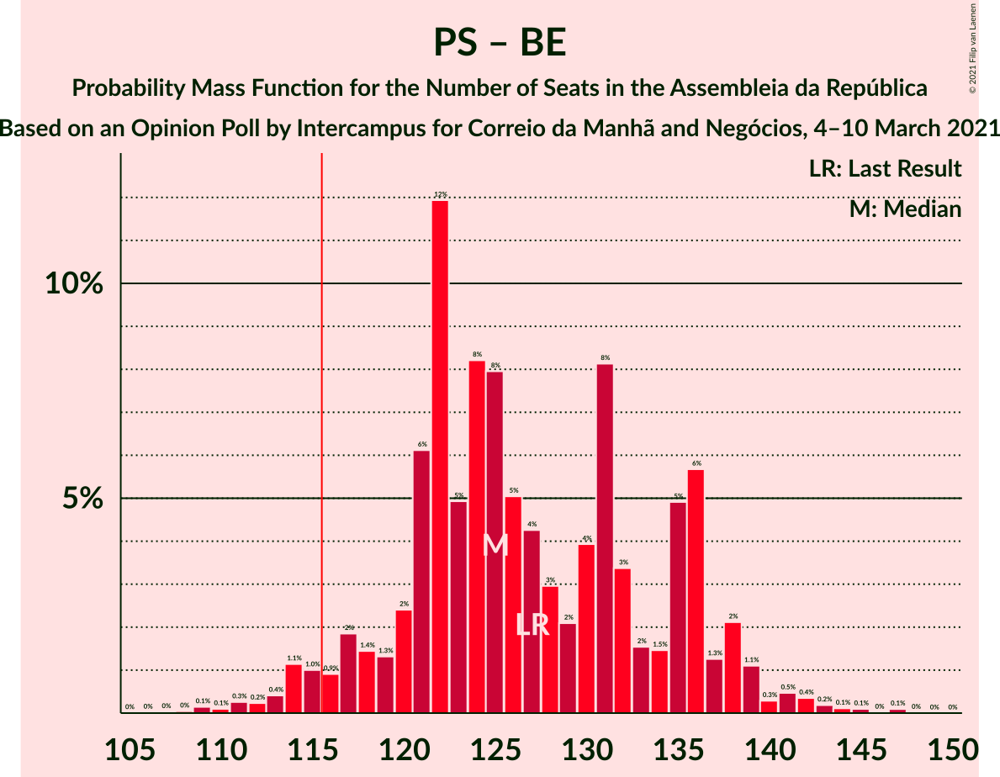

| Number of Seats | Probability | Accumulated | Special Marks |
|:---------------:|:-----------:|:-----------:|:-------------:|
| 106 | 0% | 100% |  |
| 107 | 0% | 99.9% |  |
| 108 | 0% | 99.9% |  |
| 109 | 0.1% | 99.9% |  |
| 110 | 0.1% | 99.7% |  |
| 111 | 0.3% | 99.6% |  |
| 112 | 0.2% | 99.4% |  |
| 113 | 0.4% | 99.1% |  |
| 114 | 1.1% | 98.7% |  |
| 115 | 1.0% | 98% |  |
| 116 | 0.9% | 97% | Majority |
| 117 | 2% | 96% |  |
| 118 | 1.4% | 94% |  |
| 119 | 1.3% | 92% |  |
| 120 | 2% | 91% |  |
| 121 | 6% | 89% |  |
| 122 | 12% | 83% |  |
| 123 | 5% | 71% |  |
| 124 | 8% | 66% |  |
| 125 | 8% | 57% |  |
| 126 | 5% | 49% |  |
| 127 | 4% | 44% | Last Result, Median |
| 128 | 3% | 40% |  |
| 129 | 2% | 37% |  |
| 130 | 4% | 35% |  |
| 131 | 8% | 31% |  |
| 132 | 3% | 23% |  |
| 133 | 2% | 20% |  |
| 134 | 1.5% | 18% |  |
| 135 | 5% | 17% |  |
| 136 | 6% | 12% |  |
| 137 | 1.3% | 6% |  |
| 138 | 2% | 5% |  |
| 139 | 1.1% | 3% |  |
| 140 | 0.3% | 2% |  |
| 141 | 0.5% | 1.3% |  |
| 142 | 0.4% | 0.9% |  |
| 143 | 0.2% | 0.5% |  |
| 144 | 0.1% | 0.3% |  |
| 145 | 0.1% | 0.2% |  |
| 146 | 0% | 0.1% |  |
| 147 | 0.1% | 0.1% |  |
| 148 | 0% | 0% |  |

### Partido Socialista – Coligação Democrática Unitária

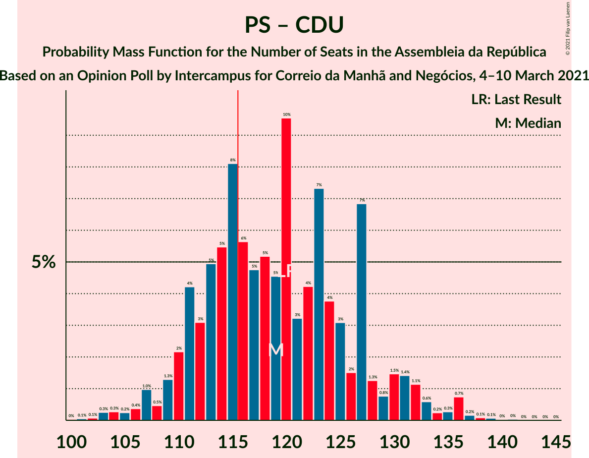

| Number of Seats | Probability | Accumulated | Special Marks |
|:---------------:|:-----------:|:-----------:|:-------------:|
| 100 | 0% | 100% |  |
| 101 | 0.1% | 99.9% |  |
| 102 | 0.1% | 99.9% |  |
| 103 | 0.3% | 99.8% |  |
| 104 | 0.3% | 99.5% |  |
| 105 | 0.2% | 99.3% |  |
| 106 | 0.4% | 99.0% |  |
| 107 | 1.0% | 98.7% |  |
| 108 | 0.5% | 98% |  |
| 109 | 1.3% | 97% |  |
| 110 | 2% | 96% |  |
| 111 | 4% | 94% |  |
| 112 | 3% | 90% |  |
| 113 | 5% | 86% |  |
| 114 | 5% | 82% |  |
| 115 | 8% | 76% |  |
| 116 | 6% | 68% | Majority |
| 117 | 5% | 62% |  |
| 118 | 5% | 58% | Median |
| 119 | 5% | 52% |  |
| 120 | 10% | 48% | Last Result |
| 121 | 3% | 38% |  |
| 122 | 4% | 35% |  |
| 123 | 7% | 31% |  |
| 124 | 4% | 23% |  |
| 125 | 3% | 20% |  |
| 126 | 2% | 17% |  |
| 127 | 7% | 15% |  |
| 128 | 1.3% | 8% |  |
| 129 | 0.8% | 7% |  |
| 130 | 1.5% | 6% |  |
| 131 | 1.4% | 5% |  |
| 132 | 1.1% | 3% |  |
| 133 | 0.6% | 2% |  |
| 134 | 0.2% | 2% |  |
| 135 | 0.3% | 1.4% |  |
| 136 | 0.7% | 1.1% |  |
| 137 | 0.2% | 0.4% |  |
| 138 | 0.1% | 0.2% |  |
| 139 | 0.1% | 0.1% |  |
| 140 | 0% | 0.1% |  |
| 141 | 0% | 0% |  |

### Partido Socialista

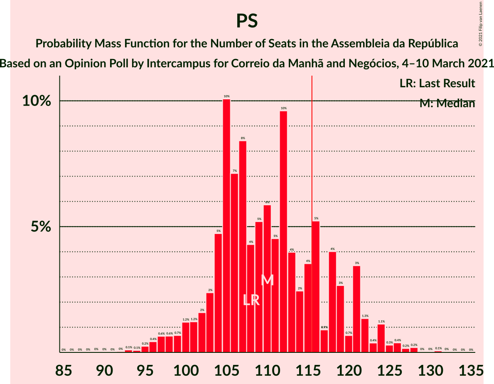

| Number of Seats | Probability | Accumulated | Special Marks |
|:---------------:|:-----------:|:-----------:|:-------------:|
| 89 | 0% | 100% |  |
| 90 | 0% | 99.9% |  |
| 91 | 0% | 99.9% |  |
| 92 | 0% | 99.9% |  |
| 93 | 0.1% | 99.9% |  |
| 94 | 0.1% | 99.8% |  |
| 95 | 0.2% | 99.7% |  |
| 96 | 0.4% | 99.5% |  |
| 97 | 0.6% | 99.0% |  |
| 98 | 0.6% | 98% |  |
| 99 | 0.7% | 98% |  |
| 100 | 1.2% | 97% |  |
| 101 | 1.2% | 96% |  |
| 102 | 2% | 95% |  |
| 103 | 2% | 93% |  |
| 104 | 5% | 91% |  |
| 105 | 10% | 86% |  |
| 106 | 7% | 76% |  |
| 107 | 8% | 69% |  |
| 108 | 4% | 60% | Last Result |
| 109 | 5% | 56% |  |
| 110 | 6% | 51% | Median |
| 111 | 5% | 45% |  |
| 112 | 10% | 40% |  |
| 113 | 4% | 31% |  |
| 114 | 2% | 27% |  |
| 115 | 4% | 24% |  |
| 116 | 5% | 21% | Majority |
| 117 | 0.9% | 16% |  |
| 118 | 4% | 15% |  |
| 119 | 3% | 11% |  |
| 120 | 0.7% | 8% |  |
| 121 | 3% | 7% |  |
| 122 | 1.3% | 4% |  |
| 123 | 0.4% | 3% |  |
| 124 | 1.1% | 2% |  |
| 125 | 0.3% | 1.2% |  |
| 126 | 0.4% | 0.9% |  |
| 127 | 0.2% | 0.5% |  |
| 128 | 0.2% | 0.3% |  |
| 129 | 0% | 0.2% |  |
| 130 | 0% | 0.1% |  |
| 131 | 0.1% | 0.1% |  |
| 132 | 0% | 0% |  |

### Partido Social Democrata – CDS–Partido Popular

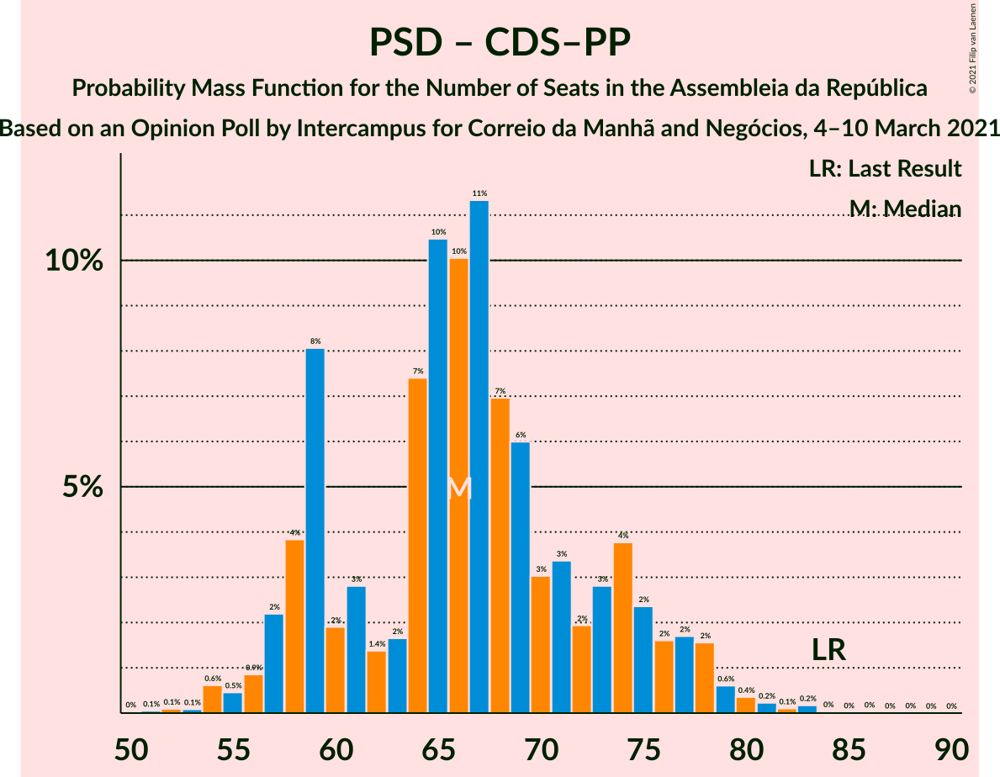

| Number of Seats | Probability | Accumulated | Special Marks |
|:---------------:|:-----------:|:-----------:|:-------------:|
| 50 | 0% | 100% |  |
| 51 | 0.1% | 99.9% |  |
| 52 | 0.1% | 99.9% |  |
| 53 | 0.1% | 99.8% |  |
| 54 | 0.6% | 99.7% |  |
| 55 | 0.5% | 99.1% |  |
| 56 | 0.9% | 98.6% |  |
| 57 | 2% | 98% |  |
| 58 | 4% | 96% |  |
| 59 | 8% | 92% |  |
| 60 | 2% | 84% |  |
| 61 | 3% | 82% |  |
| 62 | 1.4% | 79% |  |
| 63 | 2% | 78% |  |
| 64 | 7% | 76% |  |
| 65 | 10% | 69% |  |
| 66 | 10% | 58% |  |
| 67 | 11% | 48% | Median |
| 68 | 7% | 37% |  |
| 69 | 6% | 30% |  |
| 70 | 3% | 24% |  |
| 71 | 3% | 21% |  |
| 72 | 2% | 17% |  |
| 73 | 3% | 15% |  |
| 74 | 4% | 13% |  |
| 75 | 2% | 9% |  |
| 76 | 2% | 6% |  |
| 77 | 2% | 5% |  |
| 78 | 2% | 3% |  |
| 79 | 0.6% | 2% |  |
| 80 | 0.4% | 1.0% |  |
| 81 | 0.2% | 0.6% |  |
| 82 | 0.1% | 0.4% |  |
| 83 | 0.2% | 0.3% |  |
| 84 | 0% | 0.1% | Last Result |
| 85 | 0% | 0.1% |  |
| 86 | 0% | 0.1% |  |
| 87 | 0% | 0% |  |

## Technical Information

### Opinion Poll

+ **Polling firm:** Intercampus
+ **Commissioner(s):** Correio da Manhã and Negócios
+ **Fieldwork period:** 4–10 March 2021

### Calculations

+ **Sample size:** 615
+ **Simulations done:** 1,048,576
+ **Error estimate:** 1.36%

