# Opinion Poll by Eurosondagem for Porto Canal and Sol, 5–8 April 2021

<a href="#voting-intentions">Voting Intentions</a> | <a href="#seats">Seats</a> | <a href="#coalitions">Coalitions</a> | <a href="#technical-information">Technical Information</a>

## Voting Intentions

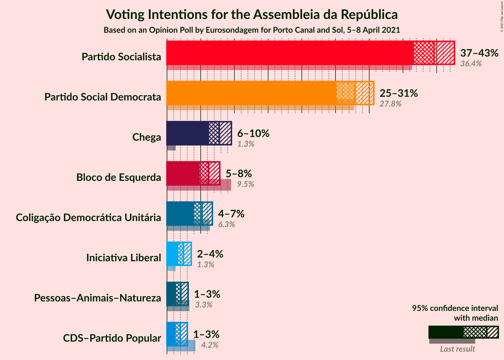

### Confidence Intervals

| Party | Last Result | Poll Result | 80% Confidence Interval | 90% Confidence Interval | 95% Confidence Interval | 99% Confidence Interval |
|:-----:|:-----------:|:-----------:|:-----------------------:|:-----------------------:|:-----------------------:|:-----------------------:|
| Partido Socialista | 36.4% | 39.6% | 37.7–41.6% |37.1–42.2% |36.6–42.6% |35.7–43.6% |
| Partido Social Democrata | 27.8% | 27.8% | 26.1–29.7% |25.6–30.2% |25.2–30.7% |24.4–31.6% |
| Chega | 1.3% | 7.7% | 6.8–8.9% |6.5–9.3% |6.2–9.6% |5.8–10.2% |
| Bloco de Esquerda | 9.5% | 6.2% | 5.3–7.3% |5.1–7.6% |4.8–7.8% |4.5–8.4% |
| Coligação Democrática Unitária | 6.3% | 5.2% | 4.4–6.2% |4.2–6.5% |4.0–6.7% |3.6–7.3% |
| Iniciativa Liberal | 1.3% | 2.5% | 1.9–3.2% |1.8–3.4% |1.7–3.6% |1.4–4.0% |
| Pessoas–Animais–Natureza | 3.3% | 2.1% | 1.6–2.8% |1.5–3.0% |1.3–3.1% |1.2–3.5% |
| CDS–Partido Popular | 4.2% | 2.0% | 1.5–2.7% |1.4–2.8% |1.3–3.0% |1.1–3.4% |

*Note:* The poll result column reflects the actual value used in the calculations. Published results may vary slightly, and in addition be rounded to fewer digits.

## Seats

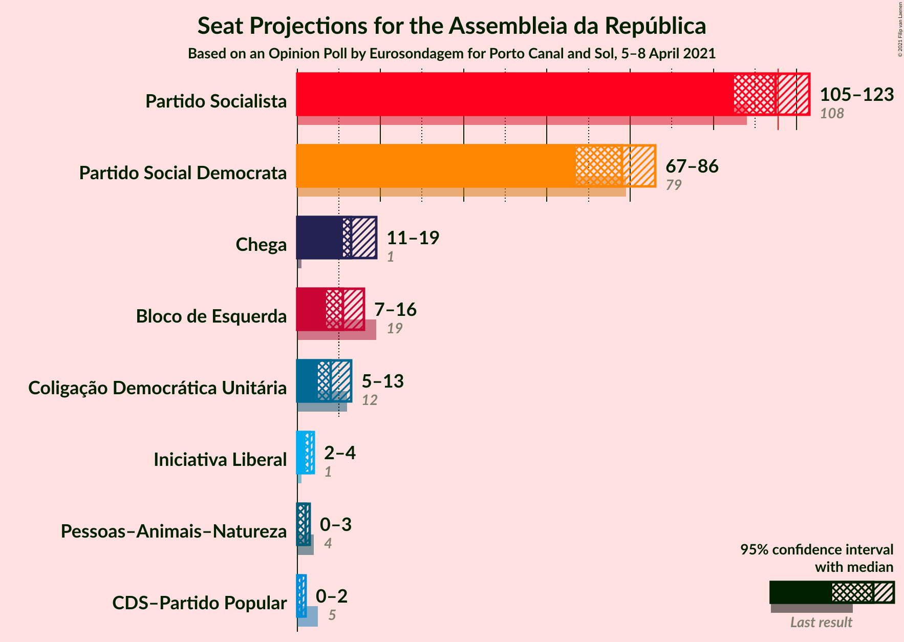

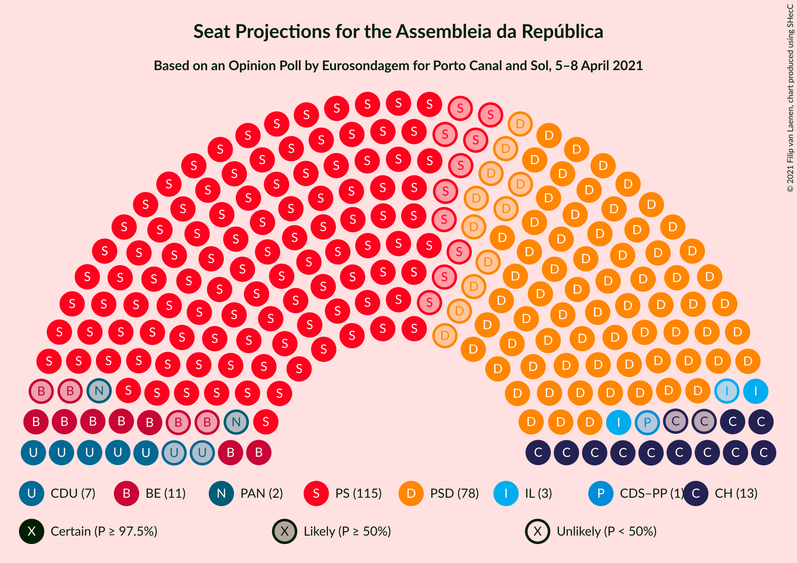

### Confidence Intervals

| Party | Last Result | Median | 80% Confidence Interval | 90% Confidence Interval | 95% Confidence Interval | 99% Confidence Interval |
|:-----:|:-----------:|:------:|:-----------------------:|:-----------------------:|:-----------------------:|:-----------------------:|
| <a href="#partido-socialista">Partido Socialista</a> | 108 | 115 | 109–120 |106–122 |105–123 |103–127 |
| <a href="#partido-social-democrata">Partido Social Democrata</a> | 79 | 78 | 71–84 |69–84 |67–86 |65–88 |
| <a href="#chega">Chega</a> | 1 | 13 | 11–17 |11–18 |11–19 |9–22 |
| <a href="#bloco-de-esquerda">Bloco de Esquerda</a> | 19 | 11 | 7–13 |7–14 |7–16 |5–16 |
| <a href="#coligação-democrática-unitária">Coligação Democrática Unitária</a> | 12 | 8 | 6–10 |5–12 |5–13 |5–14 |
| <a href="#iniciativa-liberal">Iniciativa Liberal</a> | 1 | 3 | 2–4 |2–4 |2–4 |1–5 |
| <a href="#pessoas–animais–natureza">Pessoas–Animais–Natureza</a> | 4 | 2 | 1–2 |0–2 |0–3 |0–4 |
| <a href="#cds–partido-popular">CDS–Partido Popular</a> | 5 | 1 | 0–1 |0–2 |0–2 |0–2 |

### Partido Socialista

*For a full overview of the results for this party, see the [Partido Socialista](party-partidosocialista.html) page.*

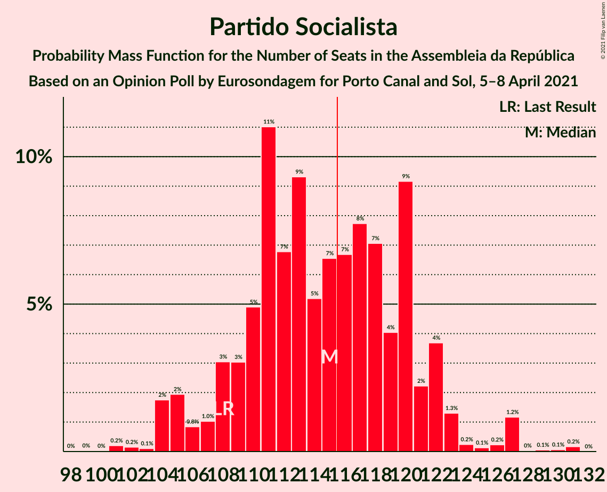

| Number of Seats | Probability | Accumulated | Special Marks |
|:---------------:|:-----------:|:-----------:|:-------------:|
| 99 | 0% | 100% |  |
| 100 | 0% | 99.9% |  |
| 101 | 0.2% | 99.9% |  |
| 102 | 0.2% | 99.7% |  |
| 103 | 0.1% | 99.5% |  |
| 104 | 2% | 99.4% |  |
| 105 | 2% | 98% |  |
| 106 | 0.8% | 96% |  |
| 107 | 1.0% | 95% |  |
| 108 | 3% | 94% | Last Result |
| 109 | 3% | 91% |  |
| 110 | 5% | 88% |  |
| 111 | 11% | 83% |  |
| 112 | 7% | 72% |  |
| 113 | 9% | 65% |  |
| 114 | 5% | 56% |  |
| 115 | 7% | 51% | Median |
| 116 | 7% | 44% | Majority |
| 117 | 8% | 37% |  |
| 118 | 7% | 30% |  |
| 119 | 4% | 23% |  |
| 120 | 9% | 19% |  |
| 121 | 2% | 9% |  |
| 122 | 4% | 7% |  |
| 123 | 1.3% | 3% |  |
| 124 | 0.2% | 2% |  |
| 125 | 0.1% | 2% |  |
| 126 | 0.2% | 2% |  |
| 127 | 1.2% | 2% |  |
| 128 | 0% | 0.4% |  |
| 129 | 0.1% | 0.3% |  |
| 130 | 0.1% | 0.3% |  |
| 131 | 0.2% | 0.2% |  |
| 132 | 0% | 0% |  |

### Partido Social Democrata

*For a full overview of the results for this party, see the [Partido Social Democrata](party-partidosocialdemocrata.html) page.*

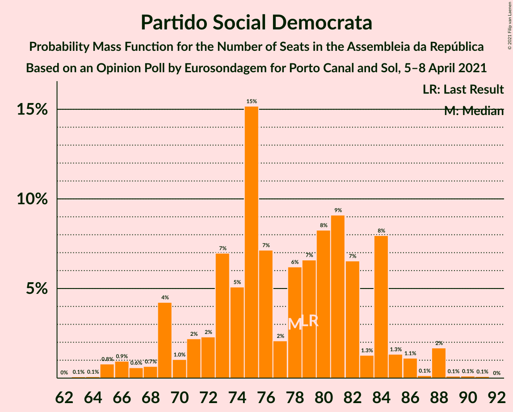

| Number of Seats | Probability | Accumulated | Special Marks |
|:---------------:|:-----------:|:-----------:|:-------------:|
| 62 | 0% | 100% |  |
| 63 | 0.1% | 99.9% |  |
| 64 | 0.1% | 99.9% |  |
| 65 | 0.8% | 99.8% |  |
| 66 | 0.9% | 99.0% |  |
| 67 | 0.6% | 98% |  |
| 68 | 0.7% | 97% |  |
| 69 | 4% | 97% |  |
| 70 | 1.0% | 93% |  |
| 71 | 2% | 92% |  |
| 72 | 2% | 89% |  |
| 73 | 7% | 87% |  |
| 74 | 5% | 80% |  |
| 75 | 15% | 75% |  |
| 76 | 7% | 60% |  |
| 77 | 2% | 53% |  |
| 78 | 6% | 51% | Median |
| 79 | 7% | 44% | Last Result |
| 80 | 8% | 38% |  |
| 81 | 9% | 30% |  |
| 82 | 7% | 20% |  |
| 83 | 1.3% | 14% |  |
| 84 | 8% | 13% |  |
| 85 | 1.3% | 5% |  |
| 86 | 1.1% | 3% |  |
| 87 | 0.1% | 2% |  |
| 88 | 2% | 2% |  |
| 89 | 0.1% | 0.4% |  |
| 90 | 0.1% | 0.3% |  |
| 91 | 0.1% | 0.1% |  |
| 92 | 0% | 0% |  |

### Chega

*For a full overview of the results for this party, see the [Chega](party-chega.html) page.*

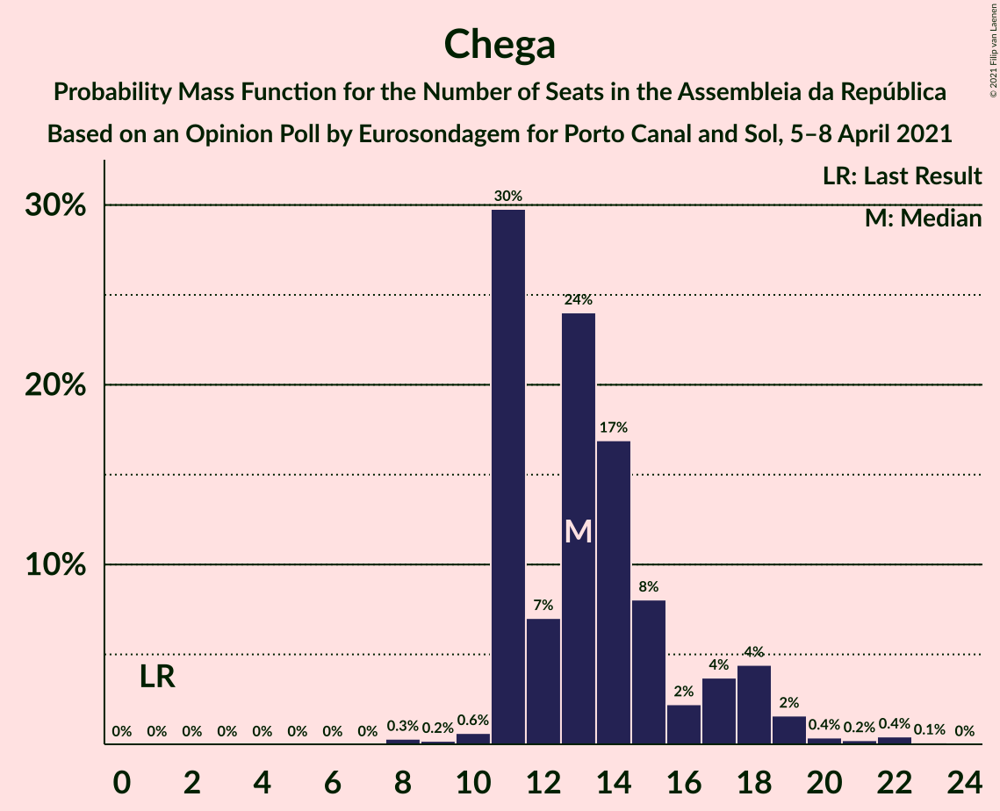

| Number of Seats | Probability | Accumulated | Special Marks |
|:---------------:|:-----------:|:-----------:|:-------------:|
| 1 | 0% | 100% | Last Result |
| 2 | 0% | 100% |  |
| 3 | 0% | 100% |  |
| 4 | 0% | 100% |  |
| 5 | 0% | 100% |  |
| 6 | 0% | 100% |  |
| 7 | 0% | 100% |  |
| 8 | 0.3% | 100% |  |
| 9 | 0.2% | 99.7% |  |
| 10 | 0.6% | 99.5% |  |
| 11 | 30% | 98.9% |  |
| 12 | 7% | 69% |  |
| 13 | 24% | 62% | Median |
| 14 | 17% | 38% |  |
| 15 | 8% | 21% |  |
| 16 | 2% | 13% |  |
| 17 | 4% | 11% |  |
| 18 | 4% | 7% |  |
| 19 | 2% | 3% |  |
| 20 | 0.4% | 1.2% |  |
| 21 | 0.2% | 0.8% |  |
| 22 | 0.4% | 0.6% |  |
| 23 | 0.1% | 0.1% |  |
| 24 | 0% | 0% |  |

### Bloco de Esquerda

*For a full overview of the results for this party, see the [Bloco de Esquerda](party-blocodeesquerda.html) page.*

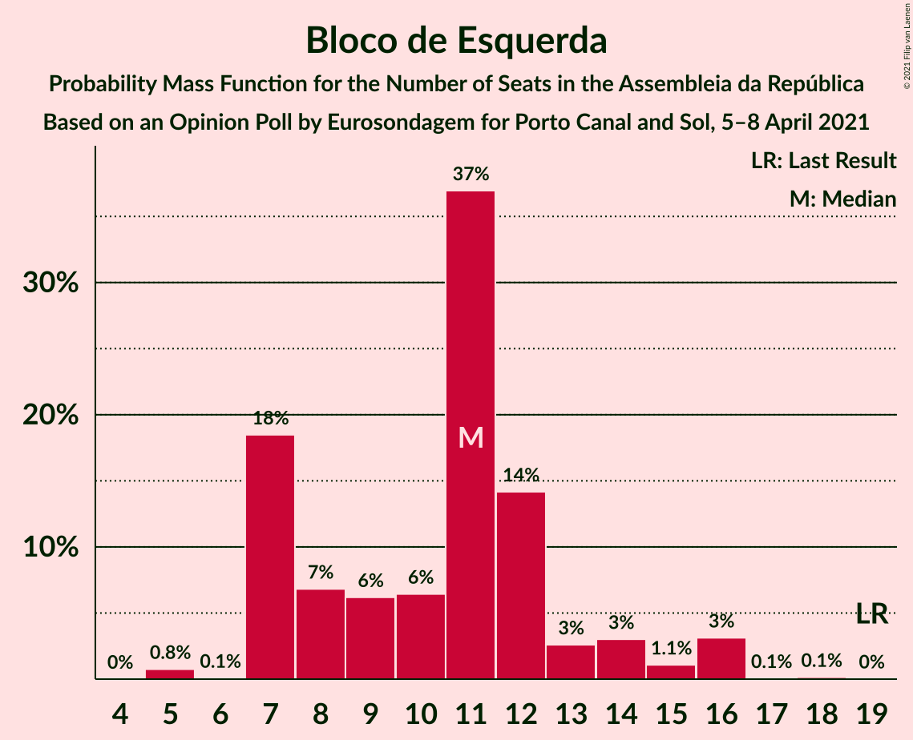

| Number of Seats | Probability | Accumulated | Special Marks |
|:---------------:|:-----------:|:-----------:|:-------------:|
| 5 | 0.8% | 100% |  |
| 6 | 0.1% | 99.2% |  |
| 7 | 18% | 99.1% |  |
| 8 | 7% | 81% |  |
| 9 | 6% | 74% |  |
| 10 | 6% | 68% |  |
| 11 | 37% | 61% | Median |
| 12 | 14% | 24% |  |
| 13 | 3% | 10% |  |
| 14 | 3% | 7% |  |
| 15 | 1.1% | 4% |  |
| 16 | 3% | 3% |  |
| 17 | 0.1% | 0.2% |  |
| 18 | 0.1% | 0.2% |  |
| 19 | 0% | 0% | Last Result |

### Coligação Democrática Unitária

*For a full overview of the results for this party, see the [Coligação Democrática Unitária](party-coligaçãodemocráticaunitária.html) page.*

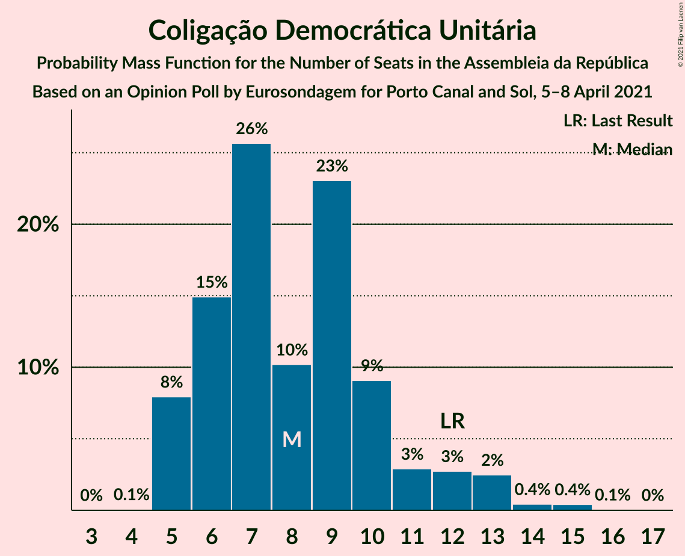

| Number of Seats | Probability | Accumulated | Special Marks |
|:---------------:|:-----------:|:-----------:|:-------------:|
| 4 | 0.1% | 100% |  |
| 5 | 8% | 99.9% |  |
| 6 | 15% | 92% |  |
| 7 | 26% | 77% |  |
| 8 | 10% | 51% | Median |
| 9 | 23% | 41% |  |
| 10 | 9% | 18% |  |
| 11 | 3% | 9% |  |
| 12 | 3% | 6% | Last Result |
| 13 | 2% | 3% |  |
| 14 | 0.4% | 0.9% |  |
| 15 | 0.4% | 0.5% |  |
| 16 | 0.1% | 0.1% |  |
| 17 | 0% | 0% |  |

### Iniciativa Liberal

*For a full overview of the results for this party, see the [Iniciativa Liberal](party-iniciativaliberal.html) page.*

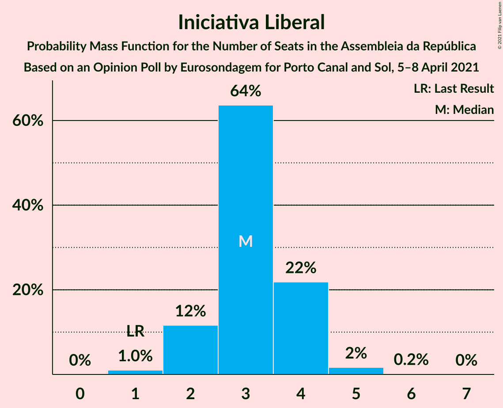

| Number of Seats | Probability | Accumulated | Special Marks |
|:---------------:|:-----------:|:-----------:|:-------------:|
| 1 | 1.0% | 100% | Last Result |
| 2 | 12% | 99.0% |  |
| 3 | 64% | 87% | Median |
| 4 | 22% | 24% |  |
| 5 | 2% | 2% |  |
| 6 | 0.2% | 0.2% |  |
| 7 | 0% | 0% |  |

### Pessoas–Animais–Natureza

*For a full overview of the results for this party, see the [Pessoas–Animais–Natureza](party-pessoas–animais–natureza.html) page.*

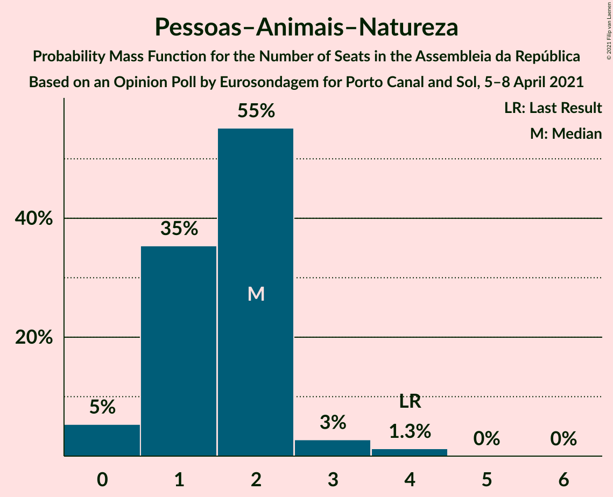

| Number of Seats | Probability | Accumulated | Special Marks |
|:---------------:|:-----------:|:-----------:|:-------------:|
| 0 | 5% | 100% |  |
| 1 | 35% | 95% |  |
| 2 | 55% | 59% | Median |
| 3 | 3% | 4% |  |
| 4 | 1.3% | 1.3% | Last Result |
| 5 | 0% | 0.1% |  |
| 6 | 0% | 0% |  |

### CDS–Partido Popular

*For a full overview of the results for this party, see the [CDS–Partido Popular](party-cds–partidopopular.html) page.*

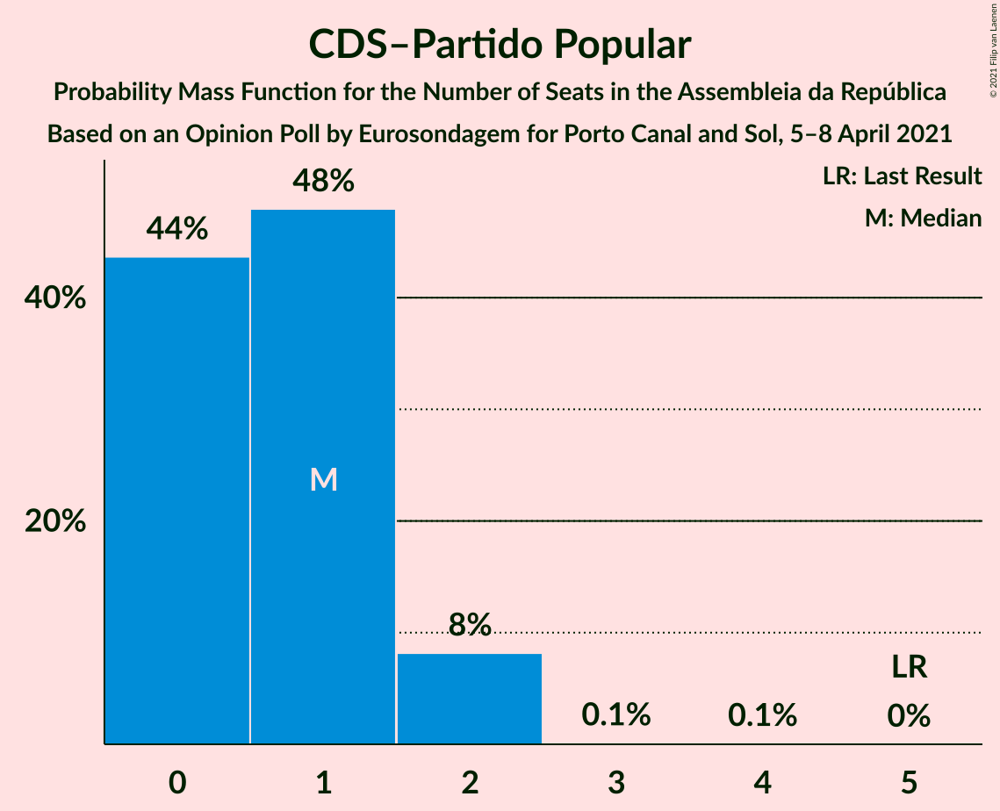

| Number of Seats | Probability | Accumulated | Special Marks |
|:---------------:|:-----------:|:-----------:|:-------------:|
| 0 | 44% | 100% |  |
| 1 | 48% | 56% | Median |
| 2 | 8% | 8% |  |
| 3 | 0.1% | 0.2% |  |
| 4 | 0.1% | 0.1% |  |
| 5 | 0% | 0% | Last Result |

## Coalitions

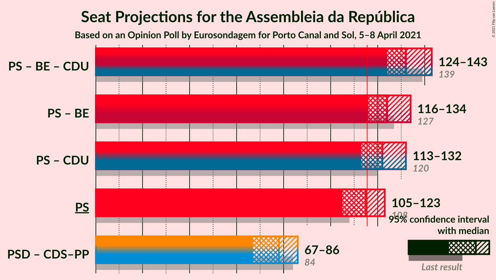

### Confidence Intervals

| Coalition | Last Result | Median | Majority? | 80% Confidence Interval | 90% Confidence Interval | 95% Confidence Interval | 99% Confidence Interval |
|:---------:|:-----------:|:------:|:---------:|:-----------------------:|:-----------------------:|:-----------------------:|:-----------------------:|
| Partido Socialista – Bloco de Esquerda – Coligação Democrática Unitária | 139 | 132 | 100% | 127–139 | 125–140 | 124–143 | 122–145 |
| Partido Socialista – Bloco de Esquerda | 127 | 124 | 98% | 120–131 | 117–132 | 116–134 | 114–138 |
| Partido Socialista – Coligação Democrática Unitária | 120 | 122 | 93% | 117–128 | 115–129 | 113–132 | 111–137 |
| Partido Socialista | 108 | 115 | 44% | 109–120 | 106–122 | 105–123 | 103–127 |
| Partido Social Democrata – CDS–Partido Popular | 84 | 78 | 0% | 72–84 | 70–85 | 67–86 | 66–89 |

### Partido Socialista – Bloco de Esquerda – Coligação Democrática Unitária

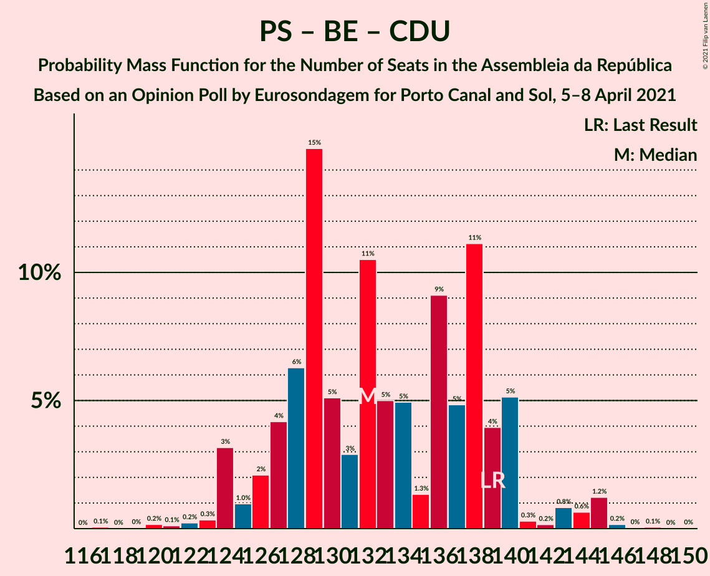

| Number of Seats | Probability | Accumulated | Special Marks |
|:---------------:|:-----------:|:-----------:|:-------------:|
| 117 | 0.1% | 100% |  |
| 118 | 0% | 99.9% |  |
| 119 | 0% | 99.9% |  |
| 120 | 0.2% | 99.9% |  |
| 121 | 0.1% | 99.7% |  |
| 122 | 0.2% | 99.6% |  |
| 123 | 0.3% | 99.3% |  |
| 124 | 3% | 99.0% |  |
| 125 | 1.0% | 96% |  |
| 126 | 2% | 95% |  |
| 127 | 4% | 93% |  |
| 128 | 6% | 89% |  |
| 129 | 15% | 82% |  |
| 130 | 5% | 67% |  |
| 131 | 3% | 62% |  |
| 132 | 11% | 59% |  |
| 133 | 5% | 49% |  |
| 134 | 5% | 44% | Median |
| 135 | 1.3% | 39% |  |
| 136 | 9% | 38% |  |
| 137 | 5% | 29% |  |
| 138 | 11% | 24% |  |
| 139 | 4% | 13% | Last Result |
| 140 | 5% | 9% |  |
| 141 | 0.3% | 3% |  |
| 142 | 0.2% | 3% |  |
| 143 | 0.8% | 3% |  |
| 144 | 0.6% | 2% |  |
| 145 | 1.2% | 2% |  |
| 146 | 0.2% | 0.3% |  |
| 147 | 0% | 0.1% |  |
| 148 | 0.1% | 0.1% |  |
| 149 | 0% | 0% |  |

### Partido Socialista – Bloco de Esquerda

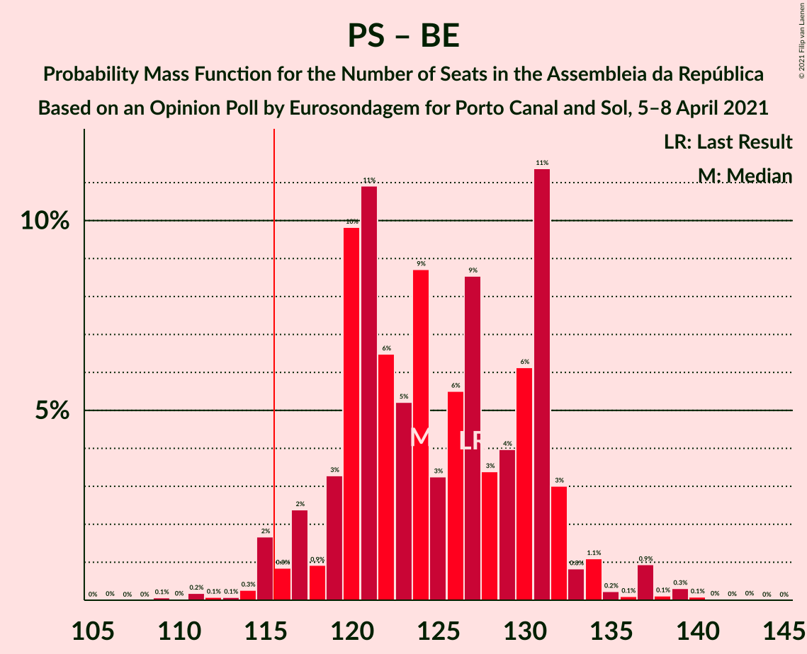

| Number of Seats | Probability | Accumulated | Special Marks |
|:---------------:|:-----------:|:-----------:|:-------------:|
| 109 | 0.1% | 100% |  |
| 110 | 0% | 99.9% |  |
| 111 | 0.2% | 99.9% |  |
| 112 | 0.1% | 99.7% |  |
| 113 | 0.1% | 99.6% |  |
| 114 | 0.3% | 99.5% |  |
| 115 | 2% | 99.3% |  |
| 116 | 0.8% | 98% | Majority |
| 117 | 2% | 97% |  |
| 118 | 0.9% | 94% |  |
| 119 | 3% | 93% |  |
| 120 | 10% | 90% |  |
| 121 | 11% | 80% |  |
| 122 | 6% | 69% |  |
| 123 | 5% | 63% |  |
| 124 | 9% | 58% |  |
| 125 | 3% | 49% |  |
| 126 | 6% | 46% | Median |
| 127 | 9% | 40% | Last Result |
| 128 | 3% | 32% |  |
| 129 | 4% | 28% |  |
| 130 | 6% | 24% |  |
| 131 | 11% | 18% |  |
| 132 | 3% | 7% |  |
| 133 | 0.8% | 4% |  |
| 134 | 1.1% | 3% |  |
| 135 | 0.2% | 2% |  |
| 136 | 0.1% | 2% |  |
| 137 | 0.9% | 2% |  |
| 138 | 0.1% | 0.6% |  |
| 139 | 0.3% | 0.5% |  |
| 140 | 0.1% | 0.2% |  |
| 141 | 0% | 0.1% |  |
| 142 | 0% | 0.1% |  |
| 143 | 0% | 0% |  |

### Partido Socialista – Coligação Democrática Unitária

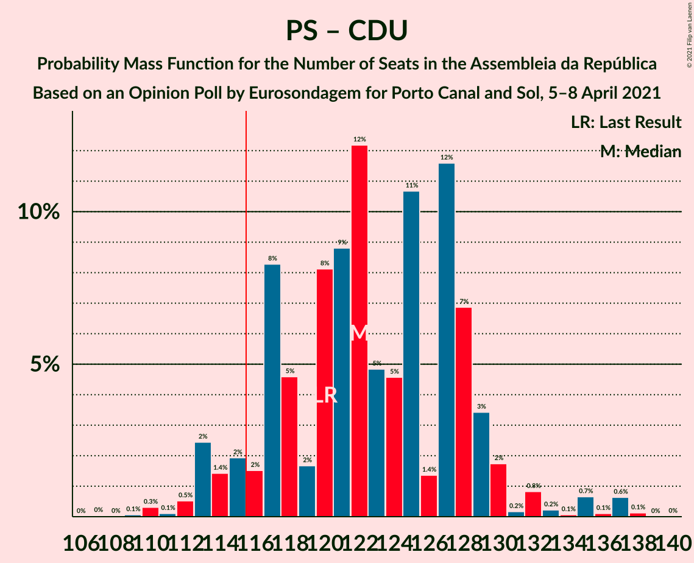

| Number of Seats | Probability | Accumulated | Special Marks |
|:---------------:|:-----------:|:-----------:|:-------------:|
| 107 | 0% | 100% |  |
| 108 | 0% | 99.9% |  |
| 109 | 0.1% | 99.9% |  |
| 110 | 0.3% | 99.9% |  |
| 111 | 0.1% | 99.5% |  |
| 112 | 0.5% | 99.4% |  |
| 113 | 2% | 98.9% |  |
| 114 | 1.4% | 96% |  |
| 115 | 2% | 95% |  |
| 116 | 2% | 93% | Majority |
| 117 | 8% | 92% |  |
| 118 | 5% | 83% |  |
| 119 | 2% | 79% |  |
| 120 | 8% | 77% | Last Result |
| 121 | 9% | 69% |  |
| 122 | 12% | 60% |  |
| 123 | 5% | 48% | Median |
| 124 | 5% | 43% |  |
| 125 | 11% | 39% |  |
| 126 | 1.4% | 28% |  |
| 127 | 12% | 26% |  |
| 128 | 7% | 15% |  |
| 129 | 3% | 8% |  |
| 130 | 2% | 5% |  |
| 131 | 0.2% | 3% |  |
| 132 | 0.8% | 3% |  |
| 133 | 0.2% | 2% |  |
| 134 | 0.1% | 2% |  |
| 135 | 0.7% | 2% |  |
| 136 | 0.1% | 0.9% |  |
| 137 | 0.6% | 0.8% |  |
| 138 | 0.1% | 0.2% |  |
| 139 | 0% | 0% |  |

### Partido Socialista

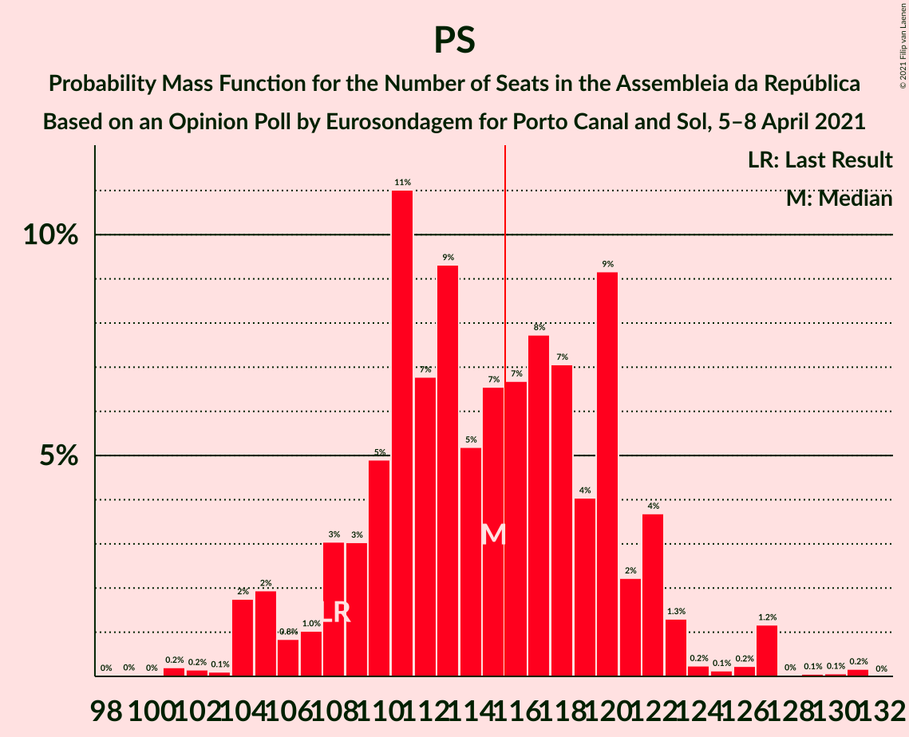

| Number of Seats | Probability | Accumulated | Special Marks |
|:---------------:|:-----------:|:-----------:|:-------------:|
| 99 | 0% | 100% |  |
| 100 | 0% | 99.9% |  |
| 101 | 0.2% | 99.9% |  |
| 102 | 0.2% | 99.7% |  |
| 103 | 0.1% | 99.5% |  |
| 104 | 2% | 99.4% |  |
| 105 | 2% | 98% |  |
| 106 | 0.8% | 96% |  |
| 107 | 1.0% | 95% |  |
| 108 | 3% | 94% | Last Result |
| 109 | 3% | 91% |  |
| 110 | 5% | 88% |  |
| 111 | 11% | 83% |  |
| 112 | 7% | 72% |  |
| 113 | 9% | 65% |  |
| 114 | 5% | 56% |  |
| 115 | 7% | 51% | Median |
| 116 | 7% | 44% | Majority |
| 117 | 8% | 37% |  |
| 118 | 7% | 30% |  |
| 119 | 4% | 23% |  |
| 120 | 9% | 19% |  |
| 121 | 2% | 9% |  |
| 122 | 4% | 7% |  |
| 123 | 1.3% | 3% |  |
| 124 | 0.2% | 2% |  |
| 125 | 0.1% | 2% |  |
| 126 | 0.2% | 2% |  |
| 127 | 1.2% | 2% |  |
| 128 | 0% | 0.4% |  |
| 129 | 0.1% | 0.3% |  |
| 130 | 0.1% | 0.3% |  |
| 131 | 0.2% | 0.2% |  |
| 132 | 0% | 0% |  |

### Partido Social Democrata – CDS–Partido Popular

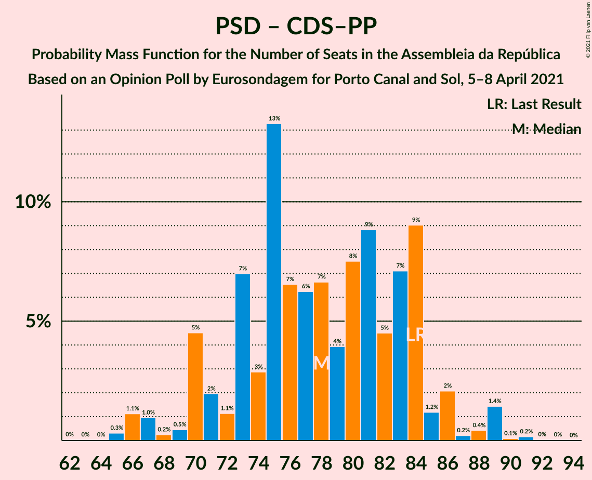

| Number of Seats | Probability | Accumulated | Special Marks |
|:---------------:|:-----------:|:-----------:|:-------------:|
| 63 | 0% | 100% |  |
| 64 | 0% | 99.9% |  |
| 65 | 0.3% | 99.9% |  |
| 66 | 1.1% | 99.6% |  |
| 67 | 1.0% | 98% |  |
| 68 | 0.2% | 97% |  |
| 69 | 0.5% | 97% |  |
| 70 | 5% | 97% |  |
| 71 | 2% | 92% |  |
| 72 | 1.1% | 90% |  |
| 73 | 7% | 89% |  |
| 74 | 3% | 82% |  |
| 75 | 13% | 79% |  |
| 76 | 7% | 66% |  |
| 77 | 6% | 60% |  |
| 78 | 7% | 53% |  |
| 79 | 4% | 47% | Median |
| 80 | 8% | 43% |  |
| 81 | 9% | 35% |  |
| 82 | 5% | 26% |  |
| 83 | 7% | 22% |  |
| 84 | 9% | 15% | Last Result |
| 85 | 1.2% | 6% |  |
| 86 | 2% | 5% |  |
| 87 | 0.2% | 2% |  |
| 88 | 0.4% | 2% |  |
| 89 | 1.4% | 2% |  |
| 90 | 0.1% | 0.4% |  |
| 91 | 0.2% | 0.3% |  |
| 92 | 0% | 0.1% |  |
| 93 | 0% | 0.1% |  |
| 94 | 0% | 0% |  |

## Technical Information

### Opinion Poll

+ **Polling firm:** Eurosondagem
+ **Commissioner(s):** Porto Canal and Sol
+ **Fieldwork period:** 5–8 April 2021

### Calculations

+ **Sample size:** 1020
+ **Simulations done:** 131,072
+ **Error estimate:** 3.70%

