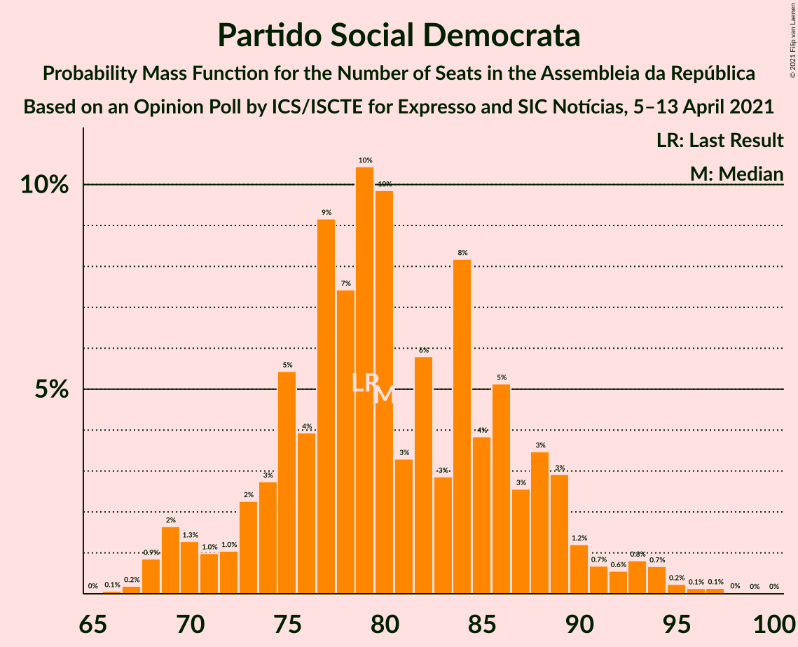
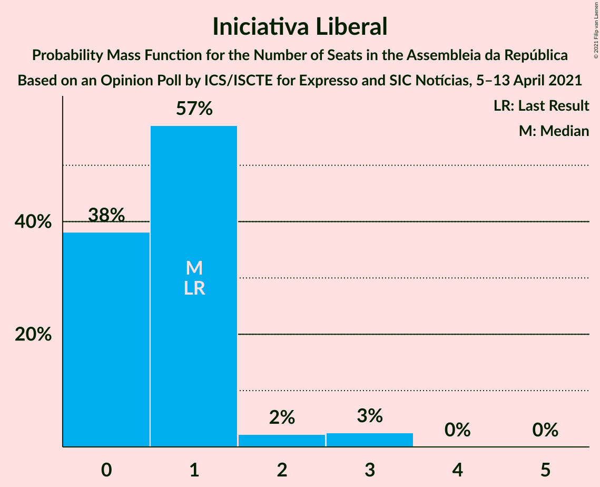
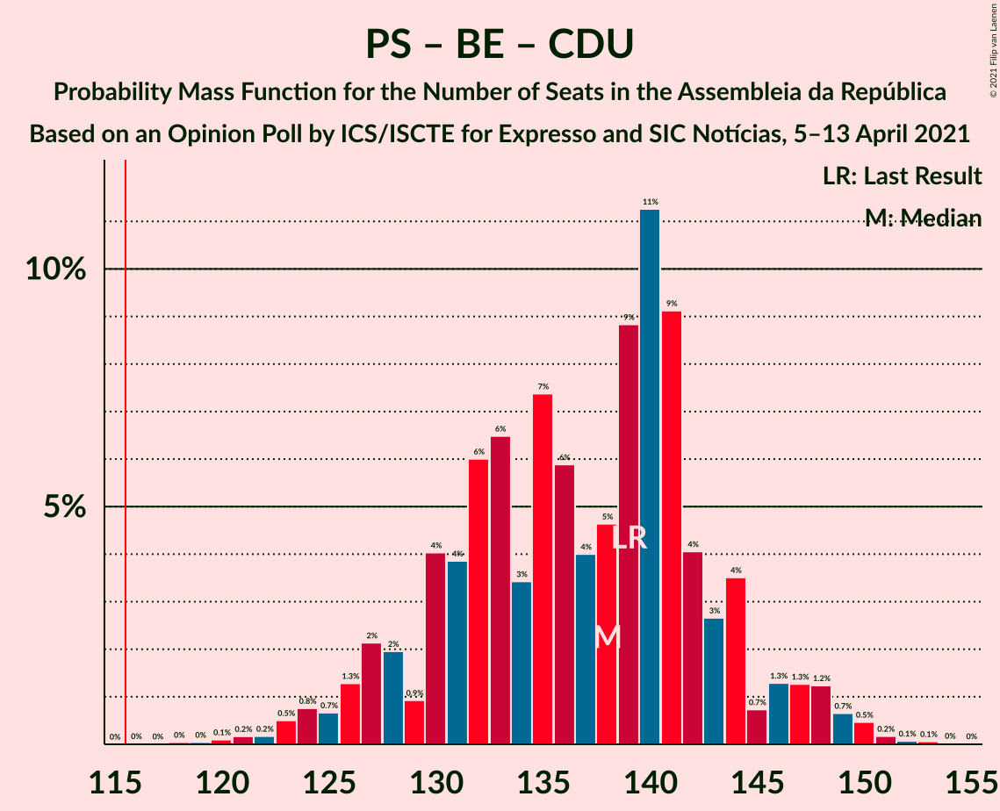
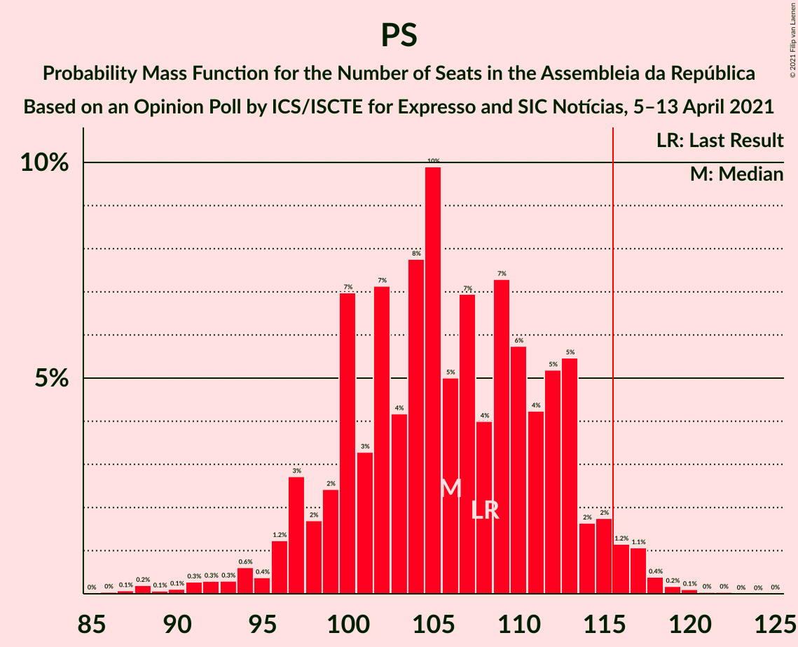

# Opinion Poll by ICS/ISCTE for Expresso and SIC Notícias, 5–13 April 2021

<a href="#voting-intentions">Voting Intentions</a> | <a href="#seats">Seats</a> | <a href="#coalitions">Coalitions</a> | <a href="#technical-information">Technical Information</a>

## Voting Intentions

### Confidence Intervals

| Party | Last Result | Poll Result | 80% Confidence Interval | 90% Confidence Interval | 95% Confidence Interval | 99% Confidence Interval |
|:-----:|:-----------:|:-----------:|:-----------------------:|:-----------------------:|:-----------------------:|:-----------------------:|
| Partido Socialista | 36.4% | 37.0% | 34.9–39.3% |34.3–39.9% |33.7–40.4% |32.7–41.5% |
| Partido Social Democrata | 27.8% | 29.1% | 27.1–31.2% |26.5–31.8% |26.0–32.3% |25.1–33.3% |
| Bloco de Esquerda | 9.5% | 9.0% | 7.8–10.4% |7.5–10.8% |7.2–11.2% |6.7–11.9% |
| Coligação Democrática Unitária | 6.3% | 7.0% | 5.9–8.3% |5.7–8.6% |5.4–9.0% |5.0–9.6% |
| Chega | 1.3% | 6.0% | 5.0–7.2% |4.8–7.5% |4.5–7.8% |4.1–8.5% |
| Pessoas–Animais–Natureza | 3.3% | 2.0% | 1.5–2.8% |1.3–3.0% |1.2–3.2% |1.0–3.6% |
| CDS–Partido Popular | 4.2% | 1.0% | 0.7–1.6% |0.6–1.8% |0.5–2.0% |0.4–2.3% |
| Iniciativa Liberal | 1.3% | 1.0% | 0.7–1.6% |0.6–1.8% |0.5–2.0% |0.4–2.3% |

*Note:* The poll result column reflects the actual value used in the calculations. Published results may vary slightly, and in addition be rounded to fewer digits.

## Seats

### Confidence Intervals

| Party | Last Result | Median | 80% Confidence Interval | 90% Confidence Interval | 95% Confidence Interval | 99% Confidence Interval |
|:-----:|:-----------:|:------:|:-----------------------:|:-----------------------:|:-----------------------:|:-----------------------:|
| <a href="#partido-socialista">Partido Socialista</a> | 108 | 105 | 99–113 |97–114 |95–116 |89–118 |
| <a href="#partido-social-democrata">Partido Social Democrata</a> | 79 | 81 | 74–88 |71–89 |69–91 |68–95 |
| <a href="#bloco-de-esquerda">Bloco de Esquerda</a> | 19 | 18 | 15–21 |14–22 |13–23 |11–25 |
| <a href="#coligação-democrática-unitária">Coligação Democrática Unitária</a> | 12 | 12 | 9–16 |9–17 |8–18 |7–21 |
| <a href="#chega">Chega</a> | 1 | 10 | 7–11 |6–12 |5–13 |4–14 |
| <a href="#pessoas–animais–natureza">Pessoas–Animais–Natureza</a> | 4 | 2 | 1–2 |0–3 |0–3 |0–4 |
| <a href="#cds–partido-popular">CDS–Partido Popular</a> | 5 | 0 | 0 |0–1 |0–1 |0–1 |
| <a href="#iniciativa-liberal">Iniciativa Liberal</a> | 1 | 1 | 0–1 |0–2 |0–2 |0–3 |

### Partido Socialista

*For a full overview of the results for this party, see the [Partido Socialista](party-partidosocialista.html) page.*

| Number of Seats | Probability | Accumulated | Special Marks |
|:---------------:|:-----------:|:-----------:|:-------------:|
| 86 | 0% | 100% |  |
| 87 | 0.1% | 99.9% |  |
| 88 | 0.3% | 99.9% |  |
| 89 | 0.1% | 99.5% |  |
| 90 | 0.1% | 99.4% |  |
| 91 | 0.3% | 99.4% |  |
| 92 | 0.3% | 99.1% |  |
| 93 | 0.4% | 98.7% |  |
| 94 | 0.8% | 98% |  |
| 95 | 0.4% | 98% |  |
| 96 | 1.1% | 97% |  |
| 97 | 4% | 96% |  |
| 98 | 2% | 92% |  |
| 99 | 3% | 90% |  |
| 100 | 9% | 88% |  |
| 101 | 3% | 79% |  |
| 102 | 9% | 76% |  |
| 103 | 5% | 67% |  |
| 104 | 8% | 62% |  |
| 105 | 7% | 54% | Median |
| 106 | 5% | 47% |  |
| 107 | 7% | 42% |  |
| 108 | 4% | 35% | Last Result |
| 109 | 6% | 31% |  |
| 110 | 6% | 25% |  |
| 111 | 3% | 19% |  |
| 112 | 4% | 16% |  |
| 113 | 6% | 12% |  |
| 114 | 2% | 6% |  |
| 115 | 0.9% | 4% |  |
| 116 | 1.2% | 3% | Majority |
| 117 | 1.2% | 2% |  |
| 118 | 0.4% | 0.8% |  |
| 119 | 0.2% | 0.4% |  |
| 120 | 0.1% | 0.3% |  |
| 121 | 0.1% | 0.1% |  |
| 122 | 0% | 0.1% |  |
| 123 | 0% | 0.1% |  |
| 124 | 0% | 0% |  |

### Partido Social Democrata

*For a full overview of the results for this party, see the [Partido Social Democrata](party-partidosocialdemocrata.html) page.*

| Number of Seats | Probability | Accumulated | Special Marks |
|:---------------:|:-----------:|:-----------:|:-------------:|
| 65 | 0% | 100% |  |
| 66 | 0% | 99.9% |  |
| 67 | 0.2% | 99.9% |  |
| 68 | 0.4% | 99.7% |  |
| 69 | 2% | 99.3% |  |
| 70 | 2% | 97% |  |
| 71 | 1.4% | 95% |  |
| 72 | 0.8% | 94% |  |
| 73 | 3% | 93% |  |
| 74 | 3% | 91% |  |
| 75 | 7% | 88% |  |
| 76 | 3% | 81% |  |
| 77 | 7% | 77% |  |
| 78 | 9% | 70% |  |
| 79 | 6% | 61% | Last Result |
| 80 | 4% | 55% |  |
| 81 | 3% | 50% | Median |
| 82 | 4% | 48% |  |
| 83 | 3% | 43% |  |
| 84 | 11% | 40% |  |
| 85 | 5% | 29% |  |
| 86 | 8% | 24% |  |
| 87 | 3% | 16% |  |
| 88 | 5% | 13% |  |
| 89 | 3% | 8% |  |
| 90 | 2% | 5% |  |
| 91 | 0.5% | 3% |  |
| 92 | 0.8% | 2% |  |
| 93 | 0.5% | 2% |  |
| 94 | 0.5% | 1.0% |  |
| 95 | 0.2% | 0.6% |  |
| 96 | 0.1% | 0.3% |  |
| 97 | 0.1% | 0.2% |  |
| 98 | 0% | 0.1% |  |
| 99 | 0% | 0.1% |  |
| 100 | 0% | 0.1% |  |
| 101 | 0% | 0% |  |

### Bloco de Esquerda

*For a full overview of the results for this party, see the [Bloco de Esquerda](party-blocodeesquerda.html) page.*

| Number of Seats | Probability | Accumulated | Special Marks |
|:---------------:|:-----------:|:-----------:|:-------------:|
| 9 | 0.1% | 100% |  |
| 10 | 0.1% | 99.9% |  |
| 11 | 0.7% | 99.9% |  |
| 12 | 1.4% | 99.2% |  |
| 13 | 0.6% | 98% |  |
| 14 | 5% | 97% |  |
| 15 | 4% | 92% |  |
| 16 | 23% | 88% |  |
| 17 | 8% | 65% |  |
| 18 | 12% | 57% | Median |
| 19 | 21% | 46% | Last Result |
| 20 | 13% | 25% |  |
| 21 | 4% | 11% |  |
| 22 | 3% | 7% |  |
| 23 | 2% | 3% |  |
| 24 | 0.7% | 1.3% |  |
| 25 | 0.2% | 0.5% |  |
| 26 | 0.3% | 0.4% |  |
| 27 | 0.1% | 0.1% |  |
| 28 | 0% | 0.1% |  |
| 29 | 0% | 0% |  |

### Coligação Democrática Unitária

*For a full overview of the results for this party, see the [Coligação Democrática Unitária](party-coligaçãodemocráticaunitária.html) page.*

| Number of Seats | Probability | Accumulated | Special Marks |
|:---------------:|:-----------:|:-----------:|:-------------:|
| 6 | 0.1% | 100% |  |
| 7 | 2% | 99.9% |  |
| 8 | 2% | 98% |  |
| 9 | 8% | 96% |  |
| 10 | 6% | 89% |  |
| 11 | 12% | 82% |  |
| 12 | 26% | 70% | Last Result, Median |
| 13 | 7% | 44% |  |
| 14 | 10% | 37% |  |
| 15 | 4% | 28% |  |
| 16 | 15% | 23% |  |
| 17 | 4% | 8% |  |
| 18 | 2% | 4% |  |
| 19 | 0.9% | 2% |  |
| 20 | 0.2% | 0.7% |  |
| 21 | 0.4% | 0.5% |  |
| 22 | 0.1% | 0.2% |  |
| 23 | 0% | 0% |  |

### Chega

*For a full overview of the results for this party, see the [Chega](party-chega.html) page.*

| Number of Seats | Probability | Accumulated | Special Marks |
|:---------------:|:-----------:|:-----------:|:-------------:|
| 1 | 0% | 100% | Last Result |
| 2 | 0% | 100% |  |
| 3 | 0% | 100% |  |
| 4 | 2% | 100% |  |
| 5 | 1.5% | 98% |  |
| 6 | 1.4% | 96% |  |
| 7 | 7% | 95% |  |
| 8 | 19% | 88% |  |
| 9 | 7% | 69% |  |
| 10 | 18% | 62% | Median |
| 11 | 35% | 44% |  |
| 12 | 6% | 9% |  |
| 13 | 2% | 3% |  |
| 14 | 1.4% | 2% |  |
| 15 | 0.2% | 0.4% |  |
| 16 | 0.1% | 0.2% |  |
| 17 | 0% | 0.1% |  |
| 18 | 0% | 0% |  |

### Pessoas–Animais–Natureza

*For a full overview of the results for this party, see the [Pessoas–Animais–Natureza](party-pessoas–animais–natureza.html) page.*

| Number of Seats | Probability | Accumulated | Special Marks |
|:---------------:|:-----------:|:-----------:|:-------------:|
| 0 | 6% | 100% |  |
| 1 | 41% | 94% |  |
| 2 | 43% | 53% | Median |
| 3 | 9% | 10% |  |
| 4 | 1.2% | 1.4% | Last Result |
| 5 | 0.1% | 0.1% |  |
| 6 | 0% | 0% |  |

### CDS–Partido Popular

*For a full overview of the results for this party, see the [CDS–Partido Popular](party-cds–partidopopular.html) page.*

| Number of Seats | Probability | Accumulated | Special Marks |
|:---------------:|:-----------:|:-----------:|:-------------:|
| 0 | 91% | 100% | Median |
| 1 | 9% | 9% |  |
| 2 | 0% | 0% |  |
| 3 | 0% | 0% |  |
| 4 | 0% | 0% |  |
| 5 | 0% | 0% | Last Result |

### Iniciativa Liberal

*For a full overview of the results for this party, see the [Iniciativa Liberal](party-iniciativaliberal.html) page.*

| Number of Seats | Probability | Accumulated | Special Marks |
|:---------------:|:-----------:|:-----------:|:-------------:|
| 0 | 39% | 100% |  |
| 1 | 55% | 61% | Last Result, Median |
| 2 | 3% | 5% |  |
| 3 | 2% | 2% |  |
| 4 | 0% | 0% |  |

## Coalitions

### Confidence Intervals

| Coalition | Last Result | Median | Majority? | 80% Confidence Interval | 90% Confidence Interval | 95% Confidence Interval | 99% Confidence Interval |
|:---------:|:-----------:|:------:|:---------:|:-----------------------:|:-----------------------:|:-----------------------:|:-----------------------:|
| Partido Socialista – Bloco de Esquerda – Coligação Democrática Unitária | 139 | 136 | 100% | 130–144 | 127–146 | 126–148 | 122–150 |
| Partido Socialista – Bloco de Esquerda | 127 | 124 | 94% | 116–131 | 115–133 | 112–134 | 108–138 |
| Partido Socialista – Coligação Democrática Unitária | 120 | 118 | 64% | 112–126 | 110–128 | 108–129 | 104–131 |
| Partido Socialista | 108 | 105 | 3% | 99–113 | 97–114 | 95–116 | 89–118 |
| Partido Social Democrata – CDS–Partido Popular | 84 | 81 | 0% | 74–88 | 71–89 | 69–91 | 68–95 |

### Partido Socialista – Bloco de Esquerda – Coligação Democrática Unitária

| Number of Seats | Probability | Accumulated | Special Marks |
|:---------------:|:-----------:|:-----------:|:-------------:|
| 118 | 0% | 100% |  |
| 119 | 0% | 99.9% |  |
| 120 | 0.1% | 99.9% |  |
| 121 | 0.2% | 99.8% |  |
| 122 | 0.2% | 99.6% |  |
| 123 | 0.5% | 99.4% |  |
| 124 | 0.5% | 99.0% |  |
| 125 | 0.7% | 98% |  |
| 126 | 0.6% | 98% |  |
| 127 | 4% | 97% |  |
| 128 | 3% | 93% |  |
| 129 | 0.5% | 91% |  |
| 130 | 6% | 90% |  |
| 131 | 5% | 84% |  |
| 132 | 11% | 79% |  |
| 133 | 10% | 68% |  |
| 134 | 3% | 57% |  |
| 135 | 3% | 55% | Median |
| 136 | 3% | 52% |  |
| 137 | 4% | 49% |  |
| 138 | 8% | 45% |  |
| 139 | 5% | 37% | Last Result |
| 140 | 9% | 32% |  |
| 141 | 5% | 23% |  |
| 142 | 6% | 19% |  |
| 143 | 3% | 13% |  |
| 144 | 3% | 10% |  |
| 145 | 0.9% | 7% |  |
| 146 | 2% | 6% |  |
| 147 | 2% | 5% |  |
| 148 | 2% | 3% |  |
| 149 | 0.4% | 1.0% |  |
| 150 | 0.2% | 0.5% |  |
| 151 | 0.1% | 0.3% |  |
| 152 | 0.1% | 0.2% |  |
| 153 | 0% | 0.1% |  |
| 154 | 0% | 0.1% |  |
| 155 | 0% | 0% |  |

### Partido Socialista – Bloco de Esquerda

| Number of Seats | Probability | Accumulated | Special Marks |
|:---------------:|:-----------:|:-----------:|:-------------:|
| 104 | 0% | 100% |  |
| 105 | 0% | 99.9% |  |
| 106 | 0.1% | 99.9% |  |
| 107 | 0.2% | 99.8% |  |
| 108 | 0.2% | 99.6% |  |
| 109 | 0.4% | 99.4% |  |
| 110 | 0.5% | 99.0% |  |
| 111 | 0.5% | 98.6% |  |
| 112 | 0.7% | 98% |  |
| 113 | 0.5% | 97% |  |
| 114 | 0.5% | 97% |  |
| 115 | 2% | 96% |  |
| 116 | 5% | 94% | Majority |
| 117 | 4% | 90% |  |
| 118 | 10% | 86% |  |
| 119 | 2% | 76% |  |
| 120 | 8% | 73% |  |
| 121 | 6% | 65% |  |
| 122 | 4% | 59% |  |
| 123 | 5% | 55% | Median |
| 124 | 8% | 50% |  |
| 125 | 6% | 42% |  |
| 126 | 9% | 36% |  |
| 127 | 5% | 27% | Last Result |
| 128 | 4% | 22% |  |
| 129 | 4% | 18% |  |
| 130 | 2% | 14% |  |
| 131 | 3% | 12% |  |
| 132 | 3% | 9% |  |
| 133 | 2% | 6% |  |
| 134 | 1.4% | 4% |  |
| 135 | 0.7% | 2% |  |
| 136 | 0.9% | 2% |  |
| 137 | 0.3% | 0.8% |  |
| 138 | 0.4% | 0.5% |  |
| 139 | 0% | 0.1% |  |
| 140 | 0% | 0.1% |  |
| 141 | 0% | 0.1% |  |
| 142 | 0% | 0% |  |

### Partido Socialista – Coligação Democrática Unitária

| Number of Seats | Probability | Accumulated | Special Marks |
|:---------------:|:-----------:|:-----------:|:-------------:|
| 100 | 0% | 100% |  |
| 101 | 0% | 99.9% |  |
| 102 | 0.2% | 99.9% |  |
| 103 | 0.1% | 99.7% |  |
| 104 | 0.5% | 99.6% |  |
| 105 | 0.3% | 99.0% |  |
| 106 | 0.5% | 98.7% |  |
| 107 | 0.3% | 98% |  |
| 108 | 1.4% | 98% |  |
| 109 | 1.4% | 96% |  |
| 110 | 2% | 95% |  |
| 111 | 1.3% | 93% |  |
| 112 | 7% | 92% |  |
| 113 | 10% | 84% |  |
| 114 | 9% | 75% |  |
| 115 | 2% | 66% |  |
| 116 | 4% | 64% | Majority |
| 117 | 8% | 61% | Median |
| 118 | 5% | 53% |  |
| 119 | 5% | 48% |  |
| 120 | 8% | 43% | Last Result |
| 121 | 6% | 36% |  |
| 122 | 6% | 30% |  |
| 123 | 6% | 24% |  |
| 124 | 3% | 18% |  |
| 125 | 3% | 15% |  |
| 126 | 3% | 12% |  |
| 127 | 3% | 9% |  |
| 128 | 4% | 7% |  |
| 129 | 1.2% | 3% |  |
| 130 | 0.7% | 1.3% |  |
| 131 | 0.2% | 0.6% |  |
| 132 | 0.1% | 0.5% |  |
| 133 | 0.1% | 0.4% |  |
| 134 | 0.1% | 0.2% |  |
| 135 | 0.1% | 0.2% |  |
| 136 | 0.1% | 0.1% |  |
| 137 | 0% | 0% |  |

### Partido Socialista

| Number of Seats | Probability | Accumulated | Special Marks |
|:---------------:|:-----------:|:-----------:|:-------------:|
| 86 | 0% | 100% |  |
| 87 | 0.1% | 99.9% |  |
| 88 | 0.3% | 99.9% |  |
| 89 | 0.1% | 99.5% |  |
| 90 | 0.1% | 99.4% |  |
| 91 | 0.3% | 99.4% |  |
| 92 | 0.3% | 99.1% |  |
| 93 | 0.4% | 98.7% |  |
| 94 | 0.8% | 98% |  |
| 95 | 0.4% | 98% |  |
| 96 | 1.1% | 97% |  |
| 97 | 4% | 96% |  |
| 98 | 2% | 92% |  |
| 99 | 3% | 90% |  |
| 100 | 9% | 88% |  |
| 101 | 3% | 79% |  |
| 102 | 9% | 76% |  |
| 103 | 5% | 67% |  |
| 104 | 8% | 62% |  |
| 105 | 7% | 54% | Median |
| 106 | 5% | 47% |  |
| 107 | 7% | 42% |  |
| 108 | 4% | 35% | Last Result |
| 109 | 6% | 31% |  |
| 110 | 6% | 25% |  |
| 111 | 3% | 19% |  |
| 112 | 4% | 16% |  |
| 113 | 6% | 12% |  |
| 114 | 2% | 6% |  |
| 115 | 0.9% | 4% |  |
| 116 | 1.2% | 3% | Majority |
| 117 | 1.2% | 2% |  |
| 118 | 0.4% | 0.8% |  |
| 119 | 0.2% | 0.4% |  |
| 120 | 0.1% | 0.3% |  |
| 121 | 0.1% | 0.1% |  |
| 122 | 0% | 0.1% |  |
| 123 | 0% | 0.1% |  |
| 124 | 0% | 0% |  |

### Partido Social Democrata – CDS–Partido Popular

| Number of Seats | Probability | Accumulated | Special Marks |
|:---------------:|:-----------:|:-----------:|:-------------:|
| 65 | 0% | 100% |  |
| 66 | 0% | 99.9% |  |
| 67 | 0.1% | 99.9% |  |
| 68 | 0.3% | 99.8% |  |
| 69 | 2% | 99.4% |  |
| 70 | 2% | 97% |  |
| 71 | 1.5% | 96% |  |
| 72 | 0.8% | 94% |  |
| 73 | 3% | 93% |  |
| 74 | 3% | 91% |  |
| 75 | 7% | 88% |  |
| 76 | 3% | 81% |  |
| 77 | 6% | 78% |  |
| 78 | 9% | 71% |  |
| 79 | 6% | 62% |  |
| 80 | 4% | 56% |  |
| 81 | 4% | 52% | Median |
| 82 | 4% | 48% |  |
| 83 | 3% | 44% |  |
| 84 | 11% | 41% | Last Result |
| 85 | 5% | 30% |  |
| 86 | 9% | 25% |  |
| 87 | 3% | 16% |  |
| 88 | 5% | 13% |  |
| 89 | 3% | 8% |  |
| 90 | 2% | 5% |  |
| 91 | 0.5% | 3% |  |
| 92 | 0.8% | 2% |  |
| 93 | 0.5% | 2% |  |
| 94 | 0.4% | 1.1% |  |
| 95 | 0.3% | 0.7% |  |
| 96 | 0.2% | 0.3% |  |
| 97 | 0.1% | 0.2% |  |
| 98 | 0% | 0.1% |  |
| 99 | 0% | 0.1% |  |
| 100 | 0% | 0.1% |  |
| 101 | 0% | 0% |  |

## Technical Information

### Opinion Poll

+ **Polling firm:** ICS/ISCTE
+ **Commissioner(s):** Expresso and SIC Notícias
+ **Fieldwork period:** 5–13 April 2021

### Calculations

+ **Sample size:** 802
+ **Simulations done:** 524,288
+ **Error estimate:** 1.31%

