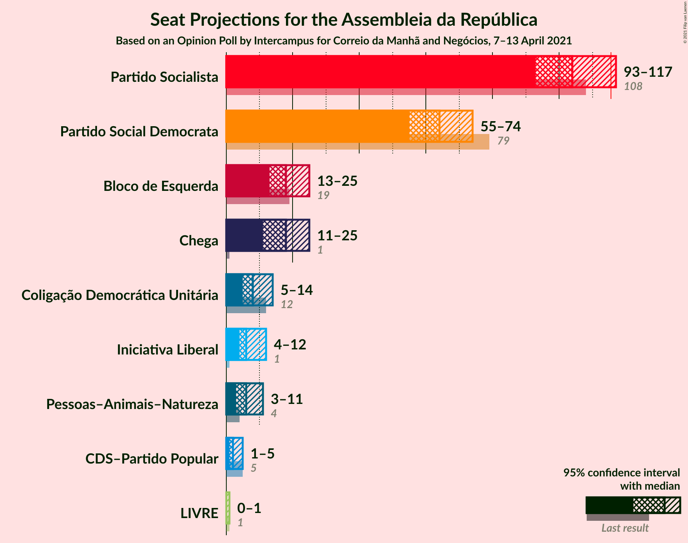
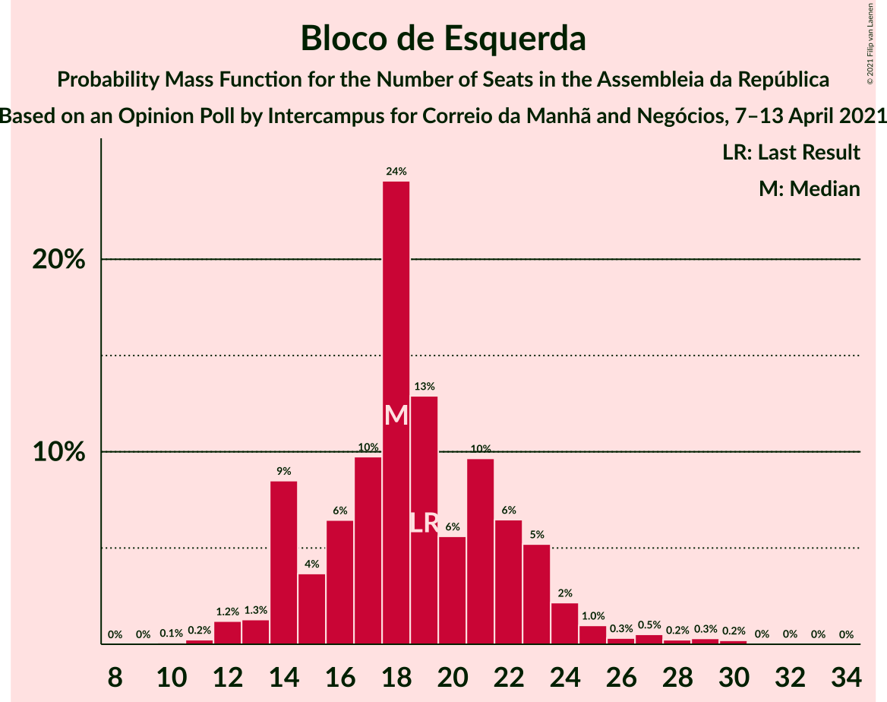
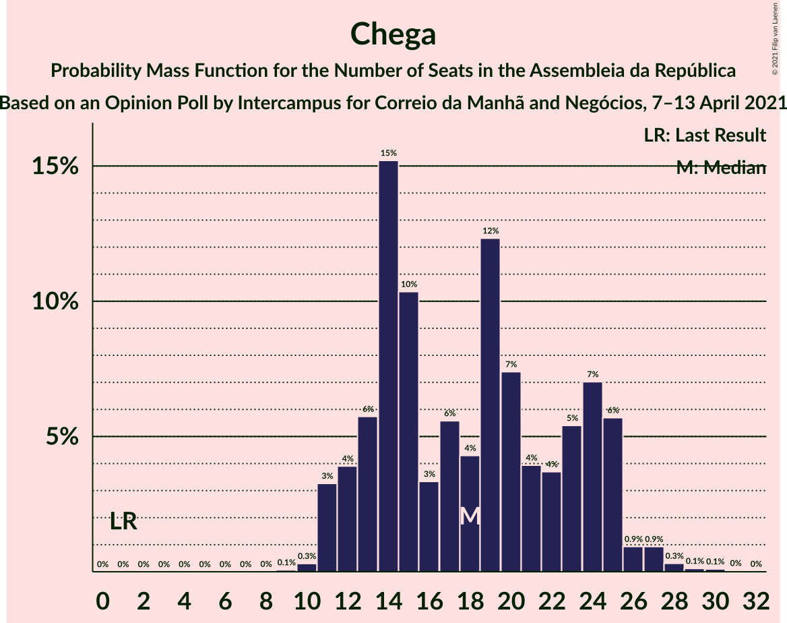
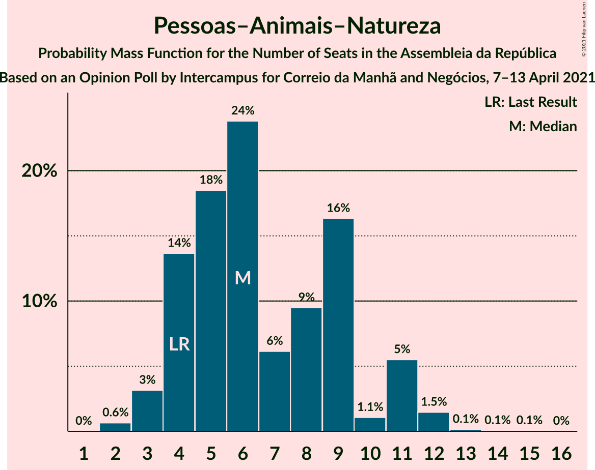
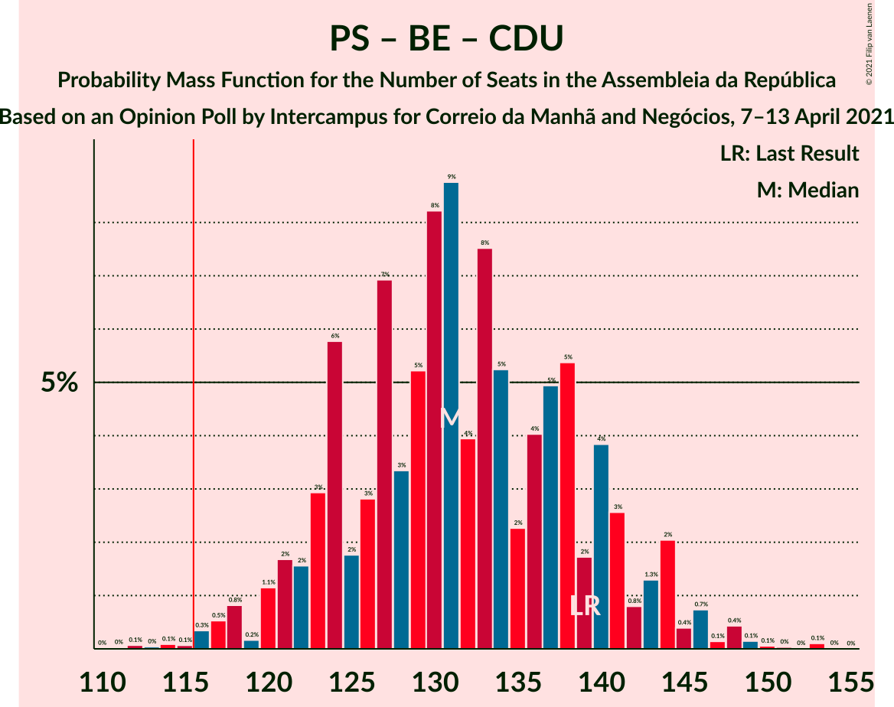
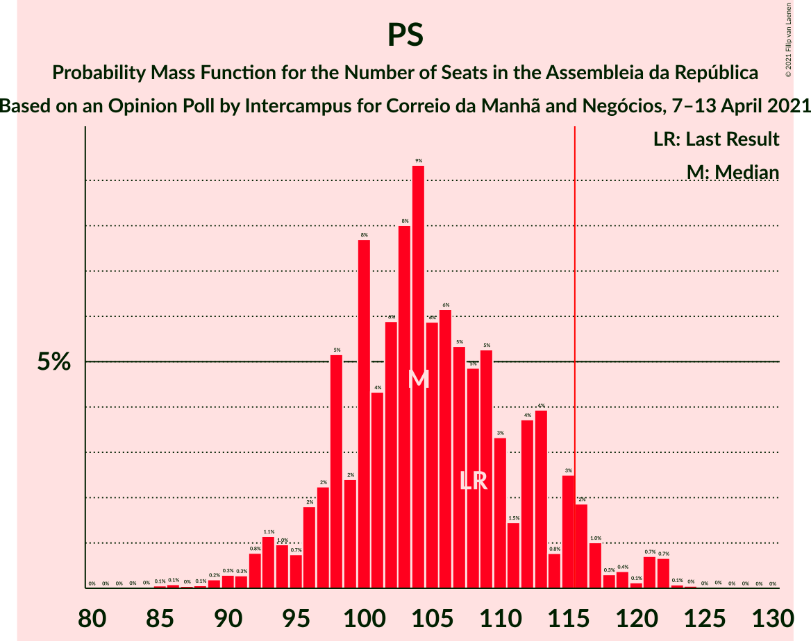

# Opinion Poll by Intercampus for Correio da Manhã and Negócios, 7–13 April 2021

<a href="#voting-intentions">Voting Intentions</a> | <a href="#seats">Seats</a> | <a href="#coalitions">Coalitions</a> | <a href="#technical-information">Technical Information</a>

## Voting Intentions

### Confidence Intervals

| Party | Last Result | Poll Result | 80% Confidence Interval | 90% Confidence Interval | 95% Confidence Interval | 99% Confidence Interval |
|:-----:|:-----------:|:-----------:|:-----------------------:|:-----------------------:|:-----------------------:|:-----------------------:|
| Partido Socialista | 36.4% | 36.1% | 33.7–38.7% |33.0–39.4% |32.4–40.0% |31.2–41.3% |
| Partido Social Democrata | 27.8% | 23.3% | 21.2–25.6% |20.6–26.3% |20.1–26.8% |19.2–28.0% |
| Bloco de Esquerda | 9.5% | 9.4% | 8.0–11.1% |7.6–11.5% |7.3–11.9% |6.7–12.8% |
| Chega | 1.3% | 9.4% | 8.0–11.1% |7.6–11.5% |7.3–11.9% |6.7–12.8% |
| Coligação Democrática Unitária | 6.3% | 5.3% | 4.3–6.6% |4.0–7.0% |3.7–7.3% |3.3–8.0% |
| Iniciativa Liberal | 1.3% | 4.9% | 4.0–6.2% |3.7–6.6% |3.5–7.0% |3.1–7.6% |
| Pessoas–Animais–Natureza | 3.3% | 4.8% | 3.8–6.1% |3.6–6.4% |3.3–6.8% |2.9–7.4% |
| CDS–Partido Popular | 4.2% | 3.1% | 2.4–4.2% |2.2–4.5% |2.0–4.8% |1.7–5.4% |
| LIVRE | 1.1% | 0.3% | 0.2–0.9% |0.1–1.0% |0.1–1.2% |0.0–1.5% |

*Note:* The poll result column reflects the actual value used in the calculations. Published results may vary slightly, and in addition be rounded to fewer digits.

## Seats

### Confidence Intervals

| Party | Last Result | Median | 80% Confidence Interval | 90% Confidence Interval | 95% Confidence Interval | 99% Confidence Interval |
|:-----:|:-----------:|:------:|:-----------------------:|:-----------------------:|:-----------------------:|:-----------------------:|
| <a href="#partido-socialista">Partido Socialista</a> | 108 | 106 | 99–113 |96–113 |94–117 |90–119 |
| <a href="#partido-social-democrata">Partido Social Democrata</a> | 79 | 63 | 56–70 |56–71 |54–72 |52–77 |
| <a href="#bloco-de-esquerda">Bloco de Esquerda</a> | 19 | 18 | 15–21 |14–23 |14–24 |12–28 |
| <a href="#chega">Chega</a> | 1 | 16 | 13–24 |12–25 |12–25 |10–28 |
| <a href="#coligação-democrática-unitária">Coligação Democrática Unitária</a> | 12 | 7 | 5–12 |5–13 |4–14 |3–15 |
| <a href="#iniciativa-liberal">Iniciativa Liberal</a> | 1 | 6 | 5–11 |5–11 |4–12 |4–14 |
| <a href="#pessoas–animais–natureza">Pessoas–Animais–Natureza</a> | 4 | 6 | 4–9 |4–11 |4–11 |3–12 |
| <a href="#cds–partido-popular">CDS–Partido Popular</a> | 5 | 2 | 1–5 |1–5 |1–5 |0–5 |
| <a href="#livre">LIVRE</a> | 1 | 0 | 0 |0–1 |0–1 |0–1 |

### Partido Socialista

*For a full overview of the results for this party, see the [Partido Socialista](party-partidosocialista.html) page.*

| Number of Seats | Probability | Accumulated | Special Marks |
|:---------------:|:-----------:|:-----------:|:-------------:|
| 85 | 0.1% | 100% |  |
| 86 | 0% | 99.8% |  |
| 87 | 0% | 99.8% |  |
| 88 | 0.1% | 99.8% |  |
| 89 | 0.1% | 99.7% |  |
| 90 | 0.7% | 99.6% |  |
| 91 | 0.1% | 99.0% |  |
| 92 | 0.3% | 98.8% |  |
| 93 | 0.2% | 98.6% |  |
| 94 | 3% | 98% |  |
| 95 | 0.3% | 96% |  |
| 96 | 1.0% | 95% |  |
| 97 | 0.8% | 94% |  |
| 98 | 1.0% | 94% |  |
| 99 | 4% | 92% |  |
| 100 | 7% | 89% |  |
| 101 | 5% | 82% |  |
| 102 | 2% | 77% |  |
| 103 | 1.5% | 75% |  |
| 104 | 19% | 74% |  |
| 105 | 4% | 54% |  |
| 106 | 7% | 51% | Median |
| 107 | 5% | 44% |  |
| 108 | 3% | 39% | Last Result |
| 109 | 1.3% | 36% |  |
| 110 | 2% | 35% |  |
| 111 | 0.4% | 33% |  |
| 112 | 20% | 33% |  |
| 113 | 9% | 13% |  |
| 114 | 0.8% | 4% |  |
| 115 | 0.6% | 3% |  |
| 116 | 0.1% | 3% | Majority |
| 117 | 1.4% | 3% |  |
| 118 | 0.1% | 1.3% |  |
| 119 | 0.8% | 1.2% |  |
| 120 | 0.2% | 0.4% |  |
| 121 | 0% | 0.2% |  |
| 122 | 0% | 0.2% |  |
| 123 | 0.1% | 0.2% |  |
| 124 | 0.1% | 0.1% |  |
| 125 | 0% | 0.1% |  |
| 126 | 0% | 0% |  |

### Partido Social Democrata

*For a full overview of the results for this party, see the [Partido Social Democrata](party-partidosocialdemocrata.html) page.*

| Number of Seats | Probability | Accumulated | Special Marks |
|:---------------:|:-----------:|:-----------:|:-------------:|
| 47 | 0% | 100% |  |
| 48 | 0.1% | 99.9% |  |
| 49 | 0.1% | 99.9% |  |
| 50 | 0% | 99.8% |  |
| 51 | 0% | 99.7% |  |
| 52 | 1.4% | 99.7% |  |
| 53 | 0.6% | 98% |  |
| 54 | 0.3% | 98% |  |
| 55 | 0.3% | 97% |  |
| 56 | 9% | 97% |  |
| 57 | 0.7% | 88% |  |
| 58 | 1.1% | 87% |  |
| 59 | 3% | 86% |  |
| 60 | 5% | 83% |  |
| 61 | 4% | 78% |  |
| 62 | 4% | 74% |  |
| 63 | 24% | 70% | Median |
| 64 | 2% | 46% |  |
| 65 | 2% | 44% |  |
| 66 | 7% | 42% |  |
| 67 | 20% | 35% |  |
| 68 | 2% | 15% |  |
| 69 | 1.1% | 12% |  |
| 70 | 5% | 11% |  |
| 71 | 2% | 6% |  |
| 72 | 3% | 5% |  |
| 73 | 0.9% | 2% |  |
| 74 | 0.1% | 1.3% |  |
| 75 | 0.2% | 1.2% |  |
| 76 | 0.1% | 1.0% |  |
| 77 | 0.5% | 1.0% |  |
| 78 | 0.1% | 0.5% |  |
| 79 | 0.3% | 0.4% | Last Result |
| 80 | 0.1% | 0.1% |  |
| 81 | 0% | 0.1% |  |
| 82 | 0% | 0.1% |  |
| 83 | 0% | 0% |  |

### Bloco de Esquerda

*For a full overview of the results for this party, see the [Bloco de Esquerda](party-blocodeesquerda.html) page.*

| Number of Seats | Probability | Accumulated | Special Marks |
|:---------------:|:-----------:|:-----------:|:-------------:|
| 8 | 0% | 100% |  |
| 9 | 0% | 99.9% |  |
| 10 | 0% | 99.9% |  |
| 11 | 0.2% | 99.9% |  |
| 12 | 1.1% | 99.8% |  |
| 13 | 0.6% | 98.6% |  |
| 14 | 6% | 98% |  |
| 15 | 2% | 92% |  |
| 16 | 20% | 90% |  |
| 17 | 2% | 69% |  |
| 18 | 35% | 67% | Median |
| 19 | 15% | 32% | Last Result |
| 20 | 3% | 17% |  |
| 21 | 4% | 14% |  |
| 22 | 4% | 10% |  |
| 23 | 3% | 6% |  |
| 24 | 1.2% | 3% |  |
| 25 | 0.7% | 2% |  |
| 26 | 0.5% | 1.2% |  |
| 27 | 0.1% | 0.8% |  |
| 28 | 0.2% | 0.7% |  |
| 29 | 0% | 0.5% |  |
| 30 | 0.3% | 0.4% |  |
| 31 | 0.1% | 0.2% |  |
| 32 | 0.1% | 0.1% |  |
| 33 | 0% | 0% |  |

### Chega

*For a full overview of the results for this party, see the [Chega](party-chega.html) page.*

| Number of Seats | Probability | Accumulated | Special Marks |
|:---------------:|:-----------:|:-----------:|:-------------:|
| 1 | 0% | 100% | Last Result |
| 2 | 0% | 100% |  |
| 3 | 0% | 100% |  |
| 4 | 0% | 100% |  |
| 5 | 0% | 100% |  |
| 6 | 0% | 100% |  |
| 7 | 0% | 100% |  |
| 8 | 0% | 100% |  |
| 9 | 0.1% | 100% |  |
| 10 | 0.4% | 99.9% |  |
| 11 | 1.0% | 99.4% |  |
| 12 | 4% | 98% |  |
| 13 | 8% | 95% |  |
| 14 | 25% | 87% |  |
| 15 | 11% | 62% |  |
| 16 | 3% | 51% | Median |
| 17 | 0.5% | 49% |  |
| 18 | 1.2% | 48% |  |
| 19 | 2% | 47% |  |
| 20 | 5% | 45% |  |
| 21 | 4% | 40% |  |
| 22 | 0.9% | 36% |  |
| 23 | 3% | 36% |  |
| 24 | 26% | 32% |  |
| 25 | 5% | 6% |  |
| 26 | 0.6% | 1.5% |  |
| 27 | 0.3% | 0.9% |  |
| 28 | 0.2% | 0.6% |  |
| 29 | 0.4% | 0.4% |  |
| 30 | 0% | 0.1% |  |
| 31 | 0% | 0% |  |

### Coligação Democrática Unitária

*For a full overview of the results for this party, see the [Coligação Democrática Unitária](party-coligaçãodemocráticaunitária.html) page.*

| Number of Seats | Probability | Accumulated | Special Marks |
|:---------------:|:-----------:|:-----------:|:-------------:|
| 2 | 0.5% | 100% |  |
| 3 | 0.2% | 99.5% |  |
| 4 | 2% | 99.4% |  |
| 5 | 9% | 97% |  |
| 6 | 8% | 88% |  |
| 7 | 43% | 81% | Median |
| 8 | 2% | 38% |  |
| 9 | 13% | 36% |  |
| 10 | 5% | 23% |  |
| 11 | 3% | 18% |  |
| 12 | 7% | 15% | Last Result |
| 13 | 3% | 8% |  |
| 14 | 4% | 5% |  |
| 15 | 0.8% | 1.1% |  |
| 16 | 0.1% | 0.3% |  |
| 17 | 0.1% | 0.3% |  |
| 18 | 0.1% | 0.2% |  |
| 19 | 0% | 0% |  |

### Iniciativa Liberal

*For a full overview of the results for this party, see the [Iniciativa Liberal](party-iniciativaliberal.html) page.*

| Number of Seats | Probability | Accumulated | Special Marks |
|:---------------:|:-----------:|:-----------:|:-------------:|
| 1 | 0% | 100% | Last Result |
| 2 | 0% | 100% |  |
| 3 | 0.4% | 100% |  |
| 4 | 4% | 99.6% |  |
| 5 | 12% | 95% |  |
| 6 | 59% | 83% | Median |
| 7 | 3% | 24% |  |
| 8 | 2% | 21% |  |
| 9 | 4% | 19% |  |
| 10 | 3% | 15% |  |
| 11 | 8% | 13% |  |
| 12 | 4% | 5% |  |
| 13 | 0.2% | 0.8% |  |
| 14 | 0.6% | 0.6% |  |
| 15 | 0% | 0% |  |

### Pessoas–Animais–Natureza

*For a full overview of the results for this party, see the [Pessoas–Animais–Natureza](party-pessoas–animais–natureza.html) page.*

| Number of Seats | Probability | Accumulated | Special Marks |
|:---------------:|:-----------:|:-----------:|:-------------:|
| 2 | 0.5% | 100% |  |
| 3 | 1.5% | 99.5% |  |
| 4 | 10% | 98% | Last Result |
| 5 | 31% | 88% |  |
| 6 | 16% | 58% | Median |
| 7 | 21% | 42% |  |
| 8 | 7% | 21% |  |
| 9 | 6% | 15% |  |
| 10 | 0.4% | 9% |  |
| 11 | 6% | 8% |  |
| 12 | 2% | 2% |  |
| 13 | 0.2% | 0.2% |  |
| 14 | 0% | 0% |  |

### CDS–Partido Popular

*For a full overview of the results for this party, see the [CDS–Partido Popular](party-cds–partidopopular.html) page.*

| Number of Seats | Probability | Accumulated | Special Marks |
|:---------------:|:-----------:|:-----------:|:-------------:|
| 0 | 2% | 100% |  |
| 1 | 31% | 98% |  |
| 2 | 25% | 67% | Median |
| 3 | 30% | 42% |  |
| 4 | 0.9% | 12% |  |
| 5 | 11% | 12% | Last Result |
| 6 | 0.2% | 0.5% |  |
| 7 | 0.2% | 0.3% |  |
| 8 | 0.1% | 0.1% |  |
| 9 | 0% | 0.1% |  |
| 10 | 0% | 0% |  |

### LIVRE

*For a full overview of the results for this party, see the [LIVRE](party-livre.html) page.*

| Number of Seats | Probability | Accumulated | Special Marks |
|:---------------:|:-----------:|:-----------:|:-------------:|
| 0 | 95% | 100% | Median |
| 1 | 5% | 5% | Last Result |
| 2 | 0% | 0% |  |

## Coalitions

### Confidence Intervals

| Coalition | Last Result | Median | Majority? | 80% Confidence Interval | 90% Confidence Interval | 95% Confidence Interval | 99% Confidence Interval |
|:---------:|:-----------:|:------:|:---------:|:-----------------------:|:-----------------------:|:-----------------------:|:-----------------------:|
| Partido Socialista – Bloco de Esquerda – Coligação Democrática Unitária | 139 | 133 | 99.8% | 125–141 | 120–142 | 118–143 | 117–145 |
| Partido Socialista – Bloco de Esquerda | 127 | 125 | 91% | 117–132 | 113–132 | 112–136 | 109–138 |
| Partido Socialista – Coligação Democrática Unitária | 120 | 112 | 44% | 109–122 | 102–122 | 100–124 | 98–127 |
| Partido Socialista | 108 | 106 | 3% | 99–113 | 96–113 | 94–117 | 90–119 |
| Partido Social Democrata – CDS–Partido Popular | 84 | 66 | 0% | 58–72 | 57–74 | 57–75 | 55–81 |

### Partido Socialista – Bloco de Esquerda – Coligação Democrática Unitária

| Number of Seats | Probability | Accumulated | Special Marks |
|:---------------:|:-----------:|:-----------:|:-------------:|
| 112 | 0% | 100% |  |
| 113 | 0.1% | 99.9% |  |
| 114 | 0.1% | 99.9% |  |
| 115 | 0% | 99.8% |  |
| 116 | 0.3% | 99.8% | Majority |
| 117 | 0.8% | 99.5% |  |
| 118 | 3% | 98.7% |  |
| 119 | 0.1% | 96% |  |
| 120 | 0.8% | 96% |  |
| 121 | 0.5% | 95% |  |
| 122 | 0.1% | 95% |  |
| 123 | 0.8% | 94% |  |
| 124 | 0.6% | 94% |  |
| 125 | 6% | 93% |  |
| 126 | 1.0% | 87% |  |
| 127 | 21% | 86% |  |
| 128 | 0.9% | 65% |  |
| 129 | 3% | 64% |  |
| 130 | 6% | 61% |  |
| 131 | 2% | 55% | Median |
| 132 | 3% | 53% |  |
| 133 | 5% | 51% |  |
| 134 | 5% | 46% |  |
| 135 | 1.2% | 41% |  |
| 136 | 3% | 40% |  |
| 137 | 20% | 38% |  |
| 138 | 0.5% | 18% |  |
| 139 | 0.6% | 17% | Last Result |
| 140 | 3% | 16% |  |
| 141 | 8% | 13% |  |
| 142 | 0.8% | 6% |  |
| 143 | 4% | 5% |  |
| 144 | 0.1% | 0.8% |  |
| 145 | 0.3% | 0.7% |  |
| 146 | 0% | 0.4% |  |
| 147 | 0.1% | 0.4% |  |
| 148 | 0.1% | 0.3% |  |
| 149 | 0.1% | 0.2% |  |
| 150 | 0% | 0.2% |  |
| 151 | 0.1% | 0.2% |  |
| 152 | 0% | 0.1% |  |
| 153 | 0% | 0.1% |  |
| 154 | 0.1% | 0.1% |  |
| 155 | 0% | 0% |  |

### Partido Socialista – Bloco de Esquerda

| Number of Seats | Probability | Accumulated | Special Marks |
|:---------------:|:-----------:|:-----------:|:-------------:|
| 104 | 0% | 100% |  |
| 105 | 0.1% | 99.9% |  |
| 106 | 0% | 99.9% |  |
| 107 | 0.1% | 99.8% |  |
| 108 | 0.1% | 99.7% |  |
| 109 | 0.1% | 99.6% |  |
| 110 | 0% | 99.5% |  |
| 111 | 0.6% | 99.4% |  |
| 112 | 3% | 98.8% |  |
| 113 | 2% | 96% |  |
| 114 | 0.3% | 94% |  |
| 115 | 2% | 93% |  |
| 116 | 0.3% | 91% | Majority |
| 117 | 2% | 91% |  |
| 118 | 7% | 89% |  |
| 119 | 2% | 82% |  |
| 120 | 23% | 80% |  |
| 121 | 0.7% | 57% |  |
| 122 | 1.1% | 57% |  |
| 123 | 3% | 55% |  |
| 124 | 2% | 52% | Median |
| 125 | 6% | 50% |  |
| 126 | 4% | 44% |  |
| 127 | 2% | 40% | Last Result |
| 128 | 1.3% | 38% |  |
| 129 | 2% | 37% |  |
| 130 | 21% | 35% |  |
| 131 | 3% | 14% |  |
| 132 | 8% | 11% |  |
| 133 | 0.6% | 4% |  |
| 134 | 0.1% | 3% |  |
| 135 | 0.4% | 3% |  |
| 136 | 0.2% | 3% |  |
| 137 | 1.5% | 2% |  |
| 138 | 0.5% | 0.9% |  |
| 139 | 0.1% | 0.4% |  |
| 140 | 0% | 0.2% |  |
| 141 | 0% | 0.2% |  |
| 142 | 0.1% | 0.2% |  |
| 143 | 0.1% | 0.1% |  |
| 144 | 0% | 0% |  |

### Partido Socialista – Coligação Democrática Unitária

| Number of Seats | Probability | Accumulated | Special Marks |
|:---------------:|:-----------:|:-----------:|:-------------:|
| 93 | 0% | 100% |  |
| 94 | 0% | 99.9% |  |
| 95 | 0% | 99.9% |  |
| 96 | 0% | 99.9% |  |
| 97 | 0.3% | 99.9% |  |
| 98 | 0.3% | 99.6% |  |
| 99 | 0.7% | 99.3% |  |
| 100 | 3% | 98.6% |  |
| 101 | 0.9% | 96% |  |
| 102 | 0.5% | 95% |  |
| 103 | 0.5% | 95% |  |
| 104 | 0.4% | 94% |  |
| 105 | 0.7% | 94% |  |
| 106 | 0.7% | 93% |  |
| 107 | 0.4% | 92% |  |
| 108 | 1.3% | 92% |  |
| 109 | 4% | 90% |  |
| 110 | 5% | 87% |  |
| 111 | 23% | 82% |  |
| 112 | 9% | 58% |  |
| 113 | 2% | 49% | Median |
| 114 | 2% | 47% |  |
| 115 | 0.9% | 45% |  |
| 116 | 4% | 44% | Majority |
| 117 | 0.7% | 40% |  |
| 118 | 2% | 39% |  |
| 119 | 19% | 38% |  |
| 120 | 2% | 19% | Last Result |
| 121 | 4% | 17% |  |
| 122 | 8% | 13% |  |
| 123 | 2% | 4% |  |
| 124 | 1.1% | 3% |  |
| 125 | 0.5% | 1.4% |  |
| 126 | 0.3% | 0.9% |  |
| 127 | 0.1% | 0.6% |  |
| 128 | 0.1% | 0.5% |  |
| 129 | 0.1% | 0.4% |  |
| 130 | 0.1% | 0.4% |  |
| 131 | 0.1% | 0.3% |  |
| 132 | 0% | 0.1% |  |
| 133 | 0% | 0.1% |  |
| 134 | 0.1% | 0.1% |  |
| 135 | 0% | 0% |  |

### Partido Socialista

| Number of Seats | Probability | Accumulated | Special Marks |
|:---------------:|:-----------:|:-----------:|:-------------:|
| 85 | 0.1% | 100% |  |
| 86 | 0% | 99.8% |  |
| 87 | 0% | 99.8% |  |
| 88 | 0.1% | 99.8% |  |
| 89 | 0.1% | 99.7% |  |
| 90 | 0.7% | 99.6% |  |
| 91 | 0.1% | 99.0% |  |
| 92 | 0.3% | 98.8% |  |
| 93 | 0.2% | 98.6% |  |
| 94 | 3% | 98% |  |
| 95 | 0.3% | 96% |  |
| 96 | 1.0% | 95% |  |
| 97 | 0.8% | 94% |  |
| 98 | 1.0% | 94% |  |
| 99 | 4% | 92% |  |
| 100 | 7% | 89% |  |
| 101 | 5% | 82% |  |
| 102 | 2% | 77% |  |
| 103 | 1.5% | 75% |  |
| 104 | 19% | 74% |  |
| 105 | 4% | 54% |  |
| 106 | 7% | 51% | Median |
| 107 | 5% | 44% |  |
| 108 | 3% | 39% | Last Result |
| 109 | 1.3% | 36% |  |
| 110 | 2% | 35% |  |
| 111 | 0.4% | 33% |  |
| 112 | 20% | 33% |  |
| 113 | 9% | 13% |  |
| 114 | 0.8% | 4% |  |
| 115 | 0.6% | 3% |  |
| 116 | 0.1% | 3% | Majority |
| 117 | 1.4% | 3% |  |
| 118 | 0.1% | 1.3% |  |
| 119 | 0.8% | 1.2% |  |
| 120 | 0.2% | 0.4% |  |
| 121 | 0% | 0.2% |  |
| 122 | 0% | 0.2% |  |
| 123 | 0.1% | 0.2% |  |
| 124 | 0.1% | 0.1% |  |
| 125 | 0% | 0.1% |  |
| 126 | 0% | 0% |  |

### Partido Social Democrata – CDS–Partido Popular

| Number of Seats | Probability | Accumulated | Special Marks |
|:---------------:|:-----------:|:-----------:|:-------------:|
| 49 | 0% | 100% |  |
| 50 | 0% | 99.9% |  |
| 51 | 0% | 99.9% |  |
| 52 | 0.1% | 99.9% |  |
| 53 | 0.1% | 99.8% |  |
| 54 | 0.1% | 99.7% |  |
| 55 | 0.9% | 99.6% |  |
| 56 | 0.2% | 98.8% |  |
| 57 | 8% | 98.5% |  |
| 58 | 1.3% | 90% |  |
| 59 | 1.4% | 89% |  |
| 60 | 0.9% | 88% |  |
| 61 | 3% | 87% |  |
| 62 | 4% | 83% |  |
| 63 | 4% | 80% |  |
| 64 | 4% | 76% |  |
| 65 | 8% | 72% | Median |
| 66 | 20% | 64% |  |
| 67 | 2% | 44% |  |
| 68 | 20% | 42% |  |
| 69 | 1.0% | 22% |  |
| 70 | 2% | 21% |  |
| 71 | 5% | 18% |  |
| 72 | 4% | 13% |  |
| 73 | 4% | 9% |  |
| 74 | 0.9% | 6% |  |
| 75 | 3% | 5% |  |
| 76 | 0.1% | 2% |  |
| 77 | 0.6% | 2% |  |
| 78 | 0.2% | 1.1% |  |
| 79 | 0.3% | 1.0% |  |
| 80 | 0.1% | 0.6% |  |
| 81 | 0.2% | 0.5% |  |
| 82 | 0.1% | 0.3% |  |
| 83 | 0% | 0.2% |  |
| 84 | 0.1% | 0.1% | Last Result |
| 85 | 0% | 0.1% |  |
| 86 | 0% | 0% |  |

## Technical Information

### Opinion Poll

+ **Polling firm:** Intercampus
+ **Commissioner(s):** Correio da Manhã and Negócios
+ **Fieldwork period:** 7–13 April 2021

### Calculations

+ **Sample size:** 609
+ **Simulations done:** 131,072
+ **Error estimate:** 3.64%

