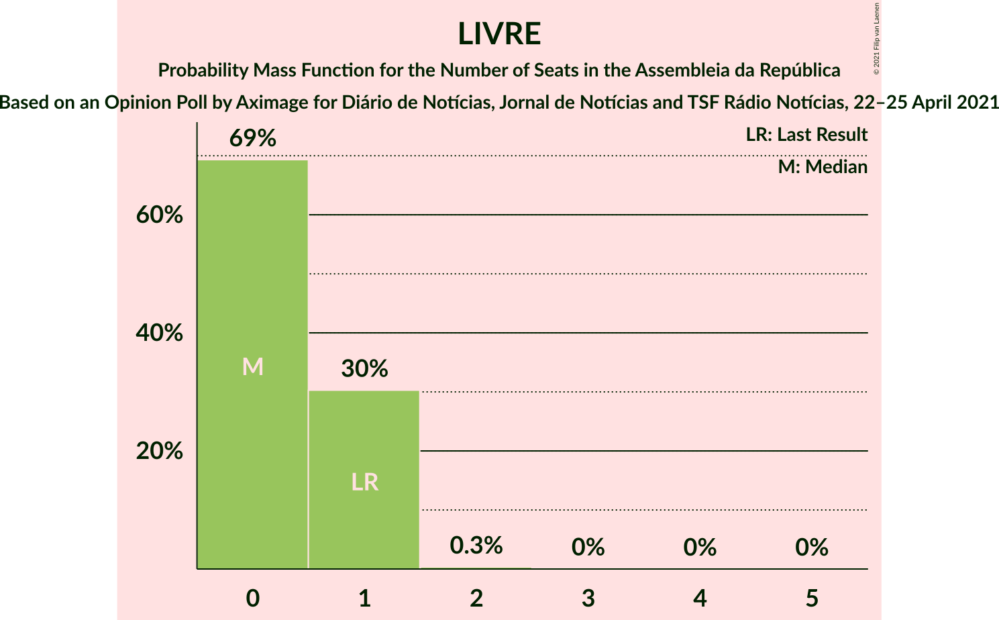
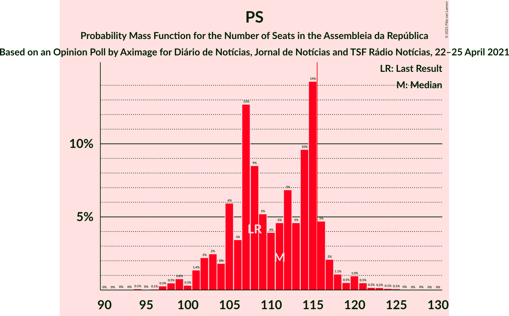
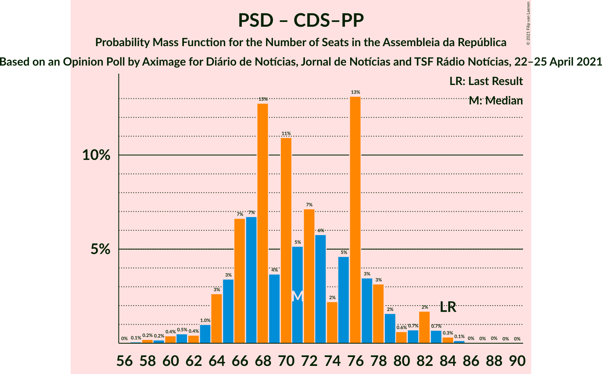

# Opinion Poll by Aximage for Diário de Notícias, Jornal de Notícias and TSF Rádio Notícias, 22–25 April 2021

<a href="#voting-intentions">Voting Intentions</a> | <a href="#seats">Seats</a> | <a href="#coalitions">Coalitions</a> | <a href="#technical-information">Technical Information</a>

## Voting Intentions

### Confidence Intervals

| Party | Last Result | Poll Result | 80% Confidence Interval | 90% Confidence Interval | 95% Confidence Interval | 99% Confidence Interval |
|:-----:|:-----------:|:-----------:|:-----------------------:|:-----------------------:|:-----------------------:|:-----------------------:|
| Partido Socialista | 36.4% | 38.2% | 36.1–40.4% |35.5–41.0% |34.9–41.5% |33.9–42.6% |
| Partido Social Democrata | 27.8% | 26.1% | 24.2–28.2% |23.7–28.7% |23.3–29.2% |22.4–30.2% |
| Bloco de Esquerda | 9.5% | 9.2% | 8.0–10.6% |7.7–11.0% |7.4–11.3% |6.8–12.0% |
| Chega | 1.3% | 7.2% | 6.2–8.5% |5.9–8.9% |5.7–9.2% |5.2–9.9% |
| Coligação Democrática Unitária | 6.3% | 5.7% | 4.8–6.8% |4.5–7.2% |4.3–7.5% |3.9–8.0% |
| Iniciativa Liberal | 1.3% | 4.9% | 4.1–6.1% |3.9–6.4% |3.7–6.6% |3.3–7.2% |
| Pessoas–Animais–Natureza | 3.3% | 2.7% | 2.1–3.5% |1.9–3.8% |1.8–4.0% |1.5–4.5% |
| LIVRE | 1.1% | 0.8% | 0.5–1.4% |0.5–1.6% |0.4–1.7% |0.3–2.1% |
| CDS–Partido Popular | 4.2% | 0.4% | 0.2–0.8% |0.2–0.9% |0.1–1.1% |0.1–1.3% |

*Note:* The poll result column reflects the actual value used in the calculations. Published results may vary slightly, and in addition be rounded to fewer digits.

## Seats

### Confidence Intervals

| Party | Last Result | Median | 80% Confidence Interval | 90% Confidence Interval | 95% Confidence Interval | 99% Confidence Interval |
|:-----:|:-----------:|:------:|:-----------------------:|:-----------------------:|:-----------------------:|:-----------------------:|
| <a href="#partido-socialista">Partido Socialista</a> | 108 | 113 | 107–115 |103–120 |101–120 |99–121 |
| <a href="#partido-social-democrata">Partido Social Democrata</a> | 79 | 72 | 66–76 |65–77 |60–79 |59–80 |
| <a href="#bloco-de-esquerda">Bloco de Esquerda</a> | 19 | 18 | 14–20 |14–21 |13–23 |13–25 |
| <a href="#chega">Chega</a> | 1 | 11 | 11–13 |10–14 |9–14 |8–18 |
| <a href="#coligação-democrática-unitária">Coligação Democrática Unitária</a> | 12 | 7 | 7–10 |7–13 |6–14 |5–15 |
| <a href="#iniciativa-liberal">Iniciativa Liberal</a> | 1 | 7 | 6–9 |6–10 |6–11 |5–12 |
| <a href="#pessoas–animais–natureza">Pessoas–Animais–Natureza</a> | 4 | 2 | 1–3 |1–4 |1–4 |1–5 |
| <a href="#livre">LIVRE</a> | 1 | 0 | 0–1 |0–1 |0–1 |0–1 |
| <a href="#cds–partido-popular">CDS–Partido Popular</a> | 5 | 0 | 0 |0 |0 |0 |

### Partido Socialista

*For a full overview of the results for this party, see the [Partido Socialista](party-partidosocialista.html) page.*

| Number of Seats | Probability | Accumulated | Special Marks |
|:---------------:|:-----------:|:-----------:|:-------------:|
| 95 | 0% | 100% |  |
| 96 | 0% | 99.9% |  |
| 97 | 0.1% | 99.9% |  |
| 98 | 0.1% | 99.8% |  |
| 99 | 0.4% | 99.7% |  |
| 100 | 0.1% | 99.3% |  |
| 101 | 2% | 99.2% |  |
| 102 | 1.3% | 97% |  |
| 103 | 0.7% | 95% |  |
| 104 | 0.6% | 95% |  |
| 105 | 2% | 94% |  |
| 106 | 1.0% | 92% |  |
| 107 | 5% | 91% |  |
| 108 | 2% | 86% | Last Result |
| 109 | 1.5% | 85% |  |
| 110 | 0.9% | 83% |  |
| 111 | 12% | 82% |  |
| 112 | 18% | 70% |  |
| 113 | 4% | 52% | Median |
| 114 | 27% | 48% |  |
| 115 | 15% | 22% |  |
| 116 | 0.4% | 7% | Majority |
| 117 | 0.2% | 7% |  |
| 118 | 1.5% | 7% |  |
| 119 | 0.1% | 5% |  |
| 120 | 3% | 5% |  |
| 121 | 2% | 2% |  |
| 122 | 0.2% | 0.4% |  |
| 123 | 0.1% | 0.2% |  |
| 124 | 0.1% | 0.1% |  |
| 125 | 0% | 0.1% |  |
| 126 | 0% | 0% |  |

### Partido Social Democrata

*For a full overview of the results for this party, see the [Partido Social Democrata](party-partidosocialdemocrata.html) page.*

| Number of Seats | Probability | Accumulated | Special Marks |
|:---------------:|:-----------:|:-----------:|:-------------:|
| 56 | 0.1% | 100% |  |
| 57 | 0% | 99.9% |  |
| 58 | 0% | 99.9% |  |
| 59 | 0.6% | 99.9% |  |
| 60 | 2% | 99.2% |  |
| 61 | 0.1% | 97% |  |
| 62 | 0.2% | 97% |  |
| 63 | 0.4% | 97% |  |
| 64 | 0.3% | 97% |  |
| 65 | 2% | 96% |  |
| 66 | 5% | 95% |  |
| 67 | 1.2% | 90% |  |
| 68 | 3% | 88% |  |
| 69 | 4% | 85% |  |
| 70 | 25% | 81% |  |
| 71 | 3% | 56% |  |
| 72 | 14% | 53% | Median |
| 73 | 3% | 39% |  |
| 74 | 0.7% | 36% |  |
| 75 | 0.1% | 36% |  |
| 76 | 29% | 35% |  |
| 77 | 3% | 6% |  |
| 78 | 0.8% | 4% |  |
| 79 | 1.2% | 3% | Last Result |
| 80 | 1.4% | 2% |  |
| 81 | 0.1% | 0.4% |  |
| 82 | 0% | 0.3% |  |
| 83 | 0% | 0.3% |  |
| 84 | 0.1% | 0.2% |  |
| 85 | 0% | 0.1% |  |
| 86 | 0% | 0.1% |  |
| 87 | 0% | 0.1% |  |
| 88 | 0% | 0% |  |

### Bloco de Esquerda

*For a full overview of the results for this party, see the [Bloco de Esquerda](party-blocodeesquerda.html) page.*

| Number of Seats | Probability | Accumulated | Special Marks |
|:---------------:|:-----------:|:-----------:|:-------------:|
| 9 | 0% | 100% |  |
| 10 | 0% | 99.9% |  |
| 11 | 0.1% | 99.9% |  |
| 12 | 0.2% | 99.8% |  |
| 13 | 2% | 99.5% |  |
| 14 | 17% | 97% |  |
| 15 | 16% | 81% |  |
| 16 | 12% | 65% |  |
| 17 | 2% | 53% |  |
| 18 | 37% | 50% | Median |
| 19 | 3% | 13% | Last Result |
| 20 | 1.0% | 10% |  |
| 21 | 5% | 9% |  |
| 22 | 0.5% | 4% |  |
| 23 | 2% | 3% |  |
| 24 | 0.1% | 1.0% |  |
| 25 | 0.7% | 1.0% |  |
| 26 | 0% | 0.3% |  |
| 27 | 0% | 0.3% |  |
| 28 | 0.2% | 0.2% |  |
| 29 | 0% | 0% |  |

### Chega

*For a full overview of the results for this party, see the [Chega](party-chega.html) page.*

| Number of Seats | Probability | Accumulated | Special Marks |
|:---------------:|:-----------:|:-----------:|:-------------:|
| 1 | 0% | 100% | Last Result |
| 2 | 0% | 100% |  |
| 3 | 0% | 100% |  |
| 4 | 0% | 100% |  |
| 5 | 0% | 100% |  |
| 6 | 0.1% | 100% |  |
| 7 | 0% | 99.9% |  |
| 8 | 0.8% | 99.9% |  |
| 9 | 4% | 99.1% |  |
| 10 | 2% | 96% |  |
| 11 | 53% | 93% | Median |
| 12 | 2% | 40% |  |
| 13 | 30% | 38% |  |
| 14 | 6% | 8% |  |
| 15 | 0.2% | 1.2% |  |
| 16 | 0.1% | 0.9% |  |
| 17 | 0.2% | 0.8% |  |
| 18 | 0.2% | 0.6% |  |
| 19 | 0.1% | 0.4% |  |
| 20 | 0.2% | 0.3% |  |
| 21 | 0.1% | 0.2% |  |
| 22 | 0% | 0% |  |

### Coligação Democrática Unitária

*For a full overview of the results for this party, see the [Coligação Democrática Unitária](party-coligaçãodemocráticaunitária.html) page.*

| Number of Seats | Probability | Accumulated | Special Marks |
|:---------------:|:-----------:|:-----------:|:-------------:|
| 4 | 0.1% | 100% |  |
| 5 | 0.8% | 99.9% |  |
| 6 | 3% | 99.1% |  |
| 7 | 70% | 96% | Median |
| 8 | 4% | 26% |  |
| 9 | 8% | 22% |  |
| 10 | 8% | 14% |  |
| 11 | 0.4% | 6% |  |
| 12 | 0.2% | 6% | Last Result |
| 13 | 0.7% | 5% |  |
| 14 | 3% | 5% |  |
| 15 | 2% | 2% |  |
| 16 | 0% | 0.1% |  |
| 17 | 0% | 0.1% |  |
| 18 | 0% | 0% |  |

### Iniciativa Liberal

*For a full overview of the results for this party, see the [Iniciativa Liberal](party-iniciativaliberal.html) page.*

| Number of Seats | Probability | Accumulated | Special Marks |
|:---------------:|:-----------:|:-----------:|:-------------:|
| 1 | 0% | 100% | Last Result |
| 2 | 0% | 100% |  |
| 3 | 0.1% | 100% |  |
| 4 | 0.4% | 99.9% |  |
| 5 | 2% | 99.6% |  |
| 6 | 45% | 98% |  |
| 7 | 4% | 53% | Median |
| 8 | 15% | 49% |  |
| 9 | 29% | 35% |  |
| 10 | 2% | 6% |  |
| 11 | 2% | 3% |  |
| 12 | 2% | 2% |  |
| 13 | 0.1% | 0.1% |  |
| 14 | 0.1% | 0.1% |  |
| 15 | 0% | 0% |  |

### Pessoas–Animais–Natureza

*For a full overview of the results for this party, see the [Pessoas–Animais–Natureza](party-pessoas–animais–natureza.html) page.*

| Number of Seats | Probability | Accumulated | Special Marks |
|:---------------:|:-----------:|:-----------:|:-------------:|
| 0 | 0.4% | 100% |  |
| 1 | 41% | 99.6% |  |
| 2 | 45% | 58% | Median |
| 3 | 7% | 13% |  |
| 4 | 6% | 6% | Last Result |
| 5 | 0.4% | 0.5% |  |
| 6 | 0.1% | 0.2% |  |
| 7 | 0% | 0% |  |

### LIVRE

*For a full overview of the results for this party, see the [LIVRE](party-livre.html) page.*

| Number of Seats | Probability | Accumulated | Special Marks |
|:---------------:|:-----------:|:-----------:|:-------------:|
| 0 | 90% | 100% | Median |
| 1 | 10% | 10% | Last Result |
| 2 | 0.1% | 0.1% |  |
| 3 | 0.1% | 0.1% |  |
| 4 | 0% | 0% |  |

### CDS–Partido Popular

*For a full overview of the results for this party, see the [CDS–Partido Popular](party-cds–partidopopular.html) page.*

| Number of Seats | Probability | Accumulated | Special Marks |
|:---------------:|:-----------:|:-----------:|:-------------:|
| 0 | 100% | 100% | Median |
| 1 | 0% | 0% |  |
| 2 | 0% | 0% |  |
| 3 | 0% | 0% |  |
| 4 | 0% | 0% |  |
| 5 | 0% | 0% | Last Result |

## Coalitions

### Confidence Intervals

| Coalition | Last Result | Median | Majority? | 80% Confidence Interval | 90% Confidence Interval | 95% Confidence Interval | 99% Confidence Interval |
|:---------:|:-----------:|:------:|:---------:|:-----------------------:|:-----------------------:|:-----------------------:|:-----------------------:|
| Partido Socialista – Bloco de Esquerda – Coligação Democrática Unitária | 139 | 137 | 100% | 133–140 | 130–147 | 127–148 | 126–150 |
| Partido Socialista – Bloco de Esquerda | 127 | 130 | 99.9% | 124–132 | 122–137 | 120–139 | 118–140 |
| Partido Socialista – Coligação Democrática Unitária | 120 | 121 | 92% | 117–122 | 111–129 | 109–130 | 108–132 |
| Partido Socialista | 108 | 113 | 7% | 107–115 | 103–120 | 101–120 | 99–121 |
| Partido Social Democrata – CDS–Partido Popular | 84 | 72 | 0% | 66–76 | 65–77 | 60–79 | 59–80 |

### Partido Socialista – Bloco de Esquerda – Coligação Democrática Unitária

| Number of Seats | Probability | Accumulated | Special Marks |
|:---------------:|:-----------:|:-----------:|:-------------:|
| 124 | 0% | 100% |  |
| 125 | 0.1% | 99.9% |  |
| 126 | 1.4% | 99.9% |  |
| 127 | 2% | 98% |  |
| 128 | 0.7% | 97% |  |
| 129 | 1.0% | 96% |  |
| 130 | 1.2% | 95% |  |
| 131 | 1.0% | 94% |  |
| 132 | 0.1% | 93% |  |
| 133 | 16% | 93% |  |
| 134 | 13% | 77% |  |
| 135 | 1.3% | 64% |  |
| 136 | 0.8% | 62% |  |
| 137 | 14% | 62% |  |
| 138 | 5% | 48% | Median |
| 139 | 28% | 43% | Last Result |
| 140 | 7% | 15% |  |
| 141 | 0.8% | 9% |  |
| 142 | 0.2% | 8% |  |
| 143 | 0.3% | 8% |  |
| 144 | 0% | 7% |  |
| 145 | 0.5% | 7% |  |
| 146 | 1.3% | 7% |  |
| 147 | 3% | 6% |  |
| 148 | 1.3% | 3% |  |
| 149 | 0.4% | 1.4% |  |
| 150 | 0.9% | 1.0% |  |
| 151 | 0.1% | 0.1% |  |
| 152 | 0% | 0% |  |

### Partido Socialista – Bloco de Esquerda

| Number of Seats | Probability | Accumulated | Special Marks |
|:---------------:|:-----------:|:-----------:|:-------------:|
| 114 | 0% | 100% |  |
| 115 | 0% | 99.9% |  |
| 116 | 0% | 99.9% | Majority |
| 117 | 0.2% | 99.9% |  |
| 118 | 0.1% | 99.6% |  |
| 119 | 0.2% | 99.5% |  |
| 120 | 3% | 99.3% |  |
| 121 | 1.0% | 96% |  |
| 122 | 2% | 95% |  |
| 123 | 2% | 94% |  |
| 124 | 2% | 92% |  |
| 125 | 0.5% | 90% |  |
| 126 | 17% | 89% |  |
| 127 | 14% | 72% | Last Result |
| 128 | 3% | 59% |  |
| 129 | 0.5% | 56% |  |
| 130 | 18% | 55% |  |
| 131 | 3% | 37% | Median |
| 132 | 25% | 34% |  |
| 133 | 0.7% | 9% |  |
| 134 | 0.5% | 8% |  |
| 135 | 0.8% | 7% |  |
| 136 | 1.4% | 7% |  |
| 137 | 0.3% | 5% |  |
| 138 | 2% | 5% |  |
| 139 | 1.4% | 3% |  |
| 140 | 0.9% | 1.2% |  |
| 141 | 0.1% | 0.3% |  |
| 142 | 0.1% | 0.2% |  |
| 143 | 0% | 0.1% |  |
| 144 | 0% | 0% |  |

### Partido Socialista – Coligação Democrática Unitária

| Number of Seats | Probability | Accumulated | Special Marks |
|:---------------:|:-----------:|:-----------:|:-------------:|
| 105 | 0% | 100% |  |
| 106 | 0% | 99.9% |  |
| 107 | 0.2% | 99.9% |  |
| 108 | 1.2% | 99.7% |  |
| 109 | 2% | 98.5% |  |
| 110 | 2% | 97% |  |
| 111 | 2% | 95% |  |
| 112 | 0.7% | 93% |  |
| 113 | 0.1% | 93% |  |
| 114 | 0.2% | 93% |  |
| 115 | 0.2% | 92% |  |
| 116 | 0.2% | 92% | Majority |
| 117 | 4% | 92% |  |
| 118 | 12% | 88% |  |
| 119 | 17% | 76% |  |
| 120 | 3% | 58% | Last Result, Median |
| 121 | 27% | 55% |  |
| 122 | 19% | 28% |  |
| 123 | 0.4% | 9% |  |
| 124 | 0.7% | 8% |  |
| 125 | 0.2% | 8% |  |
| 126 | 0.2% | 7% |  |
| 127 | 0.2% | 7% |  |
| 128 | 1.2% | 7% |  |
| 129 | 3% | 6% |  |
| 130 | 2% | 3% |  |
| 131 | 0.1% | 0.9% |  |
| 132 | 0.6% | 0.9% |  |
| 133 | 0.2% | 0.2% |  |
| 134 | 0% | 0% |  |

### Partido Socialista

| Number of Seats | Probability | Accumulated | Special Marks |
|:---------------:|:-----------:|:-----------:|:-------------:|
| 95 | 0% | 100% |  |
| 96 | 0% | 99.9% |  |
| 97 | 0.1% | 99.9% |  |
| 98 | 0.1% | 99.8% |  |
| 99 | 0.4% | 99.7% |  |
| 100 | 0.1% | 99.3% |  |
| 101 | 2% | 99.2% |  |
| 102 | 1.3% | 97% |  |
| 103 | 0.7% | 95% |  |
| 104 | 0.6% | 95% |  |
| 105 | 2% | 94% |  |
| 106 | 1.0% | 92% |  |
| 107 | 5% | 91% |  |
| 108 | 2% | 86% | Last Result |
| 109 | 1.5% | 85% |  |
| 110 | 0.9% | 83% |  |
| 111 | 12% | 82% |  |
| 112 | 18% | 70% |  |
| 113 | 4% | 52% | Median |
| 114 | 27% | 48% |  |
| 115 | 15% | 22% |  |
| 116 | 0.4% | 7% | Majority |
| 117 | 0.2% | 7% |  |
| 118 | 1.5% | 7% |  |
| 119 | 0.1% | 5% |  |
| 120 | 3% | 5% |  |
| 121 | 2% | 2% |  |
| 122 | 0.2% | 0.4% |  |
| 123 | 0.1% | 0.2% |  |
| 124 | 0.1% | 0.1% |  |
| 125 | 0% | 0.1% |  |
| 126 | 0% | 0% |  |

### Partido Social Democrata – CDS–Partido Popular

| Number of Seats | Probability | Accumulated | Special Marks |
|:---------------:|:-----------:|:-----------:|:-------------:|
| 56 | 0.1% | 100% |  |
| 57 | 0% | 99.9% |  |
| 58 | 0% | 99.9% |  |
| 59 | 0.6% | 99.9% |  |
| 60 | 2% | 99.2% |  |
| 61 | 0.1% | 97% |  |
| 62 | 0.2% | 97% |  |
| 63 | 0.4% | 97% |  |
| 64 | 0.3% | 97% |  |
| 65 | 2% | 96% |  |
| 66 | 5% | 95% |  |
| 67 | 1.2% | 90% |  |
| 68 | 3% | 88% |  |
| 69 | 4% | 85% |  |
| 70 | 25% | 81% |  |
| 71 | 3% | 56% |  |
| 72 | 14% | 53% | Median |
| 73 | 3% | 39% |  |
| 74 | 0.7% | 36% |  |
| 75 | 0.1% | 36% |  |
| 76 | 29% | 35% |  |
| 77 | 3% | 6% |  |
| 78 | 0.8% | 4% |  |
| 79 | 1.2% | 3% |  |
| 80 | 1.4% | 2% |  |
| 81 | 0.1% | 0.4% |  |
| 82 | 0% | 0.3% |  |
| 83 | 0% | 0.3% |  |
| 84 | 0.1% | 0.2% | Last Result |
| 85 | 0% | 0.1% |  |
| 86 | 0% | 0.1% |  |
| 87 | 0% | 0.1% |  |
| 88 | 0% | 0% |  |

## Technical Information

### Opinion Poll

+ **Polling firm:** Aximage
+ **Commissioner(s):** Diário de Notícias, Jornal de Notícias and TSF Rádio Notícias
+ **Fieldwork period:** 22–25 April 2021

### Calculations

+ **Sample size:** 830
+ **Simulations done:** 131,072
+ **Error estimate:** 2.58%

