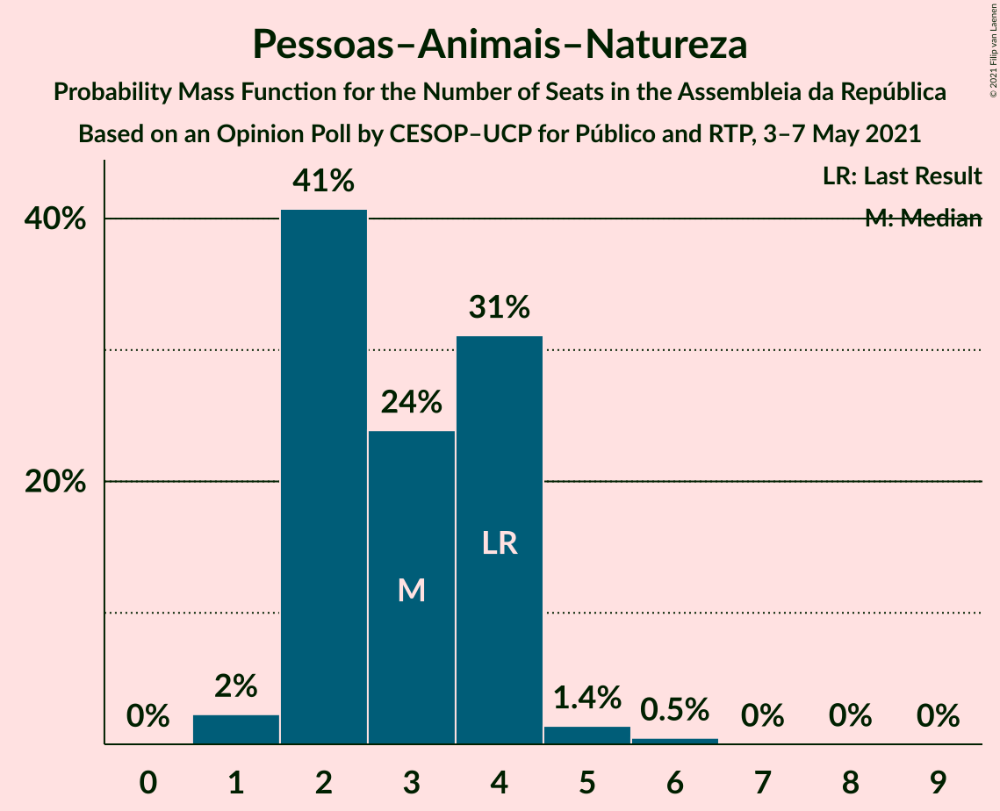
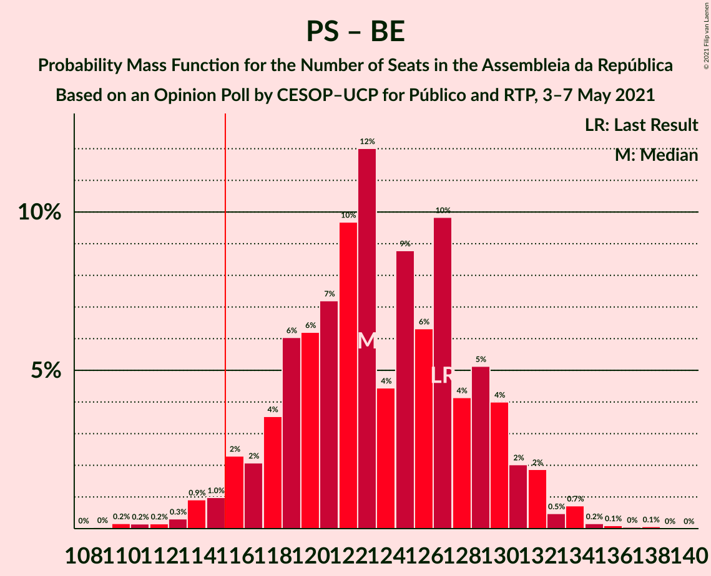
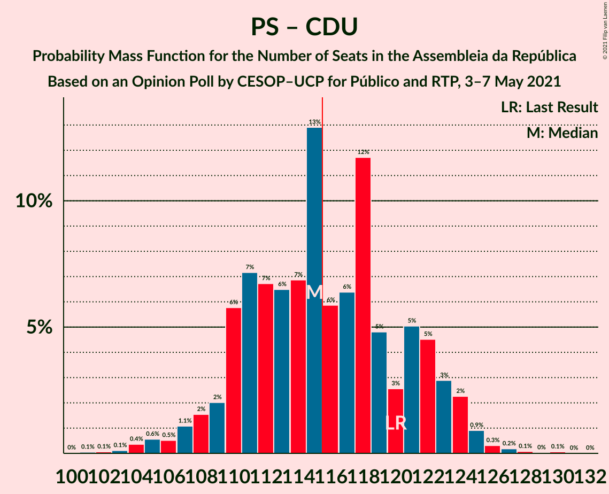

# Opinion Poll by CESOP–UCP for Público and RTP, 3–7 May 2021

<a href="#voting-intentions">Voting Intentions</a> | <a href="#seats">Seats</a> | <a href="#coalitions">Coalitions</a> | <a href="#technical-information">Technical Information</a>

## Voting Intentions

### Confidence Intervals

| Party | Last Result | Poll Result | 80% Confidence Interval | 90% Confidence Interval | 95% Confidence Interval | 99% Confidence Interval |
|:-----:|:-----------:|:-----------:|:-----------------------:|:-----------------------:|:-----------------------:|:-----------------------:|
| Partido Socialista | 36.4% | 38.0% | 36.2–39.9% |35.7–40.5% |35.2–40.9% |34.4–41.8% |
| Partido Social Democrata | 27.8% | 28.0% | 26.3–29.7% |25.8–30.2% |25.4–30.7% |24.6–31.5% |
| Bloco de Esquerda | 9.5% | 8.0% | 7.1–9.2% |6.8–9.5% |6.6–9.8% |6.1–10.3% |
| Chega | 1.3% | 6.0% | 5.2–7.0% |4.9–7.3% |4.7–7.5% |4.4–8.0% |
| Coligação Democrática Unitária | 6.3% | 5.0% | 4.2–5.9% |4.0–6.2% |3.9–6.4% |3.5–6.9% |
| Iniciativa Liberal | 1.3% | 5.0% | 4.2–5.9% |4.0–6.2% |3.9–6.4% |3.5–6.9% |
| CDS–Partido Popular | 4.2% | 3.0% | 2.5–3.8% |2.3–4.0% |2.2–4.2% |1.9–4.6% |
| Pessoas–Animais–Natureza | 3.3% | 3.0% | 2.5–3.8% |2.3–4.0% |2.2–4.2% |1.9–4.6% |

*Note:* The poll result column reflects the actual value used in the calculations. Published results may vary slightly, and in addition be rounded to fewer digits.

## Seats

### Confidence Intervals

| Party | Last Result | Median | 80% Confidence Interval | 90% Confidence Interval | 95% Confidence Interval | 99% Confidence Interval |
|:-----:|:-----------:|:------:|:-----------------------:|:-----------------------:|:-----------------------:|:-----------------------:|
| <a href="#partido-socialista">Partido Socialista</a> | 108 | 108 | 103–114 |102–116 |100–116 |97–119 |
| <a href="#partido-social-democrata">Partido Social Democrata</a> | 79 | 77 | 72–82 |70–84 |69–85 |66–87 |
| <a href="#bloco-de-esquerda">Bloco de Esquerda</a> | 19 | 15 | 13–18 |11–18 |11–19 |10–20 |
| <a href="#chega">Chega</a> | 1 | 9 | 7–11 |6–11 |6–12 |4–14 |
| <a href="#coligação-democrática-unitária">Coligação Democrática Unitária</a> | 12 | 7 | 6–9 |5–10 |5–11 |4–13 |
| <a href="#iniciativa-liberal">Iniciativa Liberal</a> | 1 | 6 | 6–10 |5–11 |5–12 |4–12 |
| <a href="#cds–partido-popular">CDS–Partido Popular</a> | 5 | 2 | 1–3 |1–3 |1–5 |1–5 |
| <a href="#pessoas–animais–natureza">Pessoas–Animais–Natureza</a> | 4 | 3 | 2–4 |2–4 |2–4 |1–6 |

### Partido Socialista

*For a full overview of the results for this party, see the [Partido Socialista](party-partidosocialista.html) page.*

| Number of Seats | Probability | Accumulated | Special Marks |
|:---------------:|:-----------:|:-----------:|:-------------:|
| 93 | 0% | 100% |  |
| 94 | 0.1% | 99.9% |  |
| 95 | 0.1% | 99.9% |  |
| 96 | 0.1% | 99.8% |  |
| 97 | 0.4% | 99.7% |  |
| 98 | 0.5% | 99.3% |  |
| 99 | 0.7% | 98.8% |  |
| 100 | 1.1% | 98% |  |
| 101 | 1.3% | 97% |  |
| 102 | 3% | 96% |  |
| 103 | 4% | 93% |  |
| 104 | 10% | 89% |  |
| 105 | 6% | 79% |  |
| 106 | 9% | 73% |  |
| 107 | 8% | 64% |  |
| 108 | 9% | 57% | Last Result, Median |
| 109 | 8% | 48% |  |
| 110 | 11% | 40% |  |
| 111 | 6% | 29% |  |
| 112 | 6% | 23% |  |
| 113 | 6% | 18% |  |
| 114 | 3% | 12% |  |
| 115 | 4% | 9% |  |
| 116 | 4% | 5% | Majority |
| 117 | 0.7% | 2% |  |
| 118 | 0.5% | 1.2% |  |
| 119 | 0.5% | 0.7% |  |
| 120 | 0.1% | 0.2% |  |
| 121 | 0% | 0.1% |  |
| 122 | 0% | 0.1% |  |
| 123 | 0% | 0.1% |  |
| 124 | 0% | 0.1% |  |
| 125 | 0% | 0% |  |

### Partido Social Democrata

*For a full overview of the results for this party, see the [Partido Social Democrata](party-partidosocialdemocrata.html) page.*

| Number of Seats | Probability | Accumulated | Special Marks |
|:---------------:|:-----------:|:-----------:|:-------------:|
| 63 | 0% | 100% |  |
| 64 | 0% | 99.9% |  |
| 65 | 0.1% | 99.9% |  |
| 66 | 0.3% | 99.8% |  |
| 67 | 0.6% | 99.5% |  |
| 68 | 0.9% | 98.9% |  |
| 69 | 2% | 98% |  |
| 70 | 2% | 96% |  |
| 71 | 2% | 94% |  |
| 72 | 7% | 91% |  |
| 73 | 4% | 84% |  |
| 74 | 10% | 80% |  |
| 75 | 8% | 70% |  |
| 76 | 8% | 62% |  |
| 77 | 9% | 54% | Median |
| 78 | 10% | 44% |  |
| 79 | 10% | 34% | Last Result |
| 80 | 7% | 24% |  |
| 81 | 5% | 17% |  |
| 82 | 2% | 12% |  |
| 83 | 4% | 10% |  |
| 84 | 3% | 6% |  |
| 85 | 1.5% | 3% |  |
| 86 | 0.9% | 2% |  |
| 87 | 0.3% | 0.8% |  |
| 88 | 0.2% | 0.5% |  |
| 89 | 0.1% | 0.3% |  |
| 90 | 0.1% | 0.2% |  |
| 91 | 0% | 0.1% |  |
| 92 | 0% | 0.1% |  |
| 93 | 0% | 0% |  |

### Bloco de Esquerda

*For a full overview of the results for this party, see the [Bloco de Esquerda](party-blocodeesquerda.html) page.*

| Number of Seats | Probability | Accumulated | Special Marks |
|:---------------:|:-----------:|:-----------:|:-------------:|
| 7 | 0.1% | 100% |  |
| 8 | 0.1% | 99.9% |  |
| 9 | 0.3% | 99.8% |  |
| 10 | 0.6% | 99.5% |  |
| 11 | 5% | 99.0% |  |
| 12 | 3% | 94% |  |
| 13 | 8% | 91% |  |
| 14 | 18% | 83% |  |
| 15 | 18% | 65% | Median |
| 16 | 8% | 46% |  |
| 17 | 20% | 38% |  |
| 18 | 15% | 18% |  |
| 19 | 3% | 3% | Last Result |
| 20 | 0.5% | 0.7% |  |
| 21 | 0.1% | 0.2% |  |
| 22 | 0.1% | 0.1% |  |
| 23 | 0% | 0% |  |

### Chega

*For a full overview of the results for this party, see the [Chega](party-chega.html) page.*

| Number of Seats | Probability | Accumulated | Special Marks |
|:---------------:|:-----------:|:-----------:|:-------------:|
| 1 | 0% | 100% | Last Result |
| 2 | 0% | 100% |  |
| 3 | 0% | 100% |  |
| 4 | 1.1% | 100% |  |
| 5 | 1.2% | 98.9% |  |
| 6 | 4% | 98% |  |
| 7 | 3% | 93% |  |
| 8 | 25% | 90% |  |
| 9 | 19% | 65% | Median |
| 10 | 20% | 46% |  |
| 11 | 22% | 25% |  |
| 12 | 1.3% | 3% |  |
| 13 | 0.7% | 2% |  |
| 14 | 0.9% | 0.9% |  |
| 15 | 0% | 0% |  |

### Coligação Democrática Unitária

*For a full overview of the results for this party, see the [Coligação Democrática Unitária](party-coligaçãodemocráticaunitária.html) page.*

| Number of Seats | Probability | Accumulated | Special Marks |
|:---------------:|:-----------:|:-----------:|:-------------:|
| 3 | 0.1% | 100% |  |
| 4 | 0.5% | 99.9% |  |
| 5 | 5% | 99.5% |  |
| 6 | 31% | 95% |  |
| 7 | 26% | 64% | Median |
| 8 | 21% | 37% |  |
| 9 | 7% | 16% |  |
| 10 | 5% | 9% |  |
| 11 | 3% | 5% |  |
| 12 | 0.7% | 2% | Last Result |
| 13 | 0.5% | 1.0% |  |
| 14 | 0.4% | 0.5% |  |
| 15 | 0.1% | 0.1% |  |
| 16 | 0% | 0% |  |

### Iniciativa Liberal

*For a full overview of the results for this party, see the [Iniciativa Liberal](party-iniciativaliberal.html) page.*

| Number of Seats | Probability | Accumulated | Special Marks |
|:---------------:|:-----------:|:-----------:|:-------------:|
| 1 | 0% | 100% | Last Result |
| 2 | 0% | 100% |  |
| 3 | 0% | 100% |  |
| 4 | 1.1% | 100% |  |
| 5 | 5% | 98.8% |  |
| 6 | 64% | 94% | Median |
| 7 | 7% | 30% |  |
| 8 | 6% | 22% |  |
| 9 | 5% | 16% |  |
| 10 | 6% | 12% |  |
| 11 | 2% | 5% |  |
| 12 | 3% | 3% |  |
| 13 | 0% | 0% |  |

### CDS–Partido Popular

*For a full overview of the results for this party, see the [CDS–Partido Popular](party-cds–partidopopular.html) page.*

| Number of Seats | Probability | Accumulated | Special Marks |
|:---------------:|:-----------:|:-----------:|:-------------:|
| 0 | 0.1% | 100% |  |
| 1 | 13% | 99.9% |  |
| 2 | 56% | 87% | Median |
| 3 | 26% | 31% |  |
| 4 | 1.2% | 5% |  |
| 5 | 3% | 4% | Last Result |
| 6 | 0% | 0% |  |

### Pessoas–Animais–Natureza

*For a full overview of the results for this party, see the [Pessoas–Animais–Natureza](party-pessoas–animais–natureza.html) page.*

| Number of Seats | Probability | Accumulated | Special Marks |
|:---------------:|:-----------:|:-----------:|:-------------:|
| 1 | 2% | 100% |  |
| 2 | 41% | 98% |  |
| 3 | 24% | 57% | Median |
| 4 | 31% | 33% | Last Result |
| 5 | 1.4% | 2% |  |
| 6 | 0.5% | 0.6% |  |
| 7 | 0% | 0.1% |  |
| 8 | 0% | 0.1% |  |
| 9 | 0% | 0% |  |

## Coalitions

### Confidence Intervals

| Coalition | Last Result | Median | Majority? | 80% Confidence Interval | 90% Confidence Interval | 95% Confidence Interval | 99% Confidence Interval |
|:---------:|:-----------:|:------:|:---------:|:-----------------------:|:-----------------------:|:-----------------------:|:-----------------------:|
| Partido Socialista – Bloco de Esquerda – Coligação Democrática Unitária | 139 | 131 | 99.9% | 125–137 | 124–139 | 122–139 | 120–142 |
| Partido Socialista – Bloco de Esquerda | 127 | 123 | 97% | 118–129 | 116–131 | 115–132 | 112–134 |
| Partido Socialista – Coligação Democrática Unitária | 120 | 115 | 48% | 110–122 | 109–123 | 107–124 | 104–126 |
| Partido Socialista | 108 | 108 | 5% | 103–114 | 102–116 | 100–116 | 97–119 |
| Partido Social Democrata – CDS–Partido Popular | 84 | 79 | 0% | 74–85 | 72–86 | 71–87 | 69–90 |

### Partido Socialista – Bloco de Esquerda – Coligação Democrática Unitária

| Number of Seats | Probability | Accumulated | Special Marks |
|:---------------:|:-----------:|:-----------:|:-------------:|
| 115 | 0% | 100% |  |
| 116 | 0% | 99.9% | Majority |
| 117 | 0.1% | 99.9% |  |
| 118 | 0.1% | 99.8% |  |
| 119 | 0.1% | 99.7% |  |
| 120 | 0.4% | 99.5% |  |
| 121 | 0.7% | 99.1% |  |
| 122 | 2% | 98% |  |
| 123 | 1.0% | 97% |  |
| 124 | 3% | 96% |  |
| 125 | 3% | 93% |  |
| 126 | 5% | 90% |  |
| 127 | 5% | 84% |  |
| 128 | 9% | 79% |  |
| 129 | 10% | 71% |  |
| 130 | 10% | 61% | Median |
| 131 | 7% | 51% |  |
| 132 | 9% | 45% |  |
| 133 | 5% | 36% |  |
| 134 | 6% | 31% |  |
| 135 | 9% | 25% |  |
| 136 | 4% | 16% |  |
| 137 | 3% | 12% |  |
| 138 | 3% | 8% |  |
| 139 | 3% | 5% | Last Result |
| 140 | 1.2% | 2% |  |
| 141 | 0.7% | 1.2% |  |
| 142 | 0.2% | 0.6% |  |
| 143 | 0.2% | 0.3% |  |
| 144 | 0.1% | 0.2% |  |
| 145 | 0% | 0.1% |  |
| 146 | 0% | 0% |  |

### Partido Socialista – Bloco de Esquerda

| Number of Seats | Probability | Accumulated | Special Marks |
|:---------------:|:-----------:|:-----------:|:-------------:|
| 108 | 0% | 100% |  |
| 109 | 0% | 99.9% |  |
| 110 | 0.2% | 99.9% |  |
| 111 | 0.2% | 99.7% |  |
| 112 | 0.2% | 99.6% |  |
| 113 | 0.3% | 99.4% |  |
| 114 | 0.9% | 99.1% |  |
| 115 | 1.0% | 98% |  |
| 116 | 2% | 97% | Majority |
| 117 | 2% | 95% |  |
| 118 | 4% | 93% |  |
| 119 | 6% | 89% |  |
| 120 | 6% | 83% |  |
| 121 | 7% | 77% |  |
| 122 | 10% | 70% |  |
| 123 | 12% | 60% | Median |
| 124 | 4% | 48% |  |
| 125 | 9% | 44% |  |
| 126 | 6% | 35% |  |
| 127 | 10% | 29% | Last Result |
| 128 | 4% | 19% |  |
| 129 | 5% | 15% |  |
| 130 | 4% | 10% |  |
| 131 | 2% | 6% |  |
| 132 | 2% | 3% |  |
| 133 | 0.5% | 2% |  |
| 134 | 0.7% | 1.1% |  |
| 135 | 0.2% | 0.4% |  |
| 136 | 0.1% | 0.2% |  |
| 137 | 0% | 0.1% |  |
| 138 | 0.1% | 0.1% |  |
| 139 | 0% | 0% |  |

### Partido Socialista – Coligação Democrática Unitária

| Number of Seats | Probability | Accumulated | Special Marks |
|:---------------:|:-----------:|:-----------:|:-------------:|
| 100 | 0% | 100% |  |
| 101 | 0.1% | 99.9% |  |
| 102 | 0.1% | 99.9% |  |
| 103 | 0.1% | 99.8% |  |
| 104 | 0.4% | 99.7% |  |
| 105 | 0.6% | 99.3% |  |
| 106 | 0.5% | 98.8% |  |
| 107 | 1.1% | 98% |  |
| 108 | 2% | 97% |  |
| 109 | 2% | 96% |  |
| 110 | 6% | 94% |  |
| 111 | 7% | 88% |  |
| 112 | 7% | 81% |  |
| 113 | 6% | 74% |  |
| 114 | 7% | 67% |  |
| 115 | 13% | 61% | Median |
| 116 | 6% | 48% | Majority |
| 117 | 6% | 42% |  |
| 118 | 12% | 35% |  |
| 119 | 5% | 24% |  |
| 120 | 3% | 19% | Last Result |
| 121 | 5% | 16% |  |
| 122 | 5% | 11% |  |
| 123 | 3% | 7% |  |
| 124 | 2% | 4% |  |
| 125 | 0.9% | 2% |  |
| 126 | 0.3% | 0.7% |  |
| 127 | 0.2% | 0.4% |  |
| 128 | 0.1% | 0.2% |  |
| 129 | 0% | 0.1% |  |
| 130 | 0.1% | 0.1% |  |
| 131 | 0% | 0% |  |

### Partido Socialista

| Number of Seats | Probability | Accumulated | Special Marks |
|:---------------:|:-----------:|:-----------:|:-------------:|
| 93 | 0% | 100% |  |
| 94 | 0.1% | 99.9% |  |
| 95 | 0.1% | 99.9% |  |
| 96 | 0.1% | 99.8% |  |
| 97 | 0.4% | 99.7% |  |
| 98 | 0.5% | 99.3% |  |
| 99 | 0.7% | 98.8% |  |
| 100 | 1.1% | 98% |  |
| 101 | 1.3% | 97% |  |
| 102 | 3% | 96% |  |
| 103 | 4% | 93% |  |
| 104 | 10% | 89% |  |
| 105 | 6% | 79% |  |
| 106 | 9% | 73% |  |
| 107 | 8% | 64% |  |
| 108 | 9% | 57% | Last Result, Median |
| 109 | 8% | 48% |  |
| 110 | 11% | 40% |  |
| 111 | 6% | 29% |  |
| 112 | 6% | 23% |  |
| 113 | 6% | 18% |  |
| 114 | 3% | 12% |  |
| 115 | 4% | 9% |  |
| 116 | 4% | 5% | Majority |
| 117 | 0.7% | 2% |  |
| 118 | 0.5% | 1.2% |  |
| 119 | 0.5% | 0.7% |  |
| 120 | 0.1% | 0.2% |  |
| 121 | 0% | 0.1% |  |
| 122 | 0% | 0.1% |  |
| 123 | 0% | 0.1% |  |
| 124 | 0% | 0.1% |  |
| 125 | 0% | 0% |  |

### Partido Social Democrata – CDS–Partido Popular

| Number of Seats | Probability | Accumulated | Special Marks |
|:---------------:|:-----------:|:-----------:|:-------------:|
| 65 | 0% | 100% |  |
| 66 | 0% | 99.9% |  |
| 67 | 0.1% | 99.9% |  |
| 68 | 0.3% | 99.8% |  |
| 69 | 0.4% | 99.5% |  |
| 70 | 0.9% | 99.1% |  |
| 71 | 2% | 98% |  |
| 72 | 2% | 96% |  |
| 73 | 2% | 94% |  |
| 74 | 6% | 92% |  |
| 75 | 6% | 86% |  |
| 76 | 9% | 81% |  |
| 77 | 7% | 71% |  |
| 78 | 10% | 65% |  |
| 79 | 9% | 55% | Median |
| 80 | 9% | 46% |  |
| 81 | 9% | 37% |  |
| 82 | 9% | 28% |  |
| 83 | 5% | 20% |  |
| 84 | 4% | 14% | Last Result |
| 85 | 3% | 10% |  |
| 86 | 4% | 7% |  |
| 87 | 2% | 4% |  |
| 88 | 1.1% | 2% |  |
| 89 | 0.4% | 1.0% |  |
| 90 | 0.3% | 0.6% |  |
| 91 | 0.1% | 0.3% |  |
| 92 | 0.1% | 0.2% |  |
| 93 | 0% | 0.1% |  |
| 94 | 0% | 0.1% |  |
| 95 | 0% | 0.1% |  |
| 96 | 0% | 0% |  |

## Technical Information

### Opinion Poll

+ **Polling firm:** CESOP–UCP
+ **Commissioner(s):** Público and RTP
+ **Fieldwork period:** 3–7 May 2021

### Calculations

+ **Sample size:** 1123
+ **Simulations done:** 1,048,576
+ **Error estimate:** 0.52%

