# Opinion Poll by Intercampus for Correio da Manhã and Negócios, 5–11 May 2021

<a href="#voting-intentions">Voting Intentions</a> | <a href="#seats">Seats</a> | <a href="#coalitions">Coalitions</a> | <a href="#technical-information">Technical Information</a>

## Voting Intentions

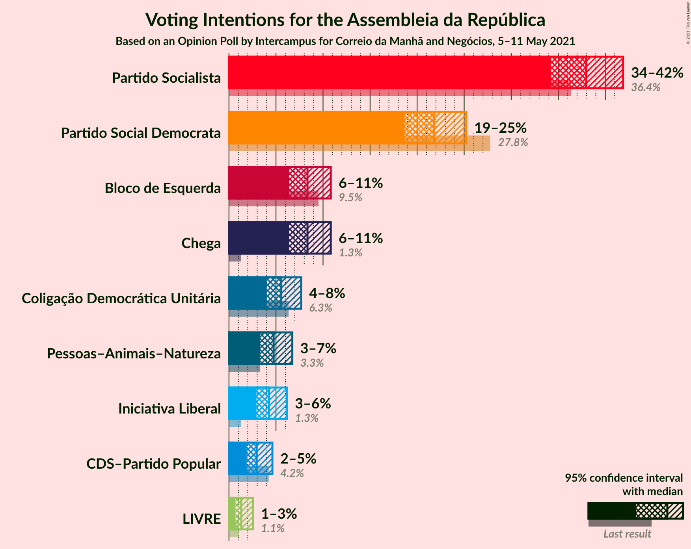

### Confidence Intervals

| Party | Last Result | Poll Result | 80% Confidence Interval | 90% Confidence Interval | 95% Confidence Interval | 99% Confidence Interval |
|:-----:|:-----------:|:-----------:|:-----------------------:|:-----------------------:|:-----------------------:|:-----------------------:|
| Partido Socialista | 36.4% | 38.0% | 35.5–40.5% |34.8–41.3% |34.2–41.9% |33.0–43.1% |
| Partido Social Democrata | 27.8% | 21.8% | 19.7–24.0% |19.2–24.7% |18.7–25.2% |17.7–26.3% |
| Bloco de Esquerda | 9.5% | 8.3% | 7.1–10.0% |6.7–10.4% |6.4–10.8% |5.8–11.6% |
| Chega | 1.3% | 8.3% | 7.1–10.0% |6.7–10.4% |6.4–10.8% |5.8–11.6% |
| Coligação Democrática Unitária | 6.3% | 5.6% | 4.5–7.0% |4.3–7.3% |4.0–7.7% |3.6–8.4% |
| Pessoas–Animais–Natureza | 3.3% | 4.7% | 3.8–6.1% |3.5–6.4% |3.3–6.7% |2.9–7.4% |
| Iniciativa Liberal | 1.3% | 4.3% | 3.4–5.5% |3.1–5.9% |2.9–6.2% |2.5–6.8% |
| CDS–Partido Popular | 4.2% | 2.9% | 2.2–4.0% |2.0–4.3% |1.9–4.6% |1.6–5.2% |
| LIVRE | 1.1% | 1.3% | 0.9–2.1% |0.8–2.3% |0.7–2.6% |0.5–3.0% |

*Note:* The poll result column reflects the actual value used in the calculations. Published results may vary slightly, and in addition be rounded to fewer digits.

## Seats

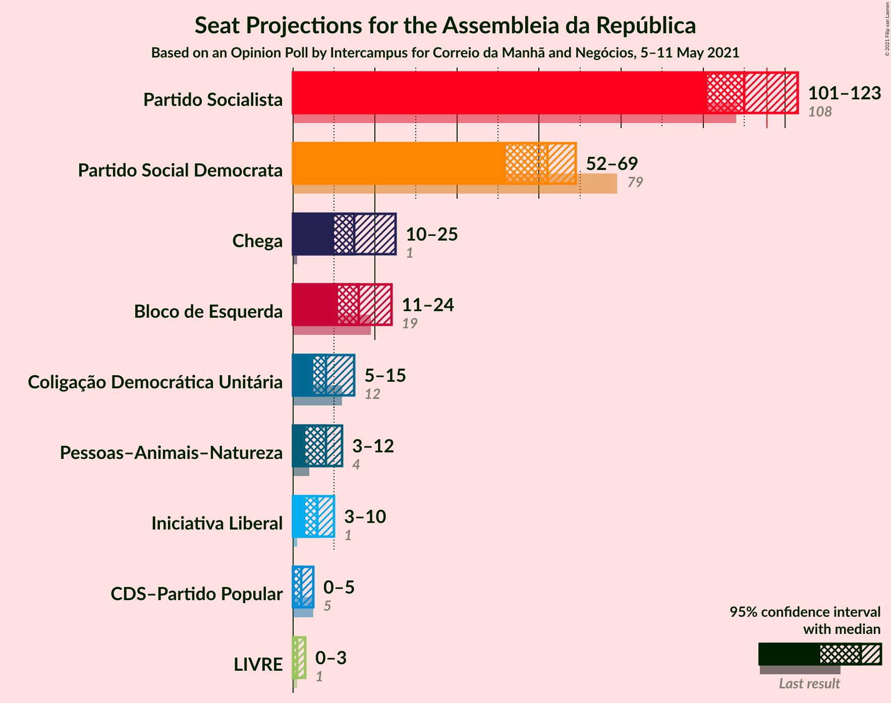

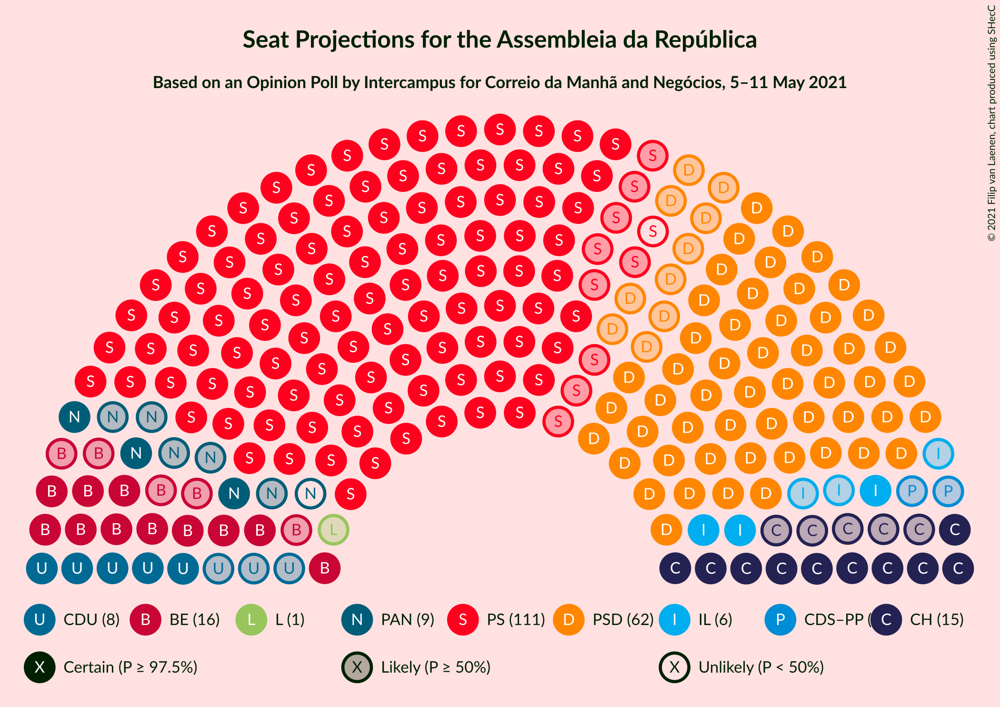

### Confidence Intervals

| Party | Last Result | Median | 80% Confidence Interval | 90% Confidence Interval | 95% Confidence Interval | 99% Confidence Interval |
|:-----:|:-----------:|:------:|:-----------------------:|:-----------------------:|:-----------------------:|:-----------------------:|
| <a href="#partido-socialista">Partido Socialista</a> | 108 | 110 | 105–120 |103–122 |101–123 |100–128 |
| <a href="#partido-social-democrata">Partido Social Democrata</a> | 79 | 62 | 54–66 |53–67 |52–69 |47–73 |
| <a href="#bloco-de-esquerda">Bloco de Esquerda</a> | 19 | 16 | 13–20 |13–22 |11–24 |8–25 |
| <a href="#chega">Chega</a> | 1 | 15 | 11–21 |11–24 |10–25 |9–25 |
| <a href="#coligação-democrática-unitária">Coligação Democrática Unitária</a> | 12 | 8 | 6–13 |6–14 |5–15 |5–17 |
| <a href="#pessoas–animais–natureza">Pessoas–Animais–Natureza</a> | 4 | 8 | 4–9 |4–11 |3–12 |2–12 |
| <a href="#iniciativa-liberal">Iniciativa Liberal</a> | 1 | 6 | 4–10 |3–10 |3–10 |3–12 |
| <a href="#cds–partido-popular">CDS–Partido Popular</a> | 5 | 2 | 1–4 |1–5 |0–5 |0–7 |
| <a href="#livre">LIVRE</a> | 1 | 1 | 0–1 |0–2 |0–3 |0–3 |

### Partido Socialista

*For a full overview of the results for this party, see the [Partido Socialista](party-partidosocialista.html) page.*

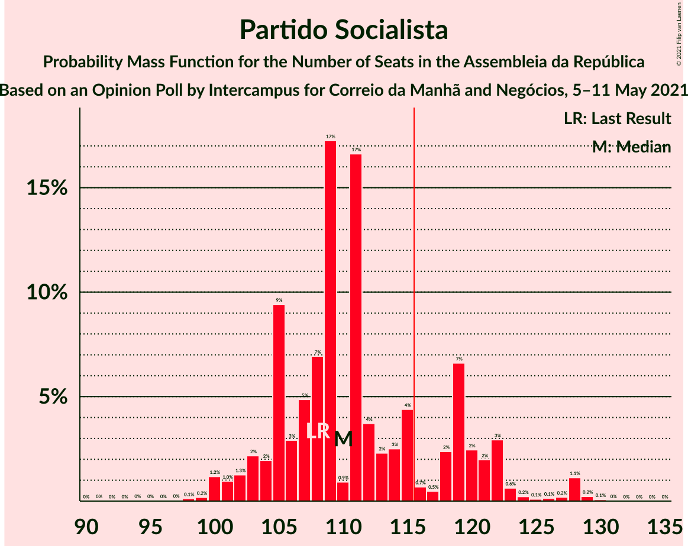

| Number of Seats | Probability | Accumulated | Special Marks |
|:---------------:|:-----------:|:-----------:|:-------------:|
| 94 | 0% | 100% |  |
| 95 | 0% | 99.9% |  |
| 96 | 0% | 99.9% |  |
| 97 | 0% | 99.9% |  |
| 98 | 0.1% | 99.8% |  |
| 99 | 0.2% | 99.7% |  |
| 100 | 1.2% | 99.5% |  |
| 101 | 1.0% | 98% |  |
| 102 | 1.3% | 97% |  |
| 103 | 2% | 96% |  |
| 104 | 2% | 94% |  |
| 105 | 9% | 92% |  |
| 106 | 3% | 83% |  |
| 107 | 5% | 80% |  |
| 108 | 7% | 75% | Last Result |
| 109 | 17% | 68% |  |
| 110 | 0.9% | 51% | Median |
| 111 | 17% | 50% |  |
| 112 | 4% | 33% |  |
| 113 | 2% | 29% |  |
| 114 | 3% | 27% |  |
| 115 | 4% | 25% |  |
| 116 | 0.7% | 20% | Majority |
| 117 | 0.5% | 20% |  |
| 118 | 2% | 19% |  |
| 119 | 7% | 17% |  |
| 120 | 2% | 10% |  |
| 121 | 2% | 8% |  |
| 122 | 3% | 6% |  |
| 123 | 0.6% | 3% |  |
| 124 | 0.2% | 2% |  |
| 125 | 0.1% | 2% |  |
| 126 | 0.1% | 2% |  |
| 127 | 0.2% | 2% |  |
| 128 | 1.1% | 1.5% |  |
| 129 | 0.2% | 0.3% |  |
| 130 | 0.1% | 0.1% |  |
| 131 | 0% | 0% |  |

### Partido Social Democrata

*For a full overview of the results for this party, see the [Partido Social Democrata](party-partidosocialdemocrata.html) page.*

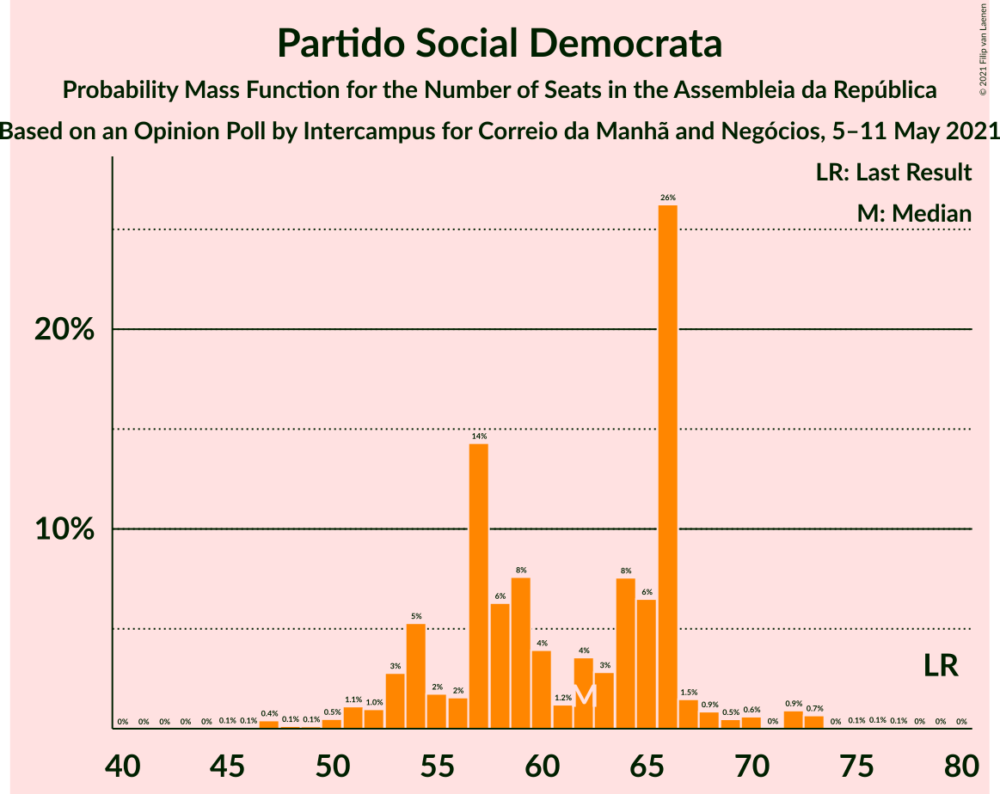

| Number of Seats | Probability | Accumulated | Special Marks |
|:---------------:|:-----------:|:-----------:|:-------------:|
| 45 | 0.1% | 100% |  |
| 46 | 0.1% | 99.9% |  |
| 47 | 0.4% | 99.9% |  |
| 48 | 0.1% | 99.5% |  |
| 49 | 0.1% | 99.3% |  |
| 50 | 0.5% | 99.2% |  |
| 51 | 1.1% | 98.7% |  |
| 52 | 1.0% | 98% |  |
| 53 | 3% | 97% |  |
| 54 | 5% | 94% |  |
| 55 | 2% | 89% |  |
| 56 | 2% | 87% |  |
| 57 | 14% | 85% |  |
| 58 | 6% | 71% |  |
| 59 | 8% | 65% |  |
| 60 | 4% | 57% |  |
| 61 | 1.2% | 53% |  |
| 62 | 4% | 52% | Median |
| 63 | 3% | 48% |  |
| 64 | 8% | 46% |  |
| 65 | 6% | 38% |  |
| 66 | 26% | 32% |  |
| 67 | 1.5% | 5% |  |
| 68 | 0.9% | 4% |  |
| 69 | 0.5% | 3% |  |
| 70 | 0.6% | 2% |  |
| 71 | 0% | 2% |  |
| 72 | 0.9% | 2% |  |
| 73 | 0.7% | 0.9% |  |
| 74 | 0% | 0.3% |  |
| 75 | 0.1% | 0.3% |  |
| 76 | 0.1% | 0.2% |  |
| 77 | 0.1% | 0.1% |  |
| 78 | 0% | 0.1% |  |
| 79 | 0% | 0% | Last Result |

### Bloco de Esquerda

*For a full overview of the results for this party, see the [Bloco de Esquerda](party-blocodeesquerda.html) page.*

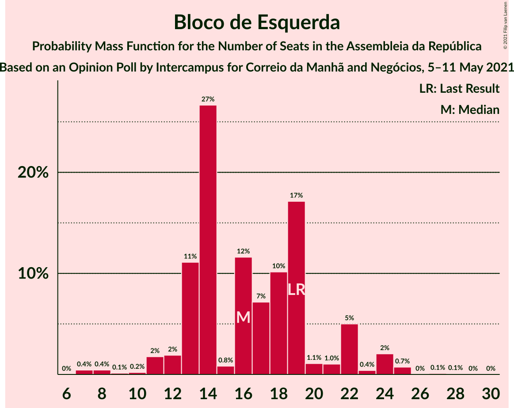

| Number of Seats | Probability | Accumulated | Special Marks |
|:---------------:|:-----------:|:-----------:|:-------------:|
| 7 | 0.4% | 100% |  |
| 8 | 0.4% | 99.6% |  |
| 9 | 0.1% | 99.1% |  |
| 10 | 0.2% | 99.0% |  |
| 11 | 2% | 98.8% |  |
| 12 | 2% | 97% |  |
| 13 | 11% | 95% |  |
| 14 | 27% | 84% |  |
| 15 | 0.8% | 57% |  |
| 16 | 12% | 57% | Median |
| 17 | 7% | 45% |  |
| 18 | 10% | 38% |  |
| 19 | 17% | 28% | Last Result |
| 20 | 1.1% | 10% |  |
| 21 | 1.0% | 9% |  |
| 22 | 5% | 8% |  |
| 23 | 0.4% | 3% |  |
| 24 | 2% | 3% |  |
| 25 | 0.7% | 0.9% |  |
| 26 | 0% | 0.2% |  |
| 27 | 0.1% | 0.2% |  |
| 28 | 0.1% | 0.1% |  |
| 29 | 0% | 0% |  |

### Chega

*For a full overview of the results for this party, see the [Chega](party-chega.html) page.*

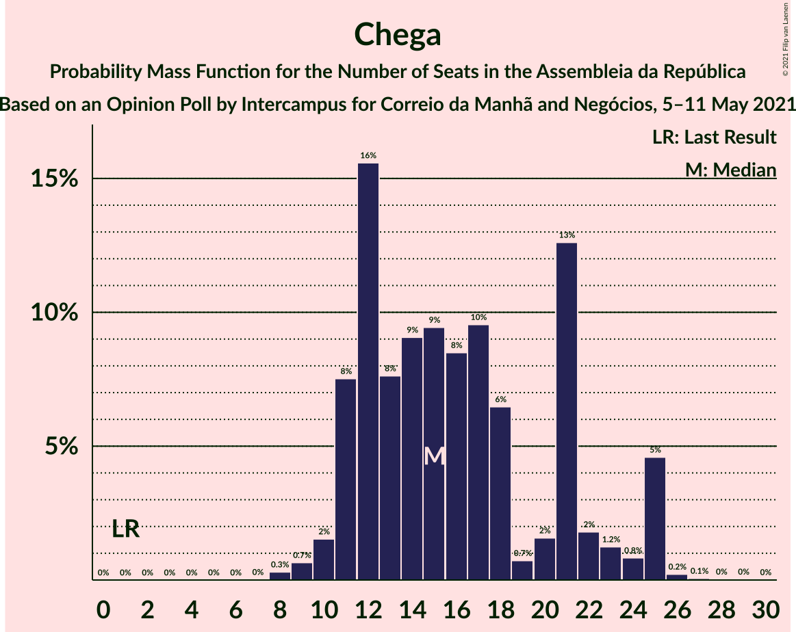

| Number of Seats | Probability | Accumulated | Special Marks |
|:---------------:|:-----------:|:-----------:|:-------------:|
| 1 | 0% | 100% | Last Result |
| 2 | 0% | 100% |  |
| 3 | 0% | 100% |  |
| 4 | 0% | 100% |  |
| 5 | 0% | 100% |  |
| 6 | 0% | 100% |  |
| 7 | 0% | 100% |  |
| 8 | 0.3% | 100% |  |
| 9 | 0.7% | 99.7% |  |
| 10 | 2% | 99.0% |  |
| 11 | 8% | 97% |  |
| 12 | 16% | 90% |  |
| 13 | 8% | 74% |  |
| 14 | 9% | 67% |  |
| 15 | 9% | 58% | Median |
| 16 | 8% | 48% |  |
| 17 | 10% | 40% |  |
| 18 | 6% | 30% |  |
| 19 | 0.7% | 24% |  |
| 20 | 2% | 23% |  |
| 21 | 13% | 21% |  |
| 22 | 2% | 9% |  |
| 23 | 1.2% | 7% |  |
| 24 | 0.8% | 6% |  |
| 25 | 5% | 5% |  |
| 26 | 0.2% | 0.4% |  |
| 27 | 0.1% | 0.1% |  |
| 28 | 0% | 0.1% |  |
| 29 | 0% | 0% |  |

### Coligação Democrática Unitária

*For a full overview of the results for this party, see the [Coligação Democrática Unitária](party-coligaçãodemocráticaunitária.html) page.*

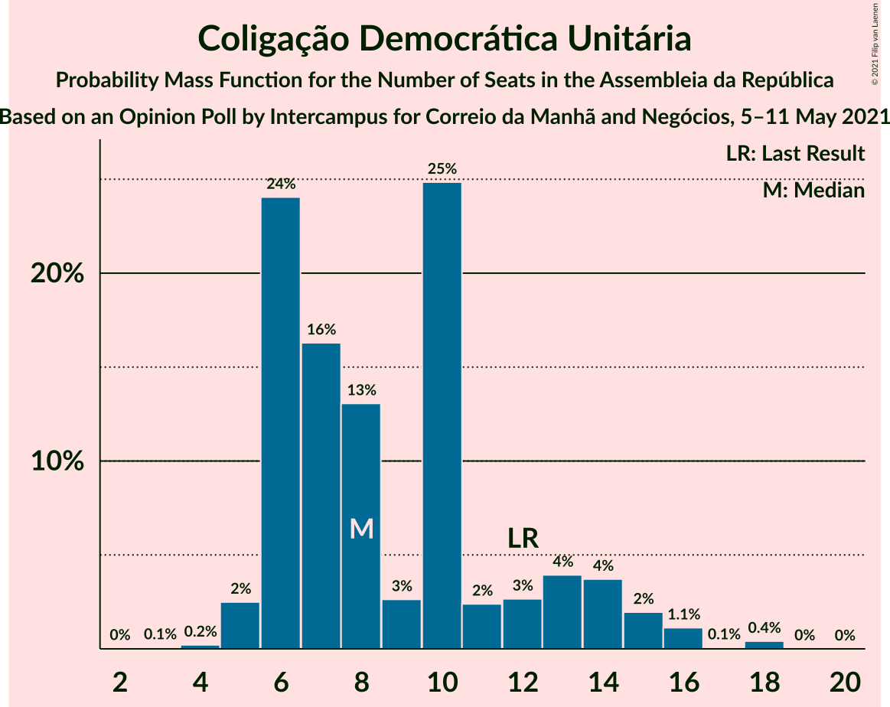

| Number of Seats | Probability | Accumulated | Special Marks |
|:---------------:|:-----------:|:-----------:|:-------------:|
| 3 | 0.1% | 100% |  |
| 4 | 0.2% | 99.9% |  |
| 5 | 2% | 99.7% |  |
| 6 | 24% | 97% |  |
| 7 | 16% | 73% |  |
| 8 | 13% | 57% | Median |
| 9 | 3% | 44% |  |
| 10 | 25% | 41% |  |
| 11 | 2% | 16% |  |
| 12 | 3% | 14% | Last Result |
| 13 | 4% | 11% |  |
| 14 | 4% | 7% |  |
| 15 | 2% | 4% |  |
| 16 | 1.1% | 2% |  |
| 17 | 0.1% | 0.5% |  |
| 18 | 0.4% | 0.4% |  |
| 19 | 0% | 0% |  |

### Pessoas–Animais–Natureza

*For a full overview of the results for this party, see the [Pessoas–Animais–Natureza](party-pessoas–animais–natureza.html) page.*

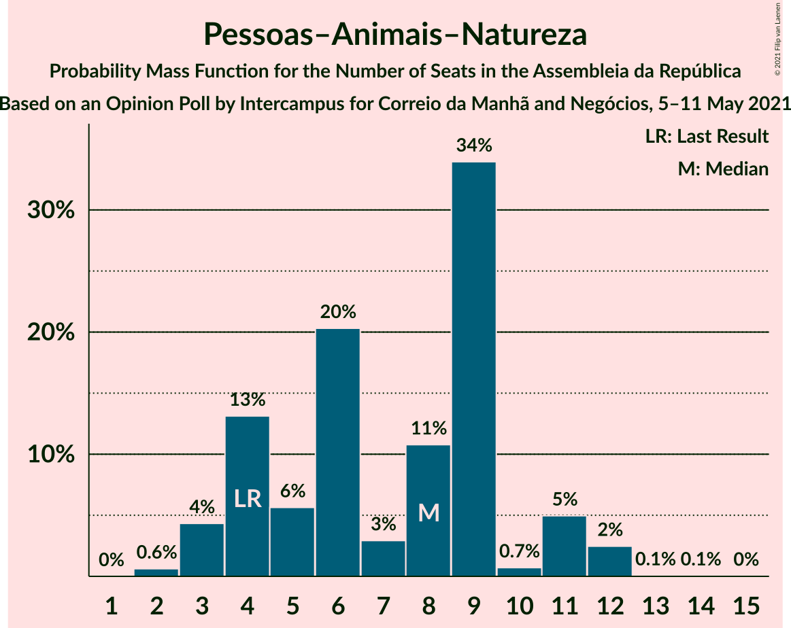

| Number of Seats | Probability | Accumulated | Special Marks |
|:---------------:|:-----------:|:-----------:|:-------------:|
| 2 | 0.6% | 100% |  |
| 3 | 4% | 99.4% |  |
| 4 | 13% | 95% | Last Result |
| 5 | 6% | 82% |  |
| 6 | 20% | 76% |  |
| 7 | 3% | 56% |  |
| 8 | 11% | 53% | Median |
| 9 | 34% | 42% |  |
| 10 | 0.7% | 8% |  |
| 11 | 5% | 8% |  |
| 12 | 2% | 3% |  |
| 13 | 0.1% | 0.2% |  |
| 14 | 0.1% | 0.1% |  |
| 15 | 0% | 0% |  |

### Iniciativa Liberal

*For a full overview of the results for this party, see the [Iniciativa Liberal](party-iniciativaliberal.html) page.*

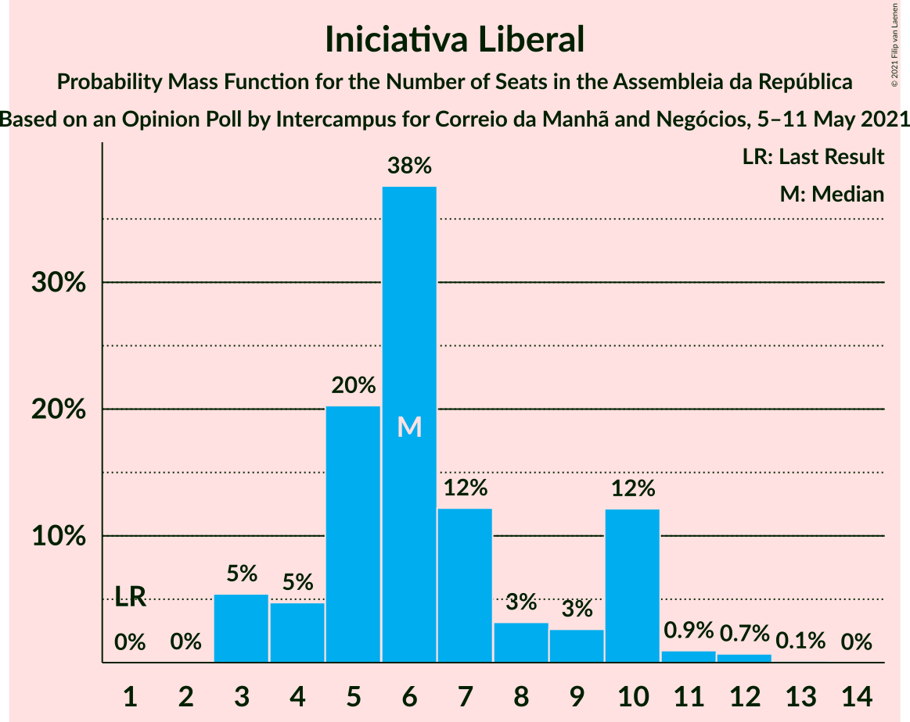

| Number of Seats | Probability | Accumulated | Special Marks |
|:---------------:|:-----------:|:-----------:|:-------------:|
| 1 | 0% | 100% | Last Result |
| 2 | 0% | 100% |  |
| 3 | 5% | 100% |  |
| 4 | 5% | 95% |  |
| 5 | 20% | 90% |  |
| 6 | 38% | 70% | Median |
| 7 | 12% | 32% |  |
| 8 | 3% | 20% |  |
| 9 | 3% | 17% |  |
| 10 | 12% | 14% |  |
| 11 | 0.9% | 2% |  |
| 12 | 0.7% | 0.8% |  |
| 13 | 0.1% | 0.1% |  |
| 14 | 0% | 0% |  |

### CDS–Partido Popular

*For a full overview of the results for this party, see the [CDS–Partido Popular](party-cds–partidopopular.html) page.*

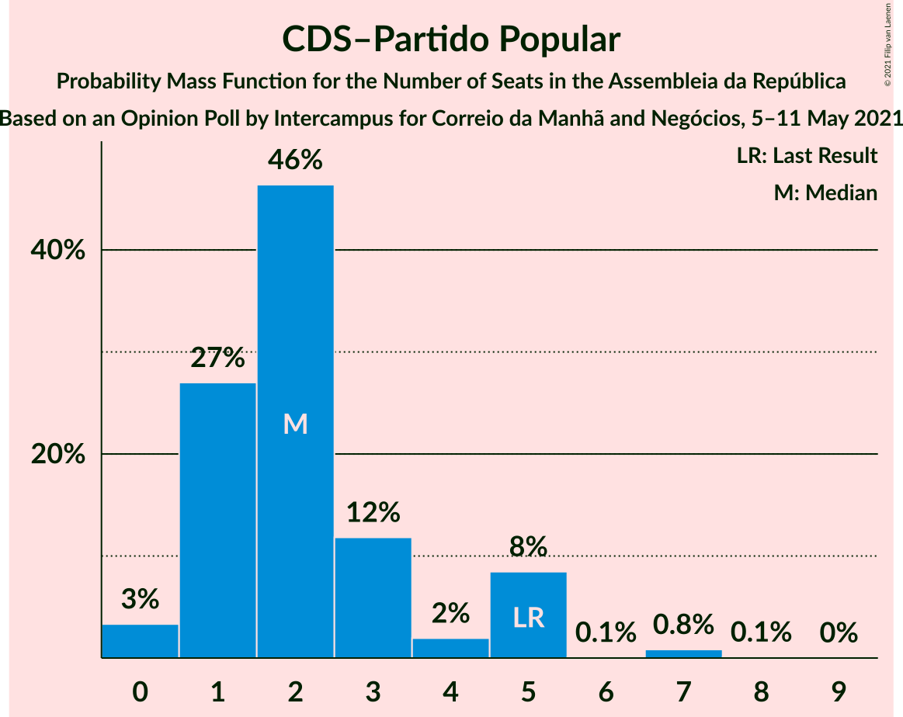

| Number of Seats | Probability | Accumulated | Special Marks |
|:---------------:|:-----------:|:-----------:|:-------------:|
| 0 | 3% | 100% |  |
| 1 | 27% | 97% |  |
| 2 | 46% | 70% | Median |
| 3 | 12% | 23% |  |
| 4 | 2% | 11% |  |
| 5 | 8% | 9% | Last Result |
| 6 | 0.1% | 1.0% |  |
| 7 | 0.8% | 1.0% |  |
| 8 | 0.1% | 0.1% |  |
| 9 | 0% | 0% |  |

### LIVRE

*For a full overview of the results for this party, see the [LIVRE](party-livre.html) page.*

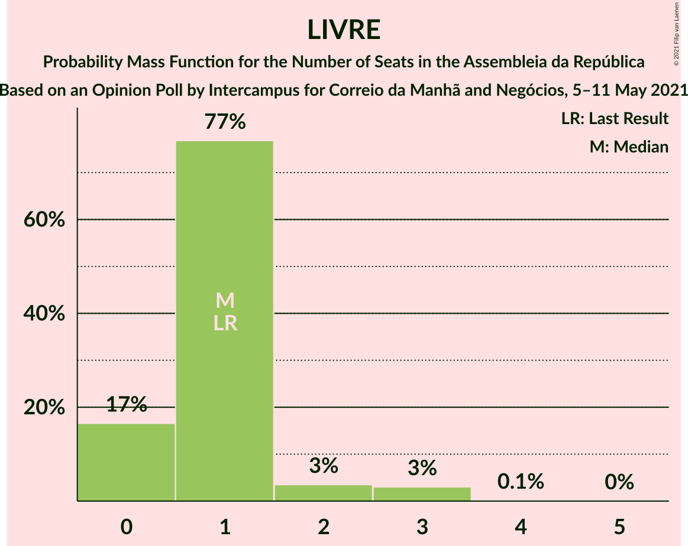

| Number of Seats | Probability | Accumulated | Special Marks |
|:---------------:|:-----------:|:-----------:|:-------------:|
| 0 | 17% | 100% |  |
| 1 | 77% | 83% | Last Result, Median |
| 2 | 3% | 7% |  |
| 3 | 3% | 3% |  |
| 4 | 0.1% | 0.1% |  |
| 5 | 0% | 0% |  |

## Coalitions

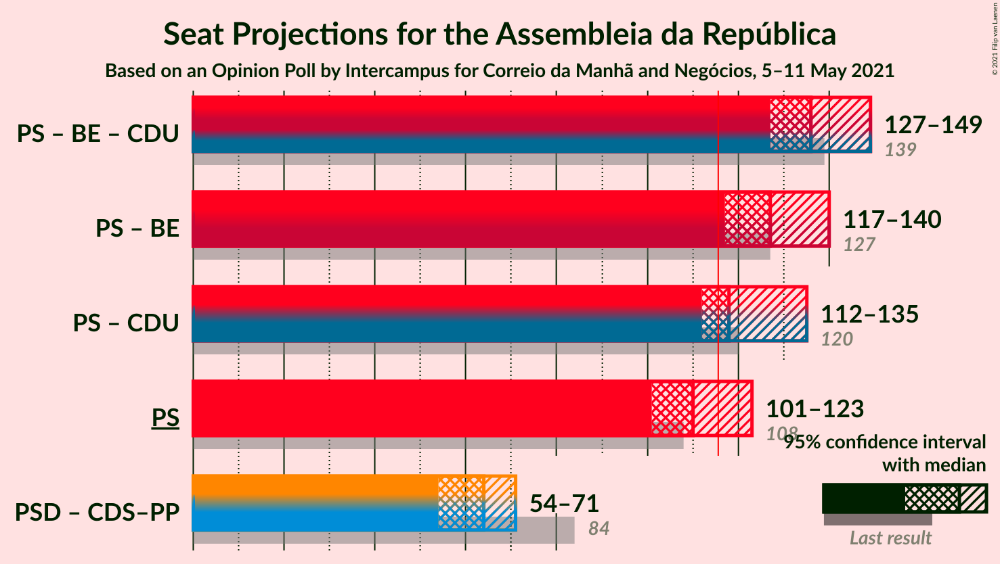

### Confidence Intervals

| Coalition | Last Result | Median | Majority? | 80% Confidence Interval | 90% Confidence Interval | 95% Confidence Interval | 99% Confidence Interval |
|:---------:|:-----------:|:------:|:---------:|:-----------------------:|:-----------------------:|:-----------------------:|:-----------------------:|
| Partido Socialista – Bloco de Esquerda – Coligação Democrática Unitária | 139 | 136 | 100% | 129–143 | 128–148 | 127–149 | 123–154 |
| Partido Socialista – Bloco de Esquerda | 127 | 127 | 99.1% | 120–135 | 118–137 | 117–140 | 114–145 |
| Partido Socialista – Coligação Democrática Unitária | 120 | 118 | 83% | 115–128 | 112–132 | 112–135 | 107–137 |
| Partido Socialista | 108 | 110 | 20% | 105–120 | 103–122 | 101–123 | 100–128 |
| Partido Social Democrata – CDS–Partido Popular | 84 | 64 | 0% | 55–68 | 55–68 | 54–71 | 50–75 |

### Partido Socialista – Bloco de Esquerda – Coligação Democrática Unitária

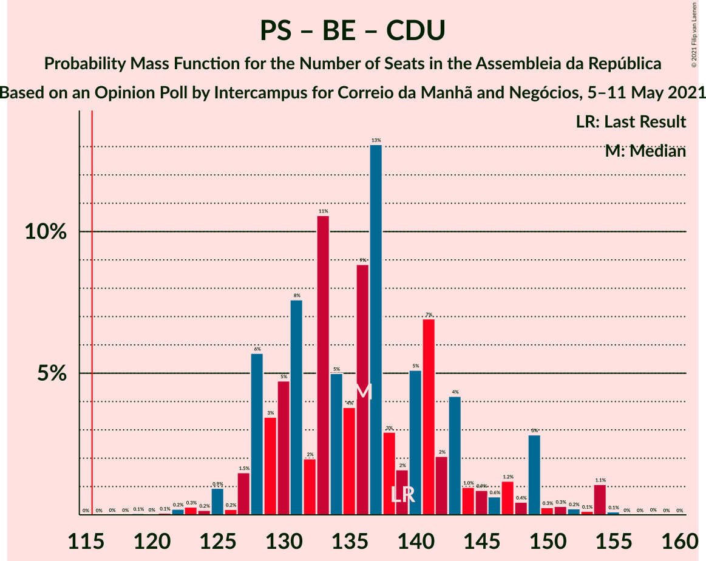

| Number of Seats | Probability | Accumulated | Special Marks |
|:---------------:|:-----------:|:-----------:|:-------------:|
| 119 | 0.1% | 100% |  |
| 120 | 0% | 99.9% |  |
| 121 | 0.1% | 99.9% |  |
| 122 | 0.2% | 99.8% |  |
| 123 | 0.3% | 99.6% |  |
| 124 | 0.2% | 99.4% |  |
| 125 | 0.9% | 99.2% |  |
| 126 | 0.2% | 98% |  |
| 127 | 1.5% | 98% |  |
| 128 | 6% | 97% |  |
| 129 | 3% | 91% |  |
| 130 | 5% | 87% |  |
| 131 | 8% | 83% |  |
| 132 | 2% | 75% |  |
| 133 | 11% | 73% |  |
| 134 | 5% | 63% | Median |
| 135 | 4% | 58% |  |
| 136 | 9% | 54% |  |
| 137 | 13% | 45% |  |
| 138 | 3% | 32% |  |
| 139 | 2% | 29% | Last Result |
| 140 | 5% | 27% |  |
| 141 | 7% | 22% |  |
| 142 | 2% | 15% |  |
| 143 | 4% | 13% |  |
| 144 | 1.0% | 9% |  |
| 145 | 0.9% | 8% |  |
| 146 | 0.6% | 7% |  |
| 147 | 1.2% | 7% |  |
| 148 | 0.4% | 5% |  |
| 149 | 3% | 5% |  |
| 150 | 0.3% | 2% |  |
| 151 | 0.3% | 2% |  |
| 152 | 0.2% | 2% |  |
| 153 | 0.1% | 1.3% |  |
| 154 | 1.1% | 1.2% |  |
| 155 | 0.1% | 0.1% |  |
| 156 | 0% | 0% |  |

### Partido Socialista – Bloco de Esquerda

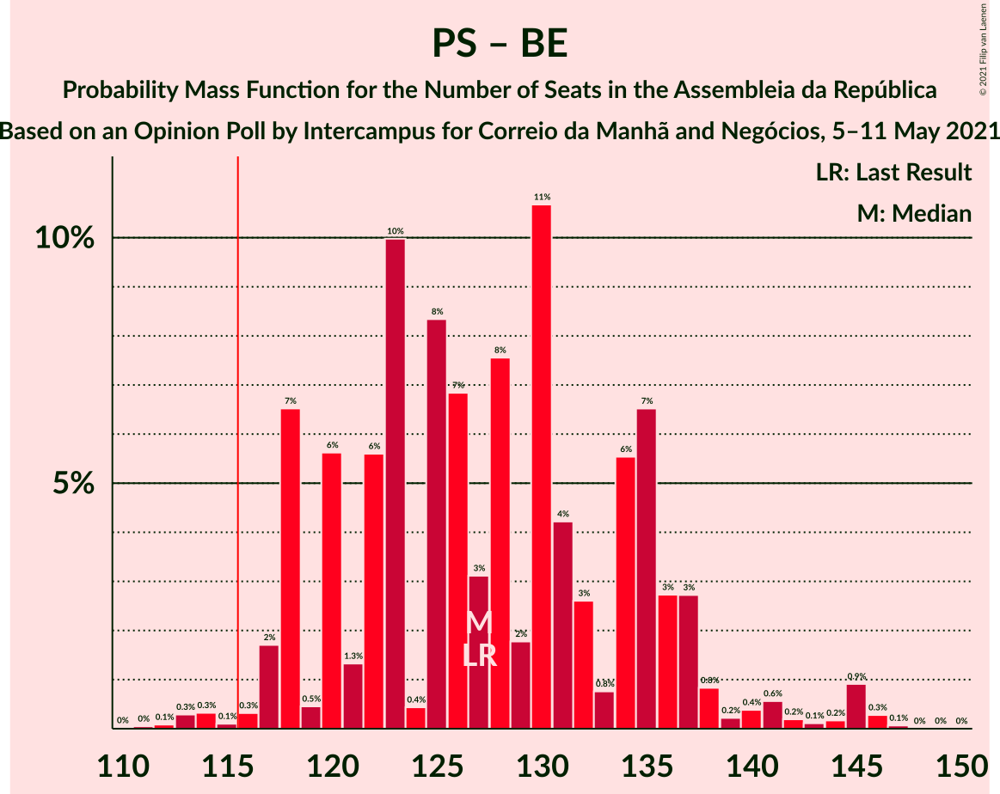

| Number of Seats | Probability | Accumulated | Special Marks |
|:---------------:|:-----------:|:-----------:|:-------------:|
| 111 | 0% | 100% |  |
| 112 | 0.1% | 99.9% |  |
| 113 | 0.3% | 99.8% |  |
| 114 | 0.3% | 99.5% |  |
| 115 | 0.1% | 99.2% |  |
| 116 | 0.3% | 99.1% | Majority |
| 117 | 2% | 98.8% |  |
| 118 | 7% | 97% |  |
| 119 | 0.5% | 91% |  |
| 120 | 6% | 90% |  |
| 121 | 1.3% | 84% |  |
| 122 | 6% | 83% |  |
| 123 | 10% | 78% |  |
| 124 | 0.4% | 68% |  |
| 125 | 8% | 67% |  |
| 126 | 7% | 59% | Median |
| 127 | 3% | 52% | Last Result |
| 128 | 8% | 49% |  |
| 129 | 2% | 41% |  |
| 130 | 11% | 40% |  |
| 131 | 4% | 29% |  |
| 132 | 3% | 25% |  |
| 133 | 0.8% | 22% |  |
| 134 | 6% | 21% |  |
| 135 | 7% | 16% |  |
| 136 | 3% | 9% |  |
| 137 | 3% | 6% |  |
| 138 | 0.8% | 4% |  |
| 139 | 0.2% | 3% |  |
| 140 | 0.4% | 3% |  |
| 141 | 0.6% | 2% |  |
| 142 | 0.2% | 2% |  |
| 143 | 0.1% | 2% |  |
| 144 | 0.2% | 1.4% |  |
| 145 | 0.9% | 1.3% |  |
| 146 | 0.3% | 0.4% |  |
| 147 | 0.1% | 0.1% |  |
| 148 | 0% | 0% |  |

### Partido Socialista – Coligação Democrática Unitária

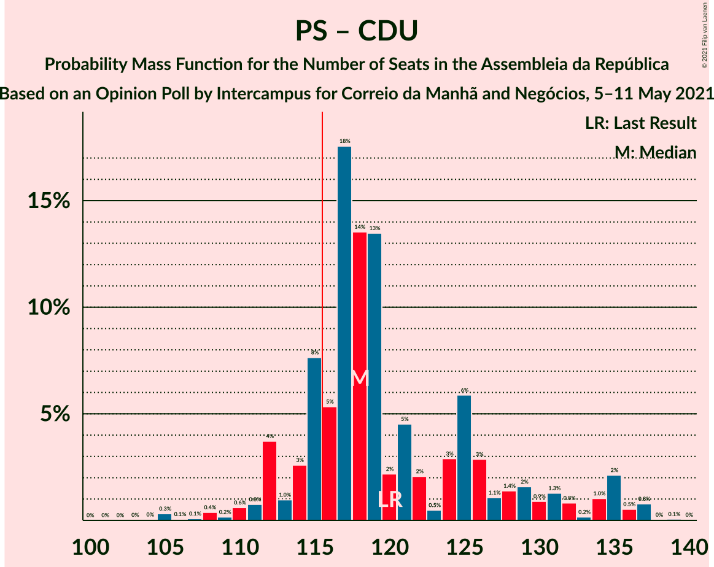

| Number of Seats | Probability | Accumulated | Special Marks |
|:---------------:|:-----------:|:-----------:|:-------------:|
| 103 | 0% | 100% |  |
| 104 | 0% | 99.9% |  |
| 105 | 0.3% | 99.9% |  |
| 106 | 0.1% | 99.6% |  |
| 107 | 0.1% | 99.5% |  |
| 108 | 0.4% | 99.4% |  |
| 109 | 0.2% | 99.1% |  |
| 110 | 0.6% | 98.9% |  |
| 111 | 0.8% | 98% |  |
| 112 | 4% | 98% |  |
| 113 | 1.0% | 94% |  |
| 114 | 3% | 93% |  |
| 115 | 8% | 90% |  |
| 116 | 5% | 83% | Majority |
| 117 | 18% | 77% |  |
| 118 | 14% | 60% | Median |
| 119 | 13% | 46% |  |
| 120 | 2% | 33% | Last Result |
| 121 | 5% | 31% |  |
| 122 | 2% | 26% |  |
| 123 | 0.5% | 24% |  |
| 124 | 3% | 23% |  |
| 125 | 6% | 21% |  |
| 126 | 3% | 15% |  |
| 127 | 1.1% | 12% |  |
| 128 | 1.4% | 11% |  |
| 129 | 2% | 9% |  |
| 130 | 0.9% | 8% |  |
| 131 | 1.3% | 7% |  |
| 132 | 0.8% | 6% |  |
| 133 | 0.2% | 5% |  |
| 134 | 1.0% | 5% |  |
| 135 | 2% | 4% |  |
| 136 | 0.5% | 1.4% |  |
| 137 | 0.8% | 0.9% |  |
| 138 | 0% | 0.1% |  |
| 139 | 0.1% | 0.1% |  |
| 140 | 0% | 0% |  |

### Partido Socialista

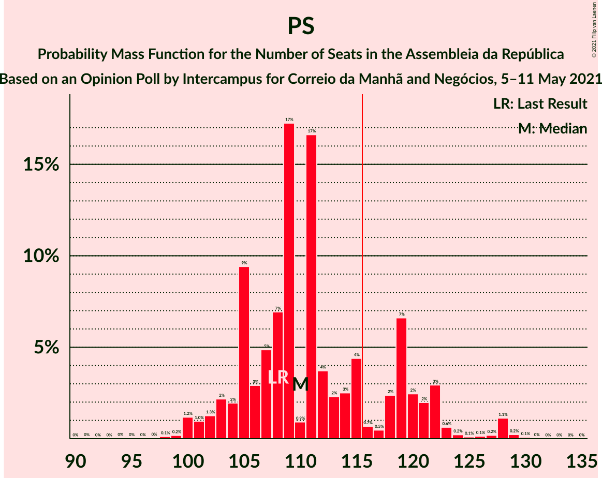

| Number of Seats | Probability | Accumulated | Special Marks |
|:---------------:|:-----------:|:-----------:|:-------------:|
| 94 | 0% | 100% |  |
| 95 | 0% | 99.9% |  |
| 96 | 0% | 99.9% |  |
| 97 | 0% | 99.9% |  |
| 98 | 0.1% | 99.8% |  |
| 99 | 0.2% | 99.7% |  |
| 100 | 1.2% | 99.5% |  |
| 101 | 1.0% | 98% |  |
| 102 | 1.3% | 97% |  |
| 103 | 2% | 96% |  |
| 104 | 2% | 94% |  |
| 105 | 9% | 92% |  |
| 106 | 3% | 83% |  |
| 107 | 5% | 80% |  |
| 108 | 7% | 75% | Last Result |
| 109 | 17% | 68% |  |
| 110 | 0.9% | 51% | Median |
| 111 | 17% | 50% |  |
| 112 | 4% | 33% |  |
| 113 | 2% | 29% |  |
| 114 | 3% | 27% |  |
| 115 | 4% | 25% |  |
| 116 | 0.7% | 20% | Majority |
| 117 | 0.5% | 20% |  |
| 118 | 2% | 19% |  |
| 119 | 7% | 17% |  |
| 120 | 2% | 10% |  |
| 121 | 2% | 8% |  |
| 122 | 3% | 6% |  |
| 123 | 0.6% | 3% |  |
| 124 | 0.2% | 2% |  |
| 125 | 0.1% | 2% |  |
| 126 | 0.1% | 2% |  |
| 127 | 0.2% | 2% |  |
| 128 | 1.1% | 1.5% |  |
| 129 | 0.2% | 0.3% |  |
| 130 | 0.1% | 0.1% |  |
| 131 | 0% | 0% |  |

### Partido Social Democrata – CDS–Partido Popular

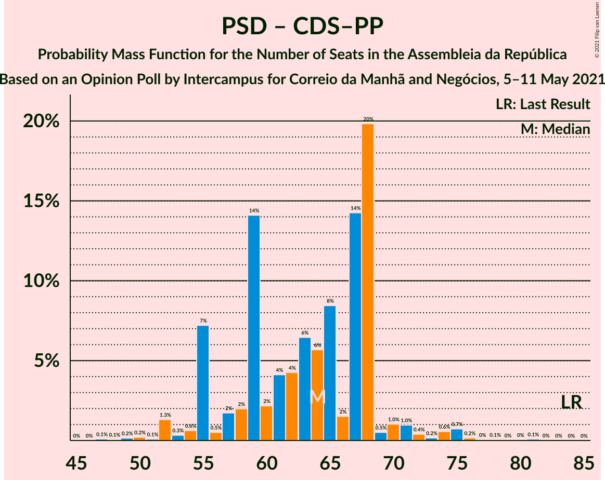

| Number of Seats | Probability | Accumulated | Special Marks |
|:---------------:|:-----------:|:-----------:|:-------------:|
| 47 | 0.1% | 100% |  |
| 48 | 0.1% | 99.9% |  |
| 49 | 0.2% | 99.8% |  |
| 50 | 0.2% | 99.7% |  |
| 51 | 0.1% | 99.5% |  |
| 52 | 1.3% | 99.4% |  |
| 53 | 0.3% | 98% |  |
| 54 | 0.6% | 98% |  |
| 55 | 7% | 97% |  |
| 56 | 0.5% | 90% |  |
| 57 | 2% | 89% |  |
| 58 | 2% | 88% |  |
| 59 | 14% | 86% |  |
| 60 | 2% | 72% |  |
| 61 | 4% | 69% |  |
| 62 | 4% | 65% |  |
| 63 | 6% | 61% |  |
| 64 | 6% | 55% | Median |
| 65 | 8% | 49% |  |
| 66 | 2% | 40% |  |
| 67 | 14% | 39% |  |
| 68 | 20% | 25% |  |
| 69 | 0.5% | 5% |  |
| 70 | 1.0% | 4% |  |
| 71 | 1.0% | 3% |  |
| 72 | 0.4% | 2% |  |
| 73 | 0.2% | 2% |  |
| 74 | 0.6% | 2% |  |
| 75 | 0.7% | 1.2% |  |
| 76 | 0.2% | 0.5% |  |
| 77 | 0% | 0.3% |  |
| 78 | 0.1% | 0.2% |  |
| 79 | 0% | 0.2% |  |
| 80 | 0% | 0.2% |  |
| 81 | 0.1% | 0.1% |  |
| 82 | 0% | 0% |  |
| 83 | 0% | 0% |  |
| 84 | 0% | 0% | Last Result |

## Technical Information

### Opinion Poll

+ **Polling firm:** Intercampus
+ **Commissioner(s):** Correio da Manhã and Negócios
+ **Fieldwork period:** 5–11 May 2021

### Calculations

+ **Sample size:** 611
+ **Simulations done:** 131,072
+ **Error estimate:** 2.00%

