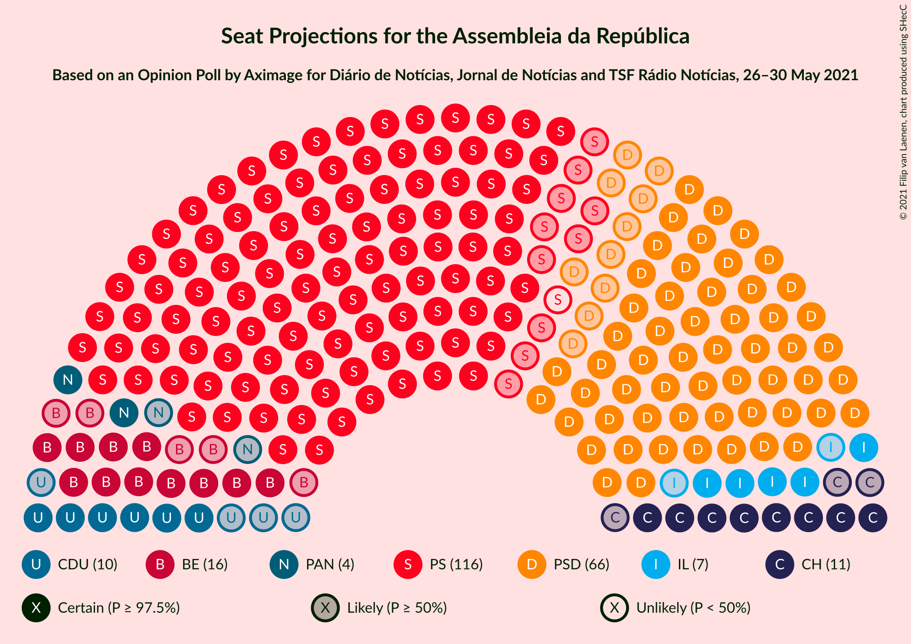
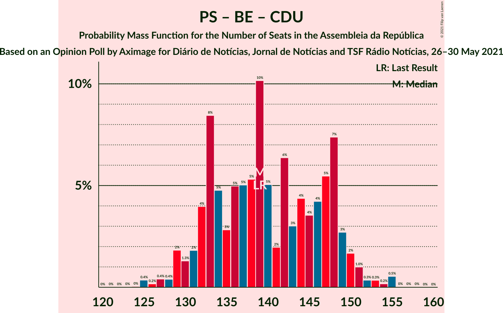

# Opinion Poll by Aximage for Diário de Notícias, Jornal de Notícias and TSF Rádio Notícias, 26–30 May 2021

<a href="#voting-intentions">Voting Intentions</a> | <a href="#seats">Seats</a> | <a href="#coalitions">Coalitions</a> | <a href="#technical-information">Technical Information</a>

## Voting Intentions

### Confidence Intervals

| Party | Last Result | Poll Result | 80% Confidence Interval | 90% Confidence Interval | 95% Confidence Interval | 99% Confidence Interval |
|:-----:|:-----------:|:-----------:|:-----------------------:|:-----------------------:|:-----------------------:|:-----------------------:|
| Partido Socialista | 36.4% | 38.9% | 36.8–41.2% |36.1–41.8% |35.6–42.4% |34.6–43.5% |
| Partido Social Democrata | 27.8% | 24.0% | 22.1–26.0% |21.6–26.6% |21.2–27.1% |20.3–28.1% |
| Bloco de Esquerda | 9.5% | 8.0% | 6.9–9.4% |6.6–9.8% |6.3–10.2% |5.8–10.8% |
| Chega | 1.3% | 7.0% | 6.0–8.3% |5.7–8.7% |5.5–9.0% |5.0–9.7% |
| Coligação Democrática Unitária | 6.3% | 5.7% | 4.7–6.8% |4.5–7.2% |4.3–7.5% |3.8–8.1% |
| Iniciativa Liberal | 1.3% | 5.2% | 4.3–6.3% |4.0–6.6% |3.8–6.9% |3.4–7.5% |
| Pessoas–Animais–Natureza | 3.3% | 3.6% | 2.9–4.6% |2.7–4.9% |2.5–5.2% |2.2–5.7% |
| CDS–Partido Popular | 4.2% | 1.4% | 1.0–2.1% |0.9–2.3% |0.8–2.5% |0.6–2.9% |
| LIVRE | 1.1% | 0.3% | 0.1–0.7% |0.1–0.8% |0.1–0.9% |0.0–1.2% |

*Note:* The poll result column reflects the actual value used in the calculations. Published results may vary slightly, and in addition be rounded to fewer digits.

## Seats

### Confidence Intervals

| Party | Last Result | Median | 80% Confidence Interval | 90% Confidence Interval | 95% Confidence Interval | 99% Confidence Interval |
|:-----:|:-----------:|:------:|:-----------------------:|:-----------------------:|:-----------------------:|:-----------------------:|
| <a href="#partido-socialista">Partido Socialista</a> | 108 | 115 | 108–119 |105–124 |103–124 |103–130 |
| <a href="#partido-social-democrata">Partido Social Democrata</a> | 79 | 68 | 58–72 |58–75 |55–76 |54–76 |
| <a href="#bloco-de-esquerda">Bloco de Esquerda</a> | 19 | 16 | 12–19 |11–21 |11–21 |9–22 |
| <a href="#chega">Chega</a> | 1 | 11 | 10–14 |9–16 |8–19 |8–19 |
| <a href="#coligação-democrática-unitária">Coligação Democrática Unitária</a> | 12 | 10 | 6–13 |6–14 |6–14 |5–16 |
| <a href="#iniciativa-liberal">Iniciativa Liberal</a> | 1 | 7 | 6–11 |6–12 |5–12 |4–14 |
| <a href="#pessoas–animais–natureza">Pessoas–Animais–Natureza</a> | 4 | 4 | 3–6 |2–6 |2–6 |2–9 |
| <a href="#cds–partido-popular">CDS–Partido Popular</a> | 5 | 0 | 0–1 |0–1 |0–1 |0–2 |
| <a href="#livre">LIVRE</a> | 1 | 0 | 0 |0 |0 |0–1 |

### Partido Socialista

*For a full overview of the results for this party, see the [Partido Socialista](party-partidosocialista.html) page.*

| Number of Seats | Probability | Accumulated | Special Marks |
|:---------------:|:-----------:|:-----------:|:-------------:|
| 99 | 0% | 100% |  |
| 100 | 0% | 99.9% |  |
| 101 | 0.2% | 99.9% |  |
| 102 | 0.1% | 99.7% |  |
| 103 | 3% | 99.5% |  |
| 104 | 0.5% | 96% |  |
| 105 | 2% | 96% |  |
| 106 | 1.3% | 94% |  |
| 107 | 2% | 93% |  |
| 108 | 4% | 91% | Last Result |
| 109 | 11% | 87% |  |
| 110 | 6% | 76% |  |
| 111 | 2% | 70% |  |
| 112 | 0.8% | 69% |  |
| 113 | 3% | 68% |  |
| 114 | 6% | 65% |  |
| 115 | 26% | 58% | Median |
| 116 | 2% | 32% | Majority |
| 117 | 5% | 30% |  |
| 118 | 1.1% | 25% |  |
| 119 | 16% | 24% |  |
| 120 | 0.9% | 8% |  |
| 121 | 1.0% | 7% |  |
| 122 | 0.7% | 6% |  |
| 123 | 0.1% | 5% |  |
| 124 | 3% | 5% |  |
| 125 | 0.2% | 2% |  |
| 126 | 0.1% | 2% |  |
| 127 | 0.1% | 2% |  |
| 128 | 0.8% | 2% |  |
| 129 | 0.4% | 1.0% |  |
| 130 | 0.3% | 0.6% |  |
| 131 | 0.2% | 0.2% |  |
| 132 | 0% | 0% |  |

### Partido Social Democrata

*For a full overview of the results for this party, see the [Partido Social Democrata](party-partidosocialdemocrata.html) page.*

| Number of Seats | Probability | Accumulated | Special Marks |
|:---------------:|:-----------:|:-----------:|:-------------:|
| 52 | 0.1% | 100% |  |
| 53 | 0% | 99.9% |  |
| 54 | 0.7% | 99.9% |  |
| 55 | 2% | 99.2% |  |
| 56 | 0.6% | 97% |  |
| 57 | 1.1% | 96% |  |
| 58 | 8% | 95% |  |
| 59 | 0.6% | 88% |  |
| 60 | 0.9% | 87% |  |
| 61 | 0.2% | 86% |  |
| 62 | 0.4% | 86% |  |
| 63 | 16% | 86% |  |
| 64 | 0.6% | 70% |  |
| 65 | 0.7% | 69% |  |
| 66 | 10% | 68% |  |
| 67 | 8% | 59% |  |
| 68 | 9% | 51% | Median |
| 69 | 10% | 42% |  |
| 70 | 4% | 32% |  |
| 71 | 5% | 28% |  |
| 72 | 17% | 24% |  |
| 73 | 1.1% | 7% |  |
| 74 | 0.6% | 6% |  |
| 75 | 2% | 5% |  |
| 76 | 3% | 3% |  |
| 77 | 0.1% | 0.5% |  |
| 78 | 0.3% | 0.4% |  |
| 79 | 0% | 0.1% | Last Result |
| 80 | 0% | 0.1% |  |
| 81 | 0.1% | 0.1% |  |
| 82 | 0% | 0% |  |

### Bloco de Esquerda

*For a full overview of the results for this party, see the [Bloco de Esquerda](party-blocodeesquerda.html) page.*

| Number of Seats | Probability | Accumulated | Special Marks |
|:---------------:|:-----------:|:-----------:|:-------------:|
| 7 | 0.2% | 100% |  |
| 8 | 0.1% | 99.8% |  |
| 9 | 0.7% | 99.6% |  |
| 10 | 0.2% | 99.0% |  |
| 11 | 5% | 98.8% |  |
| 12 | 18% | 94% |  |
| 13 | 5% | 76% |  |
| 14 | 9% | 71% |  |
| 15 | 7% | 62% |  |
| 16 | 22% | 55% | Median |
| 17 | 10% | 33% |  |
| 18 | 11% | 22% |  |
| 19 | 1.2% | 11% | Last Result |
| 20 | 0.8% | 10% |  |
| 21 | 7% | 9% |  |
| 22 | 1.1% | 2% |  |
| 23 | 0.3% | 0.5% |  |
| 24 | 0.1% | 0.1% |  |
| 25 | 0% | 0% |  |

### Chega

*For a full overview of the results for this party, see the [Chega](party-chega.html) page.*

| Number of Seats | Probability | Accumulated | Special Marks |
|:---------------:|:-----------:|:-----------:|:-------------:|
| 1 | 0% | 100% | Last Result |
| 2 | 0% | 100% |  |
| 3 | 0% | 100% |  |
| 4 | 0% | 100% |  |
| 5 | 0.1% | 100% |  |
| 6 | 0% | 99.9% |  |
| 7 | 0.1% | 99.9% |  |
| 8 | 5% | 99.8% |  |
| 9 | 2% | 95% |  |
| 10 | 23% | 93% |  |
| 11 | 37% | 71% | Median |
| 12 | 2% | 34% |  |
| 13 | 3% | 32% |  |
| 14 | 23% | 29% |  |
| 15 | 0.2% | 6% |  |
| 16 | 1.4% | 5% |  |
| 17 | 0.2% | 4% |  |
| 18 | 0.1% | 4% |  |
| 19 | 4% | 4% |  |
| 20 | 0.1% | 0.1% |  |
| 21 | 0% | 0% |  |

### Coligação Democrática Unitária

*For a full overview of the results for this party, see the [Coligação Democrática Unitária](party-coligaçãodemocráticaunitária.html) page.*

| Number of Seats | Probability | Accumulated | Special Marks |
|:---------------:|:-----------:|:-----------:|:-------------:|
| 4 | 0.2% | 100% |  |
| 5 | 0.5% | 99.8% |  |
| 6 | 10% | 99.3% |  |
| 7 | 23% | 89% |  |
| 8 | 10% | 66% |  |
| 9 | 0.3% | 56% |  |
| 10 | 9% | 55% | Median |
| 11 | 20% | 47% |  |
| 12 | 8% | 27% | Last Result |
| 13 | 10% | 18% |  |
| 14 | 6% | 8% |  |
| 15 | 1.2% | 2% |  |
| 16 | 0.9% | 1.2% |  |
| 17 | 0.1% | 0.2% |  |
| 18 | 0.1% | 0.1% |  |
| 19 | 0% | 0% |  |

### Iniciativa Liberal

*For a full overview of the results for this party, see the [Iniciativa Liberal](party-iniciativaliberal.html) page.*

| Number of Seats | Probability | Accumulated | Special Marks |
|:---------------:|:-----------:|:-----------:|:-------------:|
| 1 | 0% | 100% | Last Result |
| 2 | 0% | 100% |  |
| 3 | 0% | 100% |  |
| 4 | 0.6% | 100% |  |
| 5 | 2% | 99.4% |  |
| 6 | 30% | 97% |  |
| 7 | 25% | 68% | Median |
| 8 | 6% | 43% |  |
| 9 | 18% | 37% |  |
| 10 | 7% | 19% |  |
| 11 | 2% | 11% |  |
| 12 | 9% | 10% |  |
| 13 | 0.1% | 0.7% |  |
| 14 | 0.6% | 0.7% |  |
| 15 | 0% | 0% |  |

### Pessoas–Animais–Natureza

*For a full overview of the results for this party, see the [Pessoas–Animais–Natureza](party-pessoas–animais–natureza.html) page.*

| Number of Seats | Probability | Accumulated | Special Marks |
|:---------------:|:-----------:|:-----------:|:-------------:|
| 1 | 0.2% | 100% |  |
| 2 | 9% | 99.8% |  |
| 3 | 22% | 90% |  |
| 4 | 41% | 68% | Last Result, Median |
| 5 | 12% | 27% |  |
| 6 | 13% | 15% |  |
| 7 | 0.8% | 2% |  |
| 8 | 0.7% | 2% |  |
| 9 | 0.5% | 0.8% |  |
| 10 | 0.2% | 0.3% |  |
| 11 | 0.1% | 0.1% |  |
| 12 | 0% | 0% |  |

### CDS–Partido Popular

*For a full overview of the results for this party, see the [CDS–Partido Popular](party-cds–partidopopular.html) page.*

| Number of Seats | Probability | Accumulated | Special Marks |
|:---------------:|:-----------:|:-----------:|:-------------:|
| 0 | 79% | 100% | Median |
| 1 | 19% | 21% |  |
| 2 | 2% | 2% |  |
| 3 | 0.1% | 0.1% |  |
| 4 | 0% | 0% |  |
| 5 | 0% | 0% | Last Result |

### LIVRE

*For a full overview of the results for this party, see the [LIVRE](party-livre.html) page.*

| Number of Seats | Probability | Accumulated | Special Marks |
|:---------------:|:-----------:|:-----------:|:-------------:|
| 0 | 99.5% | 100% | Median |
| 1 | 0.5% | 0.5% | Last Result |
| 2 | 0% | 0% |  |

## Coalitions

### Confidence Intervals

| Coalition | Last Result | Median | Majority? | 80% Confidence Interval | 90% Confidence Interval | 95% Confidence Interval | 99% Confidence Interval |
|:---------:|:-----------:|:------:|:---------:|:-----------------------:|:-----------------------:|:-----------------------:|:-----------------------:|
| Partido Socialista – Bloco de Esquerda – Coligação Democrática Unitária | 139 | 138 | 100% | 133–148 | 131–149 | 131–150 | 129–154 |
| Partido Socialista – Bloco de Esquerda | 127 | 131 | 99.9% | 123–136 | 121–138 | 121–142 | 120–146 |
| Partido Socialista – Coligação Democrática Unitária | 120 | 123 | 93% | 116–130 | 115–132 | 115–134 | 111–138 |
| Partido Socialista | 108 | 115 | 32% | 108–119 | 105–124 | 103–124 | 103–130 |
| Partido Social Democrata – CDS–Partido Popular | 84 | 68 | 0% | 58–72 | 58–75 | 55–76 | 54–77 |

### Partido Socialista – Bloco de Esquerda – Coligação Democrática Unitária

| Number of Seats | Probability | Accumulated | Special Marks |
|:---------------:|:-----------:|:-----------:|:-------------:|
| 121 | 0% | 100% |  |
| 122 | 0% | 99.9% |  |
| 123 | 0% | 99.9% |  |
| 124 | 0% | 99.9% |  |
| 125 | 0% | 99.9% |  |
| 126 | 0% | 99.9% |  |
| 127 | 0.1% | 99.8% |  |
| 128 | 0.1% | 99.7% |  |
| 129 | 0.4% | 99.7% |  |
| 130 | 1.1% | 99.3% |  |
| 131 | 5% | 98% |  |
| 132 | 2% | 94% |  |
| 133 | 3% | 91% |  |
| 134 | 5% | 88% |  |
| 135 | 4% | 83% |  |
| 136 | 5% | 79% |  |
| 137 | 9% | 74% |  |
| 138 | 20% | 65% |  |
| 139 | 5% | 45% | Last Result |
| 140 | 5% | 40% |  |
| 141 | 3% | 35% | Median |
| 142 | 15% | 31% |  |
| 143 | 1.0% | 17% |  |
| 144 | 0.3% | 16% |  |
| 145 | 2% | 15% |  |
| 146 | 0.7% | 14% |  |
| 147 | 1.1% | 13% |  |
| 148 | 7% | 12% |  |
| 149 | 0.2% | 5% |  |
| 150 | 3% | 5% |  |
| 151 | 0.6% | 2% |  |
| 152 | 0.5% | 2% |  |
| 153 | 0.4% | 1.1% |  |
| 154 | 0.5% | 0.7% |  |
| 155 | 0.1% | 0.2% |  |
| 156 | 0% | 0% |  |

### Partido Socialista – Bloco de Esquerda

| Number of Seats | Probability | Accumulated | Special Marks |
|:---------------:|:-----------:|:-----------:|:-------------:|
| 115 | 0.1% | 100% |  |
| 116 | 0.1% | 99.9% | Majority |
| 117 | 0.1% | 99.8% |  |
| 118 | 0% | 99.8% |  |
| 119 | 0.2% | 99.7% |  |
| 120 | 0.2% | 99.5% |  |
| 121 | 5% | 99.4% |  |
| 122 | 3% | 94% |  |
| 123 | 2% | 92% |  |
| 124 | 6% | 90% |  |
| 125 | 5% | 84% |  |
| 126 | 11% | 79% |  |
| 127 | 0.8% | 68% | Last Result |
| 128 | 7% | 67% |  |
| 129 | 7% | 60% |  |
| 130 | 2% | 53% |  |
| 131 | 33% | 52% | Median |
| 132 | 0.3% | 19% |  |
| 133 | 2% | 18% |  |
| 134 | 1.0% | 16% |  |
| 135 | 0.8% | 15% |  |
| 136 | 7% | 14% |  |
| 137 | 1.5% | 7% |  |
| 138 | 0.7% | 6% |  |
| 139 | 0.2% | 5% |  |
| 140 | 0.6% | 5% |  |
| 141 | 0.3% | 4% |  |
| 142 | 2% | 4% |  |
| 143 | 0.2% | 1.2% |  |
| 144 | 0.3% | 1.0% |  |
| 145 | 0.1% | 0.7% |  |
| 146 | 0.3% | 0.6% |  |
| 147 | 0% | 0.3% |  |
| 148 | 0.3% | 0.3% |  |
| 149 | 0% | 0% |  |

### Partido Socialista – Coligação Democrática Unitária

| Number of Seats | Probability | Accumulated | Special Marks |
|:---------------:|:-----------:|:-----------:|:-------------:|
| 109 | 0.1% | 100% |  |
| 110 | 0.2% | 99.9% |  |
| 111 | 0.5% | 99.7% |  |
| 112 | 0.2% | 99.3% |  |
| 113 | 0% | 99.1% |  |
| 114 | 0.2% | 99.0% |  |
| 115 | 6% | 98.9% |  |
| 116 | 7% | 93% | Majority |
| 117 | 0.3% | 86% |  |
| 118 | 0.4% | 85% |  |
| 119 | 4% | 85% |  |
| 120 | 5% | 81% | Last Result |
| 121 | 3% | 76% |  |
| 122 | 18% | 73% |  |
| 123 | 12% | 55% |  |
| 124 | 0.8% | 43% |  |
| 125 | 4% | 42% | Median |
| 126 | 5% | 38% |  |
| 127 | 10% | 33% |  |
| 128 | 0.9% | 23% |  |
| 129 | 0.5% | 22% |  |
| 130 | 14% | 22% |  |
| 131 | 0.8% | 7% |  |
| 132 | 3% | 7% |  |
| 133 | 0.4% | 4% |  |
| 134 | 1.1% | 4% |  |
| 135 | 0.4% | 2% |  |
| 136 | 0.8% | 2% |  |
| 137 | 0.3% | 1.3% |  |
| 138 | 0.8% | 0.9% |  |
| 139 | 0.1% | 0.1% |  |
| 140 | 0% | 0% |  |

### Partido Socialista

| Number of Seats | Probability | Accumulated | Special Marks |
|:---------------:|:-----------:|:-----------:|:-------------:|
| 99 | 0% | 100% |  |
| 100 | 0% | 99.9% |  |
| 101 | 0.2% | 99.9% |  |
| 102 | 0.1% | 99.7% |  |
| 103 | 3% | 99.5% |  |
| 104 | 0.5% | 96% |  |
| 105 | 2% | 96% |  |
| 106 | 1.3% | 94% |  |
| 107 | 2% | 93% |  |
| 108 | 4% | 91% | Last Result |
| 109 | 11% | 87% |  |
| 110 | 6% | 76% |  |
| 111 | 2% | 70% |  |
| 112 | 0.8% | 69% |  |
| 113 | 3% | 68% |  |
| 114 | 6% | 65% |  |
| 115 | 26% | 58% | Median |
| 116 | 2% | 32% | Majority |
| 117 | 5% | 30% |  |
| 118 | 1.1% | 25% |  |
| 119 | 16% | 24% |  |
| 120 | 0.9% | 8% |  |
| 121 | 1.0% | 7% |  |
| 122 | 0.7% | 6% |  |
| 123 | 0.1% | 5% |  |
| 124 | 3% | 5% |  |
| 125 | 0.2% | 2% |  |
| 126 | 0.1% | 2% |  |
| 127 | 0.1% | 2% |  |
| 128 | 0.8% | 2% |  |
| 129 | 0.4% | 1.0% |  |
| 130 | 0.3% | 0.6% |  |
| 131 | 0.2% | 0.2% |  |
| 132 | 0% | 0% |  |

### Partido Social Democrata – CDS–Partido Popular

| Number of Seats | Probability | Accumulated | Special Marks |
|:---------------:|:-----------:|:-----------:|:-------------:|
| 52 | 0.1% | 100% |  |
| 53 | 0% | 99.9% |  |
| 54 | 0.7% | 99.9% |  |
| 55 | 2% | 99.2% |  |
| 56 | 0.6% | 97% |  |
| 57 | 1.1% | 96% |  |
| 58 | 7% | 95% |  |
| 59 | 1.0% | 88% |  |
| 60 | 1.0% | 87% |  |
| 61 | 0.1% | 86% |  |
| 62 | 0.4% | 86% |  |
| 63 | 2% | 86% |  |
| 64 | 14% | 84% |  |
| 65 | 1.0% | 70% |  |
| 66 | 8% | 69% |  |
| 67 | 7% | 60% |  |
| 68 | 10% | 53% | Median |
| 69 | 11% | 43% |  |
| 70 | 5% | 33% |  |
| 71 | 5% | 28% |  |
| 72 | 17% | 24% |  |
| 73 | 1.1% | 7% |  |
| 74 | 0.4% | 6% |  |
| 75 | 2% | 5% |  |
| 76 | 3% | 3% |  |
| 77 | 0.1% | 0.5% |  |
| 78 | 0.2% | 0.4% |  |
| 79 | 0% | 0.2% |  |
| 80 | 0% | 0.1% |  |
| 81 | 0% | 0.1% |  |
| 82 | 0.1% | 0.1% |  |
| 83 | 0% | 0% |  |
| 84 | 0% | 0% | Last Result |

## Technical Information

### Opinion Poll

+ **Polling firm:** Aximage
+ **Commissioner(s):** Diário de Notícias, Jornal de Notícias and TSF Rádio Notícias
+ **Fieldwork period:** 26–30 May 2021

### Calculations

+ **Sample size:** 796
+ **Simulations done:** 131,072
+ **Error estimate:** 4.22%

