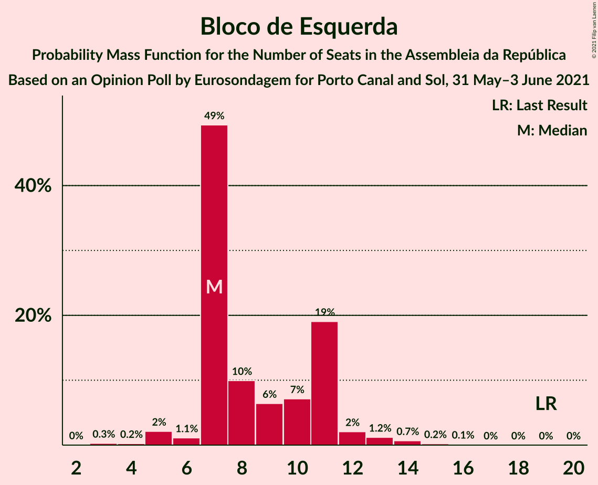
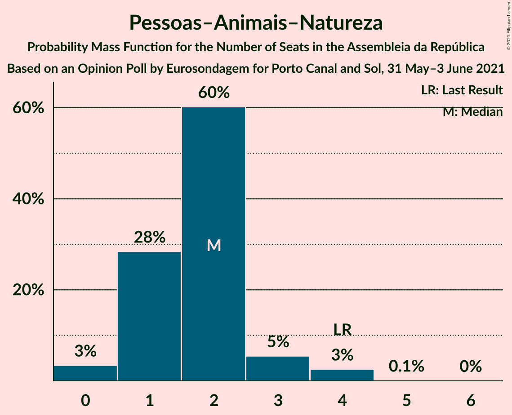

# Opinion Poll by Eurosondagem for Porto Canal and Sol, 31 May–3 June 2021

<a href="#voting-intentions">Voting Intentions</a> | <a href="#seats">Seats</a> | <a href="#coalitions">Coalitions</a> | <a href="#technical-information">Technical Information</a>

## Voting Intentions

### Confidence Intervals

| Party | Last Result | Poll Result | 80% Confidence Interval | 90% Confidence Interval | 95% Confidence Interval | 99% Confidence Interval |
|:-----:|:-----------:|:-----------:|:-----------------------:|:-----------------------:|:-----------------------:|:-----------------------:|
| Partido Socialista | 36.4% | 40.0% | 38.0–42.0% |37.5–42.5% |37.0–43.0% |36.1–44.0% |
| Partido Social Democrata | 27.8% | 27.2% | 25.5–29.1% |25.0–29.6% |24.6–30.1% |23.8–30.9% |
| Chega | 1.3% | 8.4% | 7.4–9.6% |7.1–10.0% |6.9–10.3% |6.4–10.9% |
| Bloco de Esquerda | 9.5% | 5.5% | 4.7–6.5% |4.4–6.8% |4.2–7.1% |3.9–7.6% |
| Coligação Democrática Unitária | 6.3% | 5.0% | 4.2–6.0% |4.0–6.3% |3.8–6.5% |3.5–7.0% |
| Iniciativa Liberal | 1.3% | 2.7% | 2.2–3.5% |2.0–3.7% |1.9–3.9% |1.7–4.3% |
| CDS–Partido Popular | 4.2% | 2.5% | 2.0–3.3% |1.9–3.5% |1.7–3.7% |1.5–4.1% |
| Pessoas–Animais–Natureza | 3.3% | 2.2% | 1.7–2.9% |1.5–3.1% |1.4–3.2% |1.2–3.6% |

*Note:* The poll result column reflects the actual value used in the calculations. Published results may vary slightly, and in addition be rounded to fewer digits.

## Seats

### Confidence Intervals

| Party | Last Result | Median | 80% Confidence Interval | 90% Confidence Interval | 95% Confidence Interval | 99% Confidence Interval |
|:-----:|:-----------:|:------:|:-----------------------:|:-----------------------:|:-----------------------:|:-----------------------:|
| <a href="#partido-socialista">Partido Socialista</a> | 108 | 117 | 110–124 |109–125 |107–126 |103–127 |
| <a href="#partido-social-democrata">Partido Social Democrata</a> | 79 | 75 | 69–82 |68–83 |67–83 |63–87 |
| <a href="#chega">Chega</a> | 1 | 14 | 11–19 |11–21 |11–21 |11–23 |
| <a href="#bloco-de-esquerda">Bloco de Esquerda</a> | 19 | 7 | 7–11 |6–11 |5–13 |4–14 |
| <a href="#coligação-democrática-unitária">Coligação Democrática Unitária</a> | 12 | 7 | 5–10 |5–10 |5–13 |4–14 |
| <a href="#iniciativa-liberal">Iniciativa Liberal</a> | 1 | 3 | 3–5 |2–5 |2–6 |1–6 |
| <a href="#cds–partido-popular">CDS–Partido Popular</a> | 5 | 1 | 1–2 |1–3 |0–4 |0–4 |
| <a href="#pessoas–animais–natureza">Pessoas–Animais–Natureza</a> | 4 | 2 | 1–2 |1–3 |0–3 |0–4 |

### Partido Socialista

*For a full overview of the results for this party, see the [Partido Socialista](party-partidosocialista.html) page.*

| Number of Seats | Probability | Accumulated | Special Marks |
|:---------------:|:-----------:|:-----------:|:-------------:|
| 100 | 0% | 100% |  |
| 101 | 0.1% | 99.9% |  |
| 102 | 0.1% | 99.8% |  |
| 103 | 0.4% | 99.7% |  |
| 104 | 0.1% | 99.3% |  |
| 105 | 0.5% | 99.2% |  |
| 106 | 0.8% | 98.6% |  |
| 107 | 1.3% | 98% |  |
| 108 | 0.8% | 97% | Last Result |
| 109 | 2% | 96% |  |
| 110 | 6% | 93% |  |
| 111 | 8% | 87% |  |
| 112 | 4% | 79% |  |
| 113 | 2% | 76% |  |
| 114 | 7% | 73% |  |
| 115 | 7% | 66% |  |
| 116 | 8% | 59% | Majority |
| 117 | 6% | 51% | Median |
| 118 | 9% | 44% |  |
| 119 | 13% | 36% |  |
| 120 | 6% | 23% |  |
| 121 | 2% | 17% |  |
| 122 | 1.1% | 14% |  |
| 123 | 2% | 13% |  |
| 124 | 5% | 11% |  |
| 125 | 1.2% | 6% |  |
| 126 | 4% | 4% |  |
| 127 | 0.3% | 0.7% |  |
| 128 | 0% | 0.4% |  |
| 129 | 0.1% | 0.4% |  |
| 130 | 0.1% | 0.3% |  |
| 131 | 0% | 0.1% |  |
| 132 | 0% | 0.1% |  |
| 133 | 0.1% | 0.1% |  |
| 134 | 0% | 0% |  |

### Partido Social Democrata

*For a full overview of the results for this party, see the [Partido Social Democrata](party-partidosocialdemocrata.html) page.*

| Number of Seats | Probability | Accumulated | Special Marks |
|:---------------:|:-----------:|:-----------:|:-------------:|
| 61 | 0.1% | 100% |  |
| 62 | 0.1% | 99.9% |  |
| 63 | 0.6% | 99.8% |  |
| 64 | 0.7% | 99.2% |  |
| 65 | 0.2% | 98% |  |
| 66 | 0.4% | 98% |  |
| 67 | 0.9% | 98% |  |
| 68 | 6% | 97% |  |
| 69 | 3% | 91% |  |
| 70 | 5% | 89% |  |
| 71 | 10% | 83% |  |
| 72 | 1.5% | 73% |  |
| 73 | 4% | 72% |  |
| 74 | 6% | 68% |  |
| 75 | 15% | 61% | Median |
| 76 | 8% | 46% |  |
| 77 | 5% | 38% |  |
| 78 | 5% | 33% |  |
| 79 | 9% | 27% | Last Result |
| 80 | 2% | 18% |  |
| 81 | 4% | 16% |  |
| 82 | 6% | 12% |  |
| 83 | 4% | 6% |  |
| 84 | 0.6% | 2% |  |
| 85 | 0.1% | 1.2% |  |
| 86 | 0.4% | 1.0% |  |
| 87 | 0.2% | 0.7% |  |
| 88 | 0.4% | 0.5% |  |
| 89 | 0% | 0.1% |  |
| 90 | 0% | 0% |  |

### Chega

*For a full overview of the results for this party, see the [Chega](party-chega.html) page.*

| Number of Seats | Probability | Accumulated | Special Marks |
|:---------------:|:-----------:|:-----------:|:-------------:|
| 1 | 0% | 100% | Last Result |
| 2 | 0% | 100% |  |
| 3 | 0% | 100% |  |
| 4 | 0% | 100% |  |
| 5 | 0% | 100% |  |
| 6 | 0% | 100% |  |
| 7 | 0% | 100% |  |
| 8 | 0% | 100% |  |
| 9 | 0% | 100% |  |
| 10 | 0.1% | 100% |  |
| 11 | 13% | 99.9% |  |
| 12 | 13% | 87% |  |
| 13 | 11% | 73% |  |
| 14 | 24% | 62% | Median |
| 15 | 4% | 38% |  |
| 16 | 5% | 35% |  |
| 17 | 4% | 30% |  |
| 18 | 14% | 26% |  |
| 19 | 5% | 12% |  |
| 20 | 0.8% | 7% |  |
| 21 | 4% | 7% |  |
| 22 | 0.9% | 2% |  |
| 23 | 1.0% | 1.3% |  |
| 24 | 0.1% | 0.2% |  |
| 25 | 0% | 0.1% |  |
| 26 | 0% | 0.1% |  |
| 27 | 0% | 0% |  |

### Bloco de Esquerda

*For a full overview of the results for this party, see the [Bloco de Esquerda](party-blocodeesquerda.html) page.*

| Number of Seats | Probability | Accumulated | Special Marks |
|:---------------:|:-----------:|:-----------:|:-------------:|
| 3 | 0.3% | 100% |  |
| 4 | 0.4% | 99.7% |  |
| 5 | 3% | 99.3% |  |
| 6 | 3% | 96% |  |
| 7 | 45% | 94% | Median |
| 8 | 4% | 48% |  |
| 9 | 13% | 44% |  |
| 10 | 10% | 31% |  |
| 11 | 17% | 21% |  |
| 12 | 2% | 4% |  |
| 13 | 1.1% | 3% |  |
| 14 | 1.3% | 2% |  |
| 15 | 0.2% | 0.4% |  |
| 16 | 0.1% | 0.2% |  |
| 17 | 0% | 0% |  |
| 18 | 0% | 0% |  |
| 19 | 0% | 0% | Last Result |

### Coligação Democrática Unitária

*For a full overview of the results for this party, see the [Coligação Democrática Unitária](party-coligaçãodemocráticaunitária.html) page.*

| Number of Seats | Probability | Accumulated | Special Marks |
|:---------------:|:-----------:|:-----------:|:-------------:|
| 3 | 0.1% | 100% |  |
| 4 | 0.7% | 99.9% |  |
| 5 | 15% | 99.3% |  |
| 6 | 17% | 85% |  |
| 7 | 25% | 68% | Median |
| 8 | 9% | 43% |  |
| 9 | 13% | 33% |  |
| 10 | 16% | 20% |  |
| 11 | 2% | 5% |  |
| 12 | 0.6% | 3% | Last Result |
| 13 | 2% | 3% |  |
| 14 | 0.5% | 0.8% |  |
| 15 | 0.3% | 0.3% |  |
| 16 | 0% | 0% |  |

### Iniciativa Liberal

*For a full overview of the results for this party, see the [Iniciativa Liberal](party-iniciativaliberal.html) page.*

| Number of Seats | Probability | Accumulated | Special Marks |
|:---------------:|:-----------:|:-----------:|:-------------:|
| 1 | 0.8% | 100% | Last Result |
| 2 | 4% | 99.2% |  |
| 3 | 65% | 95% | Median |
| 4 | 20% | 30% |  |
| 5 | 7% | 10% |  |
| 6 | 3% | 3% |  |
| 7 | 0% | 0% |  |

### CDS–Partido Popular

*For a full overview of the results for this party, see the [CDS–Partido Popular](party-cds–partidopopular.html) page.*

| Number of Seats | Probability | Accumulated | Special Marks |
|:---------------:|:-----------:|:-----------:|:-------------:|
| 0 | 5% | 100% |  |
| 1 | 61% | 95% | Median |
| 2 | 25% | 35% |  |
| 3 | 7% | 9% |  |
| 4 | 2% | 3% |  |
| 5 | 0.3% | 0.3% | Last Result |
| 6 | 0% | 0% |  |

### Pessoas–Animais–Natureza

*For a full overview of the results for this party, see the [Pessoas–Animais–Natureza](party-pessoas–animais–natureza.html) page.*

| Number of Seats | Probability | Accumulated | Special Marks |
|:---------------:|:-----------:|:-----------:|:-------------:|
| 0 | 3% | 100% |  |
| 1 | 37% | 97% |  |
| 2 | 52% | 60% | Median |
| 3 | 6% | 8% |  |
| 4 | 2% | 2% | Last Result |
| 5 | 0.1% | 0.1% |  |
| 6 | 0% | 0% |  |

## Coalitions

### Confidence Intervals

| Coalition | Last Result | Median | Majority? | 80% Confidence Interval | 90% Confidence Interval | 95% Confidence Interval | 99% Confidence Interval |
|:---------:|:-----------:|:------:|:---------:|:-----------------------:|:-----------------------:|:-----------------------:|:-----------------------:|
| Partido Socialista – Bloco de Esquerda – Coligação Democrática Unitária | 139 | 134 | 100% | 125–139 | 124–141 | 123–141 | 120–144 |
| Partido Socialista – Bloco de Esquerda | 127 | 126 | 97% | 118–131 | 116–132 | 115–135 | 112–135 |
| Partido Socialista – Coligação Democrática Unitária | 120 | 124 | 97% | 117–129 | 116–132 | 114–133 | 110–136 |
| Partido Socialista | 108 | 117 | 59% | 110–124 | 109–125 | 107–126 | 103–127 |
| Partido Social Democrata – CDS–Partido Popular | 84 | 76 | 0% | 70–84 | 69–84 | 69–85 | 64–89 |

### Partido Socialista – Bloco de Esquerda – Coligação Democrática Unitária

| Number of Seats | Probability | Accumulated | Special Marks |
|:---------------:|:-----------:|:-----------:|:-------------:|
| 116 | 0.1% | 100% | Majority |
| 117 | 0% | 99.9% |  |
| 118 | 0.2% | 99.8% |  |
| 119 | 0.1% | 99.7% |  |
| 120 | 0.5% | 99.6% |  |
| 121 | 0.8% | 99.1% |  |
| 122 | 0.3% | 98% |  |
| 123 | 3% | 98% |  |
| 124 | 4% | 95% |  |
| 125 | 2% | 91% |  |
| 126 | 6% | 89% |  |
| 127 | 5% | 83% |  |
| 128 | 4% | 79% |  |
| 129 | 2% | 75% |  |
| 130 | 6% | 73% |  |
| 131 | 6% | 66% | Median |
| 132 | 8% | 60% |  |
| 133 | 2% | 52% |  |
| 134 | 12% | 50% |  |
| 135 | 4% | 38% |  |
| 136 | 16% | 34% |  |
| 137 | 3% | 18% |  |
| 138 | 1.4% | 15% |  |
| 139 | 7% | 14% | Last Result |
| 140 | 2% | 7% |  |
| 141 | 4% | 5% |  |
| 142 | 0.1% | 1.0% |  |
| 143 | 0.2% | 0.9% |  |
| 144 | 0.3% | 0.7% |  |
| 145 | 0.1% | 0.4% |  |
| 146 | 0% | 0.3% |  |
| 147 | 0.2% | 0.2% |  |
| 148 | 0% | 0.1% |  |
| 149 | 0% | 0% |  |

### Partido Socialista – Bloco de Esquerda

| Number of Seats | Probability | Accumulated | Special Marks |
|:---------------:|:-----------:|:-----------:|:-------------:|
| 109 | 0.1% | 100% |  |
| 110 | 0.1% | 99.8% |  |
| 111 | 0.1% | 99.8% |  |
| 112 | 0.3% | 99.7% |  |
| 113 | 0.7% | 99.4% |  |
| 114 | 0.8% | 98.7% |  |
| 115 | 0.7% | 98% |  |
| 116 | 2% | 97% | Majority |
| 117 | 4% | 95% |  |
| 118 | 6% | 91% |  |
| 119 | 4% | 85% |  |
| 120 | 3% | 81% |  |
| 121 | 6% | 78% |  |
| 122 | 5% | 72% |  |
| 123 | 5% | 67% |  |
| 124 | 5% | 62% | Median |
| 125 | 3% | 57% |  |
| 126 | 8% | 54% |  |
| 127 | 16% | 46% | Last Result |
| 128 | 5% | 29% |  |
| 129 | 7% | 24% |  |
| 130 | 4% | 17% |  |
| 131 | 7% | 13% |  |
| 132 | 2% | 6% |  |
| 133 | 0.5% | 5% |  |
| 134 | 0.6% | 4% |  |
| 135 | 3% | 4% |  |
| 136 | 0.1% | 0.5% |  |
| 137 | 0.1% | 0.4% |  |
| 138 | 0.1% | 0.3% |  |
| 139 | 0.1% | 0.2% |  |
| 140 | 0.1% | 0.1% |  |
| 141 | 0% | 0% |  |

### Partido Socialista – Coligação Democrática Unitária

| Number of Seats | Probability | Accumulated | Special Marks |
|:---------------:|:-----------:|:-----------:|:-------------:|
| 107 | 0.1% | 100% |  |
| 108 | 0% | 99.9% |  |
| 109 | 0.1% | 99.9% |  |
| 110 | 0.3% | 99.8% |  |
| 111 | 0.3% | 99.5% |  |
| 112 | 0.1% | 99.1% |  |
| 113 | 1.0% | 99.0% |  |
| 114 | 0.7% | 98% |  |
| 115 | 0.4% | 97% |  |
| 116 | 4% | 97% | Majority |
| 117 | 5% | 93% |  |
| 118 | 1.2% | 87% |  |
| 119 | 6% | 86% |  |
| 120 | 5% | 80% | Last Result |
| 121 | 7% | 75% |  |
| 122 | 5% | 68% |  |
| 123 | 7% | 62% |  |
| 124 | 7% | 56% | Median |
| 125 | 6% | 49% |  |
| 126 | 5% | 43% |  |
| 127 | 16% | 38% |  |
| 128 | 1.0% | 22% |  |
| 129 | 11% | 21% |  |
| 130 | 2% | 10% |  |
| 131 | 1.3% | 8% |  |
| 132 | 4% | 7% |  |
| 133 | 1.5% | 3% |  |
| 134 | 0.7% | 1.4% |  |
| 135 | 0.2% | 0.7% |  |
| 136 | 0.1% | 0.5% |  |
| 137 | 0.2% | 0.5% |  |
| 138 | 0.1% | 0.3% |  |
| 139 | 0% | 0.2% |  |
| 140 | 0.1% | 0.1% |  |
| 141 | 0% | 0% |  |

### Partido Socialista

| Number of Seats | Probability | Accumulated | Special Marks |
|:---------------:|:-----------:|:-----------:|:-------------:|
| 100 | 0% | 100% |  |
| 101 | 0.1% | 99.9% |  |
| 102 | 0.1% | 99.8% |  |
| 103 | 0.4% | 99.7% |  |
| 104 | 0.1% | 99.3% |  |
| 105 | 0.5% | 99.2% |  |
| 106 | 0.8% | 98.6% |  |
| 107 | 1.3% | 98% |  |
| 108 | 0.8% | 97% | Last Result |
| 109 | 2% | 96% |  |
| 110 | 6% | 93% |  |
| 111 | 8% | 87% |  |
| 112 | 4% | 79% |  |
| 113 | 2% | 76% |  |
| 114 | 7% | 73% |  |
| 115 | 7% | 66% |  |
| 116 | 8% | 59% | Majority |
| 117 | 6% | 51% | Median |
| 118 | 9% | 44% |  |
| 119 | 13% | 36% |  |
| 120 | 6% | 23% |  |
| 121 | 2% | 17% |  |
| 122 | 1.1% | 14% |  |
| 123 | 2% | 13% |  |
| 124 | 5% | 11% |  |
| 125 | 1.2% | 6% |  |
| 126 | 4% | 4% |  |
| 127 | 0.3% | 0.7% |  |
| 128 | 0% | 0.4% |  |
| 129 | 0.1% | 0.4% |  |
| 130 | 0.1% | 0.3% |  |
| 131 | 0% | 0.1% |  |
| 132 | 0% | 0.1% |  |
| 133 | 0.1% | 0.1% |  |
| 134 | 0% | 0% |  |

### Partido Social Democrata – CDS–Partido Popular

| Number of Seats | Probability | Accumulated | Special Marks |
|:---------------:|:-----------:|:-----------:|:-------------:|
| 63 | 0% | 100% |  |
| 64 | 0.7% | 99.9% |  |
| 65 | 0.3% | 99.2% |  |
| 66 | 0.6% | 99.0% |  |
| 67 | 0.3% | 98% |  |
| 68 | 0.5% | 98% |  |
| 69 | 6% | 98% |  |
| 70 | 2% | 91% |  |
| 71 | 5% | 90% |  |
| 72 | 8% | 85% |  |
| 73 | 3% | 77% |  |
| 74 | 3% | 75% |  |
| 75 | 9% | 71% |  |
| 76 | 15% | 63% | Median |
| 77 | 4% | 47% |  |
| 78 | 8% | 43% |  |
| 79 | 3% | 35% |  |
| 80 | 12% | 31% |  |
| 81 | 2% | 19% |  |
| 82 | 3% | 17% |  |
| 83 | 5% | 15% |  |
| 84 | 6% | 10% | Last Result |
| 85 | 2% | 4% |  |
| 86 | 0.7% | 2% |  |
| 87 | 0.4% | 1.1% |  |
| 88 | 0.1% | 0.7% |  |
| 89 | 0.4% | 0.6% |  |
| 90 | 0.2% | 0.2% |  |
| 91 | 0% | 0.1% |  |
| 92 | 0% | 0% |  |

## Technical Information

### Opinion Poll

+ **Polling firm:** Eurosondagem
+ **Commissioner(s):** Porto Canal and Sol
+ **Fieldwork period:** 31 May–3 June 2021

### Calculations

+ **Sample size:** 1021
+ **Simulations done:** 131,072
+ **Error estimate:** 2.71%

