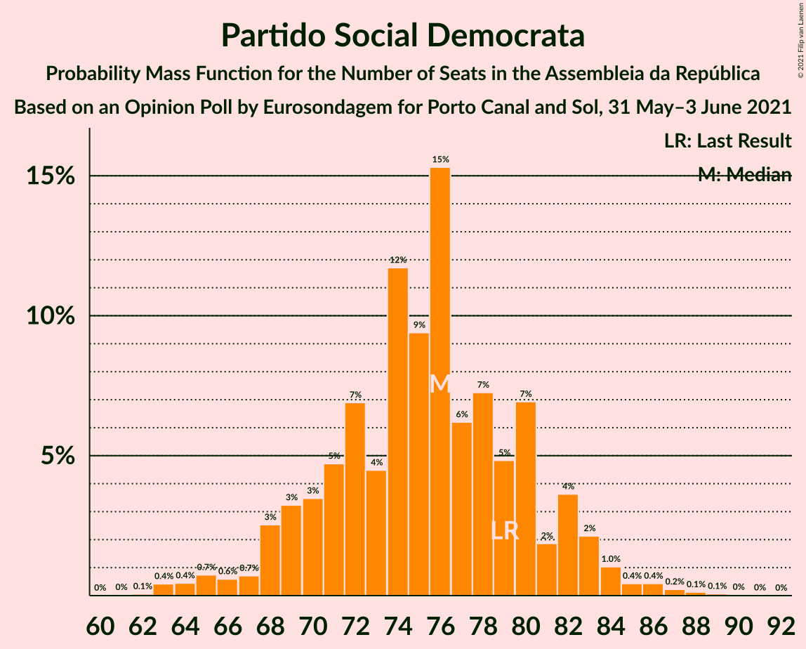

# Opinion Poll by Eurosondagem for Porto Canal and Sol, 31 May–3 June 2021

<a href="#voting-intentions">Voting Intentions</a> | <a href="#seats">Seats</a> | <a href="#coalitions">Coalitions</a> | <a href="#technical-information">Technical Information</a>

## Voting Intentions

### Confidence Intervals

| Party | Last Result | Poll Result | 80% Confidence Interval | 90% Confidence Interval | 95% Confidence Interval | 99% Confidence Interval |
|:-----:|:-----------:|:-----------:|:-----------------------:|:-----------------------:|:-----------------------:|:-----------------------:|
| Partido Socialista | 36.4% | 40.0% | 38.0–42.0% |37.5–42.5% |37.0–43.0% |36.1–44.0% |
| Partido Social Democrata | 27.8% | 27.2% | 25.5–29.1% |25.0–29.6% |24.6–30.1% |23.8–30.9% |
| Chega | 1.3% | 8.4% | 7.4–9.6% |7.1–10.0% |6.9–10.3% |6.4–10.9% |
| Bloco de Esquerda | 9.5% | 5.5% | 4.7–6.5% |4.4–6.8% |4.2–7.1% |3.9–7.6% |
| Coligação Democrática Unitária | 6.3% | 5.0% | 4.2–6.0% |4.0–6.3% |3.8–6.5% |3.5–7.0% |
| Iniciativa Liberal | 1.3% | 2.7% | 2.2–3.5% |2.0–3.7% |1.9–3.9% |1.7–4.3% |
| CDS–Partido Popular | 4.2% | 2.5% | 2.0–3.3% |1.9–3.5% |1.7–3.7% |1.5–4.1% |
| Pessoas–Animais–Natureza | 3.3% | 2.2% | 1.7–2.9% |1.5–3.1% |1.4–3.2% |1.2–3.6% |

*Note:* The poll result column reflects the actual value used in the calculations. Published results may vary slightly, and in addition be rounded to fewer digits.

## Seats

### Confidence Intervals

| Party | Last Result | Median | 80% Confidence Interval | 90% Confidence Interval | 95% Confidence Interval | 99% Confidence Interval |
|:-----:|:-----------:|:------:|:-----------------------:|:-----------------------:|:-----------------------:|:-----------------------:|
| <a href="#partido-socialista">Partido Socialista</a> | 108 | 117 | 110–122 |109–123 |107–125 |104–128 |
| <a href="#partido-social-democrata">Partido Social Democrata</a> | 79 | 76 | 70–81 |68–82 |67–83 |63–86 |
| <a href="#chega">Chega</a> | 1 | 14 | 11–18 |11–20 |11–21 |11–23 |
| <a href="#bloco-de-esquerda">Bloco de Esquerda</a> | 19 | 7 | 7–11 |7–11 |5–12 |4–14 |
| <a href="#coligação-democrática-unitária">Coligação Democrática Unitária</a> | 12 | 7 | 6–10 |5–10 |5–12 |4–14 |
| <a href="#iniciativa-liberal">Iniciativa Liberal</a> | 1 | 3 | 3–4 |3–5 |2–5 |1–6 |
| <a href="#cds–partido-popular">CDS–Partido Popular</a> | 5 | 1 | 1–2 |1–3 |0–3 |0–4 |
| <a href="#pessoas–animais–natureza">Pessoas–Animais–Natureza</a> | 4 | 2 | 1–2 |1–3 |0–4 |0–4 |

### Partido Socialista

*For a full overview of the results for this party, see the [Partido Socialista](party-partidosocialista.html) page.*

| Number of Seats | Probability | Accumulated | Special Marks |
|:---------------:|:-----------:|:-----------:|:-------------:|
| 101 | 0% | 100% |  |
| 102 | 0.1% | 99.9% |  |
| 103 | 0.1% | 99.8% |  |
| 104 | 0.3% | 99.7% |  |
| 105 | 0.4% | 99.4% |  |
| 106 | 0.9% | 99.0% |  |
| 107 | 1.1% | 98% |  |
| 108 | 2% | 97% | Last Result |
| 109 | 2% | 95% |  |
| 110 | 4% | 93% |  |
| 111 | 3% | 89% |  |
| 112 | 5% | 86% |  |
| 113 | 9% | 81% |  |
| 114 | 7% | 72% |  |
| 115 | 6% | 65% |  |
| 116 | 8% | 59% | Majority |
| 117 | 10% | 52% | Median |
| 118 | 10% | 42% |  |
| 119 | 10% | 32% |  |
| 120 | 7% | 22% |  |
| 121 | 5% | 15% |  |
| 122 | 3% | 10% |  |
| 123 | 2% | 7% |  |
| 124 | 1.4% | 4% |  |
| 125 | 1.1% | 3% |  |
| 126 | 0.6% | 2% |  |
| 127 | 0.3% | 1.0% |  |
| 128 | 0.2% | 0.7% |  |
| 129 | 0.2% | 0.5% |  |
| 130 | 0.1% | 0.3% |  |
| 131 | 0.1% | 0.1% |  |
| 132 | 0% | 0.1% |  |
| 133 | 0% | 0.1% |  |
| 134 | 0% | 0% |  |

### Partido Social Democrata

*For a full overview of the results for this party, see the [Partido Social Democrata](party-partidosocialdemocrata.html) page.*

| Number of Seats | Probability | Accumulated | Special Marks |
|:---------------:|:-----------:|:-----------:|:-------------:|
| 62 | 0.1% | 100% |  |
| 63 | 0.4% | 99.9% |  |
| 64 | 0.4% | 99.5% |  |
| 65 | 0.7% | 99.0% |  |
| 66 | 0.6% | 98% |  |
| 67 | 0.7% | 98% |  |
| 68 | 3% | 97% |  |
| 69 | 3% | 94% |  |
| 70 | 3% | 91% |  |
| 71 | 5% | 88% |  |
| 72 | 7% | 83% |  |
| 73 | 4% | 76% |  |
| 74 | 12% | 72% |  |
| 75 | 9% | 60% |  |
| 76 | 15% | 51% | Median |
| 77 | 6% | 35% |  |
| 78 | 7% | 29% |  |
| 79 | 5% | 22% | Last Result |
| 80 | 7% | 17% |  |
| 81 | 2% | 10% |  |
| 82 | 4% | 8% |  |
| 83 | 2% | 5% |  |
| 84 | 1.0% | 2% |  |
| 85 | 0.4% | 1.3% |  |
| 86 | 0.4% | 0.9% |  |
| 87 | 0.2% | 0.5% |  |
| 88 | 0.1% | 0.3% |  |
| 89 | 0.1% | 0.1% |  |
| 90 | 0% | 0.1% |  |
| 91 | 0% | 0% |  |

### Chega

*For a full overview of the results for this party, see the [Chega](party-chega.html) page.*

| Number of Seats | Probability | Accumulated | Special Marks |
|:---------------:|:-----------:|:-----------:|:-------------:|
| 1 | 0% | 100% | Last Result |
| 2 | 0% | 100% |  |
| 3 | 0% | 100% |  |
| 4 | 0% | 100% |  |
| 5 | 0% | 100% |  |
| 6 | 0% | 100% |  |
| 7 | 0% | 100% |  |
| 8 | 0% | 100% |  |
| 9 | 0% | 100% |  |
| 10 | 0.1% | 100% |  |
| 11 | 10% | 99.8% |  |
| 12 | 5% | 90% |  |
| 13 | 19% | 84% |  |
| 14 | 24% | 66% | Median |
| 15 | 3% | 42% |  |
| 16 | 8% | 38% |  |
| 17 | 7% | 30% |  |
| 18 | 15% | 23% |  |
| 19 | 3% | 9% |  |
| 20 | 2% | 6% |  |
| 21 | 2% | 4% |  |
| 22 | 1.1% | 2% |  |
| 23 | 0.8% | 1.1% |  |
| 24 | 0.1% | 0.2% |  |
| 25 | 0% | 0.1% |  |
| 26 | 0% | 0.1% |  |
| 27 | 0% | 0% |  |

### Bloco de Esquerda

*For a full overview of the results for this party, see the [Bloco de Esquerda](party-blocodeesquerda.html) page.*

| Number of Seats | Probability | Accumulated | Special Marks |
|:---------------:|:-----------:|:-----------:|:-------------:|
| 3 | 0.3% | 100% |  |
| 4 | 0.2% | 99.7% |  |
| 5 | 2% | 99.4% |  |
| 6 | 1.1% | 97% |  |
| 7 | 49% | 96% | Median |
| 8 | 10% | 47% |  |
| 9 | 6% | 37% |  |
| 10 | 7% | 30% |  |
| 11 | 19% | 23% |  |
| 12 | 2% | 4% |  |
| 13 | 1.2% | 2% |  |
| 14 | 0.7% | 1.0% |  |
| 15 | 0.2% | 0.4% |  |
| 16 | 0.1% | 0.1% |  |
| 17 | 0% | 0% |  |
| 18 | 0% | 0% |  |
| 19 | 0% | 0% | Last Result |

### Coligação Democrática Unitária

*For a full overview of the results for this party, see the [Coligação Democrática Unitária](party-coligaçãodemocráticaunitária.html) page.*

| Number of Seats | Probability | Accumulated | Special Marks |
|:---------------:|:-----------:|:-----------:|:-------------:|
| 4 | 0.5% | 100% |  |
| 5 | 9% | 99.4% |  |
| 6 | 24% | 90% |  |
| 7 | 29% | 66% | Median |
| 8 | 10% | 37% |  |
| 9 | 12% | 27% |  |
| 10 | 10% | 15% |  |
| 11 | 2% | 4% |  |
| 12 | 0.7% | 3% | Last Result |
| 13 | 1.1% | 2% |  |
| 14 | 0.8% | 1.0% |  |
| 15 | 0.2% | 0.2% |  |
| 16 | 0% | 0% |  |

### Iniciativa Liberal

*For a full overview of the results for this party, see the [Iniciativa Liberal](party-iniciativaliberal.html) page.*

| Number of Seats | Probability | Accumulated | Special Marks |
|:---------------:|:-----------:|:-----------:|:-------------:|
| 1 | 0.7% | 100% | Last Result |
| 2 | 3% | 99.3% |  |
| 3 | 69% | 96% | Median |
| 4 | 19% | 27% |  |
| 5 | 7% | 8% |  |
| 6 | 1.4% | 1.4% |  |
| 7 | 0% | 0% |  |

### CDS–Partido Popular

*For a full overview of the results for this party, see the [CDS–Partido Popular](party-cds–partidopopular.html) page.*

| Number of Seats | Probability | Accumulated | Special Marks |
|:---------------:|:-----------:|:-----------:|:-------------:|
| 0 | 4% | 100% |  |
| 1 | 46% | 96% | Median |
| 2 | 45% | 50% |  |
| 3 | 3% | 5% |  |
| 4 | 1.5% | 2% |  |
| 5 | 0.3% | 0.3% | Last Result |
| 6 | 0% | 0% |  |

### Pessoas–Animais–Natureza

*For a full overview of the results for this party, see the [Pessoas–Animais–Natureza](party-pessoas–animais–natureza.html) page.*

| Number of Seats | Probability | Accumulated | Special Marks |
|:---------------:|:-----------:|:-----------:|:-------------:|
| 0 | 3% | 100% |  |
| 1 | 28% | 97% |  |
| 2 | 60% | 68% | Median |
| 3 | 5% | 8% |  |
| 4 | 3% | 3% | Last Result |
| 5 | 0.1% | 0.1% |  |
| 6 | 0% | 0% |  |

## Coalitions

### Confidence Intervals

| Coalition | Last Result | Median | Majority? | 80% Confidence Interval | 90% Confidence Interval | 95% Confidence Interval | 99% Confidence Interval |
|:---------:|:-----------:|:------:|:---------:|:-----------------------:|:-----------------------:|:-----------------------:|:-----------------------:|
| Partido Socialista – Bloco de Esquerda – Coligação Democrática Unitária | 139 | 133 | 100% | 126–137 | 124–139 | 123–140 | 120–144 |
| Partido Socialista – Bloco de Esquerda | 127 | 125 | 97% | 119–130 | 117–131 | 115–133 | 112–136 |
| Partido Socialista – Coligação Democrática Unitária | 120 | 124 | 96% | 117–129 | 116–130 | 115–132 | 112–137 |
| Partido Socialista | 108 | 117 | 59% | 110–122 | 109–123 | 107–125 | 104–128 |
| Partido Social Democrata – CDS–Partido Popular | 84 | 77 | 0% | 71–82 | 70–84 | 68–85 | 65–88 |

### Partido Socialista – Bloco de Esquerda – Coligação Democrática Unitária

| Number of Seats | Probability | Accumulated | Special Marks |
|:---------------:|:-----------:|:-----------:|:-------------:|
| 116 | 0% | 100% | Majority |
| 117 | 0% | 99.9% |  |
| 118 | 0.1% | 99.9% |  |
| 119 | 0.2% | 99.8% |  |
| 120 | 0.2% | 99.5% |  |
| 121 | 0.4% | 99.3% |  |
| 122 | 0.7% | 98.9% |  |
| 123 | 1.0% | 98% |  |
| 124 | 2% | 97% |  |
| 125 | 3% | 95% |  |
| 126 | 6% | 92% |  |
| 127 | 5% | 86% |  |
| 128 | 5% | 82% |  |
| 129 | 5% | 77% |  |
| 130 | 6% | 71% |  |
| 131 | 7% | 65% | Median |
| 132 | 7% | 58% |  |
| 133 | 11% | 51% |  |
| 134 | 6% | 40% |  |
| 135 | 11% | 34% |  |
| 136 | 8% | 22% |  |
| 137 | 5% | 14% |  |
| 138 | 2% | 9% |  |
| 139 | 3% | 7% | Last Result |
| 140 | 0.8% | 3% |  |
| 141 | 0.8% | 2% |  |
| 142 | 0.5% | 2% |  |
| 143 | 0.2% | 1.1% |  |
| 144 | 0.4% | 0.9% |  |
| 145 | 0.2% | 0.4% |  |
| 146 | 0.2% | 0.3% |  |
| 147 | 0.1% | 0.1% |  |
| 148 | 0% | 0.1% |  |
| 149 | 0% | 0% |  |

### Partido Socialista – Bloco de Esquerda

| Number of Seats | Probability | Accumulated | Special Marks |
|:---------------:|:-----------:|:-----------:|:-------------:|
| 109 | 0% | 100% |  |
| 110 | 0.1% | 99.9% |  |
| 111 | 0.2% | 99.8% |  |
| 112 | 0.2% | 99.7% |  |
| 113 | 0.4% | 99.5% |  |
| 114 | 0.5% | 99.1% |  |
| 115 | 1.0% | 98.5% |  |
| 116 | 1.2% | 97% | Majority |
| 117 | 2% | 96% |  |
| 118 | 3% | 94% |  |
| 119 | 4% | 91% |  |
| 120 | 7% | 87% |  |
| 121 | 4% | 80% |  |
| 122 | 5% | 75% |  |
| 123 | 10% | 70% |  |
| 124 | 6% | 61% | Median |
| 125 | 9% | 55% |  |
| 126 | 12% | 46% |  |
| 127 | 6% | 33% | Last Result |
| 128 | 9% | 27% |  |
| 129 | 6% | 18% |  |
| 130 | 4% | 13% |  |
| 131 | 5% | 9% |  |
| 132 | 2% | 4% |  |
| 133 | 0.6% | 3% |  |
| 134 | 0.8% | 2% |  |
| 135 | 0.7% | 1.4% |  |
| 136 | 0.2% | 0.7% |  |
| 137 | 0.2% | 0.4% |  |
| 138 | 0.1% | 0.2% |  |
| 139 | 0.1% | 0.2% |  |
| 140 | 0% | 0.1% |  |
| 141 | 0% | 0.1% |  |
| 142 | 0% | 0% |  |

### Partido Socialista – Coligação Democrática Unitária

| Number of Seats | Probability | Accumulated | Special Marks |
|:---------------:|:-----------:|:-----------:|:-------------:|
| 108 | 0% | 100% |  |
| 109 | 0% | 99.9% |  |
| 110 | 0.1% | 99.9% |  |
| 111 | 0.2% | 99.8% |  |
| 112 | 0.4% | 99.5% |  |
| 113 | 0.4% | 99.1% |  |
| 114 | 0.7% | 98.7% |  |
| 115 | 2% | 98% |  |
| 116 | 3% | 96% | Majority |
| 117 | 4% | 93% |  |
| 118 | 2% | 90% |  |
| 119 | 7% | 87% |  |
| 120 | 6% | 80% | Last Result |
| 121 | 5% | 74% |  |
| 122 | 7% | 69% |  |
| 123 | 5% | 62% |  |
| 124 | 10% | 56% | Median |
| 125 | 7% | 46% |  |
| 126 | 12% | 39% |  |
| 127 | 8% | 27% |  |
| 128 | 6% | 19% |  |
| 129 | 5% | 13% |  |
| 130 | 3% | 8% |  |
| 131 | 1.1% | 5% |  |
| 132 | 2% | 4% |  |
| 133 | 0.6% | 2% |  |
| 134 | 0.5% | 1.4% |  |
| 135 | 0.2% | 0.9% |  |
| 136 | 0.2% | 0.7% |  |
| 137 | 0.2% | 0.5% |  |
| 138 | 0.1% | 0.3% |  |
| 139 | 0.1% | 0.2% |  |
| 140 | 0% | 0.1% |  |
| 141 | 0% | 0% |  |

### Partido Socialista

| Number of Seats | Probability | Accumulated | Special Marks |
|:---------------:|:-----------:|:-----------:|:-------------:|
| 101 | 0% | 100% |  |
| 102 | 0.1% | 99.9% |  |
| 103 | 0.1% | 99.8% |  |
| 104 | 0.3% | 99.7% |  |
| 105 | 0.4% | 99.4% |  |
| 106 | 0.9% | 99.0% |  |
| 107 | 1.1% | 98% |  |
| 108 | 2% | 97% | Last Result |
| 109 | 2% | 95% |  |
| 110 | 4% | 93% |  |
| 111 | 3% | 89% |  |
| 112 | 5% | 86% |  |
| 113 | 9% | 81% |  |
| 114 | 7% | 72% |  |
| 115 | 6% | 65% |  |
| 116 | 8% | 59% | Majority |
| 117 | 10% | 52% | Median |
| 118 | 10% | 42% |  |
| 119 | 10% | 32% |  |
| 120 | 7% | 22% |  |
| 121 | 5% | 15% |  |
| 122 | 3% | 10% |  |
| 123 | 2% | 7% |  |
| 124 | 1.4% | 4% |  |
| 125 | 1.1% | 3% |  |
| 126 | 0.6% | 2% |  |
| 127 | 0.3% | 1.0% |  |
| 128 | 0.2% | 0.7% |  |
| 129 | 0.2% | 0.5% |  |
| 130 | 0.1% | 0.3% |  |
| 131 | 0.1% | 0.1% |  |
| 132 | 0% | 0.1% |  |
| 133 | 0% | 0.1% |  |
| 134 | 0% | 0% |  |

### Partido Social Democrata – CDS–Partido Popular

| Number of Seats | Probability | Accumulated | Special Marks |
|:---------------:|:-----------:|:-----------:|:-------------:|
| 63 | 0% | 100% |  |
| 64 | 0.2% | 99.9% |  |
| 65 | 0.5% | 99.7% |  |
| 66 | 0.5% | 99.2% |  |
| 67 | 0.8% | 98.7% |  |
| 68 | 0.4% | 98% |  |
| 69 | 2% | 97% |  |
| 70 | 3% | 96% |  |
| 71 | 3% | 92% |  |
| 72 | 4% | 90% |  |
| 73 | 6% | 86% |  |
| 74 | 6% | 80% |  |
| 75 | 9% | 74% |  |
| 76 | 12% | 66% |  |
| 77 | 9% | 54% | Median |
| 78 | 13% | 45% |  |
| 79 | 7% | 33% |  |
| 80 | 7% | 26% |  |
| 81 | 4% | 19% |  |
| 82 | 5% | 14% |  |
| 83 | 2% | 9% |  |
| 84 | 3% | 7% | Last Result |
| 85 | 1.5% | 3% |  |
| 86 | 0.8% | 2% |  |
| 87 | 0.5% | 1.1% |  |
| 88 | 0.3% | 0.6% |  |
| 89 | 0.2% | 0.4% |  |
| 90 | 0.1% | 0.2% |  |
| 91 | 0.1% | 0.1% |  |
| 92 | 0% | 0% |  |

## Technical Information

### Opinion Poll

+ **Polling firm:** Eurosondagem
+ **Commissioner(s):** Porto Canal and Sol
+ **Fieldwork period:** 31 May–3 June 2021

### Calculations

+ **Sample size:** 1021
+ **Simulations done:** 1,048,576
+ **Error estimate:** 1.40%

