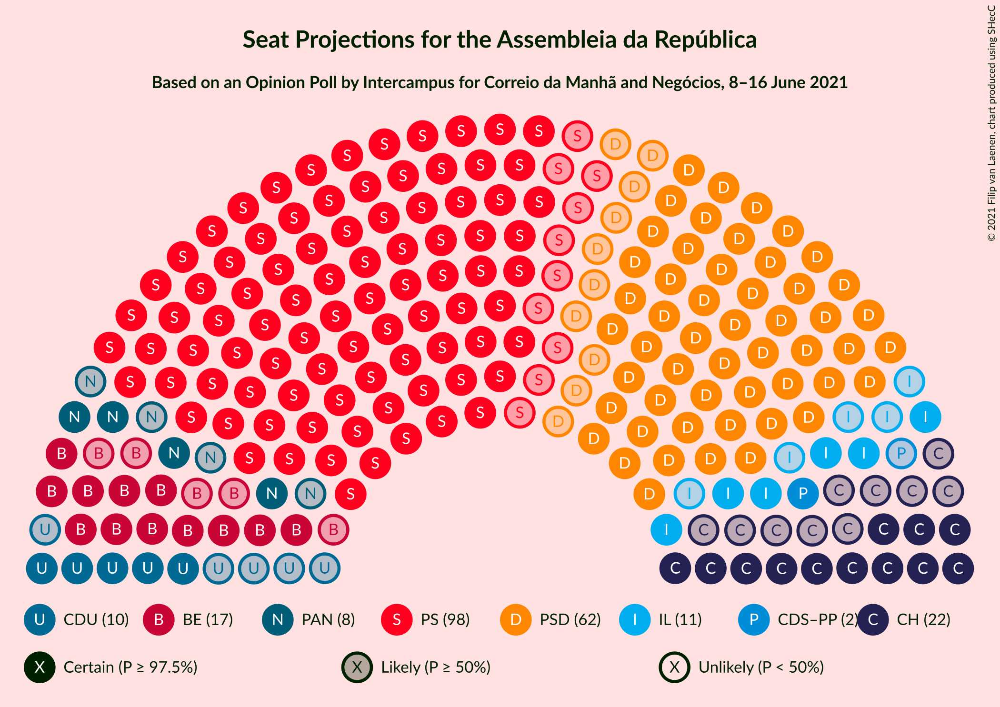
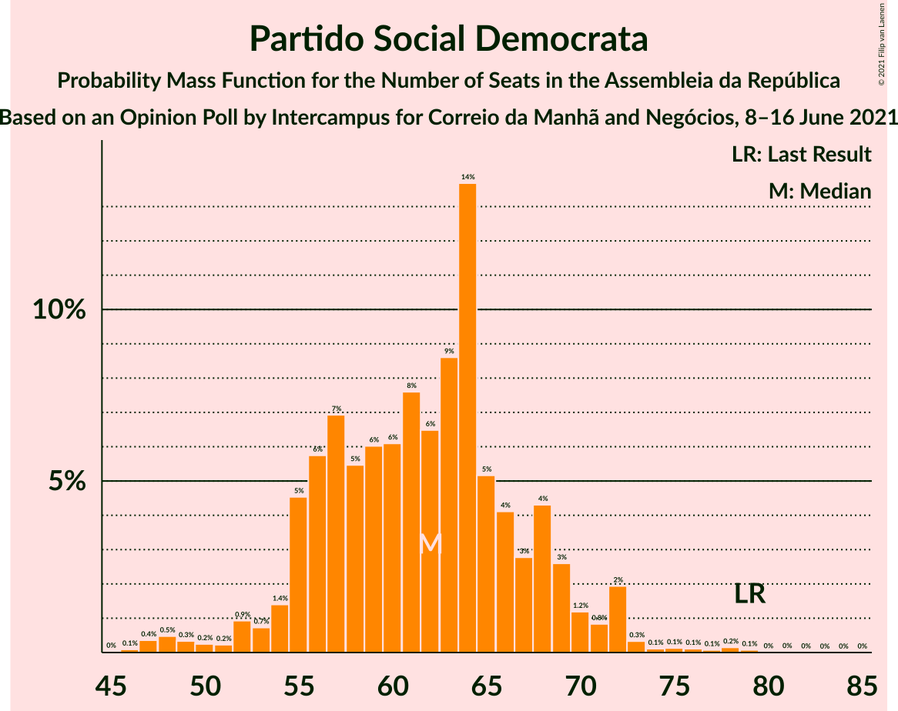
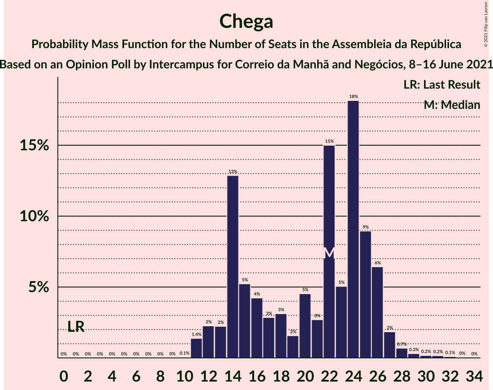
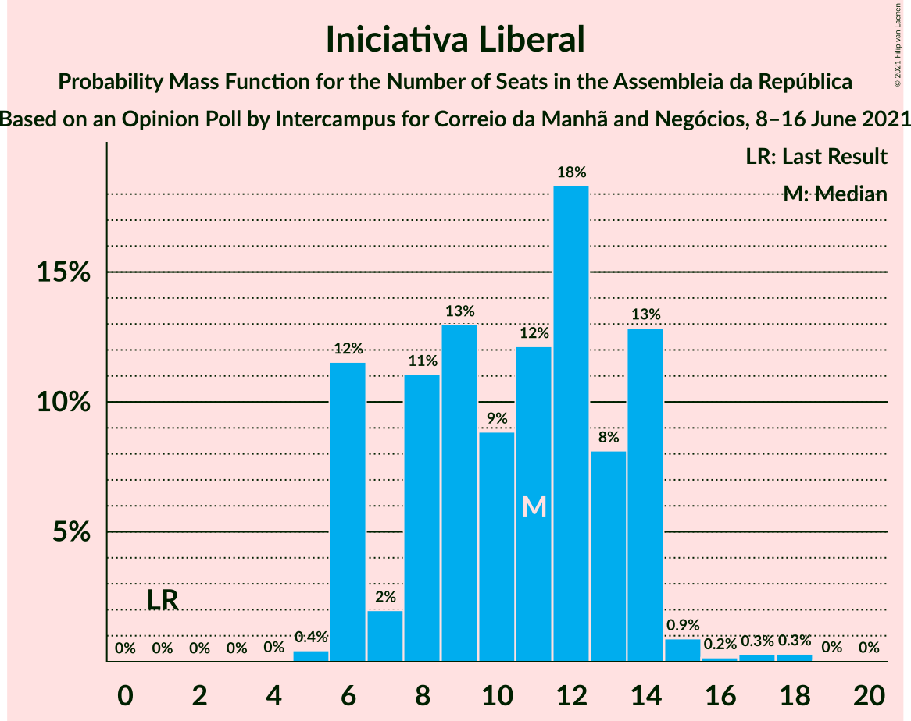
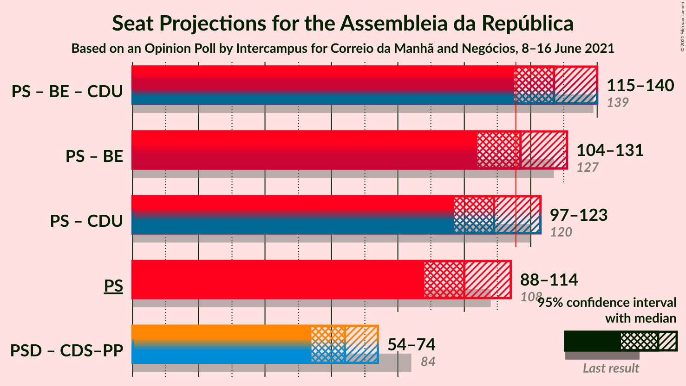
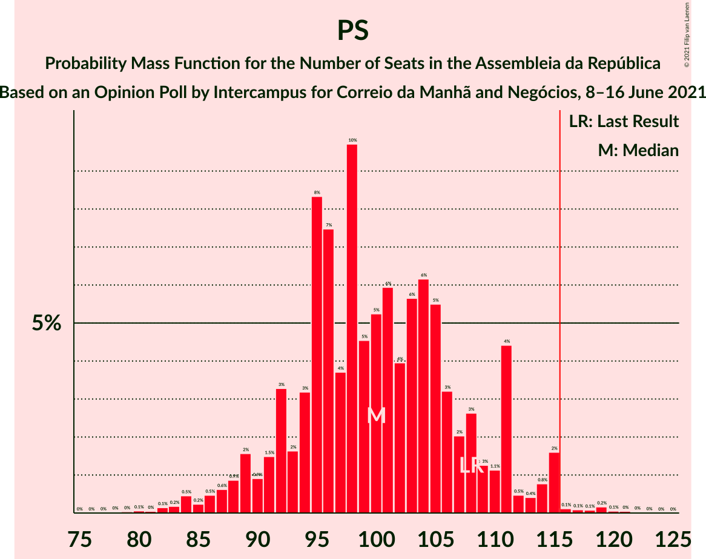

# Opinion Poll by Intercampus for Correio da Manhã and Negócios, 8–16 June 2021

<a href="#voting-intentions">Voting Intentions</a> | <a href="#seats">Seats</a> | <a href="#coalitions">Coalitions</a> | <a href="#technical-information">Technical Information</a>

## Voting Intentions

### Confidence Intervals

| Party | Last Result | Poll Result | 80% Confidence Interval | 90% Confidence Interval | 95% Confidence Interval | 99% Confidence Interval |
|:-----:|:-----------:|:-----------:|:-----------------------:|:-----------------------:|:-----------------------:|:-----------------------:|
| Partido Socialista | 36.4% | 34.5% | 32.1–37.1% |31.4–37.8% |30.9–38.4% |29.7–39.6% |
| Partido Social Democrata | 27.8% | 22.4% | 20.3–24.6% |19.7–25.3% |19.2–25.9% |18.3–27.0% |
| Chega | 1.3% | 10.0% | 8.6–11.8% |8.2–12.3% |7.9–12.7% |7.3–13.6% |
| Bloco de Esquerda | 9.5% | 8.9% | 7.6–10.5% |7.2–11.0% |6.9–11.4% |6.3–12.3% |
| Iniciativa Liberal | 1.3% | 6.4% | 5.3–7.9% |5.0–8.3% |4.7–8.7% |4.2–9.4% |
| Coligação Democrática Unitária | 6.3% | 5.9% | 4.9–7.3% |4.6–7.7% |4.3–8.1% |3.8–8.8% |
| Pessoas–Animais–Natureza | 3.3% | 5.3% | 4.3–6.6% |4.0–7.0% |3.7–7.3% |3.3–8.0% |
| CDS–Partido Popular | 4.2% | 3.1% | 2.4–4.2% |2.2–4.6% |2.0–4.8% |1.7–5.4% |
| LIVRE | 1.1% | 0.7% | 0.4–1.3% |0.3–1.5% |0.3–1.7% |0.2–2.1% |

*Note:* The poll result column reflects the actual value used in the calculations. Published results may vary slightly, and in addition be rounded to fewer digits.

## Seats

### Confidence Intervals

| Party | Last Result | Median | 80% Confidence Interval | 90% Confidence Interval | 95% Confidence Interval | 99% Confidence Interval |
|:-----:|:-----------:|:------:|:-----------------------:|:-----------------------:|:-----------------------:|:-----------------------:|
| <a href="#partido-socialista">Partido Socialista</a> | 108 | 101 | 93–111 |91–115 |89–115 |84–116 |
| <a href="#partido-social-democrata">Partido Social Democrata</a> | 79 | 61 | 56–67 |54–68 |52–70 |47–73 |
| <a href="#chega">Chega</a> | 1 | 22 | 14–26 |13–27 |11–27 |11–31 |
| <a href="#bloco-de-esquerda">Bloco de Esquerda</a> | 19 | 19 | 14–23 |13–24 |12–24 |12–29 |
| <a href="#iniciativa-liberal">Iniciativa Liberal</a> | 1 | 12 | 6–14 |6–14 |6–14 |5–15 |
| <a href="#coligação-democrática-unitária">Coligação Democrática Unitária</a> | 12 | 8 | 5–13 |5–14 |5–16 |5–17 |
| <a href="#pessoas–animais–natureza">Pessoas–Animais–Natureza</a> | 4 | 8 | 4–11 |4–11 |4–12 |3–12 |
| <a href="#cds–partido-popular">CDS–Partido Popular</a> | 5 | 2 | 1–4 |1–5 |1–5 |0–5 |
| <a href="#livre">LIVRE</a> | 1 | 0 | 0–1 |0–1 |0–1 |0–1 |

### Partido Socialista

*For a full overview of the results for this party, see the [Partido Socialista](party-partidosocialista.html) page.*

| Number of Seats | Probability | Accumulated | Special Marks |
|:---------------:|:-----------:|:-----------:|:-------------:|
| 79 | 0% | 100% |  |
| 80 | 0.1% | 99.9% |  |
| 81 | 0% | 99.9% |  |
| 82 | 0.2% | 99.8% |  |
| 83 | 0.1% | 99.6% |  |
| 84 | 0.5% | 99.6% |  |
| 85 | 0.4% | 99.1% |  |
| 86 | 0.2% | 98.7% |  |
| 87 | 0.2% | 98% |  |
| 88 | 0.2% | 98% |  |
| 89 | 1.1% | 98% |  |
| 90 | 0.7% | 97% |  |
| 91 | 2% | 96% |  |
| 92 | 4% | 95% |  |
| 93 | 3% | 90% |  |
| 94 | 6% | 87% |  |
| 95 | 2% | 82% |  |
| 96 | 7% | 80% |  |
| 97 | 5% | 73% |  |
| 98 | 4% | 68% |  |
| 99 | 7% | 64% |  |
| 100 | 4% | 57% |  |
| 101 | 24% | 53% | Median |
| 102 | 2% | 29% |  |
| 103 | 6% | 27% |  |
| 104 | 2% | 20% |  |
| 105 | 3% | 18% |  |
| 106 | 1.2% | 15% |  |
| 107 | 2% | 14% |  |
| 108 | 0.6% | 12% | Last Result |
| 109 | 0.3% | 12% |  |
| 110 | 0.6% | 12% |  |
| 111 | 4% | 11% |  |
| 112 | 0.6% | 7% |  |
| 113 | 0.3% | 6% |  |
| 114 | 0.2% | 6% |  |
| 115 | 5% | 6% |  |
| 116 | 0.5% | 0.7% | Majority |
| 117 | 0% | 0.2% |  |
| 118 | 0% | 0.2% |  |
| 119 | 0% | 0.2% |  |
| 120 | 0% | 0.1% |  |
| 121 | 0% | 0.1% |  |
| 122 | 0.1% | 0.1% |  |
| 123 | 0% | 0% |  |

### Partido Social Democrata

*For a full overview of the results for this party, see the [Partido Social Democrata](party-partidosocialdemocrata.html) page.*

| Number of Seats | Probability | Accumulated | Special Marks |
|:---------------:|:-----------:|:-----------:|:-------------:|
| 43 | 0.1% | 100% |  |
| 44 | 0% | 99.9% |  |
| 45 | 0.1% | 99.9% |  |
| 46 | 0% | 99.9% |  |
| 47 | 0.5% | 99.8% |  |
| 48 | 0.6% | 99.4% |  |
| 49 | 0.2% | 98.8% |  |
| 50 | 0% | 98.5% |  |
| 51 | 0.6% | 98.5% |  |
| 52 | 2% | 98% |  |
| 53 | 0.2% | 96% |  |
| 54 | 1.3% | 95% |  |
| 55 | 4% | 94% |  |
| 56 | 4% | 90% |  |
| 57 | 7% | 86% |  |
| 58 | 10% | 80% |  |
| 59 | 7% | 69% |  |
| 60 | 2% | 62% |  |
| 61 | 11% | 60% | Median |
| 62 | 8% | 49% |  |
| 63 | 4% | 42% |  |
| 64 | 3% | 38% |  |
| 65 | 18% | 35% |  |
| 66 | 5% | 17% |  |
| 67 | 3% | 12% |  |
| 68 | 4% | 9% |  |
| 69 | 2% | 5% |  |
| 70 | 1.1% | 3% |  |
| 71 | 0.6% | 2% |  |
| 72 | 0.2% | 1.0% |  |
| 73 | 0.3% | 0.8% |  |
| 74 | 0% | 0.4% |  |
| 75 | 0.1% | 0.4% |  |
| 76 | 0.1% | 0.3% |  |
| 77 | 0% | 0.2% |  |
| 78 | 0.1% | 0.2% |  |
| 79 | 0% | 0.1% | Last Result |
| 80 | 0% | 0.1% |  |
| 81 | 0% | 0.1% |  |
| 82 | 0% | 0% |  |

### Chega

*For a full overview of the results for this party, see the [Chega](party-chega.html) page.*

| Number of Seats | Probability | Accumulated | Special Marks |
|:---------------:|:-----------:|:-----------:|:-------------:|
| 1 | 0% | 100% | Last Result |
| 2 | 0% | 100% |  |
| 3 | 0% | 100% |  |
| 4 | 0% | 100% |  |
| 5 | 0% | 100% |  |
| 6 | 0% | 100% |  |
| 7 | 0% | 100% |  |
| 8 | 0% | 100% |  |
| 9 | 0% | 100% |  |
| 10 | 0.1% | 100% |  |
| 11 | 3% | 99.9% |  |
| 12 | 0.5% | 97% |  |
| 13 | 3% | 97% |  |
| 14 | 16% | 94% |  |
| 15 | 5% | 78% |  |
| 16 | 2% | 72% |  |
| 17 | 3% | 71% |  |
| 18 | 3% | 68% |  |
| 19 | 2% | 65% |  |
| 20 | 3% | 62% |  |
| 21 | 1.2% | 60% |  |
| 22 | 32% | 58% | Median |
| 23 | 8% | 26% |  |
| 24 | 2% | 18% |  |
| 25 | 4% | 16% |  |
| 26 | 6% | 12% |  |
| 27 | 4% | 6% |  |
| 28 | 0.9% | 2% |  |
| 29 | 0.1% | 0.8% |  |
| 30 | 0.2% | 0.7% |  |
| 31 | 0.4% | 0.6% |  |
| 32 | 0% | 0.2% |  |
| 33 | 0.1% | 0.1% |  |
| 34 | 0% | 0% |  |

### Bloco de Esquerda

*For a full overview of the results for this party, see the [Bloco de Esquerda](party-blocodeesquerda.html) page.*

| Number of Seats | Probability | Accumulated | Special Marks |
|:---------------:|:-----------:|:-----------:|:-------------:|
| 7 | 0.2% | 100% |  |
| 8 | 0% | 99.8% |  |
| 9 | 0% | 99.8% |  |
| 10 | 0% | 99.7% |  |
| 11 | 0.2% | 99.7% |  |
| 12 | 3% | 99.5% |  |
| 13 | 3% | 97% |  |
| 14 | 13% | 94% |  |
| 15 | 6% | 81% |  |
| 16 | 3% | 75% |  |
| 17 | 20% | 72% |  |
| 18 | 2% | 52% |  |
| 19 | 11% | 50% | Last Result, Median |
| 20 | 20% | 39% |  |
| 21 | 6% | 20% |  |
| 22 | 2% | 14% |  |
| 23 | 6% | 11% |  |
| 24 | 3% | 5% |  |
| 25 | 0.2% | 2% |  |
| 26 | 0.1% | 2% |  |
| 27 | 0.1% | 2% |  |
| 28 | 0.3% | 2% |  |
| 29 | 2% | 2% |  |
| 30 | 0.1% | 0.1% |  |
| 31 | 0% | 0% |  |

### Iniciativa Liberal

*For a full overview of the results for this party, see the [Iniciativa Liberal](party-iniciativaliberal.html) page.*

| Number of Seats | Probability | Accumulated | Special Marks |
|:---------------:|:-----------:|:-----------:|:-------------:|
| 1 | 0% | 100% | Last Result |
| 2 | 0% | 100% |  |
| 3 | 0% | 100% |  |
| 4 | 0% | 100% |  |
| 5 | 0.5% | 100% |  |
| 6 | 10% | 99.5% |  |
| 7 | 3% | 89% |  |
| 8 | 8% | 87% |  |
| 9 | 7% | 78% |  |
| 10 | 10% | 72% |  |
| 11 | 10% | 61% |  |
| 12 | 28% | 52% | Median |
| 13 | 8% | 24% |  |
| 14 | 15% | 16% |  |
| 15 | 0.9% | 1.4% |  |
| 16 | 0% | 0.4% |  |
| 17 | 0.1% | 0.4% |  |
| 18 | 0.2% | 0.3% |  |
| 19 | 0.1% | 0.1% |  |
| 20 | 0% | 0% |  |

### Coligação Democrática Unitária

*For a full overview of the results for this party, see the [Coligação Democrática Unitária](party-coligaçãodemocráticaunitária.html) page.*

| Number of Seats | Probability | Accumulated | Special Marks |
|:---------------:|:-----------:|:-----------:|:-------------:|
| 3 | 0.2% | 100% |  |
| 4 | 0.1% | 99.8% |  |
| 5 | 13% | 99.6% |  |
| 6 | 7% | 87% |  |
| 7 | 22% | 80% |  |
| 8 | 9% | 58% | Median |
| 9 | 3% | 49% |  |
| 10 | 4% | 46% |  |
| 11 | 14% | 42% |  |
| 12 | 11% | 28% | Last Result |
| 13 | 8% | 17% |  |
| 14 | 5% | 9% |  |
| 15 | 0.9% | 4% |  |
| 16 | 3% | 3% |  |
| 17 | 0.2% | 0.6% |  |
| 18 | 0.1% | 0.4% |  |
| 19 | 0.3% | 0.3% |  |
| 20 | 0% | 0% |  |

### Pessoas–Animais–Natureza

*For a full overview of the results for this party, see the [Pessoas–Animais–Natureza](party-pessoas–animais–natureza.html) page.*

| Number of Seats | Probability | Accumulated | Special Marks |
|:---------------:|:-----------:|:-----------:|:-------------:|
| 2 | 0.2% | 100% |  |
| 3 | 0.5% | 99.8% |  |
| 4 | 12% | 99.3% | Last Result |
| 5 | 21% | 87% |  |
| 6 | 10% | 67% |  |
| 7 | 4% | 57% |  |
| 8 | 11% | 53% | Median |
| 9 | 22% | 41% |  |
| 10 | 4% | 19% |  |
| 11 | 11% | 15% |  |
| 12 | 3% | 4% |  |
| 13 | 0.2% | 0.5% |  |
| 14 | 0.1% | 0.2% |  |
| 15 | 0.1% | 0.2% |  |
| 16 | 0.1% | 0.1% |  |
| 17 | 0% | 0% |  |

### CDS–Partido Popular

*For a full overview of the results for this party, see the [CDS–Partido Popular](party-cds–partidopopular.html) page.*

| Number of Seats | Probability | Accumulated | Special Marks |
|:---------------:|:-----------:|:-----------:|:-------------:|
| 0 | 0.7% | 100% |  |
| 1 | 30% | 99.3% |  |
| 2 | 31% | 70% | Median |
| 3 | 23% | 39% |  |
| 4 | 7% | 16% |  |
| 5 | 9% | 9% | Last Result |
| 6 | 0.2% | 0.4% |  |
| 7 | 0.1% | 0.3% |  |
| 8 | 0.1% | 0.2% |  |
| 9 | 0% | 0.1% |  |
| 10 | 0% | 0.1% |  |
| 11 | 0% | 0% |  |

### LIVRE

*For a full overview of the results for this party, see the [LIVRE](party-livre.html) page.*

| Number of Seats | Probability | Accumulated | Special Marks |
|:---------------:|:-----------:|:-----------:|:-------------:|
| 0 | 73% | 100% | Median |
| 1 | 27% | 27% | Last Result |
| 2 | 0.2% | 0.3% |  |
| 3 | 0.1% | 0.1% |  |
| 4 | 0% | 0% |  |

## Coalitions

### Confidence Intervals

| Coalition | Last Result | Median | Majority? | 80% Confidence Interval | 90% Confidence Interval | 95% Confidence Interval | 99% Confidence Interval |
|:---------:|:-----------:|:------:|:---------:|:-----------------------:|:-----------------------:|:-----------------------:|:-----------------------:|
| Partido Socialista – Bloco de Esquerda – Coligação Democrática Unitária | 139 | 128 | 96% | 120–136 | 116–142 | 114–143 | 110–146 |
| Partido Socialista – Bloco de Esquerda | 127 | 118 | 72% | 111–127 | 108–134 | 106–135 | 102–136 |
| Partido Socialista – Coligação Democrática Unitária | 120 | 108 | 23% | 100–118 | 99–123 | 98–125 | 93–125 |
| Partido Socialista | 108 | 101 | 0.7% | 93–111 | 91–115 | 89–115 | 84–116 |
| Partido Social Democrata – CDS–Partido Popular | 84 | 64 | 0% | 59–70 | 56–71 | 54–73 | 49–77 |

### Partido Socialista – Bloco de Esquerda – Coligação Democrática Unitária

| Number of Seats | Probability | Accumulated | Special Marks |
|:---------------:|:-----------:|:-----------:|:-------------:|
| 104 | 0% | 100% |  |
| 105 | 0% | 99.9% |  |
| 106 | 0% | 99.9% |  |
| 107 | 0% | 99.9% |  |
| 108 | 0% | 99.9% |  |
| 109 | 0.3% | 99.9% |  |
| 110 | 0% | 99.5% |  |
| 111 | 0.1% | 99.5% |  |
| 112 | 0% | 99.4% |  |
| 113 | 0.1% | 99.4% |  |
| 114 | 2% | 99.3% |  |
| 115 | 2% | 97% |  |
| 116 | 0.8% | 96% | Majority |
| 117 | 1.0% | 95% |  |
| 118 | 0.9% | 94% |  |
| 119 | 2% | 93% |  |
| 120 | 4% | 91% |  |
| 121 | 4% | 87% |  |
| 122 | 5% | 83% |  |
| 123 | 4% | 78% |  |
| 124 | 1.0% | 74% |  |
| 125 | 16% | 73% |  |
| 126 | 5% | 57% |  |
| 127 | 1.2% | 52% |  |
| 128 | 5% | 51% | Median |
| 129 | 7% | 46% |  |
| 130 | 3% | 40% |  |
| 131 | 11% | 36% |  |
| 132 | 9% | 25% |  |
| 133 | 2% | 16% |  |
| 134 | 0.6% | 13% |  |
| 135 | 0.7% | 13% |  |
| 136 | 3% | 12% |  |
| 137 | 1.3% | 9% |  |
| 138 | 0.4% | 8% |  |
| 139 | 0.8% | 7% | Last Result |
| 140 | 0.7% | 6% |  |
| 141 | 0.1% | 6% |  |
| 142 | 3% | 6% |  |
| 143 | 0.1% | 3% |  |
| 144 | 0.2% | 2% |  |
| 145 | 0.1% | 2% |  |
| 146 | 2% | 2% |  |
| 147 | 0% | 0.2% |  |
| 148 | 0.1% | 0.2% |  |
| 149 | 0.1% | 0.1% |  |
| 150 | 0% | 0% |  |

### Partido Socialista – Bloco de Esquerda

| Number of Seats | Probability | Accumulated | Special Marks |
|:---------------:|:-----------:|:-----------:|:-------------:|
| 95 | 0% | 100% |  |
| 96 | 0% | 99.9% |  |
| 97 | 0% | 99.9% |  |
| 98 | 0% | 99.9% |  |
| 99 | 0% | 99.9% |  |
| 100 | 0% | 99.8% |  |
| 101 | 0.2% | 99.8% |  |
| 102 | 0.4% | 99.6% |  |
| 103 | 0.6% | 99.2% |  |
| 104 | 0.3% | 98.6% |  |
| 105 | 0.5% | 98% |  |
| 106 | 2% | 98% |  |
| 107 | 0.3% | 96% |  |
| 108 | 2% | 95% |  |
| 109 | 2% | 94% |  |
| 110 | 0.7% | 91% |  |
| 111 | 1.5% | 91% |  |
| 112 | 3% | 89% |  |
| 113 | 0.3% | 86% |  |
| 114 | 2% | 86% |  |
| 115 | 11% | 84% |  |
| 116 | 4% | 72% | Majority |
| 117 | 10% | 68% |  |
| 118 | 19% | 58% |  |
| 119 | 5% | 39% |  |
| 120 | 3% | 34% | Median |
| 121 | 10% | 31% |  |
| 122 | 3% | 21% |  |
| 123 | 3% | 19% |  |
| 124 | 0.6% | 15% |  |
| 125 | 4% | 15% |  |
| 126 | 0.7% | 11% |  |
| 127 | 2% | 10% | Last Result |
| 128 | 0.6% | 8% |  |
| 129 | 0.5% | 7% |  |
| 130 | 0.1% | 7% |  |
| 131 | 0.2% | 6% |  |
| 132 | 0.1% | 6% |  |
| 133 | 0.5% | 6% |  |
| 134 | 3% | 6% |  |
| 135 | 0.5% | 3% |  |
| 136 | 2% | 2% |  |
| 137 | 0% | 0.1% |  |
| 138 | 0.1% | 0.1% |  |
| 139 | 0% | 0% |  |

### Partido Socialista – Coligação Democrática Unitária

| Number of Seats | Probability | Accumulated | Special Marks |
|:---------------:|:-----------:|:-----------:|:-------------:|
| 88 | 0.1% | 100% |  |
| 89 | 0% | 99.8% |  |
| 90 | 0.1% | 99.8% |  |
| 91 | 0% | 99.7% |  |
| 92 | 0.1% | 99.7% |  |
| 93 | 0.2% | 99.6% |  |
| 94 | 0.1% | 99.4% |  |
| 95 | 0.1% | 99.3% |  |
| 96 | 0.2% | 99.3% |  |
| 97 | 0.7% | 99.1% |  |
| 98 | 2% | 98% |  |
| 99 | 5% | 97% |  |
| 100 | 5% | 92% |  |
| 101 | 3% | 87% |  |
| 102 | 1.0% | 84% |  |
| 103 | 1.4% | 83% |  |
| 104 | 0.4% | 82% |  |
| 105 | 2% | 81% |  |
| 106 | 4% | 79% |  |
| 107 | 10% | 76% |  |
| 108 | 16% | 66% |  |
| 109 | 8% | 50% | Median |
| 110 | 0.9% | 42% |  |
| 111 | 6% | 41% |  |
| 112 | 8% | 35% |  |
| 113 | 2% | 27% |  |
| 114 | 0.7% | 24% |  |
| 115 | 0.6% | 23% |  |
| 116 | 11% | 23% | Majority |
| 117 | 1.0% | 12% |  |
| 118 | 1.4% | 11% |  |
| 119 | 2% | 10% |  |
| 120 | 0.7% | 8% | Last Result |
| 121 | 0.4% | 7% |  |
| 122 | 0.4% | 7% |  |
| 123 | 4% | 7% |  |
| 124 | 0% | 3% |  |
| 125 | 2% | 3% |  |
| 126 | 0.1% | 0.4% |  |
| 127 | 0% | 0.3% |  |
| 128 | 0.1% | 0.3% |  |
| 129 | 0.1% | 0.2% |  |
| 130 | 0% | 0.1% |  |
| 131 | 0% | 0.1% |  |
| 132 | 0% | 0.1% |  |
| 133 | 0.1% | 0.1% |  |
| 134 | 0% | 0% |  |

### Partido Socialista

| Number of Seats | Probability | Accumulated | Special Marks |
|:---------------:|:-----------:|:-----------:|:-------------:|
| 79 | 0% | 100% |  |
| 80 | 0.1% | 99.9% |  |
| 81 | 0% | 99.9% |  |
| 82 | 0.2% | 99.8% |  |
| 83 | 0.1% | 99.6% |  |
| 84 | 0.5% | 99.6% |  |
| 85 | 0.4% | 99.1% |  |
| 86 | 0.2% | 98.7% |  |
| 87 | 0.2% | 98% |  |
| 88 | 0.2% | 98% |  |
| 89 | 1.1% | 98% |  |
| 90 | 0.7% | 97% |  |
| 91 | 2% | 96% |  |
| 92 | 4% | 95% |  |
| 93 | 3% | 90% |  |
| 94 | 6% | 87% |  |
| 95 | 2% | 82% |  |
| 96 | 7% | 80% |  |
| 97 | 5% | 73% |  |
| 98 | 4% | 68% |  |
| 99 | 7% | 64% |  |
| 100 | 4% | 57% |  |
| 101 | 24% | 53% | Median |
| 102 | 2% | 29% |  |
| 103 | 6% | 27% |  |
| 104 | 2% | 20% |  |
| 105 | 3% | 18% |  |
| 106 | 1.2% | 15% |  |
| 107 | 2% | 14% |  |
| 108 | 0.6% | 12% | Last Result |
| 109 | 0.3% | 12% |  |
| 110 | 0.6% | 12% |  |
| 111 | 4% | 11% |  |
| 112 | 0.6% | 7% |  |
| 113 | 0.3% | 6% |  |
| 114 | 0.2% | 6% |  |
| 115 | 5% | 6% |  |
| 116 | 0.5% | 0.7% | Majority |
| 117 | 0% | 0.2% |  |
| 118 | 0% | 0.2% |  |
| 119 | 0% | 0.2% |  |
| 120 | 0% | 0.1% |  |
| 121 | 0% | 0.1% |  |
| 122 | 0.1% | 0.1% |  |
| 123 | 0% | 0% |  |

### Partido Social Democrata – CDS–Partido Popular

| Number of Seats | Probability | Accumulated | Special Marks |
|:---------------:|:-----------:|:-----------:|:-------------:|
| 45 | 0.1% | 100% |  |
| 46 | 0% | 99.9% |  |
| 47 | 0% | 99.9% |  |
| 48 | 0.2% | 99.9% |  |
| 49 | 0.4% | 99.7% |  |
| 50 | 0.1% | 99.4% |  |
| 51 | 0.6% | 99.3% |  |
| 52 | 0.1% | 98.6% |  |
| 53 | 0.6% | 98.5% |  |
| 54 | 2% | 98% |  |
| 55 | 0.3% | 96% |  |
| 56 | 3% | 95% |  |
| 57 | 1.2% | 93% |  |
| 58 | 1.1% | 91% |  |
| 59 | 10% | 90% |  |
| 60 | 10% | 80% |  |
| 61 | 2% | 70% |  |
| 62 | 2% | 68% |  |
| 63 | 10% | 66% | Median |
| 64 | 11% | 55% |  |
| 65 | 3% | 45% |  |
| 66 | 19% | 42% |  |
| 67 | 2% | 23% |  |
| 68 | 3% | 21% |  |
| 69 | 7% | 17% |  |
| 70 | 4% | 11% |  |
| 71 | 3% | 7% |  |
| 72 | 0.5% | 3% |  |
| 73 | 0.8% | 3% |  |
| 74 | 1.4% | 2% |  |
| 75 | 0.1% | 0.7% |  |
| 76 | 0.1% | 0.6% |  |
| 77 | 0.2% | 0.5% |  |
| 78 | 0.1% | 0.4% |  |
| 79 | 0.1% | 0.3% |  |
| 80 | 0.1% | 0.2% |  |
| 81 | 0% | 0.1% |  |
| 82 | 0% | 0.1% |  |
| 83 | 0% | 0.1% |  |
| 84 | 0% | 0% | Last Result |

## Technical Information

### Opinion Poll

+ **Polling firm:** Intercampus
+ **Commissioner(s):** Correio da Manhã and Negócios
+ **Fieldwork period:** 8–16 June 2021

### Calculations

+ **Sample size:** 608
+ **Simulations done:** 131,072
+ **Error estimate:** 3.00%

