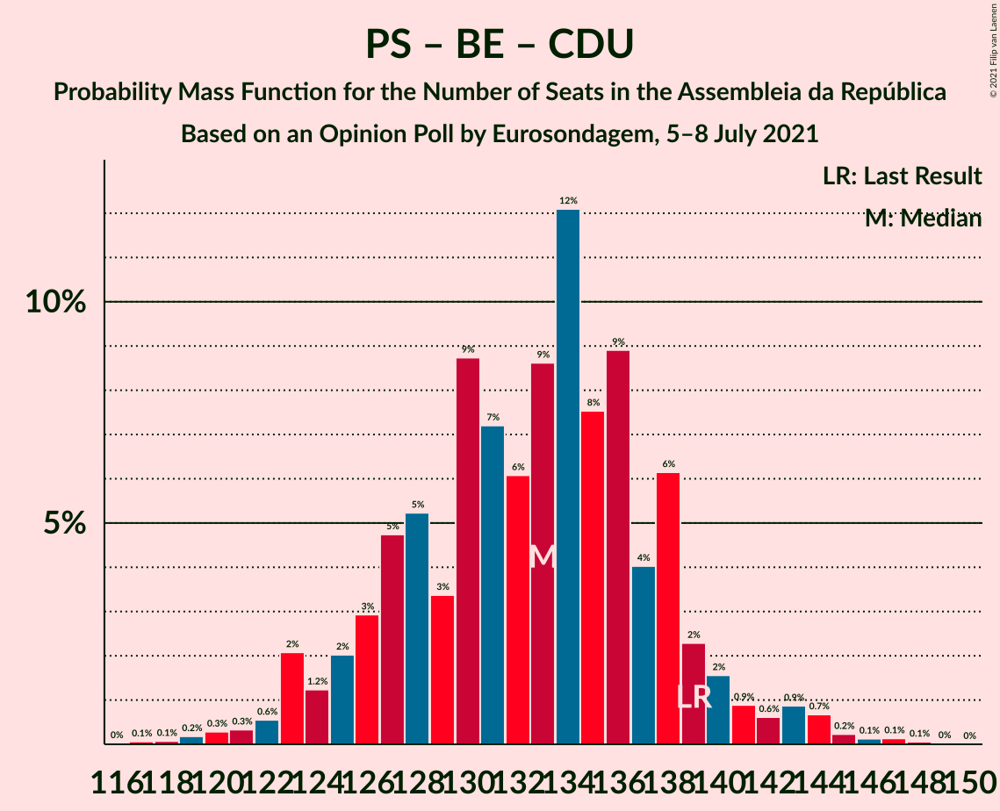

# Opinion Poll by Eurosondagem, 5–8 July 2021

<a href="#voting-intentions">Voting Intentions</a> | <a href="#seats">Seats</a> | <a href="#coalitions">Coalitions</a> | <a href="#technical-information">Technical Information</a>

## Voting Intentions

### Confidence Intervals

| Party | Last Result | Poll Result | 80% Confidence Interval | 90% Confidence Interval | 95% Confidence Interval | 99% Confidence Interval |
|:-----:|:-----------:|:-----------:|:-----------------------:|:-----------------------:|:-----------------------:|:-----------------------:|
| Partido Socialista | 36.4% | 40.8% | 38.9–42.8% |38.3–43.4% |37.8–43.9% |36.9–44.8% |
| Partido Social Democrata | 27.8% | 27.3% | 25.6–29.1% |25.1–29.7% |24.6–30.1% |23.8–31.0% |
| Chega | 1.3% | 9.0% | 7.9–10.3% |7.7–10.6% |7.4–10.9% |6.9–11.6% |
| Bloco de Esquerda | 9.5% | 5.2% | 4.4–6.2% |4.2–6.5% |4.0–6.7% |3.6–7.2% |
| Coligação Democrática Unitária | 6.3% | 5.2% | 4.4–6.2% |4.2–6.5% |4.0–6.7% |3.6–7.2% |
| Iniciativa Liberal | 1.3% | 2.5% | 2.0–3.3% |1.9–3.5% |1.7–3.7% |1.5–4.1% |
| CDS–Partido Popular | 4.2% | 2.2% | 1.7–2.9% |1.5–3.1% |1.4–3.2% |1.2–3.6% |
| Pessoas–Animais–Natureza | 3.3% | 2.1% | 1.6–2.8% |1.4–3.0% |1.3–3.1% |1.1–3.5% |

*Note:* The poll result column reflects the actual value used in the calculations. Published results may vary slightly, and in addition be rounded to fewer digits.

## Seats

### Confidence Intervals

| Party | Last Result | Median | 80% Confidence Interval | 90% Confidence Interval | 95% Confidence Interval | 99% Confidence Interval |
|:-----:|:-----------:|:------:|:-----------------------:|:-----------------------:|:-----------------------:|:-----------------------:|
| <a href="#partido-socialista">Partido Socialista</a> | 108 | 118 | 111–122 |109–124 |108–126 |105–129 |
| <a href="#partido-social-democrata">Partido Social Democrata</a> | 79 | 74 | 68–80 |67–82 |65–83 |63–86 |
| <a href="#chega">Chega</a> | 1 | 17 | 13–21 |12–22 |11–23 |11–24 |
| <a href="#bloco-de-esquerda">Bloco de Esquerda</a> | 19 | 7 | 6–10 |5–11 |5–11 |3–13 |
| <a href="#coligação-democrática-unitária">Coligação Democrática Unitária</a> | 12 | 7 | 5–10 |5–11 |5–13 |5–14 |
| <a href="#iniciativa-liberal">Iniciativa Liberal</a> | 1 | 3 | 2–4 |2–4 |1–5 |1–5 |
| <a href="#cds–partido-popular">CDS–Partido Popular</a> | 5 | 1 | 0–2 |0–2 |0–2 |0–3 |
| <a href="#pessoas–animais–natureza">Pessoas–Animais–Natureza</a> | 4 | 2 | 1–2 |0–2 |0–3 |0–4 |

### Partido Socialista

*For a full overview of the results for this party, see the [Partido Socialista](party-partidosocialista.html) page.*

| Number of Seats | Probability | Accumulated | Special Marks |
|:---------------:|:-----------:|:-----------:|:-------------:|
| 102 | 0% | 100% |  |
| 103 | 0.1% | 99.9% |  |
| 104 | 0.2% | 99.8% |  |
| 105 | 0.2% | 99.6% |  |
| 106 | 0.7% | 99.4% |  |
| 107 | 0.9% | 98.7% |  |
| 108 | 1.0% | 98% | Last Result |
| 109 | 3% | 97% |  |
| 110 | 2% | 94% |  |
| 111 | 3% | 92% |  |
| 112 | 5% | 89% |  |
| 113 | 6% | 84% |  |
| 114 | 5% | 78% |  |
| 115 | 5% | 73% |  |
| 116 | 8% | 68% | Majority |
| 117 | 7% | 60% |  |
| 118 | 11% | 53% | Median |
| 119 | 12% | 42% |  |
| 120 | 9% | 31% |  |
| 121 | 7% | 22% |  |
| 122 | 5% | 15% |  |
| 123 | 3% | 10% |  |
| 124 | 2% | 6% |  |
| 125 | 2% | 5% |  |
| 126 | 1.0% | 3% |  |
| 127 | 0.6% | 2% |  |
| 128 | 0.7% | 2% |  |
| 129 | 0.4% | 0.9% |  |
| 130 | 0.2% | 0.4% |  |
| 131 | 0.1% | 0.3% |  |
| 132 | 0.1% | 0.1% |  |
| 133 | 0% | 0.1% |  |
| 134 | 0% | 0% |  |

### Partido Social Democrata

*For a full overview of the results for this party, see the [Partido Social Democrata](party-partidosocialdemocrata.html) page.*

| Number of Seats | Probability | Accumulated | Special Marks |
|:---------------:|:-----------:|:-----------:|:-------------:|
| 61 | 0% | 100% |  |
| 62 | 0.2% | 99.9% |  |
| 63 | 0.6% | 99.8% |  |
| 64 | 0.8% | 99.1% |  |
| 65 | 2% | 98% |  |
| 66 | 2% | 97% |  |
| 67 | 2% | 95% |  |
| 68 | 4% | 94% |  |
| 69 | 6% | 90% |  |
| 70 | 3% | 84% |  |
| 71 | 8% | 81% |  |
| 72 | 5% | 74% |  |
| 73 | 11% | 68% |  |
| 74 | 8% | 57% | Median |
| 75 | 7% | 49% |  |
| 76 | 8% | 41% |  |
| 77 | 11% | 34% |  |
| 78 | 6% | 23% |  |
| 79 | 4% | 17% | Last Result |
| 80 | 4% | 13% |  |
| 81 | 4% | 9% |  |
| 82 | 2% | 5% |  |
| 83 | 1.3% | 3% |  |
| 84 | 0.5% | 2% |  |
| 85 | 0.6% | 1.1% |  |
| 86 | 0.3% | 0.5% |  |
| 87 | 0.1% | 0.2% |  |
| 88 | 0.1% | 0.1% |  |
| 89 | 0% | 0.1% |  |
| 90 | 0% | 0% |  |

### Chega

*For a full overview of the results for this party, see the [Chega](party-chega.html) page.*

| Number of Seats | Probability | Accumulated | Special Marks |
|:---------------:|:-----------:|:-----------:|:-------------:|
| 1 | 0% | 100% | Last Result |
| 2 | 0% | 100% |  |
| 3 | 0% | 100% |  |
| 4 | 0% | 100% |  |
| 5 | 0% | 100% |  |
| 6 | 0% | 100% |  |
| 7 | 0% | 100% |  |
| 8 | 0% | 100% |  |
| 9 | 0% | 100% |  |
| 10 | 0% | 100% |  |
| 11 | 3% | 100% |  |
| 12 | 3% | 97% |  |
| 13 | 11% | 93% |  |
| 14 | 19% | 83% |  |
| 15 | 6% | 64% |  |
| 16 | 8% | 58% |  |
| 17 | 10% | 50% | Median |
| 18 | 19% | 40% |  |
| 19 | 6% | 21% |  |
| 20 | 3% | 15% |  |
| 21 | 5% | 12% |  |
| 22 | 4% | 7% |  |
| 23 | 2% | 3% |  |
| 24 | 0.4% | 0.8% |  |
| 25 | 0.2% | 0.4% |  |
| 26 | 0.1% | 0.2% |  |
| 27 | 0.1% | 0.1% |  |
| 28 | 0% | 0% |  |

### Bloco de Esquerda

*For a full overview of the results for this party, see the [Bloco de Esquerda](party-blocodeesquerda.html) page.*

| Number of Seats | Probability | Accumulated | Special Marks |
|:---------------:|:-----------:|:-----------:|:-------------:|
| 2 | 0.3% | 100% |  |
| 3 | 1.0% | 99.7% |  |
| 4 | 1.0% | 98.7% |  |
| 5 | 6% | 98% |  |
| 6 | 2% | 91% |  |
| 7 | 59% | 89% | Median |
| 8 | 7% | 30% |  |
| 9 | 3% | 23% |  |
| 10 | 11% | 20% |  |
| 11 | 8% | 9% |  |
| 12 | 0.7% | 2% |  |
| 13 | 0.5% | 0.9% |  |
| 14 | 0.2% | 0.3% |  |
| 15 | 0.1% | 0.1% |  |
| 16 | 0% | 0% |  |
| 17 | 0% | 0% |  |
| 18 | 0% | 0% |  |
| 19 | 0% | 0% | Last Result |

### Coligação Democrática Unitária

*For a full overview of the results for this party, see the [Coligação Democrática Unitária](party-coligaçãodemocráticaunitária.html) page.*

| Number of Seats | Probability | Accumulated | Special Marks |
|:---------------:|:-----------:|:-----------:|:-------------:|
| 4 | 0.2% | 100% |  |
| 5 | 10% | 99.7% |  |
| 6 | 14% | 90% |  |
| 7 | 34% | 76% | Median |
| 8 | 10% | 42% |  |
| 9 | 13% | 32% |  |
| 10 | 13% | 19% |  |
| 11 | 2% | 6% |  |
| 12 | 1.1% | 4% | Last Result |
| 13 | 1.5% | 3% |  |
| 14 | 2% | 2% |  |
| 15 | 0.2% | 0.3% |  |
| 16 | 0% | 0% |  |

### Iniciativa Liberal

*For a full overview of the results for this party, see the [Iniciativa Liberal](party-iniciativaliberal.html) page.*

| Number of Seats | Probability | Accumulated | Special Marks |
|:---------------:|:-----------:|:-----------:|:-------------:|
| 1 | 3% | 100% | Last Result |
| 2 | 9% | 97% |  |
| 3 | 73% | 88% | Median |
| 4 | 11% | 16% |  |
| 5 | 4% | 4% |  |
| 6 | 0.4% | 0.4% |  |
| 7 | 0% | 0% |  |

### CDS–Partido Popular

*For a full overview of the results for this party, see the [CDS–Partido Popular](party-cds–partidopopular.html) page.*

| Number of Seats | Probability | Accumulated | Special Marks |
|:---------------:|:-----------:|:-----------:|:-------------:|
| 0 | 25% | 100% |  |
| 1 | 57% | 75% | Median |
| 2 | 18% | 19% |  |
| 3 | 0.5% | 0.8% |  |
| 4 | 0.3% | 0.3% |  |
| 5 | 0% | 0% | Last Result |

### Pessoas–Animais–Natureza

*For a full overview of the results for this party, see the [Pessoas–Animais–Natureza](party-pessoas–animais–natureza.html) page.*

| Number of Seats | Probability | Accumulated | Special Marks |
|:---------------:|:-----------:|:-----------:|:-------------:|
| 0 | 5% | 100% |  |
| 1 | 35% | 95% |  |
| 2 | 55% | 60% | Median |
| 3 | 4% | 5% |  |
| 4 | 1.0% | 1.0% | Last Result |
| 5 | 0% | 0% |  |

## Coalitions

### Confidence Intervals

| Coalition | Last Result | Median | Majority? | 80% Confidence Interval | 90% Confidence Interval | 95% Confidence Interval | 99% Confidence Interval |
|:---------:|:-----------:|:------:|:---------:|:-----------------------:|:-----------------------:|:-----------------------:|:-----------------------:|
| Partido Socialista – Bloco de Esquerda – Coligação Democrática Unitária | 139 | 133 | 100% | 127–138 | 125–140 | 123–142 | 120–145 |
| Partido Socialista – Coligação Democrática Unitária | 120 | 125 | 98% | 119–130 | 117–132 | 116–134 | 113–137 |
| Partido Socialista – Bloco de Esquerda | 127 | 126 | 98% | 119–130 | 117–132 | 116–133 | 112–137 |
| Partido Socialista | 108 | 118 | 68% | 111–122 | 109–124 | 108–126 | 105–129 |
| Partido Social Democrata – CDS–Partido Popular | 84 | 75 | 0% | 69–81 | 67–83 | 66–84 | 64–87 |

### Partido Socialista – Bloco de Esquerda – Coligação Democrática Unitária

| Number of Seats | Probability | Accumulated | Special Marks |
|:---------------:|:-----------:|:-----------:|:-------------:|
| 117 | 0.1% | 100% |  |
| 118 | 0.1% | 99.9% |  |
| 119 | 0.2% | 99.8% |  |
| 120 | 0.3% | 99.6% |  |
| 121 | 0.3% | 99.4% |  |
| 122 | 0.6% | 99.0% |  |
| 123 | 2% | 98% |  |
| 124 | 1.2% | 96% |  |
| 125 | 2% | 95% |  |
| 126 | 3% | 93% |  |
| 127 | 5% | 90% |  |
| 128 | 5% | 85% |  |
| 129 | 3% | 80% |  |
| 130 | 9% | 77% |  |
| 131 | 7% | 68% |  |
| 132 | 6% | 61% | Median |
| 133 | 9% | 55% |  |
| 134 | 12% | 46% |  |
| 135 | 8% | 34% |  |
| 136 | 9% | 27% |  |
| 137 | 4% | 18% |  |
| 138 | 6% | 14% |  |
| 139 | 2% | 7% | Last Result |
| 140 | 2% | 5% |  |
| 141 | 0.9% | 4% |  |
| 142 | 0.6% | 3% |  |
| 143 | 0.9% | 2% |  |
| 144 | 0.7% | 1.3% |  |
| 145 | 0.2% | 0.6% |  |
| 146 | 0.1% | 0.4% |  |
| 147 | 0.1% | 0.2% |  |
| 148 | 0.1% | 0.1% |  |
| 149 | 0% | 0% |  |

### Partido Socialista – Coligação Democrática Unitária

| Number of Seats | Probability | Accumulated | Special Marks |
|:---------------:|:-----------:|:-----------:|:-------------:|
| 109 | 0% | 100% |  |
| 110 | 0% | 99.9% |  |
| 111 | 0.1% | 99.9% |  |
| 112 | 0.2% | 99.8% |  |
| 113 | 0.4% | 99.6% |  |
| 114 | 0.6% | 99.2% |  |
| 115 | 0.9% | 98.6% |  |
| 116 | 2% | 98% | Majority |
| 117 | 1.4% | 95% |  |
| 118 | 3% | 94% |  |
| 119 | 3% | 91% |  |
| 120 | 5% | 88% | Last Result |
| 121 | 5% | 83% |  |
| 122 | 4% | 78% |  |
| 123 | 11% | 74% |  |
| 124 | 8% | 64% |  |
| 125 | 7% | 55% | Median |
| 126 | 9% | 48% |  |
| 127 | 9% | 39% |  |
| 128 | 7% | 30% |  |
| 129 | 10% | 23% |  |
| 130 | 3% | 13% |  |
| 131 | 4% | 10% |  |
| 132 | 1.4% | 6% |  |
| 133 | 1.4% | 4% |  |
| 134 | 1.0% | 3% |  |
| 135 | 0.5% | 2% |  |
| 136 | 0.6% | 2% |  |
| 137 | 0.6% | 1.1% |  |
| 138 | 0.2% | 0.5% |  |
| 139 | 0.1% | 0.3% |  |
| 140 | 0.1% | 0.2% |  |
| 141 | 0% | 0.1% |  |
| 142 | 0% | 0% |  |

### Partido Socialista – Bloco de Esquerda

| Number of Seats | Probability | Accumulated | Special Marks |
|:---------------:|:-----------:|:-----------:|:-------------:|
| 109 | 0% | 100% |  |
| 110 | 0.1% | 99.9% |  |
| 111 | 0.2% | 99.8% |  |
| 112 | 0.2% | 99.7% |  |
| 113 | 0.5% | 99.5% |  |
| 114 | 0.6% | 99.0% |  |
| 115 | 0.5% | 98% |  |
| 116 | 2% | 98% | Majority |
| 117 | 2% | 95% |  |
| 118 | 2% | 94% |  |
| 119 | 4% | 91% |  |
| 120 | 6% | 87% |  |
| 121 | 5% | 81% |  |
| 122 | 5% | 76% |  |
| 123 | 5% | 71% |  |
| 124 | 7% | 65% |  |
| 125 | 8% | 58% | Median |
| 126 | 12% | 50% |  |
| 127 | 10% | 38% | Last Result |
| 128 | 8% | 27% |  |
| 129 | 6% | 20% |  |
| 130 | 4% | 13% |  |
| 131 | 4% | 10% |  |
| 132 | 2% | 6% |  |
| 133 | 1.4% | 4% |  |
| 134 | 0.8% | 2% |  |
| 135 | 0.7% | 2% |  |
| 136 | 0.5% | 1.1% |  |
| 137 | 0.2% | 0.6% |  |
| 138 | 0.2% | 0.4% |  |
| 139 | 0.1% | 0.2% |  |
| 140 | 0% | 0.1% |  |
| 141 | 0% | 0.1% |  |
| 142 | 0% | 0% |  |

### Partido Socialista

| Number of Seats | Probability | Accumulated | Special Marks |
|:---------------:|:-----------:|:-----------:|:-------------:|
| 102 | 0% | 100% |  |
| 103 | 0.1% | 99.9% |  |
| 104 | 0.2% | 99.8% |  |
| 105 | 0.2% | 99.6% |  |
| 106 | 0.7% | 99.4% |  |
| 107 | 0.9% | 98.7% |  |
| 108 | 1.0% | 98% | Last Result |
| 109 | 3% | 97% |  |
| 110 | 2% | 94% |  |
| 111 | 3% | 92% |  |
| 112 | 5% | 89% |  |
| 113 | 6% | 84% |  |
| 114 | 5% | 78% |  |
| 115 | 5% | 73% |  |
| 116 | 8% | 68% | Majority |
| 117 | 7% | 60% |  |
| 118 | 11% | 53% | Median |
| 119 | 12% | 42% |  |
| 120 | 9% | 31% |  |
| 121 | 7% | 22% |  |
| 122 | 5% | 15% |  |
| 123 | 3% | 10% |  |
| 124 | 2% | 6% |  |
| 125 | 2% | 5% |  |
| 126 | 1.0% | 3% |  |
| 127 | 0.6% | 2% |  |
| 128 | 0.7% | 2% |  |
| 129 | 0.4% | 0.9% |  |
| 130 | 0.2% | 0.4% |  |
| 131 | 0.1% | 0.3% |  |
| 132 | 0.1% | 0.1% |  |
| 133 | 0% | 0.1% |  |
| 134 | 0% | 0% |  |

### Partido Social Democrata – CDS–Partido Popular

| Number of Seats | Probability | Accumulated | Special Marks |
|:---------------:|:-----------:|:-----------:|:-------------:|
| 62 | 0.1% | 100% |  |
| 63 | 0.2% | 99.9% |  |
| 64 | 0.5% | 99.7% |  |
| 65 | 0.9% | 99.2% |  |
| 66 | 2% | 98% |  |
| 67 | 2% | 97% |  |
| 68 | 2% | 95% |  |
| 69 | 4% | 93% |  |
| 70 | 5% | 90% |  |
| 71 | 6% | 85% |  |
| 72 | 5% | 79% |  |
| 73 | 9% | 75% |  |
| 74 | 10% | 66% |  |
| 75 | 7% | 56% | Median |
| 76 | 7% | 49% |  |
| 77 | 9% | 42% |  |
| 78 | 10% | 33% |  |
| 79 | 6% | 23% |  |
| 80 | 4% | 17% |  |
| 81 | 4% | 13% |  |
| 82 | 4% | 9% |  |
| 83 | 2% | 5% |  |
| 84 | 1.4% | 3% | Last Result |
| 85 | 0.6% | 2% |  |
| 86 | 0.4% | 1.0% |  |
| 87 | 0.3% | 0.6% |  |
| 88 | 0.1% | 0.3% |  |
| 89 | 0.1% | 0.1% |  |
| 90 | 0% | 0.1% |  |
| 91 | 0% | 0% |  |

## Technical Information

### Opinion Poll

+ **Polling firm:** Eurosondagem
+ **Commissioner(s):** —
+ **Fieldwork period:** 5–8 July 2021

### Calculations

+ **Sample size:** 1022
+ **Simulations done:** 1,048,576
+ **Error estimate:** 1.75%

