# Opinion Poll by Aximage for Diário de Notícias, Jornal de Notícias and TSF Rádio Notícias, 10–12 July 2021

<a href="#voting-intentions">Voting Intentions</a> | <a href="#seats">Seats</a> | <a href="#coalitions">Coalitions</a> | <a href="#technical-information">Technical Information</a>

## Voting Intentions

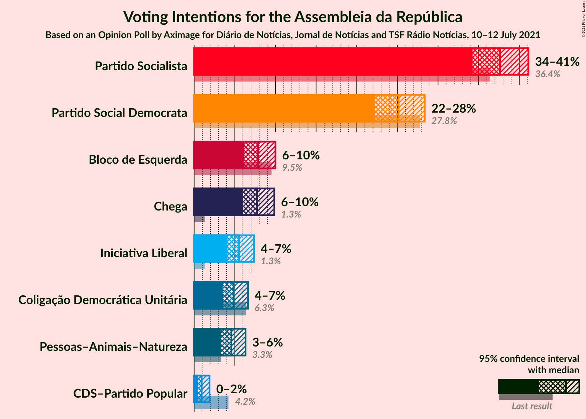

### Confidence Intervals

| Party | Last Result | Poll Result | 80% Confidence Interval | 90% Confidence Interval | 95% Confidence Interval | 99% Confidence Interval |
|:-----:|:-----------:|:-----------:|:-----------------------:|:-----------------------:|:-----------------------:|:-----------------------:|
| Partido Socialista | 36.4% | 37.6% | 35.4–39.9% |34.8–40.6% |34.2–41.1% |33.2–42.2% |
| Partido Social Democrata | 27.8% | 25.2% | 23.2–27.3% |22.7–27.8% |22.2–28.4% |21.3–29.4% |
| Bloco de Esquerda | 9.5% | 7.9% | 6.7–9.3% |6.4–9.6% |6.2–10.0% |5.7–10.7% |
| Chega | 1.3% | 7.7% | 6.6–9.1% |6.3–9.5% |6.0–9.9% |5.5–10.6% |
| Iniciativa Liberal | 1.3% | 5.5% | 4.6–6.7% |4.3–7.1% |4.1–7.4% |3.7–8.0% |
| Coligação Democrática Unitária | 6.3% | 4.8% | 4.0–6.0% |3.7–6.3% |3.5–6.6% |3.2–7.2% |
| Pessoas–Animais–Natureza | 3.3% | 4.6% | 3.7–5.7% |3.5–6.0% |3.3–6.3% |3.0–6.9% |
| CDS–Partido Popular | 4.2% | 0.9% | 0.6–1.5% |0.5–1.7% |0.4–1.9% |0.3–2.2% |

*Note:* The poll result column reflects the actual value used in the calculations. Published results may vary slightly, and in addition be rounded to fewer digits.

## Seats

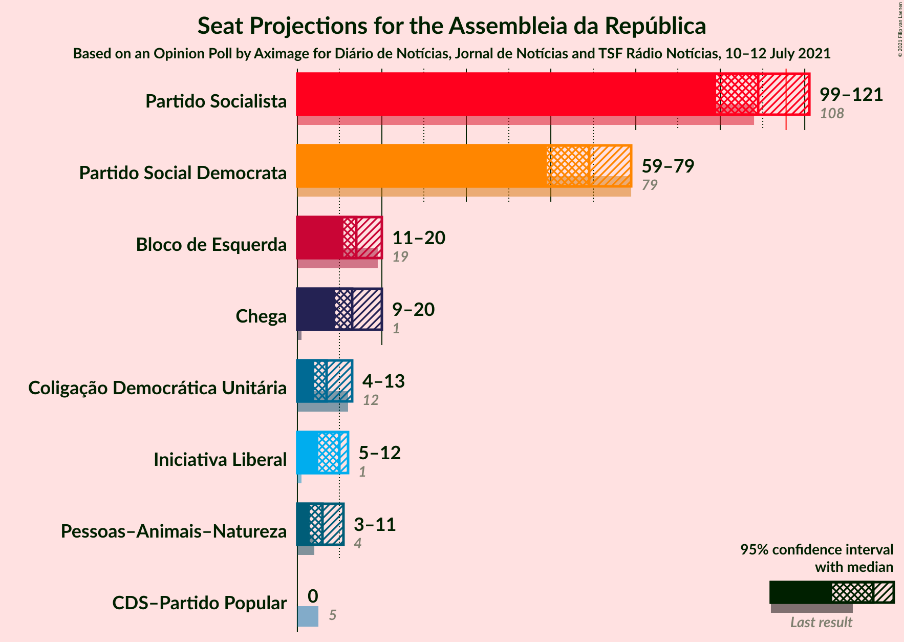

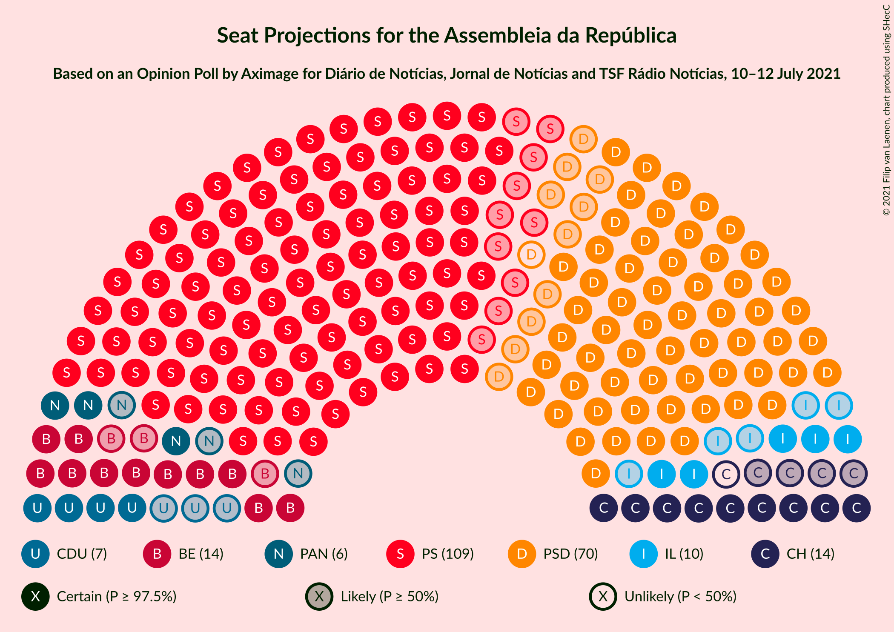

### Confidence Intervals

| Party | Last Result | Median | 80% Confidence Interval | 90% Confidence Interval | 95% Confidence Interval | 99% Confidence Interval |
|:-----:|:-----------:|:------:|:-----------------------:|:-----------------------:|:-----------------------:|:-----------------------:|
| <a href="#partido-socialista">Partido Socialista</a> | 108 | 109 | 103–116 |101–118 |99–121 |96–124 |
| <a href="#partido-social-democrata">Partido Social Democrata</a> | 79 | 69 | 64–76 |61–78 |59–79 |57–83 |
| <a href="#bloco-de-esquerda">Bloco de Esquerda</a> | 19 | 14 | 12–18 |11–19 |11–20 |7–22 |
| <a href="#chega">Chega</a> | 1 | 13 | 11–17 |10–19 |9–20 |8–23 |
| <a href="#iniciativa-liberal">Iniciativa Liberal</a> | 1 | 10 | 6–12 |5–12 |5–12 |5–14 |
| <a href="#coligação-democrática-unitária">Coligação Democrática Unitária</a> | 12 | 7 | 5–10 |5–11 |4–13 |3–14 |
| <a href="#pessoas–animais–natureza">Pessoas–Animais–Natureza</a> | 4 | 6 | 4–9 |4–9 |3–11 |2–12 |
| <a href="#cds–partido-popular">CDS–Partido Popular</a> | 5 | 0 | 0 |0 |0 |0–1 |

### Partido Socialista

*For a full overview of the results for this party, see the [Partido Socialista](party-partidosocialista.html) page.*

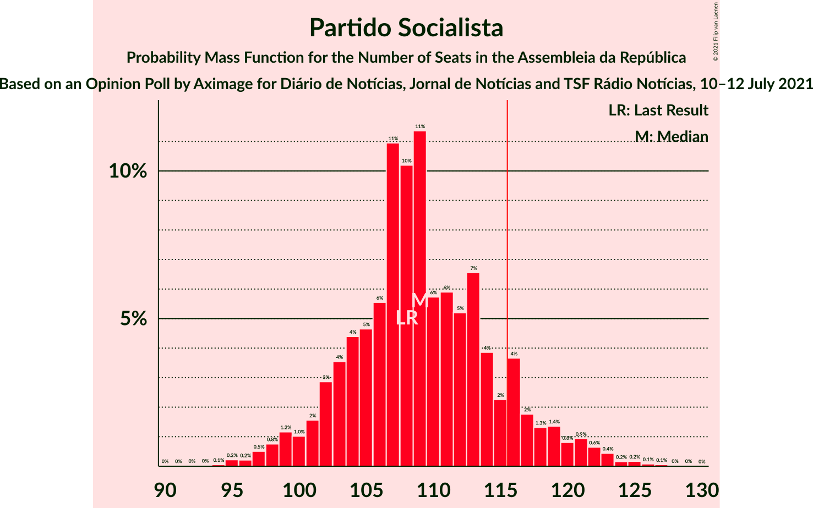

| Number of Seats | Probability | Accumulated | Special Marks |
|:---------------:|:-----------:|:-----------:|:-------------:|
| 92 | 0% | 100% |  |
| 93 | 0% | 99.9% |  |
| 94 | 0.1% | 99.9% |  |
| 95 | 0.2% | 99.9% |  |
| 96 | 0.2% | 99.6% |  |
| 97 | 0.5% | 99.4% |  |
| 98 | 0.8% | 98.9% |  |
| 99 | 1.2% | 98% |  |
| 100 | 1.0% | 97% |  |
| 101 | 2% | 96% |  |
| 102 | 3% | 94% |  |
| 103 | 4% | 92% |  |
| 104 | 4% | 88% |  |
| 105 | 5% | 84% |  |
| 106 | 6% | 79% |  |
| 107 | 11% | 73% |  |
| 108 | 10% | 62% | Last Result |
| 109 | 11% | 52% | Median |
| 110 | 6% | 41% |  |
| 111 | 6% | 35% |  |
| 112 | 5% | 29% |  |
| 113 | 7% | 24% |  |
| 114 | 4% | 18% |  |
| 115 | 2% | 14% |  |
| 116 | 4% | 11% | Majority |
| 117 | 2% | 8% |  |
| 118 | 1.3% | 6% |  |
| 119 | 1.4% | 5% |  |
| 120 | 0.8% | 3% |  |
| 121 | 0.9% | 3% |  |
| 122 | 0.6% | 2% |  |
| 123 | 0.4% | 0.9% |  |
| 124 | 0.2% | 0.5% |  |
| 125 | 0.2% | 0.3% |  |
| 126 | 0.1% | 0.2% |  |
| 127 | 0.1% | 0.1% |  |
| 128 | 0% | 0% |  |

### Partido Social Democrata

*For a full overview of the results for this party, see the [Partido Social Democrata](party-partidosocialdemocrata.html) page.*

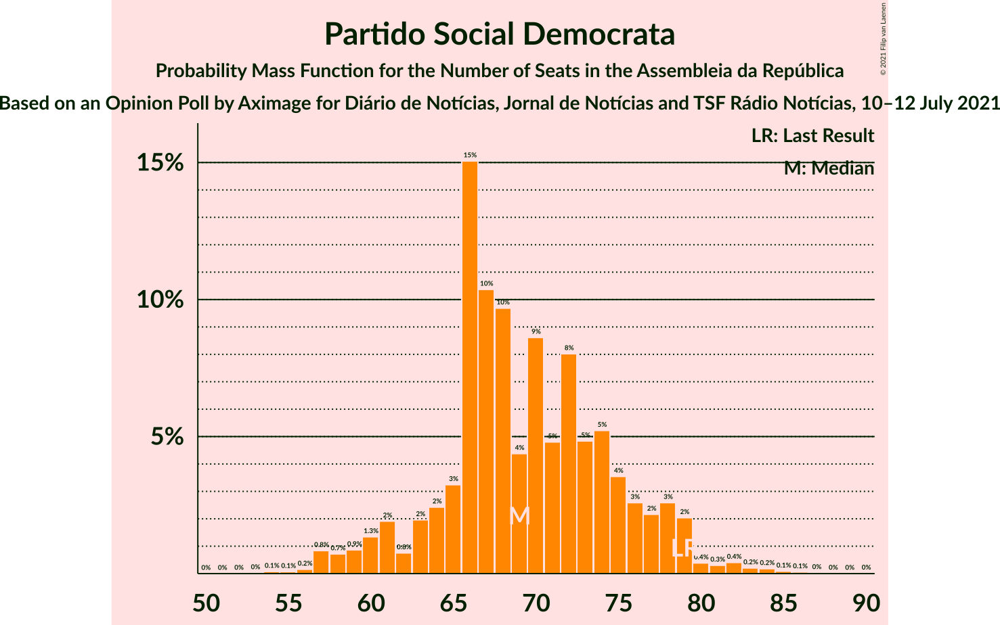

| Number of Seats | Probability | Accumulated | Special Marks |
|:---------------:|:-----------:|:-----------:|:-------------:|
| 54 | 0.1% | 100% |  |
| 55 | 0.1% | 99.9% |  |
| 56 | 0.2% | 99.8% |  |
| 57 | 0.8% | 99.7% |  |
| 58 | 0.7% | 98.8% |  |
| 59 | 0.9% | 98% |  |
| 60 | 1.3% | 97% |  |
| 61 | 2% | 96% |  |
| 62 | 0.8% | 94% |  |
| 63 | 2% | 93% |  |
| 64 | 2% | 91% |  |
| 65 | 3% | 89% |  |
| 66 | 15% | 86% |  |
| 67 | 10% | 71% |  |
| 68 | 10% | 60% |  |
| 69 | 4% | 50% | Median |
| 70 | 9% | 46% |  |
| 71 | 5% | 37% |  |
| 72 | 8% | 33% |  |
| 73 | 5% | 25% |  |
| 74 | 5% | 20% |  |
| 75 | 4% | 15% |  |
| 76 | 3% | 11% |  |
| 77 | 2% | 8% |  |
| 78 | 3% | 6% |  |
| 79 | 2% | 4% | Last Result |
| 80 | 0.4% | 2% |  |
| 81 | 0.3% | 1.3% |  |
| 82 | 0.4% | 1.0% |  |
| 83 | 0.2% | 0.6% |  |
| 84 | 0.2% | 0.4% |  |
| 85 | 0.1% | 0.2% |  |
| 86 | 0.1% | 0.1% |  |
| 87 | 0% | 0.1% |  |
| 88 | 0% | 0% |  |

### Bloco de Esquerda

*For a full overview of the results for this party, see the [Bloco de Esquerda](party-blocodeesquerda.html) page.*

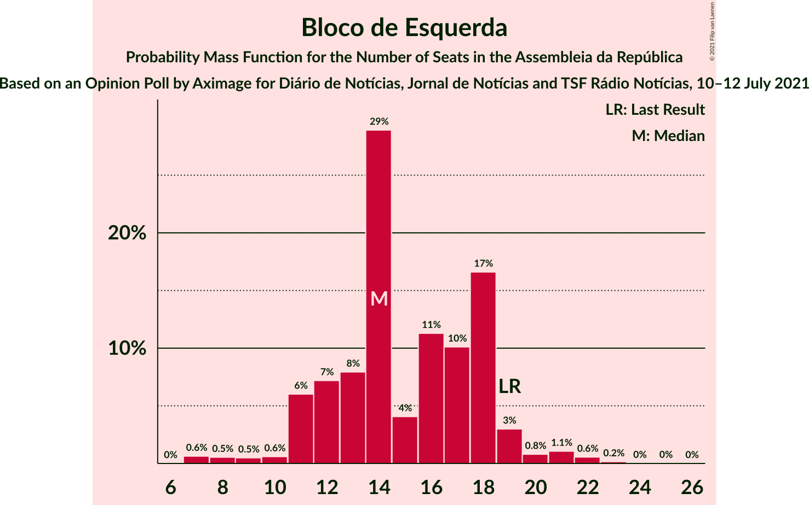

| Number of Seats | Probability | Accumulated | Special Marks |
|:---------------:|:-----------:|:-----------:|:-------------:|
| 7 | 0.6% | 100% |  |
| 8 | 0.5% | 99.4% |  |
| 9 | 0.5% | 98.8% |  |
| 10 | 0.6% | 98% |  |
| 11 | 6% | 98% |  |
| 12 | 7% | 92% |  |
| 13 | 8% | 85% |  |
| 14 | 29% | 77% | Median |
| 15 | 4% | 48% |  |
| 16 | 11% | 44% |  |
| 17 | 10% | 32% |  |
| 18 | 17% | 22% |  |
| 19 | 3% | 6% | Last Result |
| 20 | 0.8% | 3% |  |
| 21 | 1.1% | 2% |  |
| 22 | 0.6% | 0.8% |  |
| 23 | 0.2% | 0.2% |  |
| 24 | 0% | 0.1% |  |
| 25 | 0% | 0% |  |

### Chega

*For a full overview of the results for this party, see the [Chega](party-chega.html) page.*

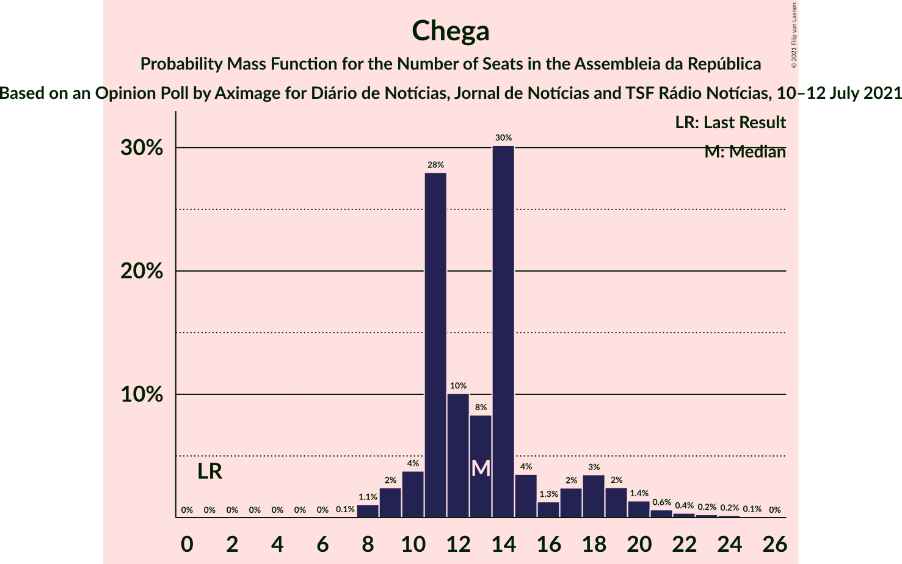

| Number of Seats | Probability | Accumulated | Special Marks |
|:---------------:|:-----------:|:-----------:|:-------------:|
| 1 | 0% | 100% | Last Result |
| 2 | 0% | 100% |  |
| 3 | 0% | 100% |  |
| 4 | 0% | 100% |  |
| 5 | 0% | 100% |  |
| 6 | 0% | 100% |  |
| 7 | 0.1% | 100% |  |
| 8 | 1.1% | 99.9% |  |
| 9 | 2% | 98.8% |  |
| 10 | 4% | 96% |  |
| 11 | 28% | 93% |  |
| 12 | 10% | 65% |  |
| 13 | 8% | 55% | Median |
| 14 | 30% | 46% |  |
| 15 | 4% | 16% |  |
| 16 | 1.3% | 13% |  |
| 17 | 2% | 11% |  |
| 18 | 3% | 9% |  |
| 19 | 2% | 5% |  |
| 20 | 1.4% | 3% |  |
| 21 | 0.6% | 2% |  |
| 22 | 0.4% | 0.9% |  |
| 23 | 0.2% | 0.5% |  |
| 24 | 0.2% | 0.3% |  |
| 25 | 0.1% | 0.1% |  |
| 26 | 0% | 0% |  |

### Iniciativa Liberal

*For a full overview of the results for this party, see the [Iniciativa Liberal](party-iniciativaliberal.html) page.*

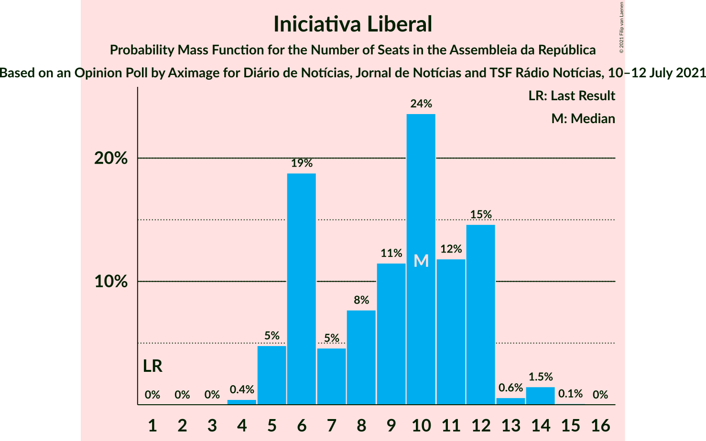

| Number of Seats | Probability | Accumulated | Special Marks |
|:---------------:|:-----------:|:-----------:|:-------------:|
| 1 | 0% | 100% | Last Result |
| 2 | 0% | 100% |  |
| 3 | 0% | 100% |  |
| 4 | 0.4% | 100% |  |
| 5 | 5% | 99.6% |  |
| 6 | 19% | 95% |  |
| 7 | 5% | 76% |  |
| 8 | 8% | 71% |  |
| 9 | 11% | 64% |  |
| 10 | 24% | 52% | Median |
| 11 | 12% | 29% |  |
| 12 | 15% | 17% |  |
| 13 | 0.6% | 2% |  |
| 14 | 1.5% | 2% |  |
| 15 | 0.1% | 0.1% |  |
| 16 | 0% | 0% |  |

### Coligação Democrática Unitária

*For a full overview of the results for this party, see the [Coligação Democrática Unitária](party-coligaçãodemocráticaunitária.html) page.*

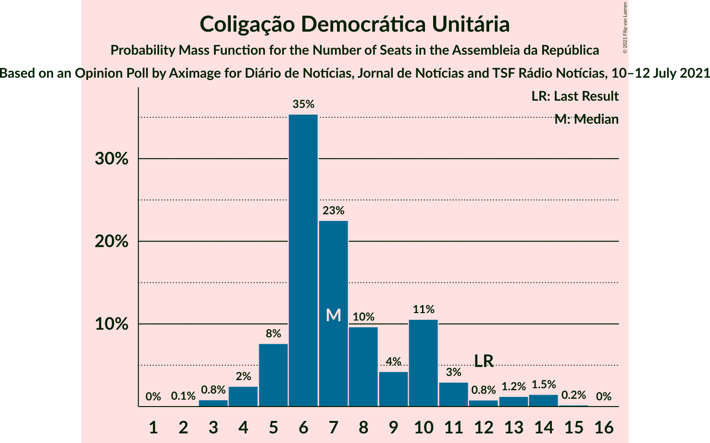

| Number of Seats | Probability | Accumulated | Special Marks |
|:---------------:|:-----------:|:-----------:|:-------------:|
| 2 | 0.1% | 100% |  |
| 3 | 0.8% | 99.9% |  |
| 4 | 2% | 99.1% |  |
| 5 | 8% | 97% |  |
| 6 | 35% | 89% |  |
| 7 | 23% | 54% | Median |
| 8 | 10% | 31% |  |
| 9 | 4% | 21% |  |
| 10 | 11% | 17% |  |
| 11 | 3% | 7% |  |
| 12 | 0.8% | 4% | Last Result |
| 13 | 1.2% | 3% |  |
| 14 | 1.5% | 2% |  |
| 15 | 0.2% | 0.2% |  |
| 16 | 0% | 0% |  |

### Pessoas–Animais–Natureza

*For a full overview of the results for this party, see the [Pessoas–Animais–Natureza](party-pessoas–animais–natureza.html) page.*

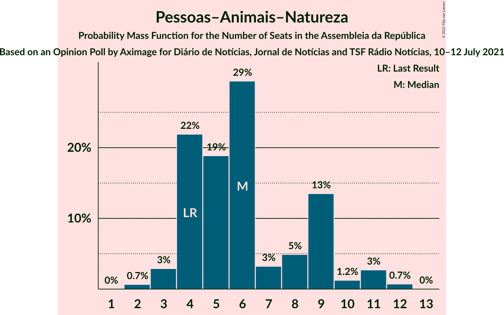

| Number of Seats | Probability | Accumulated | Special Marks |
|:---------------:|:-----------:|:-----------:|:-------------:|
| 2 | 0.7% | 100% |  |
| 3 | 3% | 99.3% |  |
| 4 | 22% | 96% | Last Result |
| 5 | 19% | 75% |  |
| 6 | 29% | 56% | Median |
| 7 | 3% | 26% |  |
| 8 | 5% | 23% |  |
| 9 | 13% | 18% |  |
| 10 | 1.2% | 5% |  |
| 11 | 3% | 3% |  |
| 12 | 0.7% | 0.8% |  |
| 13 | 0% | 0% |  |

### CDS–Partido Popular

*For a full overview of the results for this party, see the [CDS–Partido Popular](party-cds–partidopopular.html) page.*

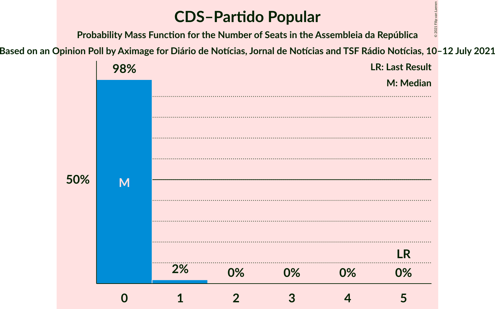

| Number of Seats | Probability | Accumulated | Special Marks |
|:---------------:|:-----------:|:-----------:|:-------------:|
| 0 | 98% | 100% | Median |
| 1 | 2% | 2% |  |
| 2 | 0% | 0% |  |
| 3 | 0% | 0% |  |
| 4 | 0% | 0% |  |
| 5 | 0% | 0% | Last Result |

## Coalitions

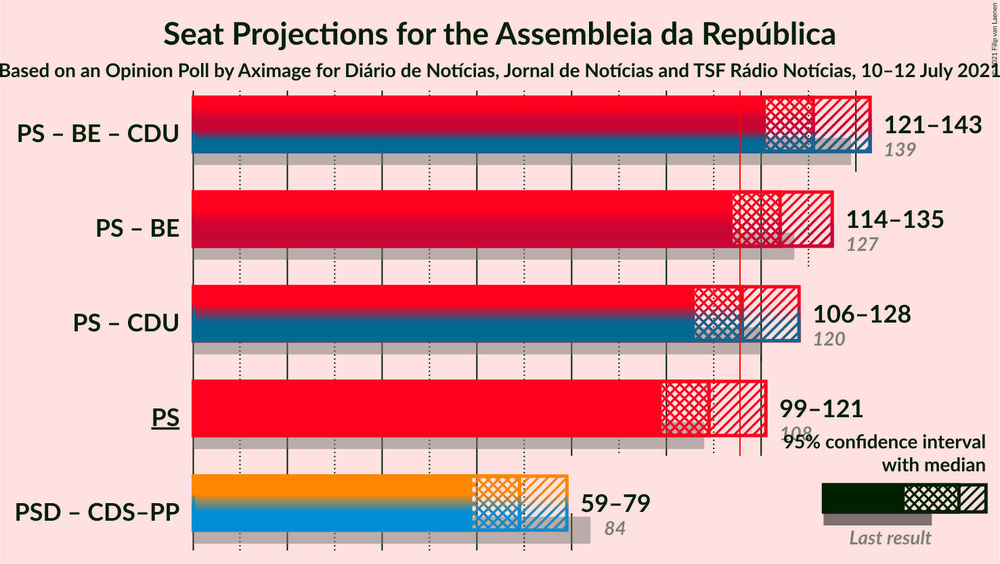

### Confidence Intervals

| Coalition | Last Result | Median | Majority? | 80% Confidence Interval | 90% Confidence Interval | 95% Confidence Interval | 99% Confidence Interval |
|:---------:|:-----------:|:------:|:---------:|:-----------------------:|:-----------------------:|:-----------------------:|:-----------------------:|
| Partido Socialista – Bloco de Esquerda – Coligação Democrática Unitária | 139 | 131 | 99.8% | 125–138 | 123–141 | 121–143 | 118–147 |
| Partido Socialista – Bloco de Esquerda | 127 | 124 | 96% | 118–131 | 116–133 | 114–135 | 111–140 |
| Partido Socialista – Coligação Democrática Unitária | 120 | 116 | 56% | 110–123 | 108–126 | 106–128 | 103–131 |
| Partido Socialista | 108 | 109 | 11% | 103–116 | 101–118 | 99–121 | 96–124 |
| Partido Social Democrata – CDS–Partido Popular | 84 | 69 | 0% | 64–76 | 61–78 | 59–79 | 57–83 |

### Partido Socialista – Bloco de Esquerda – Coligação Democrática Unitária

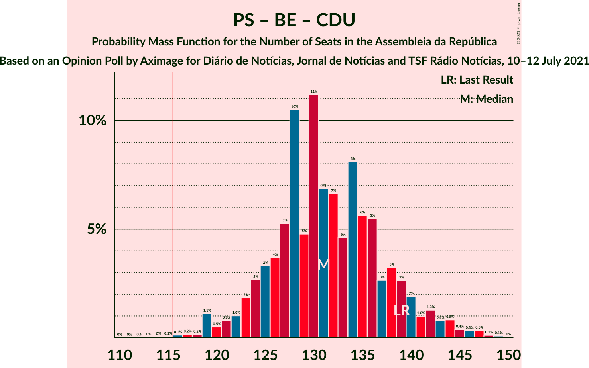

| Number of Seats | Probability | Accumulated | Special Marks |
|:---------------:|:-----------:|:-----------:|:-------------:|
| 113 | 0% | 100% |  |
| 114 | 0% | 99.9% |  |
| 115 | 0.1% | 99.9% |  |
| 116 | 0.1% | 99.8% | Majority |
| 117 | 0.2% | 99.7% |  |
| 118 | 0.2% | 99.6% |  |
| 119 | 1.1% | 99.4% |  |
| 120 | 0.5% | 98% |  |
| 121 | 0.8% | 98% |  |
| 122 | 1.0% | 97% |  |
| 123 | 2% | 96% |  |
| 124 | 3% | 94% |  |
| 125 | 3% | 92% |  |
| 126 | 4% | 88% |  |
| 127 | 5% | 85% |  |
| 128 | 10% | 79% |  |
| 129 | 5% | 69% |  |
| 130 | 11% | 64% | Median |
| 131 | 7% | 53% |  |
| 132 | 7% | 46% |  |
| 133 | 5% | 39% |  |
| 134 | 8% | 35% |  |
| 135 | 6% | 27% |  |
| 136 | 5% | 21% |  |
| 137 | 3% | 16% |  |
| 138 | 3% | 13% |  |
| 139 | 3% | 10% | Last Result |
| 140 | 2% | 7% |  |
| 141 | 1.0% | 5% |  |
| 142 | 1.3% | 4% |  |
| 143 | 0.8% | 3% |  |
| 144 | 0.8% | 2% |  |
| 145 | 0.4% | 1.3% |  |
| 146 | 0.3% | 0.9% |  |
| 147 | 0.3% | 0.6% |  |
| 148 | 0.1% | 0.2% |  |
| 149 | 0.1% | 0.1% |  |
| 150 | 0% | 0% |  |

### Partido Socialista – Bloco de Esquerda

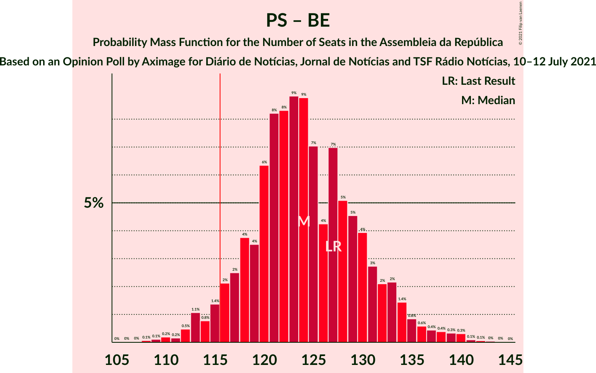

| Number of Seats | Probability | Accumulated | Special Marks |
|:---------------:|:-----------:|:-----------:|:-------------:|
| 106 | 0% | 100% |  |
| 107 | 0% | 99.9% |  |
| 108 | 0.1% | 99.9% |  |
| 109 | 0.1% | 99.8% |  |
| 110 | 0.2% | 99.7% |  |
| 111 | 0.2% | 99.6% |  |
| 112 | 0.5% | 99.4% |  |
| 113 | 1.1% | 98.9% |  |
| 114 | 0.8% | 98% |  |
| 115 | 1.4% | 97% |  |
| 116 | 2% | 96% | Majority |
| 117 | 2% | 94% |  |
| 118 | 4% | 91% |  |
| 119 | 4% | 87% |  |
| 120 | 6% | 84% |  |
| 121 | 8% | 77% |  |
| 122 | 8% | 69% |  |
| 123 | 9% | 61% | Median |
| 124 | 9% | 52% |  |
| 125 | 7% | 43% |  |
| 126 | 4% | 36% |  |
| 127 | 7% | 32% | Last Result |
| 128 | 5% | 25% |  |
| 129 | 5% | 20% |  |
| 130 | 4% | 15% |  |
| 131 | 3% | 12% |  |
| 132 | 2% | 9% |  |
| 133 | 2% | 7% |  |
| 134 | 1.4% | 5% |  |
| 135 | 0.8% | 3% |  |
| 136 | 0.6% | 2% |  |
| 137 | 0.4% | 2% |  |
| 138 | 0.4% | 1.3% |  |
| 139 | 0.3% | 0.9% |  |
| 140 | 0.3% | 0.5% |  |
| 141 | 0.1% | 0.2% |  |
| 142 | 0.1% | 0.1% |  |
| 143 | 0% | 0.1% |  |
| 144 | 0% | 0% |  |

### Partido Socialista – Coligação Democrática Unitária

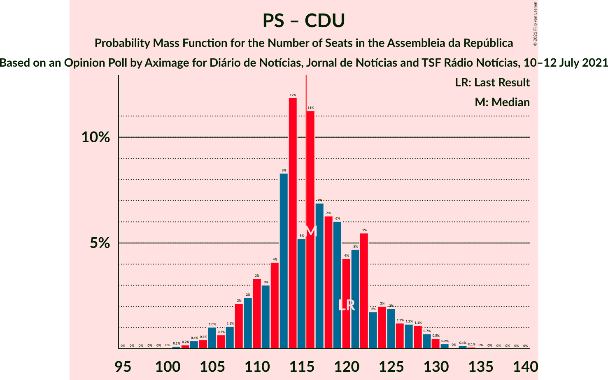

| Number of Seats | Probability | Accumulated | Special Marks |
|:---------------:|:-----------:|:-----------:|:-------------:|
| 99 | 0% | 100% |  |
| 100 | 0% | 99.9% |  |
| 101 | 0.1% | 99.9% |  |
| 102 | 0.2% | 99.8% |  |
| 103 | 0.4% | 99.6% |  |
| 104 | 0.4% | 99.2% |  |
| 105 | 1.0% | 98.8% |  |
| 106 | 0.7% | 98% |  |
| 107 | 1.1% | 97% |  |
| 108 | 2% | 96% |  |
| 109 | 2% | 94% |  |
| 110 | 3% | 92% |  |
| 111 | 3% | 88% |  |
| 112 | 4% | 85% |  |
| 113 | 8% | 81% |  |
| 114 | 12% | 73% |  |
| 115 | 5% | 61% |  |
| 116 | 11% | 56% | Median, Majority |
| 117 | 7% | 44% |  |
| 118 | 6% | 38% |  |
| 119 | 6% | 31% |  |
| 120 | 4% | 25% | Last Result |
| 121 | 5% | 21% |  |
| 122 | 5% | 16% |  |
| 123 | 2% | 11% |  |
| 124 | 2% | 9% |  |
| 125 | 2% | 7% |  |
| 126 | 1.2% | 5% |  |
| 127 | 1.2% | 4% |  |
| 128 | 1.1% | 3% |  |
| 129 | 0.7% | 2% |  |
| 130 | 0.5% | 1.0% |  |
| 131 | 0.2% | 0.6% |  |
| 132 | 0% | 0.3% |  |
| 133 | 0.1% | 0.3% |  |
| 134 | 0.1% | 0.1% |  |
| 135 | 0% | 0.1% |  |
| 136 | 0% | 0% |  |

### Partido Socialista

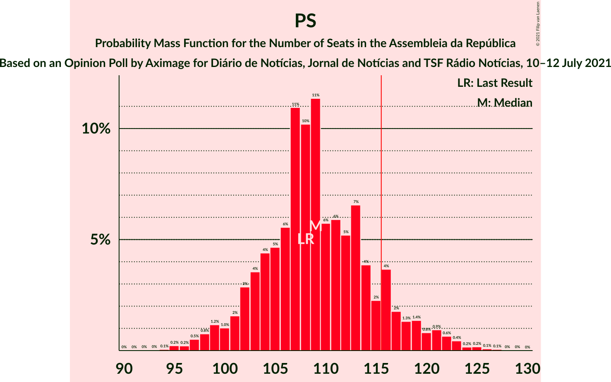

| Number of Seats | Probability | Accumulated | Special Marks |
|:---------------:|:-----------:|:-----------:|:-------------:|
| 92 | 0% | 100% |  |
| 93 | 0% | 99.9% |  |
| 94 | 0.1% | 99.9% |  |
| 95 | 0.2% | 99.9% |  |
| 96 | 0.2% | 99.6% |  |
| 97 | 0.5% | 99.4% |  |
| 98 | 0.8% | 98.9% |  |
| 99 | 1.2% | 98% |  |
| 100 | 1.0% | 97% |  |
| 101 | 2% | 96% |  |
| 102 | 3% | 94% |  |
| 103 | 4% | 92% |  |
| 104 | 4% | 88% |  |
| 105 | 5% | 84% |  |
| 106 | 6% | 79% |  |
| 107 | 11% | 73% |  |
| 108 | 10% | 62% | Last Result |
| 109 | 11% | 52% | Median |
| 110 | 6% | 41% |  |
| 111 | 6% | 35% |  |
| 112 | 5% | 29% |  |
| 113 | 7% | 24% |  |
| 114 | 4% | 18% |  |
| 115 | 2% | 14% |  |
| 116 | 4% | 11% | Majority |
| 117 | 2% | 8% |  |
| 118 | 1.3% | 6% |  |
| 119 | 1.4% | 5% |  |
| 120 | 0.8% | 3% |  |
| 121 | 0.9% | 3% |  |
| 122 | 0.6% | 2% |  |
| 123 | 0.4% | 0.9% |  |
| 124 | 0.2% | 0.5% |  |
| 125 | 0.2% | 0.3% |  |
| 126 | 0.1% | 0.2% |  |
| 127 | 0.1% | 0.1% |  |
| 128 | 0% | 0% |  |

### Partido Social Democrata – CDS–Partido Popular

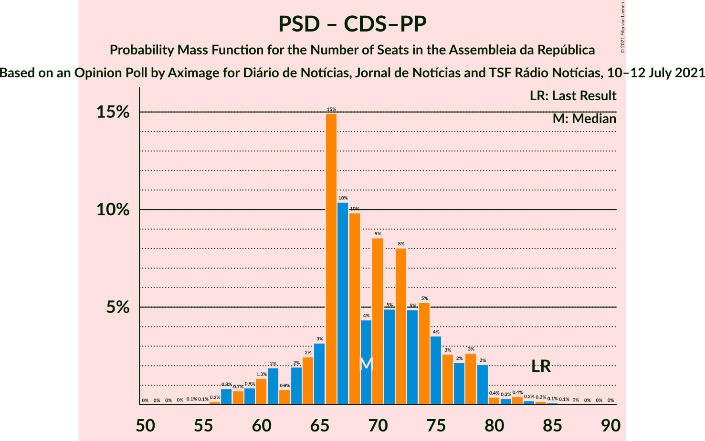

| Number of Seats | Probability | Accumulated | Special Marks |
|:---------------:|:-----------:|:-----------:|:-------------:|
| 54 | 0.1% | 100% |  |
| 55 | 0.1% | 99.9% |  |
| 56 | 0.2% | 99.8% |  |
| 57 | 0.8% | 99.7% |  |
| 58 | 0.7% | 98.8% |  |
| 59 | 0.9% | 98% |  |
| 60 | 1.3% | 97% |  |
| 61 | 2% | 96% |  |
| 62 | 0.8% | 94% |  |
| 63 | 2% | 93% |  |
| 64 | 2% | 91% |  |
| 65 | 3% | 89% |  |
| 66 | 15% | 86% |  |
| 67 | 10% | 71% |  |
| 68 | 10% | 60% |  |
| 69 | 4% | 51% | Median |
| 70 | 9% | 46% |  |
| 71 | 5% | 38% |  |
| 72 | 8% | 33% |  |
| 73 | 5% | 25% |  |
| 74 | 5% | 20% |  |
| 75 | 4% | 15% |  |
| 76 | 3% | 11% |  |
| 77 | 2% | 9% |  |
| 78 | 3% | 6% |  |
| 79 | 2% | 4% |  |
| 80 | 0.4% | 2% |  |
| 81 | 0.3% | 1.3% |  |
| 82 | 0.4% | 1.0% |  |
| 83 | 0.2% | 0.6% |  |
| 84 | 0.2% | 0.4% | Last Result |
| 85 | 0.1% | 0.2% |  |
| 86 | 0.1% | 0.1% |  |
| 87 | 0% | 0.1% |  |
| 88 | 0% | 0% |  |

## Technical Information

### Opinion Poll

+ **Polling firm:** Aximage
+ **Commissioner(s):** Diário de Notícias, Jornal de Notícias and TSF Rádio Notícias
+ **Fieldwork period:** 10–12 July 2021

### Calculations

+ **Sample size:** 763
+ **Simulations done:** 1,048,576
+ **Error estimate:** 1.65%

