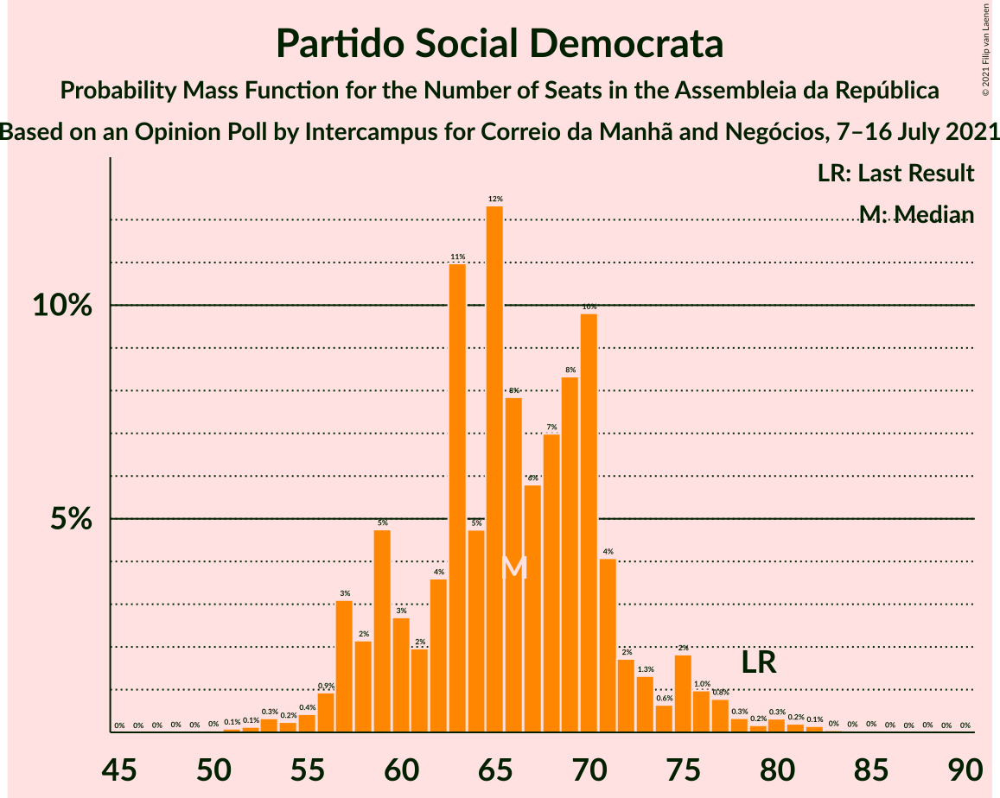
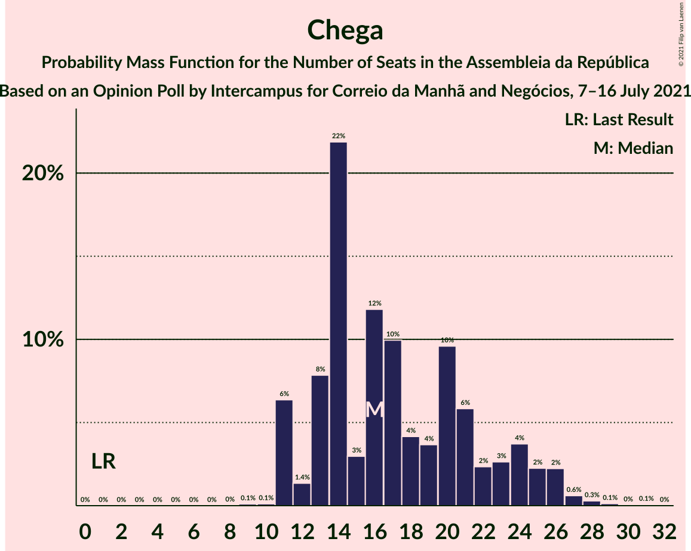
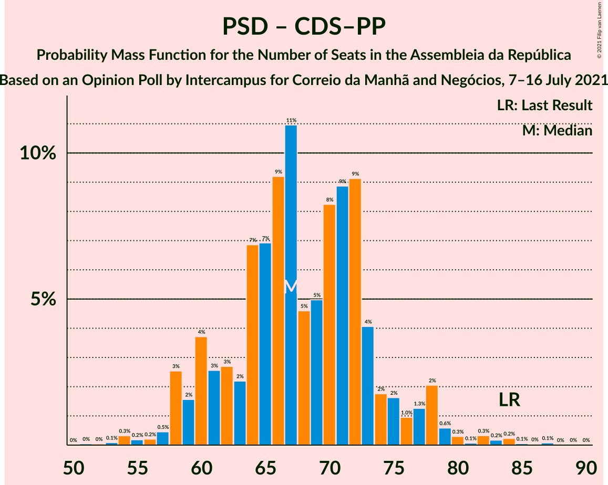

# Opinion Poll by Intercampus for Correio da Manhã and Negócios, 7–16 July 2021

<a href="#voting-intentions">Voting Intentions</a> | <a href="#seats">Seats</a> | <a href="#coalitions">Coalitions</a> | <a href="#technical-information">Technical Information</a>

## Voting Intentions

### Confidence Intervals

| Party | Last Result | Poll Result | 80% Confidence Interval | 90% Confidence Interval | 95% Confidence Interval | 99% Confidence Interval |
|:-----:|:-----------:|:-----------:|:-----------------------:|:-----------------------:|:-----------------------:|:-----------------------:|
| Partido Socialista | 36.4% | 34.8% | 32.3–37.3% |31.7–38.0% |31.1–38.6% |29.9–39.9% |
| Partido Social Democrata | 27.8% | 23.4% | 21.3–25.7% |20.7–26.4% |20.2–26.9% |19.2–28.1% |
| Bloco de Esquerda | 9.5% | 9.1% | 7.7–10.7% |7.3–11.2% |7.0–11.6% |6.4–12.5% |
| Chega | 1.3% | 9.1% | 7.7–10.7% |7.3–11.2% |7.0–11.6% |6.4–12.5% |
| Coligação Democrática Unitária | 6.3% | 6.8% | 5.6–8.2% |5.3–8.7% |5.0–9.0% |4.5–9.8% |
| Pessoas–Animais–Natureza | 3.3% | 4.4% | 3.5–5.7% |3.3–6.1% |3.1–6.4% |2.7–7.1% |
| Iniciativa Liberal | 1.3% | 3.1% | 2.4–4.2% |2.2–4.6% |2.0–4.8% |1.7–5.4% |
| CDS–Partido Popular | 4.2% | 2.8% | 2.1–3.9% |1.9–4.2% |1.8–4.5% |1.5–5.0% |
| LIVRE | 1.1% | 0.7% | 0.4–1.3% |0.3–1.5% |0.3–1.7% |0.2–2.1% |

*Note:* The poll result column reflects the actual value used in the calculations. Published results may vary slightly, and in addition be rounded to fewer digits.

## Seats

### Confidence Intervals

| Party | Last Result | Median | 80% Confidence Interval | 90% Confidence Interval | 95% Confidence Interval | 99% Confidence Interval |
|:-----:|:-----------:|:------:|:-----------------------:|:-----------------------:|:-----------------------:|:-----------------------:|
| <a href="#partido-socialista">Partido Socialista</a> | 108 | 103 | 97–111 |94–113 |91–115 |86–118 |
| <a href="#partido-social-democrata">Partido Social Democrata</a> | 79 | 66 | 59–71 |57–74 |57–76 |53–81 |
| <a href="#bloco-de-esquerda">Bloco de Esquerda</a> | 19 | 18 | 15–22 |13–24 |12–25 |11–28 |
| <a href="#chega">Chega</a> | 1 | 16 | 13–23 |11–25 |11–26 |11–28 |
| <a href="#coligação-democrática-unitária">Coligação Democrática Unitária</a> | 12 | 13 | 9–15 |8–18 |7–18 |6–20 |
| <a href="#pessoas–animais–natureza">Pessoas–Animais–Natureza</a> | 4 | 6 | 4–9 |3–10 |3–11 |2–11 |
| <a href="#iniciativa-liberal">Iniciativa Liberal</a> | 1 | 4 | 3–6 |3–6 |2–6 |1–8 |
| <a href="#cds–partido-popular">CDS–Partido Popular</a> | 5 | 2 | 1–3 |1–4 |1–5 |0–5 |
| <a href="#livre">LIVRE</a> | 1 | 0 | 0–1 |0–1 |0–1 |0–1 |

### Partido Socialista

*For a full overview of the results for this party, see the [Partido Socialista](party-partidosocialista.html) page.*

| Number of Seats | Probability | Accumulated | Special Marks |
|:---------------:|:-----------:|:-----------:|:-------------:|
| 82 | 0% | 100% |  |
| 83 | 0% | 99.9% |  |
| 84 | 0.1% | 99.9% |  |
| 85 | 0.1% | 99.8% |  |
| 86 | 0.2% | 99.7% |  |
| 87 | 0.3% | 99.4% |  |
| 88 | 0.4% | 99.1% |  |
| 89 | 0.3% | 98.7% |  |
| 90 | 0.7% | 98% |  |
| 91 | 0.8% | 98% |  |
| 92 | 0.6% | 97% |  |
| 93 | 0.7% | 96% |  |
| 94 | 0.8% | 96% |  |
| 95 | 3% | 95% |  |
| 96 | 2% | 92% |  |
| 97 | 3% | 90% |  |
| 98 | 4% | 87% |  |
| 99 | 7% | 83% |  |
| 100 | 5% | 76% |  |
| 101 | 2% | 71% |  |
| 102 | 12% | 68% |  |
| 103 | 9% | 57% | Median |
| 104 | 6% | 48% |  |
| 105 | 3% | 42% |  |
| 106 | 9% | 39% |  |
| 107 | 9% | 30% |  |
| 108 | 4% | 21% | Last Result |
| 109 | 4% | 17% |  |
| 110 | 2% | 13% |  |
| 111 | 3% | 10% |  |
| 112 | 1.0% | 8% |  |
| 113 | 2% | 7% |  |
| 114 | 0.5% | 4% |  |
| 115 | 2% | 4% |  |
| 116 | 0.8% | 2% | Majority |
| 117 | 0.5% | 1.1% |  |
| 118 | 0.2% | 0.7% |  |
| 119 | 0.2% | 0.5% |  |
| 120 | 0.1% | 0.3% |  |
| 121 | 0.1% | 0.2% |  |
| 122 | 0.1% | 0.1% |  |
| 123 | 0.1% | 0.1% |  |
| 124 | 0% | 0% |  |

### Partido Social Democrata

*For a full overview of the results for this party, see the [Partido Social Democrata](party-partidosocialdemocrata.html) page.*

| Number of Seats | Probability | Accumulated | Special Marks |
|:---------------:|:-----------:|:-----------:|:-------------:|
| 49 | 0% | 100% |  |
| 50 | 0% | 99.9% |  |
| 51 | 0.1% | 99.9% |  |
| 52 | 0.1% | 99.8% |  |
| 53 | 0.3% | 99.7% |  |
| 54 | 0.2% | 99.4% |  |
| 55 | 0.4% | 99.1% |  |
| 56 | 0.9% | 98.7% |  |
| 57 | 3% | 98% |  |
| 58 | 2% | 95% |  |
| 59 | 5% | 93% |  |
| 60 | 3% | 88% |  |
| 61 | 2% | 85% |  |
| 62 | 4% | 83% |  |
| 63 | 11% | 80% |  |
| 64 | 5% | 69% |  |
| 65 | 12% | 64% |  |
| 66 | 8% | 51% | Median |
| 67 | 6% | 44% |  |
| 68 | 7% | 38% |  |
| 69 | 8% | 31% |  |
| 70 | 10% | 22% |  |
| 71 | 4% | 13% |  |
| 72 | 2% | 9% |  |
| 73 | 1.3% | 7% |  |
| 74 | 0.6% | 6% |  |
| 75 | 2% | 5% |  |
| 76 | 1.0% | 3% |  |
| 77 | 0.8% | 2% |  |
| 78 | 0.3% | 1.3% |  |
| 79 | 0.2% | 1.0% | Last Result |
| 80 | 0.3% | 0.8% |  |
| 81 | 0.2% | 0.5% |  |
| 82 | 0.1% | 0.3% |  |
| 83 | 0% | 0.2% |  |
| 84 | 0% | 0.1% |  |
| 85 | 0% | 0.1% |  |
| 86 | 0% | 0.1% |  |
| 87 | 0% | 0% |  |

### Bloco de Esquerda

*For a full overview of the results for this party, see the [Bloco de Esquerda](party-blocodeesquerda.html) page.*

| Number of Seats | Probability | Accumulated | Special Marks |
|:---------------:|:-----------:|:-----------:|:-------------:|
| 8 | 0% | 100% |  |
| 9 | 0% | 99.9% |  |
| 10 | 0.1% | 99.9% |  |
| 11 | 0.4% | 99.8% |  |
| 12 | 2% | 99.4% |  |
| 13 | 3% | 97% |  |
| 14 | 4% | 94% |  |
| 15 | 3% | 90% |  |
| 16 | 8% | 88% |  |
| 17 | 6% | 79% |  |
| 18 | 30% | 74% | Median |
| 19 | 14% | 44% | Last Result |
| 20 | 2% | 30% |  |
| 21 | 11% | 27% |  |
| 22 | 6% | 16% |  |
| 23 | 3% | 10% |  |
| 24 | 4% | 7% |  |
| 25 | 1.0% | 3% |  |
| 26 | 0.7% | 2% |  |
| 27 | 0.4% | 1.3% |  |
| 28 | 0.4% | 0.9% |  |
| 29 | 0.1% | 0.5% |  |
| 30 | 0.3% | 0.4% |  |
| 31 | 0.1% | 0.1% |  |
| 32 | 0% | 0% |  |

### Chega

*For a full overview of the results for this party, see the [Chega](party-chega.html) page.*

| Number of Seats | Probability | Accumulated | Special Marks |
|:---------------:|:-----------:|:-----------:|:-------------:|
| 1 | 0% | 100% | Last Result |
| 2 | 0% | 100% |  |
| 3 | 0% | 100% |  |
| 4 | 0% | 100% |  |
| 5 | 0% | 100% |  |
| 6 | 0% | 100% |  |
| 7 | 0% | 100% |  |
| 8 | 0% | 100% |  |
| 9 | 0.1% | 100% |  |
| 10 | 0.1% | 99.9% |  |
| 11 | 6% | 99.8% |  |
| 12 | 1.4% | 93% |  |
| 13 | 8% | 92% |  |
| 14 | 22% | 84% |  |
| 15 | 3% | 62% |  |
| 16 | 12% | 59% | Median |
| 17 | 10% | 48% |  |
| 18 | 4% | 38% |  |
| 19 | 4% | 33% |  |
| 20 | 10% | 30% |  |
| 21 | 6% | 20% |  |
| 22 | 2% | 14% |  |
| 23 | 3% | 12% |  |
| 24 | 4% | 9% |  |
| 25 | 2% | 6% |  |
| 26 | 2% | 3% |  |
| 27 | 0.6% | 1.1% |  |
| 28 | 0.3% | 0.5% |  |
| 29 | 0.1% | 0.2% |  |
| 30 | 0% | 0.1% |  |
| 31 | 0.1% | 0.1% |  |
| 32 | 0% | 0% |  |

### Coligação Democrática Unitária

*For a full overview of the results for this party, see the [Coligação Democrática Unitária](party-coligaçãodemocráticaunitária.html) page.*

| Number of Seats | Probability | Accumulated | Special Marks |
|:---------------:|:-----------:|:-----------:|:-------------:|
| 5 | 0.2% | 100% |  |
| 6 | 0.6% | 99.8% |  |
| 7 | 3% | 99.2% |  |
| 8 | 3% | 96% |  |
| 9 | 3% | 93% |  |
| 10 | 11% | 90% |  |
| 11 | 9% | 79% |  |
| 12 | 17% | 70% | Last Result |
| 13 | 15% | 53% | Median |
| 14 | 19% | 38% |  |
| 15 | 9% | 19% |  |
| 16 | 2% | 10% |  |
| 17 | 2% | 8% |  |
| 18 | 5% | 6% |  |
| 19 | 0.5% | 1.0% |  |
| 20 | 0.2% | 0.5% |  |
| 21 | 0.1% | 0.3% |  |
| 22 | 0.1% | 0.2% |  |
| 23 | 0.1% | 0.2% |  |
| 24 | 0% | 0% |  |

### Pessoas–Animais–Natureza

*For a full overview of the results for this party, see the [Pessoas–Animais–Natureza](party-pessoas–animais–natureza.html) page.*

| Number of Seats | Probability | Accumulated | Special Marks |
|:---------------:|:-----------:|:-----------:|:-------------:|
| 2 | 1.1% | 100% |  |
| 3 | 5% | 98.9% |  |
| 4 | 20% | 94% | Last Result |
| 5 | 18% | 74% |  |
| 6 | 24% | 56% | Median |
| 7 | 5% | 32% |  |
| 8 | 10% | 27% |  |
| 9 | 12% | 17% |  |
| 10 | 1.3% | 5% |  |
| 11 | 4% | 4% |  |
| 12 | 0.4% | 0.5% |  |
| 13 | 0.1% | 0.1% |  |
| 14 | 0% | 0% |  |

### Iniciativa Liberal

*For a full overview of the results for this party, see the [Iniciativa Liberal](party-iniciativaliberal.html) page.*

| Number of Seats | Probability | Accumulated | Special Marks |
|:---------------:|:-----------:|:-----------:|:-------------:|
| 1 | 0.5% | 100% | Last Result |
| 2 | 2% | 99.5% |  |
| 3 | 35% | 97% |  |
| 4 | 29% | 62% | Median |
| 5 | 21% | 34% |  |
| 6 | 12% | 13% |  |
| 7 | 0.3% | 0.9% |  |
| 8 | 0.2% | 0.6% |  |
| 9 | 0.3% | 0.4% |  |
| 10 | 0% | 0.1% |  |
| 11 | 0% | 0% |  |

### CDS–Partido Popular

*For a full overview of the results for this party, see the [CDS–Partido Popular](party-cds–partidopopular.html) page.*

| Number of Seats | Probability | Accumulated | Special Marks |
|:---------------:|:-----------:|:-----------:|:-------------:|
| 0 | 2% | 100% |  |
| 1 | 35% | 98% |  |
| 2 | 38% | 63% | Median |
| 3 | 17% | 25% |  |
| 4 | 4% | 8% |  |
| 5 | 4% | 4% | Last Result |
| 6 | 0.1% | 0.2% |  |
| 7 | 0.1% | 0.2% |  |
| 8 | 0% | 0.1% |  |
| 9 | 0% | 0.1% |  |
| 10 | 0% | 0% |  |

### LIVRE

*For a full overview of the results for this party, see the [LIVRE](party-livre.html) page.*

| Number of Seats | Probability | Accumulated | Special Marks |
|:---------------:|:-----------:|:-----------:|:-------------:|
| 0 | 77% | 100% | Median |
| 1 | 23% | 23% | Last Result |
| 2 | 0.2% | 0.3% |  |
| 3 | 0.1% | 0.1% |  |
| 4 | 0% | 0% |  |

## Coalitions

### Confidence Intervals

| Coalition | Last Result | Median | Majority? | 80% Confidence Interval | 90% Confidence Interval | 95% Confidence Interval | 99% Confidence Interval |
|:---------:|:-----------:|:------:|:---------:|:-----------------------:|:-----------------------:|:-----------------------:|:-----------------------:|
| Partido Socialista – Bloco de Esquerda – Coligação Democrática Unitária | 139 | 134 | 99.8% | 128–143 | 124–144 | 121–146 | 118–149 |
| Partido Socialista – Bloco de Esquerda | 127 | 122 | 89% | 115–130 | 112–131 | 109–133 | 105–136 |
| Partido Socialista – Coligação Democrática Unitária | 120 | 116 | 53% | 109–123 | 106–126 | 103–128 | 99–131 |
| Partido Socialista | 108 | 103 | 2% | 97–111 | 94–113 | 91–115 | 86–118 |
| Partido Social Democrata – CDS–Partido Popular | 84 | 67 | 0% | 61–73 | 59–77 | 58–78 | 54–83 |

### Partido Socialista – Bloco de Esquerda – Coligação Democrática Unitária

| Number of Seats | Probability | Accumulated | Special Marks |
|:---------------:|:-----------:|:-----------:|:-------------:|
| 112 | 0% | 100% |  |
| 113 | 0% | 99.9% |  |
| 114 | 0% | 99.9% |  |
| 115 | 0.1% | 99.9% |  |
| 116 | 0.1% | 99.8% | Majority |
| 117 | 0.1% | 99.7% |  |
| 118 | 0.4% | 99.6% |  |
| 119 | 0.4% | 99.3% |  |
| 120 | 0.7% | 98.9% |  |
| 121 | 1.4% | 98% |  |
| 122 | 0.7% | 97% |  |
| 123 | 0.9% | 96% |  |
| 124 | 0.5% | 95% |  |
| 125 | 1.2% | 95% |  |
| 126 | 2% | 94% |  |
| 127 | 0.9% | 92% |  |
| 128 | 2% | 91% |  |
| 129 | 8% | 89% |  |
| 130 | 3% | 81% |  |
| 131 | 5% | 78% |  |
| 132 | 13% | 74% |  |
| 133 | 8% | 60% |  |
| 134 | 6% | 52% | Median |
| 135 | 3% | 46% |  |
| 136 | 7% | 43% |  |
| 137 | 0.8% | 36% |  |
| 138 | 6% | 35% |  |
| 139 | 2% | 29% | Last Result |
| 140 | 7% | 27% |  |
| 141 | 6% | 20% |  |
| 142 | 3% | 13% |  |
| 143 | 2% | 11% |  |
| 144 | 4% | 8% |  |
| 145 | 1.1% | 4% |  |
| 146 | 1.2% | 3% |  |
| 147 | 0.8% | 2% |  |
| 148 | 0.2% | 1.2% |  |
| 149 | 0.5% | 1.0% |  |
| 150 | 0.2% | 0.4% |  |
| 151 | 0.1% | 0.2% |  |
| 152 | 0.1% | 0.2% |  |
| 153 | 0% | 0.1% |  |
| 154 | 0% | 0.1% |  |
| 155 | 0% | 0% |  |

### Partido Socialista – Bloco de Esquerda

| Number of Seats | Probability | Accumulated | Special Marks |
|:---------------:|:-----------:|:-----------:|:-------------:|
| 99 | 0% | 100% |  |
| 100 | 0% | 99.9% |  |
| 101 | 0.1% | 99.9% |  |
| 102 | 0.1% | 99.9% |  |
| 103 | 0% | 99.8% |  |
| 104 | 0.1% | 99.7% |  |
| 105 | 0.2% | 99.7% |  |
| 106 | 0.4% | 99.4% |  |
| 107 | 0.9% | 99.0% |  |
| 108 | 0.4% | 98% |  |
| 109 | 0.4% | 98% |  |
| 110 | 1.0% | 97% |  |
| 111 | 0.6% | 96% |  |
| 112 | 1.2% | 96% |  |
| 113 | 2% | 95% |  |
| 114 | 1.0% | 93% |  |
| 115 | 3% | 92% |  |
| 116 | 2% | 89% | Majority |
| 117 | 3% | 87% |  |
| 118 | 11% | 84% |  |
| 119 | 4% | 73% |  |
| 120 | 13% | 69% |  |
| 121 | 5% | 56% | Median |
| 122 | 6% | 51% |  |
| 123 | 4% | 44% |  |
| 124 | 7% | 40% |  |
| 125 | 5% | 33% |  |
| 126 | 4% | 28% |  |
| 127 | 4% | 25% | Last Result |
| 128 | 8% | 21% |  |
| 129 | 2% | 14% |  |
| 130 | 2% | 12% |  |
| 131 | 5% | 10% |  |
| 132 | 2% | 5% |  |
| 133 | 0.7% | 3% |  |
| 134 | 0.4% | 2% |  |
| 135 | 0.4% | 2% |  |
| 136 | 0.9% | 1.4% |  |
| 137 | 0.2% | 0.5% |  |
| 138 | 0.1% | 0.3% |  |
| 139 | 0.1% | 0.2% |  |
| 140 | 0.1% | 0.1% |  |
| 141 | 0% | 0.1% |  |
| 142 | 0% | 0% |  |

### Partido Socialista – Coligação Democrática Unitária

| Number of Seats | Probability | Accumulated | Special Marks |
|:---------------:|:-----------:|:-----------:|:-------------:|
| 94 | 0% | 100% |  |
| 95 | 0% | 99.9% |  |
| 96 | 0.1% | 99.9% |  |
| 97 | 0.1% | 99.8% |  |
| 98 | 0.1% | 99.7% |  |
| 99 | 0.2% | 99.6% |  |
| 100 | 0.3% | 99.4% |  |
| 101 | 0.3% | 99.1% |  |
| 102 | 0.7% | 98.8% |  |
| 103 | 1.1% | 98% |  |
| 104 | 0.5% | 97% |  |
| 105 | 0.8% | 96% |  |
| 106 | 2% | 96% |  |
| 107 | 2% | 93% |  |
| 108 | 1.4% | 92% |  |
| 109 | 1.3% | 90% |  |
| 110 | 7% | 89% |  |
| 111 | 3% | 82% |  |
| 112 | 4% | 79% |  |
| 113 | 6% | 76% |  |
| 114 | 8% | 70% |  |
| 115 | 9% | 62% |  |
| 116 | 7% | 53% | Median, Majority |
| 117 | 6% | 46% |  |
| 118 | 4% | 40% |  |
| 119 | 5% | 36% |  |
| 120 | 8% | 31% | Last Result |
| 121 | 4% | 23% |  |
| 122 | 6% | 18% |  |
| 123 | 4% | 12% |  |
| 124 | 0.6% | 8% |  |
| 125 | 2% | 8% |  |
| 126 | 2% | 6% |  |
| 127 | 0.8% | 4% |  |
| 128 | 1.3% | 3% |  |
| 129 | 0.9% | 2% |  |
| 130 | 0.3% | 1.0% |  |
| 131 | 0.3% | 0.7% |  |
| 132 | 0.1% | 0.4% |  |
| 133 | 0.1% | 0.3% |  |
| 134 | 0.1% | 0.2% |  |
| 135 | 0% | 0.1% |  |
| 136 | 0% | 0.1% |  |
| 137 | 0% | 0.1% |  |
| 138 | 0% | 0% |  |

### Partido Socialista

| Number of Seats | Probability | Accumulated | Special Marks |
|:---------------:|:-----------:|:-----------:|:-------------:|
| 82 | 0% | 100% |  |
| 83 | 0% | 99.9% |  |
| 84 | 0.1% | 99.9% |  |
| 85 | 0.1% | 99.8% |  |
| 86 | 0.2% | 99.7% |  |
| 87 | 0.3% | 99.4% |  |
| 88 | 0.4% | 99.1% |  |
| 89 | 0.3% | 98.7% |  |
| 90 | 0.7% | 98% |  |
| 91 | 0.8% | 98% |  |
| 92 | 0.6% | 97% |  |
| 93 | 0.7% | 96% |  |
| 94 | 0.8% | 96% |  |
| 95 | 3% | 95% |  |
| 96 | 2% | 92% |  |
| 97 | 3% | 90% |  |
| 98 | 4% | 87% |  |
| 99 | 7% | 83% |  |
| 100 | 5% | 76% |  |
| 101 | 2% | 71% |  |
| 102 | 12% | 68% |  |
| 103 | 9% | 57% | Median |
| 104 | 6% | 48% |  |
| 105 | 3% | 42% |  |
| 106 | 9% | 39% |  |
| 107 | 9% | 30% |  |
| 108 | 4% | 21% | Last Result |
| 109 | 4% | 17% |  |
| 110 | 2% | 13% |  |
| 111 | 3% | 10% |  |
| 112 | 1.0% | 8% |  |
| 113 | 2% | 7% |  |
| 114 | 0.5% | 4% |  |
| 115 | 2% | 4% |  |
| 116 | 0.8% | 2% | Majority |
| 117 | 0.5% | 1.1% |  |
| 118 | 0.2% | 0.7% |  |
| 119 | 0.2% | 0.5% |  |
| 120 | 0.1% | 0.3% |  |
| 121 | 0.1% | 0.2% |  |
| 122 | 0.1% | 0.1% |  |
| 123 | 0.1% | 0.1% |  |
| 124 | 0% | 0% |  |

### Partido Social Democrata – CDS–Partido Popular

| Number of Seats | Probability | Accumulated | Special Marks |
|:---------------:|:-----------:|:-----------:|:-------------:|
| 51 | 0% | 100% |  |
| 52 | 0% | 99.9% |  |
| 53 | 0.1% | 99.9% |  |
| 54 | 0.3% | 99.8% |  |
| 55 | 0.2% | 99.5% |  |
| 56 | 0.2% | 99.3% |  |
| 57 | 0.5% | 99.1% |  |
| 58 | 3% | 98.6% |  |
| 59 | 2% | 96% |  |
| 60 | 4% | 95% |  |
| 61 | 3% | 91% |  |
| 62 | 3% | 88% |  |
| 63 | 2% | 86% |  |
| 64 | 7% | 83% |  |
| 65 | 7% | 77% |  |
| 66 | 9% | 70% |  |
| 67 | 11% | 60% |  |
| 68 | 5% | 49% | Median |
| 69 | 5% | 45% |  |
| 70 | 8% | 40% |  |
| 71 | 9% | 32% |  |
| 72 | 9% | 23% |  |
| 73 | 4% | 14% |  |
| 74 | 2% | 10% |  |
| 75 | 2% | 8% |  |
| 76 | 1.0% | 6% |  |
| 77 | 1.3% | 5% |  |
| 78 | 2% | 4% |  |
| 79 | 0.6% | 2% |  |
| 80 | 0.3% | 1.3% |  |
| 81 | 0.1% | 1.0% |  |
| 82 | 0.3% | 0.9% |  |
| 83 | 0.2% | 0.6% |  |
| 84 | 0.2% | 0.4% | Last Result |
| 85 | 0.1% | 0.2% |  |
| 86 | 0% | 0.2% |  |
| 87 | 0.1% | 0.1% |  |
| 88 | 0% | 0.1% |  |
| 89 | 0% | 0% |  |

## Technical Information

### Opinion Poll

+ **Polling firm:** Intercampus
+ **Commissioner(s):** Correio da Manhã and Negócios
+ **Fieldwork period:** 7–16 July 2021

### Calculations

+ **Sample size:** 607
+ **Simulations done:** 1,048,576
+ **Error estimate:** 2.19%

