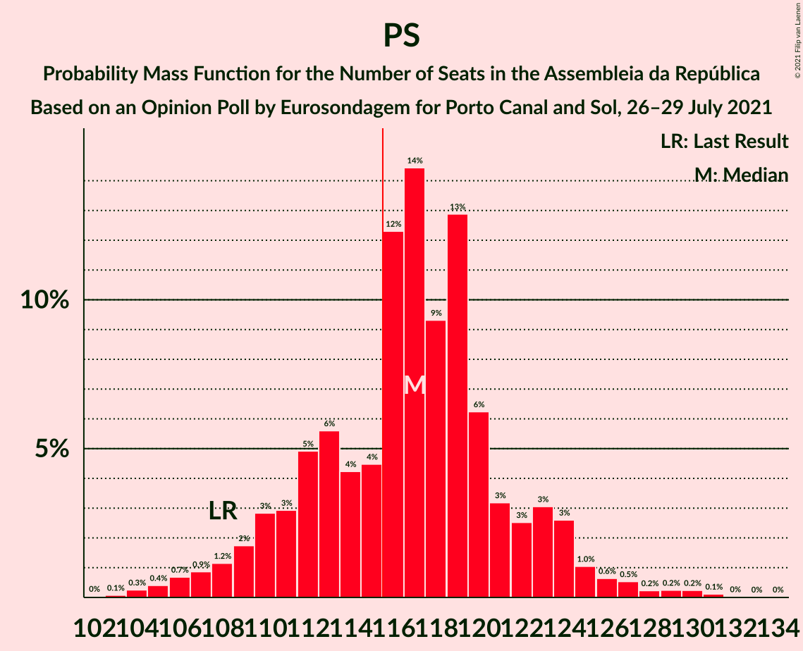

# Opinion Poll by Eurosondagem for Porto Canal and Sol, 26–29 July 2021

<a href="#voting-intentions">Voting Intentions</a> | <a href="#seats">Seats</a> | <a href="#coalitions">Coalitions</a> | <a href="#technical-information">Technical Information</a>

## Voting Intentions

### Confidence Intervals

| Party | Last Result | Poll Result | 80% Confidence Interval | 90% Confidence Interval | 95% Confidence Interval | 99% Confidence Interval |
|:-----:|:-----------:|:-----------:|:-----------------------:|:-----------------------:|:-----------------------:|:-----------------------:|
| Partido Socialista | 36.4% | 41.1% | 39.1–43.1% |38.6–43.6% |38.1–44.1% |37.2–45.1% |
| Partido Social Democrata | 27.8% | 27.3% | 25.6–29.2% |25.1–29.7% |24.7–30.1% |23.9–31.0% |
| Chega | 1.3% | 8.8% | 7.7–10.0% |7.4–10.4% |7.2–10.7% |6.7–11.3% |
| Coligação Democrática Unitária | 6.3% | 5.9% | 5.0–6.9% |4.8–7.2% |4.6–7.5% |4.2–8.0% |
| Bloco de Esquerda | 9.5% | 4.8% | 4.0–5.7% |3.8–6.0% |3.6–6.3% |3.3–6.8% |
| Iniciativa Liberal | 1.3% | 3.3% | 2.7–4.2% |2.5–4.4% |2.4–4.6% |2.1–5.0% |
| Pessoas–Animais–Natureza | 3.3% | 2.2% | 1.8–3.0% |1.6–3.2% |1.5–3.4% |1.3–3.7% |
| CDS–Partido Popular | 4.2% | 2.1% | 1.7–2.9% |1.5–3.0% |1.4–3.2% |1.2–3.6% |

*Note:* The poll result column reflects the actual value used in the calculations. Published results may vary slightly, and in addition be rounded to fewer digits.

## Seats

### Confidence Intervals

| Party | Last Result | Median | 80% Confidence Interval | 90% Confidence Interval | 95% Confidence Interval | 99% Confidence Interval |
|:-----:|:-----------:|:------:|:-----------------------:|:-----------------------:|:-----------------------:|:-----------------------:|
| <a href="#partido-socialista">Partido Socialista</a> | 108 | 117 | 111–122 |109–124 |108–125 |105–129 |
| <a href="#partido-social-democrata">Partido Social Democrata</a> | 79 | 75 | 69–79 |66–80 |64–82 |63–86 |
| <a href="#chega">Chega</a> | 1 | 14 | 12–19 |11–20 |11–22 |11–23 |
| <a href="#coligação-democrática-unitária">Coligação Democrática Unitária</a> | 12 | 9 | 7–13 |6–14 |6–15 |5–15 |
| <a href="#bloco-de-esquerda">Bloco de Esquerda</a> | 19 | 7 | 4–7 |3–9 |3–10 |2–11 |
| <a href="#iniciativa-liberal">Iniciativa Liberal</a> | 1 | 4 | 3–5 |3–6 |3–6 |3–6 |
| <a href="#pessoas–animais–natureza">Pessoas–Animais–Natureza</a> | 4 | 2 | 1–2 |1–3 |0–3 |0–4 |
| <a href="#cds–partido-popular">CDS–Partido Popular</a> | 5 | 1 | 0–2 |0–2 |0–2 |0–3 |

### Partido Socialista

*For a full overview of the results for this party, see the [Partido Socialista](party-partidosocialista.html) page.*

| Number of Seats | Probability | Accumulated | Special Marks |
|:---------------:|:-----------:|:-----------:|:-------------:|
| 102 | 0% | 100% |  |
| 103 | 0.1% | 99.9% |  |
| 104 | 0.3% | 99.8% |  |
| 105 | 0.4% | 99.6% |  |
| 106 | 0.7% | 99.2% |  |
| 107 | 0.9% | 98% |  |
| 108 | 1.2% | 98% | Last Result |
| 109 | 2% | 96% |  |
| 110 | 3% | 95% |  |
| 111 | 3% | 92% |  |
| 112 | 5% | 89% |  |
| 113 | 6% | 84% |  |
| 114 | 4% | 78% |  |
| 115 | 4% | 74% |  |
| 116 | 12% | 70% | Majority |
| 117 | 14% | 57% | Median |
| 118 | 9% | 43% |  |
| 119 | 13% | 34% |  |
| 120 | 6% | 21% |  |
| 121 | 3% | 15% |  |
| 122 | 3% | 11% |  |
| 123 | 3% | 9% |  |
| 124 | 3% | 6% |  |
| 125 | 1.0% | 3% |  |
| 126 | 0.6% | 2% |  |
| 127 | 0.5% | 1.5% |  |
| 128 | 0.2% | 0.9% |  |
| 129 | 0.2% | 0.7% |  |
| 130 | 0.2% | 0.4% |  |
| 131 | 0.1% | 0.2% |  |
| 132 | 0% | 0.1% |  |
| 133 | 0% | 0% |  |

### Partido Social Democrata

*For a full overview of the results for this party, see the [Partido Social Democrata](party-partidosocialdemocrata.html) page.*

| Number of Seats | Probability | Accumulated | Special Marks |
|:---------------:|:-----------:|:-----------:|:-------------:|
| 61 | 0% | 100% |  |
| 62 | 0.3% | 99.9% |  |
| 63 | 2% | 99.7% |  |
| 64 | 1.3% | 98% |  |
| 65 | 0.8% | 97% |  |
| 66 | 1.4% | 96% |  |
| 67 | 1.0% | 94% |  |
| 68 | 2% | 93% |  |
| 69 | 5% | 91% |  |
| 70 | 4% | 86% |  |
| 71 | 6% | 82% |  |
| 72 | 5% | 76% |  |
| 73 | 12% | 71% |  |
| 74 | 8% | 60% |  |
| 75 | 11% | 51% | Median |
| 76 | 12% | 40% |  |
| 77 | 6% | 28% |  |
| 78 | 11% | 22% |  |
| 79 | 2% | 11% | Last Result |
| 80 | 5% | 9% |  |
| 81 | 2% | 4% |  |
| 82 | 0.9% | 3% |  |
| 83 | 0.5% | 2% |  |
| 84 | 0.4% | 1.3% |  |
| 85 | 0.3% | 0.9% |  |
| 86 | 0.4% | 0.6% |  |
| 87 | 0.1% | 0.2% |  |
| 88 | 0.1% | 0.1% |  |
| 89 | 0% | 0% |  |

### Chega

*For a full overview of the results for this party, see the [Chega](party-chega.html) page.*

| Number of Seats | Probability | Accumulated | Special Marks |
|:---------------:|:-----------:|:-----------:|:-------------:|
| 1 | 0% | 100% | Last Result |
| 2 | 0% | 100% |  |
| 3 | 0% | 100% |  |
| 4 | 0% | 100% |  |
| 5 | 0% | 100% |  |
| 6 | 0% | 100% |  |
| 7 | 0% | 100% |  |
| 8 | 0% | 100% |  |
| 9 | 0% | 100% |  |
| 10 | 0.1% | 100% |  |
| 11 | 8% | 99.9% |  |
| 12 | 4% | 92% |  |
| 13 | 13% | 88% |  |
| 14 | 27% | 75% | Median |
| 15 | 8% | 48% |  |
| 16 | 3% | 41% |  |
| 17 | 8% | 38% |  |
| 18 | 19% | 30% |  |
| 19 | 5% | 12% |  |
| 20 | 3% | 7% |  |
| 21 | 1.5% | 4% |  |
| 22 | 2% | 3% |  |
| 23 | 0.4% | 0.6% |  |
| 24 | 0.1% | 0.2% |  |
| 25 | 0% | 0.1% |  |
| 26 | 0% | 0.1% |  |
| 27 | 0% | 0% |  |

### Coligação Democrática Unitária

*For a full overview of the results for this party, see the [Coligação Democrática Unitária](party-coligaçãodemocráticaunitária.html) page.*

| Number of Seats | Probability | Accumulated | Special Marks |
|:---------------:|:-----------:|:-----------:|:-------------:|
| 5 | 1.2% | 100% |  |
| 6 | 6% | 98.7% |  |
| 7 | 16% | 92% |  |
| 8 | 12% | 76% |  |
| 9 | 16% | 64% | Median |
| 10 | 24% | 48% |  |
| 11 | 7% | 24% |  |
| 12 | 4% | 16% | Last Result |
| 13 | 3% | 12% |  |
| 14 | 7% | 9% |  |
| 15 | 2% | 3% |  |
| 16 | 0.2% | 0.5% |  |
| 17 | 0.1% | 0.2% |  |
| 18 | 0.1% | 0.1% |  |
| 19 | 0% | 0% |  |

### Bloco de Esquerda

*For a full overview of the results for this party, see the [Bloco de Esquerda](party-blocodeesquerda.html) page.*

| Number of Seats | Probability | Accumulated | Special Marks |
|:---------------:|:-----------:|:-----------:|:-------------:|
| 2 | 2% | 100% |  |
| 3 | 6% | 98% |  |
| 4 | 4% | 92% |  |
| 5 | 12% | 88% |  |
| 6 | 5% | 76% |  |
| 7 | 62% | 71% | Median |
| 8 | 3% | 9% |  |
| 9 | 1.4% | 5% |  |
| 10 | 1.5% | 4% |  |
| 11 | 2% | 2% |  |
| 12 | 0.1% | 0.2% |  |
| 13 | 0.1% | 0.1% |  |
| 14 | 0% | 0.1% |  |
| 15 | 0% | 0% |  |
| 16 | 0% | 0% |  |
| 17 | 0% | 0% |  |
| 18 | 0% | 0% |  |
| 19 | 0% | 0% | Last Result |

### Iniciativa Liberal

*For a full overview of the results for this party, see the [Iniciativa Liberal](party-iniciativaliberal.html) page.*

| Number of Seats | Probability | Accumulated | Special Marks |
|:---------------:|:-----------:|:-----------:|:-------------:|
| 1 | 0% | 100% | Last Result |
| 2 | 0.2% | 100% |  |
| 3 | 34% | 99.7% |  |
| 4 | 37% | 65% | Median |
| 5 | 21% | 28% |  |
| 6 | 8% | 8% |  |
| 7 | 0.1% | 0.2% |  |
| 8 | 0.1% | 0.1% |  |
| 9 | 0% | 0% |  |

### Pessoas–Animais–Natureza

*For a full overview of the results for this party, see the [Pessoas–Animais–Natureza](party-pessoas–animais–natureza.html) page.*

| Number of Seats | Probability | Accumulated | Special Marks |
|:---------------:|:-----------:|:-----------:|:-------------:|
| 0 | 3% | 100% |  |
| 1 | 24% | 97% |  |
| 2 | 66% | 73% | Median |
| 3 | 6% | 8% |  |
| 4 | 2% | 2% | Last Result |
| 5 | 0.1% | 0.1% |  |
| 6 | 0% | 0% |  |

### CDS–Partido Popular

*For a full overview of the results for this party, see the [CDS–Partido Popular](party-cds–partidopopular.html) page.*

| Number of Seats | Probability | Accumulated | Special Marks |
|:---------------:|:-----------:|:-----------:|:-------------:|
| 0 | 26% | 100% |  |
| 1 | 57% | 74% | Median |
| 2 | 16% | 17% |  |
| 3 | 0.9% | 1.1% |  |
| 4 | 0.1% | 0.1% |  |
| 5 | 0% | 0% | Last Result |

## Coalitions

### Confidence Intervals

| Coalition | Last Result | Median | Majority? | 80% Confidence Interval | 90% Confidence Interval | 95% Confidence Interval | 99% Confidence Interval |
|:---------:|:-----------:|:------:|:---------:|:-----------------------:|:-----------------------:|:-----------------------:|:-----------------------:|
| Partido Socialista – Coligação Democrática Unitária – Bloco de Esquerda | 139 | 133 | 100% | 127–138 | 125–140 | 124–143 | 121–146 |
| Partido Socialista – Coligação Democrática Unitária | 120 | 127 | 99.0% | 121–132 | 119–134 | 117–136 | 114–139 |
| Partido Socialista – Bloco de Esquerda | 127 | 123 | 96% | 118–129 | 116–131 | 114–132 | 111–135 |
| Partido Socialista | 108 | 117 | 70% | 111–122 | 109–124 | 108–125 | 105–129 |
| Partido Social Democrata – CDS–Partido Popular | 84 | 76 | 0% | 70–80 | 67–81 | 65–82 | 63–87 |

### Partido Socialista – Coligação Democrática Unitária – Bloco de Esquerda

| Number of Seats | Probability | Accumulated | Special Marks |
|:---------------:|:-----------:|:-----------:|:-------------:|
| 117 | 0% | 100% |  |
| 118 | 0.1% | 99.9% |  |
| 119 | 0.1% | 99.9% |  |
| 120 | 0.2% | 99.8% |  |
| 121 | 0.3% | 99.6% |  |
| 122 | 0.5% | 99.3% |  |
| 123 | 1.1% | 98.8% |  |
| 124 | 2% | 98% |  |
| 125 | 1.4% | 96% |  |
| 126 | 2% | 95% |  |
| 127 | 4% | 93% |  |
| 128 | 5% | 89% |  |
| 129 | 5% | 84% |  |
| 130 | 8% | 78% |  |
| 131 | 12% | 71% |  |
| 132 | 8% | 59% |  |
| 133 | 8% | 51% | Median |
| 134 | 10% | 43% |  |
| 135 | 8% | 33% |  |
| 136 | 8% | 25% |  |
| 137 | 6% | 17% |  |
| 138 | 3% | 11% |  |
| 139 | 3% | 9% | Last Result |
| 140 | 1.1% | 6% |  |
| 141 | 1.2% | 4% |  |
| 142 | 0.7% | 3% |  |
| 143 | 0.9% | 3% |  |
| 144 | 0.7% | 2% |  |
| 145 | 0.4% | 1.0% |  |
| 146 | 0.2% | 0.6% |  |
| 147 | 0.2% | 0.3% |  |
| 148 | 0.1% | 0.1% |  |
| 149 | 0% | 0% |  |

### Partido Socialista – Coligação Democrática Unitária

| Number of Seats | Probability | Accumulated | Special Marks |
|:---------------:|:-----------:|:-----------:|:-------------:|
| 111 | 0% | 100% |  |
| 112 | 0.1% | 99.9% |  |
| 113 | 0.1% | 99.8% |  |
| 114 | 0.2% | 99.7% |  |
| 115 | 0.5% | 99.5% |  |
| 116 | 0.7% | 99.0% | Majority |
| 117 | 2% | 98% |  |
| 118 | 2% | 97% |  |
| 119 | 2% | 95% |  |
| 120 | 3% | 93% | Last Result |
| 121 | 6% | 90% |  |
| 122 | 5% | 85% |  |
| 123 | 5% | 80% |  |
| 124 | 11% | 75% |  |
| 125 | 6% | 64% |  |
| 126 | 8% | 58% | Median |
| 127 | 12% | 50% |  |
| 128 | 10% | 39% |  |
| 129 | 9% | 29% |  |
| 130 | 5% | 20% |  |
| 131 | 4% | 15% |  |
| 132 | 4% | 11% |  |
| 133 | 2% | 7% |  |
| 134 | 2% | 5% |  |
| 135 | 1.0% | 4% |  |
| 136 | 0.9% | 3% |  |
| 137 | 0.6% | 2% |  |
| 138 | 0.6% | 1.2% |  |
| 139 | 0.2% | 0.6% |  |
| 140 | 0.2% | 0.4% |  |
| 141 | 0.1% | 0.1% |  |
| 142 | 0% | 0% |  |

### Partido Socialista – Bloco de Esquerda

| Number of Seats | Probability | Accumulated | Special Marks |
|:---------------:|:-----------:|:-----------:|:-------------:|
| 108 | 0% | 100% |  |
| 109 | 0.1% | 99.9% |  |
| 110 | 0.1% | 99.9% |  |
| 111 | 0.3% | 99.8% |  |
| 112 | 0.5% | 99.5% |  |
| 113 | 0.9% | 99.0% |  |
| 114 | 1.0% | 98% |  |
| 115 | 1.2% | 97% |  |
| 116 | 2% | 96% | Majority |
| 117 | 3% | 93% |  |
| 118 | 2% | 90% |  |
| 119 | 6% | 88% |  |
| 120 | 7% | 82% |  |
| 121 | 5% | 75% |  |
| 122 | 8% | 70% |  |
| 123 | 15% | 63% |  |
| 124 | 12% | 48% | Median |
| 125 | 9% | 36% |  |
| 126 | 11% | 27% |  |
| 127 | 4% | 16% | Last Result |
| 128 | 2% | 13% |  |
| 129 | 2% | 10% |  |
| 130 | 3% | 8% |  |
| 131 | 2% | 5% |  |
| 132 | 0.8% | 3% |  |
| 133 | 0.6% | 2% |  |
| 134 | 0.8% | 2% |  |
| 135 | 0.3% | 0.8% |  |
| 136 | 0.1% | 0.5% |  |
| 137 | 0.2% | 0.4% |  |
| 138 | 0.1% | 0.1% |  |
| 139 | 0% | 0.1% |  |
| 140 | 0% | 0% |  |

### Partido Socialista

| Number of Seats | Probability | Accumulated | Special Marks |
|:---------------:|:-----------:|:-----------:|:-------------:|
| 102 | 0% | 100% |  |
| 103 | 0.1% | 99.9% |  |
| 104 | 0.3% | 99.8% |  |
| 105 | 0.4% | 99.6% |  |
| 106 | 0.7% | 99.2% |  |
| 107 | 0.9% | 98% |  |
| 108 | 1.2% | 98% | Last Result |
| 109 | 2% | 96% |  |
| 110 | 3% | 95% |  |
| 111 | 3% | 92% |  |
| 112 | 5% | 89% |  |
| 113 | 6% | 84% |  |
| 114 | 4% | 78% |  |
| 115 | 4% | 74% |  |
| 116 | 12% | 70% | Majority |
| 117 | 14% | 57% | Median |
| 118 | 9% | 43% |  |
| 119 | 13% | 34% |  |
| 120 | 6% | 21% |  |
| 121 | 3% | 15% |  |
| 122 | 3% | 11% |  |
| 123 | 3% | 9% |  |
| 124 | 3% | 6% |  |
| 125 | 1.0% | 3% |  |
| 126 | 0.6% | 2% |  |
| 127 | 0.5% | 1.5% |  |
| 128 | 0.2% | 0.9% |  |
| 129 | 0.2% | 0.7% |  |
| 130 | 0.2% | 0.4% |  |
| 131 | 0.1% | 0.2% |  |
| 132 | 0% | 0.1% |  |
| 133 | 0% | 0% |  |

### Partido Social Democrata – CDS–Partido Popular

| Number of Seats | Probability | Accumulated | Special Marks |
|:---------------:|:-----------:|:-----------:|:-------------:|
| 62 | 0% | 100% |  |
| 63 | 0.8% | 99.9% |  |
| 64 | 2% | 99.1% |  |
| 65 | 1.3% | 98% |  |
| 66 | 0.9% | 96% |  |
| 67 | 1.1% | 95% |  |
| 68 | 1.3% | 94% |  |
| 69 | 2% | 93% |  |
| 70 | 5% | 91% |  |
| 71 | 4% | 86% |  |
| 72 | 5% | 82% |  |
| 73 | 5% | 76% |  |
| 74 | 12% | 72% |  |
| 75 | 9% | 60% |  |
| 76 | 12% | 51% | Median |
| 77 | 11% | 39% |  |
| 78 | 7% | 28% |  |
| 79 | 10% | 21% |  |
| 80 | 3% | 11% |  |
| 81 | 4% | 8% |  |
| 82 | 1.4% | 4% |  |
| 83 | 0.5% | 2% |  |
| 84 | 0.4% | 2% | Last Result |
| 85 | 0.5% | 1.4% |  |
| 86 | 0.4% | 1.0% |  |
| 87 | 0.4% | 0.6% |  |
| 88 | 0.1% | 0.2% |  |
| 89 | 0.1% | 0.1% |  |
| 90 | 0% | 0.1% |  |
| 91 | 0% | 0% |  |

## Technical Information

### Opinion Poll

+ **Polling firm:** Eurosondagem
+ **Commissioner(s):** Porto Canal and Sol
+ **Fieldwork period:** 26–29 July 2021

### Calculations

+ **Sample size:** 1025
+ **Simulations done:** 1,048,576
+ **Error estimate:** 1.52%

