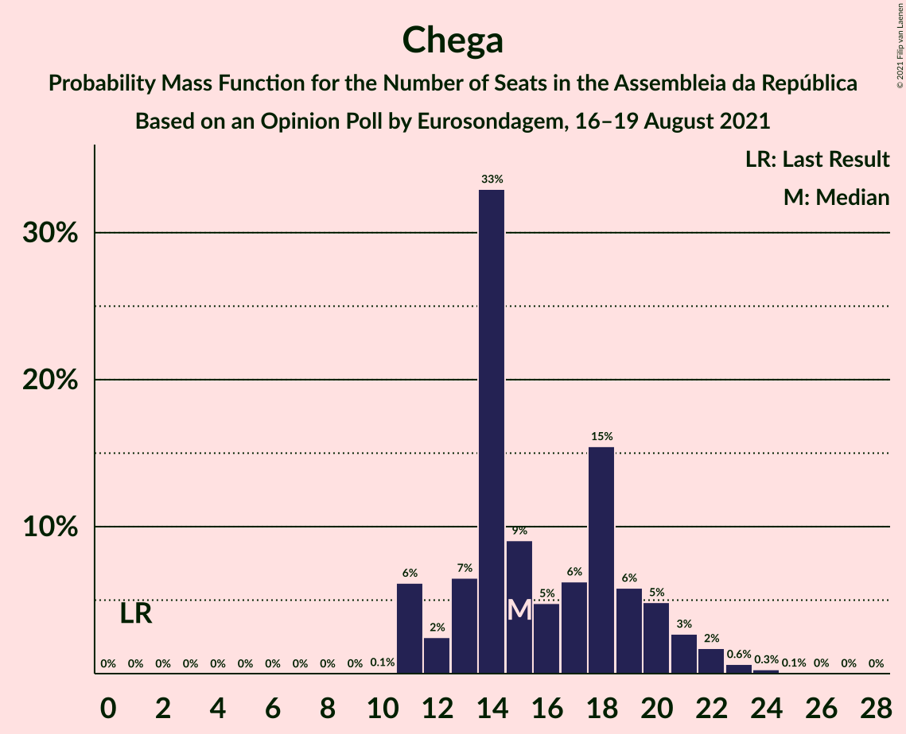
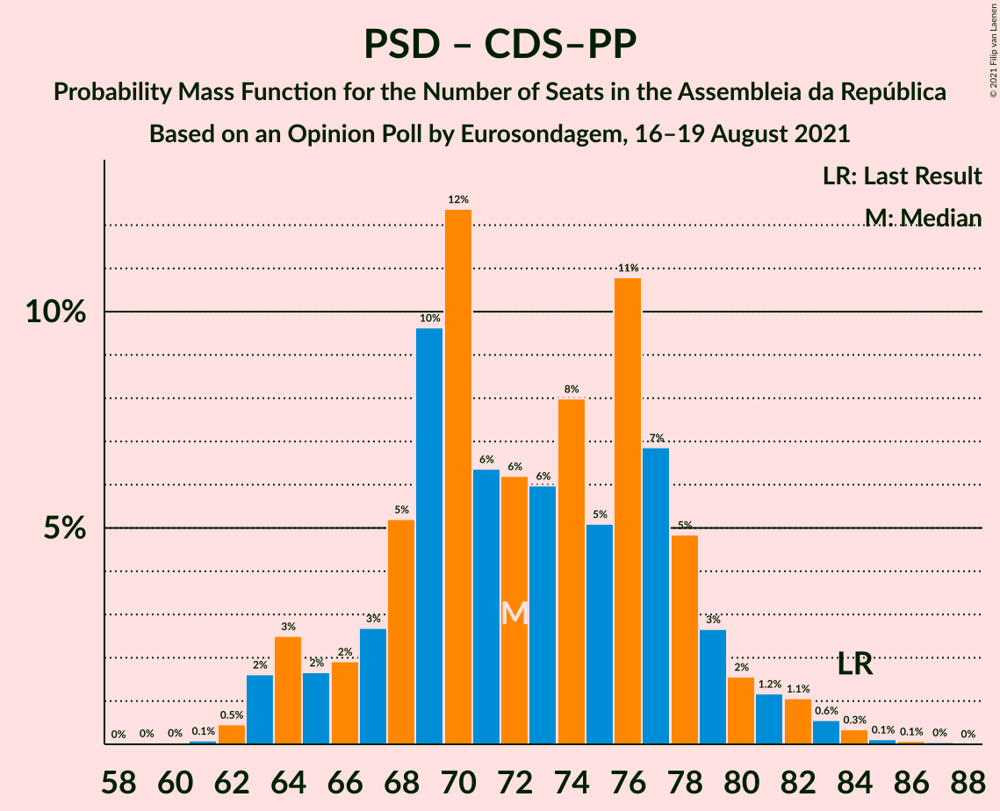

# Opinion Poll by Eurosondagem, 16–19 August 2021

<a href="#voting-intentions">Voting Intentions</a> | <a href="#seats">Seats</a> | <a href="#coalitions">Coalitions</a> | <a href="#technical-information">Technical Information</a>

## Voting Intentions

### Confidence Intervals

| Party | Last Result | Poll Result | 80% Confidence Interval | 90% Confidence Interval | 95% Confidence Interval | 99% Confidence Interval |
|:-----:|:-----------:|:-----------:|:-----------------------:|:-----------------------:|:-----------------------:|:-----------------------:|
| Partido Socialista | 36.4% | 41.3% | 39.3–43.2% |38.8–43.8% |38.3–44.3% |37.4–45.2% |
| Partido Social Democrata | 27.8% | 27.3% | 25.6–29.1% |25.1–29.6% |24.7–30.1% |23.9–30.9% |
| Chega | 1.3% | 9.0% | 8.0–10.3% |7.7–10.6% |7.4–10.9% |7.0–11.5% |
| Coligação Democrática Unitária | 6.3% | 6.0% | 5.1–7.0% |4.9–7.3% |4.7–7.6% |4.3–8.1% |
| Bloco de Esquerda | 9.5% | 5.6% | 4.8–6.6% |4.6–6.9% |4.4–7.2% |4.0–7.7% |
| Iniciativa Liberal | 1.3% | 4.5% | 3.7–5.4% |3.5–5.7% |3.4–5.9% |3.1–6.4% |
| Pessoas–Animais–Natureza | 3.3% | 2.5% | 2.0–3.2% |1.8–3.4% |1.7–3.6% |1.5–4.0% |
| CDS–Partido Popular | 4.2% | 2.1% | 1.6–2.8% |1.5–3.0% |1.4–3.2% |1.2–3.5% |

*Note:* The poll result column reflects the actual value used in the calculations. Published results may vary slightly, and in addition be rounded to fewer digits.

## Seats

### Confidence Intervals

| Party | Last Result | Median | 80% Confidence Interval | 90% Confidence Interval | 95% Confidence Interval | 99% Confidence Interval |
|:-----:|:-----------:|:------:|:-----------------------:|:-----------------------:|:-----------------------:|:-----------------------:|
| <a href="#partido-socialista">Partido Socialista</a> | 108 | 115 | 110–120 |108–122 |106–124 |104–127 |
| <a href="#partido-social-democrata">Partido Social Democrata</a> | 79 | 72 | 66–77 |64–79 |63–80 |62–83 |
| <a href="#chega">Chega</a> | 1 | 15 | 13–20 |11–21 |11–22 |11–23 |
| <a href="#coligação-democrática-unitária">Coligação Democrática Unitária</a> | 12 | 10 | 7–13 |6–14 |6–15 |5–15 |
| <a href="#bloco-de-esquerda">Bloco de Esquerda</a> | 19 | 7 | 7–11 |7–11 |5–12 |3–14 |
| <a href="#iniciativa-liberal">Iniciativa Liberal</a> | 1 | 6 | 5–7 |4–9 |4–9 |3–10 |
| <a href="#pessoas–animais–natureza">Pessoas–Animais–Natureza</a> | 4 | 2 | 1–3 |1–3 |1–4 |0–4 |
| <a href="#cds–partido-popular">CDS–Partido Popular</a> | 5 | 1 | 0–1 |0–2 |0–2 |0–3 |

### Partido Socialista

*For a full overview of the results for this party, see the [Partido Socialista](party-partidosocialista.html) page.*

| Number of Seats | Probability | Accumulated | Special Marks |
|:---------------:|:-----------:|:-----------:|:-------------:|
| 100 | 0% | 100% |  |
| 101 | 0% | 99.9% |  |
| 102 | 0.1% | 99.9% |  |
| 103 | 0.3% | 99.8% |  |
| 104 | 0.7% | 99.5% |  |
| 105 | 0.9% | 98.9% |  |
| 106 | 1.1% | 98% |  |
| 107 | 1.3% | 97% |  |
| 108 | 3% | 96% | Last Result |
| 109 | 2% | 92% |  |
| 110 | 5% | 90% |  |
| 111 | 4% | 85% |  |
| 112 | 7% | 82% |  |
| 113 | 6% | 75% |  |
| 114 | 7% | 69% |  |
| 115 | 13% | 62% | Median |
| 116 | 11% | 49% | Majority |
| 117 | 8% | 38% |  |
| 118 | 12% | 30% |  |
| 119 | 5% | 17% |  |
| 120 | 3% | 13% |  |
| 121 | 4% | 10% |  |
| 122 | 2% | 6% |  |
| 123 | 2% | 5% |  |
| 124 | 0.6% | 3% |  |
| 125 | 0.5% | 2% |  |
| 126 | 0.8% | 1.4% |  |
| 127 | 0.4% | 0.6% |  |
| 128 | 0% | 0.2% |  |
| 129 | 0.1% | 0.1% |  |
| 130 | 0% | 0.1% |  |
| 131 | 0% | 0% |  |

### Partido Social Democrata

*For a full overview of the results for this party, see the [Partido Social Democrata](party-partidosocialdemocrata.html) page.*

| Number of Seats | Probability | Accumulated | Special Marks |
|:---------------:|:-----------:|:-----------:|:-------------:|
| 59 | 0% | 100% |  |
| 60 | 0.1% | 99.9% |  |
| 61 | 0.1% | 99.9% |  |
| 62 | 0.6% | 99.7% |  |
| 63 | 3% | 99.1% |  |
| 64 | 3% | 96% |  |
| 65 | 1.2% | 94% |  |
| 66 | 3% | 92% |  |
| 67 | 2% | 90% |  |
| 68 | 9% | 87% |  |
| 69 | 12% | 79% |  |
| 70 | 10% | 66% |  |
| 71 | 6% | 56% |  |
| 72 | 5% | 50% | Median |
| 73 | 10% | 45% |  |
| 74 | 4% | 36% |  |
| 75 | 5% | 31% |  |
| 76 | 12% | 26% |  |
| 77 | 5% | 14% |  |
| 78 | 3% | 9% |  |
| 79 | 2% | 5% | Last Result |
| 80 | 1.0% | 3% |  |
| 81 | 0.8% | 2% |  |
| 82 | 1.0% | 2% |  |
| 83 | 0.3% | 0.6% |  |
| 84 | 0.1% | 0.3% |  |
| 85 | 0.1% | 0.2% |  |
| 86 | 0.1% | 0.1% |  |
| 87 | 0% | 0% |  |

### Chega

*For a full overview of the results for this party, see the [Chega](party-chega.html) page.*

| Number of Seats | Probability | Accumulated | Special Marks |
|:---------------:|:-----------:|:-----------:|:-------------:|
| 1 | 0% | 100% | Last Result |
| 2 | 0% | 100% |  |
| 3 | 0% | 100% |  |
| 4 | 0% | 100% |  |
| 5 | 0% | 100% |  |
| 6 | 0% | 100% |  |
| 7 | 0% | 100% |  |
| 8 | 0% | 100% |  |
| 9 | 0% | 100% |  |
| 10 | 0.1% | 100% |  |
| 11 | 6% | 99.9% |  |
| 12 | 2% | 94% |  |
| 13 | 7% | 91% |  |
| 14 | 33% | 85% |  |
| 15 | 9% | 52% | Median |
| 16 | 5% | 43% |  |
| 17 | 6% | 38% |  |
| 18 | 15% | 32% |  |
| 19 | 6% | 16% |  |
| 20 | 5% | 10% |  |
| 21 | 3% | 6% |  |
| 22 | 2% | 3% |  |
| 23 | 0.6% | 1.1% |  |
| 24 | 0.3% | 0.4% |  |
| 25 | 0.1% | 0.1% |  |
| 26 | 0% | 0.1% |  |
| 27 | 0% | 0% |  |

### Coligação Democrática Unitária

*For a full overview of the results for this party, see the [Coligação Democrática Unitária](party-coligaçãodemocráticaunitária.html) page.*

| Number of Seats | Probability | Accumulated | Special Marks |
|:---------------:|:-----------:|:-----------:|:-------------:|
| 5 | 1.5% | 100% |  |
| 6 | 5% | 98.5% |  |
| 7 | 18% | 93% |  |
| 8 | 15% | 75% |  |
| 9 | 8% | 60% |  |
| 10 | 28% | 53% | Median |
| 11 | 6% | 25% |  |
| 12 | 4% | 18% | Last Result |
| 13 | 6% | 14% |  |
| 14 | 4% | 7% |  |
| 15 | 3% | 3% |  |
| 16 | 0.1% | 0.2% |  |
| 17 | 0.1% | 0.1% |  |
| 18 | 0.1% | 0.1% |  |
| 19 | 0% | 0% |  |

### Bloco de Esquerda

*For a full overview of the results for this party, see the [Bloco de Esquerda](party-blocodeesquerda.html) page.*

| Number of Seats | Probability | Accumulated | Special Marks |
|:---------------:|:-----------:|:-----------:|:-------------:|
| 2 | 0.1% | 100% |  |
| 3 | 0.6% | 99.9% |  |
| 4 | 0.5% | 99.3% |  |
| 5 | 2% | 98.8% |  |
| 6 | 0.9% | 97% |  |
| 7 | 51% | 96% | Median |
| 8 | 10% | 45% |  |
| 9 | 8% | 36% |  |
| 10 | 4% | 28% |  |
| 11 | 20% | 24% |  |
| 12 | 2% | 3% |  |
| 13 | 0.7% | 1.4% |  |
| 14 | 0.6% | 0.7% |  |
| 15 | 0.1% | 0.1% |  |
| 16 | 0% | 0% |  |
| 17 | 0% | 0% |  |
| 18 | 0% | 0% |  |
| 19 | 0% | 0% | Last Result |

### Iniciativa Liberal

*For a full overview of the results for this party, see the [Iniciativa Liberal](party-iniciativaliberal.html) page.*

| Number of Seats | Probability | Accumulated | Special Marks |
|:---------------:|:-----------:|:-----------:|:-------------:|
| 1 | 0% | 100% | Last Result |
| 2 | 0% | 100% |  |
| 3 | 0.9% | 100% |  |
| 4 | 9% | 99.1% |  |
| 5 | 25% | 90% |  |
| 6 | 53% | 65% | Median |
| 7 | 3% | 12% |  |
| 8 | 3% | 9% |  |
| 9 | 4% | 6% |  |
| 10 | 1.2% | 2% |  |
| 11 | 0.2% | 0.4% |  |
| 12 | 0.2% | 0.2% |  |
| 13 | 0% | 0% |  |

### Pessoas–Animais–Natureza

*For a full overview of the results for this party, see the [Pessoas–Animais–Natureza](party-pessoas–animais–natureza.html) page.*

| Number of Seats | Probability | Accumulated | Special Marks |
|:---------------:|:-----------:|:-----------:|:-------------:|
| 0 | 1.0% | 100% |  |
| 1 | 15% | 99.0% |  |
| 2 | 70% | 84% | Median |
| 3 | 9% | 14% |  |
| 4 | 4% | 4% | Last Result |
| 5 | 0.1% | 0.1% |  |
| 6 | 0% | 0% |  |

### CDS–Partido Popular

*For a full overview of the results for this party, see the [CDS–Partido Popular](party-cds–partidopopular.html) page.*

| Number of Seats | Probability | Accumulated | Special Marks |
|:---------------:|:-----------:|:-----------:|:-------------:|
| 0 | 44% | 100% |  |
| 1 | 47% | 56% | Median |
| 2 | 9% | 9% |  |
| 3 | 0.4% | 0.5% |  |
| 4 | 0.1% | 0.1% |  |
| 5 | 0% | 0% | Last Result |

## Coalitions

### Confidence Intervals

| Coalition | Last Result | Median | Majority? | 80% Confidence Interval | 90% Confidence Interval | 95% Confidence Interval | 99% Confidence Interval |
|:---------:|:-----------:|:------:|:---------:|:-----------------------:|:-----------------------:|:-----------------------:|:-----------------------:|
| Partido Socialista – Coligação Democrática Unitária – Bloco de Esquerda | 139 | 133 | 100% | 127–139 | 125–140 | 123–142 | 120–145 |
| Partido Socialista – Coligação Democrática Unitária | 120 | 125 | 96% | 118–131 | 117–132 | 115–134 | 113–137 |
| Partido Socialista – Bloco de Esquerda | 127 | 123 | 96% | 118–129 | 116–130 | 114–132 | 111–134 |
| Partido Socialista | 108 | 115 | 49% | 110–120 | 108–122 | 106–124 | 104–127 |
| Partido Social Democrata – CDS–Partido Popular | 84 | 72 | 0% | 67–78 | 65–79 | 64–81 | 62–84 |

### Partido Socialista – Coligação Democrática Unitária – Bloco de Esquerda

| Number of Seats | Probability | Accumulated | Special Marks |
|:---------------:|:-----------:|:-----------:|:-------------:|
| 117 | 0% | 100% |  |
| 118 | 0.1% | 99.9% |  |
| 119 | 0.1% | 99.9% |  |
| 120 | 0.3% | 99.8% |  |
| 121 | 0.5% | 99.4% |  |
| 122 | 0.7% | 98.9% |  |
| 123 | 0.8% | 98% |  |
| 124 | 1.3% | 97% |  |
| 125 | 3% | 96% |  |
| 126 | 3% | 93% |  |
| 127 | 3% | 90% |  |
| 128 | 4% | 87% |  |
| 129 | 7% | 84% |  |
| 130 | 4% | 77% |  |
| 131 | 12% | 73% |  |
| 132 | 8% | 61% | Median |
| 133 | 7% | 53% |  |
| 134 | 6% | 46% |  |
| 135 | 7% | 40% |  |
| 136 | 9% | 33% |  |
| 137 | 10% | 24% |  |
| 138 | 4% | 14% |  |
| 139 | 5% | 11% | Last Result |
| 140 | 1.1% | 6% |  |
| 141 | 1.1% | 5% |  |
| 142 | 1.1% | 4% |  |
| 143 | 0.8% | 2% |  |
| 144 | 1.1% | 2% |  |
| 145 | 0.4% | 0.6% |  |
| 146 | 0.2% | 0.3% |  |
| 147 | 0.1% | 0.1% |  |
| 148 | 0% | 0.1% |  |
| 149 | 0% | 0% |  |

### Partido Socialista – Coligação Democrática Unitária

| Number of Seats | Probability | Accumulated | Special Marks |
|:---------------:|:-----------:|:-----------:|:-------------:|
| 109 | 0% | 100% |  |
| 110 | 0% | 99.9% |  |
| 111 | 0.1% | 99.9% |  |
| 112 | 0.2% | 99.8% |  |
| 113 | 0.5% | 99.6% |  |
| 114 | 1.3% | 99.1% |  |
| 115 | 2% | 98% |  |
| 116 | 1.0% | 96% | Majority |
| 117 | 2% | 95% |  |
| 118 | 4% | 93% |  |
| 119 | 2% | 89% |  |
| 120 | 7% | 87% | Last Result |
| 121 | 5% | 80% |  |
| 122 | 8% | 75% |  |
| 123 | 5% | 67% |  |
| 124 | 8% | 62% |  |
| 125 | 9% | 54% | Median |
| 126 | 11% | 45% |  |
| 127 | 6% | 34% |  |
| 128 | 9% | 28% |  |
| 129 | 5% | 19% |  |
| 130 | 3% | 14% |  |
| 131 | 4% | 11% |  |
| 132 | 3% | 7% |  |
| 133 | 1.3% | 4% |  |
| 134 | 1.0% | 3% |  |
| 135 | 0.4% | 2% |  |
| 136 | 0.7% | 1.5% |  |
| 137 | 0.5% | 0.8% |  |
| 138 | 0.1% | 0.3% |  |
| 139 | 0.1% | 0.1% |  |
| 140 | 0% | 0.1% |  |
| 141 | 0% | 0% |  |

### Partido Socialista – Bloco de Esquerda

| Number of Seats | Probability | Accumulated | Special Marks |
|:---------------:|:-----------:|:-----------:|:-------------:|
| 108 | 0% | 100% |  |
| 109 | 0.1% | 99.9% |  |
| 110 | 0.1% | 99.8% |  |
| 111 | 0.4% | 99.7% |  |
| 112 | 0.6% | 99.4% |  |
| 113 | 1.0% | 98.8% |  |
| 114 | 0.9% | 98% |  |
| 115 | 1.0% | 97% |  |
| 116 | 1.4% | 96% | Majority |
| 117 | 4% | 95% |  |
| 118 | 3% | 91% |  |
| 119 | 5% | 88% |  |
| 120 | 5% | 83% |  |
| 121 | 5% | 78% |  |
| 122 | 9% | 73% | Median |
| 123 | 14% | 63% |  |
| 124 | 7% | 49% |  |
| 125 | 10% | 42% |  |
| 126 | 8% | 31% |  |
| 127 | 9% | 23% | Last Result |
| 128 | 4% | 14% |  |
| 129 | 4% | 10% |  |
| 130 | 3% | 7% |  |
| 131 | 1.2% | 4% |  |
| 132 | 1.0% | 3% |  |
| 133 | 0.6% | 2% |  |
| 134 | 1.0% | 1.5% |  |
| 135 | 0.2% | 0.5% |  |
| 136 | 0.1% | 0.3% |  |
| 137 | 0% | 0.1% |  |
| 138 | 0% | 0.1% |  |
| 139 | 0% | 0.1% |  |
| 140 | 0% | 0% |  |

### Partido Socialista

| Number of Seats | Probability | Accumulated | Special Marks |
|:---------------:|:-----------:|:-----------:|:-------------:|
| 100 | 0% | 100% |  |
| 101 | 0% | 99.9% |  |
| 102 | 0.1% | 99.9% |  |
| 103 | 0.3% | 99.8% |  |
| 104 | 0.7% | 99.5% |  |
| 105 | 0.9% | 98.9% |  |
| 106 | 1.1% | 98% |  |
| 107 | 1.3% | 97% |  |
| 108 | 3% | 96% | Last Result |
| 109 | 2% | 92% |  |
| 110 | 5% | 90% |  |
| 111 | 4% | 85% |  |
| 112 | 7% | 82% |  |
| 113 | 6% | 75% |  |
| 114 | 7% | 69% |  |
| 115 | 13% | 62% | Median |
| 116 | 11% | 49% | Majority |
| 117 | 8% | 38% |  |
| 118 | 12% | 30% |  |
| 119 | 5% | 17% |  |
| 120 | 3% | 13% |  |
| 121 | 4% | 10% |  |
| 122 | 2% | 6% |  |
| 123 | 2% | 5% |  |
| 124 | 0.6% | 3% |  |
| 125 | 0.5% | 2% |  |
| 126 | 0.8% | 1.4% |  |
| 127 | 0.4% | 0.6% |  |
| 128 | 0% | 0.2% |  |
| 129 | 0.1% | 0.1% |  |
| 130 | 0% | 0.1% |  |
| 131 | 0% | 0% |  |

### Partido Social Democrata – CDS–Partido Popular

| Number of Seats | Probability | Accumulated | Special Marks |
|:---------------:|:-----------:|:-----------:|:-------------:|
| 59 | 0% | 100% |  |
| 60 | 0% | 99.9% |  |
| 61 | 0.1% | 99.9% |  |
| 62 | 0.5% | 99.8% |  |
| 63 | 2% | 99.4% |  |
| 64 | 3% | 98% |  |
| 65 | 2% | 95% |  |
| 66 | 2% | 94% |  |
| 67 | 3% | 92% |  |
| 68 | 5% | 89% |  |
| 69 | 10% | 84% |  |
| 70 | 12% | 74% |  |
| 71 | 6% | 62% |  |
| 72 | 6% | 55% |  |
| 73 | 6% | 49% | Median |
| 74 | 8% | 43% |  |
| 75 | 5% | 35% |  |
| 76 | 11% | 30% |  |
| 77 | 7% | 19% |  |
| 78 | 5% | 12% |  |
| 79 | 3% | 8% |  |
| 80 | 2% | 5% |  |
| 81 | 1.2% | 3% |  |
| 82 | 1.1% | 2% |  |
| 83 | 0.6% | 1.2% |  |
| 84 | 0.3% | 0.6% | Last Result |
| 85 | 0.1% | 0.3% |  |
| 86 | 0.1% | 0.2% |  |
| 87 | 0% | 0.1% |  |
| 88 | 0% | 0% |  |

## Technical Information

### Opinion Poll

+ **Polling firm:** Eurosondagem
+ **Commissioner(s):** —
+ **Fieldwork period:** 16–19 August 2021

### Calculations

+ **Sample size:** 1052
+ **Simulations done:** 1,048,576
+ **Error estimate:** 1.57%

