# Opinion Poll by Intercampus, 13–20 August 2021

<a href="#voting-intentions">Voting Intentions</a> | <a href="#seats">Seats</a> | <a href="#coalitions">Coalitions</a> | <a href="#technical-information">Technical Information</a>

## Voting Intentions

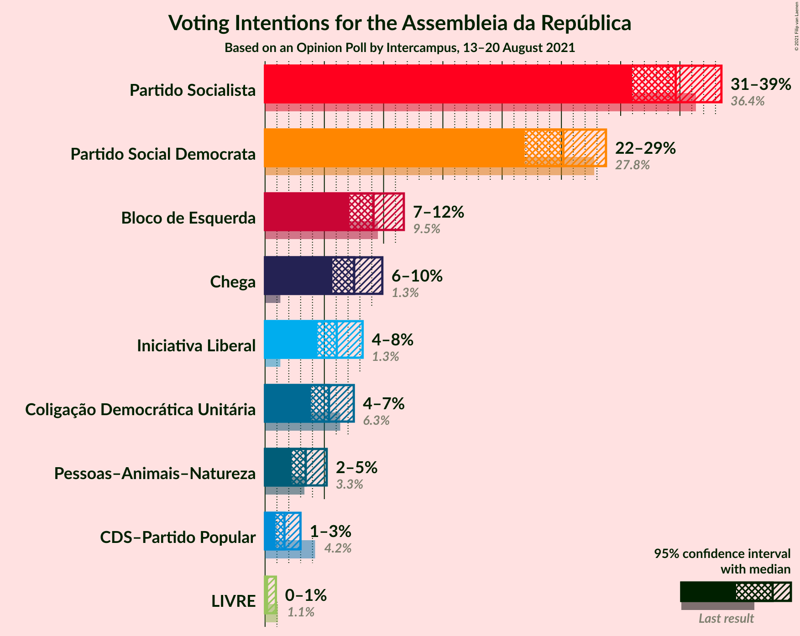

### Confidence Intervals

| Party | Last Result | Poll Result | 80% Confidence Interval | 90% Confidence Interval | 95% Confidence Interval | 99% Confidence Interval |
|:-----:|:-----------:|:-----------:|:-----------------------:|:-----------------------:|:-----------------------:|:-----------------------:|
| Partido Socialista | 36.4% | 34.6% | 32.2–37.2% |31.6–37.9% |31.0–38.5% |29.8–39.7% |
| Partido Social Democrata | 27.8% | 25.2% | 23.0–27.5% |22.4–28.2% |21.9–28.8% |20.9–29.9% |
| Bloco de Esquerda | 9.5% | 9.2% | 7.8–10.8% |7.4–11.3% |7.1–11.7% |6.5–12.5% |
| Chega | 1.3% | 7.5% | 6.3–9.1% |6.0–9.5% |5.7–9.9% |5.2–10.7% |
| Iniciativa Liberal | 1.3% | 6.0% | 5.0–7.5% |4.7–7.9% |4.4–8.2% |3.9–9.0% |
| Coligação Democrática Unitária | 6.3% | 5.4% | 4.4–6.8% |4.1–7.1% |3.9–7.5% |3.4–8.2% |
| Pessoas–Animais–Natureza | 3.3% | 3.4% | 2.7–4.6% |2.4–4.9% |2.3–5.2% |1.9–5.8% |
| CDS–Partido Popular | 4.2% | 1.6% | 1.1–2.5% |1.0–2.8% |0.9–3.0% |0.7–3.5% |
| LIVRE | 1.1% | 0.2% | 0.1–0.6% |0.0–0.8% |0.0–0.9% |0.0–1.2% |

*Note:* The poll result column reflects the actual value used in the calculations. Published results may vary slightly, and in addition be rounded to fewer digits.

## Seats

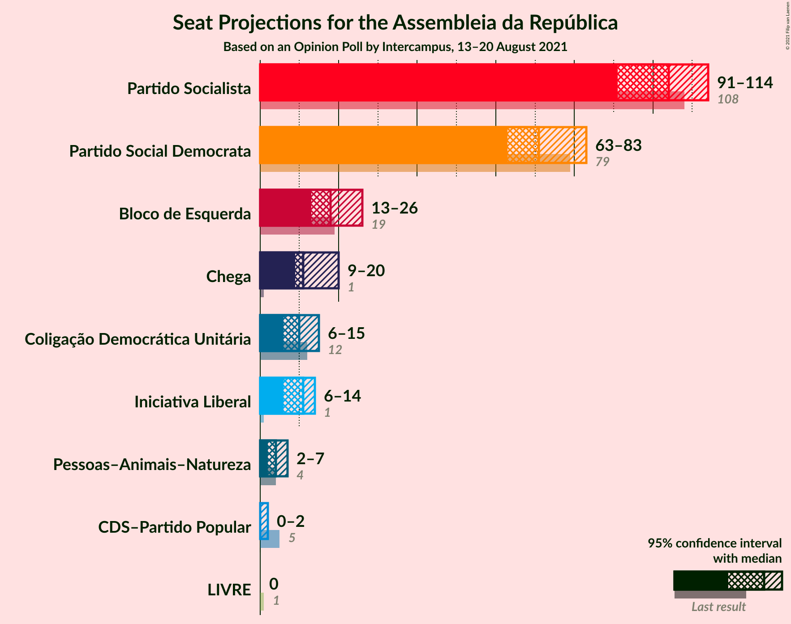

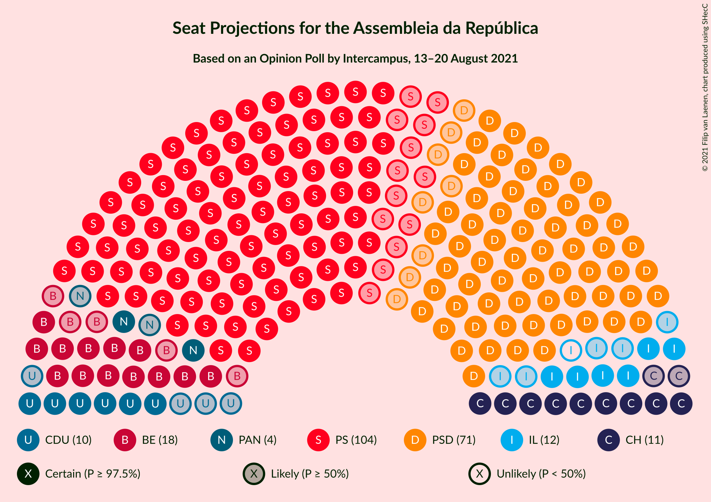

### Confidence Intervals

| Party | Last Result | Median | 80% Confidence Interval | 90% Confidence Interval | 95% Confidence Interval | 99% Confidence Interval |
|:-----:|:-----------:|:------:|:-----------------------:|:-----------------------:|:-----------------------:|:-----------------------:|
| <a href="#partido-socialista">Partido Socialista</a> | 108 | 104 | 96–109 |94–111 |91–114 |85–118 |
| <a href="#partido-social-democrata">Partido Social Democrata</a> | 79 | 71 | 65–81 |64–83 |63–83 |57–87 |
| <a href="#bloco-de-esquerda">Bloco de Esquerda</a> | 19 | 18 | 15–22 |14–23 |13–26 |11–28 |
| <a href="#chega">Chega</a> | 1 | 11 | 11–17 |10–18 |9–20 |8–23 |
| <a href="#iniciativa-liberal">Iniciativa Liberal</a> | 1 | 11 | 7–14 |6–14 |6–14 |5–16 |
| <a href="#coligação-democrática-unitária">Coligação Democrática Unitária</a> | 12 | 10 | 6–13 |6–14 |6–15 |5–17 |
| <a href="#pessoas–animais–natureza">Pessoas–Animais–Natureza</a> | 4 | 4 | 2–5 |2–6 |2–7 |2–9 |
| <a href="#cds–partido-popular">CDS–Partido Popular</a> | 5 | 0 | 0–1 |0–2 |0–2 |0–3 |
| <a href="#livre">LIVRE</a> | 1 | 0 | 0 |0 |0 |0–1 |

### Partido Socialista

*For a full overview of the results for this party, see the [Partido Socialista](party-partidosocialista.html) page.*

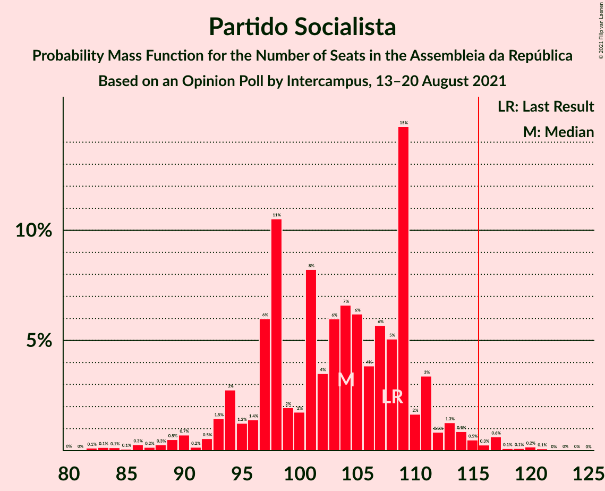

| Number of Seats | Probability | Accumulated | Special Marks |
|:---------------:|:-----------:|:-----------:|:-------------:|
| 80 | 0% | 100% |  |
| 81 | 0% | 99.9% |  |
| 82 | 0.1% | 99.9% |  |
| 83 | 0.1% | 99.8% |  |
| 84 | 0.1% | 99.7% |  |
| 85 | 0.1% | 99.5% |  |
| 86 | 0.3% | 99.4% |  |
| 87 | 0.2% | 99.2% |  |
| 88 | 0.3% | 99.0% |  |
| 89 | 0.5% | 98.8% |  |
| 90 | 0.7% | 98% |  |
| 91 | 0.2% | 98% |  |
| 92 | 0.5% | 97% |  |
| 93 | 1.5% | 97% |  |
| 94 | 3% | 95% |  |
| 95 | 1.2% | 93% |  |
| 96 | 1.4% | 91% |  |
| 97 | 6% | 90% |  |
| 98 | 11% | 84% |  |
| 99 | 2% | 73% |  |
| 100 | 2% | 72% |  |
| 101 | 8% | 70% |  |
| 102 | 4% | 62% |  |
| 103 | 6% | 58% |  |
| 104 | 7% | 52% | Median |
| 105 | 6% | 45% |  |
| 106 | 4% | 39% |  |
| 107 | 6% | 35% |  |
| 108 | 5% | 30% | Last Result |
| 109 | 15% | 25% |  |
| 110 | 2% | 10% |  |
| 111 | 3% | 8% |  |
| 112 | 0.8% | 5% |  |
| 113 | 1.3% | 4% |  |
| 114 | 0.9% | 3% |  |
| 115 | 0.5% | 2% |  |
| 116 | 0.3% | 1.4% | Majority |
| 117 | 0.6% | 1.1% |  |
| 118 | 0.1% | 0.5% |  |
| 119 | 0.1% | 0.4% |  |
| 120 | 0.2% | 0.3% |  |
| 121 | 0.1% | 0.1% |  |
| 122 | 0% | 0.1% |  |
| 123 | 0% | 0% |  |

### Partido Social Democrata

*For a full overview of the results for this party, see the [Partido Social Democrata](party-partidosocialdemocrata.html) page.*

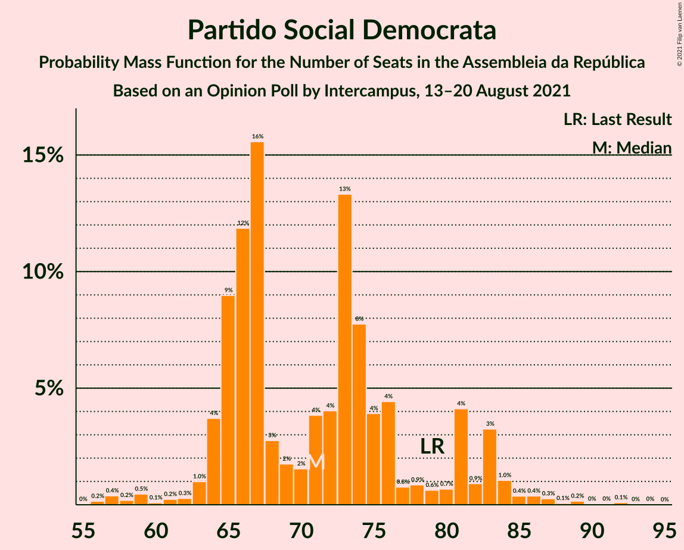

| Number of Seats | Probability | Accumulated | Special Marks |
|:---------------:|:-----------:|:-----------:|:-------------:|
| 55 | 0% | 100% |  |
| 56 | 0.2% | 99.9% |  |
| 57 | 0.4% | 99.8% |  |
| 58 | 0.2% | 99.4% |  |
| 59 | 0.5% | 99.2% |  |
| 60 | 0.1% | 98.8% |  |
| 61 | 0.2% | 98.7% |  |
| 62 | 0.3% | 98% |  |
| 63 | 1.0% | 98% |  |
| 64 | 4% | 97% |  |
| 65 | 9% | 93% |  |
| 66 | 12% | 84% |  |
| 67 | 16% | 73% |  |
| 68 | 3% | 57% |  |
| 69 | 2% | 54% |  |
| 70 | 2% | 53% |  |
| 71 | 4% | 51% | Median |
| 72 | 4% | 47% |  |
| 73 | 13% | 43% |  |
| 74 | 8% | 30% |  |
| 75 | 4% | 22% |  |
| 76 | 4% | 18% |  |
| 77 | 0.8% | 14% |  |
| 78 | 0.9% | 13% |  |
| 79 | 0.6% | 12% | Last Result |
| 80 | 0.7% | 11% |  |
| 81 | 4% | 11% |  |
| 82 | 0.9% | 7% |  |
| 83 | 3% | 6% |  |
| 84 | 1.0% | 2% |  |
| 85 | 0.4% | 1.5% |  |
| 86 | 0.4% | 1.1% |  |
| 87 | 0.3% | 0.7% |  |
| 88 | 0.1% | 0.4% |  |
| 89 | 0.2% | 0.4% |  |
| 90 | 0% | 0.2% |  |
| 91 | 0% | 0.2% |  |
| 92 | 0.1% | 0.1% |  |
| 93 | 0% | 0% |  |

### Bloco de Esquerda

*For a full overview of the results for this party, see the [Bloco de Esquerda](party-blocodeesquerda.html) page.*

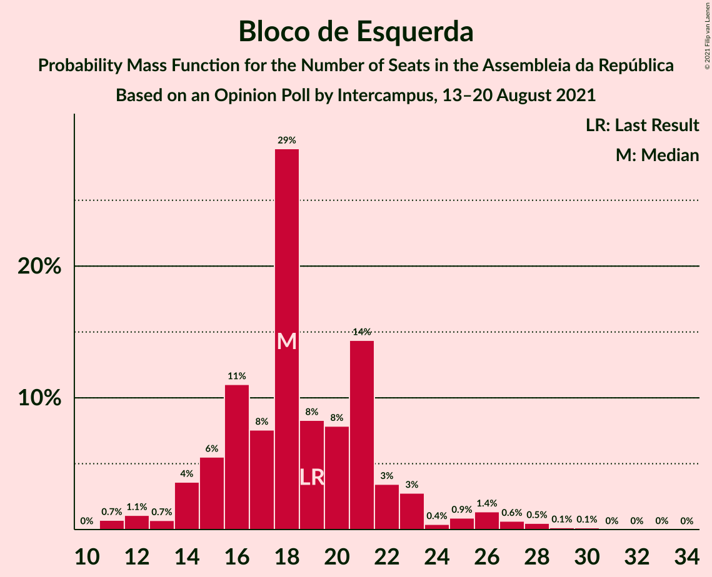

| Number of Seats | Probability | Accumulated | Special Marks |
|:---------------:|:-----------:|:-----------:|:-------------:|
| 11 | 0.7% | 100% |  |
| 12 | 1.1% | 99.2% |  |
| 13 | 0.7% | 98% |  |
| 14 | 4% | 97% |  |
| 15 | 6% | 94% |  |
| 16 | 11% | 88% |  |
| 17 | 8% | 77% |  |
| 18 | 29% | 70% | Median |
| 19 | 8% | 41% | Last Result |
| 20 | 8% | 33% |  |
| 21 | 14% | 25% |  |
| 22 | 3% | 10% |  |
| 23 | 3% | 7% |  |
| 24 | 0.4% | 4% |  |
| 25 | 0.9% | 4% |  |
| 26 | 1.4% | 3% |  |
| 27 | 0.6% | 1.5% |  |
| 28 | 0.5% | 0.8% |  |
| 29 | 0.1% | 0.4% |  |
| 30 | 0.1% | 0.2% |  |
| 31 | 0% | 0.1% |  |
| 32 | 0% | 0.1% |  |
| 33 | 0% | 0% |  |

### Chega

*For a full overview of the results for this party, see the [Chega](party-chega.html) page.*

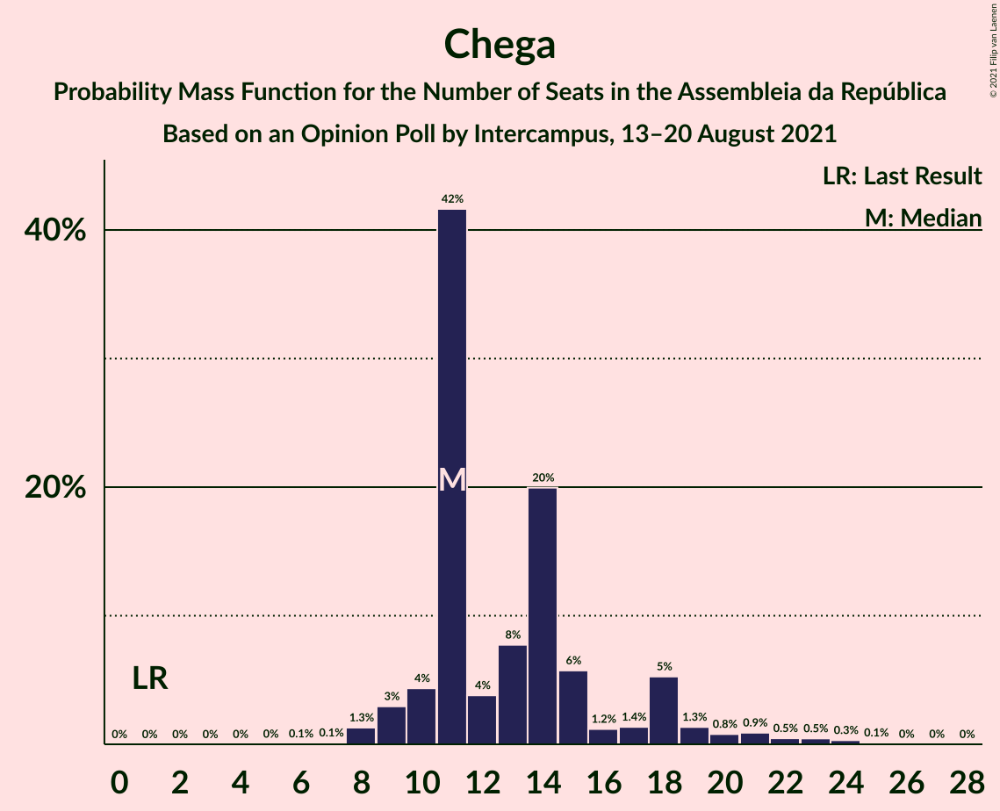

| Number of Seats | Probability | Accumulated | Special Marks |
|:---------------:|:-----------:|:-----------:|:-------------:|
| 1 | 0% | 100% | Last Result |
| 2 | 0% | 100% |  |
| 3 | 0% | 100% |  |
| 4 | 0% | 100% |  |
| 5 | 0% | 100% |  |
| 6 | 0.1% | 100% |  |
| 7 | 0.1% | 99.9% |  |
| 8 | 1.3% | 99.8% |  |
| 9 | 3% | 98% |  |
| 10 | 4% | 96% |  |
| 11 | 42% | 91% | Median |
| 12 | 4% | 50% |  |
| 13 | 8% | 46% |  |
| 14 | 20% | 38% |  |
| 15 | 6% | 18% |  |
| 16 | 1.2% | 12% |  |
| 17 | 1.4% | 11% |  |
| 18 | 5% | 10% |  |
| 19 | 1.3% | 4% |  |
| 20 | 0.8% | 3% |  |
| 21 | 0.9% | 2% |  |
| 22 | 0.5% | 1.4% |  |
| 23 | 0.5% | 1.0% |  |
| 24 | 0.3% | 0.5% |  |
| 25 | 0.1% | 0.2% |  |
| 26 | 0% | 0.1% |  |
| 27 | 0% | 0% |  |

### Iniciativa Liberal

*For a full overview of the results for this party, see the [Iniciativa Liberal](party-iniciativaliberal.html) page.*

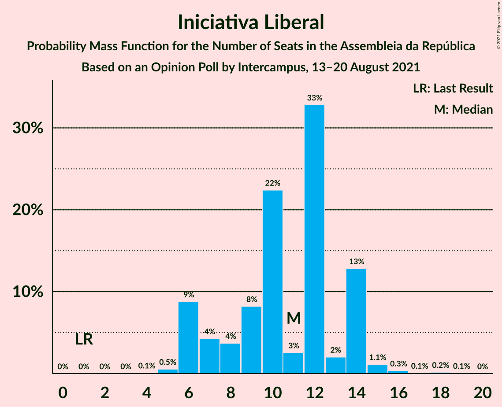

| Number of Seats | Probability | Accumulated | Special Marks |
|:---------------:|:-----------:|:-----------:|:-------------:|
| 1 | 0% | 100% | Last Result |
| 2 | 0% | 100% |  |
| 3 | 0% | 100% |  |
| 4 | 0.1% | 100% |  |
| 5 | 0.5% | 99.9% |  |
| 6 | 9% | 99.4% |  |
| 7 | 4% | 91% |  |
| 8 | 4% | 86% |  |
| 9 | 8% | 83% |  |
| 10 | 22% | 74% |  |
| 11 | 3% | 52% | Median |
| 12 | 33% | 49% |  |
| 13 | 2% | 17% |  |
| 14 | 13% | 15% |  |
| 15 | 1.1% | 2% |  |
| 16 | 0.3% | 0.6% |  |
| 17 | 0.1% | 0.3% |  |
| 18 | 0.2% | 0.2% |  |
| 19 | 0.1% | 0.1% |  |
| 20 | 0% | 0% |  |

### Coligação Democrática Unitária

*For a full overview of the results for this party, see the [Coligação Democrática Unitária](party-coligaçãodemocráticaunitária.html) page.*

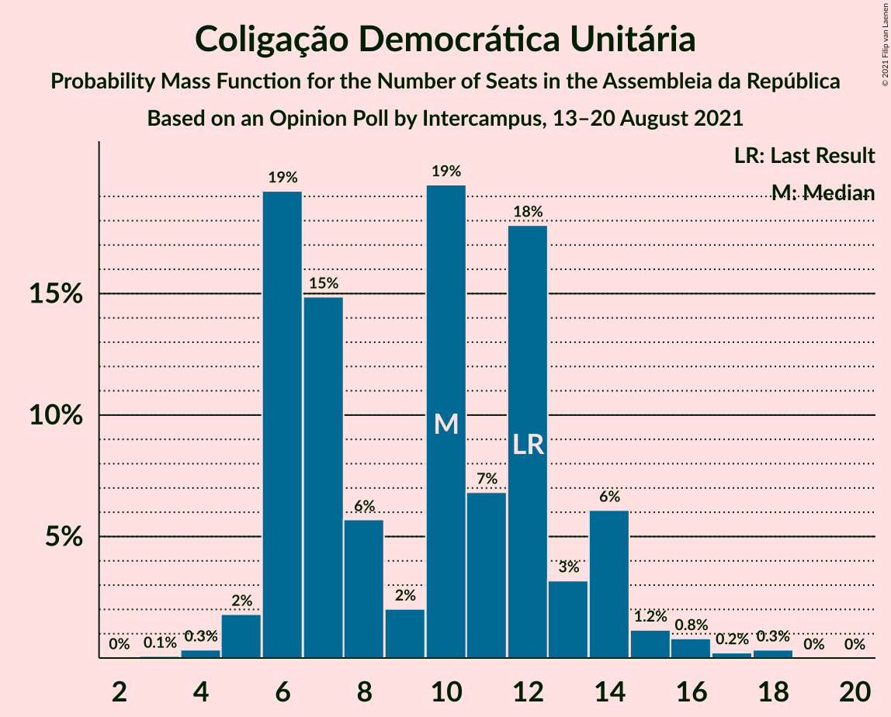

| Number of Seats | Probability | Accumulated | Special Marks |
|:---------------:|:-----------:|:-----------:|:-------------:|
| 3 | 0.1% | 100% |  |
| 4 | 0.3% | 99.9% |  |
| 5 | 2% | 99.6% |  |
| 6 | 19% | 98% |  |
| 7 | 15% | 79% |  |
| 8 | 6% | 64% |  |
| 9 | 2% | 58% |  |
| 10 | 19% | 56% | Median |
| 11 | 7% | 36% |  |
| 12 | 18% | 30% | Last Result |
| 13 | 3% | 12% |  |
| 14 | 6% | 9% |  |
| 15 | 1.2% | 3% |  |
| 16 | 0.8% | 1.4% |  |
| 17 | 0.2% | 0.6% |  |
| 18 | 0.3% | 0.4% |  |
| 19 | 0% | 0% |  |

### Pessoas–Animais–Natureza

*For a full overview of the results for this party, see the [Pessoas–Animais–Natureza](party-pessoas–animais–natureza.html) page.*

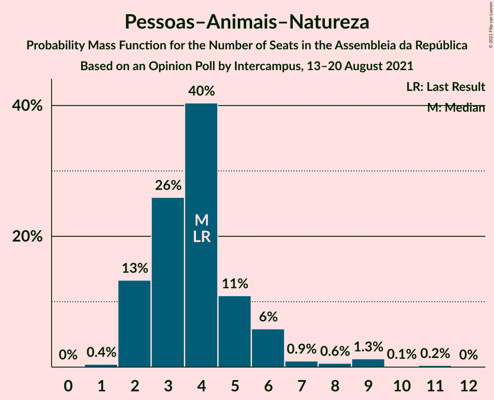

| Number of Seats | Probability | Accumulated | Special Marks |
|:---------------:|:-----------:|:-----------:|:-------------:|
| 1 | 0.4% | 100% |  |
| 2 | 13% | 99.5% |  |
| 3 | 26% | 86% |  |
| 4 | 40% | 60% | Last Result, Median |
| 5 | 11% | 20% |  |
| 6 | 6% | 9% |  |
| 7 | 0.9% | 3% |  |
| 8 | 0.6% | 2% |  |
| 9 | 1.3% | 2% |  |
| 10 | 0.1% | 0.4% |  |
| 11 | 0.2% | 0.3% |  |
| 12 | 0% | 0% |  |

### CDS–Partido Popular

*For a full overview of the results for this party, see the [CDS–Partido Popular](party-cds–partidopopular.html) page.*

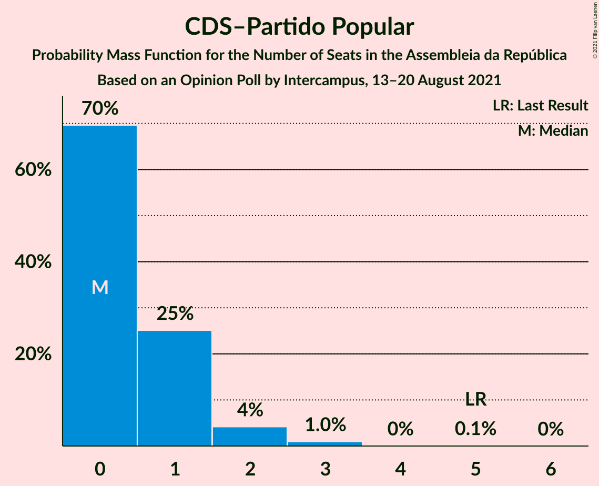

| Number of Seats | Probability | Accumulated | Special Marks |
|:---------------:|:-----------:|:-----------:|:-------------:|
| 0 | 70% | 100% | Median |
| 1 | 25% | 30% |  |
| 2 | 4% | 5% |  |
| 3 | 1.0% | 1.1% |  |
| 4 | 0% | 0.1% |  |
| 5 | 0.1% | 0.1% | Last Result |
| 6 | 0% | 0% |  |

### LIVRE

*For a full overview of the results for this party, see the [LIVRE](party-livre.html) page.*

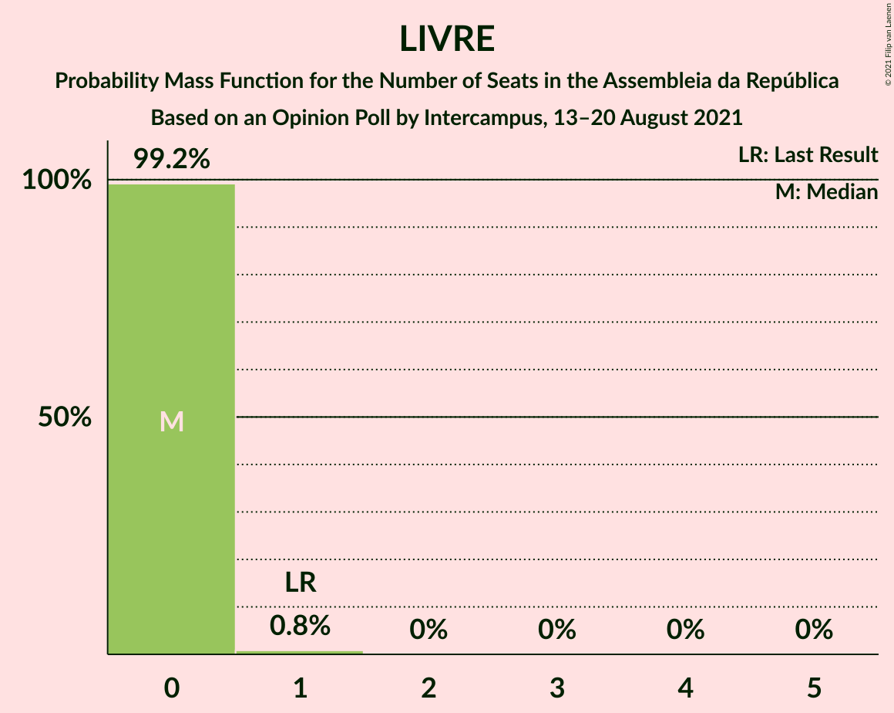

| Number of Seats | Probability | Accumulated | Special Marks |
|:---------------:|:-----------:|:-----------:|:-------------:|
| 0 | 99.2% | 100% | Median |
| 1 | 0.8% | 0.8% | Last Result |
| 2 | 0% | 0% |  |

## Coalitions

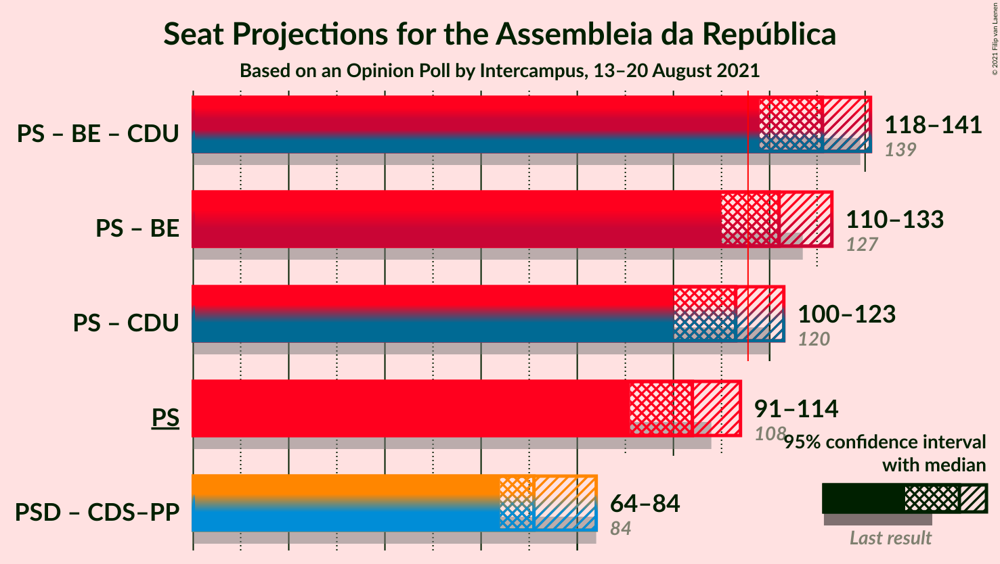

### Confidence Intervals

| Coalition | Last Result | Median | Majority? | 80% Confidence Interval | 90% Confidence Interval | 95% Confidence Interval | 99% Confidence Interval |
|:---------:|:-----------:|:------:|:---------:|:-----------------------:|:-----------------------:|:-----------------------:|:-----------------------:|
| Partido Socialista – Bloco de Esquerda – Coligação Democrática Unitária | 139 | 131 | 99.1% | 123–139 | 120–140 | 118–141 | 113–145 |
| Partido Socialista – Bloco de Esquerda | 127 | 122 | 85% | 113–129 | 112–131 | 110–133 | 104–137 |
| Partido Socialista – Coligação Democrática Unitária | 120 | 113 | 35% | 104–121 | 102–122 | 100–123 | 94–127 |
| Partido Socialista | 108 | 104 | 1.4% | 96–109 | 94–111 | 91–114 | 85–118 |
| Partido Social Democrata – CDS–Partido Popular | 84 | 71 | 0% | 65–82 | 65–83 | 64–84 | 58–87 |

### Partido Socialista – Bloco de Esquerda – Coligação Democrática Unitária

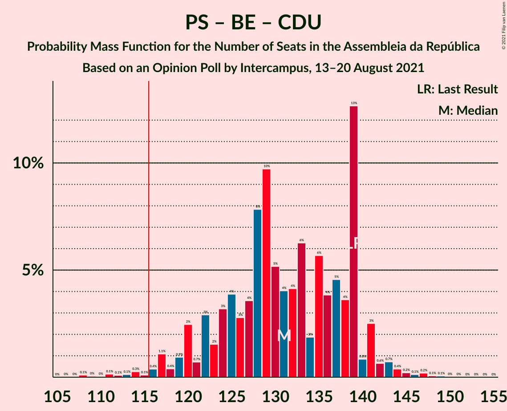

| Number of Seats | Probability | Accumulated | Special Marks |
|:---------------:|:-----------:|:-----------:|:-------------:|
| 108 | 0.1% | 100% |  |
| 109 | 0% | 99.9% |  |
| 110 | 0% | 99.8% |  |
| 111 | 0.1% | 99.8% |  |
| 112 | 0.1% | 99.6% |  |
| 113 | 0.1% | 99.5% |  |
| 114 | 0.3% | 99.4% |  |
| 115 | 0.1% | 99.2% |  |
| 116 | 0.4% | 99.1% | Majority |
| 117 | 1.1% | 98.7% |  |
| 118 | 0.4% | 98% |  |
| 119 | 0.9% | 97% |  |
| 120 | 2% | 96% |  |
| 121 | 0.7% | 94% |  |
| 122 | 3% | 93% |  |
| 123 | 2% | 90% |  |
| 124 | 3% | 89% |  |
| 125 | 4% | 85% |  |
| 126 | 3% | 82% |  |
| 127 | 4% | 79% |  |
| 128 | 8% | 75% |  |
| 129 | 10% | 67% |  |
| 130 | 5% | 58% |  |
| 131 | 4% | 52% |  |
| 132 | 4% | 48% | Median |
| 133 | 6% | 44% |  |
| 134 | 2% | 38% |  |
| 135 | 6% | 36% |  |
| 136 | 4% | 30% |  |
| 137 | 5% | 27% |  |
| 138 | 4% | 22% |  |
| 139 | 13% | 18% | Last Result |
| 140 | 0.8% | 6% |  |
| 141 | 3% | 5% |  |
| 142 | 0.6% | 2% |  |
| 143 | 0.7% | 2% |  |
| 144 | 0.4% | 1.1% |  |
| 145 | 0.2% | 0.7% |  |
| 146 | 0.1% | 0.5% |  |
| 147 | 0.2% | 0.4% |  |
| 148 | 0.1% | 0.2% |  |
| 149 | 0.1% | 0.1% |  |
| 150 | 0% | 0.1% |  |
| 151 | 0% | 0% |  |

### Partido Socialista – Bloco de Esquerda

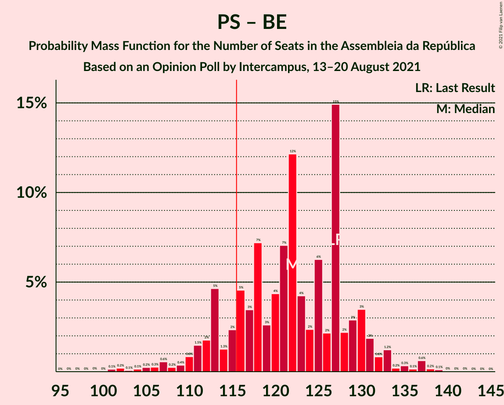

| Number of Seats | Probability | Accumulated | Special Marks |
|:---------------:|:-----------:|:-----------:|:-------------:|
| 99 | 0% | 100% |  |
| 100 | 0% | 99.9% |  |
| 101 | 0.1% | 99.9% |  |
| 102 | 0.2% | 99.8% |  |
| 103 | 0.1% | 99.6% |  |
| 104 | 0.1% | 99.5% |  |
| 105 | 0.2% | 99.4% |  |
| 106 | 0.3% | 99.1% |  |
| 107 | 0.6% | 98.9% |  |
| 108 | 0.2% | 98% |  |
| 109 | 0.4% | 98% |  |
| 110 | 0.8% | 98% |  |
| 111 | 1.5% | 97% |  |
| 112 | 2% | 95% |  |
| 113 | 5% | 94% |  |
| 114 | 1.3% | 89% |  |
| 115 | 2% | 88% |  |
| 116 | 5% | 85% | Majority |
| 117 | 3% | 81% |  |
| 118 | 7% | 77% |  |
| 119 | 3% | 70% |  |
| 120 | 4% | 68% |  |
| 121 | 7% | 63% |  |
| 122 | 12% | 56% | Median |
| 123 | 4% | 44% |  |
| 124 | 2% | 40% |  |
| 125 | 6% | 37% |  |
| 126 | 2% | 31% |  |
| 127 | 15% | 29% | Last Result |
| 128 | 2% | 14% |  |
| 129 | 3% | 12% |  |
| 130 | 3% | 9% |  |
| 131 | 2% | 6% |  |
| 132 | 0.8% | 4% |  |
| 133 | 1.2% | 3% |  |
| 134 | 0.2% | 2% |  |
| 135 | 0.3% | 1.4% |  |
| 136 | 0.1% | 1.1% |  |
| 137 | 0.6% | 1.0% |  |
| 138 | 0.2% | 0.3% |  |
| 139 | 0.1% | 0.2% |  |
| 140 | 0% | 0.1% |  |
| 141 | 0% | 0.1% |  |
| 142 | 0% | 0% |  |

### Partido Socialista – Coligação Democrática Unitária

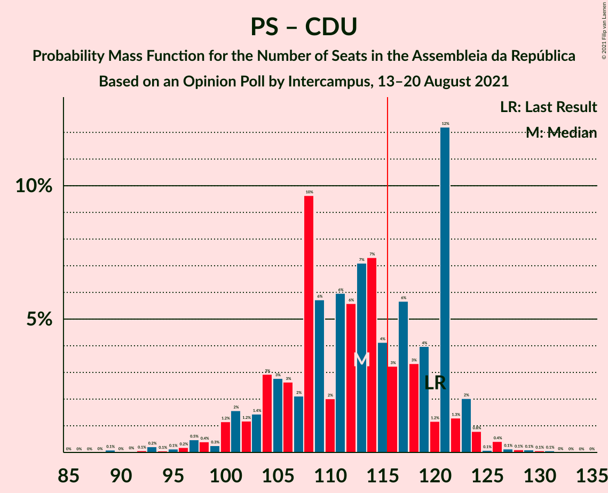

| Number of Seats | Probability | Accumulated | Special Marks |
|:---------------:|:-----------:|:-----------:|:-------------:|
| 89 | 0.1% | 100% |  |
| 90 | 0% | 99.9% |  |
| 91 | 0% | 99.9% |  |
| 92 | 0.1% | 99.8% |  |
| 93 | 0.2% | 99.8% |  |
| 94 | 0.1% | 99.5% |  |
| 95 | 0.1% | 99.5% |  |
| 96 | 0.2% | 99.4% |  |
| 97 | 0.5% | 99.2% |  |
| 98 | 0.4% | 98.7% |  |
| 99 | 0.3% | 98% |  |
| 100 | 1.2% | 98% |  |
| 101 | 2% | 97% |  |
| 102 | 1.2% | 95% |  |
| 103 | 1.4% | 94% |  |
| 104 | 3% | 93% |  |
| 105 | 3% | 90% |  |
| 106 | 3% | 87% |  |
| 107 | 2% | 84% |  |
| 108 | 10% | 82% |  |
| 109 | 6% | 73% |  |
| 110 | 2% | 67% |  |
| 111 | 6% | 65% |  |
| 112 | 6% | 59% |  |
| 113 | 7% | 53% |  |
| 114 | 7% | 46% | Median |
| 115 | 4% | 39% |  |
| 116 | 3% | 35% | Majority |
| 117 | 6% | 31% |  |
| 118 | 3% | 26% |  |
| 119 | 4% | 22% |  |
| 120 | 1.2% | 18% | Last Result |
| 121 | 12% | 17% |  |
| 122 | 1.3% | 5% |  |
| 123 | 2% | 4% |  |
| 124 | 0.8% | 2% |  |
| 125 | 0.1% | 1.0% |  |
| 126 | 0.4% | 0.9% |  |
| 127 | 0.1% | 0.5% |  |
| 128 | 0.1% | 0.4% |  |
| 129 | 0.1% | 0.3% |  |
| 130 | 0.1% | 0.2% |  |
| 131 | 0.1% | 0.1% |  |
| 132 | 0% | 0% |  |

### Partido Socialista

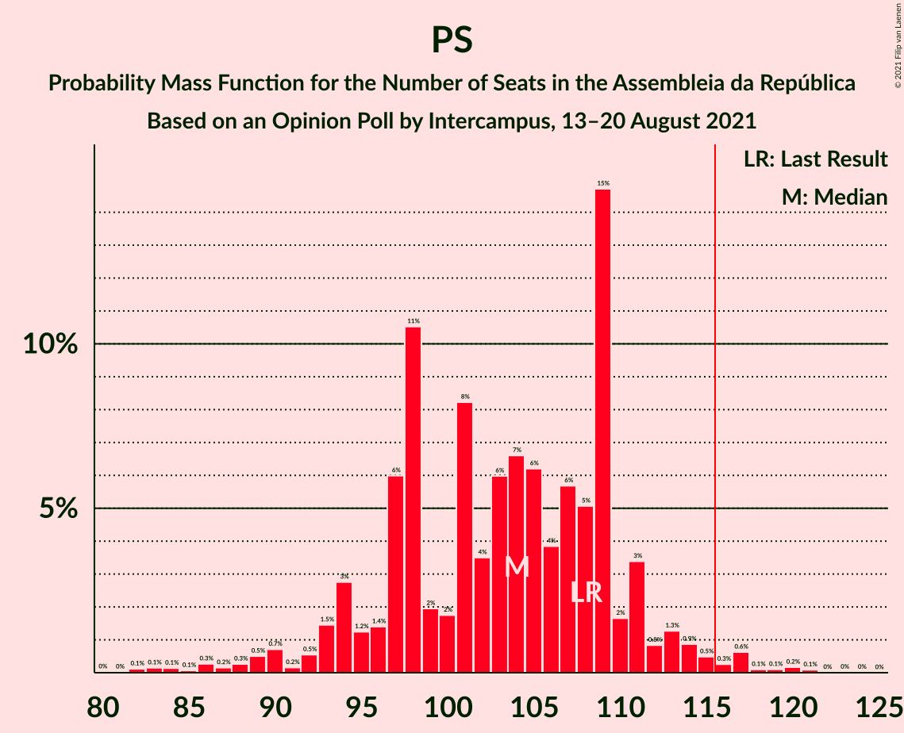

| Number of Seats | Probability | Accumulated | Special Marks |
|:---------------:|:-----------:|:-----------:|:-------------:|
| 80 | 0% | 100% |  |
| 81 | 0% | 99.9% |  |
| 82 | 0.1% | 99.9% |  |
| 83 | 0.1% | 99.8% |  |
| 84 | 0.1% | 99.7% |  |
| 85 | 0.1% | 99.5% |  |
| 86 | 0.3% | 99.4% |  |
| 87 | 0.2% | 99.2% |  |
| 88 | 0.3% | 99.0% |  |
| 89 | 0.5% | 98.8% |  |
| 90 | 0.7% | 98% |  |
| 91 | 0.2% | 98% |  |
| 92 | 0.5% | 97% |  |
| 93 | 1.5% | 97% |  |
| 94 | 3% | 95% |  |
| 95 | 1.2% | 93% |  |
| 96 | 1.4% | 91% |  |
| 97 | 6% | 90% |  |
| 98 | 11% | 84% |  |
| 99 | 2% | 73% |  |
| 100 | 2% | 72% |  |
| 101 | 8% | 70% |  |
| 102 | 4% | 62% |  |
| 103 | 6% | 58% |  |
| 104 | 7% | 52% | Median |
| 105 | 6% | 45% |  |
| 106 | 4% | 39% |  |
| 107 | 6% | 35% |  |
| 108 | 5% | 30% | Last Result |
| 109 | 15% | 25% |  |
| 110 | 2% | 10% |  |
| 111 | 3% | 8% |  |
| 112 | 0.8% | 5% |  |
| 113 | 1.3% | 4% |  |
| 114 | 0.9% | 3% |  |
| 115 | 0.5% | 2% |  |
| 116 | 0.3% | 1.4% | Majority |
| 117 | 0.6% | 1.1% |  |
| 118 | 0.1% | 0.5% |  |
| 119 | 0.1% | 0.4% |  |
| 120 | 0.2% | 0.3% |  |
| 121 | 0.1% | 0.1% |  |
| 122 | 0% | 0.1% |  |
| 123 | 0% | 0% |  |

### Partido Social Democrata – CDS–Partido Popular

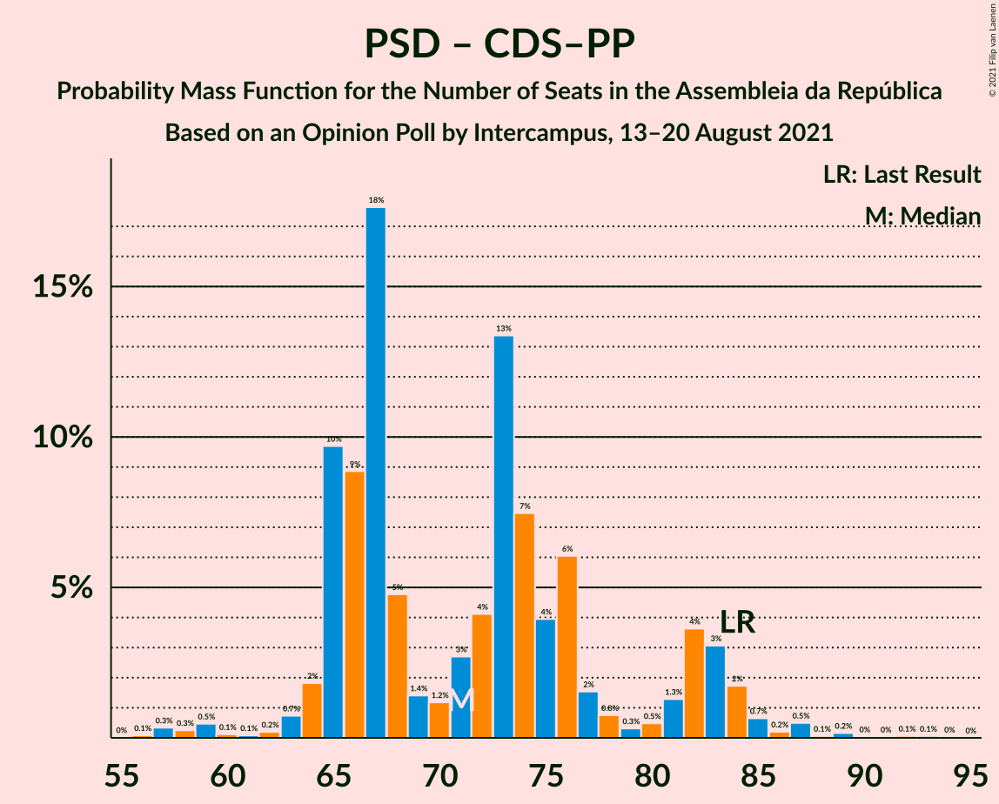

| Number of Seats | Probability | Accumulated | Special Marks |
|:---------------:|:-----------:|:-----------:|:-------------:|
| 56 | 0.1% | 100% |  |
| 57 | 0.3% | 99.9% |  |
| 58 | 0.3% | 99.5% |  |
| 59 | 0.5% | 99.3% |  |
| 60 | 0.1% | 98.8% |  |
| 61 | 0.1% | 98.7% |  |
| 62 | 0.2% | 98.6% |  |
| 63 | 0.7% | 98% |  |
| 64 | 2% | 98% |  |
| 65 | 10% | 96% |  |
| 66 | 9% | 86% |  |
| 67 | 18% | 77% |  |
| 68 | 5% | 60% |  |
| 69 | 1.4% | 55% |  |
| 70 | 1.2% | 53% |  |
| 71 | 3% | 52% | Median |
| 72 | 4% | 50% |  |
| 73 | 13% | 45% |  |
| 74 | 7% | 32% |  |
| 75 | 4% | 25% |  |
| 76 | 6% | 21% |  |
| 77 | 2% | 15% |  |
| 78 | 0.8% | 13% |  |
| 79 | 0.3% | 12% |  |
| 80 | 0.5% | 12% |  |
| 81 | 1.3% | 12% |  |
| 82 | 4% | 10% |  |
| 83 | 3% | 7% |  |
| 84 | 2% | 4% | Last Result |
| 85 | 0.7% | 2% |  |
| 86 | 0.2% | 1.2% |  |
| 87 | 0.5% | 1.0% |  |
| 88 | 0.1% | 0.5% |  |
| 89 | 0.2% | 0.4% |  |
| 90 | 0% | 0.2% |  |
| 91 | 0% | 0.2% |  |
| 92 | 0.1% | 0.2% |  |
| 93 | 0.1% | 0.1% |  |
| 94 | 0% | 0% |  |

## Technical Information

### Opinion Poll

+ **Polling firm:** Intercampus
+ **Commissioner(s):** —
+ **Fieldwork period:** 13–20 August 2021

### Calculations

+ **Sample size:** 612
+ **Simulations done:** 1,048,576
+ **Error estimate:** 3.28%

