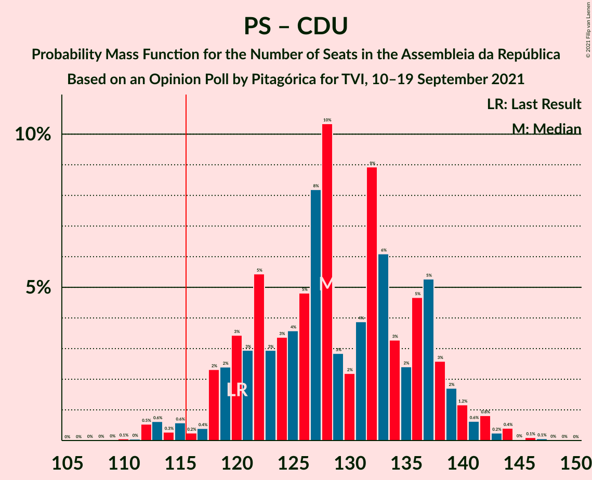
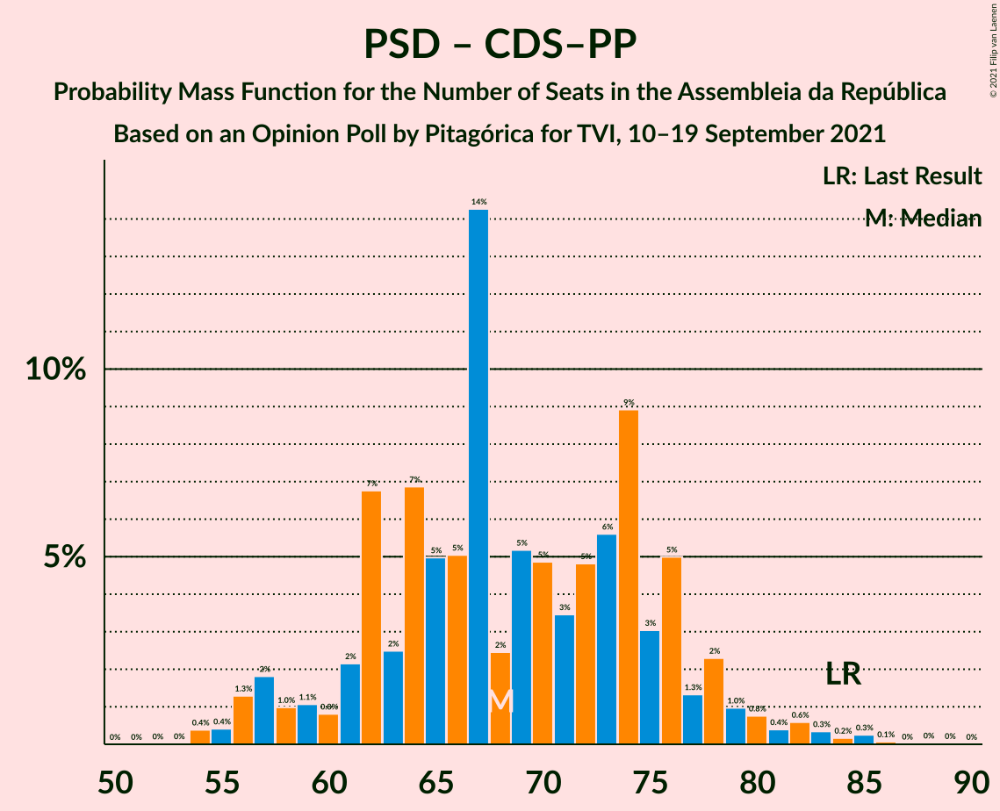

# Opinion Poll by Pitagórica for TVI, 10–19 September 2021

<a href="#voting-intentions">Voting Intentions</a> | <a href="#seats">Seats</a> | <a href="#coalitions">Coalitions</a> | <a href="#technical-information">Technical Information</a>

## Voting Intentions

### Confidence Intervals

| Party | Last Result | Poll Result | 80% Confidence Interval | 90% Confidence Interval | 95% Confidence Interval | 99% Confidence Interval |
|:-----:|:-----------:|:-----------:|:-----------------------:|:-----------------------:|:-----------------------:|:-----------------------:|
| Partido Socialista | 36.4% | 41.4% | 38.9–44.0% |38.1–44.7% |37.5–45.3% |36.3–46.6% |
| Partido Social Democrata | 27.8% | 25.1% | 23.0–27.5% |22.4–28.2% |21.8–28.7% |20.8–29.9% |
| Bloco de Esquerda | 9.5% | 7.1% | 5.9–8.6% |5.6–9.0% |5.3–9.4% |4.8–10.2% |
| Chega | 1.3% | 7.1% | 5.9–8.6% |5.6–9.0% |5.3–9.4% |4.8–10.2% |
| Coligação Democrática Unitária | 6.3% | 5.4% | 4.4–6.8% |4.1–7.2% |3.9–7.5% |3.4–8.2% |
| Iniciativa Liberal | 1.3% | 4.8% | 3.8–6.1% |3.6–6.4% |3.3–6.8% |2.9–7.4% |
| CDS–Partido Popular | 4.2% | 2.0% | 1.4–2.9% |1.3–3.2% |1.1–3.4% |0.9–3.9% |
| Pessoas–Animais–Natureza | 3.3% | 1.8% | 1.3–2.7% |1.1–3.0% |1.0–3.2% |0.8–3.7% |
| LIVRE | 1.1% | 0.3% | 0.2–0.9% |0.1–1.0% |0.1–1.2% |0.0–1.5% |

*Note:* The poll result column reflects the actual value used in the calculations. Published results may vary slightly, and in addition be rounded to fewer digits.

## Seats

### Confidence Intervals

| Party | Last Result | Median | 80% Confidence Interval | 90% Confidence Interval | 95% Confidence Interval | 99% Confidence Interval |
|:-----:|:-----------:|:------:|:-----------------------:|:-----------------------:|:-----------------------:|:-----------------------:|
| <a href="#partido-socialista">Partido Socialista</a> | 108 | 120 | 111–128 |109–129 |107–132 |105–136 |
| <a href="#partido-social-democrata">Partido Social Democrata</a> | 79 | 67 | 61–75 |58–77 |56–79 |54–83 |
| <a href="#bloco-de-esquerda">Bloco de Esquerda</a> | 19 | 12 | 9–17 |7–18 |7–18 |7–21 |
| <a href="#chega">Chega</a> | 1 | 11 | 8–14 |8–16 |8–18 |6–20 |
| <a href="#coligação-democrática-unitária">Coligação Democrática Unitária</a> | 12 | 8 | 5–13 |5–14 |5–15 |4–16 |
| <a href="#iniciativa-liberal">Iniciativa Liberal</a> | 1 | 6 | 5–10 |5–11 |4–12 |3–14 |
| <a href="#cds–partido-popular">CDS–Partido Popular</a> | 5 | 1 | 0–2 |0–2 |0–3 |0–4 |
| <a href="#pessoas–animais–natureza">Pessoas–Animais–Natureza</a> | 4 | 1 | 0–2 |0–3 |0–3 |0–4 |
| <a href="#livre">LIVRE</a> | 1 | 0 | 0 |0 |0–1 |0–1 |

### Partido Socialista

*For a full overview of the results for this party, see the [Partido Socialista](party-partidosocialista.html) page.*

| Number of Seats | Probability | Accumulated | Special Marks |
|:---------------:|:-----------:|:-----------:|:-------------:|
| 101 | 0% | 100% |  |
| 102 | 0.1% | 99.9% |  |
| 103 | 0.1% | 99.8% |  |
| 104 | 0.2% | 99.7% |  |
| 105 | 0.2% | 99.6% |  |
| 106 | 0.9% | 99.4% |  |
| 107 | 1.2% | 98% |  |
| 108 | 1.2% | 97% | Last Result |
| 109 | 2% | 96% |  |
| 110 | 3% | 94% |  |
| 111 | 3% | 91% |  |
| 112 | 1.5% | 88% |  |
| 113 | 3% | 87% |  |
| 114 | 4% | 84% |  |
| 115 | 7% | 79% |  |
| 116 | 3% | 73% | Majority |
| 117 | 5% | 69% |  |
| 118 | 6% | 64% |  |
| 119 | 6% | 58% |  |
| 120 | 5% | 52% | Median |
| 121 | 5% | 47% |  |
| 122 | 3% | 41% |  |
| 123 | 6% | 38% |  |
| 124 | 2% | 32% |  |
| 125 | 5% | 29% |  |
| 126 | 2% | 24% |  |
| 127 | 8% | 22% |  |
| 128 | 7% | 13% |  |
| 129 | 1.4% | 6% |  |
| 130 | 1.3% | 5% |  |
| 131 | 0.7% | 3% |  |
| 132 | 0.4% | 3% |  |
| 133 | 0.8% | 2% |  |
| 134 | 0.6% | 1.3% |  |
| 135 | 0.1% | 0.7% |  |
| 136 | 0.1% | 0.6% |  |
| 137 | 0.3% | 0.4% |  |
| 138 | 0% | 0.1% |  |
| 139 | 0.1% | 0.1% |  |
| 140 | 0% | 0.1% |  |
| 141 | 0% | 0% |  |

### Partido Social Democrata

*For a full overview of the results for this party, see the [Partido Social Democrata](party-partidosocialdemocrata.html) page.*

| Number of Seats | Probability | Accumulated | Special Marks |
|:---------------:|:-----------:|:-----------:|:-------------:|
| 53 | 0% | 100% |  |
| 54 | 0.6% | 99.9% |  |
| 55 | 1.5% | 99.4% |  |
| 56 | 0.8% | 98% |  |
| 57 | 2% | 97% |  |
| 58 | 0.7% | 95% |  |
| 59 | 1.4% | 94% |  |
| 60 | 1.3% | 93% |  |
| 61 | 6% | 92% |  |
| 62 | 4% | 86% |  |
| 63 | 8% | 82% |  |
| 64 | 4% | 74% |  |
| 65 | 4% | 70% |  |
| 66 | 10% | 66% |  |
| 67 | 8% | 57% | Median |
| 68 | 6% | 49% |  |
| 69 | 4% | 43% |  |
| 70 | 5% | 39% |  |
| 71 | 4% | 34% |  |
| 72 | 8% | 30% |  |
| 73 | 4% | 21% |  |
| 74 | 5% | 18% |  |
| 75 | 3% | 13% |  |
| 76 | 4% | 10% |  |
| 77 | 2% | 6% |  |
| 78 | 1.1% | 4% |  |
| 79 | 1.0% | 3% | Last Result |
| 80 | 0.4% | 2% |  |
| 81 | 0.6% | 1.5% |  |
| 82 | 0.2% | 0.9% |  |
| 83 | 0.3% | 0.7% |  |
| 84 | 0.2% | 0.4% |  |
| 85 | 0.1% | 0.2% |  |
| 86 | 0% | 0.1% |  |
| 87 | 0% | 0.1% |  |
| 88 | 0% | 0.1% |  |
| 89 | 0% | 0% |  |

### Bloco de Esquerda

*For a full overview of the results for this party, see the [Bloco de Esquerda](party-blocodeesquerda.html) page.*

| Number of Seats | Probability | Accumulated | Special Marks |
|:---------------:|:-----------:|:-----------:|:-------------:|
| 5 | 0% | 100% |  |
| 6 | 0% | 99.9% |  |
| 7 | 6% | 99.9% |  |
| 8 | 2% | 94% |  |
| 9 | 7% | 92% |  |
| 10 | 8% | 85% |  |
| 11 | 16% | 77% |  |
| 12 | 12% | 61% | Median |
| 13 | 9% | 50% |  |
| 14 | 14% | 41% |  |
| 15 | 9% | 27% |  |
| 16 | 7% | 17% |  |
| 17 | 2% | 11% |  |
| 18 | 6% | 8% |  |
| 19 | 1.0% | 2% | Last Result |
| 20 | 0.5% | 1.2% |  |
| 21 | 0.6% | 0.7% |  |
| 22 | 0.1% | 0.2% |  |
| 23 | 0% | 0.1% |  |
| 24 | 0% | 0% |  |

### Chega

*For a full overview of the results for this party, see the [Chega](party-chega.html) page.*

| Number of Seats | Probability | Accumulated | Special Marks |
|:---------------:|:-----------:|:-----------:|:-------------:|
| 1 | 0% | 100% | Last Result |
| 2 | 0% | 100% |  |
| 3 | 0% | 100% |  |
| 4 | 0.1% | 100% |  |
| 5 | 0.3% | 99.9% |  |
| 6 | 0.4% | 99.5% |  |
| 7 | 0.3% | 99.1% |  |
| 8 | 10% | 98.8% |  |
| 9 | 2% | 89% |  |
| 10 | 8% | 87% |  |
| 11 | 39% | 79% | Median |
| 12 | 6% | 40% |  |
| 13 | 8% | 34% |  |
| 14 | 16% | 25% |  |
| 15 | 2% | 9% |  |
| 16 | 2% | 7% |  |
| 17 | 2% | 5% |  |
| 18 | 0.6% | 3% |  |
| 19 | 1.1% | 2% |  |
| 20 | 0.8% | 1.2% |  |
| 21 | 0.1% | 0.4% |  |
| 22 | 0.2% | 0.3% |  |
| 23 | 0.1% | 0.2% |  |
| 24 | 0% | 0% |  |

### Coligação Democrática Unitária

*For a full overview of the results for this party, see the [Coligação Democrática Unitária](party-coligaçãodemocráticaunitária.html) page.*

| Number of Seats | Probability | Accumulated | Special Marks |
|:---------------:|:-----------:|:-----------:|:-------------:|
| 3 | 0.1% | 100% |  |
| 4 | 0.5% | 99.8% |  |
| 5 | 16% | 99.4% |  |
| 6 | 8% | 83% |  |
| 7 | 18% | 75% |  |
| 8 | 8% | 57% | Median |
| 9 | 9% | 49% |  |
| 10 | 15% | 40% |  |
| 11 | 3% | 25% |  |
| 12 | 7% | 22% | Last Result |
| 13 | 8% | 15% |  |
| 14 | 4% | 7% |  |
| 15 | 2% | 4% |  |
| 16 | 0.9% | 1.3% |  |
| 17 | 0.2% | 0.4% |  |
| 18 | 0.1% | 0.1% |  |
| 19 | 0% | 0% |  |

### Iniciativa Liberal

*For a full overview of the results for this party, see the [Iniciativa Liberal](party-iniciativaliberal.html) page.*

| Number of Seats | Probability | Accumulated | Special Marks |
|:---------------:|:-----------:|:-----------:|:-------------:|
| 1 | 0% | 100% | Last Result |
| 2 | 0% | 100% |  |
| 3 | 0.6% | 100% |  |
| 4 | 4% | 99.4% |  |
| 5 | 13% | 95% |  |
| 6 | 48% | 82% | Median |
| 7 | 10% | 34% |  |
| 8 | 4% | 24% |  |
| 9 | 3% | 20% |  |
| 10 | 9% | 16% |  |
| 11 | 3% | 8% |  |
| 12 | 4% | 5% |  |
| 13 | 0.3% | 0.8% |  |
| 14 | 0.5% | 0.5% |  |
| 15 | 0% | 0% |  |

### CDS–Partido Popular

*For a full overview of the results for this party, see the [CDS–Partido Popular](party-cds–partidopopular.html) page.*

| Number of Seats | Probability | Accumulated | Special Marks |
|:---------------:|:-----------:|:-----------:|:-------------:|
| 0 | 38% | 100% |  |
| 1 | 44% | 62% | Median |
| 2 | 15% | 18% |  |
| 3 | 2% | 3% |  |
| 4 | 0.4% | 0.8% |  |
| 5 | 0.3% | 0.3% | Last Result |
| 6 | 0% | 0% |  |

### Pessoas–Animais–Natureza

*For a full overview of the results for this party, see the [Pessoas–Animais–Natureza](party-pessoas–animais–natureza.html) page.*

| Number of Seats | Probability | Accumulated | Special Marks |
|:---------------:|:-----------:|:-----------:|:-------------:|
| 0 | 24% | 100% |  |
| 1 | 36% | 76% | Median |
| 2 | 33% | 40% |  |
| 3 | 5% | 7% |  |
| 4 | 1.4% | 2% | Last Result |
| 5 | 0.1% | 0.1% |  |
| 6 | 0% | 0% |  |

### LIVRE

*For a full overview of the results for this party, see the [LIVRE](party-livre.html) page.*

| Number of Seats | Probability | Accumulated | Special Marks |
|:---------------:|:-----------:|:-----------:|:-------------:|
| 0 | 95% | 100% | Median |
| 1 | 5% | 5% | Last Result |
| 2 | 0% | 0% |  |

## Coalitions

### Confidence Intervals

| Coalition | Last Result | Median | Majority? | 80% Confidence Interval | 90% Confidence Interval | 95% Confidence Interval | 99% Confidence Interval |
|:---------:|:-----------:|:------:|:---------:|:-----------------------:|:-----------------------:|:-----------------------:|:-----------------------:|
| Partido Socialista – Bloco de Esquerda – Coligação Democrática Unitária | 139 | 141 | 100% | 133–150 | 131–152 | 129–153 | 125–156 |
| Partido Socialista – Bloco de Esquerda | 127 | 132 | 99.8% | 124–141 | 122–143 | 120–145 | 118–147 |
| Partido Socialista – Coligação Democrática Unitária | 120 | 128 | 98% | 120–137 | 118–139 | 117–140 | 112–144 |
| Partido Socialista | 108 | 120 | 73% | 111–128 | 109–129 | 107–132 | 105–136 |
| Partido Social Democrata – CDS–Partido Popular | 84 | 68 | 0% | 62–76 | 59–78 | 57–80 | 55–84 |

### Partido Socialista – Bloco de Esquerda – Coligação Democrática Unitária

| Number of Seats | Probability | Accumulated | Special Marks |
|:---------------:|:-----------:|:-----------:|:-------------:|
| 121 | 0% | 100% |  |
| 122 | 0% | 99.9% |  |
| 123 | 0.1% | 99.9% |  |
| 124 | 0.1% | 99.8% |  |
| 125 | 0.3% | 99.8% |  |
| 126 | 0.5% | 99.5% |  |
| 127 | 0.3% | 98.9% |  |
| 128 | 0.6% | 98.6% |  |
| 129 | 1.5% | 98% |  |
| 130 | 0.9% | 97% |  |
| 131 | 1.2% | 96% |  |
| 132 | 2% | 95% |  |
| 133 | 3% | 93% |  |
| 134 | 3% | 90% |  |
| 135 | 6% | 87% |  |
| 136 | 5% | 81% |  |
| 137 | 5% | 76% |  |
| 138 | 7% | 71% |  |
| 139 | 6% | 64% | Last Result |
| 140 | 6% | 58% | Median |
| 141 | 5% | 52% |  |
| 142 | 3% | 48% |  |
| 143 | 4% | 45% |  |
| 144 | 2% | 41% |  |
| 145 | 7% | 39% |  |
| 146 | 6% | 32% |  |
| 147 | 9% | 26% |  |
| 148 | 1.4% | 16% |  |
| 149 | 5% | 15% |  |
| 150 | 3% | 10% |  |
| 151 | 2% | 8% |  |
| 152 | 2% | 5% |  |
| 153 | 1.4% | 3% |  |
| 154 | 0.7% | 2% |  |
| 155 | 0.5% | 1.4% |  |
| 156 | 0.4% | 0.9% |  |
| 157 | 0.2% | 0.4% |  |
| 158 | 0.2% | 0.3% |  |
| 159 | 0% | 0.1% |  |
| 160 | 0% | 0% |  |

### Partido Socialista – Bloco de Esquerda

| Number of Seats | Probability | Accumulated | Special Marks |
|:---------------:|:-----------:|:-----------:|:-------------:|
| 113 | 0.1% | 100% |  |
| 114 | 0.1% | 99.9% |  |
| 115 | 0.1% | 99.9% |  |
| 116 | 0.1% | 99.8% | Majority |
| 117 | 0.2% | 99.7% |  |
| 118 | 0.3% | 99.5% |  |
| 119 | 0.6% | 99.2% |  |
| 120 | 1.3% | 98.6% |  |
| 121 | 2% | 97% |  |
| 122 | 1.3% | 96% |  |
| 123 | 2% | 94% |  |
| 124 | 4% | 93% |  |
| 125 | 3% | 89% |  |
| 126 | 4% | 85% |  |
| 127 | 5% | 82% | Last Result |
| 128 | 8% | 76% |  |
| 129 | 7% | 69% |  |
| 130 | 4% | 62% |  |
| 131 | 5% | 58% |  |
| 132 | 5% | 54% | Median |
| 133 | 4% | 49% |  |
| 134 | 9% | 45% |  |
| 135 | 4% | 37% |  |
| 136 | 2% | 33% |  |
| 137 | 3% | 31% |  |
| 138 | 2% | 28% |  |
| 139 | 3% | 26% |  |
| 140 | 8% | 23% |  |
| 141 | 6% | 15% |  |
| 142 | 2% | 8% |  |
| 143 | 2% | 7% |  |
| 144 | 1.1% | 4% |  |
| 145 | 0.8% | 3% |  |
| 146 | 1.2% | 2% |  |
| 147 | 0.8% | 1.3% |  |
| 148 | 0.2% | 0.5% |  |
| 149 | 0.2% | 0.3% |  |
| 150 | 0.1% | 0.1% |  |
| 151 | 0% | 0.1% |  |
| 152 | 0.1% | 0.1% |  |
| 153 | 0% | 0% |  |

### Partido Socialista – Coligação Democrática Unitária

| Number of Seats | Probability | Accumulated | Special Marks |
|:---------------:|:-----------:|:-----------:|:-------------:|
| 109 | 0% | 100% |  |
| 110 | 0.1% | 99.9% |  |
| 111 | 0% | 99.9% |  |
| 112 | 0.5% | 99.8% |  |
| 113 | 0.6% | 99.3% |  |
| 114 | 0.3% | 98.7% |  |
| 115 | 0.6% | 98% |  |
| 116 | 0.2% | 98% | Majority |
| 117 | 0.4% | 98% |  |
| 118 | 2% | 97% |  |
| 119 | 2% | 95% |  |
| 120 | 3% | 92% | Last Result |
| 121 | 3% | 89% |  |
| 122 | 5% | 86% |  |
| 123 | 3% | 81% |  |
| 124 | 3% | 78% |  |
| 125 | 4% | 74% |  |
| 126 | 5% | 71% |  |
| 127 | 8% | 66% |  |
| 128 | 10% | 58% | Median |
| 129 | 3% | 47% |  |
| 130 | 2% | 45% |  |
| 131 | 4% | 42% |  |
| 132 | 9% | 38% |  |
| 133 | 6% | 30% |  |
| 134 | 3% | 23% |  |
| 135 | 2% | 20% |  |
| 136 | 5% | 18% |  |
| 137 | 5% | 13% |  |
| 138 | 3% | 8% |  |
| 139 | 2% | 5% |  |
| 140 | 1.2% | 3% |  |
| 141 | 0.6% | 2% |  |
| 142 | 0.8% | 2% |  |
| 143 | 0.2% | 0.9% |  |
| 144 | 0.4% | 0.6% |  |
| 145 | 0% | 0.2% |  |
| 146 | 0.1% | 0.2% |  |
| 147 | 0.1% | 0.1% |  |
| 148 | 0% | 0% |  |

### Partido Socialista

| Number of Seats | Probability | Accumulated | Special Marks |
|:---------------:|:-----------:|:-----------:|:-------------:|
| 101 | 0% | 100% |  |
| 102 | 0.1% | 99.9% |  |
| 103 | 0.1% | 99.8% |  |
| 104 | 0.2% | 99.7% |  |
| 105 | 0.2% | 99.6% |  |
| 106 | 0.9% | 99.4% |  |
| 107 | 1.2% | 98% |  |
| 108 | 1.2% | 97% | Last Result |
| 109 | 2% | 96% |  |
| 110 | 3% | 94% |  |
| 111 | 3% | 91% |  |
| 112 | 1.5% | 88% |  |
| 113 | 3% | 87% |  |
| 114 | 4% | 84% |  |
| 115 | 7% | 79% |  |
| 116 | 3% | 73% | Majority |
| 117 | 5% | 69% |  |
| 118 | 6% | 64% |  |
| 119 | 6% | 58% |  |
| 120 | 5% | 52% | Median |
| 121 | 5% | 47% |  |
| 122 | 3% | 41% |  |
| 123 | 6% | 38% |  |
| 124 | 2% | 32% |  |
| 125 | 5% | 29% |  |
| 126 | 2% | 24% |  |
| 127 | 8% | 22% |  |
| 128 | 7% | 13% |  |
| 129 | 1.4% | 6% |  |
| 130 | 1.3% | 5% |  |
| 131 | 0.7% | 3% |  |
| 132 | 0.4% | 3% |  |
| 133 | 0.8% | 2% |  |
| 134 | 0.6% | 1.3% |  |
| 135 | 0.1% | 0.7% |  |
| 136 | 0.1% | 0.6% |  |
| 137 | 0.3% | 0.4% |  |
| 138 | 0% | 0.1% |  |
| 139 | 0.1% | 0.1% |  |
| 140 | 0% | 0.1% |  |
| 141 | 0% | 0% |  |

### Partido Social Democrata – CDS–Partido Popular

| Number of Seats | Probability | Accumulated | Special Marks |
|:---------------:|:-----------:|:-----------:|:-------------:|
| 54 | 0.4% | 100% |  |
| 55 | 0.4% | 99.6% |  |
| 56 | 1.3% | 99.2% |  |
| 57 | 2% | 98% |  |
| 58 | 1.0% | 96% |  |
| 59 | 1.1% | 95% |  |
| 60 | 0.8% | 94% |  |
| 61 | 2% | 93% |  |
| 62 | 7% | 91% |  |
| 63 | 2% | 84% |  |
| 64 | 7% | 82% |  |
| 65 | 5% | 75% |  |
| 66 | 5% | 70% |  |
| 67 | 14% | 65% |  |
| 68 | 2% | 51% | Median |
| 69 | 5% | 48% |  |
| 70 | 5% | 43% |  |
| 71 | 3% | 38% |  |
| 72 | 5% | 35% |  |
| 73 | 6% | 30% |  |
| 74 | 9% | 24% |  |
| 75 | 3% | 15% |  |
| 76 | 5% | 12% |  |
| 77 | 1.3% | 7% |  |
| 78 | 2% | 6% |  |
| 79 | 1.0% | 4% |  |
| 80 | 0.8% | 3% |  |
| 81 | 0.4% | 2% |  |
| 82 | 0.6% | 2% |  |
| 83 | 0.3% | 0.9% |  |
| 84 | 0.2% | 0.6% | Last Result |
| 85 | 0.3% | 0.4% |  |
| 86 | 0.1% | 0.2% |  |
| 87 | 0% | 0.1% |  |
| 88 | 0% | 0.1% |  |
| 89 | 0% | 0% |  |

## Technical Information

### Opinion Poll

+ **Polling firm:** Pitagórica
+ **Commissioner(s):** TVI
+ **Fieldwork period:** 10–19 September 2021

### Calculations

+ **Sample size:** 609
+ **Simulations done:** 1,048,576
+ **Error estimate:** 0.61%

