# Opinion Poll by Eurosondagem for Sol, 20–23 September 2021

<a href="#voting-intentions">Voting Intentions</a> | <a href="#seats">Seats</a> | <a href="#coalitions">Coalitions</a> | <a href="#technical-information">Technical Information</a>

## Voting Intentions

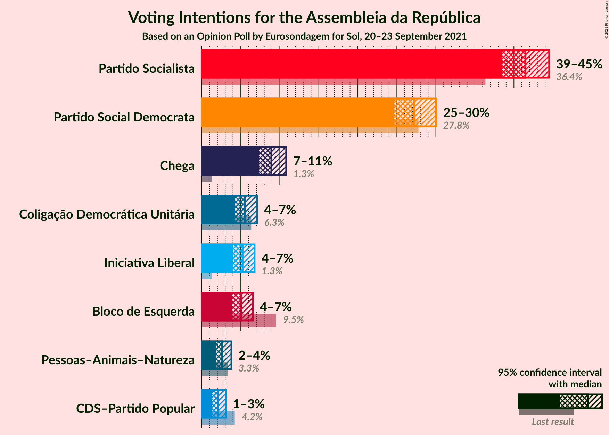

### Confidence Intervals

| Party | Last Result | Poll Result | 80% Confidence Interval | 90% Confidence Interval | 95% Confidence Interval | 99% Confidence Interval |
|:-----:|:-----------:|:-----------:|:-----------------------:|:-----------------------:|:-----------------------:|:-----------------------:|
| Partido Socialista | 36.4% | 41.5% | 39.5–43.5% |39.0–44.0% |38.5–44.5% |37.6–45.5% |
| Partido Social Democrata | 27.8% | 27.2% | 25.5–29.1% |25.0–29.6% |24.6–30.0% |23.8–30.9% |
| Chega | 1.3% | 8.9% | 7.9–10.2% |7.6–10.5% |7.3–10.8% |6.8–11.4% |
| Coligação Democrática Unitária | 6.3% | 5.5% | 4.7–6.6% |4.5–6.8% |4.3–7.1% |3.9–7.6% |
| Iniciativa Liberal | 1.3% | 5.2% | 4.4–6.2% |4.2–6.5% |4.0–6.8% |3.7–7.3% |
| Bloco de Esquerda | 9.5% | 5.0% | 4.3–6.0% |4.0–6.3% |3.9–6.6% |3.5–7.1% |
| Pessoas–Animais–Natureza | 3.3% | 2.6% | 2.1–3.4% |1.9–3.6% |1.8–3.8% |1.6–4.2% |
| CDS–Partido Popular | 4.2% | 2.0% | 1.6–2.7% |1.4–2.9% |1.3–3.1% |1.1–3.5% |

*Note:* The poll result column reflects the actual value used in the calculations. Published results may vary slightly, and in addition be rounded to fewer digits.

## Seats

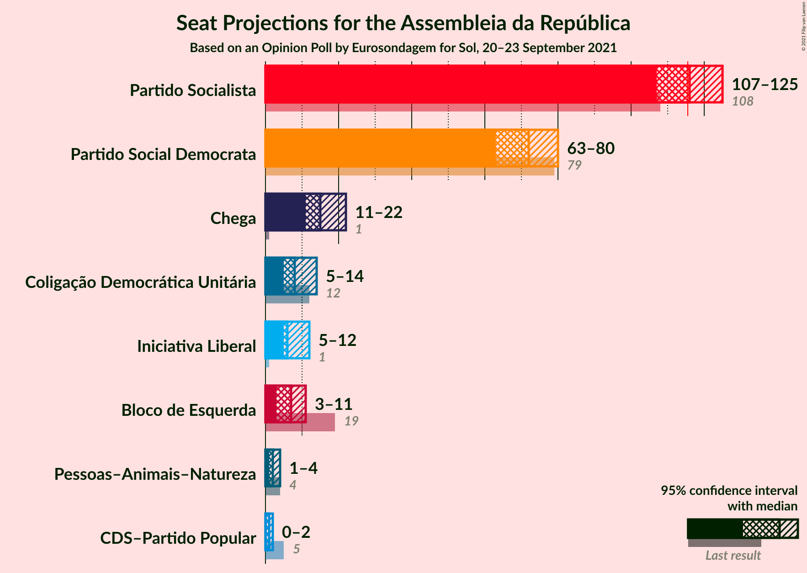

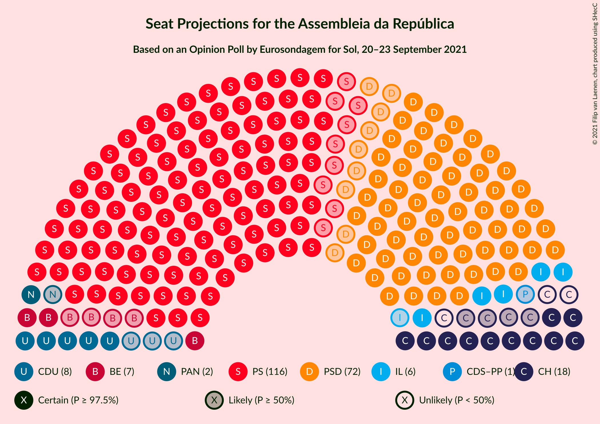

### Confidence Intervals

| Party | Last Result | Median | 80% Confidence Interval | 90% Confidence Interval | 95% Confidence Interval | 99% Confidence Interval |
|:-----:|:-----------:|:------:|:-----------------------:|:-----------------------:|:-----------------------:|:-----------------------:|
| <a href="#partido-socialista">Partido Socialista</a> | 108 | 116 | 111–122 |109–124 |107–125 |104–128 |
| <a href="#partido-social-democrata">Partido Social Democrata</a> | 79 | 72 | 66–77 |64–80 |63–80 |62–84 |
| <a href="#chega">Chega</a> | 1 | 15 | 12–19 |11–20 |11–22 |11–23 |
| <a href="#coligação-democrática-unitária">Coligação Democrática Unitária</a> | 12 | 8 | 6–11 |6–13 |5–14 |5–15 |
| <a href="#iniciativa-liberal">Iniciativa Liberal</a> | 1 | 6 | 6–10 |5–10 |5–12 |4–12 |
| <a href="#bloco-de-esquerda">Bloco de Esquerda</a> | 19 | 7 | 5–8 |3–10 |3–11 |2–12 |
| <a href="#pessoas–animais–natureza">Pessoas–Animais–Natureza</a> | 4 | 2 | 2–3 |1–4 |1–4 |1–4 |
| <a href="#cds–partido-popular">CDS–Partido Popular</a> | 5 | 1 | 0–1 |0–2 |0–2 |0–2 |

### Partido Socialista

*For a full overview of the results for this party, see the [Partido Socialista](party-partidosocialista.html) page.*

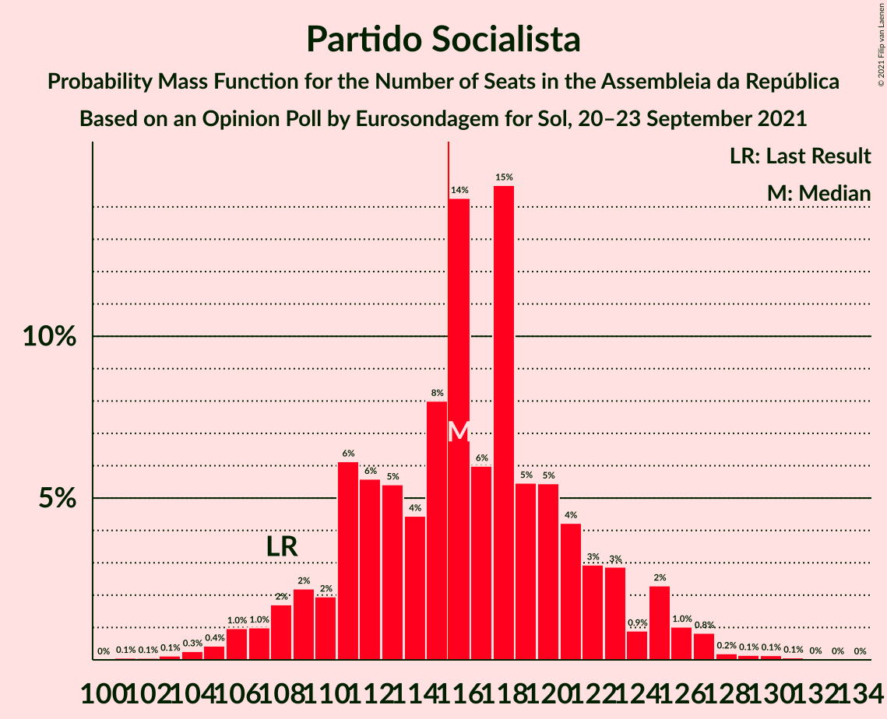

| Number of Seats | Probability | Accumulated | Special Marks |
|:---------------:|:-----------:|:-----------:|:-------------:|
| 101 | 0.1% | 100% |  |
| 102 | 0.1% | 99.9% |  |
| 103 | 0.1% | 99.8% |  |
| 104 | 0.3% | 99.7% |  |
| 105 | 0.4% | 99.4% |  |
| 106 | 1.0% | 99.0% |  |
| 107 | 1.0% | 98% |  |
| 108 | 2% | 97% | Last Result |
| 109 | 2% | 95% |  |
| 110 | 2% | 93% |  |
| 111 | 6% | 91% |  |
| 112 | 6% | 85% |  |
| 113 | 5% | 79% |  |
| 114 | 4% | 74% |  |
| 115 | 8% | 70% |  |
| 116 | 14% | 62% | Median, Majority |
| 117 | 6% | 47% |  |
| 118 | 15% | 41% |  |
| 119 | 5% | 27% |  |
| 120 | 5% | 21% |  |
| 121 | 4% | 16% |  |
| 122 | 3% | 11% |  |
| 123 | 3% | 9% |  |
| 124 | 0.9% | 6% |  |
| 125 | 2% | 5% |  |
| 126 | 1.0% | 2% |  |
| 127 | 0.8% | 1.5% |  |
| 128 | 0.2% | 0.6% |  |
| 129 | 0.1% | 0.4% |  |
| 130 | 0.1% | 0.3% |  |
| 131 | 0.1% | 0.1% |  |
| 132 | 0% | 0.1% |  |
| 133 | 0% | 0% |  |

### Partido Social Democrata

*For a full overview of the results for this party, see the [Partido Social Democrata](party-partidosocialdemocrata.html) page.*

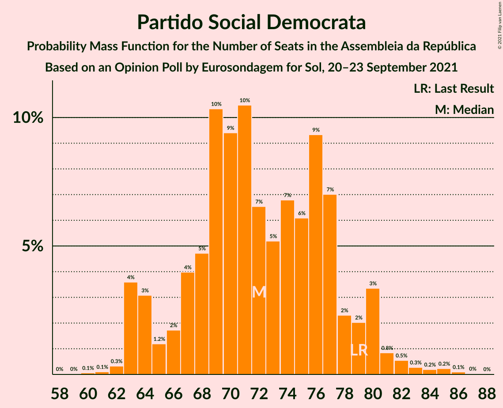

| Number of Seats | Probability | Accumulated | Special Marks |
|:---------------:|:-----------:|:-----------:|:-------------:|
| 58 | 0% | 100% |  |
| 59 | 0% | 99.9% |  |
| 60 | 0.1% | 99.9% |  |
| 61 | 0.1% | 99.9% |  |
| 62 | 0.3% | 99.7% |  |
| 63 | 4% | 99.4% |  |
| 64 | 3% | 96% |  |
| 65 | 1.2% | 93% |  |
| 66 | 2% | 92% |  |
| 67 | 4% | 90% |  |
| 68 | 5% | 86% |  |
| 69 | 10% | 81% |  |
| 70 | 9% | 71% |  |
| 71 | 10% | 61% |  |
| 72 | 7% | 51% | Median |
| 73 | 5% | 44% |  |
| 74 | 7% | 39% |  |
| 75 | 6% | 32% |  |
| 76 | 9% | 26% |  |
| 77 | 7% | 17% |  |
| 78 | 2% | 10% |  |
| 79 | 2% | 8% | Last Result |
| 80 | 3% | 6% |  |
| 81 | 0.8% | 2% |  |
| 82 | 0.5% | 1.4% |  |
| 83 | 0.3% | 0.9% |  |
| 84 | 0.2% | 0.6% |  |
| 85 | 0.2% | 0.4% |  |
| 86 | 0.1% | 0.2% |  |
| 87 | 0% | 0.1% |  |
| 88 | 0% | 0% |  |

### Chega

*For a full overview of the results for this party, see the [Chega](party-chega.html) page.*

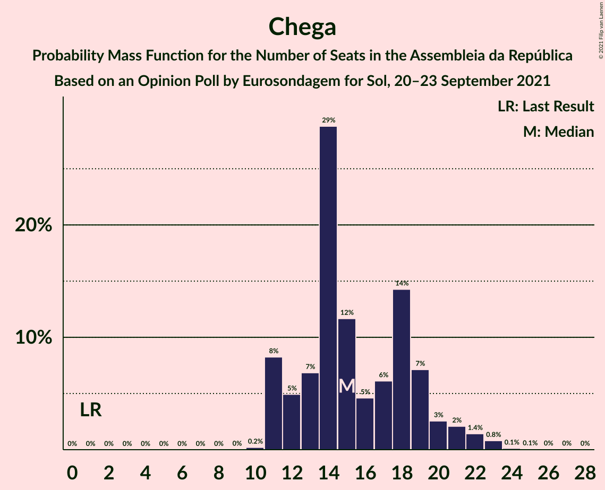

| Number of Seats | Probability | Accumulated | Special Marks |
|:---------------:|:-----------:|:-----------:|:-------------:|
| 1 | 0% | 100% | Last Result |
| 2 | 0% | 100% |  |
| 3 | 0% | 100% |  |
| 4 | 0% | 100% |  |
| 5 | 0% | 100% |  |
| 6 | 0% | 100% |  |
| 7 | 0% | 100% |  |
| 8 | 0% | 100% |  |
| 9 | 0% | 100% |  |
| 10 | 0.2% | 100% |  |
| 11 | 8% | 99.8% |  |
| 12 | 5% | 92% |  |
| 13 | 7% | 87% |  |
| 14 | 29% | 80% |  |
| 15 | 12% | 51% | Median |
| 16 | 5% | 39% |  |
| 17 | 6% | 35% |  |
| 18 | 14% | 29% |  |
| 19 | 7% | 14% |  |
| 20 | 3% | 7% |  |
| 21 | 2% | 5% |  |
| 22 | 1.4% | 3% |  |
| 23 | 0.8% | 1.1% |  |
| 24 | 0.1% | 0.3% |  |
| 25 | 0.1% | 0.2% |  |
| 26 | 0% | 0.1% |  |
| 27 | 0% | 0.1% |  |
| 28 | 0% | 0% |  |

### Coligação Democrática Unitária

*For a full overview of the results for this party, see the [Coligação Democrática Unitária](party-coligaçãodemocráticaunitária.html) page.*

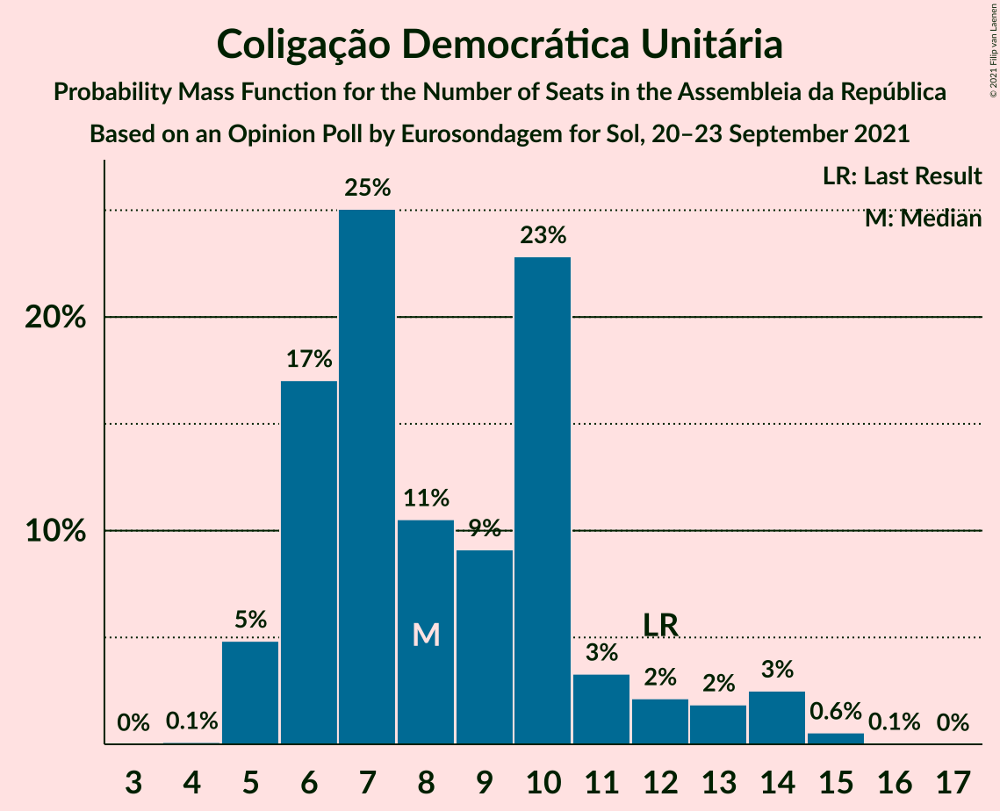

| Number of Seats | Probability | Accumulated | Special Marks |
|:---------------:|:-----------:|:-----------:|:-------------:|
| 4 | 0.1% | 100% |  |
| 5 | 5% | 99.9% |  |
| 6 | 17% | 95% |  |
| 7 | 25% | 78% |  |
| 8 | 11% | 53% | Median |
| 9 | 9% | 42% |  |
| 10 | 23% | 33% |  |
| 11 | 3% | 10% |  |
| 12 | 2% | 7% | Last Result |
| 13 | 2% | 5% |  |
| 14 | 3% | 3% |  |
| 15 | 0.6% | 0.6% |  |
| 16 | 0.1% | 0.1% |  |
| 17 | 0% | 0% |  |

### Iniciativa Liberal

*For a full overview of the results for this party, see the [Iniciativa Liberal](party-iniciativaliberal.html) page.*

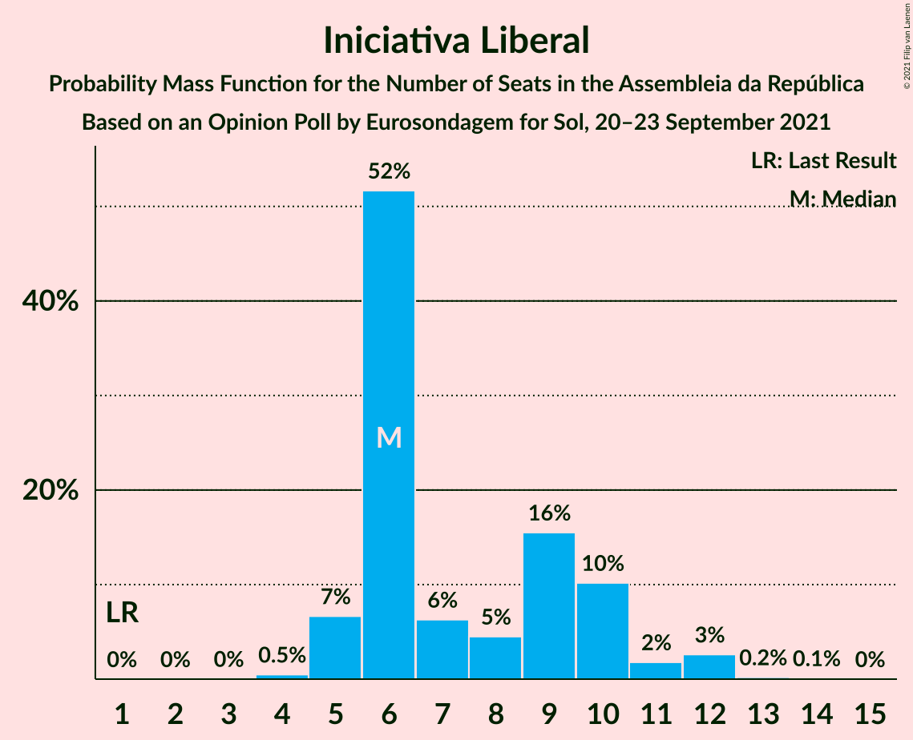

| Number of Seats | Probability | Accumulated | Special Marks |
|:---------------:|:-----------:|:-----------:|:-------------:|
| 1 | 0% | 100% | Last Result |
| 2 | 0% | 100% |  |
| 3 | 0% | 100% |  |
| 4 | 0.5% | 100% |  |
| 5 | 7% | 99.5% |  |
| 6 | 52% | 93% | Median |
| 7 | 6% | 41% |  |
| 8 | 5% | 35% |  |
| 9 | 16% | 30% |  |
| 10 | 10% | 15% |  |
| 11 | 2% | 5% |  |
| 12 | 3% | 3% |  |
| 13 | 0.2% | 0.3% |  |
| 14 | 0.1% | 0.1% |  |
| 15 | 0% | 0% |  |

### Bloco de Esquerda

*For a full overview of the results for this party, see the [Bloco de Esquerda](party-blocodeesquerda.html) page.*

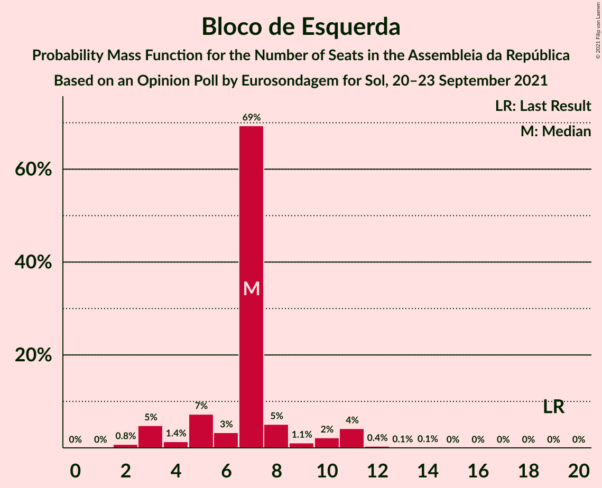

| Number of Seats | Probability | Accumulated | Special Marks |
|:---------------:|:-----------:|:-----------:|:-------------:|
| 2 | 0.8% | 100% |  |
| 3 | 5% | 99.2% |  |
| 4 | 1.4% | 94% |  |
| 5 | 7% | 93% |  |
| 6 | 3% | 86% |  |
| 7 | 69% | 82% | Median |
| 8 | 5% | 13% |  |
| 9 | 1.1% | 8% |  |
| 10 | 2% | 7% |  |
| 11 | 4% | 5% |  |
| 12 | 0.4% | 0.6% |  |
| 13 | 0.1% | 0.2% |  |
| 14 | 0.1% | 0.1% |  |
| 15 | 0% | 0% |  |
| 16 | 0% | 0% |  |
| 17 | 0% | 0% |  |
| 18 | 0% | 0% |  |
| 19 | 0% | 0% | Last Result |

### Pessoas–Animais–Natureza

*For a full overview of the results for this party, see the [Pessoas–Animais–Natureza](party-pessoas–animais–natureza.html) page.*

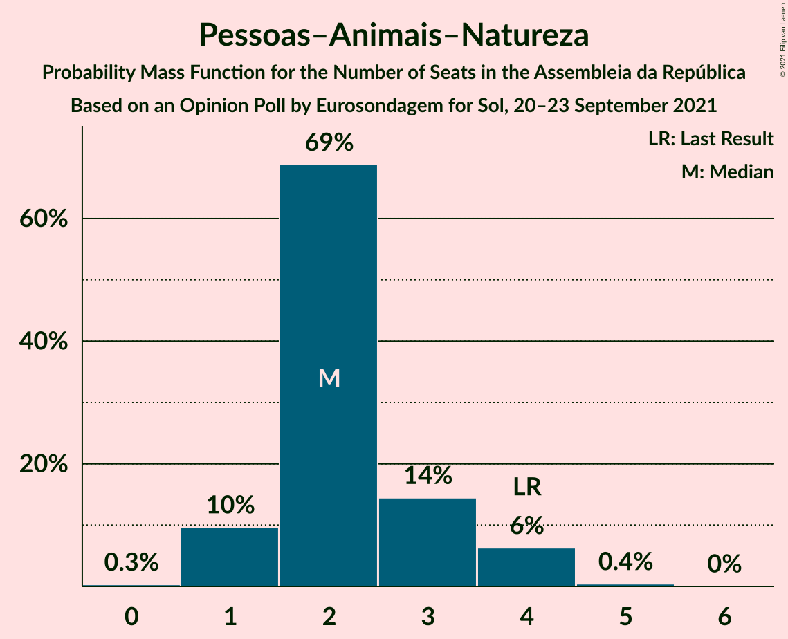

| Number of Seats | Probability | Accumulated | Special Marks |
|:---------------:|:-----------:|:-----------:|:-------------:|
| 0 | 0.3% | 100% |  |
| 1 | 10% | 99.7% |  |
| 2 | 69% | 90% | Median |
| 3 | 14% | 21% |  |
| 4 | 6% | 7% | Last Result |
| 5 | 0.4% | 0.5% |  |
| 6 | 0% | 0% |  |

### CDS–Partido Popular

*For a full overview of the results for this party, see the [CDS–Partido Popular](party-cds–partidopopular.html) page.*

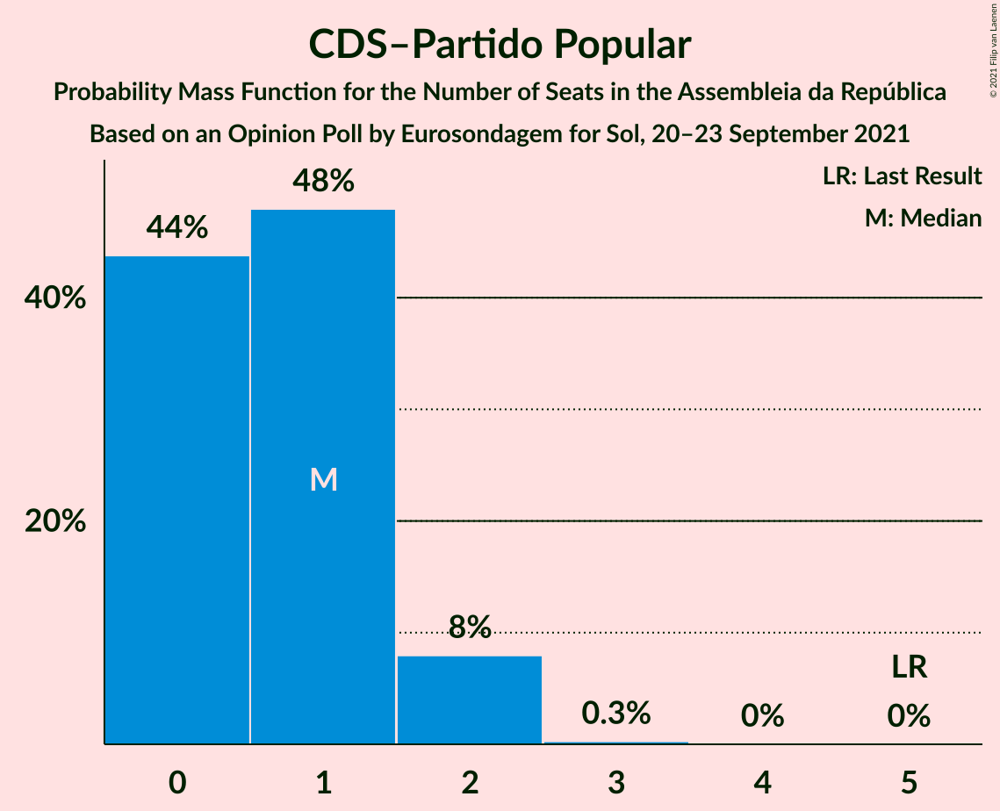

| Number of Seats | Probability | Accumulated | Special Marks |
|:---------------:|:-----------:|:-----------:|:-------------:|
| 0 | 44% | 100% |  |
| 1 | 48% | 56% | Median |
| 2 | 8% | 8% |  |
| 3 | 0.3% | 0.3% |  |
| 4 | 0% | 0% |  |
| 5 | 0% | 0% | Last Result |

## Coalitions

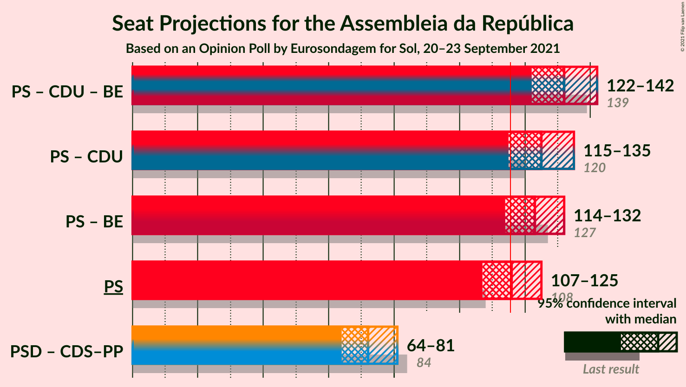

### Confidence Intervals

| Coalition | Last Result | Median | Majority? | 80% Confidence Interval | 90% Confidence Interval | 95% Confidence Interval | 99% Confidence Interval |
|:---------:|:-----------:|:------:|:---------:|:-----------------------:|:-----------------------:|:-----------------------:|:-----------------------:|
| Partido Socialista – Coligação Democrática Unitária – Bloco de Esquerda | 139 | 132 | 99.9% | 125–138 | 124–140 | 122–142 | 119–144 |
| Partido Socialista – Coligação Democrática Unitária | 120 | 125 | 97% | 118–131 | 117–133 | 115–135 | 112–137 |
| Partido Socialista – Bloco de Esquerda | 127 | 123 | 95% | 118–129 | 116–131 | 114–132 | 111–135 |
| Partido Socialista | 108 | 116 | 62% | 111–122 | 109–124 | 107–125 | 104–128 |
| Partido Social Democrata – CDS–Partido Popular | 84 | 72 | 0% | 67–78 | 64–80 | 64–81 | 63–85 |

### Partido Socialista – Coligação Democrática Unitária – Bloco de Esquerda

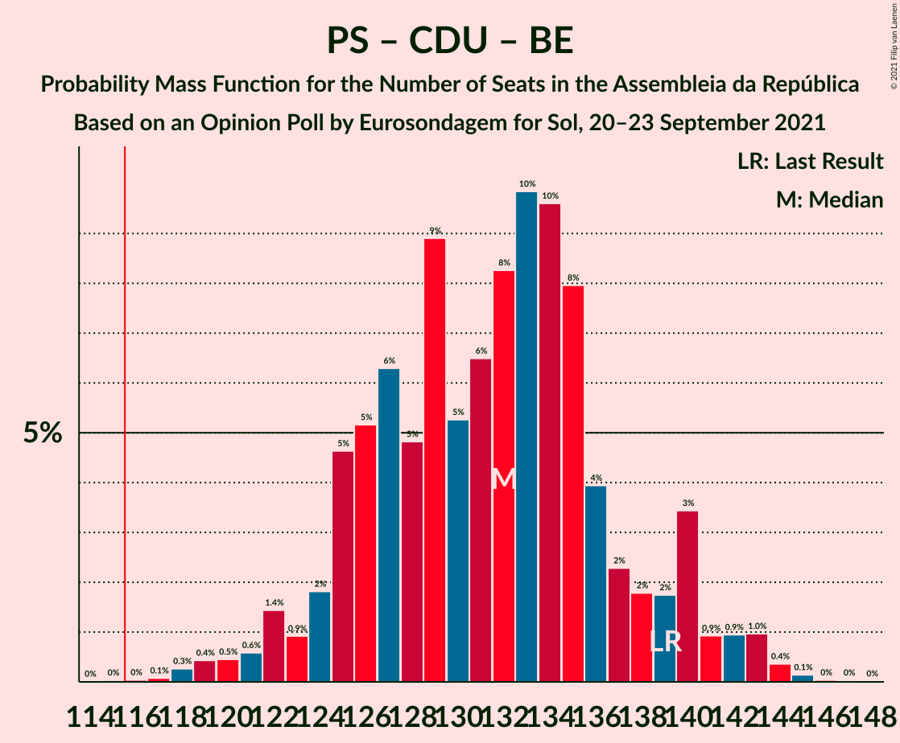

| Number of Seats | Probability | Accumulated | Special Marks |
|:---------------:|:-----------:|:-----------:|:-------------:|
| 115 | 0% | 100% |  |
| 116 | 0% | 99.9% | Majority |
| 117 | 0.1% | 99.9% |  |
| 118 | 0.3% | 99.8% |  |
| 119 | 0.4% | 99.6% |  |
| 120 | 0.5% | 99.1% |  |
| 121 | 0.6% | 98.7% |  |
| 122 | 1.4% | 98% |  |
| 123 | 0.9% | 97% |  |
| 124 | 2% | 96% |  |
| 125 | 5% | 94% |  |
| 126 | 5% | 89% |  |
| 127 | 6% | 84% |  |
| 128 | 5% | 78% |  |
| 129 | 9% | 73% |  |
| 130 | 5% | 64% |  |
| 131 | 6% | 59% | Median |
| 132 | 8% | 52% |  |
| 133 | 10% | 44% |  |
| 134 | 10% | 34% |  |
| 135 | 8% | 25% |  |
| 136 | 4% | 17% |  |
| 137 | 2% | 13% |  |
| 138 | 2% | 10% |  |
| 139 | 2% | 9% | Last Result |
| 140 | 3% | 7% |  |
| 141 | 0.9% | 3% |  |
| 142 | 0.9% | 3% |  |
| 143 | 1.0% | 2% |  |
| 144 | 0.4% | 0.6% |  |
| 145 | 0.1% | 0.2% |  |
| 146 | 0% | 0.1% |  |
| 147 | 0% | 0.1% |  |
| 148 | 0% | 0% |  |

### Partido Socialista – Coligação Democrática Unitária

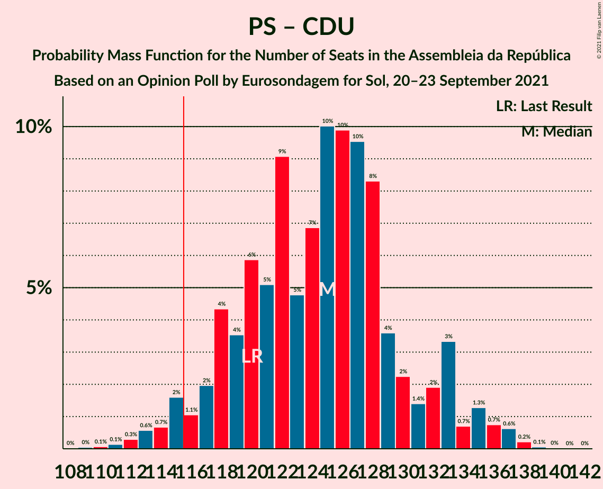

| Number of Seats | Probability | Accumulated | Special Marks |
|:---------------:|:-----------:|:-----------:|:-------------:|
| 108 | 0% | 100% |  |
| 109 | 0% | 99.9% |  |
| 110 | 0.1% | 99.9% |  |
| 111 | 0.1% | 99.8% |  |
| 112 | 0.3% | 99.7% |  |
| 113 | 0.6% | 99.4% |  |
| 114 | 0.7% | 98.8% |  |
| 115 | 2% | 98% |  |
| 116 | 1.1% | 97% | Majority |
| 117 | 2% | 95% |  |
| 118 | 4% | 94% |  |
| 119 | 4% | 89% |  |
| 120 | 6% | 86% | Last Result |
| 121 | 5% | 80% |  |
| 122 | 9% | 75% |  |
| 123 | 5% | 66% |  |
| 124 | 7% | 61% | Median |
| 125 | 10% | 54% |  |
| 126 | 10% | 44% |  |
| 127 | 10% | 34% |  |
| 128 | 8% | 25% |  |
| 129 | 4% | 16% |  |
| 130 | 2% | 13% |  |
| 131 | 1.4% | 10% |  |
| 132 | 2% | 9% |  |
| 133 | 3% | 7% |  |
| 134 | 0.7% | 4% |  |
| 135 | 1.3% | 3% |  |
| 136 | 0.7% | 2% |  |
| 137 | 0.6% | 1.0% |  |
| 138 | 0.2% | 0.3% |  |
| 139 | 0.1% | 0.1% |  |
| 140 | 0% | 0.1% |  |
| 141 | 0% | 0% |  |

### Partido Socialista – Bloco de Esquerda

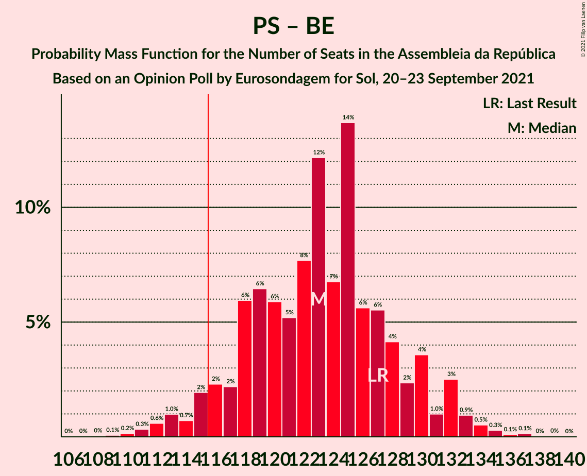

| Number of Seats | Probability | Accumulated | Special Marks |
|:---------------:|:-----------:|:-----------:|:-------------:|
| 107 | 0% | 100% |  |
| 108 | 0% | 99.9% |  |
| 109 | 0.1% | 99.9% |  |
| 110 | 0.2% | 99.8% |  |
| 111 | 0.3% | 99.7% |  |
| 112 | 0.6% | 99.3% |  |
| 113 | 1.0% | 98.7% |  |
| 114 | 0.7% | 98% |  |
| 115 | 2% | 97% |  |
| 116 | 2% | 95% | Majority |
| 117 | 2% | 93% |  |
| 118 | 6% | 91% |  |
| 119 | 6% | 85% |  |
| 120 | 6% | 78% |  |
| 121 | 5% | 72% |  |
| 122 | 8% | 67% |  |
| 123 | 12% | 59% | Median |
| 124 | 7% | 47% |  |
| 125 | 14% | 41% |  |
| 126 | 6% | 27% |  |
| 127 | 6% | 21% | Last Result |
| 128 | 4% | 16% |  |
| 129 | 2% | 12% |  |
| 130 | 4% | 9% |  |
| 131 | 1.0% | 6% |  |
| 132 | 3% | 5% |  |
| 133 | 0.9% | 2% |  |
| 134 | 0.5% | 1.1% |  |
| 135 | 0.3% | 0.6% |  |
| 136 | 0.1% | 0.3% |  |
| 137 | 0.1% | 0.2% |  |
| 138 | 0% | 0.1% |  |
| 139 | 0% | 0.1% |  |
| 140 | 0% | 0% |  |

### Partido Socialista

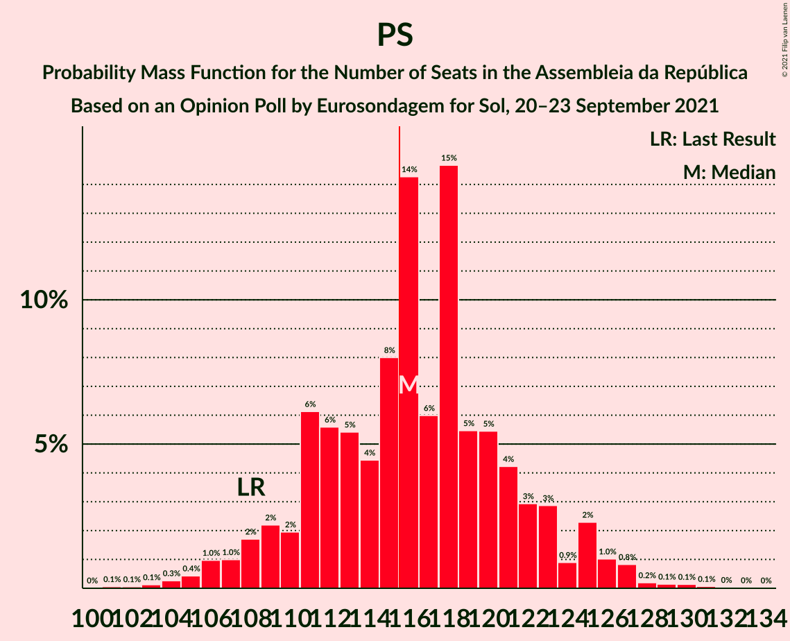

| Number of Seats | Probability | Accumulated | Special Marks |
|:---------------:|:-----------:|:-----------:|:-------------:|
| 101 | 0.1% | 100% |  |
| 102 | 0.1% | 99.9% |  |
| 103 | 0.1% | 99.8% |  |
| 104 | 0.3% | 99.7% |  |
| 105 | 0.4% | 99.4% |  |
| 106 | 1.0% | 99.0% |  |
| 107 | 1.0% | 98% |  |
| 108 | 2% | 97% | Last Result |
| 109 | 2% | 95% |  |
| 110 | 2% | 93% |  |
| 111 | 6% | 91% |  |
| 112 | 6% | 85% |  |
| 113 | 5% | 79% |  |
| 114 | 4% | 74% |  |
| 115 | 8% | 70% |  |
| 116 | 14% | 62% | Median, Majority |
| 117 | 6% | 47% |  |
| 118 | 15% | 41% |  |
| 119 | 5% | 27% |  |
| 120 | 5% | 21% |  |
| 121 | 4% | 16% |  |
| 122 | 3% | 11% |  |
| 123 | 3% | 9% |  |
| 124 | 0.9% | 6% |  |
| 125 | 2% | 5% |  |
| 126 | 1.0% | 2% |  |
| 127 | 0.8% | 1.5% |  |
| 128 | 0.2% | 0.6% |  |
| 129 | 0.1% | 0.4% |  |
| 130 | 0.1% | 0.3% |  |
| 131 | 0.1% | 0.1% |  |
| 132 | 0% | 0.1% |  |
| 133 | 0% | 0% |  |

### Partido Social Democrata – CDS–Partido Popular

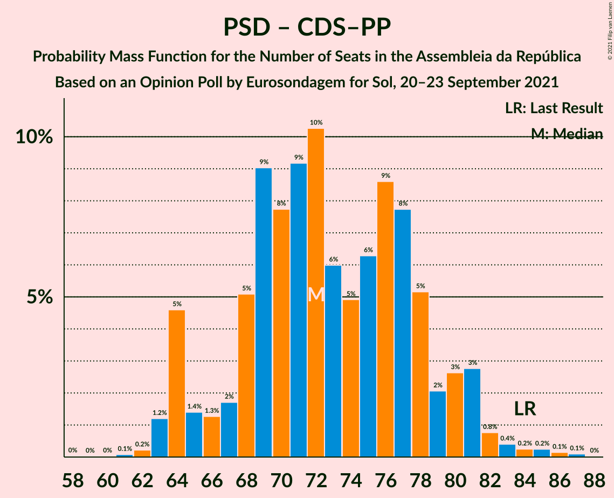

| Number of Seats | Probability | Accumulated | Special Marks |
|:---------------:|:-----------:|:-----------:|:-------------:|
| 59 | 0% | 100% |  |
| 60 | 0% | 99.9% |  |
| 61 | 0.1% | 99.9% |  |
| 62 | 0.2% | 99.8% |  |
| 63 | 1.2% | 99.6% |  |
| 64 | 5% | 98% |  |
| 65 | 1.4% | 94% |  |
| 66 | 1.3% | 92% |  |
| 67 | 2% | 91% |  |
| 68 | 5% | 89% |  |
| 69 | 9% | 84% |  |
| 70 | 8% | 75% |  |
| 71 | 9% | 68% |  |
| 72 | 10% | 58% |  |
| 73 | 6% | 48% | Median |
| 74 | 5% | 42% |  |
| 75 | 6% | 37% |  |
| 76 | 9% | 31% |  |
| 77 | 8% | 22% |  |
| 78 | 5% | 15% |  |
| 79 | 2% | 9% |  |
| 80 | 3% | 7% |  |
| 81 | 3% | 5% |  |
| 82 | 0.8% | 2% |  |
| 83 | 0.4% | 1.2% |  |
| 84 | 0.2% | 0.8% | Last Result |
| 85 | 0.2% | 0.5% |  |
| 86 | 0.1% | 0.3% |  |
| 87 | 0.1% | 0.1% |  |
| 88 | 0% | 0% |  |

## Technical Information

### Opinion Poll

+ **Polling firm:** Eurosondagem
+ **Commissioner(s):** Sol
+ **Fieldwork period:** 20–23 September 2021

### Calculations

+ **Sample size:** 1032
+ **Simulations done:** 1,048,576
+ **Error estimate:** 2.04%

