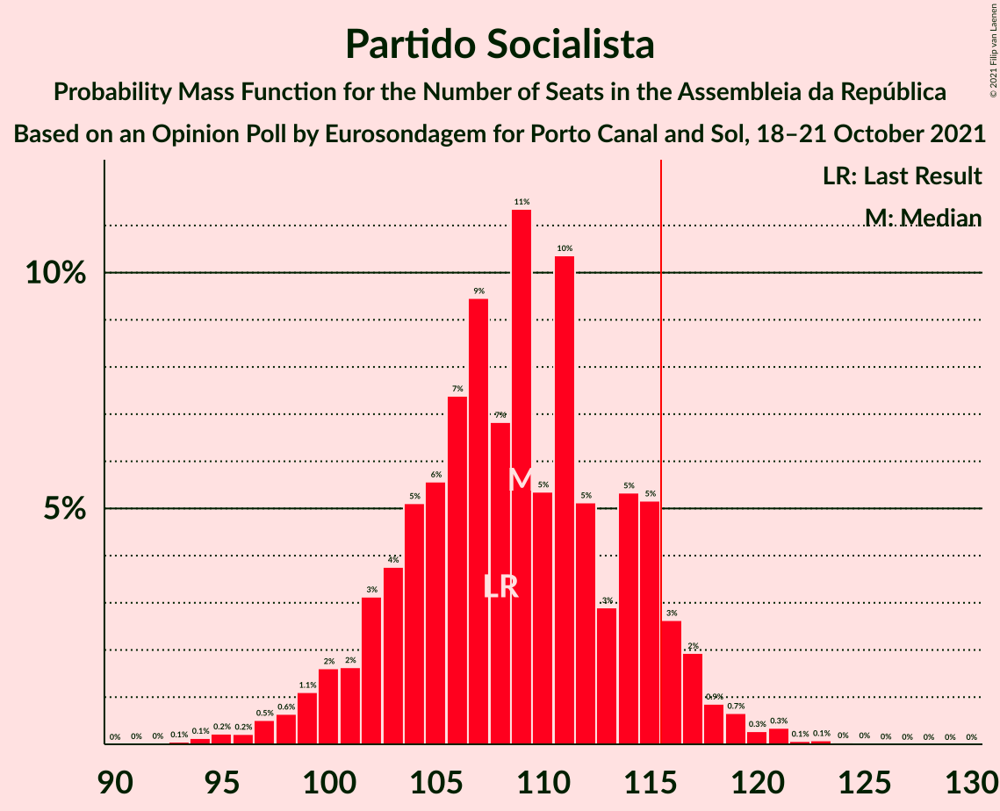
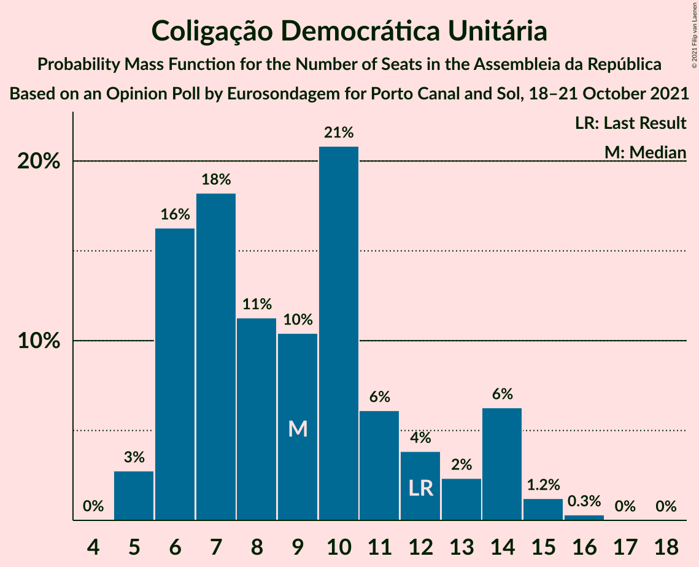

# Opinion Poll by Eurosondagem for Porto Canal and Sol, 18–21 October 2021

<a href="#voting-intentions">Voting Intentions</a> | <a href="#seats">Seats</a> | <a href="#coalitions">Coalitions</a> | <a href="#technical-information">Technical Information</a>

## Voting Intentions

### Confidence Intervals

| Party | Last Result | Poll Result | 80% Confidence Interval | 90% Confidence Interval | 95% Confidence Interval | 99% Confidence Interval |
|:-----:|:-----------:|:-----------:|:-----------------------:|:-----------------------:|:-----------------------:|:-----------------------:|
| Partido Socialista | 36.4% | 38.1% | 36.2–40.1% |35.7–40.7% |35.2–41.2% |34.3–42.1% |
| Partido Social Democrata | 27.8% | 27.5% | 25.8–29.4% |25.3–29.9% |24.9–30.3% |24.1–31.2% |
| Chega | 1.3% | 9.2% | 8.2–10.5% |7.9–10.9% |7.6–11.2% |7.1–11.8% |
| Coligação Democrática Unitária | 6.3% | 5.6% | 4.8–6.7% |4.6–7.0% |4.4–7.2% |4.0–7.8% |
| Iniciativa Liberal | 1.3% | 5.5% | 4.7–6.6% |4.5–6.9% |4.3–7.1% |3.9–7.7% |
| Bloco de Esquerda | 9.5% | 5.1% | 4.3–6.1% |4.1–6.3% |3.9–6.6% |3.5–7.1% |
| Pessoas–Animais–Natureza | 3.3% | 2.8% | 2.3–3.6% |2.1–3.8% |2.0–4.0% |1.7–4.4% |
| CDS–Partido Popular | 4.2% | 2.5% | 2.0–3.3% |1.8–3.5% |1.7–3.7% |1.5–4.1% |

*Note:* The poll result column reflects the actual value used in the calculations. Published results may vary slightly, and in addition be rounded to fewer digits.

## Seats

### Confidence Intervals

| Party | Last Result | Median | 80% Confidence Interval | 90% Confidence Interval | 95% Confidence Interval | 99% Confidence Interval |
|:-----:|:-----------:|:------:|:-----------------------:|:-----------------------:|:-----------------------:|:-----------------------:|
| <a href="#partido-socialista">Partido Socialista</a> | 108 | 109 | 103–115 |101–116 |99–117 |96–121 |
| <a href="#partido-social-democrata">Partido Social Democrata</a> | 79 | 75 | 69–81 |67–83 |66–85 |64–88 |
| <a href="#chega">Chega</a> | 1 | 17 | 14–21 |12–23 |11–23 |11–25 |
| <a href="#coligação-democrática-unitária">Coligação Democrática Unitária</a> | 12 | 9 | 6–13 |6–14 |5–14 |5–15 |
| <a href="#iniciativa-liberal">Iniciativa Liberal</a> | 1 | 8 | 6–12 |6–12 |6–12 |5–13 |
| <a href="#bloco-de-esquerda">Bloco de Esquerda</a> | 19 | 7 | 5–10 |4–11 |3–11 |2–13 |
| <a href="#pessoas–animais–natureza">Pessoas–Animais–Natureza</a> | 4 | 2 | 2–4 |1–4 |1–4 |1–5 |
| <a href="#cds–partido-popular">CDS–Partido Popular</a> | 5 | 1 | 1–2 |0–3 |0–3 |0–4 |

### Partido Socialista

*For a full overview of the results for this party, see the [Partido Socialista](party-partidosocialista.html) page.*

| Number of Seats | Probability | Accumulated | Special Marks |
|:---------------:|:-----------:|:-----------:|:-------------:|
| 92 | 0% | 100% |  |
| 93 | 0.1% | 99.9% |  |
| 94 | 0.1% | 99.9% |  |
| 95 | 0.2% | 99.8% |  |
| 96 | 0.2% | 99.5% |  |
| 97 | 0.5% | 99.3% |  |
| 98 | 0.6% | 98.8% |  |
| 99 | 1.1% | 98% |  |
| 100 | 2% | 97% |  |
| 101 | 2% | 95% |  |
| 102 | 3% | 94% |  |
| 103 | 4% | 91% |  |
| 104 | 5% | 87% |  |
| 105 | 6% | 82% |  |
| 106 | 7% | 76% |  |
| 107 | 9% | 69% |  |
| 108 | 7% | 59% | Last Result |
| 109 | 11% | 53% | Median |
| 110 | 5% | 41% |  |
| 111 | 10% | 36% |  |
| 112 | 5% | 25% |  |
| 113 | 3% | 20% |  |
| 114 | 5% | 17% |  |
| 115 | 5% | 12% |  |
| 116 | 3% | 7% | Majority |
| 117 | 2% | 4% |  |
| 118 | 0.9% | 2% |  |
| 119 | 0.7% | 2% |  |
| 120 | 0.3% | 0.9% |  |
| 121 | 0.3% | 0.6% |  |
| 122 | 0.1% | 0.2% |  |
| 123 | 0.1% | 0.2% |  |
| 124 | 0% | 0.1% |  |
| 125 | 0% | 0.1% |  |
| 126 | 0% | 0% |  |

### Partido Social Democrata

*For a full overview of the results for this party, see the [Partido Social Democrata](party-partidosocialdemocrata.html) page.*

| Number of Seats | Probability | Accumulated | Special Marks |
|:---------------:|:-----------:|:-----------:|:-------------:|
| 61 | 0% | 100% |  |
| 62 | 0% | 99.9% |  |
| 63 | 0.4% | 99.9% |  |
| 64 | 0.2% | 99.5% |  |
| 65 | 0.5% | 99.4% |  |
| 66 | 2% | 98.8% |  |
| 67 | 3% | 97% |  |
| 68 | 3% | 94% |  |
| 69 | 4% | 92% |  |
| 70 | 7% | 87% |  |
| 71 | 6% | 81% |  |
| 72 | 5% | 74% |  |
| 73 | 5% | 69% |  |
| 74 | 9% | 64% |  |
| 75 | 7% | 55% | Median |
| 76 | 6% | 48% |  |
| 77 | 10% | 43% |  |
| 78 | 5% | 33% |  |
| 79 | 9% | 28% | Last Result |
| 80 | 7% | 19% |  |
| 81 | 4% | 12% |  |
| 82 | 3% | 8% |  |
| 83 | 2% | 6% |  |
| 84 | 0.9% | 4% |  |
| 85 | 1.3% | 3% |  |
| 86 | 0.8% | 2% |  |
| 87 | 0.5% | 1.0% |  |
| 88 | 0.3% | 0.5% |  |
| 89 | 0% | 0.2% |  |
| 90 | 0.1% | 0.1% |  |
| 91 | 0% | 0.1% |  |
| 92 | 0% | 0% |  |

### Chega

*For a full overview of the results for this party, see the [Chega](party-chega.html) page.*

| Number of Seats | Probability | Accumulated | Special Marks |
|:---------------:|:-----------:|:-----------:|:-------------:|
| 1 | 0% | 100% | Last Result |
| 2 | 0% | 100% |  |
| 3 | 0% | 100% |  |
| 4 | 0% | 100% |  |
| 5 | 0% | 100% |  |
| 6 | 0% | 100% |  |
| 7 | 0% | 100% |  |
| 8 | 0% | 100% |  |
| 9 | 0% | 100% |  |
| 10 | 0% | 100% |  |
| 11 | 3% | 100% |  |
| 12 | 2% | 97% |  |
| 13 | 5% | 95% |  |
| 14 | 21% | 90% |  |
| 15 | 9% | 69% |  |
| 16 | 8% | 59% |  |
| 17 | 6% | 51% | Median |
| 18 | 11% | 45% |  |
| 19 | 9% | 34% |  |
| 20 | 8% | 25% |  |
| 21 | 8% | 16% |  |
| 22 | 3% | 8% |  |
| 23 | 3% | 5% |  |
| 24 | 1.3% | 2% |  |
| 25 | 0.6% | 1.0% |  |
| 26 | 0.2% | 0.4% |  |
| 27 | 0.1% | 0.2% |  |
| 28 | 0.1% | 0.1% |  |
| 29 | 0% | 0% |  |

### Coligação Democrática Unitária

*For a full overview of the results for this party, see the [Coligação Democrática Unitária](party-coligaçãodemocráticaunitária.html) page.*

| Number of Seats | Probability | Accumulated | Special Marks |
|:---------------:|:-----------:|:-----------:|:-------------:|
| 5 | 3% | 100% |  |
| 6 | 16% | 97% |  |
| 7 | 18% | 81% |  |
| 8 | 11% | 63% |  |
| 9 | 10% | 51% | Median |
| 10 | 21% | 41% |  |
| 11 | 6% | 20% |  |
| 12 | 4% | 14% | Last Result |
| 13 | 2% | 10% |  |
| 14 | 6% | 8% |  |
| 15 | 1.2% | 2% |  |
| 16 | 0.3% | 0.4% |  |
| 17 | 0% | 0.1% |  |
| 18 | 0% | 0% |  |

### Iniciativa Liberal

*For a full overview of the results for this party, see the [Iniciativa Liberal](party-iniciativaliberal.html) page.*

| Number of Seats | Probability | Accumulated | Special Marks |
|:---------------:|:-----------:|:-----------:|:-------------:|
| 1 | 0% | 100% | Last Result |
| 2 | 0% | 100% |  |
| 3 | 0% | 100% |  |
| 4 | 0.1% | 100% |  |
| 5 | 2% | 99.9% |  |
| 6 | 34% | 98% |  |
| 7 | 7% | 64% |  |
| 8 | 8% | 57% | Median |
| 9 | 17% | 49% |  |
| 10 | 15% | 33% |  |
| 11 | 7% | 18% |  |
| 12 | 10% | 11% |  |
| 13 | 0.8% | 1.2% |  |
| 14 | 0.4% | 0.4% |  |
| 15 | 0% | 0% |  |

### Bloco de Esquerda

*For a full overview of the results for this party, see the [Bloco de Esquerda](party-blocodeesquerda.html) page.*

| Number of Seats | Probability | Accumulated | Special Marks |
|:---------------:|:-----------:|:-----------:|:-------------:|
| 2 | 0.7% | 100% |  |
| 3 | 3% | 99.3% |  |
| 4 | 2% | 96% |  |
| 5 | 5% | 94% |  |
| 6 | 5% | 90% |  |
| 7 | 68% | 85% | Median |
| 8 | 4% | 17% |  |
| 9 | 3% | 13% |  |
| 10 | 3% | 10% |  |
| 11 | 6% | 7% |  |
| 12 | 0.9% | 1.4% |  |
| 13 | 0.2% | 0.6% |  |
| 14 | 0.3% | 0.3% |  |
| 15 | 0% | 0% |  |
| 16 | 0% | 0% |  |
| 17 | 0% | 0% |  |
| 18 | 0% | 0% |  |
| 19 | 0% | 0% | Last Result |

### Pessoas–Animais–Natureza

*For a full overview of the results for this party, see the [Pessoas–Animais–Natureza](party-pessoas–animais–natureza.html) page.*

| Number of Seats | Probability | Accumulated | Special Marks |
|:---------------:|:-----------:|:-----------:|:-------------:|
| 0 | 0.1% | 100% |  |
| 1 | 5% | 99.9% |  |
| 2 | 64% | 95% | Median |
| 3 | 15% | 31% |  |
| 4 | 14% | 16% | Last Result |
| 5 | 1.4% | 2% |  |
| 6 | 0.2% | 0.2% |  |
| 7 | 0% | 0% |  |

### CDS–Partido Popular

*For a full overview of the results for this party, see the [CDS–Partido Popular](party-cds–partidopopular.html) page.*

| Number of Seats | Probability | Accumulated | Special Marks |
|:---------------:|:-----------:|:-----------:|:-------------:|
| 0 | 9% | 100% |  |
| 1 | 52% | 91% | Median |
| 2 | 34% | 39% |  |
| 3 | 5% | 6% |  |
| 4 | 0.5% | 0.9% |  |
| 5 | 0.3% | 0.3% | Last Result |
| 6 | 0% | 0% |  |

## Coalitions

### Confidence Intervals

| Coalition | Last Result | Median | Majority? | 80% Confidence Interval | 90% Confidence Interval | 95% Confidence Interval | 99% Confidence Interval |
|:---------:|:-----------:|:------:|:---------:|:-----------------------:|:-----------------------:|:-----------------------:|:-----------------------:|
| Partido Socialista – Coligação Democrática Unitária – Bloco de Esquerda | 139 | 125 | 96% | 118–132 | 116–134 | 114–135 | 111–137 |
| Partido Socialista – Coligação Democrática Unitária | 120 | 117 | 68% | 111–124 | 109–126 | 107–128 | 104–130 |
| Partido Socialista – Bloco de Esquerda | 127 | 116 | 53% | 110–122 | 108–124 | 106–125 | 103–128 |
| Partido Socialista | 108 | 109 | 7% | 103–115 | 101–116 | 99–117 | 96–121 |
| Partido Social Democrata – CDS–Partido Popular | 84 | 77 | 0% | 70–82 | 68–84 | 68–86 | 65–89 |

### Partido Socialista – Coligação Democrática Unitária – Bloco de Esquerda

| Number of Seats | Probability | Accumulated | Special Marks |
|:---------------:|:-----------:|:-----------:|:-------------:|
| 108 | 0% | 100% |  |
| 109 | 0.1% | 99.9% |  |
| 110 | 0.2% | 99.8% |  |
| 111 | 0.3% | 99.6% |  |
| 112 | 0.5% | 99.3% |  |
| 113 | 0.9% | 98.8% |  |
| 114 | 0.7% | 98% |  |
| 115 | 1.2% | 97% |  |
| 116 | 1.5% | 96% | Majority |
| 117 | 2% | 95% |  |
| 118 | 3% | 92% |  |
| 119 | 4% | 89% |  |
| 120 | 4% | 85% |  |
| 121 | 7% | 81% |  |
| 122 | 6% | 74% |  |
| 123 | 7% | 67% |  |
| 124 | 10% | 61% |  |
| 125 | 8% | 50% | Median |
| 126 | 7% | 42% |  |
| 127 | 9% | 36% |  |
| 128 | 6% | 27% |  |
| 129 | 5% | 21% |  |
| 130 | 4% | 16% |  |
| 131 | 2% | 13% |  |
| 132 | 3% | 10% |  |
| 133 | 2% | 8% |  |
| 134 | 2% | 6% |  |
| 135 | 2% | 4% |  |
| 136 | 1.2% | 2% |  |
| 137 | 0.5% | 0.9% |  |
| 138 | 0.2% | 0.5% |  |
| 139 | 0.2% | 0.3% | Last Result |
| 140 | 0% | 0.1% |  |
| 141 | 0% | 0.1% |  |
| 142 | 0% | 0% |  |

### Partido Socialista – Coligação Democrática Unitária

| Number of Seats | Probability | Accumulated | Special Marks |
|:---------------:|:-----------:|:-----------:|:-------------:|
| 101 | 0% | 100% |  |
| 102 | 0.1% | 99.9% |  |
| 103 | 0.2% | 99.8% |  |
| 104 | 0.4% | 99.7% |  |
| 105 | 0.5% | 99.3% |  |
| 106 | 0.8% | 98.8% |  |
| 107 | 0.6% | 98% |  |
| 108 | 1.3% | 97% |  |
| 109 | 2% | 96% |  |
| 110 | 2% | 94% |  |
| 111 | 3% | 92% |  |
| 112 | 4% | 89% |  |
| 113 | 4% | 85% |  |
| 114 | 7% | 81% |  |
| 115 | 7% | 75% |  |
| 116 | 7% | 68% | Majority |
| 117 | 11% | 61% |  |
| 118 | 9% | 50% | Median |
| 119 | 9% | 41% |  |
| 120 | 7% | 32% | Last Result |
| 121 | 5% | 25% |  |
| 122 | 5% | 19% |  |
| 123 | 3% | 15% |  |
| 124 | 3% | 12% |  |
| 125 | 3% | 9% |  |
| 126 | 2% | 6% |  |
| 127 | 1.4% | 4% |  |
| 128 | 1.0% | 3% |  |
| 129 | 1.0% | 2% |  |
| 130 | 0.5% | 0.9% |  |
| 131 | 0.2% | 0.5% |  |
| 132 | 0.2% | 0.3% |  |
| 133 | 0.1% | 0.1% |  |
| 134 | 0% | 0.1% |  |
| 135 | 0% | 0% |  |

### Partido Socialista – Bloco de Esquerda

| Number of Seats | Probability | Accumulated | Special Marks |
|:---------------:|:-----------:|:-----------:|:-------------:|
| 99 | 0% | 100% |  |
| 100 | 0.1% | 99.9% |  |
| 101 | 0.1% | 99.9% |  |
| 102 | 0.2% | 99.7% |  |
| 103 | 0.3% | 99.5% |  |
| 104 | 0.4% | 99.2% |  |
| 105 | 0.6% | 98.8% |  |
| 106 | 1.4% | 98% |  |
| 107 | 1.3% | 97% |  |
| 108 | 2% | 96% |  |
| 109 | 3% | 93% |  |
| 110 | 4% | 90% |  |
| 111 | 4% | 86% |  |
| 112 | 5% | 82% |  |
| 113 | 7% | 77% |  |
| 114 | 10% | 70% |  |
| 115 | 7% | 60% |  |
| 116 | 11% | 53% | Median, Majority |
| 117 | 5% | 42% |  |
| 118 | 10% | 37% |  |
| 119 | 5% | 27% |  |
| 120 | 4% | 22% |  |
| 121 | 5% | 18% |  |
| 122 | 5% | 13% |  |
| 123 | 3% | 9% |  |
| 124 | 2% | 6% |  |
| 125 | 2% | 4% |  |
| 126 | 0.8% | 2% |  |
| 127 | 0.4% | 1.1% | Last Result |
| 128 | 0.4% | 0.6% |  |
| 129 | 0.1% | 0.3% |  |
| 130 | 0.1% | 0.2% |  |
| 131 | 0% | 0.1% |  |
| 132 | 0% | 0.1% |  |
| 133 | 0% | 0% |  |

### Partido Socialista

| Number of Seats | Probability | Accumulated | Special Marks |
|:---------------:|:-----------:|:-----------:|:-------------:|
| 92 | 0% | 100% |  |
| 93 | 0.1% | 99.9% |  |
| 94 | 0.1% | 99.9% |  |
| 95 | 0.2% | 99.8% |  |
| 96 | 0.2% | 99.5% |  |
| 97 | 0.5% | 99.3% |  |
| 98 | 0.6% | 98.8% |  |
| 99 | 1.1% | 98% |  |
| 100 | 2% | 97% |  |
| 101 | 2% | 95% |  |
| 102 | 3% | 94% |  |
| 103 | 4% | 91% |  |
| 104 | 5% | 87% |  |
| 105 | 6% | 82% |  |
| 106 | 7% | 76% |  |
| 107 | 9% | 69% |  |
| 108 | 7% | 59% | Last Result |
| 109 | 11% | 53% | Median |
| 110 | 5% | 41% |  |
| 111 | 10% | 36% |  |
| 112 | 5% | 25% |  |
| 113 | 3% | 20% |  |
| 114 | 5% | 17% |  |
| 115 | 5% | 12% |  |
| 116 | 3% | 7% | Majority |
| 117 | 2% | 4% |  |
| 118 | 0.9% | 2% |  |
| 119 | 0.7% | 2% |  |
| 120 | 0.3% | 0.9% |  |
| 121 | 0.3% | 0.6% |  |
| 122 | 0.1% | 0.2% |  |
| 123 | 0.1% | 0.2% |  |
| 124 | 0% | 0.1% |  |
| 125 | 0% | 0.1% |  |
| 126 | 0% | 0% |  |

### Partido Social Democrata – CDS–Partido Popular

| Number of Seats | Probability | Accumulated | Special Marks |
|:---------------:|:-----------:|:-----------:|:-------------:|
| 62 | 0% | 100% |  |
| 63 | 0% | 99.9% |  |
| 64 | 0.3% | 99.9% |  |
| 65 | 0.3% | 99.6% |  |
| 66 | 0.3% | 99.4% |  |
| 67 | 1.2% | 99.1% |  |
| 68 | 3% | 98% |  |
| 69 | 2% | 95% |  |
| 70 | 4% | 92% |  |
| 71 | 4% | 88% |  |
| 72 | 7% | 84% |  |
| 73 | 5% | 77% |  |
| 74 | 5% | 72% |  |
| 75 | 9% | 68% |  |
| 76 | 8% | 59% | Median |
| 77 | 7% | 51% |  |
| 78 | 8% | 45% |  |
| 79 | 6% | 36% |  |
| 80 | 8% | 30% |  |
| 81 | 8% | 22% |  |
| 82 | 4% | 13% |  |
| 83 | 3% | 10% |  |
| 84 | 2% | 7% | Last Result |
| 85 | 1.1% | 4% |  |
| 86 | 1.3% | 3% |  |
| 87 | 0.8% | 2% |  |
| 88 | 0.5% | 1.2% |  |
| 89 | 0.5% | 0.7% |  |
| 90 | 0.1% | 0.3% |  |
| 91 | 0.1% | 0.1% |  |
| 92 | 0% | 0.1% |  |
| 93 | 0% | 0% |  |

## Technical Information

### Opinion Poll

+ **Polling firm:** Eurosondagem
+ **Commissioner(s):** Porto Canal and Sol
+ **Fieldwork period:** 18–21 October 2021

### Calculations

+ **Sample size:** 1028
+ **Simulations done:** 1,048,576
+ **Error estimate:** 1.57%

