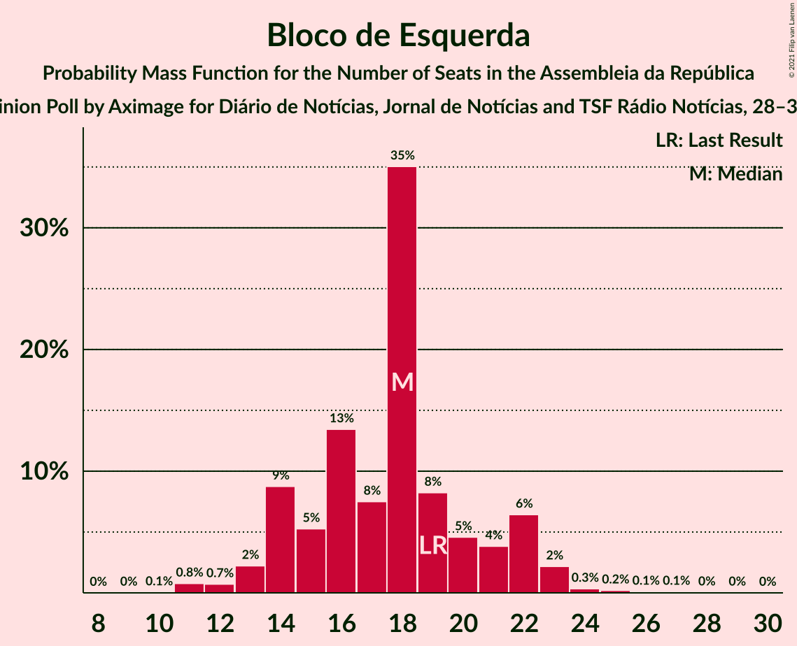

# Opinion Poll by Aximage for Diário de Notícias, Jornal de Notícias and TSF Rádio Notícias, 28–31 October 2021

<a href="#voting-intentions">Voting Intentions</a> | <a href="#seats">Seats</a> | <a href="#coalitions">Coalitions</a> | <a href="#technical-information">Technical Information</a>

## Voting Intentions

### Confidence Intervals

| Party | Last Result | Poll Result | 80% Confidence Interval | 90% Confidence Interval | 95% Confidence Interval | 99% Confidence Interval |
|:-----:|:-----------:|:-----------:|:-----------------------:|:-----------------------:|:-----------------------:|:-----------------------:|
| Partido Socialista | 36.4% | 38.5% | 36.3–40.7% |35.7–41.4% |35.2–41.9% |34.1–43.0% |
| Partido Social Democrata | 27.8% | 24.4% | 22.5–26.4% |22.0–27.0% |21.6–27.5% |20.7–28.5% |
| Bloco de Esquerda | 9.5% | 8.8% | 7.7–10.3% |7.3–10.7% |7.1–11.0% |6.5–11.7% |
| Chega | 1.3% | 7.7% | 6.6–9.1% |6.3–9.4% |6.1–9.8% |5.6–10.5% |
| Iniciativa Liberal | 1.3% | 4.7% | 3.9–5.8% |3.7–6.2% |3.5–6.4% |3.1–7.0% |
| Coligação Democrática Unitária | 6.3% | 4.6% | 3.8–5.7% |3.6–6.0% |3.4–6.3% |3.0–6.9% |
| Pessoas–Animais–Natureza | 3.3% | 2.9% | 2.2–3.8% |2.1–4.0% |1.9–4.3% |1.6–4.8% |
| CDS–Partido Popular | 4.2% | 2.0% | 1.5–2.8% |1.3–3.0% |1.2–3.2% |1.0–3.6% |

*Note:* The poll result column reflects the actual value used in the calculations. Published results may vary slightly, and in addition be rounded to fewer digits.

## Seats

### Confidence Intervals

| Party | Last Result | Median | 80% Confidence Interval | 90% Confidence Interval | 95% Confidence Interval | 99% Confidence Interval |
|:-----:|:-----------:|:------:|:-----------------------:|:-----------------------:|:-----------------------:|:-----------------------:|
| <a href="#partido-socialista">Partido Socialista</a> | 108 | 113 | 107–120 |105–123 |103–125 |101–128 |
| <a href="#partido-social-democrata">Partido Social Democrata</a> | 79 | 67 | 61–75 |58–76 |57–77 |55–80 |
| <a href="#bloco-de-esquerda">Bloco de Esquerda</a> | 19 | 18 | 14–21 |14–22 |13–23 |11–25 |
| <a href="#chega">Chega</a> | 1 | 13 | 11–17 |10–19 |10–20 |8–22 |
| <a href="#iniciativa-liberal">Iniciativa Liberal</a> | 1 | 6 | 5–10 |5–11 |4–12 |4–12 |
| <a href="#coligação-democrática-unitária">Coligação Democrática Unitária</a> | 12 | 6 | 5–10 |5–10 |4–10 |3–13 |
| <a href="#pessoas–animais–natureza">Pessoas–Animais–Natureza</a> | 4 | 2 | 2–4 |2–4 |1–5 |1–6 |
| <a href="#cds–partido-popular">CDS–Partido Popular</a> | 5 | 1 | 0–2 |0–2 |0–2 |0–3 |

### Partido Socialista

*For a full overview of the results for this party, see the [Partido Socialista](party-partidosocialista.html) page.*

| Number of Seats | Probability | Accumulated | Special Marks |
|:---------------:|:-----------:|:-----------:|:-------------:|
| 96 | 0% | 100% |  |
| 97 | 0.1% | 99.9% |  |
| 98 | 0.1% | 99.9% |  |
| 99 | 0.1% | 99.8% |  |
| 100 | 0.2% | 99.7% |  |
| 101 | 0.5% | 99.6% |  |
| 102 | 0.6% | 99.0% |  |
| 103 | 1.0% | 98% |  |
| 104 | 1.0% | 97% |  |
| 105 | 3% | 96% |  |
| 106 | 3% | 94% |  |
| 107 | 5% | 91% |  |
| 108 | 6% | 86% | Last Result |
| 109 | 5% | 80% |  |
| 110 | 6% | 75% |  |
| 111 | 8% | 69% |  |
| 112 | 9% | 61% |  |
| 113 | 6% | 52% | Median |
| 114 | 8% | 47% |  |
| 115 | 7% | 39% |  |
| 116 | 6% | 32% | Majority |
| 117 | 5% | 26% |  |
| 118 | 4% | 20% |  |
| 119 | 3% | 16% |  |
| 120 | 5% | 13% |  |
| 121 | 2% | 8% |  |
| 122 | 1.4% | 7% |  |
| 123 | 2% | 5% |  |
| 124 | 1.1% | 4% |  |
| 125 | 0.9% | 3% |  |
| 126 | 0.6% | 2% |  |
| 127 | 0.3% | 1.1% |  |
| 128 | 0.5% | 0.8% |  |
| 129 | 0.1% | 0.3% |  |
| 130 | 0.1% | 0.2% |  |
| 131 | 0% | 0.1% |  |
| 132 | 0% | 0% |  |

### Partido Social Democrata

*For a full overview of the results for this party, see the [Partido Social Democrata](party-partidosocialdemocrata.html) page.*

| Number of Seats | Probability | Accumulated | Special Marks |
|:---------------:|:-----------:|:-----------:|:-------------:|
| 53 | 0.1% | 100% |  |
| 54 | 0.2% | 99.9% |  |
| 55 | 0.7% | 99.7% |  |
| 56 | 0.3% | 99.0% |  |
| 57 | 2% | 98.7% |  |
| 58 | 2% | 97% |  |
| 59 | 2% | 95% |  |
| 60 | 2% | 93% |  |
| 61 | 4% | 91% |  |
| 62 | 2% | 87% |  |
| 63 | 3% | 85% |  |
| 64 | 5% | 82% |  |
| 65 | 7% | 76% |  |
| 66 | 13% | 70% |  |
| 67 | 8% | 57% | Median |
| 68 | 8% | 49% |  |
| 69 | 8% | 41% |  |
| 70 | 7% | 33% |  |
| 71 | 6% | 26% |  |
| 72 | 3% | 20% |  |
| 73 | 3% | 17% |  |
| 74 | 3% | 14% |  |
| 75 | 5% | 11% |  |
| 76 | 2% | 7% |  |
| 77 | 3% | 5% |  |
| 78 | 1.0% | 2% |  |
| 79 | 0.3% | 0.9% | Last Result |
| 80 | 0.3% | 0.6% |  |
| 81 | 0.1% | 0.3% |  |
| 82 | 0.1% | 0.2% |  |
| 83 | 0% | 0.1% |  |
| 84 | 0% | 0% |  |

### Bloco de Esquerda

*For a full overview of the results for this party, see the [Bloco de Esquerda](party-blocodeesquerda.html) page.*

| Number of Seats | Probability | Accumulated | Special Marks |
|:---------------:|:-----------:|:-----------:|:-------------:|
| 9 | 0% | 100% |  |
| 10 | 0.1% | 99.9% |  |
| 11 | 0.8% | 99.9% |  |
| 12 | 0.7% | 99.1% |  |
| 13 | 2% | 98% |  |
| 14 | 9% | 96% |  |
| 15 | 5% | 87% |  |
| 16 | 13% | 82% |  |
| 17 | 8% | 69% |  |
| 18 | 35% | 61% | Median |
| 19 | 8% | 26% | Last Result |
| 20 | 5% | 18% |  |
| 21 | 4% | 13% |  |
| 22 | 6% | 9% |  |
| 23 | 2% | 3% |  |
| 24 | 0.3% | 0.9% |  |
| 25 | 0.2% | 0.5% |  |
| 26 | 0.1% | 0.3% |  |
| 27 | 0.1% | 0.2% |  |
| 28 | 0% | 0.1% |  |
| 29 | 0% | 0.1% |  |
| 30 | 0% | 0% |  |

### Chega

*For a full overview of the results for this party, see the [Chega](party-chega.html) page.*

| Number of Seats | Probability | Accumulated | Special Marks |
|:---------------:|:-----------:|:-----------:|:-------------:|
| 1 | 0% | 100% | Last Result |
| 2 | 0% | 100% |  |
| 3 | 0% | 100% |  |
| 4 | 0% | 100% |  |
| 5 | 0% | 100% |  |
| 6 | 0% | 100% |  |
| 7 | 0% | 100% |  |
| 8 | 0.9% | 99.9% |  |
| 9 | 1.0% | 99.1% |  |
| 10 | 4% | 98% |  |
| 11 | 25% | 94% |  |
| 12 | 11% | 69% |  |
| 13 | 9% | 58% | Median |
| 14 | 29% | 49% |  |
| 15 | 6% | 20% |  |
| 16 | 3% | 14% |  |
| 17 | 2% | 11% |  |
| 18 | 2% | 9% |  |
| 19 | 4% | 7% |  |
| 20 | 2% | 3% |  |
| 21 | 0.9% | 2% |  |
| 22 | 0.2% | 0.6% |  |
| 23 | 0.2% | 0.4% |  |
| 24 | 0.2% | 0.2% |  |
| 25 | 0% | 0.1% |  |
| 26 | 0% | 0% |  |

### Iniciativa Liberal

*For a full overview of the results for this party, see the [Iniciativa Liberal](party-iniciativaliberal.html) page.*

| Number of Seats | Probability | Accumulated | Special Marks |
|:---------------:|:-----------:|:-----------:|:-------------:|
| 1 | 0% | 100% | Last Result |
| 2 | 0% | 100% |  |
| 3 | 0.4% | 100% |  |
| 4 | 3% | 99.6% |  |
| 5 | 12% | 96% |  |
| 6 | 54% | 84% | Median |
| 7 | 6% | 31% |  |
| 8 | 3% | 25% |  |
| 9 | 7% | 22% |  |
| 10 | 9% | 14% |  |
| 11 | 2% | 6% |  |
| 12 | 4% | 4% |  |
| 13 | 0.2% | 0.3% |  |
| 14 | 0.1% | 0.1% |  |
| 15 | 0% | 0% |  |

### Coligação Democrática Unitária

*For a full overview of the results for this party, see the [Coligação Democrática Unitária](party-coligaçãodemocráticaunitária.html) page.*

| Number of Seats | Probability | Accumulated | Special Marks |
|:---------------:|:-----------:|:-----------:|:-------------:|
| 2 | 0.2% | 100% |  |
| 3 | 1.5% | 99.8% |  |
| 4 | 2% | 98% |  |
| 5 | 15% | 96% |  |
| 6 | 37% | 81% | Median |
| 7 | 17% | 45% |  |
| 8 | 10% | 28% |  |
| 9 | 5% | 18% |  |
| 10 | 11% | 13% |  |
| 11 | 0.8% | 2% |  |
| 12 | 0.4% | 2% | Last Result |
| 13 | 0.6% | 1.1% |  |
| 14 | 0.3% | 0.5% |  |
| 15 | 0.1% | 0.1% |  |
| 16 | 0% | 0% |  |

### Pessoas–Animais–Natureza

*For a full overview of the results for this party, see the [Pessoas–Animais–Natureza](party-pessoas–animais–natureza.html) page.*

| Number of Seats | Probability | Accumulated | Special Marks |
|:---------------:|:-----------:|:-----------:|:-------------:|
| 0 | 0.1% | 100% |  |
| 1 | 5% | 99.9% |  |
| 2 | 47% | 95% | Median |
| 3 | 17% | 48% |  |
| 4 | 26% | 31% | Last Result |
| 5 | 4% | 5% |  |
| 6 | 0.8% | 1.1% |  |
| 7 | 0.1% | 0.3% |  |
| 8 | 0.1% | 0.2% |  |
| 9 | 0.1% | 0.1% |  |
| 10 | 0% | 0% |  |

### CDS–Partido Popular

*For a full overview of the results for this party, see the [CDS–Partido Popular](party-cds–partidopopular.html) page.*

| Number of Seats | Probability | Accumulated | Special Marks |
|:---------------:|:-----------:|:-----------:|:-------------:|
| 0 | 39% | 100% |  |
| 1 | 49% | 61% | Median |
| 2 | 11% | 13% |  |
| 3 | 1.4% | 2% |  |
| 4 | 0.1% | 0.2% |  |
| 5 | 0.1% | 0.1% | Last Result |
| 6 | 0% | 0% |  |

## Coalitions

### Confidence Intervals

| Coalition | Last Result | Median | Majority? | 80% Confidence Interval | 90% Confidence Interval | 95% Confidence Interval | 99% Confidence Interval |
|:---------:|:-----------:|:------:|:---------:|:-----------------------:|:-----------------------:|:-----------------------:|:-----------------------:|
| Partido Socialista – Bloco de Esquerda – Coligação Democrática Unitária | 139 | 137 | 100% | 130–145 | 129–147 | 128–149 | 125–152 |
| Partido Socialista – Bloco de Esquerda | 127 | 131 | 99.9% | 124–138 | 122–140 | 121–142 | 118–146 |
| Partido Socialista – Coligação Democrática Unitária | 120 | 120 | 79% | 113–127 | 112–129 | 110–131 | 107–136 |
| Partido Socialista | 108 | 113 | 32% | 107–120 | 105–123 | 103–125 | 101–128 |
| Partido Social Democrata – CDS–Partido Popular | 84 | 68 | 0% | 61–76 | 59–77 | 58–78 | 55–81 |

### Partido Socialista – Bloco de Esquerda – Coligação Democrática Unitária

| Number of Seats | Probability | Accumulated | Special Marks |
|:---------------:|:-----------:|:-----------:|:-------------:|
| 121 | 0% | 100% |  |
| 122 | 0.1% | 99.9% |  |
| 123 | 0.1% | 99.8% |  |
| 124 | 0.2% | 99.7% |  |
| 125 | 0.5% | 99.5% |  |
| 126 | 0.5% | 99.0% |  |
| 127 | 0.8% | 98.5% |  |
| 128 | 2% | 98% |  |
| 129 | 2% | 96% |  |
| 130 | 5% | 94% |  |
| 131 | 3% | 89% |  |
| 132 | 5% | 86% |  |
| 133 | 4% | 82% |  |
| 134 | 5% | 77% |  |
| 135 | 10% | 73% |  |
| 136 | 8% | 63% |  |
| 137 | 6% | 55% | Median |
| 138 | 7% | 49% |  |
| 139 | 6% | 43% | Last Result |
| 140 | 7% | 37% |  |
| 141 | 4% | 30% |  |
| 142 | 4% | 26% |  |
| 143 | 5% | 22% |  |
| 144 | 5% | 17% |  |
| 145 | 4% | 12% |  |
| 146 | 2% | 8% |  |
| 147 | 2% | 6% |  |
| 148 | 1.3% | 4% |  |
| 149 | 1.5% | 3% |  |
| 150 | 0.5% | 2% |  |
| 151 | 0.3% | 1.0% |  |
| 152 | 0.3% | 0.7% |  |
| 153 | 0.1% | 0.4% |  |
| 154 | 0.3% | 0.3% |  |
| 155 | 0% | 0% |  |

### Partido Socialista – Bloco de Esquerda

| Number of Seats | Probability | Accumulated | Special Marks |
|:---------------:|:-----------:|:-----------:|:-------------:|
| 114 | 0% | 100% |  |
| 115 | 0.1% | 99.9% |  |
| 116 | 0.1% | 99.9% | Majority |
| 117 | 0.2% | 99.7% |  |
| 118 | 0.4% | 99.6% |  |
| 119 | 0.5% | 99.2% |  |
| 120 | 0.8% | 98.8% |  |
| 121 | 1.1% | 98% |  |
| 122 | 2% | 97% |  |
| 123 | 3% | 95% |  |
| 124 | 4% | 92% |  |
| 125 | 6% | 87% |  |
| 126 | 4% | 82% |  |
| 127 | 5% | 78% | Last Result |
| 128 | 7% | 73% |  |
| 129 | 8% | 65% |  |
| 130 | 7% | 57% |  |
| 131 | 7% | 50% | Median |
| 132 | 6% | 43% |  |
| 133 | 8% | 37% |  |
| 134 | 4% | 29% |  |
| 135 | 4% | 26% |  |
| 136 | 4% | 22% |  |
| 137 | 4% | 18% |  |
| 138 | 5% | 14% |  |
| 139 | 3% | 9% |  |
| 140 | 2% | 6% |  |
| 141 | 2% | 5% |  |
| 142 | 1.1% | 3% |  |
| 143 | 0.6% | 2% |  |
| 144 | 0.4% | 1.1% |  |
| 145 | 0.2% | 0.8% |  |
| 146 | 0.3% | 0.5% |  |
| 147 | 0.1% | 0.3% |  |
| 148 | 0.1% | 0.2% |  |
| 149 | 0.1% | 0.1% |  |
| 150 | 0% | 0% |  |

### Partido Socialista – Coligação Democrática Unitária

| Number of Seats | Probability | Accumulated | Special Marks |
|:---------------:|:-----------:|:-----------:|:-------------:|
| 103 | 0.1% | 100% |  |
| 104 | 0.1% | 99.9% |  |
| 105 | 0.1% | 99.8% |  |
| 106 | 0.2% | 99.8% |  |
| 107 | 0.3% | 99.6% |  |
| 108 | 0.4% | 99.2% |  |
| 109 | 0.6% | 98.9% |  |
| 110 | 0.9% | 98% |  |
| 111 | 1.5% | 97% |  |
| 112 | 2% | 96% |  |
| 113 | 4% | 93% |  |
| 114 | 6% | 90% |  |
| 115 | 5% | 84% |  |
| 116 | 4% | 79% | Majority |
| 117 | 10% | 75% |  |
| 118 | 7% | 65% |  |
| 119 | 5% | 58% | Median |
| 120 | 8% | 53% | Last Result |
| 121 | 5% | 45% |  |
| 122 | 9% | 41% |  |
| 123 | 6% | 31% |  |
| 124 | 4% | 26% |  |
| 125 | 8% | 22% |  |
| 126 | 2% | 14% |  |
| 127 | 3% | 13% |  |
| 128 | 2% | 9% |  |
| 129 | 2% | 7% |  |
| 130 | 2% | 5% |  |
| 131 | 1.0% | 3% |  |
| 132 | 0.7% | 2% |  |
| 133 | 0.3% | 1.3% |  |
| 134 | 0.3% | 1.0% |  |
| 135 | 0.2% | 0.7% |  |
| 136 | 0.5% | 0.5% |  |
| 137 | 0% | 0.1% |  |
| 138 | 0% | 0% |  |

### Partido Socialista

| Number of Seats | Probability | Accumulated | Special Marks |
|:---------------:|:-----------:|:-----------:|:-------------:|
| 96 | 0% | 100% |  |
| 97 | 0.1% | 99.9% |  |
| 98 | 0.1% | 99.9% |  |
| 99 | 0.1% | 99.8% |  |
| 100 | 0.2% | 99.7% |  |
| 101 | 0.5% | 99.6% |  |
| 102 | 0.6% | 99.0% |  |
| 103 | 1.0% | 98% |  |
| 104 | 1.0% | 97% |  |
| 105 | 3% | 96% |  |
| 106 | 3% | 94% |  |
| 107 | 5% | 91% |  |
| 108 | 6% | 86% | Last Result |
| 109 | 5% | 80% |  |
| 110 | 6% | 75% |  |
| 111 | 8% | 69% |  |
| 112 | 9% | 61% |  |
| 113 | 6% | 52% | Median |
| 114 | 8% | 47% |  |
| 115 | 7% | 39% |  |
| 116 | 6% | 32% | Majority |
| 117 | 5% | 26% |  |
| 118 | 4% | 20% |  |
| 119 | 3% | 16% |  |
| 120 | 5% | 13% |  |
| 121 | 2% | 8% |  |
| 122 | 1.4% | 7% |  |
| 123 | 2% | 5% |  |
| 124 | 1.1% | 4% |  |
| 125 | 0.9% | 3% |  |
| 126 | 0.6% | 2% |  |
| 127 | 0.3% | 1.1% |  |
| 128 | 0.5% | 0.8% |  |
| 129 | 0.1% | 0.3% |  |
| 130 | 0.1% | 0.2% |  |
| 131 | 0% | 0.1% |  |
| 132 | 0% | 0% |  |

### Partido Social Democrata – CDS–Partido Popular

| Number of Seats | Probability | Accumulated | Special Marks |
|:---------------:|:-----------:|:-----------:|:-------------:|
| 54 | 0.1% | 100% |  |
| 55 | 0.4% | 99.9% |  |
| 56 | 0.4% | 99.4% |  |
| 57 | 0.7% | 99.0% |  |
| 58 | 2% | 98% |  |
| 59 | 2% | 97% |  |
| 60 | 2% | 95% |  |
| 61 | 4% | 93% |  |
| 62 | 2% | 88% |  |
| 63 | 2% | 86% |  |
| 64 | 5% | 84% |  |
| 65 | 4% | 79% |  |
| 66 | 8% | 75% |  |
| 67 | 12% | 67% |  |
| 68 | 8% | 55% | Median |
| 69 | 7% | 47% |  |
| 70 | 9% | 40% |  |
| 71 | 5% | 30% |  |
| 72 | 5% | 25% |  |
| 73 | 4% | 20% |  |
| 74 | 2% | 16% |  |
| 75 | 3% | 14% |  |
| 76 | 5% | 11% |  |
| 77 | 3% | 6% |  |
| 78 | 1.4% | 3% |  |
| 79 | 0.9% | 2% |  |
| 80 | 0.3% | 0.9% |  |
| 81 | 0.3% | 0.6% |  |
| 82 | 0.1% | 0.3% |  |
| 83 | 0.1% | 0.1% |  |
| 84 | 0% | 0.1% | Last Result |
| 85 | 0% | 0% |  |

## Technical Information

### Opinion Poll

+ **Polling firm:** Aximage
+ **Commissioner(s):** Diário de Notícias, Jornal de Notícias and TSF Rádio Notícias
+ **Fieldwork period:** 28–31 October 2021

### Calculations

+ **Sample size:** 803
+ **Simulations done:** 1,048,576
+ **Error estimate:** 0.84%

