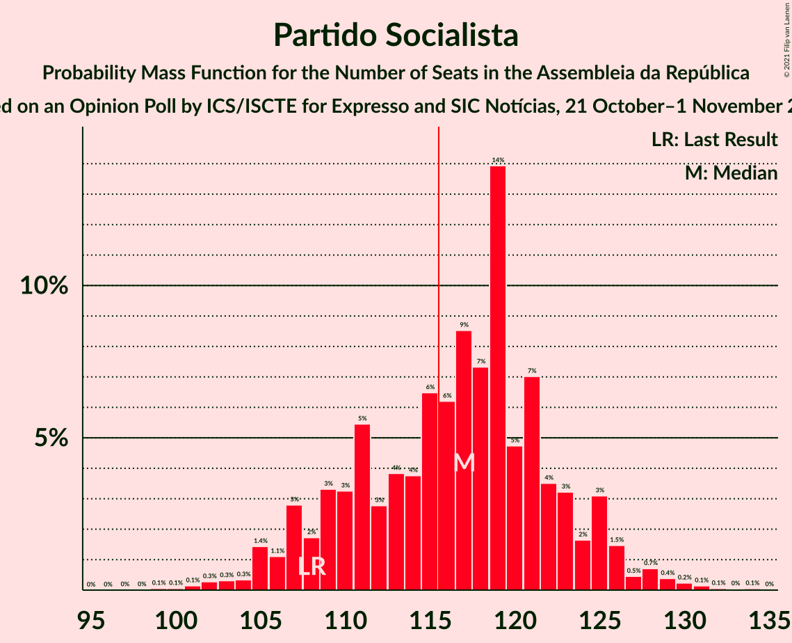
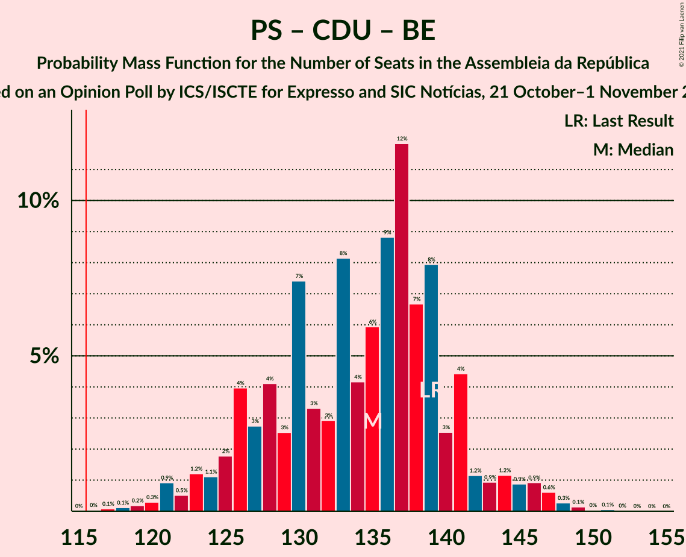

# Opinion Poll by ICS/ISCTE for Expresso and SIC Notícias, 21 October–1 November 2021

<a href="#voting-intentions">Voting Intentions</a> | <a href="#seats">Seats</a> | <a href="#coalitions">Coalitions</a> | <a href="#technical-information">Technical Information</a>

## Voting Intentions

### Confidence Intervals

| Party | Last Result | Poll Result | 80% Confidence Interval | 90% Confidence Interval | 95% Confidence Interval | 99% Confidence Interval |
|:-----:|:-----------:|:-----------:|:-----------------------:|:-----------------------:|:-----------------------:|:-----------------------:|
| Partido Socialista | 36.4% | 40.0% | 37.8–42.2% |37.2–42.9% |36.7–43.4% |35.6–44.5% |
| Partido Social Democrata | 27.8% | 26.0% | 24.1–28.1% |23.5–28.7% |23.1–29.2% |22.2–30.2% |
| Chega | 1.3% | 10.0% | 8.7–11.5% |8.4–11.9% |8.1–12.3% |7.5–13.0% |
| Coligação Democrática Unitária | 6.3% | 6.0% | 5.0–7.2% |4.8–7.6% |4.6–7.9% |4.1–8.5% |
| Bloco de Esquerda | 9.5% | 5.0% | 4.1–6.1% |3.9–6.5% |3.7–6.8% |3.3–7.3% |
| Pessoas–Animais–Natureza | 3.3% | 2.0% | 1.5–2.8% |1.4–3.0% |1.2–3.2% |1.0–3.7% |
| Iniciativa Liberal | 1.3% | 2.0% | 1.5–2.8% |1.4–3.0% |1.2–3.2% |1.0–3.7% |
| CDS–Partido Popular | 4.2% | 1.0% | 0.7–1.6% |0.6–1.8% |0.5–2.0% |0.4–2.3% |

*Note:* The poll result column reflects the actual value used in the calculations. Published results may vary slightly, and in addition be rounded to fewer digits.

## Seats

### Confidence Intervals

| Party | Last Result | Median | 80% Confidence Interval | 90% Confidence Interval | 95% Confidence Interval | 99% Confidence Interval |
|:-----:|:-----------:|:------:|:-----------------------:|:-----------------------:|:-----------------------:|:-----------------------:|
| <a href="#partido-socialista">Partido Socialista</a> | 108 | 117 | 109–123 |107–125 |105–126 |102–130 |
| <a href="#partido-social-democrata">Partido Social Democrata</a> | 79 | 70 | 65–78 |64–79 |62–81 |60–84 |
| <a href="#chega">Chega</a> | 1 | 20 | 16–24 |14–26 |14–27 |12–29 |
| <a href="#coligação-democrática-unitária">Coligação Democrática Unitária</a> | 12 | 10 | 7–14 |6–15 |6–16 |5–18 |
| <a href="#bloco-de-esquerda">Bloco de Esquerda</a> | 19 | 7 | 5–10 |5–11 |3–11 |2–13 |
| <a href="#pessoas–animais–natureza">Pessoas–Animais–Natureza</a> | 4 | 2 | 1–2 |0–3 |0–3 |0–4 |
| <a href="#iniciativa-liberal">Iniciativa Liberal</a> | 1 | 3 | 1–3 |1–3 |1–4 |1–5 |
| <a href="#cds–partido-popular">CDS–Partido Popular</a> | 5 | 0 | 0 |0 |0–1 |0–1 |

### Partido Socialista

*For a full overview of the results for this party, see the [Partido Socialista](party-partidosocialista.html) page.*

| Number of Seats | Probability | Accumulated | Special Marks |
|:---------------:|:-----------:|:-----------:|:-------------:|
| 99 | 0.1% | 100% |  |
| 100 | 0.1% | 99.9% |  |
| 101 | 0.1% | 99.8% |  |
| 102 | 0.3% | 99.7% |  |
| 103 | 0.3% | 99.4% |  |
| 104 | 0.3% | 99.1% |  |
| 105 | 1.4% | 98.8% |  |
| 106 | 1.1% | 97% |  |
| 107 | 3% | 96% |  |
| 108 | 2% | 93% | Last Result |
| 109 | 3% | 92% |  |
| 110 | 3% | 88% |  |
| 111 | 5% | 85% |  |
| 112 | 3% | 80% |  |
| 113 | 4% | 77% |  |
| 114 | 4% | 73% |  |
| 115 | 6% | 69% |  |
| 116 | 6% | 63% | Majority |
| 117 | 9% | 57% | Median |
| 118 | 7% | 48% |  |
| 119 | 14% | 41% |  |
| 120 | 5% | 27% |  |
| 121 | 7% | 22% |  |
| 122 | 4% | 15% |  |
| 123 | 3% | 12% |  |
| 124 | 2% | 8% |  |
| 125 | 3% | 7% |  |
| 126 | 1.5% | 4% |  |
| 127 | 0.5% | 2% |  |
| 128 | 0.7% | 2% |  |
| 129 | 0.4% | 0.9% |  |
| 130 | 0.2% | 0.6% |  |
| 131 | 0.1% | 0.3% |  |
| 132 | 0.1% | 0.2% |  |
| 133 | 0% | 0.1% |  |
| 134 | 0.1% | 0.1% |  |
| 135 | 0% | 0% |  |

### Partido Social Democrata

*For a full overview of the results for this party, see the [Partido Social Democrata](party-partidosocialdemocrata.html) page.*

| Number of Seats | Probability | Accumulated | Special Marks |
|:---------------:|:-----------:|:-----------:|:-------------:|
| 56 | 0.1% | 100% |  |
| 57 | 0.1% | 99.9% |  |
| 58 | 0.1% | 99.8% |  |
| 59 | 0.1% | 99.7% |  |
| 60 | 0.2% | 99.6% |  |
| 61 | 0.3% | 99.3% |  |
| 62 | 2% | 99.0% |  |
| 63 | 2% | 97% |  |
| 64 | 2% | 95% |  |
| 65 | 7% | 93% |  |
| 66 | 1.4% | 87% |  |
| 67 | 8% | 85% |  |
| 68 | 10% | 77% |  |
| 69 | 13% | 67% |  |
| 70 | 11% | 54% | Median |
| 71 | 3% | 43% |  |
| 72 | 4% | 40% |  |
| 73 | 4% | 36% |  |
| 74 | 4% | 32% |  |
| 75 | 7% | 27% |  |
| 76 | 6% | 20% |  |
| 77 | 3% | 14% |  |
| 78 | 3% | 11% |  |
| 79 | 3% | 8% | Last Result |
| 80 | 2% | 5% |  |
| 81 | 1.0% | 3% |  |
| 82 | 0.4% | 2% |  |
| 83 | 0.4% | 1.4% |  |
| 84 | 0.5% | 1.0% |  |
| 85 | 0.3% | 0.5% |  |
| 86 | 0.1% | 0.2% |  |
| 87 | 0% | 0.1% |  |
| 88 | 0.1% | 0.1% |  |
| 89 | 0% | 0.1% |  |
| 90 | 0% | 0% |  |

### Chega

*For a full overview of the results for this party, see the [Chega](party-chega.html) page.*

| Number of Seats | Probability | Accumulated | Special Marks |
|:---------------:|:-----------:|:-----------:|:-------------:|
| 1 | 0% | 100% | Last Result |
| 2 | 0% | 100% |  |
| 3 | 0% | 100% |  |
| 4 | 0% | 100% |  |
| 5 | 0% | 100% |  |
| 6 | 0% | 100% |  |
| 7 | 0% | 100% |  |
| 8 | 0% | 100% |  |
| 9 | 0% | 100% |  |
| 10 | 0% | 100% |  |
| 11 | 0.2% | 100% |  |
| 12 | 0.5% | 99.8% |  |
| 13 | 2% | 99.3% |  |
| 14 | 5% | 98% |  |
| 15 | 1.4% | 92% |  |
| 16 | 6% | 91% |  |
| 17 | 7% | 85% |  |
| 18 | 18% | 78% |  |
| 19 | 8% | 60% |  |
| 20 | 12% | 52% | Median |
| 21 | 9% | 40% |  |
| 22 | 12% | 31% |  |
| 23 | 4% | 19% |  |
| 24 | 6% | 15% |  |
| 25 | 3% | 9% |  |
| 26 | 3% | 6% |  |
| 27 | 0.6% | 3% |  |
| 28 | 1.1% | 2% |  |
| 29 | 0.4% | 0.8% |  |
| 30 | 0.3% | 0.4% |  |
| 31 | 0.1% | 0.1% |  |
| 32 | 0% | 0% |  |

### Coligação Democrática Unitária

*For a full overview of the results for this party, see the [Coligação Democrática Unitária](party-coligaçãodemocráticaunitária.html) page.*

| Number of Seats | Probability | Accumulated | Special Marks |
|:---------------:|:-----------:|:-----------:|:-------------:|
| 5 | 2% | 100% |  |
| 6 | 3% | 98% |  |
| 7 | 12% | 94% |  |
| 8 | 6% | 83% |  |
| 9 | 14% | 77% |  |
| 10 | 18% | 62% | Median |
| 11 | 9% | 44% |  |
| 12 | 10% | 35% | Last Result |
| 13 | 9% | 25% |  |
| 14 | 9% | 16% |  |
| 15 | 4% | 7% |  |
| 16 | 1.4% | 3% |  |
| 17 | 0.8% | 2% |  |
| 18 | 0.7% | 0.8% |  |
| 19 | 0% | 0% |  |

### Bloco de Esquerda

*For a full overview of the results for this party, see the [Bloco de Esquerda](party-blocodeesquerda.html) page.*

| Number of Seats | Probability | Accumulated | Special Marks |
|:---------------:|:-----------:|:-----------:|:-------------:|
| 2 | 1.4% | 100% |  |
| 3 | 1.4% | 98.6% |  |
| 4 | 1.3% | 97% |  |
| 5 | 11% | 96% |  |
| 6 | 4% | 85% |  |
| 7 | 57% | 81% | Median |
| 8 | 7% | 24% |  |
| 9 | 5% | 18% |  |
| 10 | 5% | 13% |  |
| 11 | 6% | 8% |  |
| 12 | 1.1% | 2% |  |
| 13 | 0.3% | 0.8% |  |
| 14 | 0.2% | 0.5% |  |
| 15 | 0.2% | 0.3% |  |
| 16 | 0.1% | 0.1% |  |
| 17 | 0% | 0% |  |
| 18 | 0% | 0% |  |
| 19 | 0% | 0% | Last Result |

### Pessoas–Animais–Natureza

*For a full overview of the results for this party, see the [Pessoas–Animais–Natureza](party-pessoas–animais–natureza.html) page.*

| Number of Seats | Probability | Accumulated | Special Marks |
|:---------------:|:-----------:|:-----------:|:-------------:|
| 0 | 8% | 100% |  |
| 1 | 34% | 92% |  |
| 2 | 52% | 58% | Median |
| 3 | 5% | 6% |  |
| 4 | 1.4% | 2% | Last Result |
| 5 | 0.1% | 0.1% |  |
| 6 | 0% | 0% |  |

### Iniciativa Liberal

*For a full overview of the results for this party, see the [Iniciativa Liberal](party-iniciativaliberal.html) page.*

| Number of Seats | Probability | Accumulated | Special Marks |
|:---------------:|:-----------:|:-----------:|:-------------:|
| 0 | 0.3% | 100% |  |
| 1 | 27% | 99.7% | Last Result |
| 2 | 17% | 72% |  |
| 3 | 51% | 55% | Median |
| 4 | 3% | 4% |  |
| 5 | 1.4% | 1.5% |  |
| 6 | 0.1% | 0.1% |  |
| 7 | 0% | 0% |  |

### CDS–Partido Popular

*For a full overview of the results for this party, see the [CDS–Partido Popular](party-cds–partidopopular.html) page.*

| Number of Seats | Probability | Accumulated | Special Marks |
|:---------------:|:-----------:|:-----------:|:-------------:|
| 0 | 96% | 100% | Median |
| 1 | 4% | 4% |  |
| 2 | 0.1% | 0.1% |  |
| 3 | 0% | 0% |  |
| 4 | 0% | 0% |  |
| 5 | 0% | 0% | Last Result |

## Coalitions

### Confidence Intervals

| Coalition | Last Result | Median | Majority? | 80% Confidence Interval | 90% Confidence Interval | 95% Confidence Interval | 99% Confidence Interval |
|:---------:|:-----------:|:------:|:---------:|:-----------------------:|:-----------------------:|:-----------------------:|:-----------------------:|
| Partido Socialista – Coligação Democrática Unitária – Bloco de Esquerda | 139 | 135 | 100% | 126–141 | 125–143 | 123–145 | 120–148 |
| Partido Socialista – Coligação Democrática Unitária | 120 | 128 | 97% | 119–134 | 117–136 | 115–138 | 112–141 |
| Partido Socialista – Bloco de Esquerda | 127 | 125 | 93% | 116–130 | 114–132 | 112–133 | 109–137 |
| Partido Socialista | 108 | 117 | 63% | 109–123 | 107–125 | 105–126 | 102–130 |
| Partido Social Democrata – CDS–Partido Popular | 84 | 70 | 0% | 65–78 | 64–80 | 62–81 | 60–85 |

### Partido Socialista – Coligação Democrática Unitária – Bloco de Esquerda

| Number of Seats | Probability | Accumulated | Special Marks |
|:---------------:|:-----------:|:-----------:|:-------------:|
| 116 | 0% | 100% | Majority |
| 117 | 0.1% | 99.9% |  |
| 118 | 0.1% | 99.8% |  |
| 119 | 0.2% | 99.7% |  |
| 120 | 0.3% | 99.5% |  |
| 121 | 0.9% | 99.2% |  |
| 122 | 0.5% | 98% |  |
| 123 | 1.2% | 98% |  |
| 124 | 1.1% | 97% |  |
| 125 | 2% | 95% |  |
| 126 | 4% | 94% |  |
| 127 | 3% | 90% |  |
| 128 | 4% | 87% |  |
| 129 | 3% | 83% |  |
| 130 | 7% | 80% |  |
| 131 | 3% | 73% |  |
| 132 | 3% | 70% |  |
| 133 | 8% | 67% |  |
| 134 | 4% | 59% | Median |
| 135 | 6% | 54% |  |
| 136 | 9% | 48% |  |
| 137 | 12% | 40% |  |
| 138 | 7% | 28% |  |
| 139 | 8% | 21% | Last Result |
| 140 | 3% | 13% |  |
| 141 | 4% | 11% |  |
| 142 | 1.2% | 6% |  |
| 143 | 0.9% | 5% |  |
| 144 | 1.2% | 4% |  |
| 145 | 0.9% | 3% |  |
| 146 | 0.9% | 2% |  |
| 147 | 0.6% | 1.2% |  |
| 148 | 0.3% | 0.5% |  |
| 149 | 0.1% | 0.3% |  |
| 150 | 0% | 0.1% |  |
| 151 | 0.1% | 0.1% |  |
| 152 | 0% | 0% |  |

### Partido Socialista – Coligação Democrática Unitária

| Number of Seats | Probability | Accumulated | Special Marks |
|:---------------:|:-----------:|:-----------:|:-------------:|
| 109 | 0% | 100% |  |
| 110 | 0.1% | 99.9% |  |
| 111 | 0.2% | 99.8% |  |
| 112 | 0.3% | 99.7% |  |
| 113 | 0.3% | 99.4% |  |
| 114 | 0.9% | 99.1% |  |
| 115 | 1.0% | 98% |  |
| 116 | 2% | 97% | Majority |
| 117 | 1.2% | 95% |  |
| 118 | 2% | 94% |  |
| 119 | 4% | 92% |  |
| 120 | 3% | 88% | Last Result |
| 121 | 4% | 86% |  |
| 122 | 3% | 82% |  |
| 123 | 6% | 79% |  |
| 124 | 4% | 73% |  |
| 125 | 4% | 69% |  |
| 126 | 8% | 65% |  |
| 127 | 6% | 57% | Median |
| 128 | 5% | 51% |  |
| 129 | 11% | 46% |  |
| 130 | 8% | 35% |  |
| 131 | 7% | 27% |  |
| 132 | 6% | 19% |  |
| 133 | 2% | 14% |  |
| 134 | 5% | 12% |  |
| 135 | 2% | 7% |  |
| 136 | 0.8% | 5% |  |
| 137 | 1.3% | 4% |  |
| 138 | 0.9% | 3% |  |
| 139 | 1.1% | 2% |  |
| 140 | 0.5% | 1.0% |  |
| 141 | 0.2% | 0.5% |  |
| 142 | 0.1% | 0.3% |  |
| 143 | 0.1% | 0.1% |  |
| 144 | 0.1% | 0.1% |  |
| 145 | 0% | 0% |  |

### Partido Socialista – Bloco de Esquerda

| Number of Seats | Probability | Accumulated | Special Marks |
|:---------------:|:-----------:|:-----------:|:-------------:|
| 106 | 0% | 100% |  |
| 107 | 0% | 99.9% |  |
| 108 | 0.1% | 99.9% |  |
| 109 | 0.2% | 99.7% |  |
| 110 | 0.3% | 99.5% |  |
| 111 | 0.2% | 99.2% |  |
| 112 | 2% | 98.9% |  |
| 113 | 0.9% | 97% |  |
| 114 | 2% | 96% |  |
| 115 | 2% | 94% |  |
| 116 | 3% | 93% | Majority |
| 117 | 3% | 90% |  |
| 118 | 4% | 87% |  |
| 119 | 5% | 82% |  |
| 120 | 4% | 78% |  |
| 121 | 4% | 74% |  |
| 122 | 7% | 70% |  |
| 123 | 6% | 63% |  |
| 124 | 6% | 57% | Median |
| 125 | 11% | 52% |  |
| 126 | 10% | 40% |  |
| 127 | 6% | 30% | Last Result |
| 128 | 7% | 24% |  |
| 129 | 4% | 17% |  |
| 130 | 4% | 13% |  |
| 131 | 3% | 9% |  |
| 132 | 2% | 6% |  |
| 133 | 2% | 4% |  |
| 134 | 0.5% | 2% |  |
| 135 | 0.5% | 1.5% |  |
| 136 | 0.3% | 0.9% |  |
| 137 | 0.2% | 0.6% |  |
| 138 | 0.2% | 0.4% |  |
| 139 | 0.1% | 0.2% |  |
| 140 | 0% | 0.1% |  |
| 141 | 0.1% | 0.1% |  |
| 142 | 0% | 0% |  |

### Partido Socialista

| Number of Seats | Probability | Accumulated | Special Marks |
|:---------------:|:-----------:|:-----------:|:-------------:|
| 99 | 0.1% | 100% |  |
| 100 | 0.1% | 99.9% |  |
| 101 | 0.1% | 99.8% |  |
| 102 | 0.3% | 99.7% |  |
| 103 | 0.3% | 99.4% |  |
| 104 | 0.3% | 99.1% |  |
| 105 | 1.4% | 98.8% |  |
| 106 | 1.1% | 97% |  |
| 107 | 3% | 96% |  |
| 108 | 2% | 93% | Last Result |
| 109 | 3% | 92% |  |
| 110 | 3% | 88% |  |
| 111 | 5% | 85% |  |
| 112 | 3% | 80% |  |
| 113 | 4% | 77% |  |
| 114 | 4% | 73% |  |
| 115 | 6% | 69% |  |
| 116 | 6% | 63% | Majority |
| 117 | 9% | 57% | Median |
| 118 | 7% | 48% |  |
| 119 | 14% | 41% |  |
| 120 | 5% | 27% |  |
| 121 | 7% | 22% |  |
| 122 | 4% | 15% |  |
| 123 | 3% | 12% |  |
| 124 | 2% | 8% |  |
| 125 | 3% | 7% |  |
| 126 | 1.5% | 4% |  |
| 127 | 0.5% | 2% |  |
| 128 | 0.7% | 2% |  |
| 129 | 0.4% | 0.9% |  |
| 130 | 0.2% | 0.6% |  |
| 131 | 0.1% | 0.3% |  |
| 132 | 0.1% | 0.2% |  |
| 133 | 0% | 0.1% |  |
| 134 | 0.1% | 0.1% |  |
| 135 | 0% | 0% |  |

### Partido Social Democrata – CDS–Partido Popular

| Number of Seats | Probability | Accumulated | Special Marks |
|:---------------:|:-----------:|:-----------:|:-------------:|
| 56 | 0.1% | 100% |  |
| 57 | 0.1% | 99.9% |  |
| 58 | 0.1% | 99.8% |  |
| 59 | 0.1% | 99.7% |  |
| 60 | 0.2% | 99.6% |  |
| 61 | 0.3% | 99.4% |  |
| 62 | 2% | 99.1% |  |
| 63 | 2% | 97% |  |
| 64 | 2% | 95% |  |
| 65 | 7% | 94% |  |
| 66 | 1.0% | 87% |  |
| 67 | 9% | 86% |  |
| 68 | 10% | 77% |  |
| 69 | 12% | 67% |  |
| 70 | 12% | 55% | Median |
| 71 | 3% | 44% |  |
| 72 | 4% | 40% |  |
| 73 | 4% | 36% |  |
| 74 | 4% | 32% |  |
| 75 | 7% | 28% |  |
| 76 | 6% | 21% |  |
| 77 | 4% | 14% |  |
| 78 | 3% | 11% |  |
| 79 | 3% | 8% |  |
| 80 | 2% | 5% |  |
| 81 | 1.0% | 3% |  |
| 82 | 0.4% | 2% |  |
| 83 | 0.4% | 1.4% |  |
| 84 | 0.5% | 1.0% | Last Result |
| 85 | 0.3% | 0.5% |  |
| 86 | 0.1% | 0.2% |  |
| 87 | 0% | 0.2% |  |
| 88 | 0.1% | 0.1% |  |
| 89 | 0% | 0.1% |  |
| 90 | 0% | 0% |  |

## Technical Information

### Opinion Poll

+ **Polling firm:** ICS/ISCTE
+ **Commissioner(s):** Expresso and SIC Notícias
+ **Fieldwork period:** 21 October–1 November 2021

### Calculations

+ **Sample size:** 800
+ **Simulations done:** 1,048,576
+ **Error estimate:** 1.48%

